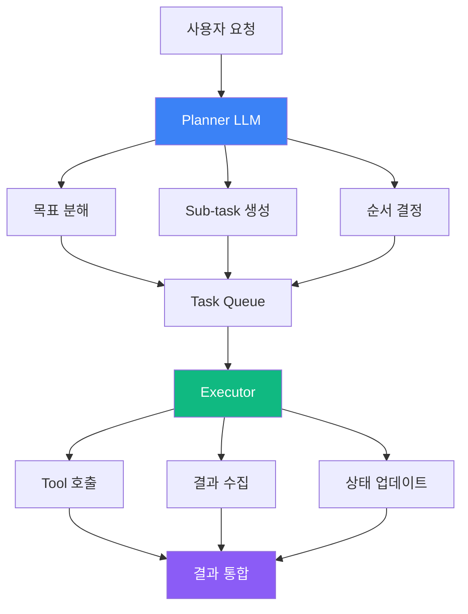
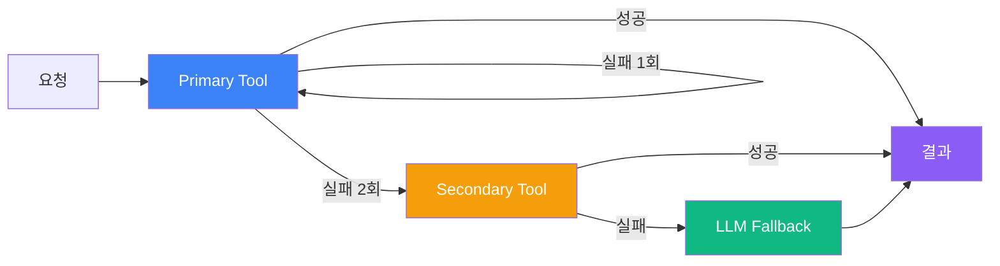
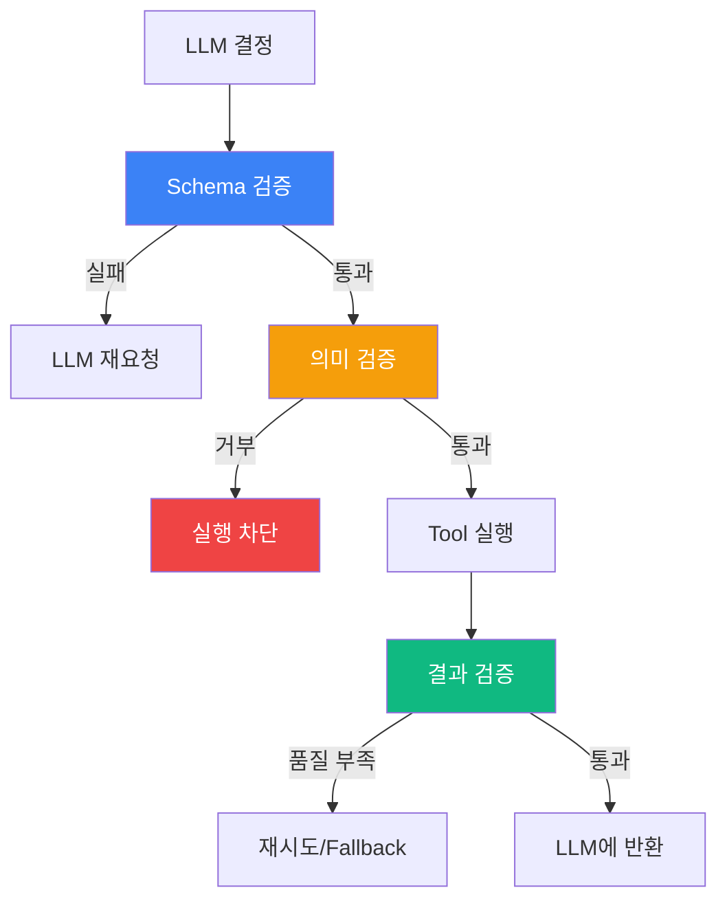
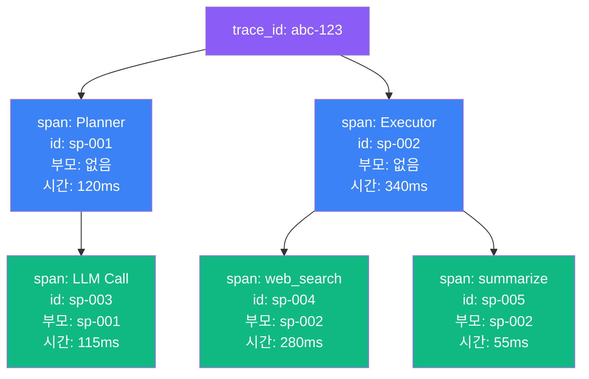

# Day 2
## Agent 제어 흐름 설계 & 상태 관리

<div class="mt-8 text-gray-400 text-lg">
AI Agent 전문 개발 과정
</div>

<div class="mt-4 text-gray-500">
2026 · AI 개발자 / 데이터 엔지니어 / 기술 리더 대상
</div>

<!-- [스크립트]
오늘 Day 2에서는 어제 만든 Agent를 "제대로" 설계하는 방법을 배웁니다.
단순히 LLM을 호출하는 것을 넘어서, 제어 흐름과 상태 관리를 구조적으로 다루는 것이 오늘의 핵심입니다.

[Q&A 대비]
Q: Day 1 내용을 모르면 따라갈 수 있나요?
A: 네. 오늘은 독립적인 내용입니다. Day 1 복습은 첫 30분 안에 자연스럽게 포함됩니다.

전환: 오늘 배울 4가지 세션을 먼저 소개하겠습니다.
시간: 3분
-->

---
transition: slide-left
---

# 오늘의 커리큘럼

<div class="grid grid-cols-2 gap-6 mt-6">

<div class="bg-blue-50 rounded-lg p-4 border border-blue-200">
  <div class="text-blue-700 font-bold text-lg mb-2">Session 1 · 2h</div>
  <div class="text-blue-900 font-semibold">Agent 4요소 구조 설계</div>
  <div class="text-blue-600 text-sm mt-1">Goal · Memory · Tool · Control Logic</div>
</div>

<div class="bg-green-50 rounded-lg p-4 border border-green-200">
  <div class="text-green-700 font-bold text-lg mb-2">Session 2 · 2h</div>
  <div class="text-green-900 font-semibold">LangGraph 제어 흐름 설계</div>
  <div class="text-green-600 text-sm mt-1">Node · Edge · State · 조건 분기</div>
</div>

<div class="bg-orange-50 rounded-lg p-4 border border-orange-200">
  <div class="text-orange-700 font-bold text-lg mb-2">Session 3 · 2h</div>
  <div class="text-orange-900 font-semibold">Tool 호출 통제 & Validation</div>
  <div class="text-orange-600 text-sm mt-1">검증 · Fallback · 루프 방지</div>
</div>

<div class="bg-purple-50 rounded-lg p-4 border border-purple-200">
  <div class="text-purple-700 font-bold text-lg mb-2">Session 4 · 2h</div>
  <div class="text-purple-900 font-semibold">구조 리팩토링 & 확장성</div>
  <div class="text-purple-600 text-sm mt-1">분리 · 결합도 · Trace 설계</div>
</div>

</div>

<!-- [스크립트]
오늘은 4개 세션으로 구성됩니다.
각 세션 2시간, 전반 30분 강의 후 90분 실습이 기본 구성입니다.
실습 비율이 70%이므로, 강의는 핵심만 빠르게 진행합니다.

전환: Session 1부터 시작합니다.
시간: 2분
-->

---
layout: section
transition: fade
---

# Session 1
## Agent 4요소 구조 설계

---
transition: slide-left
---

# Agent를 "제대로" 만든다는 것

<div class="text-center my-8">

<div class="text-2xl text-gray-400 line-through mb-4">"LLM + 몇 가지 Tool을 연결한다"</div>

<div class="text-4xl font-bold text-blue-600">↓</div>

<div class="text-2xl text-gray-800 font-bold mt-4">Goal · Memory · Tool · Control Logic<br>4요소를 명확히 분리한다</div>

</div>

<v-click>
<div class="bg-red-50 border border-red-200 rounded-lg p-4 mt-6">
  <div class="text-red-700 font-bold">⚠ 2026년 프로덕션 Agent 장애 원인 1위</div>
  <div class="text-red-600 mt-1">제어 흐름 미설계 → 무한 루프 / 상태 추적 불가 / 버그 위치 불명</div>
</div>
</v-click>

<!-- [스크립트]
많은 분들이 Agent를 처음 만들 때 "LLM 호출하고 Tool 연결하면 되겠지"라고 생각합니다.
[click]
하지만 프로덕션에 나가면 반드시 문제가 생깁니다. 제어 흐름이 없으면 Agent가 루프에 빠지거나, 왜 실패했는지 알 수 없습니다.
4요소를 명확히 분리하는 것이 해결책입니다.

전환: 4요소를 하나씩 살펴보겠습니다.
시간: 3분
-->

---
transition: slide-left
---

# Agent 4요소

<div class="grid grid-cols-2 gap-4 mt-6">

<v-clicks>

<div class="bg-blue-50 border-l-4 border-blue-500 rounded p-4">
  <div class="font-bold text-blue-800 text-lg">🎯 Goal</div>
  <div class="text-blue-700 mt-1">무엇을 달성해야 하는가</div>
  <div class="text-blue-500 text-sm mt-1">성공 조건 + 실패 조건 정의 필수</div>
</div>

<div class="bg-green-50 border-l-4 border-green-500 rounded p-4">
  <div class="font-bold text-green-800 text-lg">🧠 Memory</div>
  <div class="text-green-700 mt-1">무엇을 기억하는가</div>
  <div class="text-green-500 text-sm mt-1">Working · Episodic · Semantic · Procedural</div>
</div>

<div class="bg-orange-50 border-l-4 border-orange-500 rounded p-4">
  <div class="font-bold text-orange-800 text-lg">🔧 Tool</div>
  <div class="text-orange-700 mt-1">무엇을 할 수 있는가</div>
  <div class="text-orange-500 text-sm mt-1">원자적(atomic) 단일 역할</div>
</div>

<div class="bg-purple-50 border-l-4 border-purple-500 rounded p-4">
  <div class="font-bold text-purple-800 text-lg">⚙️ Control Logic</div>
  <div class="text-purple-700 mt-1">어떻게 판단하는가</div>
  <div class="text-purple-500 text-sm mt-1">Plan → Execute → Observe → Reflect</div>
</div>

</v-clicks>

</div>

<!-- [스크립트]
[click] Goal: 무엇을 달성해야 하는지 정의합니다. 여기서 핵심은 성공 조건과 실패 조건을 모두 명시해야 한다는 것입니다.
[click] Memory: 4가지 레이어가 있습니다. 오늘 실무에서 가장 중요한 것은 Working Memory, 즉 현재 Task 상태입니다.
[click] Tool: 원자적이어야 합니다. 하나의 Tool이 너무 많은 일을 하면 오류를 추적할 수 없습니다.
[click] Control Logic: PEAR 사이클이라고 부릅니다. Plan, Execute, Observe, Reflect. 이 사이클이 Agent의 심장입니다.

전환: Goal을 어떻게 잘못 정의하는지 살펴보겠습니다.
시간: 5분
-->

---
transition: slide-left
---

# Goal: 잘못된 정의 vs 올바른 정의

<div class="grid grid-cols-2 gap-6 mt-4">

<div>
<div class="text-red-600 font-bold mb-3">나쁜 예</div>

```python
# 모호한 Goal
goal = "데이터를 분석해"
```

<div class="bg-red-50 border border-red-200 rounded p-3 mt-3 text-sm text-red-700">
  Agent가 성공 여부를 판단할 수 없음<br>
  → 무한 루프 유발
</div>
</div>

<div>
<div class="text-green-600 font-bold mb-3">좋은 예</div>

```python
goal = Goal(
    description="이상치 탐지",
    success_condition=(
        "이상치 목록 + 보고서 생성 완료"
    ),
    abort_condition=(
        "데이터 접근 실패 또는 3회 초과"
    ),
    max_steps=10
)
```

</div>

</div>

<v-click>
<div class="bg-blue-50 border border-blue-300 rounded p-3 mt-4 text-blue-800">
  <strong>핵심 원칙</strong>: Goal은 반드시 <strong>검증 가능(verifiable)</strong>해야 한다
</div>
</v-click>

<!-- [스크립트]
왼쪽처럼 "데이터를 분석해"라고만 정의하면 Agent는 언제 멈춰야 할지 모릅니다.
오른쪽처럼 성공 조건과 중단 조건을 명시하면 Agent가 스스로 종료 여부를 판단할 수 있습니다.
[click]
핵심은 "검증 가능"해야 한다는 것입니다. "파일이 생성되었는가", "HTTP 200 응답이 왔는가"처럼 코드로 확인할 수 있어야 합니다.

전환: Memory 레이어를 설명하겠습니다.
시간: 4분
-->

---
transition: slide-left
---

# Memory 4 레이어

```
┌─────────────────────────────────────┐
│ Episodic Memory  (이번 세션)        │  ← 가장 빠름, 가장 휘발성
├─────────────────────────────────────┤
│ Working Memory   (현재 Task 상태)   │  ← Agent State에 보관 ★
├─────────────────────────────────────┤
│ Semantic Memory  (도메인 지식)      │  ← Vector DB, RAG
├─────────────────────────────────────┤
│ Procedural Memory (실행 패턴)       │  ← 프롬프트, Few-shot
└─────────────────────────────────────┘
```

<v-clicks>

<div class="bg-yellow-50 border border-yellow-300 rounded p-3 mt-4">
  <strong>Working Memory</strong>가 오늘의 핵심
</div>

<div class="text-gray-600 mt-2">
  → Agent State에 <strong>무엇을</strong> 담을지 결정하는 것이 설계의 핵심<br>
  → 너무 많으면 컨텍스트 오염 / 너무 적으면 판단 오류
</div>

</v-clicks>

<!-- [스크립트]
Memory는 4가지 레이어로 나뉩니다.
[click]
오늘 집중할 것은 Working Memory입니다. Agent State에 저장되는 이 메모리가 제어 흐름의 핵심입니다.
[click]
무엇을 State에 담을지 결정하는 것이 설계 능력입니다. 너무 많이 담으면 LLM 컨텍스트 창이 초과되고, 너무 적게 담으면 다음 단계가 잘못된 판단을 합니다.

전환: Tool 설계 원칙을 살펴보겠습니다.
시간: 3분
-->

---
transition: slide-left
---

# Tool: 원자성(Atomicity)이 핵심

<div class="grid grid-cols-2 gap-6 mt-4">

<div>
<div class="text-red-600 font-bold mb-2">나쁜 설계</div>

```python
def search_and_summarize(query):
    results = web_search(query)
    summary = llm_summarize(results)
    save_to_db(summary)  # 사이드 이펙트!
    return summary
```

<div class="text-red-500 text-sm mt-2">하나의 Tool이 3가지 일을 함<br>→ 오류 위치 추적 불가</div>
</div>

<div>
<div class="text-green-600 font-bold mb-2">좋은 설계</div>

```python
@tool
def web_search(query: str) -> list: ...

@tool
def summarize_text(text: str) -> str: ...

@tool
def save_result(key: str, value: str): ...
```

<div class="text-green-500 text-sm mt-2">각 Tool은 하나의 역할<br>→ 독립 테스트 가능</div>
</div>

</div>

<!-- [스크립트]
Tool을 설계할 때 가장 중요한 원칙은 원자성입니다.
왼쪽처럼 하나의 함수가 검색, 요약, 저장을 모두 하면 어느 단계에서 오류가 났는지 알 수 없습니다.
오른쪽처럼 각 Tool이 하나의 역할만 하면 독립적으로 테스트할 수 있고, 오류 위치를 즉시 파악할 수 있습니다.

전환: Control Logic과 Planner-Executor 패턴으로 넘어갑니다.
시간: 3분
-->

---
transition: slide-left
---

# Planner-Executor 패턴

<div class="flex justify-center mt-4">



</div>

<v-click>
<div class="bg-blue-50 border border-blue-300 rounded p-3 mt-2 text-blue-800 text-sm">
  <strong>분리 이유</strong>: "왜 이걸 했는지"를 Planner에서 추적 가능 → 디버깅 가능
</div>
</v-click>

<!-- [스크립트]
Planner-Executor 패턴은 프로덕션 Agent에서 가장 많이 사용되는 패턴입니다.
Planner는 전략을 결정하고, Executor는 실행만 담당합니다.
[click]
이 분리가 없으면 Agent가 "왜 이걸 했는지" 추적이 불가능합니다. 프로덕션에서 디버깅하려면 반드시 이 분리가 필요합니다.

전환: Single-step과 Multi-step을 비교하겠습니다.
시간: 4분
-->

---
transition: slide-left
---

# Single-step vs Multi-step 판단

<div class="grid grid-cols-2 gap-6 mt-4">

<div class="bg-blue-50 rounded-lg p-5 border border-blue-200">
  <div class="text-blue-800 font-bold text-lg mb-3">Single-step</div>
  <v-clicks>
  <ul class="text-blue-700 space-y-1 text-sm">
    <li>→ LLM 1회 호출로 완료</li>
    <li>→ 상태 관리 불필요</li>
    <li>→ 분류, 요약, 번역</li>
    <li>→ 비용 낮음</li>
  </ul>
  </v-clicks>
</div>

<div class="bg-green-50 rounded-lg p-5 border border-green-200">
  <div class="text-green-800 font-bold text-lg mb-3">Multi-step</div>
  <v-clicks>
  <ul class="text-green-700 space-y-1 text-sm">
    <li>→ 외부 정보 수집 필요</li>
    <li>→ 이전 결과를 다음이 참조</li>
    <li>→ 조사, 계획, 자동화</li>
    <li>→ 실패 복구 가능</li>
  </ul>
  </v-clicks>
</div>

</div>

<v-click>
<div class="bg-gray-100 border border-gray-300 rounded p-3 mt-4 text-center text-gray-800">
  <strong>판단 기준</strong>: "LLM 한 번 호출로 완료되는가?"
  → Yes이면 Single-step
</div>
</v-click>

<!-- [스크립트]
[click][click][click][click] Single-step은 한 번의 LLM 호출로 완료되는 작업입니다. 번역, 분류, 요약이 여기 해당합니다.
[click][click][click][click] Multi-step은 외부 정보가 필요하거나 이전 결과를 다음 단계가 참조해야 할 때 사용합니다.
[click] 판단 기준은 간단합니다: "LLM 한 번으로 끝나는가?" 아니라면 Multi-step입니다.

전환: Session 1 퀴즈입니다.
시간: 3분
-->

---
transition: slide-left
---

# 퀴즈: Agent 4요소

<div class="relative">

<div class="bg-gray-100 rounded-lg p-5 mt-4">
  <div class="text-gray-800 font-bold text-lg mb-4">
    "언제 멈추고 언제 재시도할지 결정하는" 요소는?
  </div>

  <div class="grid grid-cols-2 gap-3">
    <div class="bg-gray-200 rounded p-3 text-gray-700 text-center">A. Goal</div>
    <div class="bg-gray-200 rounded p-3 text-gray-700 text-center">B. Memory</div>
    <div class="bg-gray-200 rounded p-3 text-gray-700 text-center">C. Tool</div>
    <div class="bg-gray-200 rounded p-3 text-gray-700 text-center">D. Control Logic</div>
  </div>
</div>

<v-click-hide>
<div class="absolute inset-0 bg-transparent"></div>
</v-click-hide>

<v-click>
<div class="absolute inset-0 bg-white bg-opacity-95 rounded-lg flex items-center justify-center">
  <div class="text-center">
    <div class="text-6xl mb-4">✅</div>
    <div class="text-2xl font-bold text-green-700">D. Control Logic</div>
    <div class="text-gray-600 mt-2">판단 흐름 전체를 관장 → 멈춤/재시도/중단 결정</div>
  </div>
</div>
</v-click>

</div>

<!-- [스크립트]
여기서 잠깐 퀴즈입니다. 30초 생각해보세요.
[click]
정답은 D, Control Logic입니다. Plan-Execute-Observe-Reflect 사이클을 통해 언제 멈출지, 언제 재시도할지를 결정합니다.

전환: Session 2로 넘어가겠습니다.
시간: 3분
-->

---
layout: section
transition: fade
---

# Session 2
## LangGraph 기반 제어 흐름 설계

---
transition: slide-left
---

# LangGraph가 필요한 이유

<div class="mt-6 space-y-4">

<v-clicks>

<div class="bg-red-50 border-l-4 border-red-400 rounded p-4">
  <div class="font-bold text-red-700">순수 코드의 한계</div>
  <div class="text-red-600 text-sm mt-1">분기가 3개를 넘으면 if-else 지옥 → 흐름 파악 불가</div>
</div>

<div class="bg-red-50 border-l-4 border-red-400 rounded p-4">
  <div class="font-bold text-red-700">재시도 로직</div>
  <div class="text-red-600 text-sm mt-1">재시도 횟수를 추적하고 루프를 제어하려면 별도 State 관리 필요</div>
</div>

<div class="bg-green-50 border-l-4 border-green-400 rounded p-4">
  <div class="font-bold text-green-700">LangGraph의 해결책</div>
  <div class="text-green-600 text-sm mt-1">그래프 구조 → 흐름이 명확 / State 내장 / 시각화 지원 / 체크포인트</div>
</div>

</v-clicks>

</div>

<!-- [스크립트]
[click] 순수 Python 코드로 복잡한 Agent 흐름을 만들면 if-else가 중첩되어 읽을 수 없게 됩니다.
[click] 재시도 로직을 추가하면 더 복잡해집니다. 재시도 횟수, 실패 이유, 다음 행동을 추적하는 변수들이 함수 외부에 생기기 시작합니다.
[click] LangGraph는 이 모든 것을 그래프 구조로 해결합니다. 흐름이 코드로 명확하게 표현되고, State가 내장되어 있으며, 체크포인트로 중간 상태를 저장할 수 있습니다.

전환: LangGraph의 3가지 핵심 개념을 설명하겠습니다.
시간: 3분
-->

---
transition: slide-left
---

# Node · Edge · State

<div class="grid grid-cols-3 gap-4 mt-6">

<div class="bg-blue-50 rounded-lg p-5 border border-blue-200 text-center">
  <div class="text-4xl mb-3">📦</div>
  <div class="text-blue-800 font-bold text-lg">Node</div>
  <div class="text-blue-600 text-sm mt-2">실행 단위</div>
  <div class="text-blue-500 text-xs mt-1">Python 함수</div>
  <div class="bg-blue-100 rounded mt-3 p-2 text-xs text-blue-700 font-mono">
    State → dict
  </div>
</div>

<div class="bg-green-50 rounded-lg p-5 border border-green-200 text-center">
  <div class="text-4xl mb-3">→</div>
  <div class="text-green-800 font-bold text-lg">Edge</div>
  <div class="text-green-600 text-sm mt-2">흐름 연결</div>
  <div class="text-green-500 text-xs mt-1">다음 Node 지정</div>
  <div class="bg-green-100 rounded mt-3 p-2 text-xs text-green-700 font-mono">
    고정 / 조건부
  </div>
</div>

<div class="bg-orange-50 rounded-lg p-5 border border-orange-200 text-center">
  <div class="text-4xl mb-3">🗄️</div>
  <div class="text-orange-800 font-bold text-lg">State</div>
  <div class="text-orange-600 text-sm mt-2">공유 데이터</div>
  <div class="text-orange-500 text-xs mt-1">TypedDict</div>
  <div class="bg-orange-100 rounded mt-3 p-2 text-xs text-orange-700 font-mono">
    Annotated 병합
  </div>
</div>

</div>

<v-click>
<div class="bg-gray-800 text-white rounded p-3 mt-5 text-center text-sm font-bold">
  모든 Node는 State를 받아서 State의 일부(dict)를 반환한다
</div>
</v-click>

<!-- [스크립트]
LangGraph는 세 가지 핵심 개념으로 구성됩니다.
Node는 실행 단위, 즉 Python 함수입니다. State를 받아서 업데이트할 부분만 dict로 반환합니다.
Edge는 Node들을 연결합니다. 고정 Edge와 조건부 Edge(conditional edge)가 있습니다.
State는 모든 Node가 공유하는 데이터입니다. TypedDict로 정의하고 Annotated로 병합 방식을 지정합니다.
[click]
핵심 계약: 모든 Node는 State를 받아서 State의 일부를 반환합니다. 이것만 기억하면 됩니다.

전환: State를 어떻게 설계하는지 보겠습니다.
시간: 5분
-->

---
transition: slide-left
---

# State 설계

```python {maxHeight:'360px'}
from typing import TypedDict, Annotated
import operator

class AgentState(TypedDict):
    # 단순 덮어쓰기 필드
    query: str
    status: str

    # 리스트 누적 필드
    # (병렬 Node가 동시에 업데이트해도 안전)
    messages: Annotated[list, operator.add]
    tool_calls: Annotated[list, operator.add]

    # 카운터 (누적 합산)
    retry_count: Annotated[int, operator.add]
```

<v-click>
<div class="bg-yellow-50 border border-yellow-300 rounded p-3 mt-3 text-sm text-yellow-800">
  <strong>왜 Annotated?</strong>
  병렬 Node가 동시에 같은 필드를 업데이트할 때 데이터 충돌 방지
</div>
</v-click>

<!-- [스크립트]
State를 TypedDict로 정의합니다.
단순 덮어쓰기 필드는 그냥 타입을 선언합니다.
리스트나 카운터처럼 누적이 필요한 필드는 Annotated를 사용합니다.
[click]
Annotated가 필요한 이유: 병렬로 실행되는 Node가 동시에 같은 필드를 업데이트할 때, Annotated 없이는 마지막 Node의 값이 나머지를 덮어씁니다. operator.add를 지정하면 합산(리스트는 연결, 정수는 덧셈)됩니다.

전환: Conditional Edge로 분기를 구현하는 방법을 보겠습니다.
시간: 4분
-->

---
transition: slide-left
---

# Conditional Edge: 분기 설계

```python {maxHeight:'340px'}
def should_retry(state: WorkflowState) -> str:
    """반환값이 다음 Node 이름"""
    if state["retry_count"] >= 3:
        return "fail"
    if not state["search_results"]:
        return "retry"
    return "analyze"

graph.add_conditional_edges(
    "search",          # 이 Node 이후에 분기
    should_retry,      # 분기 함수
    {
        "analyze": "analyze",   # 반환값 → Node 이름
        "retry":   "search",    # 재시도
        "fail":    END,         # 종료
    }
)
```

<v-click>
<div class="bg-red-50 border border-red-200 rounded p-3 mt-2 text-sm text-red-700">
  <strong>주의</strong>: 분기 함수의 모든 가능한 반환값이 매핑에 포함되어야 함<br>
  누락 시 런타임 에러 발생
</div>
</v-click>

<!-- [스크립트]
분기 함수는 문자열을 반환합니다. 이 반환값이 매핑 dict에서 다음 Node 이름을 결정합니다.
여기서 보면 search 실패 시 "retry"를 반환하고, 이것이 다시 search Node로 연결되어 재시도 루프가 됩니다.
[click]
중요한 주의사항: 분기 함수가 반환할 수 있는 모든 값이 매핑 dict에 포함되어야 합니다. 누락된 반환값이 있으면 런타임 에러가 발생합니다. 개발 단계에서 exhaustive check를 꼭 하세요.

전환: Retry/Fallback 전략을 설명합니다.
시간: 4분
-->

---
transition: slide-left
---

# Retry / Fallback 전략

<div class="flex justify-center mt-4">



</div>

<v-clicks>

<div class="bg-blue-50 rounded p-3 mt-2 text-sm text-blue-800">
  <strong>재시도</strong>: 동일 Tool, 동일 인자로 최대 N회 재시도
</div>

<div class="bg-orange-50 rounded p-3 mt-1 text-sm text-orange-800">
  <strong>Fallback</strong>: 대체 Tool 또는 LLM 내부 지식으로 전환
</div>

</v-clicks>

<!-- [스크립트]
Retry와 Fallback은 다릅니다.
[click] Retry는 같은 Tool을 다시 시도합니다. 일시적 네트워크 오류 같은 경우에 적합합니다.
[click] Fallback은 다른 Tool이나 LLM 내부 지식으로 전환합니다. 서비스 자체가 불안정할 때 사용합니다.

전환: State Propagation이 어떻게 동작하는지 보겠습니다.
시간: 3분
-->

---
transition: slide-left
---

# State Propagation

<div class="mt-4 space-y-3">

<div class="bg-gray-50 rounded p-4 font-mono text-sm">
  <div class="text-gray-500 mb-1">Initial State:</div>
  <div class="text-gray-800">{query: "AI 뉴스", results: [], analysis: "", retry: 0}</div>
</div>

<div class="text-center text-2xl text-green-500">↓ search_node 실행 후</div>

<div class="bg-green-50 rounded p-4 font-mono text-sm">
  <div class="text-gray-500 mb-1">결과 병합:</div>
  <div class="text-gray-800">{query: "AI 뉴스", <span class="text-green-700 font-bold">results: ["뉴스1","뉴스2"]</span>, analysis: "", retry: 0}</div>
</div>

<div class="text-center text-2xl text-blue-500">↓ analyze_node 실행 후</div>

<div class="bg-blue-50 rounded p-4 font-mono text-sm">
  <div class="text-gray-500 mb-1">결과 병합:</div>
  <div class="text-gray-800">{query: "AI 뉴스", results: [...], <span class="text-blue-700 font-bold">analysis: "요약: ..."</span>, retry: 0}</div>
</div>

</div>

<v-click>
<div class="text-gray-600 text-sm mt-3 text-center">
  Node가 반환하지 않은 필드는 이전 값이 그대로 유지됨
</div>
</v-click>

<!-- [스크립트]
State가 어떻게 전달되는지 실제 흐름으로 보겠습니다.
초기 State에서 시작해서 search_node가 실행되면 results 필드만 업데이트됩니다.
다음으로 analyze_node가 실행되면 analysis 필드가 업데이트됩니다.
[click]
핵심: Node는 자신이 업데이트하는 필드만 반환합니다. 나머지 필드는 이전 값이 자동으로 유지됩니다.

전환: LangGraph 퀴즈입니다.
시간: 3분
-->

---
transition: slide-left
---

# 퀴즈: LangGraph

<div class="relative">

<div class="bg-gray-100 rounded-lg p-5 mt-4">
  <div class="text-gray-800 font-bold text-lg mb-4">
    <code>Annotated[int, operator.add]</code>로 선언된 retry_count가 현재 2일 때,
    Node가 <code>{"retry_count": 1}</code>을 반환하면?
  </div>

  <div class="grid grid-cols-2 gap-3">
    <div class="bg-gray-200 rounded p-3 text-gray-700 text-center">A. 1 (덮어쓰기)</div>
    <div class="bg-gray-200 rounded p-3 text-gray-700 text-center">B. 2 (변화 없음)</div>
    <div class="bg-gray-200 rounded p-3 text-gray-700 text-center">C. 3 (합산)</div>
    <div class="bg-gray-200 rounded p-3 text-gray-700 text-center">D. 에러 발생</div>
  </div>
</div>

<v-click-hide>
<div class="absolute inset-0 bg-transparent"></div>
</v-click-hide>

<v-click>
<div class="absolute inset-0 bg-white bg-opacity-95 rounded-lg flex items-center justify-center">
  <div class="text-center">
    <div class="text-6xl mb-4">✅</div>
    <div class="text-2xl font-bold text-green-700">C. 3 (합산)</div>
    <div class="text-gray-600 mt-2">operator.add → 기존 2 + 반환값 1 = 3</div>
  </div>
</div>
</v-click>

</div>

<!-- [스크립트]
퀴즈입니다. Annotated[int, operator.add]는 합산 동작을 지정합니다.
[click]
정답은 C, 3입니다. 현재 값 2에 반환값 1이 더해져서 3이 됩니다. 리스트라면 두 리스트가 연결됩니다. operator.add가 이 동작을 정의합니다.

전환: Session 3으로 넘어갑니다.
시간: 2분
-->

---
layout: section
transition: fade
---

# Session 3
## Tool 호출 통제 & Validation

---
transition: slide-left
---

# Tool 호출: 가장 위험한 지점

<div class="mt-6">

<v-clicks>

<div class="bg-red-50 border-l-4 border-red-500 rounded p-4 mb-3">
  <div class="text-red-800 font-bold">외부 시스템 변경</div>
  <div class="text-red-600 text-sm">이메일 발송, 파일 삭제, DB 변경 → 되돌릴 수 없음</div>
</div>

<div class="bg-orange-50 border-l-4 border-orange-500 rounded p-4 mb-3">
  <div class="text-orange-800 font-bold">비용 발생</div>
  <div class="text-orange-600 text-sm">API 호출, LLM 토큰 → 검증 없으면 무제한 소비</div>
</div>

<div class="bg-yellow-50 border-l-4 border-yellow-500 rounded p-4">
  <div class="text-yellow-800 font-bold">잘못된 인자</div>
  <div class="text-yellow-600 text-sm">LLM은 여전히 스키마에 맞지 않는 인자를 생성할 수 있음</div>
</div>

</v-clicks>

</div>

<v-click>
<div class="bg-gray-800 text-white rounded p-3 mt-4 text-center text-sm">
  검증 없는 Tool 호출 = 프로덕션 장애의 직접 원인
</div>
</v-click>

<!-- [스크립트]
Tool 호출은 Agent 실행에서 가장 위험한 지점입니다.
[click] 외부 시스템을 변경하는 Tool은 한번 실행하면 되돌릴 수 없습니다.
[click] API 호출은 비용이 발생합니다. 루프에 빠지면 수백만 원의 비용이 순식간에 발생할 수 있습니다.
[click] LLM은 여전히 스키마에 맞지 않는 인자를 생성하는 실수를 합니다.
[click] 따라서 검증 없는 Tool 호출은 직접적인 장애 원인입니다. 오늘은 이것을 방지하는 방법을 배웁니다.

전환: Tool 스키마 설계부터 시작합니다.
시간: 3분
-->

---
transition: slide-left
---

# Tool 스키마: LLM에게 명확히 알려라

```python {maxHeight:'340px'}
from pydantic import BaseModel, Field
from langchain_core.tools import tool

class SearchInput(BaseModel):
    query: str = Field(
        description=(
            "검색 키워드. 한국어 또는 영어. 최대 100자. "
            "LLM이 이미 알고 있는 일반 지식에는 사용 금지."
        ),
        max_length=100,
    )
    max_results: int = Field(
        default=5, ge=1, le=20,
        description="반환할 최대 결과 수 (1~20)",
    )

@tool(args_schema=SearchInput)
def web_search(query: str, max_results: int = 5) -> list[dict]:
    """웹에서 실시간 정보를 검색합니다.
    실시간 뉴스, 최신 정보, 특정 사실 확인에 사용하세요.
    """
    return search_api(query, max_results)
```

<v-click>
<div class="text-gray-600 text-sm mt-2 text-center">
  명확한 description → LLM Tool 선택 정확도 20~40% 향상 (실험 결과)
</div>
</v-click>

<!-- [스크립트]
Tool 스키마 설계에서 description이 가장 중요합니다.
LLM은 이 description을 읽고 언제 이 Tool을 써야 할지 판단합니다.
"언제 사용하는가"뿐만 아니라 "언제 사용하면 안 되는가"도 명시해야 합니다.
[click]
실험에 따르면 명확한 description이 Tool 선택 정확도를 20~40% 향상시킵니다.

전환: 검증 레이어 3단계를 설명합니다.
시간: 4분
-->

---
transition: slide-left
---

# 검증 레이어 3단계

<div class="flex justify-center mt-4">



</div>

<!-- [스크립트]
검증은 3단계입니다.
첫째, Schema 검증: 타입, 필수 필드, 범위를 Pydantic이 체크합니다.
둘째, 의미 검증: 권한, 비즈니스 규칙, 중복 호출을 코드가 체크합니다.
셋째, 결과 검증: Tool 실행 후 출력 품질을 확인합니다.
이 세 단계를 모두 통과한 호출만 실제로 실행됩니다.

전환: 각 검증을 코드로 보겠습니다.
시간: 4분
-->

---
transition: slide-left
---

# 사전 검증 vs 사후 검증

<div class="grid grid-cols-2 gap-5 mt-4">

<div>
<div class="text-blue-700 font-bold mb-2">사전 검증 (Pre-call)</div>

```python
def pre_validate(tool, args, state):
    # 1. 권한 검증
    if not state.has_permission(tool):
        return deny("권한 없음")

    # 2. 의미 검증
    if tool == "send_email":
        if not is_valid_email(args["to"]):
            return deny("유효하지 않은 이메일")

    # 3. 중복 방지
    if is_duplicate(tool, args, state):
        return deny("동일 호출 반복")

    return allow()
```

</div>

<div>
<div class="text-green-700 font-bold mb-2">사후 검증 (Post-call)</div>

```python
def post_validate(tool, result, state):
    # 1. 타입 검증
    expected = TOOL_OUTPUT_TYPES[tool]
    if not isinstance(result, expected):
        return error("타입 불일치")

    # 2. 빈 결과 처리
    if not result:
        return empty(should_retry=True)

    # 3. 품질 검증
    if tool == "web_search":
        if len(result) < 2:
            return low_quality("결과 부족")

    return ok(result)
```

</div>

</div>

<!-- [스크립트]
사전 검증은 Tool을 실행하기 전에 수행합니다. 권한, 의미, 중복 호출을 검사합니다.
사후 검증은 Tool 실행 후 결과를 검사합니다. 타입, 빈 결과, 품질을 확인합니다.
두 검증 모두 필요합니다. 사전 검증만으로는 잘못된 결과를 걸러낼 수 없고, 사후 검증만으로는 되돌릴 수 없는 실행을 막을 수 없습니다.

전환: 무한 루프 방지를 설명합니다.
시간: 4분
-->

---
transition: slide-left
---

# 무한 루프 방지: 3가지 패턴

<v-clicks>

<div class="bg-red-50 border border-red-200 rounded p-4 mb-3">
  <div class="text-red-700 font-bold">패턴 1: 동일 Tool 반복 호출</div>
  <div class="font-mono text-sm text-red-600 mt-1">search("AI") → 실패 → search("AI") → 실패 → ...</div>
</div>

<div class="bg-orange-50 border border-orange-200 rounded p-4 mb-3">
  <div class="text-orange-700 font-bold">패턴 2: Tool 간 순환</div>
  <div class="font-mono text-sm text-orange-600 mt-1">analyze() → needs_data → fetch() → needs_analysis → analyze() → ...</div>
</div>

<div class="bg-yellow-50 border border-yellow-200 rounded p-4">
  <div class="text-yellow-700 font-bold">패턴 3: 목표 달성 불가 루프</div>
  <div class="font-mono text-sm text-yellow-600 mt-1">write() → quality_check() → revision_needed → write() → ...</div>
</div>

</v-clicks>

<v-click>
<div class="bg-gray-800 text-white rounded p-3 mt-3 text-sm">
  방지책: max_steps + 동일 호출 횟수 추적 + 동일 인자 반복 탐지
</div>
</v-click>

<!-- [스크립트]
[click] 첫 번째 패턴: 같은 Tool을 같은 인자로 계속 호출하는 경우입니다.
[click] 두 번째 패턴: 서로 다른 Tool들이 서로를 필요로 하며 순환하는 경우입니다.
[click] 세 번째 패턴: 목표 달성 조건이 너무 높아서 영원히 달성할 수 없는 경우입니다.
[click] 방지책은 세 가지를 조합합니다: 최대 스텝 수 제한, 동일 Tool 연속 호출 횟수 추적, 동일 인자 반복 호출 탐지.

전환: Fallback 구현을 보겠습니다.
시간: 4분
-->

---
transition: slide-left
---

# Fallback 체인 구현

```python {maxHeight:'340px'}
TOOL_FALLBACK_CHAIN = {
    "search_api_premium": [
        "search_api_free",
        "llm_knowledge",
    ],
}

def execute_with_fallback(
    tool_name: str,
    args: dict,
) -> Any:
    chain = [tool_name] + TOOL_FALLBACK_CHAIN.get(
        tool_name, []
    )

    for tool in chain:
        try:
            return TOOLS[tool](**args)
        except ToolError as e:
            log.warning(f"{tool} 실패: {e}")
            continue

    # 모든 Fallback 소진
    raise AllToolsFailedError(f"{tool_name} 및 Fallback 모두 실패")
```

<v-click>
<div class="text-gray-600 text-sm mt-2 text-center">
  Fallback 사용 여부를 State에 기록 → LLM에 피드백 필수
</div>
</v-click>

<!-- [스크립트]
Fallback 체인은 우선순위 리스트입니다.
Premium API가 실패하면 Free API를 시도하고, 그것도 실패하면 LLM 내부 지식을 사용합니다.
[click]
중요한 점: Fallback이 사용되었다는 사실을 State에 기록하고 LLM에 알려야 합니다. LLM이 Fallback 결과를 성공적인 검색 결과로 착각하면 잘못된 판단을 합니다.

전환: Session 3 퀴즈입니다.
시간: 2분
-->

---
transition: slide-left
---

# 퀴즈: Tool 검증

<div class="relative">

<div class="bg-gray-100 rounded-lg p-5 mt-4">
  <div class="text-gray-800 font-bold text-lg mb-4">
    다음 중 "의미 검증(semantic validation)"에 해당하는 것은?
  </div>

  <div class="space-y-2">
    <div class="bg-gray-200 rounded p-3 text-gray-700">A. max_results가 정수(int)인지 확인</div>
    <div class="bg-gray-200 rounded p-3 text-gray-700">B. email 필드가 '@'를 포함하는지 확인</div>
    <div class="bg-gray-200 rounded p-3 text-gray-700">C. query 필드의 길이가 100자 이하인지 확인</div>
    <div class="bg-gray-200 rounded p-3 text-gray-700">D. 필수 필드가 모두 존재하는지 확인</div>
  </div>
</div>

<v-click-hide>
<div class="absolute inset-0 bg-transparent"></div>
</v-click-hide>

<v-click>
<div class="absolute inset-0 bg-white bg-opacity-95 rounded-lg flex items-center justify-center">
  <div class="text-center">
    <div class="text-6xl mb-4">✅</div>
    <div class="text-2xl font-bold text-green-700">B. 이메일 형식 확인</div>
    <div class="text-gray-600 mt-2">A, C, D는 형식(스키마) 검증 / B는 의미(비즈니스 규칙) 검증</div>
  </div>
</div>
</v-click>

</div>

<!-- [스크립트]
퀴즈입니다. 의미 검증이 무엇인지 구분하는 문제입니다. 잠시 생각해보세요.
[click]
정답은 B입니다. 이메일 형식이 올바른지 확인하는 것은 "이 값이 유효한 이메일인가"라는 의미를 검증합니다. A, C, D는 모두 스키마(형식) 검증에 해당합니다.

전환: Session 4로 넘어갑니다.
시간: 2분
-->

---
layout: section
transition: fade
---

# Session 4
## 구조 리팩토링 & 확장성 설계

---
transition: slide-left
---

# 단일 Agent의 한계

<div class="grid grid-cols-2 gap-6 mt-4">

<div>
<div class="text-red-600 font-bold mb-2">단일 함수 구조</div>

```python
def run_agent(input, db, llm, cache, slack):
    plan = llm.invoke(f"Plan: {input}")
    results = []
    for step in parse(plan):
        if "search" in step:
            r = requests.get(...)  # 직접 연결
            db.save(r)             # 숨겨진 사이드 이펙트
            results.append(r)
        elif "analyze" in step:
            r = llm.invoke(results)
            results.append(r)
    return llm.invoke(f"Summary: {results}")
```

</div>

<div class="space-y-3 mt-6">

<v-clicks>

<div class="bg-red-50 border border-red-200 rounded p-3 text-sm text-red-700">
  God Function: 모든 것이 한 곳에
</div>

<div class="bg-red-50 border border-red-200 rounded p-3 text-sm text-red-700">
  숨겨진 사이드 이펙트: db.save() 숨겨짐
</div>

<div class="bg-red-50 border border-red-200 rounded p-3 text-sm text-red-700">
  직접 결합: requests를 내부에서 직접 호출
</div>

<div class="bg-red-50 border border-red-200 rounded p-3 text-sm text-red-700">
  상태 추적 불가: 중간 결과 알 수 없음
</div>

</v-clicks>

</div>

</div>

<!-- [스크립트]
왼쪽 코드를 보겠습니다. 실제 현장에서 자주 보는 패턴입니다.
[click] God Function: 모든 것이 한 함수에 있습니다. 무엇을 바꾸려면 전체를 이해해야 합니다.
[click] 숨겨진 사이드 이펙트: db.save()가 함수 이름에 표시되지 않습니다.
[click] 직접 결합: requests를 직접 호출해서 Mock 테스트가 불가능합니다.
[click] 상태 추적 불가: results 리스트에 뭐가 들어 있는지 중간에 알 수 없습니다.

전환: 확장형으로 전환하는 방법을 보겠습니다.
시간: 4분
-->

---
transition: slide-left
---

# 전환 기준 & 절차

<div class="grid grid-cols-2 gap-6 mt-4">

<div class="bg-yellow-50 rounded-lg p-4 border border-yellow-200">
  <div class="text-yellow-800 font-bold mb-3">전환 시점</div>
  <v-clicks>
  <ul class="text-yellow-700 text-sm space-y-2">
    <li>→ Tool이 3개를 초과할 때</li>
    <li>→ 분기 조건이 2개를 초과할 때</li>
    <li>→ 실행 시간이 10초를 초과할 때</li>
    <li>→ 팀원이 이해하기 어렵다고 할 때</li>
  </ul>
  </v-clicks>
</div>

<div class="bg-green-50 rounded-lg p-4 border border-green-200">
  <div class="text-green-800 font-bold mb-3">전환 절차</div>
  <v-clicks>
  <ol class="text-green-700 text-sm space-y-2 list-none">
    <li>→ Step 1: 책임 분리 (Planner/Executor)</li>
    <li>→ Step 2: State 명시적 정의</li>
    <li>→ Step 3: Tool을 독립 모듈로 분리</li>
    <li>→ Step 4: LangGraph 구조로 전환</li>
  </ol>
  </v-clicks>
</div>

</div>

<v-click>
<div class="bg-blue-50 border border-blue-300 rounded p-3 mt-4 text-blue-800 text-sm text-center">
  <strong>원칙</strong>: 조기 최적화를 피한다. 단순하게 시작하고 필요할 때 확장한다.
</div>
</v-click>

<!-- [스크립트]
[click][click][click][click] 전환 시점: Tool이 3개를 넘거나 분기가 2개를 넘거나 팀원이 이해하기 어렵다고 하면 전환을 고려합니다.
[click][click][click][click] 전환 절차: 단계적으로 진행합니다. 한번에 다 바꾸려 하면 실패합니다.
[click] 가장 중요한 원칙: 처음부터 완벽한 구조를 만들 필요는 없습니다. 단순하게 시작하고 필요할 때 확장합니다.

전환: 결합도를 낮추는 3가지 전략을 봅니다.
시간: 4분
-->

---
transition: slide-left
---

# 결합도 낮추기: 인터페이스 추상화

```python {maxHeight:'340px'}
from abc import ABC, abstractmethod

# 인터페이스: 구체 구현이 아닌 계약
class LLMProvider(ABC):
    @abstractmethod
    def complete(self, prompt: str) -> str: ...

# 구현 A
class OpenAIProvider(LLMProvider):
    def complete(self, prompt: str) -> str:
        return openai_client.chat(prompt)

# 구현 B
class AnthropicProvider(LLMProvider):
    def complete(self, prompt: str) -> str:
        return anthropic_client.messages(prompt)

# 사용자: 인터페이스에만 의존
class Planner:
    def __init__(self, llm: LLMProvider):  # 구체 구현 모름
        self.llm = llm

    def plan(self, query: str) -> list[Step]:
        return self.llm.complete(f"Plan: {query}")
```

<v-click>
<div class="text-gray-600 text-sm mt-2 text-center">
  LLM Provider를 바꿔도 Planner 코드는 수정할 필요 없음
</div>
</v-click>

<!-- [스크립트]
인터페이스 추상화는 결합도를 낮추는 가장 강력한 방법입니다.
LLMProvider라는 추상 기반 클래스를 정의하고, OpenAI와 Anthropic이 이를 구현합니다.
Planner는 LLMProvider에만 의존하므로 구체 구현을 알 필요가 없습니다.
[click]
결과: GPT-4를 Claude로 바꾸고 싶으면 AnthropicProvider로 교체하기만 하면 됩니다. Planner 코드는 전혀 건드리지 않아도 됩니다.

전환: Trace 로그 구조를 설명합니다.
시간: 4분
-->

---
transition: slide-left
---

# Trace 로그: 관찰 가능성의 기본

<div class="flex justify-center mt-4">



</div>

<v-click>
<div class="text-gray-600 text-sm mt-2 text-center">
  span_id + parent_id → 인과관계 추적 가능 → 프로덕션 디버깅 가능
</div>
</v-click>

<!-- [스크립트]
Trace는 Agent 실행의 전체 기록입니다.
각 실행 단위를 Span이라고 합니다. span_id와 parent_id로 부모-자식 관계를 추적합니다.
이 그림에서 Executor Span이 실패하면, sp-004(web_search)가 실패했는지 sp-005(summarize)가 실패했는지 즉시 알 수 있습니다.
[click]
span_id와 parent_id의 조합이 인과관계 추적을 가능하게 합니다. 이것이 없으면 프로덕션에서 버그를 재현하는 것이 불가능합니다.

전환: 유지보수 가능한 구조의 체크리스트를 봅니다.
시간: 3분
-->

---
transition: slide-left
---

# 유지보수 가능한 구조: 체크리스트

<div class="mt-4 space-y-2">

<v-clicks>

<div class="flex items-center gap-3 bg-green-50 rounded p-3 border border-green-200">
  <div class="text-green-600 text-xl">✓</div>
  <div class="text-green-800 text-sm"><strong>단일 책임</strong>: 각 클래스가 한 가지 이유로만 변경된다</div>
</div>

<div class="flex items-center gap-3 bg-green-50 rounded p-3 border border-green-200">
  <div class="text-green-600 text-xl">✓</div>
  <div class="text-green-800 text-sm"><strong>테스트 가능</strong>: 외부 의존 없이 단위 테스트가 가능하다</div>
</div>

<div class="flex items-center gap-3 bg-green-50 rounded p-3 border border-green-200">
  <div class="text-green-600 text-xl">✓</div>
  <div class="text-green-800 text-sm"><strong>명확한 인터페이스</strong>: 함수 시그니처만 보면 역할을 안다</div>
</div>

<div class="flex items-center gap-3 bg-green-50 rounded p-3 border border-green-200">
  <div class="text-green-600 text-xl">✓</div>
  <div class="text-green-800 text-sm"><strong>상태 추적</strong>: 임의 시점의 State를 재현할 수 있다</div>
</div>

<div class="flex items-center gap-3 bg-green-50 rounded p-3 border border-green-200">
  <div class="text-green-600 text-xl">✓</div>
  <div class="text-green-800 text-sm"><strong>교체 가능</strong>: LLM Provider를 바꿔도 다른 코드 수정이 없다</div>
</div>

<div class="flex items-center gap-3 bg-green-50 rounded p-3 border border-green-200">
  <div class="text-green-600 text-xl">✓</div>
  <div class="text-green-800 text-sm"><strong>관찰 가능</strong>: 프로덕션에서 무슨 일이 일어나는지 로그로 안다</div>
</div>

</v-clicks>

</div>

<!-- [스크립트]
[click] 단일 책임: 변경 이유가 하나뿐인지 확인하세요.
[click] 테스트 가능: Mock 없이 DB나 LLM 없이 테스트할 수 있는지 확인하세요.
[click] 명확한 인터페이스: 함수 이름과 시그니처만 보고 역할을 알 수 있는지 확인하세요.
[click] 상태 추적: 특정 시점의 State를 재현해서 버그를 재현할 수 있는지 확인하세요.
[click] 교체 가능: LLM을 바꿀 때 영향받는 파일 수를 세어보세요. 1개여야 합니다.
[click] 관찰 가능: 프로덕션 로그만 보고 무슨 일이 일어났는지 파악할 수 있는지 확인하세요.

전환: Day 2 핵심 요약으로 넘어갑니다.
시간: 4분
-->

---
transition: slide-left
---

# 코드 스멜 vs 개선 패턴

<div class="grid grid-cols-2 gap-5 mt-4">

<div>
<div class="text-red-600 font-bold mb-2">코드 스멜</div>

```python
# 스멜 1: God Function
def process_all(input, db, llm, cache, slack, email):
    ...  # 100줄

# 스멜 2: 전역 상태
_global_ctx = {}
def node_a():
    _global_ctx["result"] = llm.invoke(...)

# 스멜 3: 숨겨진 사이드 이펙트
def analyze(text: str) -> str:
    db.save(text)   # 호출자가 모름
    return llm(text)
```

</div>

<div>
<div class="text-green-600 font-bold mb-2">개선 패턴</div>

```python
# 개선 1: 단일 책임 클래스
class Planner: ...
class Executor: ...

# 개선 2: 명시적 State
class AgentState(TypedDict):
    result: str

# 개선 3: 명시적 의존성
def analyze(
    text: str,
    *,
    persist: bool = False,  # 명시적
) -> AnalysisResult:
    result = AnalysisResult(llm(text))
    return result
```

</div>

</div>

<!-- [스크립트]
코드 스멜과 개선 패턴을 나란히 보겠습니다.
God Function은 단일 책임 클래스들로 분리합니다.
전역 상태는 명시적 TypedDict State로 대체합니다.
숨겨진 사이드 이펙트는 persist=False 파라미터로 명시적으로 만듭니다.
이 세 가지 개선만으로도 유지보수성이 크게 향상됩니다.

전환: Day 2 전체 요약입니다.
시간: 3분
-->

---
transition: slide-left
---

# Day 2 핵심 요약

<div class="grid grid-cols-2 gap-4 mt-4">

<v-clicks>

<div class="bg-blue-50 border border-blue-200 rounded-lg p-4">
  <div class="text-blue-800 font-bold mb-2">Agent 4요소</div>
  <div class="text-blue-700 text-sm">Goal(검증 가능) + Memory(Working★) + Tool(원자적) + Control(PEAR 사이클)</div>
</div>

<div class="bg-green-50 border border-green-200 rounded-lg p-4">
  <div class="text-green-800 font-bold mb-2">LangGraph</div>
  <div class="text-green-700 text-sm">Node(State→dict) + Edge(조건 분기) + State(Annotated 병합) + 체크포인트</div>
</div>

<div class="bg-orange-50 border border-orange-200 rounded-lg p-4">
  <div class="text-orange-800 font-bold mb-2">Tool 검증</div>
  <div class="text-orange-700 text-sm">Schema 검증 → 의미 검증 → 실행 → 결과 검증 + 루프 방지 + Fallback</div>
</div>

<div class="bg-purple-50 border border-purple-200 rounded-lg p-4">
  <div class="text-purple-800 font-bold mb-2">확장성 설계</div>
  <div class="text-purple-700 text-sm">인터페이스 추상화 + State 중계 + Trace 로그 + 단계적 전환</div>
</div>

</v-clicks>

</div>

<!-- [스크립트]
[click] Session 1: Agent 4요소. Goal은 검증 가능해야 하고, Working Memory가 핵심이며, Tool은 원자적이어야 하고, Control Logic이 PEAR 사이클을 관장합니다.
[click] Session 2: LangGraph. Node는 State를 받아 dict를 반환하고, Conditional Edge로 분기를 구현하며, Annotated로 병합을 제어합니다.
[click] Session 3: Tool 검증. 3단계 검증 파이프라인과 루프 방지, Fallback 체인이 핵심입니다.
[click] Session 4: 확장성 설계. 인터페이스로 결합도를 낮추고, Trace 로그로 관찰 가능성을 확보합니다.

전환: 마지막 종합 퀴즈입니다.
시간: 3분
-->

---
transition: slide-left
---

# 종합 퀴즈: 설계 판단

<div class="relative">

<div class="bg-gray-100 rounded-lg p-5 mt-4">
  <div class="text-gray-800 font-bold text-lg mb-4">
    다음 상황에서 가장 적절한 조치는?
  </div>
  <div class="bg-white rounded p-3 text-gray-700 mb-4 text-sm">
    프로덕션 Agent가 web_search Tool을 5회 연속 동일 인자로 호출했다.
    각 호출은 성공(HTTP 200)했지만 결과가 비어 있다.
  </div>

  <div class="space-y-2 text-sm">
    <div class="bg-gray-200 rounded p-3 text-gray-700">A. max_results 파라미터를 늘린다</div>
    <div class="bg-gray-200 rounded p-3 text-gray-700">B. 루프 방지 로직이 없으므로 추가한다 + Fallback Tool을 연결한다</div>
    <div class="bg-gray-200 rounded p-3 text-gray-700">C. LLM 모델을 더 좋은 것으로 교체한다</div>
    <div class="bg-gray-200 rounded p-3 text-gray-700">D. 재시도 횟수를 10회로 늘린다</div>
  </div>
</div>

<v-click-hide>
<div class="absolute inset-0 bg-transparent"></div>
</v-click-hide>

<v-click>
<div class="absolute inset-0 bg-white bg-opacity-95 rounded-lg flex items-center justify-center">
  <div class="text-center px-8">
    <div class="text-6xl mb-4">✅</div>
    <div class="text-2xl font-bold text-green-700">B</div>
    <div class="text-gray-600 mt-2 text-sm">
      동일 인자 반복 = 루프 패턴<br>
      루프 방지 + Fallback이 올바른 해결책<br>
      A,D는 루프를 악화시킴 / C는 근본 원인 아님
    </div>
  </div>
</div>
</v-click>

</div>

<!-- [스크립트]
마지막 종합 퀴즈입니다. 실제 프로덕션에서 발생하는 상황입니다. 잠시 생각해보세요.
[click]
정답은 B입니다. 동일 인자로 5회 연속 호출은 전형적인 루프 패턴입니다. 사후 검증이 빈 결과를 잡아내지 못하고 있으며, 루프 방지 로직이 없습니다. A는 문제를 해결하지 못하고, D는 루프를 더 길게 만들 뿐입니다.

전환: 실습 안내입니다.
시간: 2분
-->

---
transition: fade
---

# Day 2 실습 로드맵

<div class="mt-6">

<div class="space-y-4">

<div class="bg-blue-50 rounded-lg p-4 border border-blue-200">
  <div class="flex items-center gap-3">
    <div class="bg-blue-600 text-white rounded-full w-8 h-8 flex items-center justify-center font-bold">1</div>
    <div>
      <div class="text-blue-800 font-bold">Session 1 실습: Agent 상태 다이어그램 작성</div>
      <div class="text-blue-600 text-sm mt-1">코드 리뷰 Agent의 4요소를 설계하고 Python으로 구현 (90분)</div>
    </div>
  </div>
</div>

<div class="bg-green-50 rounded-lg p-4 border border-green-200">
  <div class="flex items-center gap-3">
    <div class="bg-green-600 text-white rounded-full w-8 h-8 flex items-center justify-center font-bold">2</div>
    <div>
      <div class="text-green-800 font-bold">Session 2 실습: LangGraph 워크플로우 구현</div>
      <div class="text-green-600 text-sm mt-1">데이터 파이프라인 Agent를 Node-Edge-State로 구현 (90분)</div>
    </div>
  </div>
</div>

<div class="bg-orange-50 rounded-lg p-4 border border-orange-200">
  <div class="flex items-center gap-3">
    <div class="bg-orange-600 text-white rounded-full w-8 h-8 flex items-center justify-center font-bold">3</div>
    <div>
      <div class="text-orange-800 font-bold">Session 3 실습: Tool Fallback 구현</div>
      <div class="text-orange-600 text-sm mt-1">멀티 소스 정보 수집 Agent의 검증 시스템 구현 (90분)</div>
    </div>
  </div>
</div>

<div class="bg-purple-50 rounded-lg p-4 border border-purple-200">
  <div class="flex items-center gap-3">
    <div class="bg-purple-600 text-white rounded-full w-8 h-8 flex items-center justify-center font-bold">4</div>
    <div>
      <div class="text-purple-800 font-bold">Session 4 실습: 구조 리팩토링</div>
      <div class="text-purple-600 text-sm mt-1">단일 Agent를 확장형 구조로 리팩토링 + Trace 추가 (90분)</div>
    </div>
  </div>
</div>

</div>

</div>

<!-- [스크립트]
오늘 4개 실습을 진행합니다. 각 실습은 I DO → WE DO → YOU DO 순서로 진행됩니다.
YOU DO 실습에는 solution 디렉토리에 참고 구현이 있습니다.
막히면 먼저 스스로 30분을 시도하고, 그 후에 solution을 참고하세요.
전체 질문은 각 세션 종료 후 Q&A 시간에 받겠습니다.

전환: 실습 시작입니다.
시간: 2분
-->

---
transition: fade
---

# <!-- IMAGE: LangGraph workflow visualization with node-edge-state diagram and code editor side by side, professional developer setup. 검색 키워드: "langgraph workflow diagram visualization" -->

<div class="text-center mt-40 text-gray-400 text-lg">
실습 환경 준비 중...
</div>

---
transition: slide-left
---

# 환경 설정

```bash
# 필요 패키지 설치
pip install langgraph langchain-openai \
            langchain-community pydantic

# 환경 변수 설정
export OPENAI_API_KEY="your-key-here"

# 실습 파일 확인
ls labs/
# day2-langgraph-workflow/
# day2-tool-validation/
```

<v-click>

```python
# 설치 확인
import langgraph
import langchain_openai
print("LangGraph:", langgraph.__version__)
# LangGraph: 0.3.x
```

</v-click>

<v-click>
<div class="bg-green-50 border border-green-300 rounded p-3 mt-3 text-green-800 text-sm">
  설치 완료 후 실습 디렉토리로 이동하여 시작합니다
</div>
</v-click>

<!-- [스크립트]
실습 전에 환경 설정을 확인합니다.
pip install로 필요한 패키지를 설치합니다.
[click]
Python에서 import가 성공하면 설치가 완료된 것입니다.
[click]
설치가 완료되었으면 labs 디렉토리로 이동하여 실습을 시작합니다.

시간: 2분
-->

---
transition: slide-left
---

# 실습 1: LangGraph Workflow

<div class="mt-4">

<div class="bg-gray-50 rounded-lg p-4 border border-gray-200 mb-4">
  <div class="font-bold text-gray-800 mb-2">목표</div>
  <div class="text-gray-700 text-sm">Node–Edge–State 구조를 이해하고 조건 분기와 재시도 로직이 포함된 워크플로우를 구현한다</div>
</div>

<div class="grid grid-cols-3 gap-3">

<div class="bg-blue-50 rounded p-3 border border-blue-200">
  <div class="text-blue-700 font-bold text-sm mb-1">I DO (15분)</div>
  <div class="text-blue-600 text-xs">뉴스 요약 워크플로우 라이브 코딩</div>
</div>

<div class="bg-green-50 rounded p-3 border border-green-200">
  <div class="text-green-700 font-bold text-sm mb-1">WE DO (30분)</div>
  <div class="text-green-600 text-xs">코드 리뷰 워크플로우 함께 구현</div>
</div>

<div class="bg-orange-50 rounded p-3 border border-orange-200">
  <div class="text-orange-700 font-bold text-sm mb-1">YOU DO (45분)</div>
  <div class="text-orange-600 text-xs">데이터 파이프라인 Agent 독립 구현</div>
</div>

</div>

</div>

<v-click>

```python
# 시작점: labs/day2-langgraph-workflow/src/
from langgraph.graph import StateGraph, END
from typing import TypedDict, Annotated
import operator

class PipelineState(TypedDict):
    csv_url: str
    data: list
    stats: dict
    # TODO: 나머지 필드 추가
```

</v-click>

<!-- [스크립트]
실습 1입니다. LangGraph로 데이터 파이프라인 Agent를 만드는 실습입니다.
[click]
시작점 코드입니다. PipelineState에 어떤 필드가 필요할지 생각하면서 시작하세요.
I DO에서 제가 먼저 시연하고, WE DO에서 함께 구현하고, YOU DO에서 혼자 만들어봅니다.
solution 디렉토리에 정답이 있지만 먼저 30분은 혼자 시도해보세요.

시간: 2분
-->

---
transition: slide-left
---

# 실습 2: Tool Validation

<div class="mt-4">

<div class="bg-gray-50 rounded-lg p-4 border border-gray-200 mb-4">
  <div class="font-bold text-gray-800 mb-2">목표</div>
  <div class="text-gray-700 text-sm">Tool 호출 전후 검증과 Fallback 체인을 구현하여 안정적인 Tool 실행 시스템을 만든다</div>
</div>

<div class="grid grid-cols-3 gap-3">

<div class="bg-blue-50 rounded p-3 border border-blue-200">
  <div class="text-blue-700 font-bold text-sm mb-1">I DO (15분)</div>
  <div class="text-blue-600 text-xs">안전한 웹 검색 Tool 라이브 구현</div>
</div>

<div class="bg-green-50 rounded p-3 border border-green-200">
  <div class="text-green-700 font-bold text-sm mb-1">WE DO (30분)</div>
  <div class="text-green-600 text-xs">데이터 처리 Tool 시스템 함께 구현</div>
</div>

<div class="bg-orange-50 rounded p-3 border border-orange-200">
  <div class="text-orange-700 font-bold text-sm mb-1">YOU DO (45분)</div>
  <div class="text-orange-600 text-xs">멀티 소스 정보 수집 Agent 독립 구현</div>
</div>

</div>

</div>

<v-click>

```python
# 시작점: labs/day2-tool-validation/src/
from pydantic import BaseModel, Field

class ToolOrchestrator:
    def __init__(self, tools, max_steps=20):
        self.tools = tools
        self.max_steps = max_steps

    def execute(self, tool_name, args, state):
        # TODO: 사전 검증 → 실행 → 사후 검증
        pass
```

</v-click>

<!-- [스크립트]
실습 2는 Tool 검증 시스템입니다.
[click]
ToolOrchestrator의 execute 메서드에 사전 검증, 실행, 사후 검증을 구현합니다.
특히 루프 방지 로직과 Fallback 체인 구현에 집중하세요.

시간: 2분
-->

---
transition: fade
---

# Day 2 마무리

<div class="text-center mt-8">

<div class="text-3xl font-bold text-gray-800 mb-6">
  "구조가 Agent의 수명을 결정한다"
</div>

<div class="grid grid-cols-2 gap-6 mt-6 text-left">

<div class="bg-gray-50 rounded-lg p-4">
  <div class="text-gray-600 font-bold mb-2">오늘 배운 것</div>
  <ul class="text-gray-700 text-sm space-y-1">
    <li>→ 4요소로 Agent를 구조화하는 방법</li>
    <li>→ LangGraph로 흐름을 명확히 표현하는 방법</li>
    <li>→ Tool 호출을 안전하게 통제하는 방법</li>
    <li>→ 확장 가능한 구조로 전환하는 방법</li>
  </ul>
</div>

<div class="bg-blue-50 rounded-lg p-4">
  <div class="text-blue-600 font-bold mb-2">내일 Day 3 예고</div>
  <ul class="text-blue-700 text-sm space-y-1">
    <li>→ Multi-Agent 시스템 설계</li>
    <li>→ Agent 간 통신 프로토콜</li>
    <li>→ 오케스트레이터 패턴</li>
    <li>→ 분산 State 관리</li>
  </ul>
</div>

</div>

</div>

<!-- [스크립트]
오늘 Day 2를 마무리합니다.
"구조가 Agent의 수명을 결정한다" — 오늘 배운 내용의 핵심입니다.
좋은 구조를 가진 Agent는 6개월 후에도 유지보수가 가능하고, 나쁜 구조를 가진 Agent는 2주 후에 재작성해야 합니다.

내일 Day 3에서는 오늘 배운 단일 Agent 구조를 Multi-Agent 시스템으로 확장합니다.
오늘 실습한 코드가 내일의 기반이 됩니다.

수고하셨습니다. 질문 있으시면 지금 해주세요.

시간: 3분
-->
