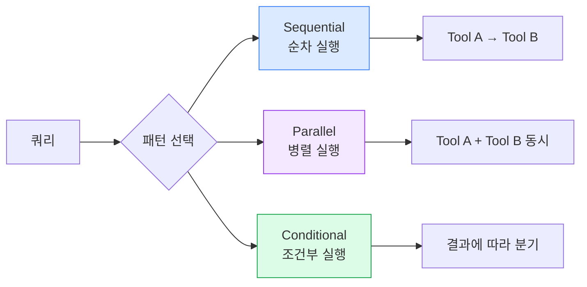
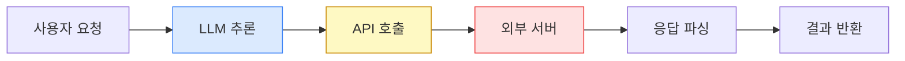
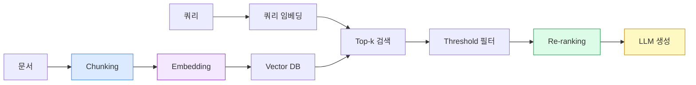
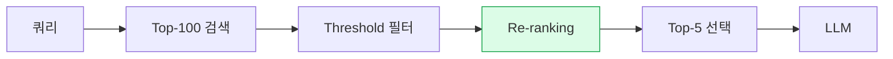
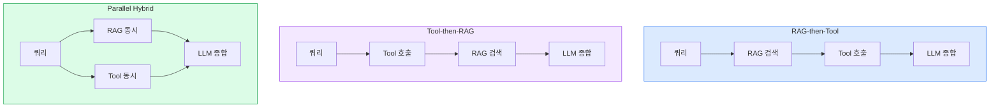

# Day 3
## MCP · RAG 구현 & 외부 시스템 연동

AI Agent 전문 개발 과정

<div class="text-gray-400 mt-4">2026 · AI 개발자 · 데이터 엔지니어 · 기술 리더</div>

<!--
[스크립트]
3일차에 오신 것을 환영합니다.
오늘은 Agent를 실제로 강력하게 만드는 두 가지 핵심 기술, MCP와 RAG를 깊이 다룹니다.
오늘 배운 내용이 바로 프로덕션 Agent의 뼈대가 됩니다.

[Q&A 대비]
MCP와 RAG의 차이는? → MCP는 행동, RAG는 지식 주입

전환: 먼저 오늘의 전체 구조를 살펴보겠습니다.
시간: 2분
-->

---
transition: slide-left
---

# 오늘의 여정

<div class="grid grid-cols-2 gap-6 mt-6">
<div class="bg-blue-50 rounded-xl p-5 border border-blue-200">
  <div class="text-blue-700 font-bold text-lg mb-3">오전</div>
  <div class="space-y-2 text-sm">
    <div class="flex items-center gap-2"><span class="text-blue-500">●</span> Session 1: MCP 고급 설계 (2h)</div>
    <div class="flex items-center gap-2"><span class="text-blue-500">●</span> Session 2: 외부 API 최적화 (2h)</div>
  </div>
</div>
<div class="bg-purple-50 rounded-xl p-5 border border-purple-200">
  <div class="text-purple-700 font-bold text-lg mb-3">오후</div>
  <div class="space-y-2 text-sm">
    <div class="flex items-center gap-2"><span class="text-purple-500">●</span> Session 3: RAG 4가지 요소 (2h)</div>
    <div class="flex items-center gap-2"><span class="text-purple-500">●</span> Session 4: Hybrid 아키텍처 (2h)</div>
  </div>
</div>
</div>

<div class="mt-6 bg-gray-50 rounded-xl p-4 text-center text-sm text-gray-600">
  강의 30% · 실습 70% · 총 8시간
</div>

<!--
[스크립트]
오늘 하루는 크게 네 세션으로 나뉩니다.
오전에는 MCP 고급 설계와 API 연동 최적화.
오후에는 RAG 성능을 결정하는 4가지 요소와 Hybrid 아키텍처.
실습이 70%이므로 코드를 많이 작성할 예정입니다.

전환: Session 1부터 시작합니다.
시간: 2분
-->

---
layout: section
transition: fade
---

# Session 1
## MCP(Function Calling) 고급 설계

---
transition: slide-left
---

# Tool 설계 품질 = Agent 신뢰도

<div class="flex items-center justify-center gap-4 mt-8">
  <div class="bg-red-50 border border-red-200 rounded-xl p-5 text-center w-40">
    <div class="text-3xl mb-2">❌</div>
    <div class="text-red-700 font-bold">모호한 Tool</div>
    <div class="text-xs text-red-500 mt-1">잘못된 호출</div>
  </div>
  <div class="text-3xl text-gray-400">→</div>
  <div class="bg-orange-50 border border-orange-200 rounded-xl p-5 text-center w-40">
    <div class="text-3xl mb-2">⚠️</div>
    <div class="text-orange-700 font-bold">예측 불가</div>
    <div class="text-xs text-orange-500 mt-1">결과</div>
  </div>
  <div class="text-3xl text-gray-400">→</div>
  <div class="bg-red-100 border border-red-300 rounded-xl p-5 text-center w-40">
    <div class="text-3xl mb-2">💥</div>
    <div class="text-red-800 font-bold">장애</div>
    <div class="text-xs text-red-600 mt-1">프로덕션</div>
  </div>
</div>

<div class="mt-8 bg-blue-50 border border-blue-200 rounded-xl p-4 text-center">
  <span class="text-blue-800 font-bold">Anthropic 내부 데이터 (2026)</span><br>
  <span class="text-gray-600 text-sm">Agent 장애 원인 1위 = 잘못 설계된 Tool 스키마</span>
</div>

<!--
[스크립트]
Tool 설계가 왜 중요할까요?
모호한 Tool 정의는 모델이 잘못된 Tool을 선택하게 만듭니다.
그 결과는 예측 불가능하고, 프로덕션 장애로 이어집니다.
Anthropic 내부 데이터에서 Agent 장애 1위 원인이 바로 Tool 스키마 설계 문제입니다.

전환: 그렇다면 올바른 Tool 정의는 무엇일까요?
시간: 3분
-->

---
transition: slide-left
---

# Tool 정의 3요소

<div class="grid grid-cols-3 gap-4 mt-6">
<v-click>
<div class="bg-blue-50 rounded-xl p-5 border border-blue-200">
  <div class="text-blue-700 font-bold text-lg mb-2">name</div>
  <div class="text-sm text-gray-600 mb-3">Tool 식별자</div>
  <div class="bg-white rounded p-2 font-mono text-xs text-green-700">get_current_weather</div>
  <div class="text-xs text-gray-500 mt-2">동사_명사 패턴</div>
</div>
</v-click>
<v-click>
<div class="bg-purple-50 rounded-xl p-5 border border-purple-200">
  <div class="text-purple-700 font-bold text-lg mb-2">description</div>
  <div class="text-sm text-gray-600 mb-3">언제 쓸지 설명</div>
  <div class="bg-white rounded p-2 font-mono text-xs text-purple-700">"현재 날씨 요청 시. 예보는 forecast 사용."</div>
  <div class="text-xs text-gray-500 mt-2">조건 + 구분 명시</div>
</div>
</v-click>
<v-click>
<div class="bg-green-50 rounded-xl p-5 border border-green-200">
  <div class="text-green-700 font-bold text-lg mb-2">parameters</div>
  <div class="text-sm text-gray-600 mb-3">입력 스키마</div>
  <div class="bg-white rounded p-2 font-mono text-xs text-green-700">type + description + examples + enum</div>
  <div class="text-xs text-gray-500 mt-2">필수/선택 구분</div>
</div>
</v-click>
</div>

<!--
[스크립트]
Tool 정의의 3가지 핵심 요소입니다.

[click] name은 동사_명사 패턴으로 의미를 명확히 합니다.
[click] description은 "언제 이 Tool을 쓰는지"와 "유사한 Tool과 어떻게 다른지"를 명시해야 합니다.
[click] parameters는 type만이 아니라 description, examples, enum까지 완전히 정의해야 합니다.

전환: description 설계를 더 자세히 봅시다.
시간: 3분
-->

---
transition: slide-left
---

# description: 나쁜 예 vs 좋은 예

<div class="grid grid-cols-2 gap-6 mt-6">
<div class="bg-red-50 rounded-xl p-5 border border-red-200">
  <div class="text-red-700 font-bold mb-3">나쁜 예</div>
  <div class="bg-white rounded p-3 font-mono text-sm text-red-600">
    "Gets weather data"
  </div>
  <ul class="text-sm text-red-700 mt-3 space-y-1">
    <li>→ 언제 쓰는지 불명확</li>
    <li>→ 유사 Tool과 구분 불가</li>
    <li>→ 모델이 잘못 선택</li>
  </ul>
</div>
<div class="bg-green-50 rounded-xl p-5 border border-green-200">
  <div class="text-green-700 font-bold mb-3">좋은 예</div>
  <div class="bg-white rounded p-3 font-mono text-xs text-green-700">
    "사용자가 특정 도시의<br>현재 날씨를 물어볼 때 호출.<br>예보는 get_weather_forecast 사용."
  </div>
  <ul class="text-sm text-green-700 mt-3 space-y-1">
    <li>→ 호출 조건 명시</li>
    <li>→ 경쟁 Tool 구분</li>
    <li>→ 정확한 선택</li>
  </ul>
</div>
</div>

<!--
[스크립트]
왼쪽의 나쁜 예는 "Gets weather data"처럼 기능만 설명합니다.
오른쪽의 좋은 예는 "언제" 호출하는지와 "유사 Tool과의 차이"를 명시합니다.
이 차이만으로 Tool 선택 정확도가 20% 이상 달라집니다.

전환: parameters도 마찬가지로 완전히 정의해야 합니다.
시간: 3분
-->

---
transition: slide-left
---

# 완전한 parameters 정의

```json {maxHeight:'340px'}
{
  "type": "object",
  "properties": {
    "city": {
      "type": "string",
      "description": "도시명 (영문 또는 한글)",
      "examples": ["Seoul", "서울", "Tokyo"]
    },
    "unit": {
      "type": "string",
      "enum": ["celsius", "fahrenheit"],
      "default": "celsius",
      "description": "온도 단위. 기본값: celsius"
    }
  },
  "required": ["city"]
}
```

<v-click>
<div class="grid grid-cols-3 gap-3 mt-4 text-sm">
  <div class="bg-blue-50 rounded p-2 text-center"><strong>enum</strong><br>허용값 제한</div>
  <div class="bg-purple-50 rounded p-2 text-center"><strong>examples</strong><br>포맷 가이드</div>
  <div class="bg-green-50 rounded p-2 text-center"><strong>required</strong><br>필수값 명시</div>
</div>
</v-click>

<!--
[스크립트]
parameters 정의에서 중요한 세 가지입니다.

[click] enum으로 허용 값을 제한하고, examples로 포맷을 안내하고, required로 필수 필드를 명시합니다.
이 세 가지가 있으면 모델이 올바른 형식으로 인수를 생성합니다.

전환: 이제 여러 Tool을 어떻게 라우팅할지 살펴봅니다.
시간: 3분
-->

---
transition: slide-left
---

# Multi-tool Routing 3가지 패턴



<v-clicks>

- **Sequential** → Tool A 결과를 Tool B 입력으로 사용
- **Parallel** → 독립 Tool을 동시 호출, 지연 단축
- **Conditional** → 첫 결과에 따라 다음 Tool 선택

</v-clicks>

<!--
[스크립트]
여러 Tool을 조합하는 세 가지 패턴입니다.

[click] Sequential: Tool 간 의존성이 있을 때 순차 실행합니다.
[click] Parallel: 독립적인 Tool을 동시에 호출해 지연 시간을 줄입니다.
[click] Conditional: 첫 번째 Tool 결과를 보고 다음 Tool을 동적으로 선택합니다.

전환: Tool 실패 시 어떻게 처리할까요?
시간: 4분
-->

---
transition: slide-left
---

# Tool 실패 처리 전략

<div class="grid grid-cols-2 gap-6 mt-4">
<div>
<div class="text-sm font-bold text-gray-700 mb-2">실패 유형별 처리</div>

| 유형 | 처리 |
|------|------|
| Timeout | 지수 백오프 재시도 |
| Invalid Input | 오류 → 모델 재생성 |
| Auth Error | 즉시 중단 |
| Rate Limit | 대기 후 재시도 |
| Not Found | Fallback Tool |

</div>
<div>
<div class="text-sm font-bold text-gray-700 mb-2">오류 메시지 설계</div>

```python
{
  "type": "tool_result",
  "tool_use_id": "tool_123",
  "is_error": True,
  "content": "날씨 API 응답 시간 초과."
             " 잠시 후 재시도하거나"
             " 다른 방법으로 확인."
}
```

</div>
</div>

<v-click>
<div class="bg-yellow-50 border border-yellow-200 rounded-xl p-3 mt-4 text-sm">
  <strong>핵심</strong>: 오류 메시지는 모델이 읽는다. 원인 + 대안을 구체적으로 작성해야 모델이 적절히 복구한다.
</div>
</v-click>

<!--
[스크립트]
Tool 실패는 반드시 발생합니다. 유형별로 처리 방법이 다릅니다.

Timeout은 재시도, Auth 오류는 즉시 중단, Rate Limit은 대기 후 재시도입니다.

[click] 가장 중요한 것은 오류 메시지입니다. is_error: True만으로는 부족합니다.
원인과 대안을 담아야 모델이 적절한 복구 행동을 취할 수 있습니다.

전환: Session 1 실습으로 넘어갑니다.
시간: 3분
-->

---
transition: slide-left
---

# 실습 1: Multi-tool Routing 정확도 비교

<div class="grid grid-cols-3 gap-4 mt-6">
<div class="bg-blue-50 rounded-xl p-4 border border-blue-200">
  <div class="text-blue-700 font-bold mb-2">I DO (15분)</div>
  <div class="text-xs text-gray-600 space-y-1">
    <div>→ 모호한 Tool 정의 시연</div>
    <div>→ 개선된 정의 비교</div>
    <div>→ Parallel 호출 시연</div>
    <div>→ Fallback 동작 확인</div>
  </div>
</div>
<div class="bg-purple-50 rounded-xl p-4 border border-purple-200">
  <div class="text-purple-700 font-bold mb-2">WE DO (30분)</div>
  <div class="text-xs text-gray-600 space-y-1">
    <div>→ 3개 Tool 정의</div>
    <div>→ Agent 루프 구현</div>
    <div>→ 병렬 호출 구현</div>
    <div>→ Fallback 테스트</div>
  </div>
</div>
<div class="bg-green-50 rounded-xl p-4 border border-green-200">
  <div class="text-green-700 font-bold mb-2">YOU DO (30분)</div>
  <div class="text-xs text-gray-600 space-y-1">
    <div>→ Tool 2개 추가</div>
    <div>→ 정확도 측정 10케이스</div>
    <div>→ Fallback 3 시나리오</div>
    <div>→ solution/ 제출</div>
  </div>
</div>
</div>

<!--
[스크립트]
실습 1은 Multi-tool Routing 정확도 비교입니다.
먼저 제가 모호한 Tool 정의가 어떻게 실패하는지 보여드립니다.
그 다음 함께 올바른 Tool을 구현하고, 마지막으로 직접 새로운 Tool을 추가합니다.

전환: 잠시 쉬고 Session 2로 넘어갑니다.
시간: 2분
-->

---
layout: section
transition: fade
---

# Session 2
## 외부 API · 데이터 연동 최적화

---
transition: slide-left
---

# API 지연의 숨겨진 비용

<div class="flex justify-center mt-6">



</div>

<v-clicks>

- **LLM 추론** → 줄이기 어려움. Tool 호출 횟수 최소화
- **API 호출** → HTTP/2, Connection Pool로 50~200ms 절감
- **외부 서버** → CDN, 엣지 서버로 100~500ms 절감
- **캐싱** → 전체 파이프라인 생략으로 최대 절감

</v-clicks>

<!--
[스크립트]
Agent 응답이 느린 이유는 어디에 있을까요?
사용자 요청부터 결과 반환까지 5단계가 있습니다.

[click] LLM 추론은 줄이기 어렵습니다. Tool 호출 횟수를 최소화하는 것이 방법입니다.
[click] API 호출은 Connection Pool로 연결을 재사용해 줄일 수 있습니다.
[click] 외부 서버 지연은 CDN이나 엣지 서버로 물리적 거리를 줄입니다.
[click] 캐싱은 전체 파이프라인을 건너뛰므로 가장 효과적입니다.

전환: Connection Pool이 왜 중요한지 봅시다.
시간: 4분
-->

---
transition: slide-left
---

# Connection Pool: 연결을 재사용하라

<div class="grid grid-cols-2 gap-6 mt-4">
<div class="bg-red-50 rounded-xl p-4 border border-red-200">
  <div class="text-red-700 font-bold mb-2">매번 새 연결 생성</div>

```python
# 나쁜 패턴
for query in queries:
    resp = requests.get(url)  # 매번 TCP 연결
    # 3-way handshake: +100~200ms
```

  <div class="text-xs text-red-600 mt-2">→ 요청당 100~200ms 낭비</div>
</div>
<div class="bg-green-50 rounded-xl p-4 border border-green-200">
  <div class="text-green-700 font-bold mb-2">Connection Pool 재사용</div>

```python
# 좋은 패턴
client = httpx.AsyncClient(
    limits=httpx.Limits(
        max_keepalive_connections=20
    )
)
# 연결 재사용 → 0ms
```

  <div class="text-xs text-green-600 mt-2">→ 연결 재사용으로 낭비 제거</div>
</div>
</div>

<!--
[스크립트]
매번 새 TCP 연결을 만드는 것은 3-way handshake 때문에 100~200ms가 낭비됩니다.
Connection Pool을 사용하면 연결을 재사용하여 이 비용을 제거할 수 있습니다.
httpx의 AsyncClient를 전역으로 생성하고 재사용하는 패턴이 정답입니다.

전환: 비동기 처리로 병렬화합니다.
시간: 3분
-->

---
transition: slide-left
---

# 동기 vs 비동기: 3배 차이

<div class="grid grid-cols-2 gap-6 mt-4">
<div class="bg-red-50 rounded-xl p-4 border border-red-200">
  <div class="text-red-700 font-bold mb-2">동기 순차 실행 — 3초</div>

```python
weather = requests.get(weather_url)  # 1초
news = requests.get(news_url)        # 1초
stocks = requests.get(stocks_url)    # 1초
# 합계: 3초
```

</div>
<div class="bg-green-50 rounded-xl p-4 border border-green-200">
  <div class="text-green-700 font-bold mb-2">비동기 병렬 실행 — ~1초</div>

```python
weather, news, stocks = await asyncio.gather(
    client.get(weather_url),
    client.get(news_url),
    client.get(stocks_url),
    return_exceptions=True
)
# 합계: ~1초
```

</div>
</div>

<v-click>
<div class="bg-blue-50 border border-blue-200 rounded-xl p-3 mt-4 text-sm text-center">
  <strong>return_exceptions=True</strong>: 하나 실패해도 나머지 결과 활용 가능
</div>
</v-click>

<!--
[스크립트]
독립적인 3개 API를 순차 호출하면 3초가 걸립니다.
asyncio.gather로 병렬 호출하면 가장 느린 하나의 시간으로 단축됩니다.

[click] return_exceptions=True 옵션이 중요합니다.
기본 설정에서는 하나라도 실패하면 전체가 예외를 던집니다.
이 옵션을 설정하면 실패한 것만 Exception 객체로 반환되어 나머지 성공 결과를 활용할 수 있습니다.

전환: 입력과 출력 검증도 필수입니다.
시간: 3분
-->

---
transition: slide-left
---

# Schema Validation: Pydantic으로 검증

```python {maxHeight:'300px'}
from pydantic import BaseModel, Field, validator

class WeatherRequest(BaseModel):
    city: str = Field(min_length=1, max_length=100)
    unit: str = Field(default="celsius",
                      pattern="^(celsius|fahrenheit)$")
    days: int = Field(default=1, ge=1, le=14)

    @validator("city")
    def sanitize_city(cls, v):
        forbidden = ["'", '"', ";", "DROP", "SELECT"]
        for char in forbidden:
            if char.upper() in v.upper():
                raise ValueError(f"허용되지 않는 문자: {char}")
        return v.strip()
```

<v-clicks>

- 입력 검증: SQL Injection, XSS 방어
- 출력 검증: 응답 형식 및 값 범위 확인
- 실패 시: 구조화된 오류 메시지 반환

</v-clicks>

<!--
[스크립트]
Pydantic으로 입력을 검증하면 두 가지 효과가 있습니다.

[click] 첫째, SQL Injection과 XSS 같은 보안 위협을 입력 단계에서 차단합니다.
[click] 둘째, API 응답도 검증하여 형식이 다른 응답이 들어와도 안전하게 처리합니다.
[click] 검증 실패 시 구조화된 오류를 모델에 전달하여 적절한 복구가 가능합니다.

전환: 보안과 Rate Limit도 다뤄야 합니다.
시간: 3분
-->

---
transition: slide-left
---

# 인증 · 보안 · Rate Limit

<div class="grid grid-cols-3 gap-4 mt-4">
<v-click>
<div class="bg-red-50 rounded-xl p-4 border border-red-200">
  <div class="text-red-700 font-bold mb-2">API 키 관리</div>
  <div class="text-xs space-y-1 text-gray-600">
    <div class="text-red-500">❌ 코드에 하드코딩</div>
    <div class="text-red-500">❌ Git에 config.json</div>
    <div class="text-green-600">✅ 환경변수</div>
    <div class="text-green-600">✅ Secret Manager</div>
  </div>
</div>
</v-click>
<v-click>
<div class="bg-yellow-50 rounded-xl p-4 border border-yellow-200">
  <div class="text-yellow-700 font-bold mb-2">Timeout 설정</div>
  <div class="font-mono text-xs mt-2">
    connect: 2.0s<br>
    read: 10.0s<br>
    write: 5.0s
  </div>
  <div class="text-xs text-gray-500 mt-2">각각 설정 필수</div>
</div>
</v-click>
<v-click>
<div class="bg-orange-50 rounded-xl p-4 border border-orange-200">
  <div class="text-orange-700 font-bold mb-2">429 처리</div>
  <div class="text-xs space-y-1 text-gray-600">
    <div>Retry-After 헤더 확인</div>
    <div>해당 시간 대기</div>
    <div>재시도 실행</div>
  </div>
</div>
</v-click>
</div>

<!--
[스크립트]
프로덕션 API 연동에서 보안과 안정성을 위한 세 가지입니다.

[click] API 키는 절대 코드에 하드코딩하면 안 됩니다. 환경변수나 Secret Manager를 사용하세요.
[click] Timeout은 반드시 설정해야 합니다. connect, read, write를 각각 설정해야 모든 상황을 커버합니다.
[click] Rate Limit 오류(429)는 Retry-After 헤더를 읽고 해당 시간만큼 대기 후 재시도합니다.

전환: 실습 2로 넘어갑니다.
시간: 3분
-->

---
transition: slide-left
---

# 실습 2: API 연동 검증 로직 비교

<div class="grid grid-cols-3 gap-4 mt-6">
<div class="bg-blue-50 rounded-xl p-4 border border-blue-200">
  <div class="text-blue-700 font-bold mb-2">I DO (15분)</div>
  <div class="text-xs text-gray-600 space-y-1">
    <div>→ 동기 vs 비동기 시간 비교</div>
    <div>→ 검증 없을 때 오류</div>
    <div>→ Pydantic 검증 추가</div>
  </div>
</div>
<div class="bg-purple-50 rounded-xl p-4 border border-purple-200">
  <div class="text-purple-700 font-bold mb-2">WE DO (30분)</div>
  <div class="text-xs text-gray-600 space-y-1">
    <div>→ AsyncClient 구현</div>
    <div>→ TTL 캐시 추가</div>
    <div>→ Pydantic 모델 작성</div>
    <div>→ Rate Limiter 구현</div>
  </div>
</div>
<div class="bg-green-50 rounded-xl p-4 border border-green-200">
  <div class="text-green-700 font-bold mb-2">YOU DO (30분)</div>
  <div class="text-xs text-gray-600 space-y-1">
    <div>→ 3개 API 병렬 클라이언트</div>
    <div>→ 캐시 + Rate Limiter 통합</div>
    <div>→ 오류 유형별 처리</div>
  </div>
</div>
</div>

<!--
[스크립트]
실습 2는 API 연동 검증 로직을 직접 구현합니다.
동기와 비동기의 실제 시간 차이를 측정하고, Pydantic 검증의 효과를 확인합니다.

전환: 점심 휴식 후 Session 3 RAG로 넘어갑니다.
시간: 2분
-->

---
layout: section
transition: fade
---

# Session 3
## RAG 성능을 결정하는 4가지 요소

---
transition: slide-left
---

# RAG 파이프라인 전체 구조



<v-clicks>

- **1단계** Chunking → 검색 단위 분할
- **2단계** Embedding → 의미 벡터 변환
- **3단계** Retrieval → Top-k + Threshold + Re-ranking
- **4단계** Guardrail → Hallucination 방지

</v-clicks>

<!--
[스크립트]
RAG 파이프라인은 4단계로 구성됩니다.

[click] 첫 번째, Chunking: 대용량 문서를 검색 가능한 단위로 분할합니다.
[click] 두 번째, Embedding: 텍스트를 고차원 벡터로 변환합니다.
[click] 세 번째, Retrieval: Top-k 검색, Threshold 필터, Re-ranking으로 최적 문서를 선택합니다.
[click] 네 번째, Guardrail: 프롬프트 설계로 Hallucination을 방지합니다.

전환: Chunking부터 자세히 살펴봅니다.
시간: 4분
-->

---
transition: slide-left
---

# Chunking: 4가지 전략

<div class="grid grid-cols-2 gap-4 mt-4">
<v-click>
<div class="bg-blue-50 rounded-xl p-4 border border-blue-200">
  <div class="text-blue-700 font-bold mb-1">Fixed-size</div>
  <div class="text-xs text-gray-600">512 토큰 고정 분할</div>
  <div class="text-xs text-blue-600 mt-1">비구조화 텍스트</div>
</div>
</v-click>
<v-click>
<div class="bg-purple-50 rounded-xl p-4 border border-purple-200">
  <div class="text-purple-700 font-bold mb-1">Semantic</div>
  <div class="text-xs text-gray-600">문장·단락 경계 분할</div>
  <div class="text-xs text-purple-600 mt-1">일반 문서, 기사</div>
</div>
</v-click>
<v-click>
<div class="bg-green-50 rounded-xl p-4 border border-green-200">
  <div class="text-green-700 font-bold mb-1">Document-aware</div>
  <div class="text-xs text-gray-600">헤더·구조 단위 분할</div>
  <div class="text-xs text-green-600 mt-1">Markdown, HTML</div>
</div>
</v-click>
<v-click>
<div class="bg-orange-50 rounded-xl p-4 border border-orange-200">
  <div class="text-orange-700 font-bold mb-1">Hierarchical</div>
  <div class="text-xs text-gray-600">대단원 → 소단원 → 문장</div>
  <div class="text-xs text-orange-600 mt-1">복잡한 기술 문서</div>
</div>
</v-click>
</div>

<v-click>
<div class="bg-yellow-50 border border-yellow-200 rounded-xl p-3 mt-4 text-sm text-center">
  Chunk 크기 기준: 너무 크면 노이즈, 너무 작으면 맥락 손실 → <strong>512±100 토큰</strong>이 일반 출발점
</div>
</v-click>

<!--
[스크립트]
Chunking 전략은 문서 유형에 따라 선택합니다.

[click] Fixed-size는 구현이 가장 단순하지만 문장을 중간에 자를 수 있습니다.
[click] Semantic은 자연스러운 경계에서 분할하여 맥락을 보존합니다.
[click] Document-aware는 문서 구조(헤더 등)를 활용해 가장 의미 있는 단위로 분할합니다.
[click] Hierarchical은 여러 레벨의 Chunk를 유지하여 쿼리 유형에 따라 적절한 레벨을 선택합니다.
[click] 일반적으로 512토큰 전후가 좋은 출발점입니다.

전환: Embedding 모델 선택도 중요합니다.
시간: 4분
-->

---
transition: slide-left
---

# Embedding 모델 선택 기준 (2026)

| 모델 | 차원 | 한국어 | 비용 | 추천 상황 |
|------|------|--------|------|-----------|
| text-embedding-3-large | 3072 | 우수 | 유료 | 프로덕션 (영어 중심) |
| text-embedding-3-small | 1536 | 양호 | 저렴 | 비용 민감 |
| multilingual-e5-large | 1024 | **최우수** | 무료 | 한국어 전용 |
| bge-m3 | 1024 | 우수 | 무료 | 온프레미스 |
| voyage-3 | 1024 | 양호 | 유료 | Claude 최적화 |

<v-click>
<div class="bg-blue-50 border border-blue-200 rounded-xl p-3 mt-4 text-sm">
  <strong>한국어 서비스</strong>: <code>multilingual-e5-large</code> 또는 <code>bge-m3</code> 우선 고려<br>
  <strong>Claude 연동</strong>: Anthropic 권장 <code>voyage-3</code> 시리즈
</div>
</v-click>

<!--
[스크립트]
Embedding 모델 선택은 언어와 비용을 기준으로 합니다.

한국어가 중심이라면 multilingual-e5-large나 bge-m3가 최우수 성능을 보입니다.
Claude와 함께 사용한다면 Anthropic이 권장하는 voyage-3 시리즈가 최적화되어 있습니다.
영어 중심 프로덕션에서는 text-embedding-3-large가 높은 정확도를 제공합니다.

[click] 핵심은 실제 데이터로 벤치마크를 돌려보고 결정하는 것입니다.

전환: 검색 튜닝으로 넘어갑니다.
시간: 3분
-->

---
transition: slide-left
---

# Retrieval 튜닝: Top-k · Threshold · Re-ranking

<div class="grid grid-cols-3 gap-4 mt-4">
<div class="bg-blue-50 rounded-xl p-4 border border-blue-200">
  <div class="text-blue-700 font-bold mb-2">Top-k</div>
  <div class="text-xs text-gray-600 space-y-1">
    <div>k=3 → 정확하지만 누락 위험</div>
    <div>k=5~10 → 일반 QA 균형</div>
    <div>k=20+ → 포괄 요약용</div>
  </div>
</div>
<div class="bg-purple-50 rounded-xl p-4 border border-purple-200">
  <div class="text-purple-700 font-bold mb-2">Threshold</div>
  <div class="text-xs text-gray-600 space-y-1">
    <div>0.65~0.75 권장 범위</div>
    <div>높으면 → 누락 증가</div>
    <div>낮으면 → 노이즈 증가</div>
  </div>
</div>
<div class="bg-green-50 rounded-xl p-4 border border-green-200">
  <div class="text-green-700 font-bold mb-2">Re-ranking</div>
  <div class="text-xs text-gray-600 space-y-1">
    <div>Cross-encoder 사용</div>
    <div>정확도 20~40% 향상</div>
    <div>속도 5~10배 느림</div>
  </div>
</div>
</div>

<v-click>



</v-click>

<!--
[스크립트]
Retrieval 튜닝의 세 가지 핵심입니다.

Top-k는 검색 결과 수입니다. 3은 정확하지만 관련 문서를 놓칠 수 있고, 20 이상은 노이즈가 많습니다.
Threshold는 유사도 필터입니다. 0.65~0.75가 일반적인 출발점입니다.
Re-ranking은 Cross-encoder로 쿼리-문서 쌍을 함께 평가합니다. 정확도가 높지만 느립니다.

[click] 권장 패턴은 넓게 검색(Top-100) 후 Threshold로 필터, Re-ranking으로 좁히는 것입니다.

전환: Hallucination 방지 전략입니다.
시간: 4분
-->

---
transition: slide-left
---

# Hallucination 최소화 전략

<div class="grid grid-cols-2 gap-6 mt-4">
<div>
<div class="text-sm font-bold text-gray-700 mb-2">원인과 해결책</div>

| 원인 | 해결 |
|------|------|
| 관련 문서 없음 | Threshold 강화 |
| 노이즈 문서 | Re-ranking |
| 프롬프트 부재 | 명시적 지침 |
| 컨텍스트 과다 | Top-k 줄이기 |

</div>
<div>
<div class="text-sm font-bold text-gray-700 mb-2">핵심 프롬프트 패턴</div>

```python
SYSTEM = """
[참조 문서]에 있는 내용만 사용.
문서에 없으면 '확인 불가'라고 명시.
추측하지 말 것.
출처는 [출처: n]으로 표시.
"""
```

</div>
</div>

<v-click>
<div class="bg-red-50 border border-red-200 rounded-xl p-3 mt-4 text-sm text-center">
  신뢰도 점수 &lt; 0.6 → 답변 거부: "신뢰할 수 있는 정보를 찾을 수 없습니다"
</div>
</v-click>

<!--
[스크립트]
Hallucination은 네 가지 원인이 있습니다.
관련 문서가 없거나, 노이즈 문서가 포함되거나, 프롬프트 설계가 부재하거나, 컨텍스트가 너무 많은 경우입니다.

프롬프트에서 "문서에 없으면 모른다고 하라"는 지침이 핵심입니다.

[click] 신뢰도 점수가 0.6 미만이면 아예 답변을 거부하는 것도 좋은 전략입니다.

전환: 실습 3으로 넘어갑니다.
시간: 3분
-->

---
transition: slide-left
---

# 실습 3: Chunk 전략별 Retrieval 비교

<div class="grid grid-cols-3 gap-4 mt-6">
<div class="bg-blue-50 rounded-xl p-4 border border-blue-200">
  <div class="text-blue-700 font-bold mb-2">I DO (15분)</div>
  <div class="text-xs text-gray-600 space-y-1">
    <div>→ Fixed vs Semantic 비교</div>
    <div>→ Chunk 크기 분포 확인</div>
    <div>→ 동일 쿼리 결과 비교</div>
    <div>→ Threshold 차이 시연</div>
  </div>
</div>
<div class="bg-purple-50 rounded-xl p-4 border border-purple-200">
  <div class="text-purple-700 font-bold mb-2">WE DO (30분)</div>
  <div class="text-xs text-gray-600 space-y-1">
    <div>→ 3가지 Chunking 구현</div>
    <div>→ 벡터 스토어 인덱싱</div>
    <div>→ 10개 쿼리 정확도 측정</div>
    <div>→ Re-ranking 적용</div>
  </div>
</div>
<div class="bg-green-50 rounded-xl p-4 border border-green-200">
  <div class="text-green-700 font-bold mb-2">YOU DO (30분)</div>
  <div class="text-xs text-gray-600 space-y-1">
    <div>→ 자체 문서로 RAG 구축</div>
    <div>→ 전략 2가지 비교 실험</div>
    <div>→ Threshold 3가지 비교</div>
    <div>→ Faithfulness 측정</div>
  </div>
</div>
</div>

<!--
[스크립트]
실습 3은 Chunking 전략별 실제 Retrieval 품질 차이를 측정합니다.
같은 문서를 다른 방식으로 자르면 검색 결과가 얼마나 달라지는지 직접 확인합니다.

전환: 마지막 Session 4로 넘어갑니다.
시간: 2분
-->

---
layout: section
transition: fade
---

# Session 4
## Hybrid 아키텍처 설계

---
transition: slide-left
---

# MCP vs RAG: 무엇이 다른가

<div class="grid grid-cols-2 gap-6 mt-6">
<div class="bg-blue-50 rounded-xl p-5 border border-blue-200">
  <div class="text-blue-800 font-bold text-lg mb-3">MCP (Tool Calling)</div>
  <div class="space-y-2 text-sm">
    <div class="flex items-center gap-2"><span class="text-green-500 font-bold">✅</span> 실시간 데이터</div>
    <div class="flex items-center gap-2"><span class="text-green-500 font-bold">✅</span> 부작용 있는 행동</div>
    <div class="flex items-center gap-2"><span class="text-green-500 font-bold">✅</span> 계산·변환</div>
    <div class="flex items-center gap-2"><span class="text-red-500 font-bold">❌</span> 대용량 지식</div>
    <div class="flex items-center gap-2"><span class="text-red-500 font-bold">❌</span> 비용 효율</div>
  </div>
</div>
<div class="bg-purple-50 rounded-xl p-5 border border-purple-200">
  <div class="text-purple-800 font-bold text-lg mb-3">RAG</div>
  <div class="space-y-2 text-sm">
    <div class="flex items-center gap-2"><span class="text-green-500 font-bold">✅</span> 대용량 지식 검색</div>
    <div class="flex items-center gap-2"><span class="text-green-500 font-bold">✅</span> 저비용</div>
    <div class="flex items-center gap-2"><span class="text-green-500 font-bold">✅</span> 빠른 검색</div>
    <div class="flex items-center gap-2"><span class="text-red-500 font-bold">❌</span> 실시간 데이터</div>
    <div class="flex items-center gap-2"><span class="text-red-500 font-bold">❌</span> 행동 수행</div>
  </div>
</div>
</div>

<!--
[스크립트]
MCP와 RAG는 서로 보완 관계입니다.
MCP는 실시간 데이터와 행동에 강하지만 대용량 지식을 다루기 어렵습니다.
RAG는 대용량 지식에 강하지만 실시간 데이터와 행동이 불가능합니다.

전환: 그래서 둘을 합친 Hybrid가 나옵니다.
시간: 3분
-->

---
transition: slide-left
---

# Hybrid 아키텍처 패턴 3가지



<!--
[스크립트]
Hybrid 아키텍처에는 세 가지 핵심 패턴이 있습니다.

왼쪽 RAG-then-Tool: 지식 검색 후 실시간 데이터를 추가로 조회합니다.
가운데 Tool-then-RAG: 실시간 데이터를 먼저 수집한 후 관련 지식을 검색합니다.
오른쪽 Parallel Hybrid: RAG와 Tool을 동시에 실행하여 가장 빠릅니다.

전환: 각 패턴은 어떤 상황에 쓰는지 봅시다.
시간: 4분
-->

---
transition: slide-left
---

# 아키텍처 선택 기준

<div class="grid grid-cols-2 gap-6 mt-4">
<div>
<div class="text-sm font-bold text-gray-700 mb-2">요구사항별 선택</div>

| 요구사항 | 선택 |
|----------|------|
| 실시간 + 대용량 지식 | **Hybrid** |
| 실시간만 | MCP 중심 |
| 지식만, 저비용 | RAG 중심 |
| 빠른 응답 | RAG 중심 |
| 복잡한 추론 | Hybrid |

</div>
<div>
<div class="text-sm font-bold text-gray-700 mb-2">의사결정 질문</div>

```
1. 실시간 데이터 필요?
   → 예: MCP 또는 Hybrid

2. 10,000개 이상 문서?
   → 예: RAG 또는 Hybrid

3. 부작용 있는 행동?
   → 예: MCP 또는 Hybrid

4. API 비용 최소화?
   → 예: RAG 중심
```

</div>
</div>

<!--
[스크립트]
아키텍처 선택은 요구사항 체크리스트로 시작합니다.

실시간 데이터와 대용량 지식이 모두 필요하면 Hybrid입니다.
실시간만 필요하면 MCP, 정적 지식만 필요하면 RAG입니다.
비용을 최소화하고 싶다면 RAG 중심이 유리합니다.

전환: 세 가지 Trade-off를 정량적으로 비교합니다.
시간: 3분
-->

---
transition: slide-left
---

# 정확도 · 비용 · 확장성 Trade-off

<div class="grid grid-cols-3 gap-4 mt-6">
<div class="bg-blue-50 rounded-xl p-4 border border-blue-200 text-center">
  <div class="text-blue-700 font-bold mb-2">정확도</div>
  <div class="text-xs text-gray-600 space-y-1">
    <div>LLM Only → 낮음</div>
    <div>RAG → 중간</div>
    <div>MCP → 중간</div>
    <div class="text-blue-700 font-bold">Hybrid → 최고</div>
  </div>
</div>
<div class="bg-red-50 rounded-xl p-4 border border-red-200 text-center">
  <div class="text-red-700 font-bold mb-2">비용</div>
  <div class="text-xs text-gray-600 space-y-1">
    <div class="text-green-700 font-bold">RAG → 최저</div>
    <div>LLM Only → 중간</div>
    <div>MCP → 높음</div>
    <div>Hybrid → 최고</div>
  </div>
</div>
<div class="bg-green-50 rounded-xl p-4 border border-green-200 text-center">
  <div class="text-green-700 font-bold mb-2">확장성</div>
  <div class="text-xs text-gray-600 space-y-1">
    <div class="text-green-700 font-bold">RAG → 문서 무제한</div>
    <div>MCP → API 한도 의존</div>
    <div>Hybrid → 높음</div>
    <div>LLM Only → 낮음</div>
  </div>
</div>
</div>

<v-click>
<div class="bg-yellow-50 border border-yellow-200 rounded-xl p-3 mt-4 text-sm text-center">
  캐싱 적용 시 Hybrid 비용을 RAG 수준으로 낮출 수 있다
</div>
</v-click>

<!--
[스크립트]
세 가지 차원에서 비교합니다.

정확도는 Hybrid가 가장 높습니다. 실시간 데이터와 지식 베이스를 모두 활용하니까요.
비용은 RAG가 가장 낮습니다. 벡터 검색은 API 호출보다 훨씬 저렴합니다.
확장성은 RAG가 가장 유리합니다. 문서가 수백만 개여도 벡터 검색은 빠릅니다.

[click] Hybrid 비용은 캐싱으로 RAG 수준까지 낮출 수 있습니다. 캐싱이 핵심입니다.

전환: Hybrid 구현을 코드로 봅니다.
시간: 3분
-->

---
transition: slide-left
---

# Hybrid Agent 핵심 로직

```python {maxHeight:'320px'}
async def run(self, query: str) -> dict:
    # 1. RAG 먼저 (빠르고 저렴)
    rag_docs, rag_score = await self.rag.retrieve(query)

    # 2. 신뢰도에 따라 분기
    if rag_score >= 0.70:
        system = f"지식 기반 답변:\n{format_docs(rag_docs)}"
        # Tool 필요 시 추가 호출
    else:
        system = "실시간 데이터로 답변하세요."
        # Tool로 데이터 수집

    # 3. LLM + Tool 루프 실행
    response = await llm_with_tools(system, query)

    return {
        "answer": response,
        "architecture": classify(rag_score, tools_used)
    }
```

<v-click>
<div class="grid grid-cols-3 gap-3 mt-3 text-xs text-center">
  <div class="bg-blue-50 rounded p-2">RAG 신뢰도 높음<br><strong>RAG-only</strong></div>
  <div class="bg-purple-50 rounded p-2">RAG + Tool 모두<br><strong>Hybrid</strong></div>
  <div class="bg-orange-50 rounded p-2">RAG 신뢰도 낮음<br><strong>Tool-only</strong></div>
</div>
</v-click>

<!--
[스크립트]
Hybrid Agent의 핵심 로직입니다.

RAG를 먼저 시도합니다. 빠르고 비용이 낮은 경로를 우선합니다.
RAG 신뢰도가 0.70 이상이면 지식 기반으로 답변합니다.
신뢰도가 낮으면 자동으로 Tool 호출로 전환합니다.

[click] 결과적으로 각 쿼리마다 어떤 아키텍처가 사용됐는지 기록할 수 있습니다.
이 로그가 시스템 품질과 비용을 모니터링하는 핵심 지표가 됩니다.

전환: 실습 4로 넘어갑니다.
시간: 4분
-->

---
transition: slide-left
---

# 프로덕션 Hybrid 설계 원칙

<v-clicks>

- **원칙 1** → RAG를 먼저 시도한다 (저비용 경로 우선)
- **원칙 2** → RAG 신뢰도 낮을 때만 Tool 호출
- **원칙 3** → 실시간 데이터는 항상 Tool 사용
- **원칙 4** → 병렬 처리로 지연 최소화
- **원칙 5** → 결과 캐싱으로 중복 호출 방지

</v-clicks>

<v-click>
<div class="mt-6 bg-gray-50 border border-gray-200 rounded-xl p-4">
<div class="font-bold text-gray-700 mb-2">모니터링 핵심 지표</div>
<div class="grid grid-cols-3 gap-3 text-xs text-center">
  <div class="bg-white rounded p-2 border">아키텍처 비율<br>RAG/Tool/Hybrid %</div>
  <div class="bg-white rounded p-2 border">응답 지연<br>P50, P95, P99</div>
  <div class="bg-white rounded p-2 border">쿼리당 비용<br>RAG + Tool + LLM</div>
</div>
</div>
</v-click>

<!--
[스크립트]
프로덕션에서 지켜야 할 5가지 원칙입니다.

[click] 원칙 1: RAG를 먼저 시도합니다. 비용이 낮은 경로를 항상 우선합니다.
[click] 원칙 2: RAG 신뢰도가 낮을 때만 Tool을 호출합니다. 불필요한 API 호출을 막습니다.
[click] 원칙 3: 실시간 데이터는 반드시 Tool을 사용합니다. RAG는 시점이 고정됩니다.
[click] 원칙 4: 독립적인 작업은 병렬 처리합니다. 지연 시간을 줄입니다.
[click] 원칙 5: 결과를 캐싱합니다. 동일 쿼리 반복 시 비용을 크게 줄입니다.

[click] 모니터링은 아키텍처 비율, 응답 지연, 쿼리당 비용 세 가지를 기본으로 합니다.

전환: 실습으로 직접 구현해 봅시다.
시간: 4분
-->

---
transition: slide-left
---

# 실습 4: Hybrid 아키텍처 설계 및 구현

<div class="grid grid-cols-3 gap-4 mt-6">
<div class="bg-blue-50 rounded-xl p-4 border border-blue-200">
  <div class="text-blue-700 font-bold mb-2">I DO (20분)</div>
  <div class="text-xs text-gray-600 space-y-1">
    <div>→ RAG-only vs MCP-only 비교</div>
    <div>→ Hybrid 자동 전환 시연</div>
    <div>→ Parallel Hybrid 지연 비교</div>
  </div>
</div>
<div class="bg-purple-50 rounded-xl p-4 border border-purple-200">
  <div class="text-purple-700 font-bold mb-2">WE DO (40분)</div>
  <div class="text-xs text-gray-600 space-y-1">
    <div>→ HybridAgent 클래스 구현</div>
    <div>→ 신뢰도 기반 분기 로직</div>
    <div>→ 병렬 실행 구현</div>
    <div>→ 아키텍처 로깅 추가</div>
  </div>
</div>
<div class="bg-green-50 rounded-xl p-4 border border-green-200">
  <div class="text-green-700 font-bold mb-2">YOU DO (45분)</div>
  <div class="text-xs text-gray-600 space-y-1">
    <div>→ 3유형 쿼리 세트 설계</div>
    <div>→ 벤치마크 스크립트 작성</div>
    <div>→ Trade-off 기준표 작성</div>
  </div>
</div>
</div>

<!--
[스크립트]
실습 4는 오늘의 핵심 실습입니다.
세 가지 아키텍처를 동일한 쿼리 세트로 테스트하고 직접 데이터를 수집합니다.
이 경험이 실제 시스템 설계 시 여러분의 판단 근거가 됩니다.

전환: 이제 오늘 전체를 정리합니다.
시간: 2분
-->

---
transition: fade
---

# Day 3 핵심 정리

<div class="grid grid-cols-2 gap-6 mt-6">
<div class="space-y-3">
<v-click>
<div class="bg-blue-50 rounded-xl p-4 border border-blue-200">
  <div class="font-bold text-blue-700">Session 1: MCP 설계</div>
  <div class="text-xs text-gray-600 mt-1">description 조건 명시 → 선택 정확도 15~30% 향상</div>
</div>
</v-click>
<v-click>
<div class="bg-purple-50 rounded-xl p-4 border border-purple-200">
  <div class="font-bold text-purple-700">Session 2: API 최적화</div>
  <div class="text-xs text-gray-600 mt-1">비동기 + 캐시 + Pydantic + Rate Limit = 프로덕션 기본</div>
</div>
</v-click>
</div>
<div class="space-y-3">
<v-click>
<div class="bg-green-50 rounded-xl p-4 border border-green-200">
  <div class="font-bold text-green-700">Session 3: RAG 4요소</div>
  <div class="text-xs text-gray-600 mt-1">Chunking → Embedding → Retrieval → Guardrail</div>
</div>
</v-click>
<v-click>
<div class="bg-orange-50 rounded-xl p-4 border border-orange-200">
  <div class="font-bold text-orange-700">Session 4: Hybrid 설계</div>
  <div class="text-xs text-gray-600 mt-1">RAG 먼저 → 신뢰도 낮으면 Tool → 병렬 + 캐싱</div>
</div>
</v-click>
</div>
</div>

<!--
[스크립트]
오늘 배운 네 가지를 정리합니다.

[click] Session 1: Tool description에 호출 조건과 유사 Tool 차이를 명시하면 선택 정확도가 15~30% 향상됩니다.
[click] Session 2: 비동기, 캐시, Pydantic 검증, Rate Limit 처리가 API 연동의 기본입니다.
[click] Session 3: RAG 성능은 Chunking, Embedding, Retrieval 튜닝, Guardrail 4가지가 결정합니다.
[click] Session 4: RAG를 먼저 시도하고, 신뢰도가 낮을 때 Tool로 전환하는 Hybrid가 대부분의 프로덕션 표준입니다.

전환: 내일을 예고합니다.
시간: 3분
-->

---
transition: slide-left
---

# 내일(Day 4) 예고

<div class="grid grid-cols-2 gap-6 mt-6">
<div class="bg-gray-50 rounded-xl p-5 border border-gray-200">
  <div class="font-bold text-gray-700 mb-3">오전</div>
  <div class="space-y-2 text-sm text-gray-600">
    <div>→ Agent 평가 프레임워크 설계</div>
    <div>→ 프로덕션 모니터링 · 관찰 가능성</div>
  </div>
</div>
<div class="bg-gray-50 rounded-xl p-5 border border-gray-200">
  <div class="font-bold text-gray-700 mb-3">오후</div>
  <div class="space-y-2 text-sm text-gray-600">
    <div>→ Agent 성능 최적화 전략</div>
    <div>→ 비용 최적화 실전 기법</div>
  </div>
</div>
</div>

<div class="mt-6 text-center text-gray-500 text-sm">
  오늘 실습 코드를 복습하면서 Hybrid Agent를 직접 확장해 보세요.
</div>

<!--
[스크립트]
내일은 오늘 만든 시스템을 어떻게 평가하고 운영할지를 다룹니다.
Agent 평가 프레임워크, 프로덕션 모니터링, 성능 최적화, 비용 최적화입니다.

오늘 실습 코드를 꼭 복습하고, Hybrid Agent를 직접 확장해 보세요.
궁금한 점은 지금 질문해 주세요.

시간: 3분
-->

---
layout: center
class: text-center
transition: fade
---

# Q&A

Day 3 질문을 받겠습니다

<div class="text-gray-400 mt-4 text-sm">
  MCP 설계 · API 연동 · RAG · Hybrid 아키텍처
</div>

<!--
[스크립트]
오늘 수업에 대한 질문을 받겠습니다.
MCP Tool 설계부터 RAG 파이프라인, Hybrid 아키텍처까지 어떤 주제든 환영합니다.

시간: 10분
-->

---
layout: center
class: text-center
---

# 수고하셨습니다

내일 Day 4에서 뵙겠습니다

<!-- IMAGE: AI agent system architecture diagram with RAG and MCP components. 검색 키워드: "AI agent architecture RAG MCP system design" -->

<!--
[스크립트]
오늘 하루 수고하셨습니다.
MCP 설계부터 Hybrid 아키텍처까지, 오늘 다룬 내용이 실제 프로덕션 Agent의 핵심입니다.
내일은 이 시스템을 어떻게 검증하고 운영할지를 배웁니다.
좋은 저녁 되세요.

시간: 1분
-->
