# AI Agent 전문 개발 과정 v3

## 과정 개요

| 항목 | 내용 |
|------|------|
| 과정명 | AI Agent 전문 개발 과정 |
| 교육 기간 | 5일 (40시간) |
| 교육 목표 | MCP·RAG·Hybrid 아키텍처 기반의 고도화된 실무형 AI Agent MVP를 직접 설계·구현하고 운영 역량까지 내재화 |
| 대상 | AI 개발자, 데이터 엔지니어, 기술 리더 |
| 이론:실습 비율 | 30:70 |

## 기술 스택 & 도구

| 카테고리 | 도구 | 비고 |
|----------|------|------|
| 언어 | Python 3.12 | |
| IDE | VS Code | GitHub Copilot 활용 |
| AI 코딩 | GitHub Copilot (유료) | Vibe Coding 소개 포함 |
| LLM API | OpenAI GPT-4o / Anthropic Claude | |
| Agent 프레임워크 | LangGraph | 제어 흐름 설계 |
| Vector DB | ChromaDB | 로컬 실습용 |
| 모니터링 | LangSmith | Trace 로그 확인 |
| 외부 연동 | MCP (Model Context Protocol) | Function Calling 고급 설계 |
| 패키지 관리 | uv / pip | |

## 사전 준비 사항

```
# 필수 설치
- Python 3.12+
- VS Code (최신 버전)
- GitHub Copilot 확장 (유료 라이선스)
- Git
- uv (Python 패키지 관리자)

# Python 패키지 (실습 시 설치 안내)
- langchain / langchain-openai / langchain-anthropic
- langgraph
- chromadb
- langsmith
- fastapi / uvicorn
- httpx
- pydantic
```

## 5일 일정 Overview

```mermaid
gantt
    title AI Agent 전문 개발 과정 (5일 40시간)
    dateFormat X
    axisFormat %s

    section Day 1
    Agent 문제 정의와 과제 도출        :d1s1, 0, 2
    LLM 동작 원리 및 프롬프트 전략 심화   :d1s2, 2, 4
    Agent 기획서 구조화                :d1s3, 4, 6
    MCP·RAG·Hybrid 구조 판단          :d1s4, 6, 8

    section Day 2
    Agent 4요소 구조 설계              :d2s1, 0, 2
    LangGraph 기반 제어 흐름 설계       :d2s2, 2, 4
    Tool 호출 통제 & Validation       :d2s3, 4, 6
    구조 리팩토링 & 확장성 설계          :d2s4, 6, 8

    section Day 3
    MCP(Function Calling) 고급 설계   :d3s1, 0, 2
    외부 API·데이터 연동 최적화          :d3s2, 2, 4
    RAG 성능을 결정하는 4가지 요소       :d3s3, 4, 6
    Hybrid 아키텍처 설계               :d3s4, 6, 8

    section Day 4
    Agent 품질 평가 체계 설계           :d4s1, 0, 2
    Prompt·RAG·Tool 성능 개선 전략     :d4s2, 2, 4
    로그·모니터링·장애 대응 설계          :d4s3, 4, 6
    확장 가능한 서비스 아키텍처           :d4s4, 6, 8

    section Day 5
    프로젝트 설계 확정                  :d5s1, 0, 2
    핵심 기능 구현                     :d5s2, 2, 4
    성능 개선 & 안정화                  :d5s3, 4, 6
    최종 시연 및 발표                   :d5s4, 6, 8
```



## 디렉토리 구조

```
lectures/ai-agent-dev-v3/
├── guide/
│   ├── README.md                    # 이 파일 (과정 개요)
│   ├── day1-session1.md             # Agent 문제 정의와 과제 도출
│   ├── day1-session2.md             # LLM 동작 원리 및 프롬프트 전략 심화
│   ├── day1-session3.md             # Agent 기획서 구조화
│   ├── day1-session4.md             # MCP·RAG·Hybrid 구조 판단
│   ├── day2-session1.md             # Agent 4요소 구조 설계
│   ├── day2-session2.md             # LangGraph 기반 제어 흐름 설계
│   ├── day2-session3.md             # Tool 호출 통제 & Validation
│   ├── day2-session4.md             # 구조 리팩토링 & 확장성 설계
│   ├── day3-session1.md             # MCP(Function Calling) 고급 설계
│   ├── day3-session2.md             # 외부 API·데이터 연동 최적화
│   ├── day3-session3.md             # RAG 성능을 결정하는 4가지 요소
│   ├── day3-session4.md             # Hybrid 아키텍처 설계
│   ├── day4-session1.md             # Agent 품질 평가 체계 설계
│   ├── day4-session2.md             # Prompt·RAG·Tool 성능 개선 전략
│   ├── day4-session3.md             # 로그·모니터링·장애 대응 설계
│   ├── day4-session4.md             # 확장 가능한 서비스 아키텍처
│   ├── day5-session1.md             # 프로젝트 설계 확정
│   ├── day5-session2.md             # 핵심 기능 구현
│   ├── day5-session3.md             # 성능 개선 & 안정화
│   └── day5-session4.md             # 최종 시연 및 발표
└── labs/
    ├── day1-agent-problem-definition/   # 실습: Agent 후보 도출
    ├── day1-prompt-strategy/            # 실습: 프롬프트 전략 비교
    ├── day1-agent-blueprint/            # 실습: Agent 기획서 작성
    ├── day1-architecture-decision/      # 실습: MCP vs RAG 구조 설계
    ├── day2-agent-state-design/         # 실습: Agent 상태 다이어그램
    ├── day2-langgraph-workflow/         # 실습: LangGraph Workflow 구현
    ├── day2-tool-validation/            # 실습: Tool Validation 구현
    ├── day2-refactoring/                # 실습: 구조 리팩토링
    ├── day3-mcp-implementation/         # 실습: MCP Tool 구현
    ├── day3-api-integration/            # 실습: 외부 API 연동
    ├── day3-rag-pipeline/               # 실습: RAG 파이프라인 (ChromaDB)
    ├── day3-hybrid-architecture/        # 실습: Hybrid 아키텍처 설계
    ├── day4-evaluation-framework/       # 실습: 평가 체계 설계
    ├── day4-performance-tuning/         # 실습: 성능 개선
    ├── day4-langsmith-monitoring/       # 실습: LangSmith 모니터링
    ├── day4-service-architecture/       # 실습: 운영 아키텍처 설계
    └── day5-mvp-project/               # 실습: MVP 프로젝트 템플릿
```

## Day별 학습 목표

### Day 1 — 문제 정의 & 설계
Agent가 적합한 문제를 정의하고, LLM 프롬프트 전략을 숙달하며, MCP/RAG/Hybrid 중 최적 아키텍처를 판단하는 능력을 기른다.

### Day 2 — 제어 흐름 & 상태
LangGraph 기반 Agent 제어 흐름을 설계하고, Tool 호출 통제와 상태 관리를 구현하며, 확장 가능한 구조로 리팩토링한다.

### Day 3 — MCP · RAG 구현
MCP Function Calling 고급 설계, 외부 API 연동, ChromaDB 기반 RAG 파이프라인을 구현하고, Hybrid 아키텍처를 완성한다.

### Day 4 — 평가 & 운영 전략
Agent 품질 평가 체계를 설계하고, LangSmith 기반 모니터링을 구축하며, 확장 가능한 서비스 아키텍처를 설계한다.

### Day 5 — MVP Day
개인별 Agent 프로젝트 MVP를 완성하고, 성능 개선 후 최종 시연 및 발표한다.
