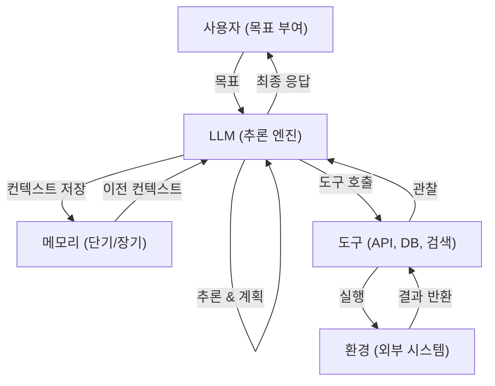
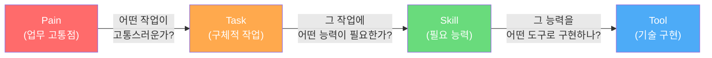
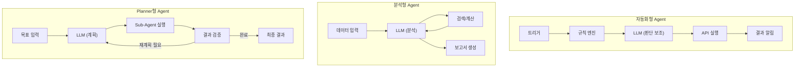
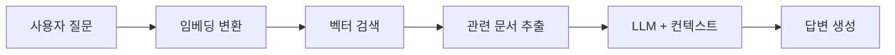
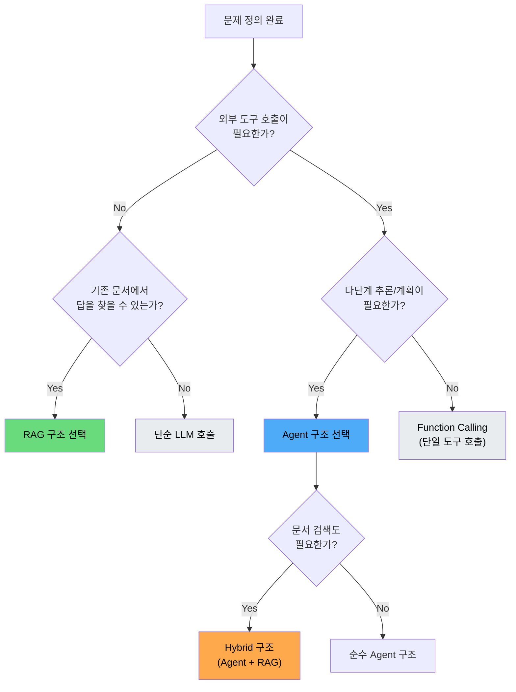

# Day 1 - Session 1: Agent 문제 정의와 과제 도출 (2h)

> 이론 ~35분 / 실습 ~85분

## 학습 목표

이 세션을 마치면 다음을 할 수 있습니다:

1. AI Agent가 적합한 문제 유형과 부적합한 문제 유형을 구분할 수 있다
2. Pain → Task → Skill → Tool 프레임워크로 업무를 분석할 수 있다
3. 자동화형 / 분석형 / Planner형 Agent 패턴의 차이를 설명할 수 있다
4. RAG와 Agent 중 적절한 구조를 판단할 수 있다
5. 개인 업무에서 Agent 후보를 도출할 수 있다

---

## 1. Agent란 무엇인가

### 1.1 정의

AI Agent는 **목표를 부여받으면 스스로 계획을 세우고, 도구를 선택하며, 반복적으로 행동하여 결과를 만들어내는 시스템**이다. 단순한 프롬프트-응답 구조와 달리, Agent는 다음 세 가지 핵심 능력을 갖는다:

- **추론(Reasoning)**: 문제를 이해하고 다음 행동을 결정
- **행동(Action)**: 외부 도구를 호출하거나 API를 실행
- **관찰(Observation)**: 행동 결과를 평가하고 다음 단계를 조정

### 1.2 Agent의 구성요소



### 1.3 Agent vs 단순 LLM 호출

| 구분 | 단순 LLM 호출 | AI Agent |
|------|--------------|----------|
| 실행 방식 | 1회 프롬프트 → 1회 응답 | 반복적 추론-행동-관찰 루프 |
| 도구 사용 | 없음 | API, DB, 파일 시스템 등 활용 |
| 상태 관리 | Stateless | 대화 메모리 + 작업 상태 관리 |
| 자율성 | 사용자가 매번 지시 | 목표만 주면 스스로 계획-실행 |
| 적합한 작업 | 번역, 요약, QA | 복합 업무 자동화, 조사, 의사결정 |

### 1.4 Agent가 적합한 문제 vs 부적합한 문제

**적합한 문제:**
- 반복적이지만 매번 약간씩 다른 판단이 필요한 업무
- 여러 시스템/데이터를 조합해야 하는 업무
- 사람이 하면 30분 이상 걸리는 다단계 작업
- 정해진 절차가 있지만 예외 처리가 빈번한 업무

**부적합한 문제:**
- 단순 키워드 검색으로 해결되는 문제 (검색 엔진이 낫다)
- 100% 정확도가 필수인 금융/의료 최종 의사결정
- 단일 API 호출로 끝나는 작업 (Agent 오버헤드가 더 크다)
- 실시간 밀리초 단위 응답이 필요한 시스템

---

## 2. Pain → Task → Skill → Tool 프레임워크

업무에서 Agent 후보를 체계적으로 도출하는 4단계 프레임워크이다.

### 2.1 프레임워크 개요



### 2.2 각 단계 상세

**Pain (고통점 발견)**
- "매주 월요일 아침 2시간을 보고서 취합에 쓴다"
- "고객 문의가 오면 5개 시스템을 열어 확인해야 한다"
- "코드 리뷰 요청이 밀리면 3일씩 지연된다"

**Task (작업 분해)**
- Pain을 구체적인 단위 작업으로 분해
- 예: "보고서 취합" → 메일 수집 → 데이터 추출 → 표 생성 → 요약 작성 → 발송

**Skill (필요 능력 정의)**
- 각 Task에 필요한 AI 능력을 정의
- 예: 메일 파싱, 자연어 이해, 표 구조화, 요약 생성, 메일 발송

**Tool (기술 매핑)**
- Skill을 실제 기술로 매핑
- 예: Gmail API, LLM 호출, Pandas, SMTP

### 2.3 프레임워크 적용 예시: 주간 보고서 자동화

```
Pain: 매주 팀원 5명의 업무 보고를 수집·정리·요약하는 데 2시간 소요

Task 분해:
  1. 팀원별 Slack/Email에서 주간 업무 내용 수집
  2. 카테고리별(개발/운영/회의)로 분류
  3. 핵심 성과 및 이슈 요약
  4. 주간 보고서 포맷으로 정리
  5. 팀장에게 발송

Skill 매핑:
  1. 메시지 수집 → API 연동
  2. 텍스트 분류 → LLM 분류
  3. 핵심 추출 → LLM 요약
  4. 문서 생성 → 템플릿 렌더링
  5. 전송 → 메일/Slack API

Tool 구현:
  1. Slack API + Gmail API (MCP Server)
  2. OpenAI GPT-4o (분류 프롬프트)
  3. OpenAI GPT-4o (요약 프롬프트)
  4. Jinja2 템플릿
  5. Slack Webhook / SMTP
```

---

## 3. 업무 유형별 Agent 패턴

실무에서 흔히 만나는 Agent 패턴 3가지를 비교한다.

### 3.1 패턴 비교표

| 구분 | 자동화형 Agent | 분석형 Agent | Planner형 Agent |
|------|---------------|-------------|----------------|
| 핵심 목표 | 반복 업무 대체 | 데이터 기반 인사이트 도출 | 복잡한 계획 수립·실행 |
| 입력 | 트리거 이벤트 (메일, 시간, 웹훅) | 데이터셋, 문서, 로그 | 고수준 목표 (자연어) |
| 출력 | 실행 결과 (메일 발송, DB 업데이트) | 분석 보고서, 대시보드 | 실행 계획 + 단계별 결과 |
| 주요 도구 | API 호출, 파일 처리, DB CRUD | 검색, 계산, 시각화 | Sub-Agent 호출, 도구 조합 |
| 상태 관리 | 주로 Stateless | 세션 단위 Stateful | 장기 Stateful (체크포인트) |
| 예시 | 이메일 자동 분류·응답 | 경쟁사 가격 모니터링 분석 | 프로젝트 일정 자동 계획 |
| LLM 의존도 | 낮음 (규칙 + LLM 보조) | 중간 (분석 + 해석) | 높음 (계획 + 추론 핵심) |

### 3.2 패턴별 아키텍처



### 3.3 어떤 패턴을 선택할 것인가?

다음 질문에 답하면 패턴이 결정된다:

1. **업무가 정형화되어 있는가?** → Yes: 자동화형
2. **대량 데이터에서 패턴/인사이트를 찾는가?** → Yes: 분석형
3. **목표만 있고 방법은 Agent가 결정해야 하는가?** → Yes: Planner형
4. **여러 패턴이 해당되면?** → 핵심 목표 기준으로 1차 패턴 선택, 나머지는 보조 모듈로 결합

---

## 4. RAG vs Agent 판단 기준

### 4.1 RAG(Retrieval-Augmented Generation) 개요

RAG는 외부 문서에서 관련 정보를 검색하여 LLM에 제공하는 구조이다. Agent와는 목적과 작동 방식이 다르다.



### 4.2 RAG vs Agent 비교

| 기준 | RAG | Agent |
|------|-----|-------|
| 핵심 목적 | 지식 기반 질의응답 | 목표 지향 작업 수행 |
| 데이터 소스 | 사전 색인된 문서 | 실시간 API, DB, 파일 |
| 추론 깊이 | 얕음 (검색 → 응답) | 깊음 (계획 → 실행 → 관찰 → 재계획) |
| 도구 사용 | 벡터 DB 검색만 | 다양한 외부 도구 |
| 상태 관리 | 보통 Stateless | Stateful 가능 |
| 비용 | 낮음 (1-2회 LLM 호출) | 높음 (다회 LLM 호출) |
| 정확도 특성 | 문서 품질에 의존 | 도구 정확도에 의존 |

### 4.3 의사결정 트리



### 4.4 판단 체크리스트

아래 항목 중 3개 이상 "Yes"면 Agent가 적합하다:

- [ ] 여러 외부 시스템과 상호작용해야 한다
- [ ] 작업 결과에 따라 다음 행동이 달라진다
- [ ] 단순 검색이 아닌 실행(메일 발송, DB 수정 등)이 포함된다
- [ ] 사용자의 개입 없이 끝까지 처리되어야 한다
- [ ] 예외 상황에 대한 자체 판단이 필요하다

아래 항목 중 3개 이상 "Yes"면 RAG가 적합하다:

- [ ] 주된 작업이 "질문에 대한 답변 찾기"이다
- [ ] 답변의 근거가 되는 문서가 이미 존재한다
- [ ] 실시간 외부 시스템 호출이 불필요하다
- [ ] 단일 턴(질문 → 답변)으로 완결된다
- [ ] 비용을 최소화해야 한다

---

## 5. 실습 안내

> **실습명**: Agent 문제 정의 워크숍
> **소요 시간**: 약 85분
> **형태**: README 중심 설계 실습 (코드 없음)
> **실습 디렉토리**: `labs/day1-agent-problem-definition/`

### I DO (시연) — 15분

강사가 실제 업무에서 Agent 후보를 도출하는 과정을 시연한다.

**시연 예시: 고객 문의 자동 분류 Agent**

```
Pain: CS팀이 하루 200건 문의를 수동으로 분류하는 데 3시간 소요

Task 분해:
  1. 문의 접수 (이메일, 채팅, 전화 기록)
  2. 문의 내용 파악 및 카테고리 분류
  3. 긴급도 판단
  4. 담당자 배정
  5. 자동 응답 초안 생성

Skill → Tool 매핑:
  1. 이메일 파싱 → Gmail API / Zendesk API
  2. 텍스트 분류 → GPT-4o (Few-shot 분류)
  3. 긴급도 판단 → GPT-4o (규칙 + LLM 하이브리드)
  4. 담당자 매칭 → 내부 DB 조회
  5. 응답 생성 → GPT-4o (템플릿 기반)

Agent 패턴: 자동화형 Agent
RAG vs Agent: Agent (외부 시스템 연동 + 실행 필요)
```

### WE DO (함께) — 30분

전체가 함께 하나의 업무를 분석한다.

1. 각자 현재 업무에서 **가장 시간이 많이 걸리는 반복 업무** 1가지를 적는다
2. 무작위로 2-3개를 선정하여 전체가 함께 Pain → Task → Skill → Tool로 분석한다
3. 해당 업무에 적합한 Agent 패턴을 토론으로 결정한다
4. RAG vs Agent 의사결정 트리를 적용해본다

### YOU DO (독립) — 40분

개인 과제: **Agent 후보 2개를 도출**한다.

1. `artifacts/worksheet-template.md`를 복사하여 자신의 업무 2가지에 적용
2. 각 후보에 대해:
   - Pain → Task → Skill → Tool 분석 완료
   - Agent 패턴 (자동화형/분석형/Planner형) 선택 및 이유
   - RAG vs Agent 판단 결과 및 근거
3. 완료 후 옆 사람과 교차 리뷰 (5분)

**산출물**: 작성 완료된 워크시트 2매

**참고**: `artifacts/example-answer.md`에서 모범 답안 예시를 확인할 수 있다.

---

## 핵심 요약

```
Agent = 추론 + 행동 + 관찰의 반복 루프
문제 발굴 = Pain → Task → Skill → Tool
패턴 선택 = 자동화형 / 분석형 / Planner형
구조 판단 = RAG(지식 검색) vs Agent(작업 실행) vs Hybrid(둘 다)
```

---

## 다음 세션 예고

Session 2에서는 Agent의 핵심 엔진인 **LLM의 동작 원리**를 이해하고, 프롬프트 전략을 실제 Python 코드로 비교 실습한다.
