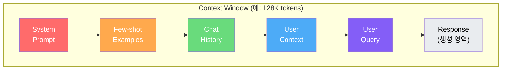
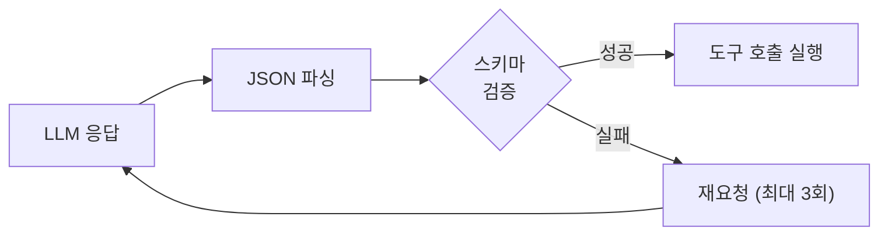

# Day 1 - Session 2: LLM 동작 원리 및 프롬프트 전략 심화 (2h)

> 이론 ~35분 / 실습 ~85분

## 학습 목표

이 세션을 마치면 다음을 할 수 있습니다:

1. Token, Context Window, Temperature 등 LLM 핵심 개념을 설명할 수 있다
2. Hallucination 발생 원인과 대응 전략을 적용할 수 있다
3. Zero-shot / Few-shot / CoT 전략을 상황에 맞게 선택할 수 있다
4. Structured Output(JSON Schema)으로 LLM 응답을 통제할 수 있다
5. 비용과 Latency를 고려한 호출 최적화 전략을 설계할 수 있다

---

## 1. LLM 동작 원리

### 1.1 Token과 토큰화

LLM은 텍스트를 **토큰(Token)** 단위로 처리한다. 토큰은 단어, 부분 단어, 또는 문자 단위이다.

```
입력: "AI Agent를 개발합니다"
토큰화: ["AI", " Agent", "를", " 개발", "합니다"]  (약 5-7 토큰)

영어: 1 토큰 ≈ 4자, 1단어 ≈ 1.3 토큰
한국어: 1 토큰 ≈ 1-2자, 1단어 ≈ 2-3 토큰 (더 많은 토큰 소비)
```

**비용 영향**: 한국어는 영어 대비 약 1.5~2배 토큰을 소비한다. 프롬프트 설계 시 이를 고려해야 한다.

### 1.2 Context Window



| 모델 | Context Window | 입력 비용 (1M tokens) | 출력 비용 (1M tokens) |
|------|---------------|----------------------|----------------------|
| GPT-4o | 128K | $2.50 | $10.00 |
| GPT-4o-mini | 128K | $0.15 | $0.60 |
| Claude 3.5 Sonnet | 200K | $3.00 | $15.00 |
| Claude 3.5 Haiku | 200K | $0.80 | $4.00 |

**핵심 원리**: Context Window는 유한하다. Agent는 여러 번 LLM을 호출하므로, 매 호출마다 컨텍스트를 효율적으로 관리해야 한다.

### 1.3 Temperature와 생성 제어

```
Temperature = 0.0  → 결정적 (항상 같은 응답, 분류·추출에 적합)
Temperature = 0.7  → 창의적 (다양한 응답, 브레인스토밍에 적합)
Temperature = 1.0+ → 무작위 (예측 불가, 실무에서 거의 사용 안 함)
```

**Agent에서의 권장값**:
- 도구 선택 / 계획 수립: `temperature=0.0` (일관된 판단 필요)
- 응답 생성 / 요약: `temperature=0.3~0.5` (자연스러움과 정확성 균형)
- 아이디어 생성: `temperature=0.7~0.9` (창의성 필요)

---

## 2. Hallucination: 발생 원인과 대응

### 2.1 Hallucination이란?

LLM이 사실이 아닌 내용을 그럴듯하게 생성하는 현상이다. Agent에서 Hallucination은 **잘못된 도구 호출**, **존재하지 않는 API 파라미터 생성**, **허위 데이터 기반 판단** 등 치명적 문제로 이어진다.

### 2.2 발생 원인과 대응 전략

| 원인 | 설명 | 대응 전략 |
|------|------|----------|
| 학습 데이터 한계 | 2024년 이후 정보를 모름 | RAG로 최신 정보 주입 |
| 확률적 생성 | 가장 그럴듯한 다음 토큰 선택 | Temperature 낮추기, Structured Output |
| 프롬프트 모호성 | 모호한 질문에 추측으로 대응 | 명확한 지시 + 예시 제공 |
| 컨텍스트 부족 | 판단 근거 없이 생성 | 충분한 컨텍스트 제공 |
| 과도한 기대 | 모델 능력 밖의 요청 | 작업을 작은 단위로 분해 |

### 2.3 Agent에서의 Hallucination 방어

```python
# 나쁜 예: 도구 이름을 LLM이 자유롭게 생성
response = client.chat.completions.create(
    model="gpt-4o",
    messages=[{"role": "user", "content": "적절한 도구를 선택해주세요"}]
)
# LLM이 존재하지 않는 도구 이름을 만들어낼 수 있음

# 좋은 예: 도구 목록을 명시적으로 제한
tools = [
    {"type": "function", "function": {"name": "search_documents", ...}},
    {"type": "function", "function": {"name": "send_email", ...}},
]
response = client.chat.completions.create(
    model="gpt-4o",
    messages=[{"role": "user", "content": "적절한 도구를 선택해주세요"}],
    tools=tools,  # 허용된 도구 목록으로 제한
    tool_choice="auto"
)
```

---

## 3. 프롬프트 전략 비교

### 3.1 Zero-shot

사전 예시 없이 지시만으로 수행하는 전략이다.

```python
import os
from openai import OpenAI

client = OpenAI(api_key=os.environ["OPENAI_API_KEY"])

# Zero-shot: 예시 없이 바로 분류 요청
response = client.chat.completions.create(
    model="gpt-4o-mini",
    temperature=0,
    messages=[
        {
            "role": "system",
            "content": "고객 문의를 다음 카테고리 중 하나로 분류하세요: 배송, 환불, 제품문의, 기타"
        },
        {
            "role": "user",
            "content": "주문한 지 일주일이 넘었는데 아직 안 왔어요"
        }
    ]
)
print(response.choices[0].message.content)
# 출력: "배송"
```

**장점**: 프롬프트가 짧아 토큰 절약, 빠른 프로토타이핑
**단점**: 복잡한 작업에서 정확도 떨어짐, 출력 형식 불안정

### 3.2 Few-shot

입력-출력 예시를 제공하여 패턴을 학습시키는 전략이다.

```python
response = client.chat.completions.create(
    model="gpt-4o-mini",
    temperature=0,
    messages=[
        {
            "role": "system",
            "content": "고객 문의를 분류하고 긴급도를 판단하세요."
        },
        # Few-shot 예시 1
        {
            "role": "user",
            "content": "결제했는데 취소가 안 돼요"
        },
        {
            "role": "assistant",
            "content": "카테고리: 환불\n긴급도: 높음\n이유: 결제 관련 문제는 즉시 처리 필요"
        },
        # Few-shot 예시 2
        {
            "role": "user",
            "content": "이 제품 색상이 몇 가지인가요?"
        },
        {
            "role": "assistant",
            "content": "카테고리: 제품문의\n긴급도: 낮음\n이유: 단순 정보 요청"
        },
        # 실제 분류 대상
        {
            "role": "user",
            "content": "배송 중 파손된 것 같은데 교환 가능한가요?"
        }
    ]
)
print(response.choices[0].message.content)
# 출력:
# 카테고리: 환불
# 긴급도: 높음
# 이유: 제품 파손은 즉시 교환/환불 처리 필요
```

**장점**: 출력 형식 안정화, 복잡한 작업에서 정확도 향상
**단점**: 토큰 소비 증가, 예시 선택에 따라 편향 발생 가능

### 3.3 Chain of Thought (CoT)

중간 추론 과정을 명시적으로 요구하는 전략이다. Agent의 계획 수립에 핵심적으로 사용된다.

```python
response = client.chat.completions.create(
    model="gpt-4o",
    temperature=0,
    messages=[
        {
            "role": "system",
            "content": """고객 문의를 분석하세요. 반드시 다음 단계를 거쳐 추론하세요:

1단계 - 문의 내용 파악: 고객이 무엇을 원하는지 정리
2단계 - 감정 분석: 고객의 감정 상태 판단
3단계 - 카테고리 분류: 배송/환불/제품문의/기타 중 선택
4단계 - 긴급도 판단: 높음/중간/낮음 중 선택
5단계 - 대응 방안: 어떤 조치가 필요한지 제안"""
        },
        {
            "role": "user",
            "content": "3일 전에 환불 요청했는데 아직 처리가 안 됐고, 고객센터 전화도 안 받아요. 정말 화가 납니다."
        }
    ]
)
print(response.choices[0].message.content)
```

**장점**: 복잡한 추론에서 정확도 대폭 향상, 판단 근거 추적 가능
**단점**: 토큰 소비 최대, 간단한 작업에는 과도

### 3.4 전략 선택 가이드

| 상황 | 권장 전략 | 이유 |
|------|----------|------|
| 단순 분류 (카테고리 5개 이하) | Zero-shot | 예시 없이도 충분한 정확도 |
| 복잡한 분류 (10개 이상 / 모호한 기준) | Few-shot | 예시로 기준 명확화 |
| 다단계 판단 (Agent의 계획 수립) | CoT | 추론 과정이 정확도에 결정적 |
| 비용 민감한 대량 처리 | Zero-shot + 작은 모델 | 토큰 최소화 |
| 정확도 최우선 | CoT + 큰 모델 | 최고 성능 확보 |

---

## 4. Structured Output: JSON Schema 응답 통제

### 4.1 왜 Structured Output인가?

Agent에서 LLM 응답을 파싱해야 하는 경우가 대부분이다. 자유 형식 텍스트는 파싱이 불안정하므로, JSON Schema로 출력 형식을 강제한다.

### 4.2 Pydantic + OpenAI Structured Output

```python
import os
from openai import OpenAI
from pydantic import BaseModel, Field
from enum import Enum

client = OpenAI(api_key=os.environ["OPENAI_API_KEY"])


class Category(str, Enum):
    SHIPPING = "배송"
    REFUND = "환불"
    PRODUCT = "제품문의"
    OTHER = "기타"


class Urgency(str, Enum):
    HIGH = "높음"
    MEDIUM = "중간"
    LOW = "낮음"


class CustomerInquiryAnalysis(BaseModel):
    """고객 문의 분석 결과"""
    category: Category = Field(description="문의 카테고리")
    urgency: Urgency = Field(description="긴급도")
    summary: str = Field(description="문의 요약 (1문장)")
    reasoning: str = Field(description="분류 판단 근거")
    suggested_action: str = Field(description="권장 대응 조치")


response = client.beta.chat.completions.parse(
    model="gpt-4o-mini",
    temperature=0,
    messages=[
        {
            "role": "system",
            "content": "고객 문의를 분석하여 분류하세요."
        },
        {
            "role": "user",
            "content": "결제가 이중으로 된 것 같아요. 확인해주세요."
        }
    ],
    response_format=CustomerInquiryAnalysis,
)

result = response.choices[0].message.parsed
print(f"카테고리: {result.category.value}")
print(f"긴급도: {result.urgency.value}")
print(f"요약: {result.summary}")
print(f"근거: {result.reasoning}")
print(f"조치: {result.suggested_action}")
```

### 4.3 Anthropic Claude Structured Output (tool_use 활용)

```python
import os
import anthropic
import json

client = anthropic.Anthropic(api_key=os.environ["ANTHROPIC_API_KEY"])

# Claude는 tool_use를 통해 structured output을 지원
tools = [
    {
        "name": "analyze_inquiry",
        "description": "고객 문의 분석 결과를 구조화하여 반환",
        "input_schema": {
            "type": "object",
            "properties": {
                "category": {
                    "type": "string",
                    "enum": ["배송", "환불", "제품문의", "기타"],
                    "description": "문의 카테고리"
                },
                "urgency": {
                    "type": "string",
                    "enum": ["높음", "중간", "낮음"],
                    "description": "긴급도"
                },
                "summary": {
                    "type": "string",
                    "description": "문의 요약 (1문장)"
                },
                "reasoning": {
                    "type": "string",
                    "description": "분류 판단 근거"
                }
            },
            "required": ["category", "urgency", "summary", "reasoning"]
        }
    }
]

response = client.messages.create(
    model="claude-sonnet-4-20250514",
    max_tokens=1024,
    tools=tools,
    tool_choice={"type": "tool", "name": "analyze_inquiry"},
    messages=[
        {
            "role": "user",
            "content": "배송 받은 상품이 주문한 것과 다릅니다. 빨리 처리해주세요."
        }
    ]
)

# tool_use 블록에서 구조화된 결과 추출
for block in response.content:
    if block.type == "tool_use":
        result = block.input
        print(json.dumps(result, ensure_ascii=False, indent=2))
```

### 4.4 Agent에서 Structured Output이 중요한 이유



Agent 파이프라인에서 LLM 응답은 곧 **다음 행동의 입력**이다. 구조화되지 않은 응답은:
- 파싱 실패 → Agent 루프 중단
- 잘못된 파라미터 → 도구 호출 에러
- 타입 불일치 → 런타임 예외

Structured Output은 이 문제를 근본적으로 해결한다.

---

## 5. 비용 및 Latency 최적화

### 5.1 모델별 비용·성능 비교

| 모델 | 입력 ($/1M) | 출력 ($/1M) | Latency (TTFT) | 추론 능력 | 권장 용도 |
|------|------------|------------|----------------|----------|----------|
| GPT-4o | $2.50 | $10.00 | ~0.5s | 매우 높음 | 복잡한 추론, 계획 수립 |
| GPT-4o-mini | $0.15 | $0.60 | ~0.3s | 높음 | 분류, 요약, 일반 처리 |
| Claude Sonnet | $3.00 | $15.00 | ~0.5s | 매우 높음 | 장문 분석, 코드 생성 |
| Claude Haiku | $0.80 | $4.00 | ~0.2s | 높음 | 빠른 분류, 간단한 작업 |

### 5.2 최적화 전략

**전략 1: 모델 라우팅**

```python
def select_model(task_complexity: str) -> str:
    """작업 복잡도에 따라 최적 모델을 선택한다."""
    routing = {
        "simple": "gpt-4o-mini",   # 단순 분류, 추출
        "medium": "gpt-4o-mini",   # 요약, 변환
        "complex": "gpt-4o",       # 다단계 추론, 계획
        "critical": "gpt-4o",      # 최종 의사결정
    }
    return routing.get(task_complexity, "gpt-4o-mini")
```

**전략 2: 프롬프트 압축**

```python
# 나쁜 예: 불필요하게 긴 프롬프트 (200+ 토큰)
system_prompt_bad = """
당신은 매우 뛰어난 AI 어시스턴트입니다. 고객의 문의를 정확하게 분석하여
적절한 카테고리로 분류해야 합니다. 카테고리는 배송, 환불, 제품문의, 기타가
있으며, 각 카테고리의 정의는 다음과 같습니다...
(장황한 설명 계속)
"""

# 좋은 예: 핵심만 담은 프롬프트 (50 토큰)
system_prompt_good = """고객 문의를 분류하세요.
카테고리: 배송 | 환불 | 제품문의 | 기타
출력: 카테고리명만 반환"""
```

**전략 3: 캐싱**

```python
import hashlib
from functools import lru_cache

def get_cache_key(prompt: str, model: str) -> str:
    return hashlib.md5(f"{model}:{prompt}".encode()).hexdigest()

# 동일한 입력에 대해 LLM 재호출 방지
# 프로덕션에서는 Redis 등 외부 캐시 사용
response_cache: dict[str, str] = {}

def cached_llm_call(prompt: str, model: str = "gpt-4o-mini") -> str:
    key = get_cache_key(prompt, model)
    if key in response_cache:
        return response_cache[key]

    response = client.chat.completions.create(
        model=model,
        temperature=0,  # 캐싱하려면 결정적이어야 함
        messages=[{"role": "user", "content": prompt}]
    )
    result = response.choices[0].message.content
    response_cache[key] = result
    return result
```

### 5.3 Agent 비용 추정 공식

```
Agent 1회 실행 비용 = (평균 LLM 호출 횟수) × (평균 토큰 수) × (토큰 단가)

예시: 고객 문의 자동 분류 Agent
- 평균 3회 LLM 호출 (분류 → 긴급도 → 응답 생성)
- 호출당 평균 500 입력 토큰 + 200 출력 토큰
- GPT-4o-mini 사용
- 비용 = 3 × (500 × $0.15/1M + 200 × $0.60/1M) = $0.000585 ≈ 0.06센트/건
- 하루 200건 처리 = 약 $0.12/일 = 약 $3.6/월
```

---

## 6. GitHub Copilot 활용 Vibe Coding 소개

### 6.1 Vibe Coding이란?

자연어로 의도를 설명하면 AI가 코드를 생성하고, 개발자는 결과를 검증·수정하는 개발 방식이다. GitHub Copilot을 VS Code에서 활용하면 Agent 개발 속도를 크게 높일 수 있다.

### 6.2 Agent 개발에서의 활용 패턴

```
1. Copilot Chat에서 구조 설계 요청
   → "고객 문의를 분류하는 OpenAI function calling 코드를 작성해줘"

2. 인라인 자동 완성으로 반복 코드 빠르게 작성
   → Pydantic 모델 필드 정의, API 호출 코드 등

3. 코드 설명 및 리팩토링 요청
   → "이 프롬프트를 Few-shot 방식으로 바꿔줘"

4. 테스트 코드 자동 생성
   → "이 함수에 대한 pytest 테스트를 작성해줘"
```

**팁**: Copilot은 컨텍스트를 주면 줄수록 더 정확한 코드를 생성한다. 주석으로 의도를 먼저 쓰고, 코드를 생성하게 하면 효과적이다.

---

## 7. 실습 안내

> **실습명**: 프롬프트 전략별 응답 비교 실습
> **소요 시간**: 약 85분
> **형태**: Python 코드 실습
> **실습 디렉토리**: `labs/day1-prompt-strategy/`
> **사전 준비**: OpenAI API 키 환경변수 설정 (`OPENAI_API_KEY`)

### I DO (시연) — 15분

강사가 `src/i_do_demo.py`를 실행하며 4가지 프롬프트 전략의 차이를 시연한다.

- 동일한 고객 문의에 대해 Zero-shot / Few-shot / CoT / Structured Output 비교
- 응답 품질, 형식 안정성, 토큰 사용량 차이를 실시간으로 확인
- Copilot으로 코드를 수정하며 Vibe Coding 방식도 시연

### WE DO (함께) — 30분

`src/we_do_structured.py`를 함께 작성한다.

1. Pydantic 모델 정의 (고객 문의 분석 스키마)
2. OpenAI Structured Output API 호출
3. 응답 파싱 및 검증
4. 다양한 입력으로 테스트

### YOU DO (독립) — 40분

`src/you_do_optimize.py`의 TODO를 채워 최적 프롬프트를 설계한다.

**과제**: 주어진 5개 테스트 케이스에 대해 정확도 80% 이상 달성하면서 비용은 최소화하는 프롬프트를 설계하라.

- 전략 선택 (Zero-shot / Few-shot / CoT 중 택)
- 모델 선택 (gpt-4o / gpt-4o-mini 중 택)
- Temperature 설정
- 결과: 정확도 + 비용 계산 리포트 출력

**정답 코드**: `solution/you_do_optimize.py` 참고

---

## 핵심 요약

```
LLM = 확률적 토큰 생성기 (Context Window 제한, Hallucination 주의)
프롬프트 전략 = Zero-shot(빠름) < Few-shot(안정) < CoT(정확)
Structured Output = Agent 파이프라인의 안정성 핵심 (Pydantic + JSON Schema)
비용 최적화 = 모델 라우팅 + 프롬프트 압축 + 캐싱
```

---

## 다음 세션 예고

Session 3에서는 Agent **기획서를 구조화**하는 방법을 학습한다. Task 분해, 상태 관리, 예외 처리 전략을 설계하고, 실제 Agent 기획서를 작성한다.
