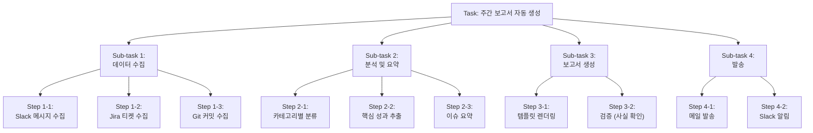
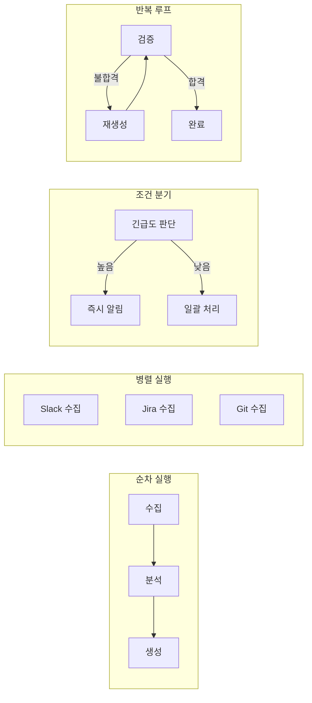
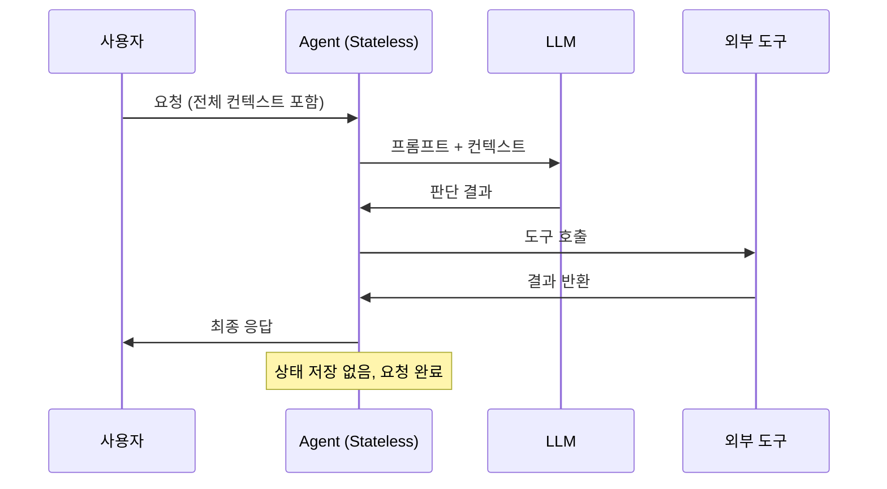
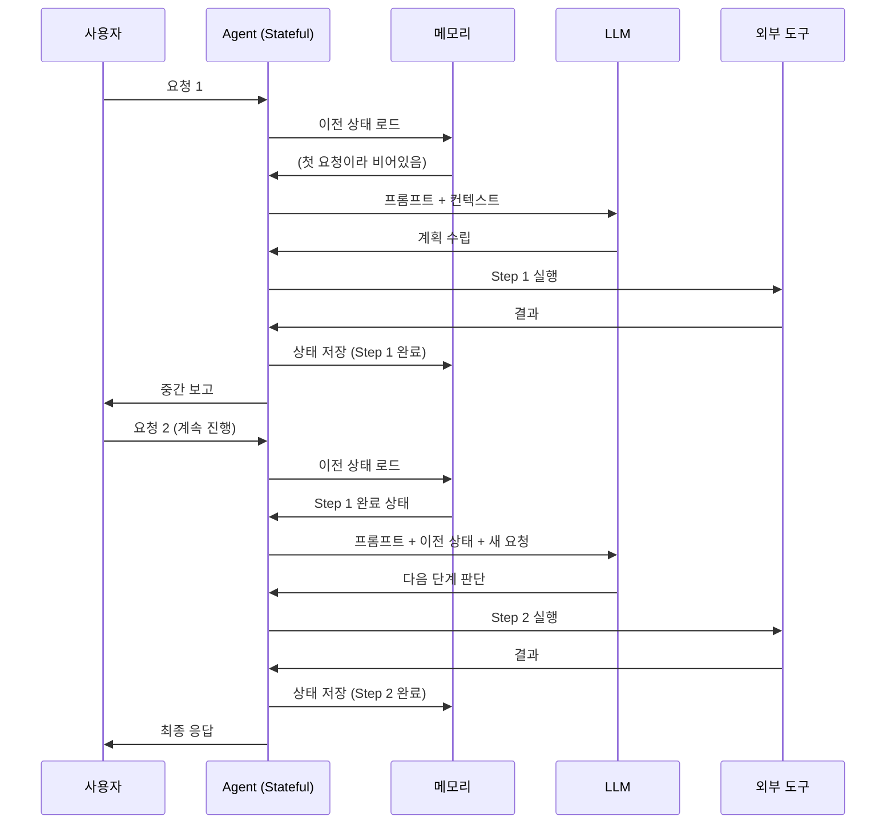
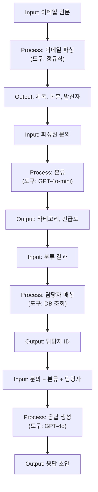
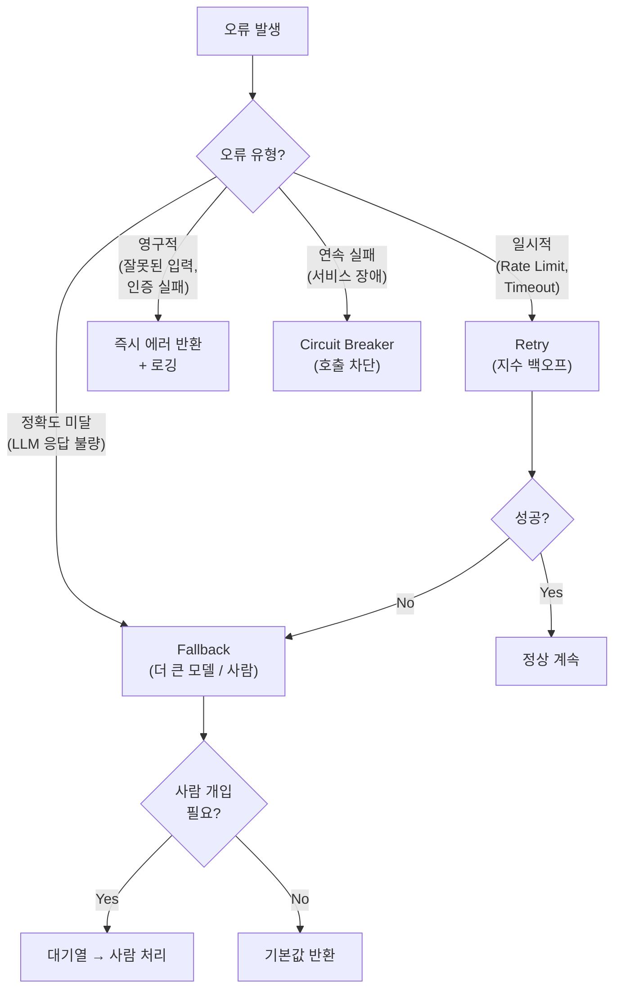

# Day 1 - Session 3: Agent 기획서 구조화 (2h)

> 이론 ~35분 / 실습 ~85분

## 학습 목표

이 세션을 마치면 다음을 할 수 있습니다:

1. 복잡한 업무를 Task → Sub-task → Workflow로 체계적으로 분해할 수 있다
2. Stateless와 Stateful 구조의 차이를 이해하고 적절한 구조를 선택할 수 있다
3. Agent의 Input-Process-Output을 명확하게 정의할 수 있다
4. 예외 처리 전략(Retry, Fallback, Circuit Breaker)을 설계할 수 있다
5. 실무에 바로 쓸 수 있는 Agent 기획서를 작성할 수 있다

---

## 1. Task 분해 전략

### 1.1 왜 Task 분해가 중요한가?

Agent에게 "주간 보고서를 작성해줘"라고만 하면 실패한다. LLM은 큰 목표를 한 번에 처리하는 데 약하다. **작은 단위로 분해하면 각 단계의 정확도가 올라가고, 실패 지점을 특정할 수 있다.**

### 1.2 3단계 분해: Task → Sub-task → Step



### 1.3 분해 원칙

**MECE (Mutually Exclusive, Collectively Exhaustive)**
- 각 Sub-task는 서로 겹치지 않으면서 전체를 빠짐없이 포괄해야 한다
- 하나의 Sub-task가 실패해도 다른 Sub-task에 영향을 최소화

**단일 책임 원칙**
- 각 Step은 하나의 명확한 역할만 수행
- "Slack 메시지 수집 + 분류"처럼 합치지 않기

**적절한 깊이**
- 보통 3단계(Task → Sub-task → Step)가 적당
- Step 하나가 LLM 1회 호출 또는 도구 1회 호출에 대응되면 이상적

### 1.4 Workflow 패턴

Task를 분해한 후, Sub-task 간의 실행 순서를 정의한다.



| 패턴 | 설명 | 사용 시점 |
|------|------|----------|
| Sequential | 순서대로 실행 | 이전 결과가 다음 입력인 경우 |
| Parallel | 동시 실행 | 독립적인 작업들 (데이터 수집 등) |
| Conditional | 조건 분기 | 결과에 따라 다음 행동이 달라지는 경우 |
| Loop | 반복 실행 | 품질 검증 후 재시도가 필요한 경우 |

---

## 2. Stateless vs Stateful 구조

### 2.1 개념 비교

| 구분 | Stateless | Stateful |
|------|-----------|----------|
| 상태 유지 | 매 요청이 독립적 | 이전 대화/작업 상태를 기억 |
| 메모리 | 없음 (매번 새로 시작) | 단기 메모리 + 장기 메모리 |
| 구현 복잡도 | 낮음 | 높음 |
| 확장성 | 높음 (수평 확장 용이) | 중간 (상태 동기화 필요) |
| 비용 | 낮음 | 높음 (상태 저장 + 컨텍스트 전달) |
| 적합한 Agent | 단발성 처리 (분류, 변환) | 대화형, 다단계 작업 |

### 2.2 Stateless Agent 시퀀스



### 2.3 Stateful Agent 시퀀스



### 2.4 선택 기준

다음 조건 중 **2개 이상** 해당되면 Stateful을 고려한다:
- 작업이 여러 턴에 걸쳐 진행된다
- 이전 대화 내용이 다음 판단에 영향을 준다
- 중간에 실패하면 처음부터 다시 시작하는 것이 비효율적이다
- 사용자와 대화하며 점진적으로 작업을 수행한다

그 외에는 Stateless가 더 간단하고 안정적이다.

---

## 3. Input-Process-Output 명확화

### 3.1 IPO 템플릿

Agent의 각 Step을 다음 형식으로 정의한다:

```
Step: [Step 이름]
─────────────────────────────────────────────
Input:
  - 데이터: [어떤 데이터가 들어오는가]
  - 형식: [JSON, 텍스트, 파일 등]
  - 출처: [이전 Step, API, 사용자 입력 등]

Process:
  - 사용 도구: [LLM, API, DB 등]
  - 처리 로직: [무엇을 하는가]
  - 제약 조건: [타임아웃, 크기 제한 등]

Output:
  - 데이터: [어떤 결과를 내보내는가]
  - 형식: [JSON Schema 정의]
  - 다음 Step: [어디로 전달되는가]
  - 실패 시: [에러 핸들링 방법]
```

### 3.2 IPO 예시: 고객 문의 분류 Step

```
Step: classify_inquiry
─────────────────────────────────────────────
Input:
  - 데이터: 고객 문의 원문 텍스트
  - 형식: string (최대 2000자)
  - 출처: 이메일 파싱 Step의 출력

Process:
  - 사용 도구: GPT-4o-mini (temperature=0)
  - 처리 로직: Few-shot 분류 프롬프트로 카테고리 + 긴급도 판단
  - 제약 조건: 타임아웃 10초, 최대 재시도 3회

Output:
  - 데이터: {category, urgency, confidence}
  - 형식: JSON (Pydantic 스키마)
  - 다음 Step: confidence >= 0.8 → route_to_agent / else → human_review
  - 실패 시: 기본값(category="기타", urgency="중간")으로 Fallback
```

### 3.3 데이터 흐름 다이어그램

IPO를 연결하면 전체 Agent의 데이터 흐름이 보인다:



---

## 4. 예외 처리 전략

### 4.1 Agent에서 예외 처리가 중요한 이유

Agent는 외부 시스템(API, DB, LLM)과 상호작용하므로 실패 지점이 많다. 예외 처리 없이는 하나의 실패가 전체 Agent를 중단시킨다.

### 4.2 3가지 핵심 패턴

**패턴 1: Retry (재시도)**

```python
import time
from openai import OpenAI, RateLimitError, APITimeoutError

client = OpenAI()

def llm_call_with_retry(
    messages: list,
    model: str = "gpt-4o-mini",
    max_retries: int = 3,
    base_delay: float = 1.0,
) -> str:
    """지수 백오프 재시도를 적용한 LLM 호출"""
    for attempt in range(max_retries):
        try:
            response = client.chat.completions.create(
                model=model,
                messages=messages,
                temperature=0,
                timeout=10,
            )
            return response.choices[0].message.content
        except (RateLimitError, APITimeoutError) as e:
            if attempt == max_retries - 1:
                raise  # 최종 시도에서도 실패하면 예외 전파
            delay = base_delay * (2 ** attempt)  # 1초 → 2초 → 4초
            print(f"재시도 {attempt + 1}/{max_retries}, {delay}초 후 재시도: {e}")
            time.sleep(delay)
```

**적용 시점**: 일시적 오류(Rate Limit, 타임아웃, 네트워크 에러)

**패턴 2: Fallback (대체 경로)**

```python
def classify_with_fallback(inquiry: str) -> dict:
    """분류 실패 시 대체 전략으로 전환"""
    try:
        # 1차 시도: GPT-4o-mini로 분류
        result = classify_inquiry(inquiry, model="gpt-4o-mini")
        if result["confidence"] >= 0.8:
            return result

        # 2차 시도: 신뢰도 낮으면 더 큰 모델로 재분류
        result = classify_inquiry(inquiry, model="gpt-4o")
        if result["confidence"] >= 0.7:
            return result

        # 3차: 그래도 낮으면 사람에게 전달
        return {
            "category": "미분류",
            "urgency": "중간",
            "confidence": 0.0,
            "action": "human_review",
            "reason": "자동 분류 신뢰도 미달"
        }
    except Exception as e:
        # 최종 Fallback: 시스템 오류 시 기본값 반환
        return {
            "category": "기타",
            "urgency": "중간",
            "confidence": 0.0,
            "action": "human_review",
            "reason": f"시스템 오류: {str(e)}"
        }
```

**적용 시점**: 정확도 미달, 모델 응답 불량, 서비스 장애

**패턴 3: Circuit Breaker (회로 차단)**

```python
from datetime import datetime, timedelta

class CircuitBreaker:
    """연속 실패 시 호출을 차단하여 시스템을 보호한다."""

    def __init__(
        self,
        failure_threshold: int = 5,
        recovery_timeout: int = 60,
    ):
        self.failure_threshold = failure_threshold
        self.recovery_timeout = recovery_timeout
        self.failure_count = 0
        self.last_failure_time: datetime | None = None
        self.state = "CLOSED"  # CLOSED(정상), OPEN(차단), HALF_OPEN(시험)

    def can_execute(self) -> bool:
        if self.state == "CLOSED":
            return True
        if self.state == "OPEN":
            if (datetime.now() - self.last_failure_time) > timedelta(
                seconds=self.recovery_timeout
            ):
                self.state = "HALF_OPEN"
                return True
            return False
        return True  # HALF_OPEN: 시험 호출 허용

    def record_success(self):
        self.failure_count = 0
        self.state = "CLOSED"

    def record_failure(self):
        self.failure_count += 1
        self.last_failure_time = datetime.now()
        if self.failure_count >= self.failure_threshold:
            self.state = "OPEN"


# 사용 예
openai_breaker = CircuitBreaker(failure_threshold=5, recovery_timeout=60)

def safe_llm_call(messages: list) -> str:
    if not openai_breaker.can_execute():
        raise RuntimeError(
            "OpenAI API 회로 차단 중 (연속 실패). "
            f"{openai_breaker.recovery_timeout}초 후 재시도"
        )
    try:
        result = llm_call_with_retry(messages)
        openai_breaker.record_success()
        return result
    except Exception as e:
        openai_breaker.record_failure()
        raise
```

**적용 시점**: 외부 서비스 장애 시 무한 재시도 방지, 시스템 자원 보호

### 4.3 예외 처리 전략 선택 가이드



---

## 5. Agent 기획서 템플릿

### 5.1 기획서에 포함해야 할 항목

실무에서 Agent를 개발하기 전에 작성하는 기획서이다. 이 템플릿을 채우면 개발 범위와 방향이 명확해진다.

```
# Agent 기획서: [Agent 이름]

## 1. 개요
- 목적: [이 Agent가 해결하는 문제]
- 대상 사용자: [누가 사용하는가]
- 기대 효과: [시간 절약, 비용 절감, 정확도 향상 등 정량적 수치]

## 2. 범위
- 포함: [Agent가 처리하는 작업 목록]
- 제외: [Agent가 처리하지 않는 작업 (명확한 경계)]

## 3. 구조 설계
- 아키텍처: [Stateless / Stateful, 단일 Agent / Multi-Agent]
- 패턴: [자동화형 / 분석형 / Planner형]
- 기술 스택: [사용 모델, 프레임워크, DB 등]

## 4. Workflow
- Task 분해도 (Mermaid 다이어그램)
- 각 Step의 IPO 정의

## 5. 도구 (Tools)
- 도구 목록 및 역할
- API 스펙 (입출력)

## 6. 예외 처리
- 실패 시나리오별 대응 전략
- Fallback 경로

## 7. 비용 추정
- LLM 호출 횟수 × 모델별 비용
- 월간 예상 비용

## 8. 성공 지표
- 정확도 목표
- 처리 시간 목표
- 비용 목표
```

---

## 6. 실습 안내

> **실습명**: Agent 기획서 작성 실습
> **소요 시간**: 약 85분
> **형태**: README 중심 설계 실습 (코드 없음)
> **실습 디렉토리**: `labs/day1-agent-blueprint/`

### I DO (시연) — 15분

강사가 **문서 요약 Agent** 기획서를 작성하는 과정을 시연한다.

시연 포인트:
- 목표를 먼저 정의하고, Task를 분해하는 과정
- Mermaid로 Workflow를 그리는 방법
- IPO 정의로 각 Step을 명확히 하는 방법
- 예외 처리 전략을 미리 설계하는 이유

### WE DO (함께) — 30분

전체가 함께 하나의 Agent 기획서를 작성한다.

1. Session 1에서 도출한 Agent 후보 중 하나를 선정
2. 함께 Task 분해를 진행 (화이트보드/공유 문서)
3. Stateless vs Stateful 구조를 토론으로 결정
4. IPO를 2-3개 Step에 대해 함께 정의
5. 예외 처리 전략을 논의

### YOU DO (독립) — 40분

개인 과제: **자신의 Agent 후보에 대해 기획서를 작성**한다.

1. `artifacts/blueprint-template.md`를 복사하여 작성
2. 필수 포함 항목:
   - Task 분해도 (Mermaid 다이어그램)
   - IPO 정의 (최소 3개 Step)
   - 예외 처리 전략 (최소 2개 시나리오)
   - 비용 추정 (대략적인 수치)
3. 완료 후 옆 사람과 교차 리뷰 (5분)
   - "이 기획서대로 개발할 수 있는가?" 관점에서 피드백

**산출물**: Agent 기획서 1매

**참고**: `artifacts/example-blueprint.md`에서 모범 기획서 예시를 확인할 수 있다.

---

## 핵심 요약

```
Task 분해 = Task → Sub-task → Step (MECE 원칙)
Workflow = Sequential | Parallel | Conditional | Loop
상태 관리 = Stateless(단순) vs Stateful(복잡하지만 강력)
IPO = 각 Step의 Input-Process-Output 명확 정의
예외 처리 = Retry + Fallback + Circuit Breaker 조합
기획서 = 개발 전 반드시 작성 (범위, 구조, 비용 명확화)
```

---

## 다음 세션 예고

Session 4에서는 Agent의 핵심 구성요소인 **MCP(Function Calling)**, **RAG**, 그리고 **Hybrid 구조**를 비교하고, 구조 설계 의사결정을 실습한다.
