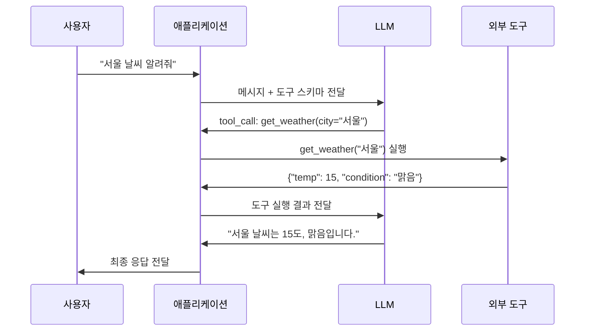
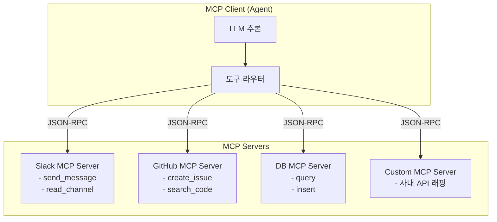
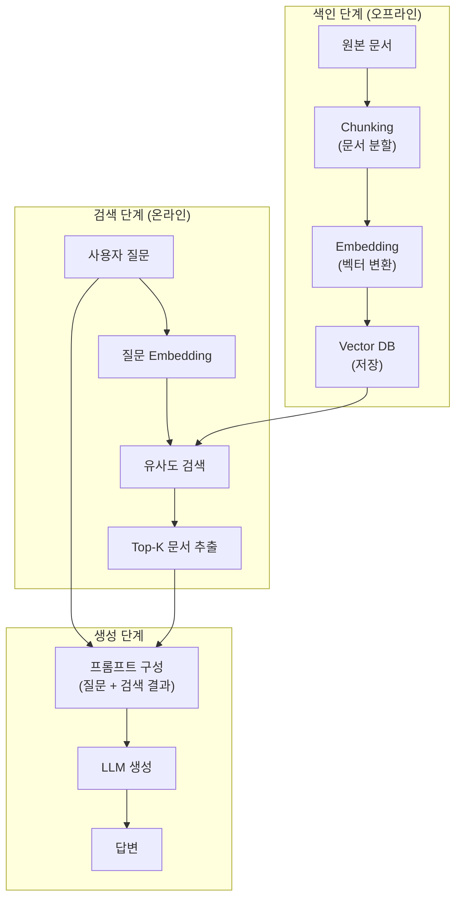
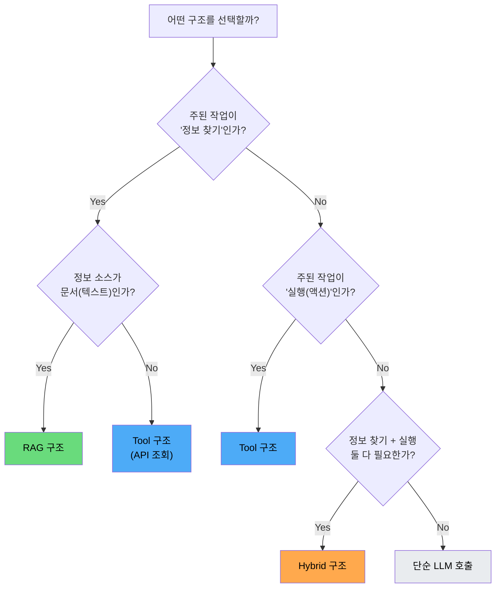
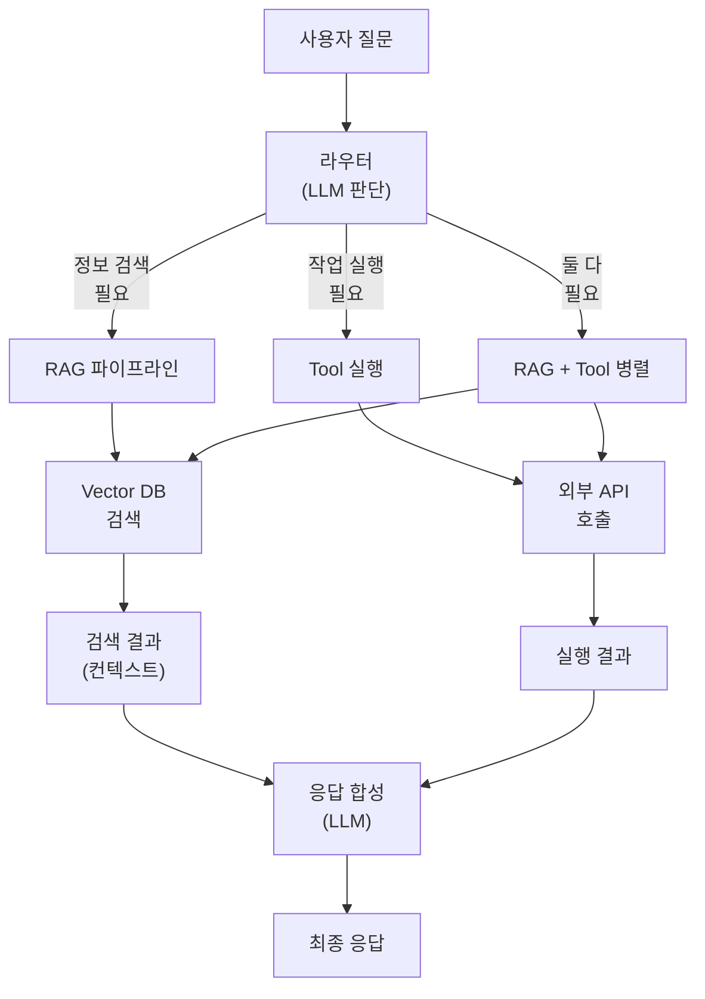
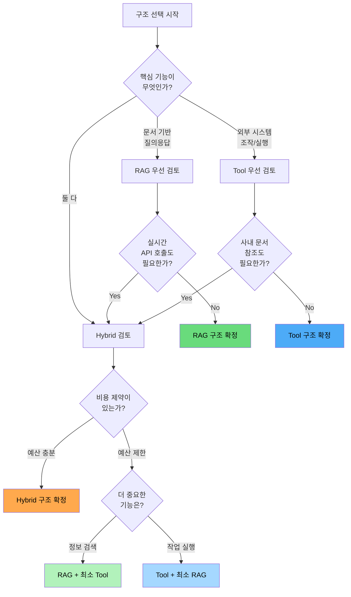
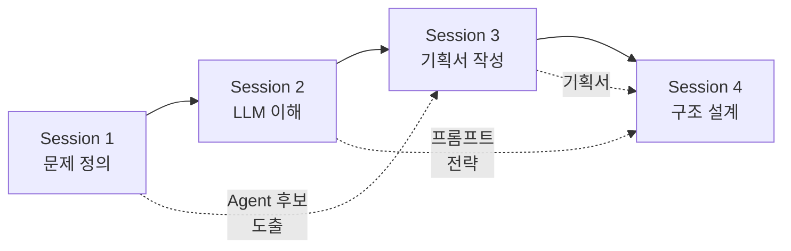

# Day 1 - Session 4: MCP, RAG, Hybrid 구조 판단 (2h)

> 이론 ~35분 / 실습 ~85분

## 학습 목표

이 세션을 마치면 다음을 할 수 있습니다:

1. MCP(Model Context Protocol)와 Function Calling의 개념과 설계 기준을 이해한다
2. RAG 파이프라인(Chunking → Embedding → Retrieval)을 설명할 수 있다
3. Tool 중심 구조와 RAG 중심 구조의 장단점을 비교할 수 있다
4. Hybrid 아키텍처의 설계 시 정확도, 비용, 확장성 트레이드오프를 판단할 수 있다
5. 주어진 문제에 대해 최적의 구조를 선택하고 근거를 제시할 수 있다

---

## 1. MCP와 Function Calling 개요

### 1.1 Function Calling이란?

LLM이 외부 함수(도구)를 **직접 호출하지 않고**, 호출해야 할 함수와 인자를 **JSON으로 출력**하는 메커니즘이다. 실제 실행은 애플리케이션 코드에서 수행한다.



**핵심 포인트**: LLM은 도구를 "실행"하지 않는다. **어떤 도구를 어떤 인자로 호출할지 판단**할 뿐이다. 실행은 애플리케이션의 책임이다.

### 1.2 MCP (Model Context Protocol)

MCP는 Anthropic이 주도하는 **표준 프로토콜**로, LLM과 외부 도구 간의 연결을 표준화한다. Function Calling의 상위 개념으로, 도구 서버(MCP Server)와 도구 클라이언트(MCP Client)를 분리하여 재사용성을 높인다.



### 1.3 MCP vs 직접 Function Calling 비교

| 구분 | 직접 Function Calling | MCP |
|------|---------------------|-----|
| 프로토콜 | 모델별 독자 규격 (OpenAI, Claude 각각) | 표준 JSON-RPC 프로토콜 |
| 도구 정의 | 애플리케이션 코드에 직접 구현 | 별도 MCP Server로 분리 |
| 재사용성 | 프로젝트마다 재구현 | 한번 만들면 모든 Agent에서 사용 |
| 생태계 | 자체 구축 | 오픈소스 MCP Server 활용 가능 |
| 복잡도 | 낮음 (빠른 프로토타이핑) | 중간 (Server 설정 필요) |
| 적합한 상황 | 도구 1-3개의 단순 Agent | 도구 5개 이상, 여러 Agent 공유 시 |

### 1.4 도구 설계 기준

좋은 도구(Tool)는 다음 원칙을 따른다:

**1. 단일 책임**
```
# 나쁜 예: 하나의 도구가 너무 많은 일을 함
def manage_customer(action, customer_id, data):
    if action == "create": ...
    elif action == "update": ...
    elif action == "delete": ...
    elif action == "search": ...

# 좋은 예: 행동별로 도구 분리
def create_customer(name, email): ...
def update_customer(customer_id, fields): ...
def search_customers(query, limit): ...
```

**2. 명확한 스키마**
```python
# 도구 스키마 예시 (OpenAI Function Calling 형식)
tools = [
    {
        "type": "function",
        "function": {
            "name": "search_documents",
            "description": "키워드로 사내 문서를 검색합니다. 최대 10건 반환.",
            "parameters": {
                "type": "object",
                "properties": {
                    "query": {
                        "type": "string",
                        "description": "검색 키워드 (예: '휴가 신청 방법')"
                    },
                    "department": {
                        "type": "string",
                        "enum": ["전체", "인사", "개발", "영업", "재무"],
                        "description": "검색 범위 부서"
                    },
                    "limit": {
                        "type": "integer",
                        "description": "반환할 최대 문서 수 (기본: 5)",
                        "default": 5
                    }
                },
                "required": ["query"]
            }
        }
    }
]
```

**3. 안전한 실행**
- 읽기 전용 도구와 쓰기 도구를 구분 (읽기는 자유, 쓰기는 확인 절차)
- 파라미터 검증 (타입, 범위, 길이 제한)
- 타임아웃 설정 (외부 API 호출 시 필수)

---

## 2. RAG 파이프라인 개요

### 2.1 RAG(Retrieval-Augmented Generation) 아키텍처



### 2.2 각 단계 상세

**Chunking (문서 분할)**

문서를 적절한 크기로 분할한다. Chunk 크기가 RAG 성능에 가장 큰 영향을 미친다.

| 전략 | Chunk 크기 | 장점 | 단점 |
|------|-----------|------|------|
| 고정 크기 | 500-1000 토큰 | 구현 간단 | 문맥이 잘릴 수 있음 |
| 문단 기반 | 자연 문단 단위 | 문맥 보존 | 크기 불균일 |
| 의미 기반 | 의미 단위 자동 분할 | 최고 품질 | 구현 복잡, 비용 높음 |
| 계층적 | 요약 + 상세 2단계 | 검색 정확도 높음 | 저장 공간 2배 |

```python
from langchain.text_splitter import RecursiveCharacterTextSplitter

# 실무에서 가장 많이 사용하는 Recursive 분할
splitter = RecursiveCharacterTextSplitter(
    chunk_size=500,       # 500자 단위
    chunk_overlap=50,     # 50자 겹침 (문맥 연결)
    separators=["\n\n", "\n", ". ", " ", ""],  # 분할 우선순위
)
chunks = splitter.split_text(document_text)
```

**Embedding (벡터 변환)**

텍스트를 고차원 벡터로 변환한다. 의미가 유사한 텍스트는 벡터 공간에서 가까이 위치한다.

| 모델 | 차원 | 성능 | 비용 (1M 토큰) | 비고 |
|------|------|------|---------------|------|
| text-embedding-3-small | 1536 | 좋음 | $0.02 | 가성비 최고 |
| text-embedding-3-large | 3072 | 매우 좋음 | $0.13 | 높은 정확도 |
| Cohere embed-v3 | 1024 | 매우 좋음 | $0.10 | 다국어 강점 |

```python
from openai import OpenAI
import os

client = OpenAI(api_key=os.environ["OPENAI_API_KEY"])

def get_embedding(text: str, model: str = "text-embedding-3-small") -> list[float]:
    response = client.embeddings.create(input=text, model=model)
    return response.data[0].embedding

# 사용 예
vector = get_embedding("AI Agent 개발 방법론")
print(f"벡터 차원: {len(vector)}")  # 1536
```

**Retrieval (검색)**

```python
import chromadb

# ChromaDB로 벡터 저장 및 검색
chroma_client = chromadb.Client()
collection = chroma_client.create_collection(
    name="company_docs",
    metadata={"hnsw:space": "cosine"},  # 코사인 유사도
)

# 문서 색인
collection.add(
    documents=chunks,
    ids=[f"doc_{i}" for i in range(len(chunks))],
    metadatas=[{"source": "handbook.pdf"} for _ in chunks],
)

# 검색
results = collection.query(
    query_texts=["휴가 신청 방법"],
    n_results=3,  # Top-3 검색
)
print(results["documents"])
```

### 2.3 RAG의 한계

RAG는 강력하지만 만능이 아니다:

- **검색 실패**: 질문과 관련 문서의 표현이 다르면 검색 누락 발생
- **Chunk 경계 문제**: 답변이 2개 Chunk에 걸쳐 있으면 불완전한 정보 제공
- **실시간 데이터 불가**: 색인 시점 이후의 데이터는 검색 불가
- **실행 불가**: 문서를 찾아줄 순 있지만, 메일 발송이나 DB 수정은 못 함

---

## 3. Tool 중심 vs RAG 중심 구조 비교

### 3.1 비교표

| 기준 | Tool 중심 (MCP/Function Calling) | RAG 중심 |
|------|--------------------------------|----------|
| 핵심 동작 | 외부 도구 호출로 **작업 수행** | 문서 검색으로 **정보 제공** |
| 데이터 소스 | 실시간 API, DB | 사전 색인된 문서 |
| 응답 근거 | 도구 실행 결과 (정확) | 검색된 문서 (유사도 기반) |
| Hallucination | 도구 결과가 사실이므로 낮음 | 검색 실패 시 발생 가능 |
| 비용 | API 호출 비용 + LLM 비용 | 임베딩 비용 + 벡터 DB 비용 + LLM 비용 |
| Latency | 도구 실행 시간에 의존 | 벡터 검색 (보통 <100ms) + LLM |
| 확장성 | 도구 추가 = 함수 추가 | 문서 추가 = 재색인 |
| 구현 복잡도 | 중간 (도구 구현 필요) | 중간 (파이프라인 구축 필요) |

### 3.2 선택 시나리오



### 3.3 실무 예시 비교

**예시 1: 사내 규정 QA 봇**

```
요구사항: 직원이 "연차 신청 방법"을 물으면 사내 규정에서 답변
→ RAG 구조가 적합
  - 사내 규정 문서를 색인
  - 질문과 유사한 문서를 검색
  - LLM이 검색 결과를 기반으로 답변 생성
  - 도구 호출 불필요 (정보 검색만 하면 됨)
```

**예시 2: 서버 모니터링 Agent**

```
요구사항: "CPU 90% 이상인 서버를 찾아서 스케일 아웃해줘"
→ Tool 구조가 적합
  - CloudWatch API로 서버 상태 조회 (도구 1)
  - 조건에 맞는 서버 필터링 (LLM 판단)
  - Auto Scaling API로 인스턴스 추가 (도구 2)
  - Slack으로 결과 알림 (도구 3)
  - 문서 검색 불필요 (실시간 데이터 + 실행)
```

**예시 3: 고객 상담 Agent**

```
요구사항: 고객 문의에 제품 정보 + 주문 상태 + 환불 처리까지
→ Hybrid 구조가 적합
  - 제품 FAQ 검색 → RAG (사전 색인된 FAQ 문서)
  - 주문 상태 조회 → Tool (주문 DB API 호출)
  - 환불 처리 → Tool (결제 API 호출)
  - LLM이 RAG 결과 + Tool 결과를 조합하여 응답
```

---

## 4. Hybrid 아키텍처 패턴

### 4.1 Hybrid 구조 다이어그램



### 4.2 라우터 구현 패턴

```python
from pydantic import BaseModel, Field
from enum import Enum
from openai import OpenAI
import os

client = OpenAI(api_key=os.environ["OPENAI_API_KEY"])


class RouteType(str, Enum):
    RAG = "rag"
    TOOL = "tool"
    HYBRID = "hybrid"
    DIRECT = "direct"


class RouteDecision(BaseModel):
    """사용자 질문을 적절한 처리 경로로 라우팅"""
    route: RouteType = Field(description="처리 경로")
    reasoning: str = Field(description="라우팅 판단 근거")
    rag_query: str | None = Field(
        default=None, description="RAG 검색 쿼리 (route가 rag/hybrid일 때)"
    )
    tool_name: str | None = Field(
        default=None, description="호출할 도구 이름 (route가 tool/hybrid일 때)"
    )


def route_query(user_query: str) -> RouteDecision:
    """사용자 질문을 분석하여 최적 처리 경로를 결정한다."""
    response = client.beta.chat.completions.parse(
        model="gpt-4o-mini",
        temperature=0,
        messages=[
            {
                "role": "system",
                "content": """사용자 질문을 분석하여 처리 경로를 결정하세요.

경로 기준:
- rag: 사내 문서/FAQ에서 정보를 찾아 답변할 수 있는 경우
- tool: 외부 시스템 조회/실행이 필요한 경우 (주문 조회, 환불 처리 등)
- hybrid: 문서 정보 + 시스템 실행 모두 필요한 경우
- direct: LLM만으로 답변 가능한 일반적인 질문"""
            },
            {"role": "user", "content": user_query}
        ],
        response_format=RouteDecision,
    )
    return response.choices[0].message.parsed


# 사용 예
decision = route_query("주문번호 A12345 환불 가능한가요?")
print(f"경로: {decision.route}")
print(f"근거: {decision.reasoning}")
```

### 4.3 Hybrid 설계 시 트레이드오프

| 기준 | RAG 비중 높음 | Tool 비중 높음 | 균형 Hybrid |
|------|-------------|--------------|------------|
| 정확도 | 문서 품질에 의존 | API 정확도에 의존 | 상호 보완 |
| 비용 | 임베딩 + 벡터DB + LLM | API 호출 + LLM | 가장 높음 |
| Latency | 중간 (~1-2초) | API 속도 의존 | 가장 높음 |
| 확장성 | 문서 추가 용이 | 도구 추가 용이 | 둘 다 관리 필요 |
| 유지보수 | 문서 갱신 + 재색인 | API 변경 대응 | 복잡도 최고 |

### 4.4 비용 추정 비교

```
시나리오: 하루 1000건 고객 문의 처리

RAG 전용:
  - 임베딩: 1000건 × 500토큰 × $0.02/1M = $0.01/일
  - 벡터 DB: ChromaDB (무료) 또는 Pinecone ($70/월)
  - LLM: 1000건 × 2000토큰 × $0.15/1M = $0.30/일
  - 합계: 약 $0.31/일 = $9.3/월

Tool 전용:
  - LLM: 1000건 × 3회 호출 × 1000토큰 × $0.15/1M = $0.45/일
  - API 호출: 무료~유료 (서비스별 상이)
  - 합계: 약 $0.45/일 = $13.5/월

Hybrid:
  - RAG 비용 + Tool 비용 + 라우터 LLM 비용
  - 라우터: 1000건 × 200토큰 × $0.15/1M = $0.03/일
  - 합계: 약 $0.79/일 = $23.7/월
```

---

## 5. 의사결정 프레임워크

### 5.1 구조 선택 의사결정 매트릭스

문제를 분석한 후, 다음 매트릭스에 점수를 매겨 최적 구조를 선택한다.

| 평가 항목 (가중치) | RAG 점수 | Tool 점수 | Hybrid 점수 |
|-------------------|---------|----------|------------|
| 정보 검색 필요도 (25%) | 0-10 | 0-10 | 0-10 |
| 작업 실행 필요도 (25%) | 0-10 | 0-10 | 0-10 |
| 비용 효율성 (20%) | 0-10 | 0-10 | 0-10 |
| 구현 복잡도 (15%) | 0-10 | 0-10 | 0-10 |
| 확장성 (15%) | 0-10 | 0-10 | 0-10 |
| **가중 합계** | **?** | **?** | **?** |

### 5.2 점수 부여 기준

```
정보 검색 필요도:
  - 10: 핵심 기능이 문서 검색 기반 QA
  - 5: 부분적으로 문서 참조 필요
  - 0: 문서 검색 불필요

작업 실행 필요도:
  - 10: 핵심 기능이 외부 시스템 조작
  - 5: 부분적으로 API 호출 필요
  - 0: 실행 행위 불필요

비용 효율성 (높을수록 좋음):
  - 10: 월 $10 이하
  - 5: 월 $50 이하
  - 0: 월 $100 이상

구현 복잡도 (낮을수록 좋음):
  - 10: 1주 이내 구현
  - 5: 2-4주 구현
  - 0: 1개월 이상

확장성 (높을수록 좋음):
  - 10: 기능 추가가 매우 쉬움
  - 5: 약간의 리팩토링 필요
  - 0: 구조 변경 필요
```

### 5.3 빠른 판단 플로우차트



---

## 6. 실습 안내

> **실습명**: MCP vs RAG 구조 설계 비교 실습
> **소요 시간**: 약 85분
> **형태**: README 중심 설계 실습 (코드 없음)
> **실습 디렉토리**: `labs/day1-architecture-decision/`

### I DO (시연) — 15분

강사가 **고객 상담 Agent**에 대해 구조 설계 의사결정을 시연한다.

시연 포인트:
- 요구사항 분석: 어떤 기능이 필요한가?
- 의사결정 매트릭스에 점수 부여하는 방법
- RAG / Tool / Hybrid 각각의 아키텍처 스케치
- 최종 선택과 근거 설명

### WE DO (함께) — 30분

전체가 함께 하나의 시나리오에 대해 구조를 결정한다.

1. 시나리오 제시: "신입 사원 온보딩 도우미 Agent"
   - 사내 규정/가이드 안내 (RAG적 요소)
   - 계정 생성, 권한 설정 (Tool적 요소)
   - 진행 상태 추적 (Stateful 요소)
2. 의사결정 매트릭스 점수를 함께 부여
3. 아키텍처 다이어그램을 함께 설계
4. 비용을 대략 추정

### YOU DO (독립) — 40분

개인 과제: **자신의 Agent에 대해 구조 설계 의사결정을 수행**한다.

1. `artifacts/decision-matrix-template.md`를 복사하여 작성
2. 필수 포함 항목:
   - 의사결정 매트릭스 점수 (5개 항목 모두)
   - 선택한 구조와 근거 (3줄 이상)
   - 아키텍처 다이어그램 (Mermaid)
   - 개략적 비용 추정
3. Session 1에서 도출한 Agent 후보 중 하나에 적용
4. 완료 후 옆 사람과 교차 리뷰 (5분)

**산출물**: 구조 설계 의사결정 문서 1매

**참고**: `artifacts/example-decision.md`에서 모범 답안 예시를 확인할 수 있다.

---

## 핵심 요약

```
Function Calling = LLM이 도구 호출을 JSON으로 출력, 실행은 앱이 담당
MCP = Function Calling의 표준 프로토콜 (Server/Client 분리, 재사용성)
RAG = Chunking → Embedding → Retrieval → Generation (정보 검색 특화)
Tool 중심 = 외부 시스템 조작/실행 특화
Hybrid = RAG + Tool 결합 (가장 강력하지만 비용·복잡도 최고)
구조 선택 = 의사결정 매트릭스로 정량적 비교 후 결정
```

---

## Day 1 마무리

오늘 학습한 4개 세션을 종합하면:



1. **문제 정의**: Pain → Task → Skill → Tool로 Agent 후보를 도출했다
2. **LLM 이해**: 프롬프트 전략과 Structured Output으로 LLM을 통제하는 법을 배웠다
3. **기획서**: Task 분해, IPO, 예외 처리를 포함한 기획서를 작성했다
4. **구조 설계**: MCP / RAG / Hybrid 중 최적 구조를 선택하는 의사결정을 수행했다

**Day 2 예고**: 내일은 LangGraph를 사용해 실제로 Agent를 **코드로 구현**한다.
