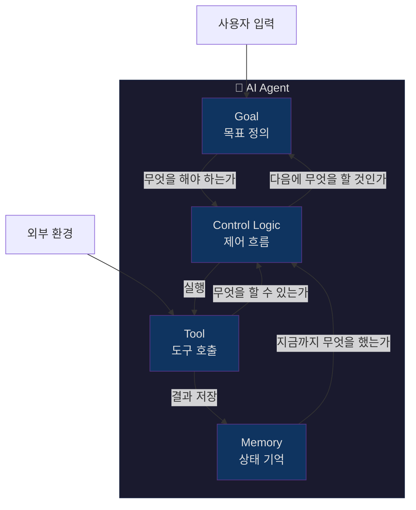
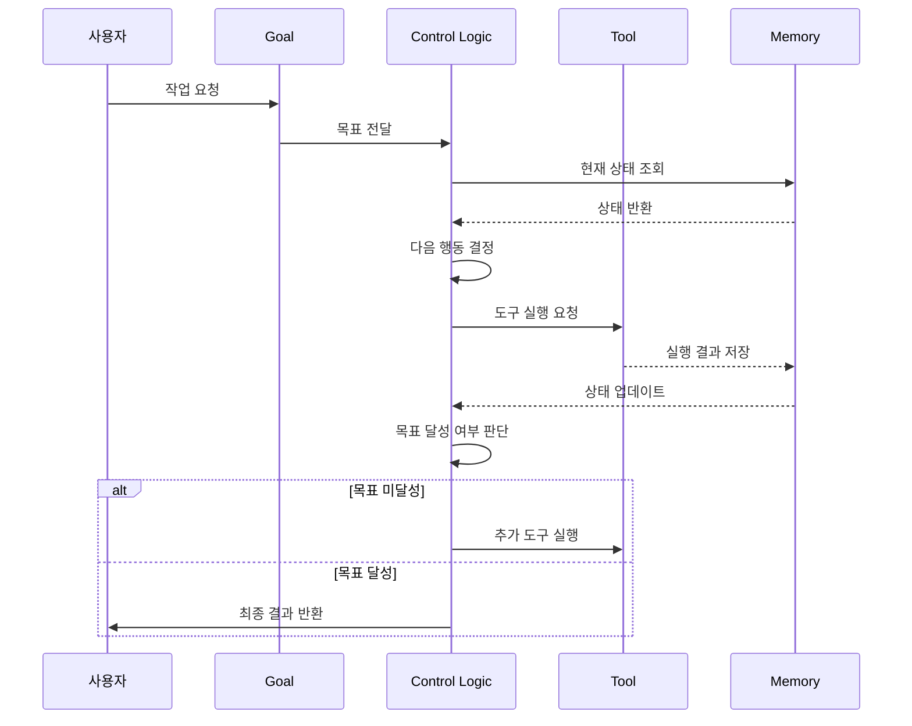
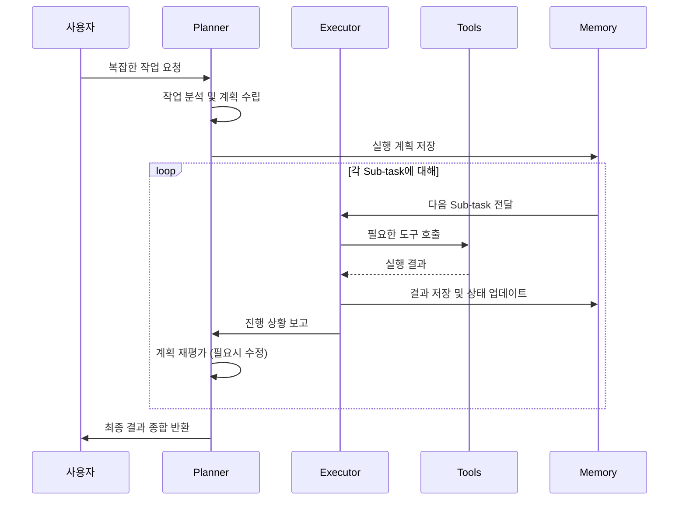
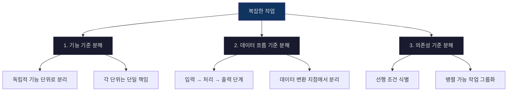
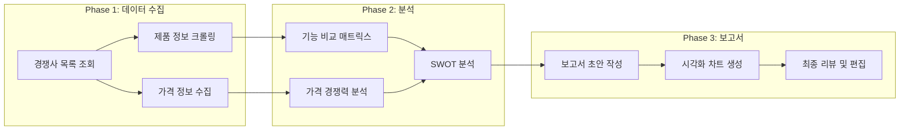
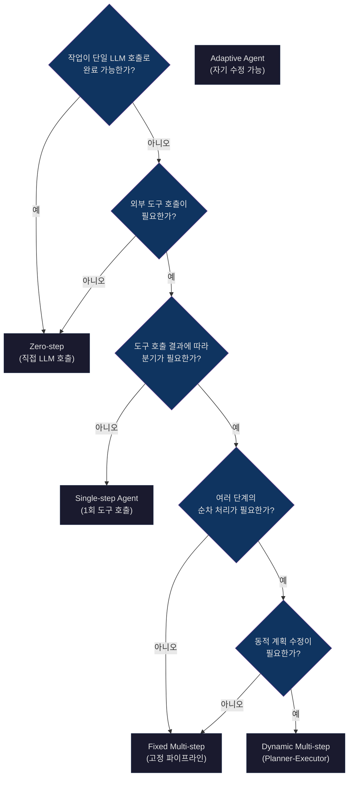

# Day 2 Session 1: Agent 4요소 구조 설계 (2h)

## 학습 목표

이 세션을 마치면 다음을 할 수 있습니다:

- Agent를 구성하는 4가지 핵심 요소(Goal, Memory, Tool, Control Logic)를 정의하고 설명할 수 있다
- Planner-Executor 패턴의 동작 원리를 이해하고 설계할 수 있다
- 복잡한 작업을 Sub-task로 분해하는 전략을 적용할 수 있다
- Single-step과 Multi-step Agent를 구분하고, 상황에 맞는 구조를 선택할 수 있다

---

## 1. Agent 4요소 모델

AI Agent는 단순한 LLM API 호출이 아닙니다. 자율적으로 판단하고 행동하는 시스템을 구성하려면 4가지 핵심 요소가 필요합니다.

### 4요소 구조도



### 각 요소 상세 설명

#### Goal (목표)

Agent가 달성해야 하는 최종 결과를 정의합니다. 명확한 목표가 없으면 Agent는 방향 없이 순환합니다.

```python
# 목표 정의 예시
goal = {
    "objective": "고객 문의를 분류하고 적절한 답변을 생성한다",
    "success_criteria": [
        "문의 유형 정확도 90% 이상",
        "응답 시간 3초 이내",
        "할루시네이션 없는 답변",
    ],
    "constraints": [
        "회사 정책에 반하는 답변 금지",
        "개인정보 노출 금지",
    ],
}
```

#### Memory (기억)

Agent가 작업 중 누적하는 상태 정보입니다. 단기 기억(현재 대화)과 장기 기억(과거 이력)으로 나뉩니다.

```python
from typing import TypedDict, Annotated
import operator


class AgentMemory(TypedDict):
    # 단기 기억: 현재 대화의 메시지 이력
    messages: Annotated[list, operator.add]
    # 작업 상태 추적
    current_step: str
    completed_steps: list[str]
    # 장기 기억: 이전 작업 결과 참조
    knowledge_base: dict
    # 에러 추적
    error_count: int
    last_error: str | None
```

#### Tool (도구)

Agent가 외부 세계와 상호작용하는 수단입니다. API 호출, DB 조회, 파일 읽기 등이 해당합니다.

```python
from langchain.tools import tool


@tool
def search_knowledge_base(query: str) -> str:
    """사내 지식 베이스에서 관련 문서를 검색합니다."""
    # ChromaDB 등 벡터 DB 조회
    results = vector_store.similarity_search(query, k=3)
    return "\n".join([doc.page_content for doc in results])


@tool
def create_ticket(title: str, priority: str, description: str) -> str:
    """고객 지원 티켓을 생성합니다."""
    ticket_id = ticket_system.create(
        title=title, priority=priority, description=description
    )
    return f"티켓 생성 완료: {ticket_id}"
```

#### Control Logic (제어 흐름)

Goal, Memory, Tool을 조합하여 "다음에 무엇을 할지" 결정하는 로직입니다. Agent의 두뇌에 해당합니다.

```python
def control_logic(state: AgentMemory) -> str:
    """현재 상태를 분석하여 다음 행동을 결정한다."""
    if state["error_count"] > 3:
        return "escalate_to_human"

    if state["current_step"] == "classify":
        return "search_knowledge"

    if state["current_step"] == "search_knowledge":
        return "generate_response"

    if state["current_step"] == "generate_response":
        return "validate_response"

    return "end"
```

### 4요소 간 상호작용 흐름



---

## 2. Planner-Executor 패턴

복잡한 작업을 처리할 때 가장 효과적인 Agent 아키텍처 패턴입니다. 계획 수립과 실행을 분리하여 각각 최적화합니다.

### 패턴 구조



### Planner의 역할

Planner는 LLM을 활용하여 작업을 분석하고 실행 계획을 수립합니다.

```python
from langchain_openai import ChatOpenAI
from pydantic import BaseModel


class SubTask(BaseModel):
    """실행 가능한 하위 작업 단위"""
    id: int
    description: str
    required_tools: list[str]
    depends_on: list[int]  # 선행 작업 ID
    expected_output: str


class ExecutionPlan(BaseModel):
    """전체 실행 계획"""
    goal_summary: str
    sub_tasks: list[SubTask]
    success_criteria: str


def create_plan(user_request: str, available_tools: list[str]) -> ExecutionPlan:
    """사용자 요청을 분석하여 실행 계획을 수립한다."""
    llm = ChatOpenAI(model="gpt-4o", temperature=0)
    structured_llm = llm.with_structured_output(ExecutionPlan)

    prompt = f"""사용자 요청을 분석하여 실행 계획을 수립하세요.

사용자 요청: {user_request}
사용 가능한 도구: {', '.join(available_tools)}

규칙:
- 각 Sub-task는 하나의 도구 호출로 완료 가능해야 합니다
- 의존성을 명시하세요 (병렬 실행 가능한 작업 식별)
- 검증 단계를 포함하세요
"""
    return structured_llm.invoke(prompt)
```

### Executor의 역할

Executor는 Planner가 수립한 계획을 순서대로 실행합니다.

```python
def execute_plan(plan: ExecutionPlan, tools: dict, memory: AgentMemory) -> dict:
    """계획에 따라 Sub-task를 순차 실행한다."""
    results = {}

    for task in plan.sub_tasks:
        # 선행 작업 완료 확인
        for dep_id in task.depends_on:
            if dep_id not in results:
                raise RuntimeError(f"선행 작업 {dep_id} 미완료")

        # 도구 실행
        for tool_name in task.required_tools:
            tool = tools[tool_name]
            context = {
                "task": task.description,
                "previous_results": {k: results[k] for k in task.depends_on},
            }
            result = tool.invoke(context)
            results[task.id] = result

        # 메모리 업데이트
        memory["completed_steps"].append(f"task_{task.id}")
        memory["current_step"] = f"task_{task.id + 1}"

    return results
```

### Planner-Executor가 적합한 상황

| 상황 | 적합도 | 이유 |
|------|--------|------|
| 단순 Q&A | 부적합 | 오버엔지니어링 |
| 복잡한 조사 작업 | 적합 | 여러 단계 + 도구 조합 필요 |
| 코드 생성 + 테스트 | 적합 | 생성 → 검증 → 수정 사이클 |
| 실시간 대화 | 부적합 | 지연 시간 증가 |
| 데이터 파이프라인 | 매우 적합 | 명확한 단계 + 의존성 |

---

## 3. Sub-task 분해 전략

복잡한 작업을 효과적으로 분해하는 것은 Agent 설계의 핵심 역량입니다.

### 분해 원칙



### 실전 예시: "경쟁사 제품 분석 보고서 작성" Agent



코드로 표현하면:

```python
competition_analysis_plan = ExecutionPlan(
    goal_summary="경쟁사 제품 분석 보고서 작성",
    sub_tasks=[
        SubTask(
            id=1,
            description="경쟁사 목록 조회 (최대 5개사)",
            required_tools=["web_search"],
            depends_on=[],
            expected_output="경쟁사 이름 + URL 목록",
        ),
        SubTask(
            id=2,
            description="각 경쟁사 제품 상세 정보 크롤링",
            required_tools=["web_scraper"],
            depends_on=[1],
            expected_output="제품 기능 목록 JSON",
        ),
        SubTask(
            id=3,
            description="가격 정보 수집",
            required_tools=["web_scraper"],
            depends_on=[1],
            expected_output="가격 테이블",
        ),
        SubTask(
            id=4,
            description="기능 비교 매트릭스 생성",
            required_tools=["llm_analysis"],
            depends_on=[2],
            expected_output="기능 비교표",
        ),
        SubTask(
            id=5,
            description="가격 경쟁력 분석",
            required_tools=["llm_analysis"],
            depends_on=[3],
            expected_output="가격 분석 결과",
        ),
        SubTask(
            id=6,
            description="SWOT 분석 종합",
            required_tools=["llm_analysis"],
            depends_on=[4, 5],
            expected_output="SWOT 매트릭스",
        ),
        SubTask(
            id=7,
            description="최종 보고서 작성",
            required_tools=["llm_generation"],
            depends_on=[6],
            expected_output="마크다운 보고서",
        ),
    ],
    success_criteria="5개 이상 경쟁사 비교 + SWOT 분석 포함",
)
```

### 분해 품질 체크리스트

- [ ] 각 Sub-task가 **단일 도구**로 완료 가능한가?
- [ ] **의존성 그래프**에 순환이 없는가?
- [ ] **병렬 실행** 가능한 작업을 식별했는가?
- [ ] 각 Sub-task에 **검증 기준**이 있는가?
- [ ] **실패 시 복구 경로**가 존재하는가?

---

## 4. Single-step vs Multi-step Agent

모든 작업에 복잡한 Multi-step Agent가 필요한 것은 아닙니다. 상황에 맞는 구조를 선택하는 것이 중요합니다.

### 의사결정 트리



### 비교 표

| 구분 | Single-step | Multi-step (Fixed) | Multi-step (Dynamic) |
|------|------------|-------------------|---------------------|
| 복잡도 | 낮음 | 중간 | 높음 |
| 지연 시간 | 짧음 (1-2초) | 중간 (5-10초) | 길 수 있음 (10-60초) |
| 비용 | 낮음 | 중간 | 높음 |
| 오류 복구 | 제한적 | 단계별 재시도 | 전략적 재계획 |
| 적합한 작업 | 분류, 요약 | ETL, 보고서 | 연구, 코드 생성 |

### Single-step Agent 코드 예시

```python
from langgraph.graph import StateGraph, START, END
from typing import TypedDict, Annotated
import operator


class SingleStepState(TypedDict):
    messages: Annotated[list, operator.add]
    result: str


def classify_and_respond(state: SingleStepState) -> dict:
    """단일 LLM 호출로 분류 + 응답을 동시에 처리"""
    llm = ChatOpenAI(model="gpt-4o", temperature=0)
    response = llm.invoke(state["messages"])
    return {"result": response.content}


# 그래프 구성 - 단일 노드
graph = StateGraph(SingleStepState)
graph.add_node("process", classify_and_respond)
graph.add_edge(START, "process")
graph.add_edge("process", END)
agent = graph.compile()
```

### Multi-step Agent 코드 예시

```python
class MultiStepState(TypedDict):
    messages: Annotated[list, operator.add]
    plan: list[str]
    current_step: int
    results: dict
    status: str


def planner(state: MultiStepState) -> dict:
    """작업 계획 수립"""
    llm = ChatOpenAI(model="gpt-4o", temperature=0)
    plan_prompt = "사용자 요청을 분석하여 실행 단계를 생성하세요."
    response = llm.invoke([{"role": "system", "content": plan_prompt}] + state["messages"])
    steps = response.content.split("\n")
    return {"plan": steps, "current_step": 0, "status": "executing"}


def executor(state: MultiStepState) -> dict:
    """현재 단계 실행"""
    step = state["plan"][state["current_step"]]
    llm = ChatOpenAI(model="gpt-4o", temperature=0)
    result = llm.invoke(f"다음 단계를 실행하세요: {step}")
    results = state["results"].copy()
    results[state["current_step"]] = result.content
    return {
        "results": results,
        "current_step": state["current_step"] + 1,
    }


def should_continue(state: MultiStepState) -> str:
    """모든 단계 완료 여부 확인"""
    if state["current_step"] >= len(state["plan"]):
        return "summarize"
    return "executor"


def summarize(state: MultiStepState) -> dict:
    """결과 종합"""
    return {"status": "completed"}


# 그래프 구성 - 다중 노드 + 조건 분기
graph = StateGraph(MultiStepState)
graph.add_node("planner", planner)
graph.add_node("executor", executor)
graph.add_node("summarize", summarize)
graph.add_edge(START, "planner")
graph.add_edge("planner", "executor")
graph.add_conditional_edges("executor", should_continue, ["executor", "summarize"])
graph.add_edge("summarize", END)
agent = graph.compile()
```

---

## 5. 핵심 정리

### Agent 설계 3원칙

1. **목표부터 정의하라**: Goal이 명확하지 않으면 Agent는 방황한다
2. **단순한 구조부터 시작하라**: Single-step으로 충분하면 Multi-step을 쓰지 마라
3. **상태를 추적하라**: Memory 없이는 디버깅도 불가능하다

### 체크리스트

| 항목 | 확인 |
|------|------|
| Goal이 측정 가능한 성공 기준을 포함하는가? | |
| Memory가 디버깅에 충분한 정보를 저장하는가? | |
| Tool이 단일 책임 원칙을 따르는가? | |
| Control Logic에 종료 조건이 있는가? | |
| Single-step으로 충분한 작업인지 검토했는가? | |

---

## 6. 실습 안내

> **실습: Agent 상태 다이어그램 설계**
>
> `labs/day2-agent-state-design/` 디렉토리에서 진행합니다.
>
> - I DO: 강사가 고객 문의 처리 Agent의 상태 다이어그램을 설계하는 과정을 시연
> - WE DO: 함께 Agent 4요소 스캐폴드 코드를 완성
> - YOU DO: 자신만의 Agent 상태 다이어그램과 구조 코드를 작성
>
> 소요 시간: 약 50분
