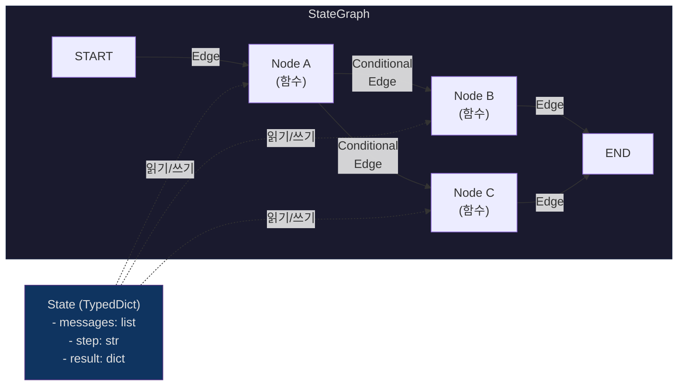
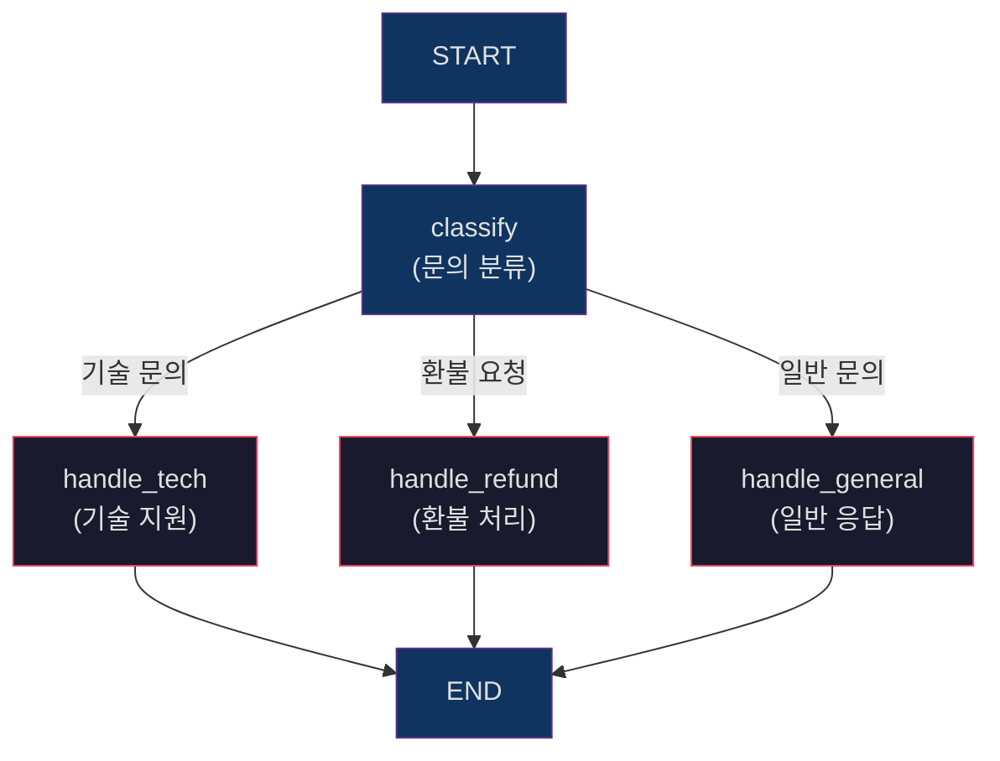
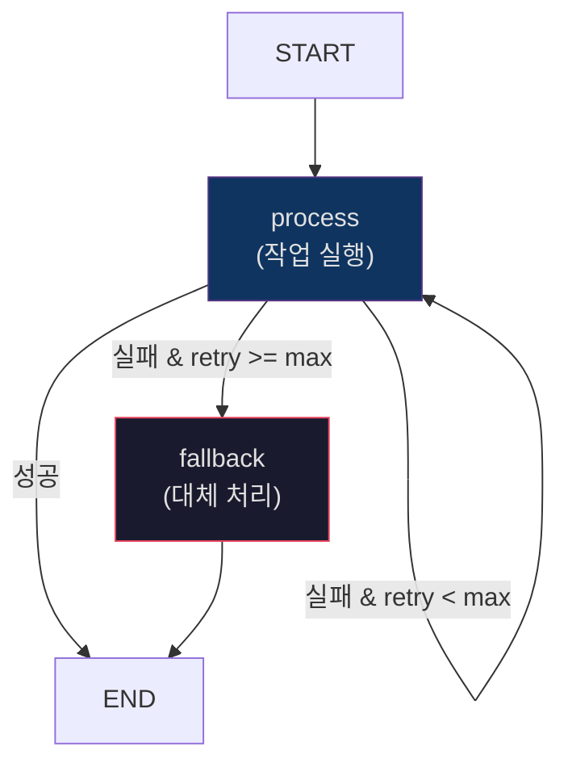
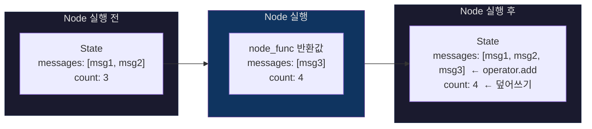

# Day 2 Session 2: LangGraph 기반 제어 흐름 설계 (2h)

## 학습 목표

이 세션을 마치면 다음을 할 수 있습니다:

- LangGraph의 핵심 개념(Node, Edge, State)을 이해하고 설명할 수 있다
- StateGraph를 사용하여 Agent Workflow를 구현할 수 있다
- Conditional Edge를 설계하여 동적 분기 로직을 구현할 수 있다
- Retry / Fallback 전략을 LangGraph에 적용할 수 있다
- State Propagation과 Reducer 개념을 이해하고 활용할 수 있다

---

## 1. LangGraph 핵심 개념

LangGraph는 LLM Agent의 제어 흐름을 **그래프 구조**로 설계하는 프레임워크입니다. 복잡한 분기, 반복, 조건부 실행을 선언적으로 정의할 수 있습니다.

### Node - Edge - State 관계도



### 핵심 개념 정리

| 개념 | 설명 | 코드 |
|------|------|------|
| **Node** | 실행 단위 (Python 함수) | `graph.add_node("name", func)` |
| **Edge** | 노드 간 연결 (무조건 이동) | `graph.add_edge("a", "b")` |
| **Conditional Edge** | 상태 기반 동적 분기 | `graph.add_conditional_edges("a", router_func)` |
| **State** | 그래프 전체에서 공유하는 데이터 | `TypedDict` 정의 |
| **START / END** | 그래프의 시작과 종료 지점 | `from langgraph.graph import START, END` |

---

## 2. StateGraph 코드 기본 패턴

### 최소 구현 예제

가장 간단한 LangGraph Workflow를 구현해보겠습니다.

```python
from typing import TypedDict, Annotated
import operator
from langgraph.graph import StateGraph, START, END


# 1단계: State 정의
class SimpleState(TypedDict):
    messages: Annotated[list, operator.add]  # Reducer: 리스트 누적
    result: str


# 2단계: Node 함수 정의
def greet(state: SimpleState) -> dict:
    """인사 메시지를 생성한다."""
    user_msg = state["messages"][-1] if state["messages"] else "안녕하세요"
    return {
        "messages": [f"처리 중: {user_msg}"],
        "result": f"'{user_msg}'에 대한 응답을 생성합니다.",
    }


def respond(state: SimpleState) -> dict:
    """최종 응답을 생성한다."""
    return {
        "messages": [f"완료: {state['result']}"],
        "result": "처리 완료",
    }


# 3단계: 그래프 구성
graph = StateGraph(SimpleState)
graph.add_node("greet", greet)
graph.add_node("respond", respond)

# 4단계: Edge 연결
graph.add_edge(START, "greet")
graph.add_edge("greet", "respond")
graph.add_edge("respond", END)

# 5단계: 컴파일 및 실행
app = graph.compile()

# 실행
result = app.invoke({
    "messages": ["오늘 날씨 알려줘"],
    "result": "",
})
print(result)
```

### LLM을 사용하는 기본 Agent

```python
from langchain_openai import ChatOpenAI
from langchain_core.messages import HumanMessage, AIMessage, SystemMessage


class ChatState(TypedDict):
    messages: Annotated[list, operator.add]
    turn_count: int


def call_llm(state: ChatState) -> dict:
    """LLM을 호출하여 응답을 생성한다."""
    llm = ChatOpenAI(model="gpt-4o", temperature=0.7)

    system_msg = SystemMessage(content="당신은 친절한 AI 어시스턴트입니다.")
    response = llm.invoke([system_msg] + state["messages"])

    return {
        "messages": [response],
        "turn_count": state.get("turn_count", 0) + 1,
    }


# 그래프 구성
chat_graph = StateGraph(ChatState)
chat_graph.add_node("llm", call_llm)
chat_graph.add_edge(START, "llm")
chat_graph.add_edge("llm", END)
chat_app = chat_graph.compile()

# 실행
result = chat_app.invoke({
    "messages": [HumanMessage(content="Python의 장점 3가지를 알려줘")],
    "turn_count": 0,
})
print(result["messages"][-1].content)
```

---

## 3. Conditional Edge 설계

실제 Agent는 상황에 따라 다른 경로를 선택해야 합니다. LangGraph의 `add_conditional_edges`를 사용하면 런타임에 동적으로 다음 노드를 결정할 수 있습니다.

### 분기 로직 구조



### 구현 코드

```python
from typing import Literal


class CustomerState(TypedDict):
    messages: Annotated[list, operator.add]
    inquiry_type: str
    response: str


def classify_inquiry(state: CustomerState) -> dict:
    """고객 문의를 분류한다."""
    llm = ChatOpenAI(model="gpt-4o", temperature=0)
    structured_llm = llm.with_structured_output(
        method="json_schema",
        schema={
            "name": "classification",
            "schema": {
                "type": "object",
                "properties": {
                    "category": {
                        "type": "string",
                        "enum": ["tech", "refund", "general"],
                    }
                },
                "required": ["category"],
            },
        },
    )
    result = structured_llm.invoke(state["messages"])
    return {"inquiry_type": result["category"]}


def handle_tech(state: CustomerState) -> dict:
    """기술 문의를 처리한다."""
    llm = ChatOpenAI(model="gpt-4o", temperature=0)
    response = llm.invoke(
        [SystemMessage(content="기술 지원 전문가로서 답변하세요.")]
        + state["messages"]
    )
    return {"response": response.content, "messages": [response]}


def handle_refund(state: CustomerState) -> dict:
    """환불 요청을 처리한다."""
    llm = ChatOpenAI(model="gpt-4o", temperature=0)
    response = llm.invoke(
        [SystemMessage(content="환불 정책에 따라 안내하세요.")]
        + state["messages"]
    )
    return {"response": response.content, "messages": [response]}


def handle_general(state: CustomerState) -> dict:
    """일반 문의를 처리한다."""
    llm = ChatOpenAI(model="gpt-4o", temperature=0)
    response = llm.invoke(
        [SystemMessage(content="친절하게 답변하세요.")]
        + state["messages"]
    )
    return {"response": response.content, "messages": [response]}


# 라우팅 함수
def route_inquiry(state: CustomerState) -> Literal["handle_tech", "handle_refund", "handle_general"]:
    """분류 결과에 따라 다음 노드를 결정한다."""
    routing = {
        "tech": "handle_tech",
        "refund": "handle_refund",
        "general": "handle_general",
    }
    return routing.get(state["inquiry_type"], "handle_general")


# 그래프 구성
cs_graph = StateGraph(CustomerState)
cs_graph.add_node("classify", classify_inquiry)
cs_graph.add_node("handle_tech", handle_tech)
cs_graph.add_node("handle_refund", handle_refund)
cs_graph.add_node("handle_general", handle_general)

cs_graph.add_edge(START, "classify")
cs_graph.add_conditional_edges(
    "classify",
    route_inquiry,
    ["handle_tech", "handle_refund", "handle_general"],
)
cs_graph.add_edge("handle_tech", END)
cs_graph.add_edge("handle_refund", END)
cs_graph.add_edge("handle_general", END)

cs_app = cs_graph.compile()
```

---

## 4. Retry / Fallback 패턴

실무 Agent는 LLM 호출 실패, API 타임아웃, 잘못된 응답 등 다양한 오류를 처리해야 합니다.

### Retry 패턴



### Retry + Fallback 구현

```python
import time


class RetryState(TypedDict):
    messages: Annotated[list, operator.add]
    retry_count: int
    max_retries: int
    status: str  # "pending", "success", "failed"
    result: str
    error_log: list[str]


def process_with_llm(state: RetryState) -> dict:
    """LLM 호출을 시도한다. 실패 시 에러를 기록한다."""
    try:
        llm = ChatOpenAI(model="gpt-4o", temperature=0, request_timeout=10)
        response = llm.invoke(state["messages"])
        return {
            "status": "success",
            "result": response.content,
            "retry_count": state["retry_count"] + 1,
        }
    except Exception as e:
        return {
            "status": "failed",
            "retry_count": state["retry_count"] + 1,
            "error_log": [f"시도 {state['retry_count'] + 1}: {str(e)}"],
        }


def fallback_handler(state: RetryState) -> dict:
    """모든 재시도 실패 시 대체 로직을 실행한다."""
    return {
        "status": "fallback",
        "result": "죄송합니다. 현재 서비스에 일시적인 문제가 있습니다. 잠시 후 다시 시도해주세요.",
        "messages": [AIMessage(content="[Fallback] 서비스 일시 장애")],
    }


def check_retry(state: RetryState) -> Literal["process", "fallback", "__end__"]:
    """재시도 여부를 판단한다."""
    if state["status"] == "success":
        return "__end__"
    if state["retry_count"] >= state["max_retries"]:
        return "fallback"
    # 재시도 전 대기 (exponential backoff는 노드 내부에서 처리)
    return "process"


retry_graph = StateGraph(RetryState)
retry_graph.add_node("process", process_with_llm)
retry_graph.add_node("fallback", fallback_handler)

retry_graph.add_edge(START, "process")
retry_graph.add_conditional_edges("process", check_retry, ["process", "fallback", END])
retry_graph.add_edge("fallback", END)

retry_app = retry_graph.compile()

# 실행
result = retry_app.invoke({
    "messages": [HumanMessage(content="테스트 요청")],
    "retry_count": 0,
    "max_retries": 3,
    "status": "pending",
    "result": "",
    "error_log": [],
})
```

### Exponential Backoff 적용

```python
def process_with_backoff(state: RetryState) -> dict:
    """Exponential Backoff를 적용한 LLM 호출"""
    retry = state["retry_count"]
    if retry > 0:
        wait_time = min(2 ** retry, 30)  # 최대 30초
        print(f"재시도 대기: {wait_time}초")
        time.sleep(wait_time)

    try:
        llm = ChatOpenAI(model="gpt-4o", temperature=0, request_timeout=10)
        response = llm.invoke(state["messages"])
        return {"status": "success", "result": response.content, "retry_count": retry + 1}
    except Exception as e:
        return {
            "status": "failed",
            "retry_count": retry + 1,
            "error_log": [f"시도 {retry + 1} (대기 {2 ** retry}초 후): {str(e)}"],
        }
```

---

## 5. State Propagation과 Reducer

LangGraph에서 State는 단순히 공유 데이터가 아닙니다. **Reducer**를 통해 각 노드의 출력이 기존 상태와 어떻게 병합되는지를 제어합니다.

### Reducer 동작 원리



### Reducer 유형과 사용법

```python
from typing import TypedDict, Annotated
import operator


class AdvancedState(TypedDict):
    # Reducer: operator.add → 리스트 누적 (기존 + 새 값)
    messages: Annotated[list, operator.add]

    # Reducer 없음 → 덮어쓰기 (마지막 값만 유지)
    current_step: str

    # Reducer: operator.add → 숫자 합산
    total_tokens: Annotated[int, operator.add]

    # Reducer: 커스텀 함수
    errors: Annotated[list, operator.add]
```

### 커스텀 Reducer 예시

```python
def merge_dicts(existing: dict, new: dict) -> dict:
    """딕셔너리를 깊은 병합한다."""
    result = existing.copy()
    result.update(new)
    return result


def keep_latest_n(n: int):
    """최근 N개 항목만 유지하는 Reducer"""
    def reducer(existing: list, new: list) -> list:
        combined = existing + new
        return combined[-n:]
    return reducer


class SmartState(TypedDict):
    # 최근 20개 메시지만 유지
    messages: Annotated[list, keep_latest_n(20)]
    # 메타데이터 딕셔너리 병합
    metadata: Annotated[dict, merge_dicts]
```

### State Propagation 흐름 예시

```python
from langgraph.graph import StateGraph, START, END


class PipelineState(TypedDict):
    messages: Annotated[list, operator.add]
    data: dict
    stage: str


def stage_a(state: PipelineState) -> dict:
    """Stage A: 데이터 수집"""
    return {
        "messages": ["Stage A 완료"],
        "data": {"raw": "원본 데이터"},
        "stage": "a_done",
    }


def stage_b(state: PipelineState) -> dict:
    """Stage B: 데이터 변환 - Stage A의 결과를 참조"""
    raw = state["data"]["raw"]
    return {
        "messages": [f"Stage B 완료 (입력: {raw})"],
        "data": {"raw": raw, "processed": f"가공된 {raw}"},
        "stage": "b_done",
    }


def stage_c(state: PipelineState) -> dict:
    """Stage C: 최종 출력 - Stage B의 결과를 참조"""
    processed = state["data"]["processed"]
    return {
        "messages": [f"Stage C 완료 (입력: {processed})"],
        "data": state["data"] | {"final": f"최종 결과: {processed}"},
        "stage": "c_done",
    }


pipeline = StateGraph(PipelineState)
pipeline.add_node("stage_a", stage_a)
pipeline.add_node("stage_b", stage_b)
pipeline.add_node("stage_c", stage_c)

pipeline.add_edge(START, "stage_a")
pipeline.add_edge("stage_a", "stage_b")
pipeline.add_edge("stage_b", "stage_c")
pipeline.add_edge("stage_c", END)

app = pipeline.compile()

result = app.invoke({
    "messages": [],
    "data": {},
    "stage": "init",
})

# 결과 확인
print(result["messages"])
# ['Stage A 완료', 'Stage B 완료 (입력: 원본 데이터)', 'Stage C 완료 (입력: 가공된 원본 데이터)']
print(result["data"]["final"])
# '최종 결과: 가공된 원본 데이터'
```

---

## 6. LangGraph 디버깅 팁

### 그래프 시각화

```python
# 컴파일된 그래프를 Mermaid로 출력
print(app.get_graph().draw_mermaid())

# PNG 이미지로 저장 (pygraphviz 필요)
# app.get_graph().draw_mermaid_png(output_file_path="graph.png")
```

### 단계별 실행 추적

```python
# stream 모드로 실행하면 각 노드 실행 결과를 순차적으로 확인 가능
for event in app.stream({
    "messages": [HumanMessage(content="테스트")],
    "data": {},
    "stage": "init",
}):
    print(f"Node: {list(event.keys())[0]}")
    print(f"Output: {event}")
    print("---")
```

---

## 7. 핵심 정리

### LangGraph 설계 원칙

1. **State를 먼저 설계하라**: 어떤 데이터를 추적할지가 그래프 구조를 결정한다
2. **Reducer를 의식하라**: `Annotated[list, operator.add]`와 단순 덮어쓰기의 차이를 이해하라
3. **Conditional Edge는 순수 함수로**: 라우팅 함수는 State만 보고 결정해야 한다 (부작용 금지)
4. **작은 노드로 분리하라**: 하나의 노드가 너무 많은 일을 하면 디버깅이 어려워진다

### 자주 하는 실수

| 실수 | 해결 |
|------|------|
| Reducer 없이 list 반환 → 덮어쓰기 | `Annotated[list, operator.add]` 사용 |
| 노드에서 전체 State 반환 | 변경된 키만 반환 (부분 업데이트) |
| Conditional Edge에서 부작용 발생 | 라우팅 함수는 순수 함수로 유지 |
| END 연결 누락 → 그래프 멈춤 | 모든 말단 노드에 END 연결 확인 |

---

## 8. 실습 안내

> **실습: LangGraph Workflow 구현**
>
> `labs/day2-langgraph-workflow/` 디렉토리에서 진행합니다.
>
> - I DO: 강사가 기본 StateGraph를 구현하는 과정을 시연
> - WE DO: 함께 Conditional Edge를 추가하여 분기 로직 구현
> - YOU DO: 완전한 Agent Workflow (분류 → 처리 → 검증 → 응답)를 독립 구현
>
> 소요 시간: 약 50분
