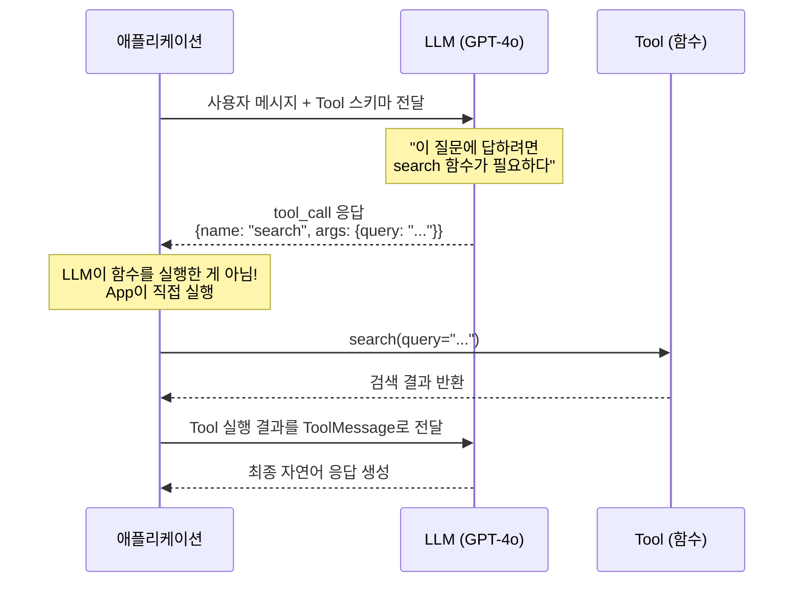
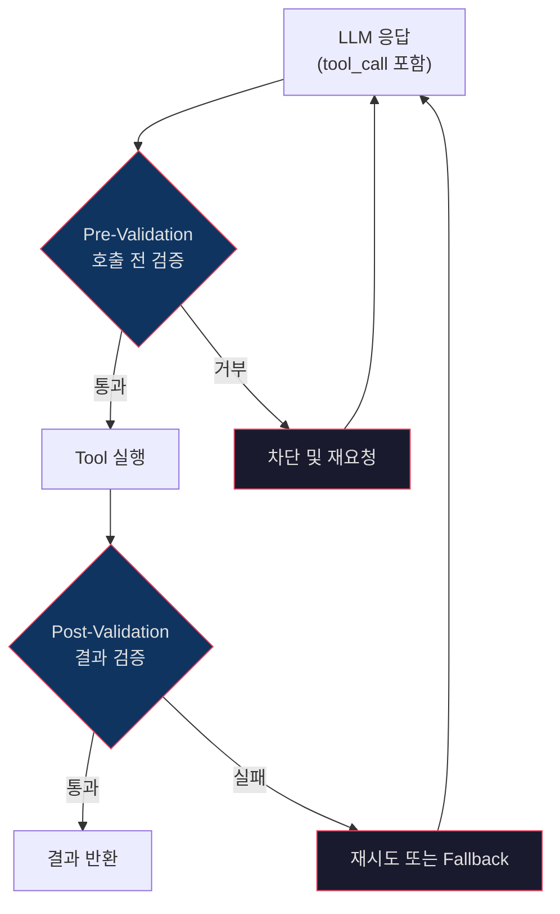
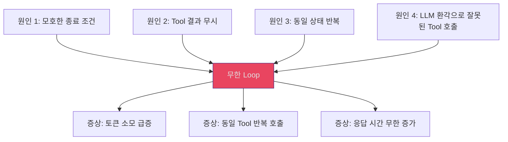

# Day 2 Session 3: Tool 호출 통제 & Validation (2h)

## 학습 목표

이 세션을 마치면 다음을 할 수 있습니다:

- LLM의 Function Calling 동작 원리를 이해하고 설명할 수 있다
- `@tool` 데코레이터를 사용하여 Tool을 정의하고 LLM에 바인딩할 수 있다
- JSON Schema 기반으로 LLM 응답 구조를 강제할 수 있다
- Tool 호출 전후 검증(Guardrail) 로직을 구현할 수 있다
- 무한 Loop를 감지하고 방지하는 전략을 적용할 수 있다

---

## 1. Function Calling 동작 원리

Function Calling은 LLM이 직접 함수를 실행하는 것이 아닙니다. LLM이 "어떤 함수를 어떤 인자로 호출해야 하는지" **구조화된 형태로 출력**하면, 애플리케이션이 실제로 실행하는 구조입니다.

### 동작 시퀀스



### 핵심 포인트

```
LLM이 하는 일:     "search 함수를 {query: '날씨'} 인자로 호출해야 합니다"
LLM이 안 하는 일:   실제 함수 실행 ← 이건 애플리케이션의 책임
```

이 구조 때문에 **Tool 호출 전후에 검증을 삽입할 수 있습니다.** LLM과 실제 실행 사이에 Guardrail을 놓는 것입니다.

---

## 2. Tool 정의와 바인딩

### @tool 데코레이터 기본

```python
from langchain_core.tools import tool


@tool
def get_weather(city: str) -> str:
    """지정된 도시의 현재 날씨를 조회합니다.

    Args:
        city: 날씨를 조회할 도시명 (예: "서울", "부산")
    """
    # 실제로는 날씨 API 호출
    weather_data = {
        "서울": "맑음, 22°C",
        "부산": "흐림, 19°C",
        "제주": "비, 17°C",
    }
    return weather_data.get(city, f"{city}의 날씨 정보를 찾을 수 없습니다.")


@tool
def calculate(expression: str) -> str:
    """수학 계산을 수행합니다. 사칙연산만 지원합니다.

    Args:
        expression: 계산할 수식 (예: "2 + 3 * 4")
    """
    # 안전한 계산만 허용
    allowed_chars = set("0123456789+-*/(). ")
    if not all(c in allowed_chars for c in expression):
        return "오류: 허용되지 않는 문자가 포함되어 있습니다."
    try:
        result = eval(expression)  # 프로덕션에서는 ast.literal_eval 또는 별도 파서 사용
        return str(result)
    except Exception as e:
        return f"계산 오류: {str(e)}"
```

### Pydantic 기반 Tool 정의 (복잡한 입력)

```python
from pydantic import BaseModel, Field


class SearchParams(BaseModel):
    query: str = Field(description="검색 키워드")
    max_results: int = Field(default=5, ge=1, le=20, description="최대 결과 수")
    category: str = Field(
        default="all",
        description="검색 카테고리",
        json_schema_extra={"enum": ["all", "tech", "business", "science"]},
    )


@tool(args_schema=SearchParams)
def advanced_search(query: str, max_results: int = 5, category: str = "all") -> str:
    """고급 검색을 수행합니다. 카테고리 필터링과 결과 수 제한을 지원합니다."""
    return f"'{query}' 검색 결과 ({category}, 최대 {max_results}건): ..."
```

### LLM에 Tool 바인딩

```python
from langchain_openai import ChatOpenAI
from langchain_core.messages import HumanMessage

# Tool 목록 정의
tools = [get_weather, calculate, advanced_search]

# LLM에 Tool 바인딩
llm = ChatOpenAI(model="gpt-4o", temperature=0)
llm_with_tools = llm.bind_tools(tools)

# 호출 테스트
response = llm_with_tools.invoke([
    HumanMessage(content="서울 날씨 알려주고, 15 * 23 계산해줘")
])

# Tool 호출 확인
for tc in response.tool_calls:
    print(f"Tool: {tc['name']}, Args: {tc['args']}")
# Tool: get_weather, Args: {'city': '서울'}
# Tool: calculate, Args: {'expression': '15 * 23'}
```

---

## 3. JSON Schema 기반 응답 강제

LLM의 응답을 자유 형식 텍스트가 아닌, 정해진 구조의 JSON으로 강제하면 후처리가 안정적입니다.

### Structured Output 사용

```python
from pydantic import BaseModel, Field


class InquiryClassification(BaseModel):
    """고객 문의 분류 결과"""
    category: str = Field(
        description="문의 카테고리",
        json_schema_extra={"enum": ["기술지원", "환불", "일반문의", "불만"]},
    )
    urgency: int = Field(
        ge=1, le=5,
        description="긴급도 (1: 낮음 ~ 5: 매우 높음)",
    )
    summary: str = Field(
        description="문의 내용 요약 (50자 이내)",
    )
    requires_human: bool = Field(
        description="사람의 개입이 필요한지 여부",
    )


llm = ChatOpenAI(model="gpt-4o", temperature=0)
structured_llm = llm.with_structured_output(InquiryClassification)

result = structured_llm.invoke(
    "2주 전에 산 노트북이 자꾸 블루스크린이 떠요. 급해요!"
)

print(result)
# category='기술지원' urgency=4 summary='노트북 블루스크린 반복 발생' requires_human=False
print(type(result))
# <class 'InquiryClassification'>
```

### LangGraph 노드에서 활용

```python
from typing import TypedDict, Annotated
import operator
from langgraph.graph import StateGraph, START, END


class ClassifyState(TypedDict):
    messages: Annotated[list, operator.add]
    classification: dict | None
    response: str


def classify_node(state: ClassifyState) -> dict:
    """구조화된 분류 결과를 생성한다."""
    llm = ChatOpenAI(model="gpt-4o", temperature=0)
    structured_llm = llm.with_structured_output(InquiryClassification)

    user_msg = state["messages"][-1].content
    result = structured_llm.invoke(user_msg)

    return {
        "classification": result.model_dump(),
    }


def route_by_classification(state: ClassifyState) -> str:
    """분류 결과에 따라 라우팅"""
    cls = state["classification"]
    if cls["requires_human"]:
        return "escalate"
    if cls["urgency"] >= 4:
        return "urgent_handler"
    return "normal_handler"
```

---

## 4. Tool 호출 전후 검증 (Guardrail 패턴)

LLM이 Tool 호출을 요청했다고 무조건 실행하면 안 됩니다. 호출 전후에 검증 로직을 삽입해야 합니다.

### Guardrail 아키텍처



### Pre-Validation 구현

```python
from dataclasses import dataclass


@dataclass
class ValidationResult:
    is_valid: bool
    reason: str = ""


class ToolGuardrail:
    """Tool 호출 전후 검증을 관리하는 Guardrail"""

    def __init__(self):
        self.blocked_patterns = [
            "DROP TABLE", "DELETE FROM", "rm -rf",
        ]
        self.allowed_tools = {"get_weather", "calculate", "advanced_search"}
        self.rate_limits: dict[str, list[float]] = {}
        self.max_calls_per_minute = 10

    def pre_validate(self, tool_name: str, tool_args: dict) -> ValidationResult:
        """Tool 호출 전 검증"""
        # 1. 허용된 Tool인지 확인
        if tool_name not in self.allowed_tools:
            return ValidationResult(False, f"허용되지 않은 Tool: {tool_name}")

        # 2. 인자에 위험한 패턴이 있는지 확인
        args_str = str(tool_args)
        for pattern in self.blocked_patterns:
            if pattern.lower() in args_str.lower():
                return ValidationResult(False, f"위험한 패턴 감지: {pattern}")

        # 3. Rate Limit 확인
        import time
        now = time.time()
        calls = self.rate_limits.get(tool_name, [])
        calls = [t for t in calls if now - t < 60]  # 최근 1분
        if len(calls) >= self.max_calls_per_minute:
            return ValidationResult(False, f"Rate Limit 초과: {tool_name}")
        calls.append(now)
        self.rate_limits[tool_name] = calls

        return ValidationResult(True)

    def post_validate(self, tool_name: str, result: str) -> ValidationResult:
        """Tool 실행 결과 검증"""
        # 1. 빈 결과 확인
        if not result or result.strip() == "":
            return ValidationResult(False, "빈 결과 반환")

        # 2. 에러 패턴 확인
        error_patterns = ["error", "exception", "failed", "timeout"]
        result_lower = result.lower()
        for pattern in error_patterns:
            if pattern in result_lower:
                return ValidationResult(False, f"에러 패턴 감지: {pattern}")

        # 3. 결과 길이 제한 (너무 긴 결과는 토큰 낭비)
        if len(result) > 10000:
            return ValidationResult(False, "결과가 너무 깁니다 (10000자 초과)")

        return ValidationResult(True)
```

### LangGraph에 Guardrail 통합

```python
from langchain_core.messages import ToolMessage, AIMessage


class GuardedState(TypedDict):
    messages: Annotated[list, operator.add]
    blocked_calls: list[dict]
    validation_errors: list[str]


guardrail = ToolGuardrail()
tools_by_name = {t.name: t for t in tools}


def llm_node(state: GuardedState) -> dict:
    """LLM을 호출하여 Tool 호출 결정을 받는다."""
    llm_with_tools = ChatOpenAI(model="gpt-4o", temperature=0).bind_tools(tools)
    response = llm_with_tools.invoke(state["messages"])
    return {"messages": [response]}


def guarded_tool_node(state: GuardedState) -> dict:
    """Guardrail을 적용하여 Tool을 실행한다."""
    last_msg = state["messages"][-1]
    results = []
    blocked = []

    for tool_call in last_msg.tool_calls:
        name = tool_call["name"]
        args = tool_call["args"]

        # Pre-Validation
        pre_result = guardrail.pre_validate(name, args)
        if not pre_result.is_valid:
            blocked.append({"tool": name, "reason": pre_result.reason})
            results.append(ToolMessage(
                content=f"[BLOCKED] {pre_result.reason}",
                tool_call_id=tool_call["id"],
            ))
            continue

        # Tool 실행
        tool = tools_by_name[name]
        output = tool.invoke(args)

        # Post-Validation
        post_result = guardrail.post_validate(name, str(output))
        if not post_result.is_valid:
            results.append(ToolMessage(
                content=f"[INVALID] {post_result.reason}. 다른 방법을 시도하세요.",
                tool_call_id=tool_call["id"],
            ))
            continue

        results.append(ToolMessage(
            content=str(output),
            tool_call_id=tool_call["id"],
        ))

    return {
        "messages": results,
        "blocked_calls": blocked,
    }


def should_continue(state: GuardedState) -> str:
    """Tool 호출이 필요한지 판단한다."""
    last_msg = state["messages"][-1]
    if hasattr(last_msg, "tool_calls") and last_msg.tool_calls:
        return "tools"
    return "__end__"


guarded_graph = StateGraph(GuardedState)
guarded_graph.add_node("llm", llm_node)
guarded_graph.add_node("tools", guarded_tool_node)

guarded_graph.add_edge(START, "llm")
guarded_graph.add_conditional_edges("llm", should_continue, ["tools", END])
guarded_graph.add_edge("tools", "llm")

guarded_app = guarded_graph.compile()
```

---

## 5. 무한 Loop 감지 및 방지

Agent가 같은 작업을 반복하거나 Tool을 무한히 호출하는 상황을 방지해야 합니다.

### 무한 Loop 발생 원인



### 방지 전략 1: max_iterations 카운터

```python
class LoopSafeState(TypedDict):
    messages: Annotated[list, operator.add]
    iteration_count: int
    max_iterations: int
    status: str


def safe_llm_node(state: LoopSafeState) -> dict:
    """반복 횟수를 추적하는 LLM 노드"""
    count = state["iteration_count"] + 1

    if count > state["max_iterations"]:
        return {
            "messages": [AIMessage(content="[최대 반복 횟수 도달] 작업을 종료합니다.")],
            "iteration_count": count,
            "status": "max_iterations_reached",
        }

    llm_with_tools = ChatOpenAI(model="gpt-4o", temperature=0).bind_tools(tools)
    response = llm_with_tools.invoke(state["messages"])

    return {
        "messages": [response],
        "iteration_count": count,
    }


def check_loop(state: LoopSafeState) -> str:
    """반복 제한 확인"""
    if state["status"] == "max_iterations_reached":
        return "__end__"
    last_msg = state["messages"][-1]
    if hasattr(last_msg, "tool_calls") and last_msg.tool_calls:
        return "tools"
    return "__end__"
```

### 방지 전략 2: 중복 상태 감지

```python
import hashlib
import json


class DeduplicatedState(TypedDict):
    messages: Annotated[list, operator.add]
    seen_states: list[str]
    iteration_count: int
    is_stuck: bool


def compute_state_hash(messages: list, window: int = 3) -> str:
    """최근 N개 메시지의 해시를 계산한다."""
    recent = messages[-window:] if len(messages) >= window else messages
    content = json.dumps([
        {"role": type(m).__name__, "content": getattr(m, "content", "")}
        for m in recent
    ], ensure_ascii=False)
    return hashlib.md5(content.encode()).hexdigest()


def dedup_check_node(state: DeduplicatedState) -> dict:
    """중복 상태를 감지한다."""
    current_hash = compute_state_hash(state["messages"])

    if current_hash in state["seen_states"]:
        return {
            "is_stuck": True,
            "messages": [AIMessage(
                content="[Loop 감지] 동일한 상태가 반복되고 있어 작업을 종료합니다."
            )],
        }

    return {
        "seen_states": [current_hash],  # Reducer로 누적
        "is_stuck": False,
    }
```

### 방지 전략 3: 총 토큰 예산 제한

```python
from langchain_core.callbacks import BaseCallbackHandler


class TokenBudgetTracker(BaseCallbackHandler):
    """토큰 사용량을 추적하고 예산을 초과하면 중단한다."""

    def __init__(self, max_tokens: int = 50000):
        self.total_tokens = 0
        self.max_tokens = max_tokens

    def on_llm_end(self, response, **kwargs):
        usage = response.llm_output.get("token_usage", {})
        self.total_tokens += usage.get("total_tokens", 0)
        if self.total_tokens > self.max_tokens:
            raise RuntimeError(
                f"토큰 예산 초과: {self.total_tokens}/{self.max_tokens}"
            )


# 사용법
tracker = TokenBudgetTracker(max_tokens=50000)
llm = ChatOpenAI(
    model="gpt-4o",
    temperature=0,
    callbacks=[tracker],
)
```

### 종합: 안전한 Agent Loop 패턴

```python
class SafeAgentState(TypedDict):
    messages: Annotated[list, operator.add]
    iteration_count: int
    max_iterations: int
    seen_states: Annotated[list[str], operator.add]
    status: str  # "running", "completed", "stuck", "budget_exceeded"


def safe_router(state: SafeAgentState) -> str:
    """안전한 라우팅 결정"""
    # 1. 상태 확인
    if state["status"] in ("stuck", "budget_exceeded"):
        return "__end__"

    # 2. 반복 횟수 확인
    if state["iteration_count"] >= state["max_iterations"]:
        return "__end__"

    # 3. Tool 호출 필요 여부
    last_msg = state["messages"][-1]
    if hasattr(last_msg, "tool_calls") and last_msg.tool_calls:
        return "tools"

    return "__end__"
```

---

## 6. 핵심 정리

### Tool 통제 체크리스트

| 항목 | 설명 |
|------|------|
| Tool 허용 목록 관리 | 등록된 Tool만 호출 가능하도록 제한 |
| 입력 검증 (Pre-Validation) | 위험한 인자 패턴 차단 |
| 출력 검증 (Post-Validation) | 빈 결과, 에러 패턴, 크기 초과 확인 |
| Rate Limiting | Tool별 호출 빈도 제한 |
| max_iterations | 전체 반복 횟수 상한 설정 |
| 중복 상태 감지 | 해시 기반 Loop 감지 |
| 토큰 예산 | 총 토큰 사용량 제한 |

### 실전 권장값

```python
SAFETY_DEFAULTS = {
    "max_iterations": 10,        # 일반적인 Agent
    "max_tool_calls_per_turn": 5,  # 한 턴에 최대 Tool 호출 수
    "max_tokens_budget": 50000,    # 전체 토큰 예산
    "rate_limit_per_minute": 20,   # Tool별 분당 호출 제한
    "state_history_window": 5,     # 중복 감지 윈도우 크기
}
```

---

## 7. 실습 안내

> **실습: Tool Validation 구현**
>
> `labs/day2-tool-validation/` 디렉토리에서 진행합니다.
>
> - I DO: 강사가 Tool 정의 + LLM 바인딩을 시연
> - WE DO: 함께 Pre/Post Validation 로직을 추가
> - YOU DO: Guardrail + Loop 방지 로직을 포함한 안전한 Agent 구현
>
> 소요 시간: 약 50분
