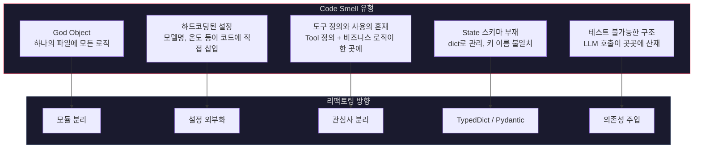
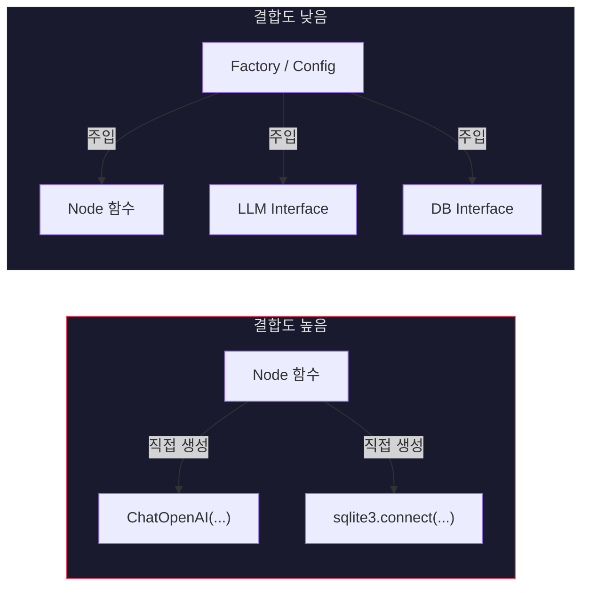
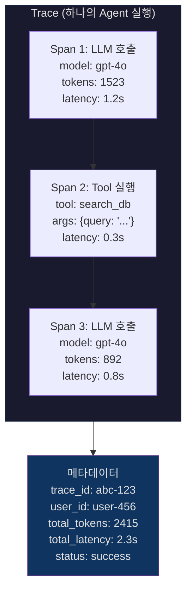
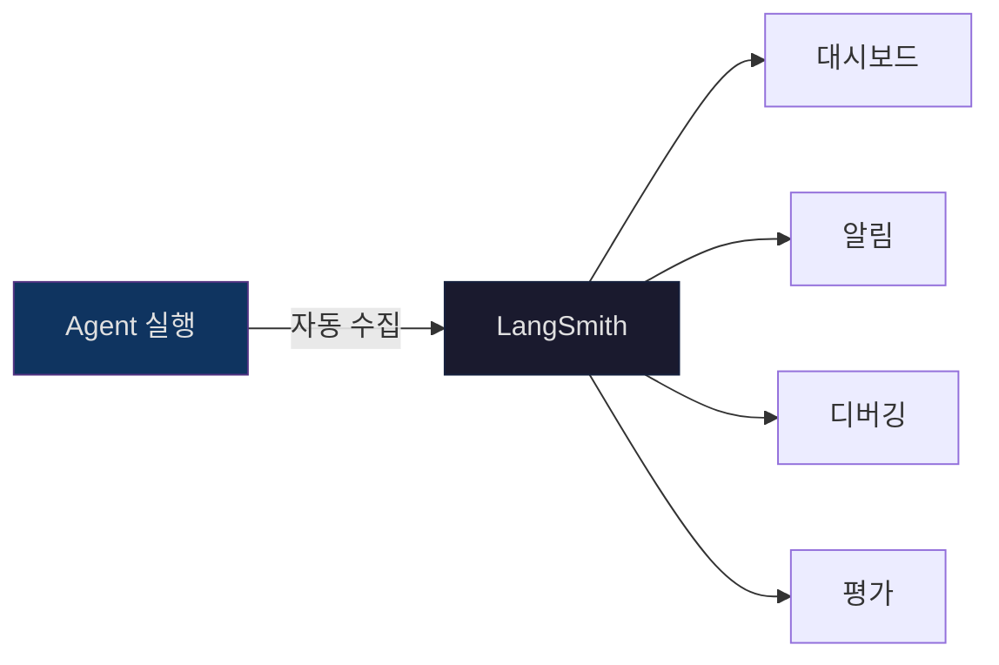
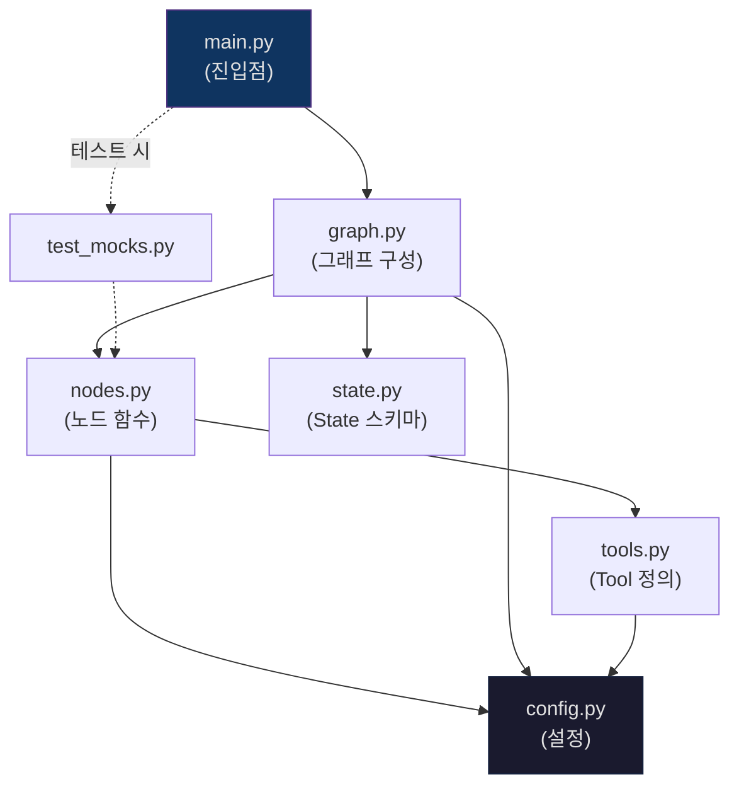
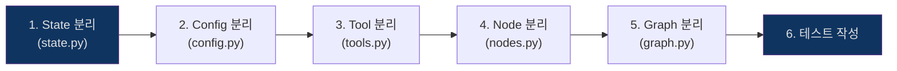

# Day 2 Session 4: 구조 리팩토링 & 확장성 설계 (2h)

## 학습 목표

이 세션을 마치면 다음을 할 수 있습니다:

- Agent 코드에서 리팩토링이 필요한 신호(Code Smell)를 식별할 수 있다
- 단일 파일 Agent를 모듈화된 구조로 분리할 수 있다
- 의존성 주입을 통해 결합도를 낮추는 설계를 적용할 수 있다
- Trace 로그 구조를 설계하고 LangSmith 연동을 준비할 수 있다
- 유지보수 가능한 Agent 구조의 기준을 설명할 수 있다

---

## 1. 코드 냄새(Code Smell)와 리팩토링 필요 신호

Agent 코드도 일반 소프트웨어와 마찬가지로 시간이 지나면 복잡해집니다. 리팩토링이 필요한 시점을 인식하는 것이 첫 단계입니다.

### Agent 코드의 대표적 Code Smell



### 리팩토링 필요 신호 체크리스트

- [ ] 하나의 파일이 **300줄 이상**인가?
- [ ] 새 Tool을 추가할 때 **기존 코드를 수정**해야 하는가?
- [ ] LLM 모델을 교체하려면 **여러 곳을 수정**해야 하는가?
- [ ] 단위 테스트를 작성하기 **어려운가**?
- [ ] 동료가 코드를 이해하는 데 **10분 이상** 걸리는가?

하나라도 해당하면 리팩토링을 고려해야 합니다.

---

## 2. 단일 Agent에서 모듈화 구조로

### Before: 단일 파일 Agent (나쁜 예)

```python
# bad_agent.py - 모든 것이 하나의 파일에!
import os
from langchain_openai import ChatOpenAI
from langchain_core.tools import tool
from langchain_core.messages import HumanMessage, SystemMessage, ToolMessage
from langgraph.graph import StateGraph, START, END
from typing import TypedDict, Annotated
import operator

# 설정이 코드에 하드코딩
llm = ChatOpenAI(model="gpt-4o", temperature=0, api_key=os.environ["OPENAI_API_KEY"])

# Tool 정의가 비즈니스 로직과 섞여 있음
@tool
def search_db(query: str) -> str:
    """DB에서 검색"""
    import sqlite3
    conn = sqlite3.connect("mydb.db")  # DB 경로 하드코딩
    cursor = conn.cursor()
    cursor.execute(f"SELECT * FROM products WHERE name LIKE '%{query}%'")  # SQL 인젝션 위험!
    results = cursor.fetchall()
    conn.close()
    return str(results)

@tool
def send_email(to: str, subject: str, body: str) -> str:
    """이메일 전송"""
    import smtplib
    server = smtplib.SMTP("smtp.gmail.com", 587)  # SMTP 설정 하드코딩
    server.starttls()
    server.login("me@gmail.com", os.environ["EMAIL_PASS"])  # 인증 정보 혼재
    server.sendmail("me@gmail.com", to, f"Subject: {subject}\n\n{body}")
    server.quit()
    return "전송 완료"

# State 정의
class State(TypedDict):
    messages: Annotated[list, operator.add]
    result: str

# 노드 함수에 모든 로직이 집중
def process(state: State) -> dict:
    tools = [search_db, send_email]
    llm_with_tools = llm.bind_tools(tools)
    response = llm_with_tools.invoke(
        [SystemMessage(content="당신은 고객 지원 Agent입니다.")] + state["messages"]
    )
    # Tool 호출 처리도 여기에...
    if response.tool_calls:
        tools_map = {t.name: t for t in tools}
        for tc in response.tool_calls:
            result = tools_map[tc["name"]].invoke(tc["args"])
            # 검증 로직도 없이 바로 실행
    return {"messages": [response], "result": response.content}

# 그래프 구성
graph = StateGraph(State)
graph.add_node("process", process)
graph.add_edge(START, "process")
graph.add_edge("process", END)
app = graph.compile()
```

이 코드의 문제점:
- 설정, Tool 정의, 비즈니스 로직, 그래프 구성이 모두 한 파일
- DB 연결, 이메일 설정이 하드코딩
- SQL 인젝션 취약점
- 테스트 불가능 (LLM, DB, SMTP 모두 실제 호출)

### After: 모듈화된 구조

```
my_agent/
├── __init__.py
├── config.py          # 설정 관리
├── state.py           # State 스키마 정의
├── tools.py           # Tool 정의
├── nodes.py           # Node 함수 (비즈니스 로직)
├── graph.py           # 그래프 구성 및 컴파일
└── main.py            # 진입점
```

각 파일의 역할:

#### config.py - 설정 외부화

```python
"""Agent 설정을 중앙 관리한다."""
import os
from dataclasses import dataclass, field


@dataclass(frozen=True)
class LLMConfig:
    model: str = "gpt-4o"
    temperature: float = 0.0
    max_tokens: int = 4096
    request_timeout: int = 30


@dataclass(frozen=True)
class AgentConfig:
    llm: LLMConfig = field(default_factory=LLMConfig)
    max_iterations: int = 10
    max_tool_calls_per_turn: int = 5
    system_prompt: str = "당신은 고객 지원 Agent입니다."


def load_config() -> AgentConfig:
    """환경 변수에서 설정을 로드한다."""
    return AgentConfig(
        llm=LLMConfig(
            model=os.environ.get("AGENT_MODEL", "gpt-4o"),
            temperature=float(os.environ.get("AGENT_TEMPERATURE", "0")),
        ),
        max_iterations=int(os.environ.get("AGENT_MAX_ITER", "10")),
    )
```

#### state.py - State 스키마 정의

```python
"""Agent의 State 스키마를 정의한다."""
from typing import TypedDict, Annotated
import operator


class AgentState(TypedDict):
    """Agent의 전체 상태를 관리하는 스키마"""
    # 대화 이력 (Reducer: 누적)
    messages: Annotated[list, operator.add]
    # 현재 처리 단계
    current_step: str
    # 반복 카운터
    iteration_count: int
    # 최종 결과
    result: str
    # 에러 로그
    errors: Annotated[list[str], operator.add]
```

#### tools.py - Tool 정의

```python
"""Agent가 사용하는 Tool을 정의한다."""
from langchain_core.tools import tool


@tool
def search_db(query: str) -> str:
    """데이터베이스에서 제품 정보를 검색합니다.

    Args:
        query: 검색할 제품명 또는 키워드
    """
    # 실제 구현은 별도 서비스/리포지토리에 위임
    from my_agent.services import product_repository
    results = product_repository.search(query)
    return str(results)


@tool
def send_notification(to: str, subject: str, body: str) -> str:
    """고객에게 알림을 전송합니다.

    Args:
        to: 수신자 이메일
        subject: 제목
        body: 본문 내용
    """
    from my_agent.services import notification_service
    return notification_service.send(to=to, subject=subject, body=body)


def get_all_tools() -> list:
    """사용 가능한 모든 Tool 목록을 반환한다."""
    return [search_db, send_notification]
```

#### nodes.py - Node 함수

```python
"""그래프 노드 함수를 정의한다."""
from langchain_openai import ChatOpenAI
from langchain_core.messages import SystemMessage, ToolMessage
from my_agent.state import AgentState
from my_agent.tools import get_all_tools
from my_agent.config import AgentConfig


def create_llm_node(config: AgentConfig):
    """설정을 주입받아 LLM 노드를 생성한다."""
    tools = get_all_tools()
    tools_by_name = {t.name: t for t in tools}

    def llm_node(state: AgentState) -> dict:
        llm = ChatOpenAI(
            model=config.llm.model,
            temperature=config.llm.temperature,
            max_tokens=config.llm.max_tokens,
        )
        llm_with_tools = llm.bind_tools(tools)
        response = llm_with_tools.invoke(
            [SystemMessage(content=config.system_prompt)] + state["messages"]
        )
        return {
            "messages": [response],
            "iteration_count": state["iteration_count"] + 1,
        }

    return llm_node


def create_tool_node(config: AgentConfig):
    """설정을 주입받아 Tool 실행 노드를 생성한다."""
    tools = get_all_tools()
    tools_by_name = {t.name: t for t in tools}

    def tool_node(state: AgentState) -> dict:
        last_msg = state["messages"][-1]
        results = []
        errors = []

        for tc in last_msg.tool_calls[:config.max_tool_calls_per_turn]:
            try:
                tool = tools_by_name[tc["name"]]
                output = tool.invoke(tc["args"])
                results.append(ToolMessage(
                    content=str(output), tool_call_id=tc["id"]
                ))
            except Exception as e:
                errors.append(f"Tool '{tc['name']}' 실행 실패: {str(e)}")
                results.append(ToolMessage(
                    content=f"오류 발생: {str(e)}", tool_call_id=tc["id"]
                ))

        return {"messages": results, "errors": errors}

    return tool_node
```

#### graph.py - 그래프 구성

```python
"""Agent 그래프를 구성하고 컴파일한다."""
from langgraph.graph import StateGraph, START, END
from my_agent.state import AgentState
from my_agent.nodes import create_llm_node, create_tool_node
from my_agent.config import AgentConfig


def should_continue(state: AgentState) -> str:
    """다음 단계를 결정한다."""
    # 반복 제한 확인
    if state["iteration_count"] >= 10:
        return "__end__"

    last_msg = state["messages"][-1]
    if hasattr(last_msg, "tool_calls") and last_msg.tool_calls:
        return "tools"
    return "__end__"


def build_graph(config: AgentConfig):
    """설정을 기반으로 Agent 그래프를 구성한다."""
    llm_node = create_llm_node(config)
    tool_node = create_tool_node(config)

    graph = StateGraph(AgentState)
    graph.add_node("llm", llm_node)
    graph.add_node("tools", tool_node)

    graph.add_edge(START, "llm")
    graph.add_conditional_edges("llm", should_continue, ["tools", END])
    graph.add_edge("tools", "llm")

    return graph.compile()
```

#### main.py - 진입점

```python
"""Agent 실행 진입점."""
from langchain_core.messages import HumanMessage
from my_agent.config import load_config
from my_agent.graph import build_graph


def run_agent(user_input: str) -> str:
    """Agent를 실행하고 결과를 반환한다."""
    config = load_config()
    agent = build_graph(config)

    result = agent.invoke({
        "messages": [HumanMessage(content=user_input)],
        "current_step": "init",
        "iteration_count": 0,
        "result": "",
        "errors": [],
    })

    return result["messages"][-1].content


if __name__ == "__main__":
    import sys
    query = sys.argv[1] if len(sys.argv) > 1 else "안녕하세요"
    print(run_agent(query))
```

---

## 3. 의존성 주입과 결합도 낮추기

### 의존성 주입이란?



### 프로토콜 기반 의존성 주입

```python
from typing import Protocol, runtime_checkable


@runtime_checkable
class LLMProvider(Protocol):
    """LLM 호출 인터페이스"""
    def invoke(self, messages: list) -> str: ...
    def invoke_with_tools(self, messages: list, tools: list) -> dict: ...


@runtime_checkable
class SearchProvider(Protocol):
    """검색 서비스 인터페이스"""
    def search(self, query: str, max_results: int = 5) -> list[dict]: ...


class OpenAIProvider:
    """OpenAI 기반 LLM 구현체"""
    def __init__(self, config: dict):
        from langchain_openai import ChatOpenAI
        self.llm = ChatOpenAI(**config)

    def invoke(self, messages: list) -> str:
        response = self.llm.invoke(messages)
        return response.content

    def invoke_with_tools(self, messages: list, tools: list) -> dict:
        llm_with_tools = self.llm.bind_tools(tools)
        return llm_with_tools.invoke(messages)


class MockLLMProvider:
    """테스트용 Mock LLM"""
    def __init__(self, responses: list[str]):
        self.responses = responses
        self.call_count = 0

    def invoke(self, messages: list) -> str:
        response = self.responses[self.call_count % len(self.responses)]
        self.call_count += 1
        return response

    def invoke_with_tools(self, messages: list, tools: list) -> dict:
        return {"content": self.invoke(messages), "tool_calls": []}
```

### Factory 패턴으로 Agent 생성

```python
class AgentFactory:
    """설정과 의존성을 주입하여 Agent를 생성한다."""

    def __init__(self, config: AgentConfig):
        self.config = config

    def create_llm_provider(self) -> LLMProvider:
        """환경에 따라 적절한 LLM Provider를 생성한다."""
        if os.environ.get("TESTING"):
            return MockLLMProvider(["테스트 응답"])
        return OpenAIProvider({
            "model": self.config.llm.model,
            "temperature": self.config.llm.temperature,
        })

    def build(self):
        """완전한 Agent 그래프를 생성한다."""
        llm_provider = self.create_llm_provider()
        # ... 그래프 구성 로직
        return build_graph_with_provider(self.config, llm_provider)
```

### 테스트 용이성

```python
import pytest


def test_classification_node():
    """분류 노드를 LLM 없이 테스트"""
    mock_llm = MockLLMProvider(responses=["기술지원"])

    state = {
        "messages": [HumanMessage(content="서버가 안 돼요")],
        "classification": None,
    }

    # Mock을 주입하여 테스트
    node = create_classify_node(mock_llm)
    result = node(state)

    assert result["classification"] is not None
    assert mock_llm.call_count == 1


def test_tool_guardrail():
    """Guardrail 로직을 독립적으로 테스트"""
    guardrail = ToolGuardrail()

    # 위험한 패턴 차단 확인
    result = guardrail.pre_validate("search_db", {"query": "DROP TABLE users"})
    assert not result.is_valid
    assert "위험한 패턴" in result.reason

    # 정상 호출 통과 확인
    result = guardrail.pre_validate("search_db", {"query": "Python 책"})
    assert result.is_valid
```

---

## 4. Trace 로그 설계 기초

### 왜 Trace가 필요한가?

Agent는 비결정적(non-deterministic)입니다. 같은 입력에도 다른 경로를 탈 수 있습니다. 문제가 발생했을 때 "어떤 순서로 무엇을 했는지" 추적할 수 있어야 합니다.

### Trace 로그 구조



### 간단한 Trace Logger 구현

```python
import time
import uuid
import json
from dataclasses import dataclass, field, asdict
from datetime import datetime


@dataclass
class Span:
    """하나의 실행 단위를 기록한다."""
    name: str
    span_type: str  # "llm", "tool", "node"
    start_time: float = field(default_factory=time.time)
    end_time: float | None = None
    metadata: dict = field(default_factory=dict)
    status: str = "running"
    error: str | None = None

    def finish(self, status: str = "success", error: str | None = None):
        self.end_time = time.time()
        self.status = status
        self.error = error

    @property
    def duration_ms(self) -> float:
        if self.end_time is None:
            return 0
        return (self.end_time - self.start_time) * 1000


@dataclass
class Trace:
    """하나의 Agent 실행 전체를 추적한다."""
    trace_id: str = field(default_factory=lambda: str(uuid.uuid4())[:8])
    spans: list[Span] = field(default_factory=list)
    metadata: dict = field(default_factory=dict)
    created_at: str = field(default_factory=lambda: datetime.now().isoformat())

    def start_span(self, name: str, span_type: str, **kwargs) -> Span:
        span = Span(name=name, span_type=span_type, metadata=kwargs)
        self.spans.append(span)
        return span

    def summary(self) -> dict:
        return {
            "trace_id": self.trace_id,
            "total_spans": len(self.spans),
            "total_duration_ms": sum(s.duration_ms for s in self.spans),
            "failed_spans": sum(1 for s in self.spans if s.status == "error"),
            "spans": [
                {
                    "name": s.name,
                    "type": s.span_type,
                    "duration_ms": round(s.duration_ms, 1),
                    "status": s.status,
                }
                for s in self.spans
            ],
        }


# 사용 예시
trace = Trace(metadata={"user_id": "user-123", "query": "서버 문제 해결"})

# LLM 호출 추적
span = trace.start_span("classify", "llm", model="gpt-4o")
# ... LLM 호출 ...
span.finish(status="success")
span.metadata["tokens"] = 1523

# Tool 호출 추적
span = trace.start_span("search_db", "tool", args={"query": "서버 에러"})
# ... Tool 실행 ...
span.finish(status="success")

print(json.dumps(trace.summary(), indent=2, ensure_ascii=False))
```

### LangSmith 연동 준비

```python
import os

# LangSmith 환경변수 설정
os.environ["LANGSMITH_TRACING"] = "true"
os.environ["LANGSMITH_API_KEY"] = os.environ.get("LANGSMITH_API_KEY", "")
os.environ["LANGSMITH_PROJECT"] = "my-agent-project"

# LangSmith를 활성화하면 LangGraph의 모든 실행이 자동 추적됨
# 별도 코드 변경 없이 환경변수만으로 활성화 가능
```



---

## 5. 유지보수 가능한 구조 체크리스트

### 구조 품질 평가 기준

| 기준 | 나쁨 | 좋음 |
|------|------|------|
| 파일 크기 | 500줄+ 단일 파일 | 100~200줄 모듈 분리 |
| Tool 추가 | 기존 코드 수정 필요 | tools.py에 함수 추가만 |
| 모델 교체 | 여러 파일 수정 | config.py 한 곳 수정 |
| 테스트 | LLM 호출 없이 불가 | Mock 주입으로 독립 테스트 |
| 디버깅 | print문 의존 | Trace 로그로 추적 |
| 설정 관리 | 하드코딩 | 환경변수 / Config 객체 |

### 이상적인 모듈 의존성



의존성 방향이 **한 방향**으로 흐르는 것이 핵심입니다. 순환 의존이 없어야 합니다.

### SOLID 원칙 적용

| 원칙 | Agent 설계 적용 |
|------|----------------|
| **S**ingle Responsibility | 노드 하나가 하나의 책임만 가진다 |
| **O**pen/Closed | 새 Tool 추가 시 기존 코드를 수정하지 않는다 |
| **L**iskov Substitution | OpenAI를 Anthropic으로 교체해도 동작한다 |
| **I**nterface Segregation | LLMProvider, SearchProvider 등 작은 인터페이스 |
| **D**ependency Inversion | 구체 구현이 아닌 인터페이스에 의존한다 |

### 리팩토링 순서 권장



**State부터 분리하는 이유**: State 스키마가 다른 모든 모듈의 인터페이스 역할을 하기 때문입니다. State가 명확해야 나머지 모듈의 경계가 자연스럽게 정해집니다.

---

## 6. 핵심 정리

### 3가지 기억할 원칙

1. **설정은 코드 밖으로**: 모델명, 온도, API 키 등은 환경변수/Config로 관리
2. **의존성은 주입으로**: 직접 생성(new/import) 대신 외부에서 주입받는 구조
3. **Trace는 처음부터**: 문제가 생긴 후에 로깅을 추가하면 이미 늦다

### Day 2 전체 회고

| 세션 | 핵심 개념 | 실습 |
|------|----------|------|
| Session 1 | Agent 4요소 (Goal/Memory/Tool/Control) | 상태 다이어그램 설계 |
| Session 2 | LangGraph (Node/Edge/State/Reducer) | Workflow 구현 |
| Session 3 | Tool Validation, Guardrail, Loop 방지 | 안전한 Tool 호출 |
| Session 4 | 모듈화, 의존성 주입, Trace 로그 | 리팩토링 |

---

## 7. 실습 안내

> **실습: 기존 Agent 코드 리팩토링**
>
> `labs/day2-refactoring/` 디렉토리에서 진행합니다.
>
> - I DO: 강사가 리팩토링 전 코드의 문제점을 분석하는 과정을 시연
> - WE DO: 함께 State와 Config를 분리하는 첫 번째 리팩토링 수행
> - YOU DO: 전체 코드를 모듈별로 분리하여 리팩토링 완료
>
> 소요 시간: 약 50분
