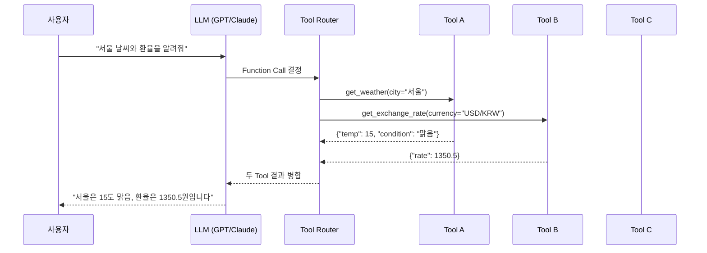
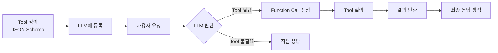
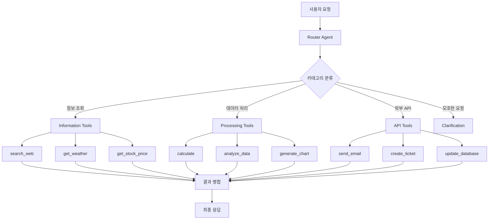
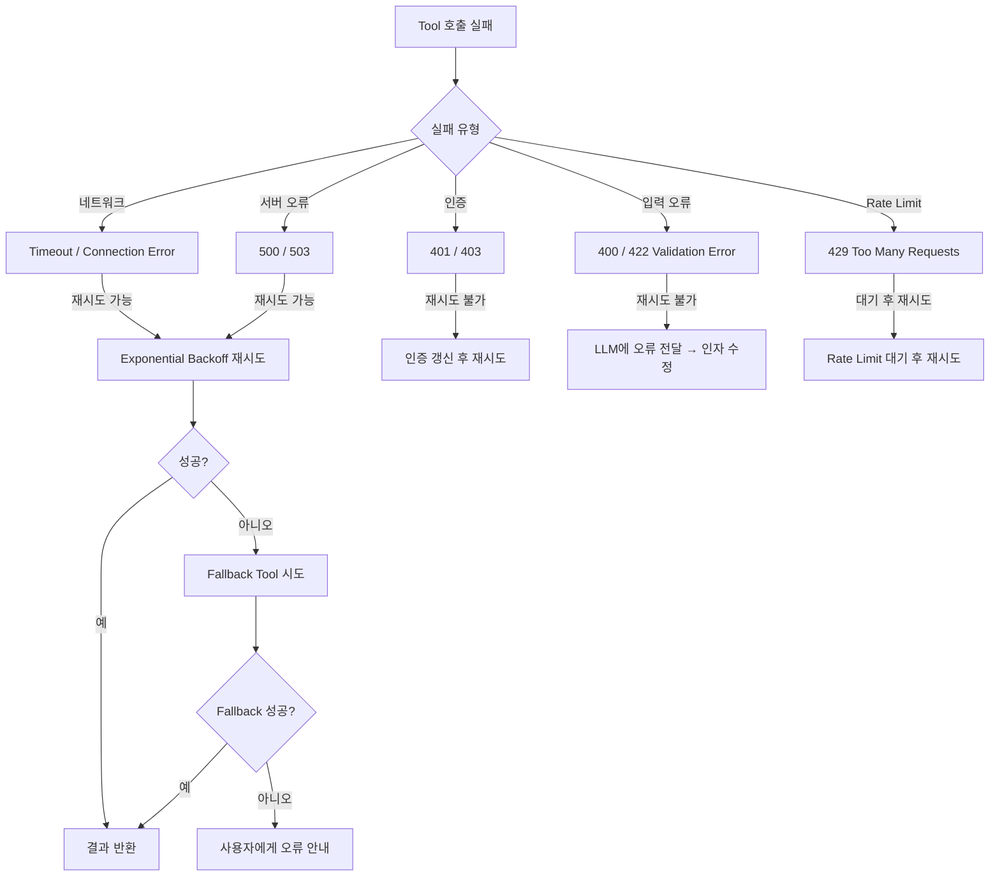

# Day 3 Session 1: MCP(Function Calling) 고급 설계 (2h)

## 1. 학습 목표

| 구분 | 내용 |
|------|------|
| **핵심 목표** | MCP 기반 Tool 정의, 선택 정확도 향상, Multi-tool Routing을 설계할 수 있다 |
| **세부 목표 1** | JSON Schema로 Tool을 정의하고 Description 품질이 정확도에 미치는 영향을 이해한다 |
| **세부 목표 2** | Multi-tool 환경에서 Router Agent 패턴을 구현할 수 있다 |
| **세부 목표 3** | Tool 실패 시 재시도 및 Fallback 전략을 설계할 수 있다 |
| **실습 비중** | 이론 30% (약 35분) / 실습 70% (약 85분) |

---

## 2. MCP와 Function Calling 심화

### 2.1 MCP 프로토콜 개요

MCP(Model Context Protocol)는 LLM이 외부 도구를 호출하기 위한 표준 프로토콜이다. Function Calling은 이 프로토콜의 핵심 메커니즘으로, LLM이 자연어 요청을 구조화된 함수 호출로 변환한다.



### 2.2 Function Calling의 동작 흐름

Function Calling은 3단계로 동작한다:

1. **Tool 등록**: 사용 가능한 Tool의 JSON Schema를 LLM에 전달
2. **Tool 선택**: LLM이 사용자 요청을 분석하여 적절한 Tool과 인자를 결정
3. **Tool 실행**: 선택된 Tool을 호출하고 결과를 LLM에 반환



> **핵심 인사이트**: LLM의 Tool 선택 정확도는 Tool 정의의 품질에 크게 의존한다. Description이 모호하면 잘못된 Tool을 선택하거나 인자를 잘못 채운다.

---

## 3. JSON Schema 기반 Tool 정의 패턴

### 3.1 기본 Tool 정의 구조

OpenAI와 Anthropic 모두 JSON Schema 기반 Tool 정의를 사용한다. 핵심 필드를 이해하자.

```python
from openai import OpenAI
import json

# Tool 정의: JSON Schema 형식
tools = [
    {
        "type": "function",
        "function": {
            "name": "get_weather",
            "description": "지정된 도시의 현재 날씨 정보를 조회합니다. "
                          "기온(섭씨), 체감 온도, 습도, 날씨 상태를 반환합니다.",
            "parameters": {
                "type": "object",
                "properties": {
                    "city": {
                        "type": "string",
                        "description": "날씨를 조회할 도시 이름 (한국어 또는 영어). 예: '서울', 'Tokyo'"
                    },
                    "unit": {
                        "type": "string",
                        "enum": ["celsius", "fahrenheit"],
                        "description": "온도 단위. 기본값은 celsius"
                    }
                },
                "required": ["city"],
                "additionalProperties": False
            }
        }
    }
]

client = OpenAI()

response = client.chat.completions.create(
    model="gpt-4o",
    messages=[{"role": "user", "content": "서울 날씨 알려줘"}],
    tools=tools,
    tool_choice="auto"
)

# Tool 호출 결과 확인
tool_call = response.choices[0].message.tool_calls[0]
print(f"Tool: {tool_call.function.name}")
print(f"Args: {tool_call.function.arguments}")
```

### 3.2 복잡한 Tool 정의: 중첩 객체와 배열

실무에서는 단순 파라미터를 넘어 중첩된 구조가 필요하다.

```python
# 복잡한 Tool 정의 예시: 데이터베이스 조회
db_query_tool = {
    "type": "function",
    "function": {
        "name": "query_database",
        "description": "SQL 데이터베이스에서 조건에 맞는 레코드를 조회합니다. "
                      "테이블명, 필터 조건, 정렬 기준, 반환 개수를 지정할 수 있습니다.",
        "parameters": {
            "type": "object",
            "properties": {
                "table": {
                    "type": "string",
                    "description": "조회할 테이블 이름",
                    "enum": ["users", "orders", "products", "reviews"]
                },
                "filters": {
                    "type": "array",
                    "description": "WHERE 조건 목록. AND로 결합됩니다.",
                    "items": {
                        "type": "object",
                        "properties": {
                            "field": {
                                "type": "string",
                                "description": "필터 대상 컬럼명"
                            },
                            "operator": {
                                "type": "string",
                                "enum": ["=", "!=", ">", "<", ">=", "<=", "LIKE", "IN"],
                                "description": "비교 연산자"
                            },
                            "value": {
                                "type": ["string", "number", "array"],
                                "description": "비교 값. IN 연산자일 경우 배열"
                            }
                        },
                        "required": ["field", "operator", "value"]
                    }
                },
                "order_by": {
                    "type": "object",
                    "description": "정렬 기준",
                    "properties": {
                        "field": {"type": "string"},
                        "direction": {
                            "type": "string",
                            "enum": ["ASC", "DESC"],
                            "description": "정렬 방향. 기본값 ASC"
                        }
                    },
                    "required": ["field"]
                },
                "limit": {
                    "type": "integer",
                    "description": "반환할 최대 레코드 수. 기본값 10, 최대 100",
                    "minimum": 1,
                    "maximum": 100
                }
            },
            "required": ["table"],
            "additionalProperties": False
        }
    }
}
```

### 3.3 Tool 정의 체크리스트

| 항목 | 좋은 예 | 나쁜 예 |
|------|---------|---------|
| **name** | `search_products` | `search` (모호) |
| **description** | "상품 카탈로그에서 이름, 카테고리, 가격 범위로 상품을 검색합니다" | "검색합니다" (불충분) |
| **parameter description** | "검색할 상품명. 부분 일치 검색 지원. 예: '노트북'" | "이름" (설명 없음) |
| **enum 사용** | `enum: ["ASC", "DESC"]` | `type: string` (제한 없음) |
| **required 명시** | `required: ["query"]` | 모든 파라미터 optional |
| **additionalProperties** | `false` | 미지정 (예측 불가) |

---

## 4. Tool Description 작성 전략

### 4.1 Description이 정확도에 미치는 영향

LLM은 Tool의 `description` 필드를 읽고 어떤 Tool을 호출할지 결정한다. 모호하거나 부실한 description은 잘못된 Tool 선택으로 이어진다.

```python
# 나쁜 description: LLM이 검색/날씨/뉴스를 구분하기 어려움
bad_tools = [
    {
        "type": "function",
        "function": {
            "name": "search",
            "description": "정보를 검색합니다",  # 무엇을? 어디서?
            "parameters": {
                "type": "object",
                "properties": {
                    "q": {"type": "string", "description": "검색어"}
                },
                "required": ["q"]
            }
        }
    }
]

# 좋은 description: 명확한 용도, 입출력, 제약 조건
good_tools = [
    {
        "type": "function",
        "function": {
            "name": "search_web",
            "description": (
                "Google 검색 엔진을 사용하여 웹 페이지를 검색합니다. "
                "일반적인 정보 질문, 최신 뉴스, 사실 확인에 사용합니다. "
                "날씨, 환율 등 실시간 데이터는 전용 Tool을 사용하세요. "
                "반환값: 제목, URL, 요약 스니펫 목록 (최대 10개)"
            ),
            "parameters": {
                "type": "object",
                "properties": {
                    "query": {
                        "type": "string",
                        "description": "검색할 질의문. 자연어 또는 키워드. 예: 'Python 3.12 새 기능'"
                    },
                    "num_results": {
                        "type": "integer",
                        "description": "반환할 결과 수 (1~10). 기본값 5",
                        "minimum": 1,
                        "maximum": 10
                    }
                },
                "required": ["query"],
                "additionalProperties": False
            }
        }
    }
]
```

### 4.2 Description 작성 5원칙

1. **역할 명시**: "무엇을 하는 Tool인가"를 첫 문장에 명확히
2. **사용 시점**: "언제 이 Tool을 써야 하는가" 명시
3. **미사용 시점**: "언제 이 Tool을 쓰면 안 되는가" (부정 조건)
4. **반환값 설명**: 출력 형태를 명시하여 LLM이 후처리 계획을 세울 수 있도록
5. **예시 포함**: parameter description에 구체적 예시를 추가

```python
# 5원칙을 모두 적용한 Tool description
complete_tool = {
    "type": "function",
    "function": {
        "name": "get_stock_price",
        "description": (
            # 1. 역할 명시
            "실시간 주식 가격 정보를 조회합니다. "
            # 2. 사용 시점
            "주가, 시가총액, 거래량 등 금융 데이터가 필요할 때 사용합니다. "
            # 3. 미사용 시점
            "암호화폐 가격은 get_crypto_price를, 환율은 get_exchange_rate를 사용하세요. "
            # 4. 반환값 설명
            "반환값: 현재가, 전일 대비 변동률, 거래량, 시가총액을 포함하는 JSON 객체"
        ),
        "parameters": {
            "type": "object",
            "properties": {
                "symbol": {
                    "type": "string",
                    # 5. 예시 포함
                    "description": "종목 티커 심볼. 예: 'AAPL' (Apple), '005930.KS' (삼성전자)"
                },
                "market": {
                    "type": "string",
                    "enum": ["US", "KR", "JP"],
                    "description": "주식 시장. US: 미국, KR: 한국, JP: 일본"
                }
            },
            "required": ["symbol"],
            "additionalProperties": False
        }
    }
}
```

---

## 5. Multi-tool Routing: Router Agent 패턴

### 5.1 Router Agent 아키텍처

여러 Tool이 있을 때, LLM이 직접 모든 Tool을 선택하는 대신 Router Agent가 중간에서 요청을 분류하고 적절한 Tool로 라우팅하는 패턴이다.



### 5.2 Router Agent 구현

```python
from openai import OpenAI
import json
from typing import Any

client = OpenAI()


# ── Tool Registry ────────────────────────────────────────────
class ToolRegistry:
    """Tool을 카테고리별로 관리하는 레지스트리"""

    def __init__(self):
        self._tools: dict[str, dict] = {}
        self._handlers: dict[str, callable] = {}
        self._categories: dict[str, list[str]] = {}

    def register(self, name: str, schema: dict, handler: callable, category: str):
        self._tools[name] = schema
        self._handlers[name] = handler
        self._categories.setdefault(category, []).append(name)

    def get_tools_by_category(self, category: str) -> list[dict]:
        names = self._categories.get(category, [])
        return [self._tools[n] for n in names]

    def get_all_tools(self) -> list[dict]:
        return list(self._tools.values())

    def execute(self, name: str, arguments: dict) -> Any:
        handler = self._handlers.get(name)
        if not handler:
            raise ValueError(f"Unknown tool: {name}")
        return handler(**arguments)


# ── Router Agent ─────────────────────────────────────────────
class RouterAgent:
    """사용자 요청을 분석하여 적절한 Tool 카테고리로 라우팅"""

    ROUTER_SYSTEM_PROMPT = """당신은 Tool Router입니다.
사용자 요청을 분석하여 가장 적절한 Tool 카테고리를 결정합니다.

카테고리:
- information: 정보 조회 (날씨, 검색, 주가 등)
- processing: 데이터 처리 (계산, 분석, 변환 등)
- api: 외부 시스템 연동 (이메일, 티켓, DB 등)
- none: Tool이 필요 없는 일반 대화

반드시 하나의 카테고리만 선택하세요."""

    def __init__(self, registry: ToolRegistry):
        self.registry = registry

    def route(self, user_message: str) -> str:
        """요청을 분석하여 Tool 카테고리를 반환"""
        response = client.chat.completions.create(
            model="gpt-4o-mini",  # 라우팅은 가벼운 모델로 충분
            messages=[
                {"role": "system", "content": self.ROUTER_SYSTEM_PROMPT},
                {"role": "user", "content": user_message}
            ],
            response_format={"type": "json_object"},
        )
        result = json.loads(response.choices[0].message.content)
        return result.get("category", "none")

    def execute(self, user_message: str) -> str:
        """전체 흐름: 라우팅 → Tool 선택 → 실행 → 응답 생성"""
        # 1단계: 카테고리 라우팅
        category = self.route(user_message)

        if category == "none":
            return self._direct_response(user_message)

        # 2단계: 해당 카테고리 Tool로 Function Calling
        tools = self.registry.get_tools_by_category(category)
        if not tools:
            return self._direct_response(user_message)

        response = client.chat.completions.create(
            model="gpt-4o",
            messages=[{"role": "user", "content": user_message}],
            tools=tools,
            tool_choice="auto"
        )

        message = response.choices[0].message

        # 3단계: Tool 실행
        if not message.tool_calls:
            return message.content

        # Tool 결과 수집
        tool_results = []
        for tool_call in message.tool_calls:
            args = json.loads(tool_call.function.arguments)
            result = self.registry.execute(tool_call.function.name, args)
            tool_results.append({
                "tool_call_id": tool_call.id,
                "role": "tool",
                "content": json.dumps(result, ensure_ascii=False)
            })

        # 4단계: 최종 응답 생성
        final_response = client.chat.completions.create(
            model="gpt-4o",
            messages=[
                {"role": "user", "content": user_message},
                message,
                *tool_results
            ]
        )

        return final_response.choices[0].message.content

    def _direct_response(self, user_message: str) -> str:
        response = client.chat.completions.create(
            model="gpt-4o",
            messages=[{"role": "user", "content": user_message}]
        )
        return response.choices[0].message.content
```

### 5.3 라우팅 전략 비교

| 전략 | 장점 | 단점 | 적합한 상황 |
|------|------|------|------------|
| **단일 호출** | 구현 간단, Latency 최소 | Tool 10개 초과 시 정확도 하락 | Tool 수 < 10 |
| **2단계 Router** | 카테고리별 분리로 정확도 향상 | LLM 호출 2회 (Latency 증가) | Tool 수 10~50 |
| **계층적 Router** | 대규모 Tool 관리 가능 | 구현 복잡도 높음, Latency 3회+ | Tool 수 > 50 |
| **임베딩 기반** | Tool 설명 유사도로 사전 필터링 | 임베딩 모델 추가 필요 | 동적 Tool 등록 |

---

## 6. Tool 실패 시 재시도 및 Fallback 전략

### 6.1 실패 유형 분류



### 6.2 재시도 및 Fallback 구현

```python
import asyncio
import time
import random
from dataclasses import dataclass, field
from typing import Any


@dataclass
class RetryConfig:
    """재시도 설정"""
    max_retries: int = 3
    base_delay: float = 1.0        # 초기 대기 시간 (초)
    max_delay: float = 30.0        # 최대 대기 시간
    exponential_base: float = 2.0  # 지수 증가 배수
    jitter: bool = True            # 랜덤 지터 추가 여부


@dataclass
class ToolResult:
    """Tool 실행 결과"""
    success: bool
    data: Any = None
    error: str | None = None
    tool_name: str = ""
    attempts: int = 0
    fallback_used: bool = False


class ResilientToolExecutor:
    """재시도와 Fallback을 지원하는 Tool 실행기"""

    def __init__(self, registry: ToolRegistry, retry_config: RetryConfig | None = None):
        self.registry = registry
        self.config = retry_config or RetryConfig()
        # Tool별 Fallback 매핑
        self._fallbacks: dict[str, list[str]] = {}

    def register_fallback(self, tool_name: str, fallback_tools: list[str]):
        """특정 Tool의 Fallback Tool 목록 등록"""
        self._fallbacks[tool_name] = fallback_tools

    def execute_with_retry(self, tool_name: str, arguments: dict) -> ToolResult:
        """재시도 로직이 포함된 Tool 실행"""
        last_error = None

        for attempt in range(1, self.config.max_retries + 1):
            try:
                result = self.registry.execute(tool_name, arguments)
                return ToolResult(
                    success=True,
                    data=result,
                    tool_name=tool_name,
                    attempts=attempt
                )
            except Exception as e:
                last_error = str(e)

                # 재시도 불가능한 오류인지 확인
                if self._is_non_retryable(e):
                    break

                # Exponential Backoff 대기
                if attempt < self.config.max_retries:
                    delay = self._calculate_delay(attempt)
                    print(f"[재시도 {attempt}/{self.config.max_retries}] "
                          f"{tool_name} 실패: {e}. {delay:.1f}초 후 재시도...")
                    time.sleep(delay)

        # 재시도 실패 → Fallback 시도
        return self._try_fallback(tool_name, arguments, last_error)

    def _calculate_delay(self, attempt: int) -> float:
        """Exponential Backoff 대기 시간 계산"""
        delay = self.config.base_delay * (self.config.exponential_base ** (attempt - 1))
        delay = min(delay, self.config.max_delay)
        if self.config.jitter:
            delay *= (0.5 + random.random())  # 50% ~ 150% 범위의 지터
        return delay

    def _is_non_retryable(self, error: Exception) -> bool:
        """재시도 불가능한 오류 판별"""
        non_retryable_types = (ValueError, TypeError, KeyError)
        return isinstance(error, non_retryable_types)

    def _try_fallback(
        self, original_tool: str, arguments: dict, original_error: str
    ) -> ToolResult:
        """Fallback Tool 시도"""
        fallbacks = self._fallbacks.get(original_tool, [])

        for fallback_name in fallbacks:
            try:
                result = self.registry.execute(fallback_name, arguments)
                return ToolResult(
                    success=True,
                    data=result,
                    tool_name=fallback_name,
                    attempts=self.config.max_retries + 1,
                    fallback_used=True
                )
            except Exception:
                continue

        return ToolResult(
            success=False,
            error=f"원본 Tool({original_tool}) 실패: {original_error}. "
                  f"Fallback {len(fallbacks)}개도 모두 실패",
            tool_name=original_tool,
            attempts=self.config.max_retries
        )


# ── 사용 예시 ────────────────────────────────────────────────
# Fallback 등록: 날씨 Tool 실패 시 대체 서비스 사용
executor = ResilientToolExecutor(registry=ToolRegistry())
executor.register_fallback("get_weather_openweather", [
    "get_weather_weatherapi",
    "get_weather_cached"  # 마지막 수단: 캐시된 데이터
])
```

### 6.3 LLM 기반 인자 자동 수정

Tool이 Validation Error를 반환하면, LLM에게 오류 메시지를 전달하여 인자를 자동으로 수정할 수 있다.

```python
def auto_fix_arguments(
    client: OpenAI,
    tool_schema: dict,
    original_args: dict,
    error_message: str
) -> dict:
    """LLM을 사용하여 Tool 호출 인자를 자동 수정"""

    fix_prompt = f"""Tool 호출이 다음 오류로 실패했습니다:
오류: {error_message}

원래 인자: {json.dumps(original_args, ensure_ascii=False)}

Tool 스키마: {json.dumps(tool_schema, ensure_ascii=False)}

오류를 수정한 올바른 인자를 JSON으로 반환해주세요."""

    response = client.chat.completions.create(
        model="gpt-4o-mini",
        messages=[{"role": "user", "content": fix_prompt}],
        response_format={"type": "json_object"}
    )

    return json.loads(response.choices[0].message.content)
```

---

## 7. 실습: 복수 Tool 선택 정확도 비교

> **실습 안내**: `labs/day3-mcp-implementation/` 디렉토리로 이동하여 실습을 진행합니다.

### 실습 개요

| 단계 | 내용 | 시간 |
|------|------|------|
| **I DO** | 단일 MCP Tool 정의 및 호출 시연 | 15분 |
| **WE DO** | Multi-tool Router 구현 | 40분 |
| **YOU DO** | Tool 선택 정확도 측정 및 개선 | 30분 |

### I DO (강사 시연)

강사가 `src/i_do_single_tool.py`를 실행하며 다음을 시연한다:
- Weather Tool을 JSON Schema로 정의
- OpenAI API에 Tool을 등록하고 호출
- Tool 결과를 LLM에 반환하여 최종 응답 생성

### WE DO (함께 실습)

`src/we_do_multi_tool.py`의 스캐폴드를 함께 채워나간다:
- 3개 Tool(날씨, 검색, 계산기) 등록
- Router Agent로 Multi-tool Routing 구현
- Tool 실패 시 Fallback 처리

### YOU DO (독립 과제)

`src/you_do_tool_accuracy.py`를 완성한다:
- 10개 테스트 케이스에 대해 Tool 선택 정확도 측정
- Description 개선 전/후 정확도 비교
- 정확도 90% 이상 달성이 목표

> **정답 코드**: `solution/you_do_tool_accuracy.py` 참고

---

## 핵심 요약

| 주제 | 핵심 포인트 |
|------|------------|
| **JSON Schema** | `name`, `description`, `parameters`(required, enum, additionalProperties) 필수 명시 |
| **Description 5원칙** | 역할, 사용 시점, 미사용 시점, 반환값, 예시 |
| **Multi-tool Routing** | Tool 수 10개 이하면 단일 호출, 10개 이상이면 2단계 Router |
| **재시도 전략** | Exponential Backoff + Jitter, 재시도 불가 오류 구분, Fallback 체인 |
| **정확도 향상** | Description 품질이 최대 영향 요인. 부정 조건과 예시 추가가 효과적 |
