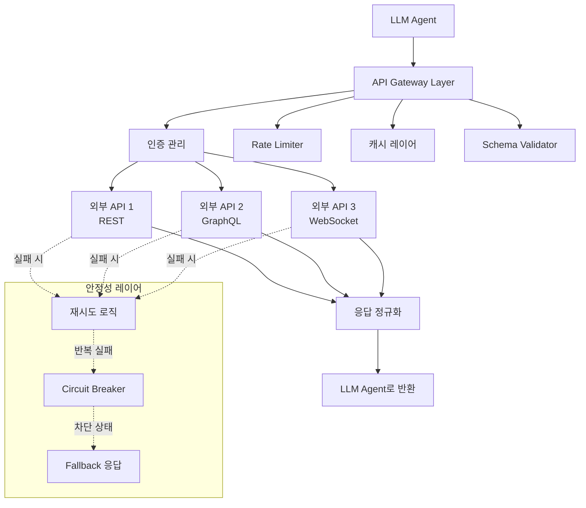
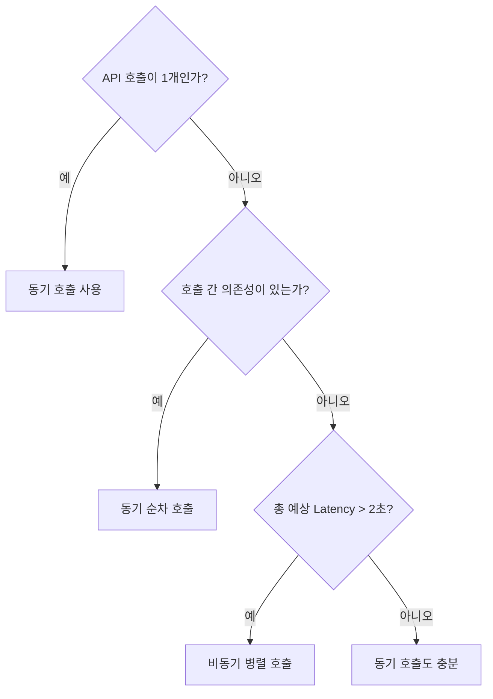
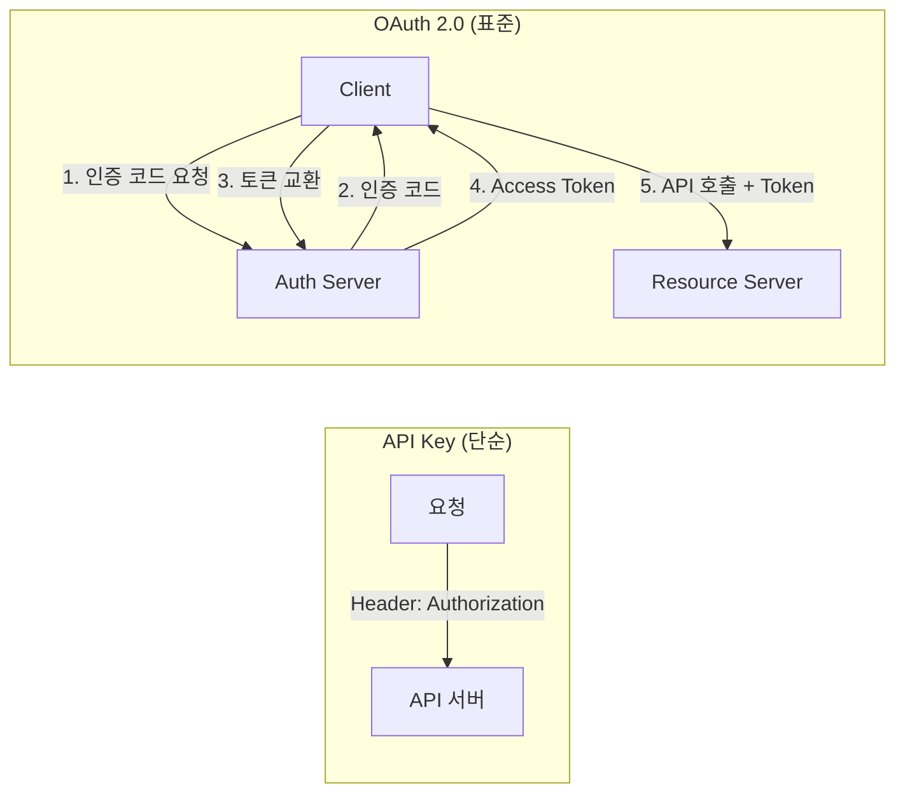

# Day 3 Session 2: 외부 API / 데이터 연동 최적화 (2h)

## 1. 학습 목표

| 구분 | 내용 |
|------|------|
| **핵심 목표** | Agent에서 외부 API를 안정적이고 효율적으로 연동하는 패턴을 설계할 수 있다 |
| **세부 목표 1** | httpx 기반 동기/비동기 API 호출을 구현하고 Latency를 최소화할 수 있다 |
| **세부 목표 2** | Pydantic으로 API 입출력을 검증하고 Guardrail을 구현할 수 있다 |
| **세부 목표 3** | API Key 관리, OAuth, Rate Limit 처리 전략을 설계할 수 있다 |
| **실습 비중** | 이론 30% (약 35분) / 실습 70% (약 85분) |

---

## 2. Agent에서 외부 API 연동 패턴

### 2.1 왜 외부 API 연동이 중요한가

AI Agent의 핵심 가치는 "추론 + 행동"이다. 외부 API 연동은 Agent가 실제 세계와 상호작용하는 유일한 방법이다.

- **정보 획득**: 실시간 데이터(날씨, 주가, 뉴스)
- **작업 수행**: 이메일 전송, 티켓 생성, DB 업데이트
- **검증**: 사실 확인, 데이터 크로스체크

### 2.2 Agent API 연동 아키텍처



### 2.3 설계 원칙

| 원칙 | 설명 |
|------|------|
| **Fail Fast** | 타임아웃을 짧게 설정하여 느린 API가 Agent 전체를 블로킹하지 않도록 |
| **Graceful Degradation** | API 실패 시 캐시된 데이터나 대체 응답을 반환 |
| **Idempotent** | 같은 요청을 여러 번 보내도 동일한 결과 (재시도 안전성) |
| **Schema First** | 입출력을 항상 스키마로 검증 (LLM 할루시네이션 방지) |

---

## 3. httpx 기반 동기/비동기 API 호출

### 3.1 동기 호출 기본

```python
import httpx
import os
import json

# ── 동기 API 클라이언트 ────────────────────────────────────
class SyncAPIClient:
    """동기 방식 외부 API 클라이언트"""

    def __init__(self, base_url: str, api_key: str | None = None):
        self.client = httpx.Client(
            base_url=base_url,
            timeout=httpx.Timeout(
                connect=5.0,    # 연결 타임아웃
                read=10.0,      # 읽기 타임아웃
                write=5.0,      # 쓰기 타임아웃
                pool=5.0        # 커넥션 풀 대기
            ),
            headers={
                "Content-Type": "application/json",
                "Authorization": f"Bearer {api_key}" if api_key else "",
            },
            follow_redirects=True
        )

    def get(self, path: str, params: dict | None = None) -> dict:
        """GET 요청"""
        response = self.client.get(path, params=params)
        response.raise_for_status()
        return response.json()

    def post(self, path: str, data: dict) -> dict:
        """POST 요청"""
        response = self.client.post(path, json=data)
        response.raise_for_status()
        return response.json()

    def close(self):
        self.client.close()


# 사용 예시: OpenWeatherMap API
weather_client = SyncAPIClient(
    base_url="https://api.openweathermap.org/data/2.5",
    api_key=os.environ.get("OPENWEATHER_API_KEY")
)

try:
    weather = weather_client.get("/weather", params={
        "q": "Seoul",
        "units": "metric",
        "appid": os.environ.get("OPENWEATHER_API_KEY")
    })
    print(f"서울 기온: {weather['main']['temp']}°C")
finally:
    weather_client.close()
```

### 3.2 비동기 호출: 병렬 API 요청

Agent가 여러 API를 동시에 호출해야 할 때 비동기 처리가 Latency를 극적으로 줄인다.

```python
import httpx
import asyncio
import time
import os


class AsyncAPIClient:
    """비동기 방식 외부 API 클라이언트"""

    def __init__(self):
        self.client = httpx.AsyncClient(
            timeout=httpx.Timeout(connect=5.0, read=10.0, write=5.0, pool=5.0),
            limits=httpx.Limits(
                max_connections=20,       # 최대 동시 연결 수
                max_keepalive_connections=10  # Keep-alive 연결 수
            )
        )

    async def fetch(self, url: str, params: dict | None = None) -> dict:
        """단일 GET 요청"""
        response = await self.client.get(url, params=params)
        response.raise_for_status()
        return response.json()

    async def fetch_all(self, requests: list[dict]) -> list[dict]:
        """여러 API를 동시에 호출 (병렬)"""
        tasks = [
            self.fetch(req["url"], req.get("params"))
            for req in requests
        ]
        results = await asyncio.gather(*tasks, return_exceptions=True)

        processed = []
        for req, result in zip(requests, results):
            if isinstance(result, Exception):
                processed.append({
                    "url": req["url"],
                    "success": False,
                    "error": str(result)
                })
            else:
                processed.append({
                    "url": req["url"],
                    "success": True,
                    "data": result
                })
        return processed

    async def close(self):
        await self.client.aclose()


# ── 동기 vs 비동기 성능 비교 ─────────────────────────────────
async def compare_sync_vs_async():
    """동기와 비동기의 Latency 차이를 측정"""

    api_key = os.environ.get("OPENWEATHER_API_KEY", "demo")
    cities = ["Seoul", "Tokyo", "London", "New York", "Paris"]
    base_url = "https://api.openweathermap.org/data/2.5/weather"

    # 1. 동기 방식 (순차 호출)
    start = time.time()
    sync_client = httpx.Client(timeout=10.0)
    for city in cities:
        try:
            sync_client.get(base_url, params={"q": city, "appid": api_key})
        except httpx.HTTPError:
            pass
    sync_time = time.time() - start
    sync_client.close()

    # 2. 비동기 방식 (병렬 호출)
    start = time.time()
    async_client = AsyncAPIClient()
    requests = [
        {"url": base_url, "params": {"q": city, "appid": api_key}}
        for city in cities
    ]
    await async_client.fetch_all(requests)
    async_time = time.time() - start
    await async_client.close()

    print(f"동기 방식: {sync_time:.2f}초")
    print(f"비동기 방식: {async_time:.2f}초")
    print(f"속도 향상: {sync_time / async_time:.1f}배")


# asyncio.run(compare_sync_vs_async())
```

### 3.3 동기 vs 비동기 선택 기준



---

## 4. Latency 최소화: 캐싱, 배치 처리, 커넥션 풀

### 4.1 응답 캐싱

동일한 쿼리에 대해 반복 API 호출을 방지한다.

```python
import hashlib
import time
from functools import lru_cache


class TTLCache:
    """Time-To-Live 기반 캐시"""

    def __init__(self, ttl_seconds: int = 300):
        self._cache: dict[str, tuple[float, any]] = {}
        self.ttl = ttl_seconds

    def _make_key(self, url: str, params: dict | None) -> str:
        """URL + 파라미터로 캐시 키 생성"""
        raw = f"{url}:{json.dumps(params or {}, sort_keys=True)}"
        return hashlib.md5(raw.encode()).hexdigest()

    def get(self, url: str, params: dict | None = None) -> dict | None:
        key = self._make_key(url, params)
        if key in self._cache:
            timestamp, data = self._cache[key]
            if time.time() - timestamp < self.ttl:
                return data
            del self._cache[key]  # TTL 만료
        return None

    def set(self, url: str, params: dict | None, data: dict):
        key = self._make_key(url, params)
        self._cache[key] = (time.time(), data)

    def clear_expired(self):
        """만료된 항목 정리"""
        now = time.time()
        expired = [k for k, (t, _) in self._cache.items() if now - t >= self.ttl]
        for k in expired:
            del self._cache[k]


class CachedAPIClient:
    """캐시가 적용된 API 클라이언트"""

    def __init__(self, base_url: str, cache_ttl: int = 300):
        self.client = httpx.Client(base_url=base_url, timeout=10.0)
        self.cache = TTLCache(ttl_seconds=cache_ttl)
        self._stats = {"hits": 0, "misses": 0}

    def get(self, path: str, params: dict | None = None) -> dict:
        # 캐시 확인
        cached = self.cache.get(path, params)
        if cached is not None:
            self._stats["hits"] += 1
            return cached

        # 캐시 미스: 실제 API 호출
        self._stats["misses"] += 1
        response = self.client.get(path, params=params)
        response.raise_for_status()
        data = response.json()

        self.cache.set(path, params, data)
        return data

    @property
    def hit_rate(self) -> float:
        total = self._stats["hits"] + self._stats["misses"]
        return self._stats["hits"] / total if total > 0 else 0.0
```

### 4.2 배치 처리

여러 개별 요청을 하나의 배치로 묶어 API 호출 횟수를 줄인다.

```python
import asyncio
from collections import defaultdict


class BatchProcessor:
    """요청을 모아서 배치로 처리"""

    def __init__(self, batch_size: int = 10, flush_interval: float = 0.5):
        self.batch_size = batch_size
        self.flush_interval = flush_interval
        self._queue: list[dict] = []
        self._results: dict[str, asyncio.Future] = {}

    async def add_request(self, request_id: str, data: dict) -> dict:
        """요청을 큐에 추가하고 결과를 기다림"""
        future = asyncio.get_event_loop().create_future()
        self._results[request_id] = future
        self._queue.append({"id": request_id, **data})

        # 배치 크기에 도달하면 즉시 처리
        if len(self._queue) >= self.batch_size:
            await self._flush()

        return await future

    async def _flush(self):
        """큐에 쌓인 요청을 배치로 전송"""
        if not self._queue:
            return

        batch = self._queue[:self.batch_size]
        self._queue = self._queue[self.batch_size:]

        # 배치 API 호출 (예: 여러 항목을 한 번에 임베딩)
        async with httpx.AsyncClient() as client:
            response = await client.post(
                "https://api.openai.com/v1/embeddings",
                json={
                    "model": "text-embedding-3-small",
                    "input": [item["text"] for item in batch]
                },
                headers={
                    "Authorization": f"Bearer {os.environ.get('OPENAI_API_KEY')}"
                }
            )
            results = response.json()

        # 개별 결과를 Future에 설정
        for item, embedding in zip(batch, results.get("data", [])):
            future = self._results.pop(item["id"], None)
            if future and not future.done():
                future.set_result(embedding)
```

### 4.3 커넥션 풀 최적화

```python
# httpx의 커넥션 풀 설정 가이드
optimized_client = httpx.AsyncClient(
    limits=httpx.Limits(
        max_connections=100,          # 전체 최대 동시 연결
        max_keepalive_connections=20, # Keep-alive 유지 연결
        keepalive_expiry=30.0         # Keep-alive 만료 시간 (초)
    ),
    timeout=httpx.Timeout(
        connect=3.0,   # 빠른 실패
        read=15.0,     # 응답 대기는 여유있게
        write=5.0,
        pool=2.0       # 풀 대기는 짧게
    ),
    # HTTP/2 사용 시 (pip install httpx[http2])
    # http2=True
)
```

---

## 5. Pydantic Schema Validation (입력/출력 검증)

### 5.1 왜 Schema Validation이 필요한가

LLM이 생성한 API 호출 인자가 항상 올바르다고 보장할 수 없다. Pydantic으로 입출력을 검증하면:
- LLM의 잘못된 인자를 사전에 차단
- API 응답의 예상치 못한 형태를 안전하게 처리
- 타입 안전성 확보

### 5.2 입력 검증 (Request Validation)

```python
from pydantic import BaseModel, Field, field_validator
from enum import Enum


class TemperatureUnit(str, Enum):
    CELSIUS = "celsius"
    FAHRENHEIT = "fahrenheit"


class WeatherRequest(BaseModel):
    """날씨 API 요청 스키마"""
    city: str = Field(
        ...,
        min_length=1,
        max_length=100,
        description="도시 이름"
    )
    unit: TemperatureUnit = Field(
        default=TemperatureUnit.CELSIUS,
        description="온도 단위"
    )

    @field_validator("city")
    @classmethod
    def validate_city(cls, v: str) -> str:
        # SQL Injection 방지: 특수문자 제거
        import re
        if not re.match(r"^[\w\s\-\.\,]+$", v):
            raise ValueError(f"잘못된 도시 이름: {v}")
        return v.strip()


class SearchRequest(BaseModel):
    """검색 API 요청 스키마"""
    query: str = Field(..., min_length=1, max_length=500)
    num_results: int = Field(default=5, ge=1, le=20)
    language: str = Field(default="ko", pattern=r"^[a-z]{2}$")


# LLM이 생성한 인자를 검증
def validate_tool_arguments(schema_class: type[BaseModel], arguments: dict) -> BaseModel:
    """Tool 호출 인자를 Pydantic으로 검증"""
    try:
        return schema_class(**arguments)
    except Exception as e:
        raise ValueError(
            f"Tool 인자 검증 실패: {e}\n"
            f"전달된 인자: {arguments}\n"
            f"필수 필드: {list(schema_class.model_fields.keys())}"
        )


# 사용 예시
try:
    request = validate_tool_arguments(
        WeatherRequest,
        {"city": "서울", "unit": "celsius"}
    )
    print(f"검증 완료: {request.model_dump()}")
except ValueError as e:
    print(f"검증 실패: {e}")
```

### 5.3 출력 검증 (Response Validation)

```python
from pydantic import BaseModel, Field
from typing import Optional


class WeatherResponse(BaseModel):
    """날씨 API 응답 스키마"""
    temperature: float = Field(..., ge=-100, le=100)
    feels_like: float = Field(..., ge=-100, le=100)
    humidity: int = Field(..., ge=0, le=100)
    description: str
    wind_speed: float = Field(..., ge=0)
    city: str
    country: str


class APIResponseWrapper(BaseModel):
    """API 응답 래퍼 - 성공/실패를 통일된 형태로"""
    success: bool
    data: Optional[dict] = None
    error: Optional[str] = None
    cached: bool = False


def validate_api_response(
    raw_response: dict,
    schema_class: type[BaseModel]
) -> APIResponseWrapper:
    """API 응답을 검증하고 정규화"""
    try:
        validated = schema_class(**raw_response)
        return APIResponseWrapper(
            success=True,
            data=validated.model_dump()
        )
    except Exception as e:
        return APIResponseWrapper(
            success=False,
            error=f"응답 스키마 불일치: {e}"
        )


# ── Guardrail: LLM 출력 안전성 검증 ─────────────────────────
class OutputGuardrail(BaseModel):
    """LLM 출력에 대한 안전성 Guardrail"""
    contains_pii: bool = Field(
        default=False,
        description="개인정보 포함 여부"
    )
    confidence_score: float = Field(
        default=0.0,
        ge=0.0, le=1.0,
        description="응답 신뢰도"
    )
    source_cited: bool = Field(
        default=False,
        description="출처 인용 여부"
    )

    def is_safe(self) -> bool:
        """안전한 응답인지 판별"""
        return (
            not self.contains_pii
            and self.confidence_score >= 0.7
        )
```

---

## 6. 인증(API Key, OAuth), Rate Limit 처리

### 6.1 API Key 관리

```python
import os
from dataclasses import dataclass


@dataclass
class APIKeyConfig:
    """API Key 설정 - 환경변수 기반"""
    openai: str = ""
    anthropic: str = ""
    weather: str = ""

    @classmethod
    def from_env(cls) -> "APIKeyConfig":
        """환경변수에서 API Key 로드"""
        return cls(
            openai=os.environ.get("OPENAI_API_KEY", ""),
            anthropic=os.environ.get("ANTHROPIC_API_KEY", ""),
            weather=os.environ.get("OPENWEATHER_API_KEY", ""),
        )

    def validate(self) -> list[str]:
        """설정되지 않은 키 목록 반환"""
        missing = []
        for field_name, value in self.__dict__.items():
            if not value:
                missing.append(field_name)
        return missing


# .env 파일 예시 (절대 코드에 하드코딩하지 않음!)
# OPENAI_API_KEY=sk-...
# ANTHROPIC_API_KEY=sk-ant-...
# OPENWEATHER_API_KEY=abc123...

config = APIKeyConfig.from_env()
missing = config.validate()
if missing:
    print(f"경고: 다음 API Key가 설정되지 않았습니다: {missing}")
```

### 6.2 Rate Limiter 구현

```python
import time
import asyncio
from collections import deque


class RateLimiter:
    """Token Bucket 기반 Rate Limiter"""

    def __init__(self, max_requests: int, time_window: float):
        """
        Args:
            max_requests: 시간 윈도우 내 최대 요청 수
            time_window: 시간 윈도우 (초)
        """
        self.max_requests = max_requests
        self.time_window = time_window
        self._timestamps: deque[float] = deque()

    def acquire(self) -> float:
        """
        요청 허용 여부를 확인하고 대기 시간을 반환.
        반환값이 0이면 즉시 실행 가능, > 0이면 해당 시간만큼 대기 필요.
        """
        now = time.time()

        # 윈도우 밖의 오래된 타임스탬프 제거
        while self._timestamps and now - self._timestamps[0] > self.time_window:
            self._timestamps.popleft()

        if len(self._timestamps) < self.max_requests:
            self._timestamps.append(now)
            return 0.0  # 즉시 실행 가능

        # 가장 오래된 요청이 윈도우를 벗어날 때까지 대기
        wait_time = self._timestamps[0] + self.time_window - now
        return max(wait_time, 0.0)

    def wait_and_acquire(self):
        """동기 방식: 필요한 만큼 대기 후 획득"""
        wait_time = self.acquire()
        if wait_time > 0:
            print(f"Rate limit: {wait_time:.1f}초 대기...")
            time.sleep(wait_time)
            self._timestamps.append(time.time())

    async def async_wait_and_acquire(self):
        """비동기 방식: 필요한 만큼 대기 후 획득"""
        wait_time = self.acquire()
        if wait_time > 0:
            print(f"Rate limit: {wait_time:.1f}초 대기...")
            await asyncio.sleep(wait_time)
            self._timestamps.append(time.time())


class RateLimitedClient:
    """Rate Limit이 적용된 API 클라이언트"""

    def __init__(self, base_url: str, requests_per_minute: int = 60):
        self.client = httpx.Client(base_url=base_url, timeout=10.0)
        self.limiter = RateLimiter(
            max_requests=requests_per_minute,
            time_window=60.0
        )

    def get(self, path: str, params: dict | None = None) -> dict:
        self.limiter.wait_and_acquire()
        response = self.client.get(path, params=params)

        # API가 429를 반환하면 Retry-After 헤더 확인
        if response.status_code == 429:
            retry_after = int(response.headers.get("Retry-After", "60"))
            print(f"서버 Rate Limit 도달. {retry_after}초 후 재시도...")
            time.sleep(retry_after)
            response = self.client.get(path, params=params)

        response.raise_for_status()
        return response.json()
```

### 6.3 인증 흐름 비교



| 방식 | 보안 수준 | 구현 난이도 | 적합한 상황 |
|------|----------|------------|------------|
| **API Key** | 중 | 낮음 | 서버 간 통신, 내부 API |
| **Bearer Token** | 중상 | 중간 | 일반적인 REST API |
| **OAuth 2.0** | 높음 | 높음 | 사용자 대행 접근, 3rd-party |
| **mTLS** | 매우 높음 | 높음 | 금융, 의료 등 보안 민감 |

---

## 7. 실습: 외부 API 연동 Agent 구현

> **실습 안내**: `labs/day3-api-integration/` 디렉토리로 이동하여 실습을 진행합니다.

### 실습 개요

| 단계 | 내용 | 시간 |
|------|------|------|
| **I DO** | 동기 API 호출 Agent 시연 | 15분 |
| **WE DO** | 비동기 변환 + 에러 처리 | 40분 |
| **YOU DO** | 인증 + Rate Limit + Validation 통합 | 30분 |

### I DO (강사 시연)

강사가 `src/i_do_sync_api.py`를 실행하며 다음을 시연한다:
- httpx 기반 동기 API 클라이언트 구현
- OpenAI Function Calling과 외부 API 연동
- Tool 결과를 LLM에 전달하여 자연어 응답 생성

### WE DO (함께 실습)

`src/we_do_async_api.py`의 스캐폴드를 함께 채워나간다:
- 동기 코드를 비동기로 변환 (httpx.AsyncClient)
- 여러 API 병렬 호출 (asyncio.gather)
- 에러 처리 및 타임아웃 설정

### YOU DO (독립 과제)

`src/you_do_full_integration.py`를 완성한다:
- API Key 환경변수 관리
- Rate Limiter 적용 (분당 30회 제한)
- Pydantic 입출력 검증
- 재시도 로직 (Exponential Backoff)
- 전체 통합 테스트

> **정답 코드**: `solution/you_do_full_integration.py` 참고

---

## 핵심 요약

| 주제 | 핵심 포인트 |
|------|------------|
| **동기 vs 비동기** | 단일 호출은 동기, 2개+ 독립 호출은 비동기 병렬 |
| **Latency 최소화** | TTL 캐싱, 배치 처리, 커넥션 풀 최적화 3가지 조합 |
| **Schema Validation** | Pydantic으로 입력(LLM 인자) + 출력(API 응답) 양방향 검증 |
| **인증** | 환경변수 관리 필수. API Key < Bearer < OAuth 순으로 보안 강화 |
| **Rate Limit** | Token Bucket 클라이언트 측 제한 + 서버 429 응답 처리 |
| **재시도** | Exponential Backoff + Jitter, 비재시도 오류 구분 |
