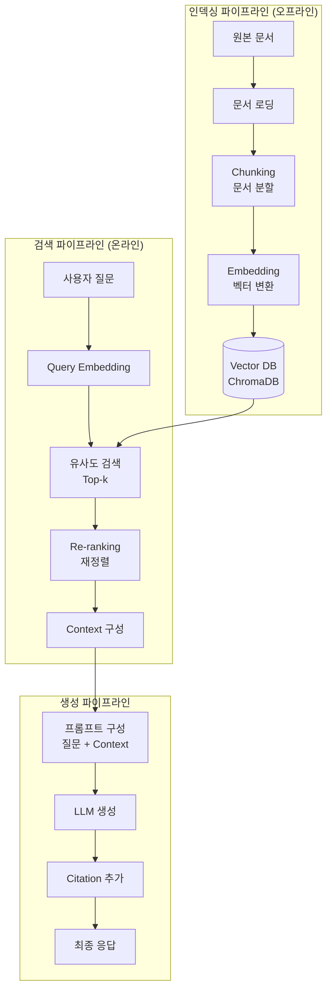
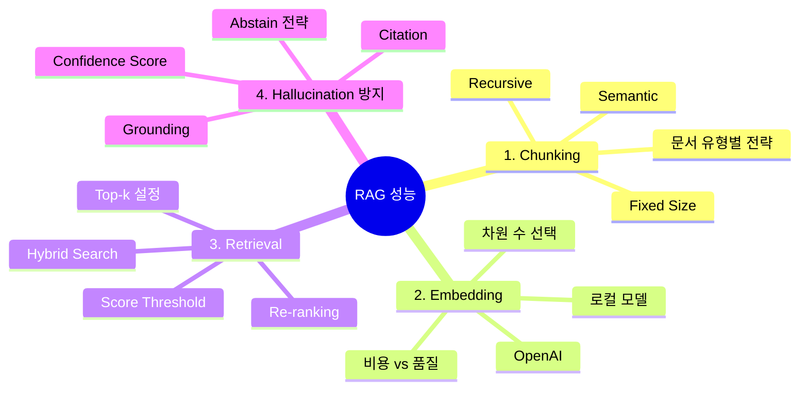
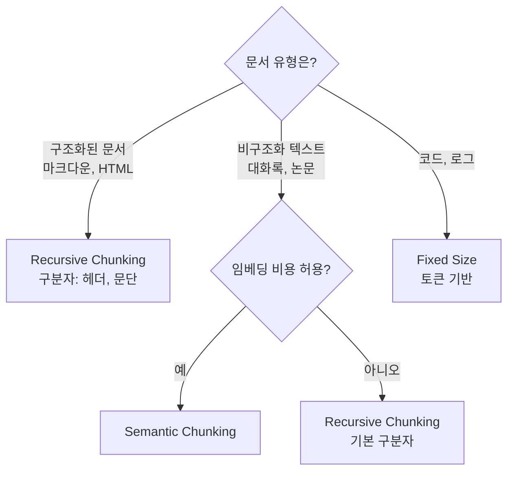
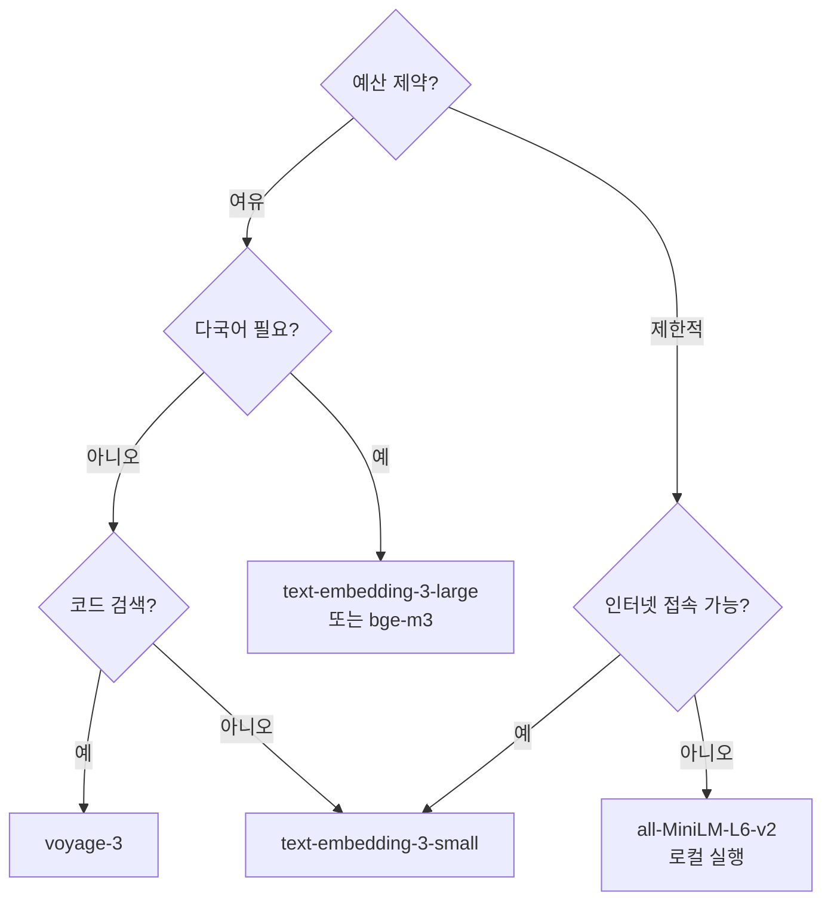
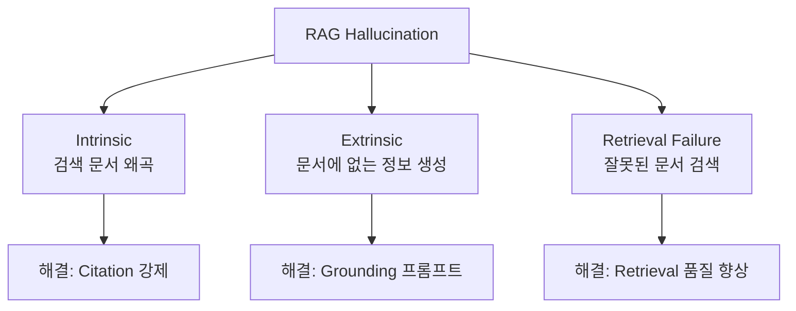

# Day 3 Session 3: RAG 성능을 결정하는 4가지 요소 (2h)

## 1. 학습 목표

| 구분 | 내용 |
|------|------|
| **핵심 목표** | RAG 파이프라인의 4가지 핵심 요소를 이해하고 최적화할 수 있다 |
| **세부 목표 1** | Chunking 전략(Fixed, Recursive, Semantic)을 비교하고 상황에 맞게 선택할 수 있다 |
| **세부 목표 2** | Embedding 모델을 선택하고 ChromaDB에서 Retrieval을 튜닝할 수 있다 |
| **세부 목표 3** | Hallucination을 최소화하는 Citation, Grounding 전략을 적용할 수 있다 |
| **실습 비중** | 이론 30% (약 35분) / 실습 70% (약 85분) |

---

## 2. RAG 파이프라인 전체 구조

### 2.1 RAG란 무엇인가

RAG(Retrieval-Augmented Generation)는 LLM의 응답에 외부 지식을 주입하는 기술이다. LLM이 학습하지 않은 최신 정보, 사내 문서, 도메인 전문 지식을 활용할 수 있게 한다.

### 2.2 RAG 파이프라인 흐름



### 2.3 성능을 결정하는 4가지 요소



---

## 3. 요소 1: Chunking 전략

### 3.1 왜 Chunking이 중요한가

문서를 그대로 임베딩하면 벡터가 너무 일반적이 되어 정밀한 검색이 불가능하다. 반대로 너무 작게 자르면 문맥이 소실된다. 최적의 Chunk 크기와 전략이 RAG 성능의 기초를 결정한다.

### 3.2 세 가지 Chunking 전략 비교

| 전략 | 방법 | 장점 | 단점 | 적합한 문서 |
|------|------|------|------|------------|
| **Fixed Size** | 고정 글자/토큰 수로 분할 | 구현 간단, 예측 가능 | 문장/문단 중간에서 잘림 | 구조화 안 된 로그, 코드 |
| **Recursive** | 구분자 계층(\n\n → \n → . → " ")으로 분할 | 문단/문장 경계 존중 | 구분자 선택이 중요 | 일반 텍스트, 기술 문서 |
| **Semantic** | 임베딩 유사도 변화로 의미 경계 감지 | 의미 단위 보존 최상 | 임베딩 비용 발생, 느림 | 대화록, 논문, 법률 문서 |

### 3.3 Chunking 구현 코드

```python
from dataclasses import dataclass


@dataclass
class Chunk:
    """분할된 텍스트 조각"""
    text: str
    index: int
    metadata: dict


# ── 1. Fixed Size Chunking ───────────────────────────────────
def fixed_size_chunking(
    text: str,
    chunk_size: int = 500,
    overlap: int = 50
) -> list[Chunk]:
    """고정 크기로 텍스트 분할. overlap으로 문맥 연결."""
    chunks = []
    start = 0
    index = 0

    while start < len(text):
        end = start + chunk_size
        chunk_text = text[start:end]

        chunks.append(Chunk(
            text=chunk_text,
            index=index,
            metadata={"strategy": "fixed", "start": start, "end": min(end, len(text))}
        ))

        start += chunk_size - overlap
        index += 1

    return chunks


# ── 2. Recursive Character Chunking ─────────────────────────
def recursive_chunking(
    text: str,
    chunk_size: int = 500,
    overlap: int = 50,
    separators: list[str] | None = None
) -> list[Chunk]:
    """구분자 계층을 따라 재귀적으로 분할"""
    if separators is None:
        separators = ["\n\n", "\n", ". ", " "]

    chunks = []

    def _split(text: str, sep_index: int) -> list[str]:
        if sep_index >= len(separators):
            return [text]

        sep = separators[sep_index]
        parts = text.split(sep)

        result = []
        current = ""

        for part in parts:
            candidate = current + sep + part if current else part

            if len(candidate) <= chunk_size:
                current = candidate
            else:
                if current:
                    result.append(current)
                # 현재 파트가 chunk_size보다 크면 다음 구분자로 재귀
                if len(part) > chunk_size:
                    result.extend(_split(part, sep_index + 1))
                    current = ""
                else:
                    current = part

        if current:
            result.append(current)

        return result

    texts = _split(text, 0)

    for i, t in enumerate(texts):
        chunks.append(Chunk(
            text=t.strip(),
            index=i,
            metadata={"strategy": "recursive"}
        ))

    # Overlap 적용 (인접 Chunk 끝/시작 겹침)
    if overlap > 0 and len(chunks) > 1:
        for i in range(1, len(chunks)):
            prev_tail = chunks[i - 1].text[-overlap:]
            chunks[i].text = prev_tail + " " + chunks[i].text

    return chunks


# ── 3. Semantic Chunking ────────────────────────────────────
import numpy as np
from openai import OpenAI
import os


def get_embeddings(texts: list[str]) -> list[list[float]]:
    """OpenAI 임베딩 API로 벡터 변환"""
    client = OpenAI(api_key=os.environ.get("OPENAI_API_KEY"))
    response = client.embeddings.create(
        model="text-embedding-3-small",
        input=texts
    )
    return [item.embedding for item in response.data]


def cosine_similarity(a: list[float], b: list[float]) -> float:
    """코사인 유사도 계산"""
    a_arr = np.array(a)
    b_arr = np.array(b)
    return float(np.dot(a_arr, b_arr) / (np.linalg.norm(a_arr) * np.linalg.norm(b_arr)))


def semantic_chunking(
    text: str,
    threshold: float = 0.75,
    min_chunk_size: int = 100
) -> list[Chunk]:
    """의미 유사도 변화를 기반으로 경계를 감지하여 분할"""
    # 1단계: 문장 단위로 분리
    sentences = [s.strip() for s in text.split(". ") if s.strip()]

    if len(sentences) <= 1:
        return [Chunk(text=text, index=0, metadata={"strategy": "semantic"})]

    # 2단계: 각 문장의 임베딩 계산
    embeddings = get_embeddings(sentences)

    # 3단계: 인접 문장 간 유사도 계산
    similarities = []
    for i in range(len(embeddings) - 1):
        sim = cosine_similarity(embeddings[i], embeddings[i + 1])
        similarities.append(sim)

    # 4단계: 유사도가 threshold 이하인 지점에서 분할
    chunks = []
    current_sentences = [sentences[0]]

    for i, sim in enumerate(similarities):
        if sim < threshold and len(". ".join(current_sentences)) >= min_chunk_size:
            chunks.append(Chunk(
                text=". ".join(current_sentences) + ".",
                index=len(chunks),
                metadata={
                    "strategy": "semantic",
                    "split_similarity": sim
                }
            ))
            current_sentences = [sentences[i + 1]]
        else:
            current_sentences.append(sentences[i + 1])

    # 마지막 청크
    if current_sentences:
        chunks.append(Chunk(
            text=". ".join(current_sentences) + ".",
            index=len(chunks),
            metadata={"strategy": "semantic"}
        ))

    return chunks
```

### 3.4 Chunking 전략 선택 가이드



---

## 4. 요소 2: Embedding 모델 선택

### 4.1 Embedding 모델 비교표

| 모델 | 제공사 | 차원 수 | 성능(MTEB) | 비용 | 비고 |
|------|--------|---------|-----------|------|------|
| `text-embedding-3-large` | OpenAI | 3072 | 최상위 | $0.13/1M tokens | 프로덕션 권장 |
| `text-embedding-3-small` | OpenAI | 1536 | 상위 | $0.02/1M tokens | 비용 효율적 |
| `text-embedding-ada-002` | OpenAI | 1536 | 중상 | $0.10/1M tokens | 레거시 |
| `voyage-3` | Voyage AI | 1024 | 최상위 | $0.06/1M tokens | 코드 검색 강점 |
| `all-MiniLM-L6-v2` | Sentence-Transformers | 384 | 중간 | 무료 (로컬) | 가벼움, 빠름 |
| `bge-m3` | BAAI | 1024 | 상위 | 무료 (로컬) | 다국어 강점 |

### 4.2 Embedding 모델 선택 기준

```python
# ── OpenAI Embedding 사용 예시 ───────────────────────────────
from openai import OpenAI
import os

client = OpenAI(api_key=os.environ.get("OPENAI_API_KEY"))


def embed_texts(texts: list[str], model: str = "text-embedding-3-small") -> list[list[float]]:
    """텍스트 목록을 벡터로 변환"""
    response = client.embeddings.create(
        model=model,
        input=texts
    )
    return [item.embedding for item in response.data]


# ── 로컬 Embedding 모델 사용 예시 ────────────────────────────
# pip install sentence-transformers
from sentence_transformers import SentenceTransformer


def embed_texts_local(texts: list[str]) -> list[list[float]]:
    """로컬 모델로 벡터 변환 (API 비용 없음)"""
    model = SentenceTransformer("all-MiniLM-L6-v2")
    embeddings = model.encode(texts, show_progress_bar=True)
    return embeddings.tolist()
```

### 4.3 모델 선택 의사결정 흐름



---

## 5. 요소 3: Retrieval 튜닝 - ChromaDB 실전

### 5.1 ChromaDB 기본 설정

```python
import chromadb
from chromadb.utils import embedding_functions
import os


# ── ChromaDB 초기화 ──────────────────────────────────────────
# 1. 인메모리 (개발/테스트용)
client = chromadb.Client()

# 2. 영구 저장 (프로덕션용)
# client = chromadb.PersistentClient(path="./chroma_db")

# OpenAI Embedding Function 설정
openai_ef = embedding_functions.OpenAIEmbeddingFunction(
    api_key=os.environ.get("OPENAI_API_KEY"),
    model_name="text-embedding-3-small"
)

# 컬렉션 생성
collection = client.get_or_create_collection(
    name="documents",
    embedding_function=openai_ef,
    metadata={"hnsw:space": "cosine"}  # 유사도 메트릭: cosine
)
```

### 5.2 문서 인덱싱

```python
def index_documents(
    collection: chromadb.Collection,
    chunks: list[Chunk]
):
    """Chunk를 ChromaDB에 인덱싱"""
    collection.add(
        ids=[f"chunk_{c.index}" for c in chunks],
        documents=[c.text for c in chunks],
        metadatas=[c.metadata for c in chunks]
    )
    print(f"{len(chunks)}개 Chunk 인덱싱 완료")


# 사용 예시
sample_text = """
인공지능(AI)은 컴퓨터 과학의 한 분야로, 인간의 학습능력, 추론능력, 지각능력을 인공적으로 구현한 것이다.

기계 학습(Machine Learning)은 AI의 하위 분야로, 데이터에서 패턴을 학습하여 예측이나 결정을 내리는 알고리즘을 연구한다. 지도학습, 비지도학습, 강화학습으로 분류된다.

딥러닝(Deep Learning)은 기계 학습의 하위 분야로, 인공 신경망을 사용하여 복잡한 패턴을 학습한다. CNN, RNN, Transformer 등의 아키텍처가 있다.

대형 언어 모델(LLM)은 딥러닝 기반의 자연어 처리 모델로, GPT, Claude, Gemini 등이 대표적이다. 수십억 개의 파라미터로 인간 수준의 텍스트를 생성한다.
"""

chunks = recursive_chunking(sample_text, chunk_size=200, overlap=30)
index_documents(collection, chunks)
```

### 5.3 Retrieval 튜닝 파라미터

```python
# ── Top-k 검색 ───────────────────────────────────────────────
def search_topk(
    collection: chromadb.Collection,
    query: str,
    k: int = 5
) -> list[dict]:
    """Top-k 유사도 검색"""
    results = collection.query(
        query_texts=[query],
        n_results=k
    )

    output = []
    for i in range(len(results["ids"][0])):
        output.append({
            "id": results["ids"][0][i],
            "text": results["documents"][0][i],
            "distance": results["distances"][0][i],
            "metadata": results["metadatas"][0][i]
        })
    return output


# ── Score Threshold 필터링 ───────────────────────────────────
def search_with_threshold(
    collection: chromadb.Collection,
    query: str,
    k: int = 10,
    max_distance: float = 0.5
) -> list[dict]:
    """유사도 기준 이하(= 거리 기준 이상)인 결과만 반환"""
    results = collection.query(
        query_texts=[query],
        n_results=k
    )

    filtered = []
    for i in range(len(results["ids"][0])):
        distance = results["distances"][0][i]
        if distance <= max_distance:  # cosine distance: 낮을수록 유사
            filtered.append({
                "id": results["ids"][0][i],
                "text": results["documents"][0][i],
                "distance": distance,
            })

    return filtered


# ── Re-ranking ───────────────────────────────────────────────
def rerank_results(
    query: str,
    results: list[dict],
    top_n: int = 3
) -> list[dict]:
    """LLM을 사용하여 검색 결과를 재정렬 (Cross-Encoder 방식)"""
    from openai import OpenAI
    client = OpenAI(api_key=os.environ.get("OPENAI_API_KEY"))

    # 각 결과의 관련성 점수를 LLM으로 평가
    scored_results = []
    for result in results:
        response = client.chat.completions.create(
            model="gpt-4o-mini",
            messages=[{
                "role": "user",
                "content": (
                    f"질문: {query}\n\n"
                    f"문서: {result['text']}\n\n"
                    "이 문서가 질문에 얼마나 관련 있는지 0.0~1.0 사이 점수만 반환하세요."
                )
            }],
            max_tokens=5,
            temperature=0
        )
        try:
            score = float(response.choices[0].message.content.strip())
        except ValueError:
            score = 0.0

        scored_results.append({**result, "relevance_score": score})

    # 점수순 정렬 후 상위 N개 반환
    scored_results.sort(key=lambda x: x["relevance_score"], reverse=True)
    return scored_results[:top_n]
```

### 5.4 Retrieval 파라미터 튜닝 가이드

| 파라미터 | 기본값 | 조정 방향 | 영향 |
|---------|--------|----------|------|
| **Top-k** | 5 | 높이면 Recall 증가, Precision 감소 | Context 길이에 영향 |
| **Score Threshold** | 0.5 | 낮추면 엄격, 높이면 관대 | 노이즈 vs 누락 트레이드오프 |
| **Re-ranking** | 미적용 | 적용 시 Precision 크게 향상 | LLM 호출 비용 추가 |
| **Chunk Size** | 500자 | 크면 문맥 보존, 작으면 정밀 | Embedding 품질에 영향 |

---

## 6. 요소 4: Hallucination 최소화

### 6.1 RAG에서의 Hallucination 유형



### 6.2 Citation 전략

```python
CITATION_SYSTEM_PROMPT = """당신은 정확한 정보를 제공하는 AI 어시스턴트입니다.

규칙:
1. 반드시 제공된 Context의 정보만 사용하여 답변하세요.
2. 모든 사실에 출처를 [1], [2] 형식으로 표기하세요.
3. Context에 없는 정보는 "제공된 문서에서 해당 정보를 찾을 수 없습니다"라고 답하세요.
4. 추측하거나 자신의 지식을 사용하지 마세요.
"""


def generate_with_citation(
    query: str,
    retrieved_docs: list[dict]
) -> str:
    """Citation이 포함된 응답 생성"""
    from openai import OpenAI
    client = OpenAI(api_key=os.environ.get("OPENAI_API_KEY"))

    # Context 구성: 각 문서에 번호 부여
    context_parts = []
    for i, doc in enumerate(retrieved_docs, 1):
        context_parts.append(f"[{i}] {doc['text']}")

    context = "\n\n".join(context_parts)

    response = client.chat.completions.create(
        model="gpt-4o",
        messages=[
            {"role": "system", "content": CITATION_SYSTEM_PROMPT},
            {"role": "user", "content": f"Context:\n{context}\n\n질문: {query}"}
        ],
        temperature=0  # Hallucination 감소를 위해 temperature 0
    )

    return response.choices[0].message.content
```

### 6.3 Grounding 전략

```python
GROUNDING_SYSTEM_PROMPT = """당신은 사실 기반 AI 어시스턴트입니다.

응답 생성 규칙:
1. Context에 있는 정보만 사용합니다.
2. 각 문장 뒤에 근거 문서 번호를 표시합니다.
3. 확신도가 낮은 정보는 "~일 수 있습니다"로 표현합니다.
4. Context에 충분한 정보가 없으면 솔직히 말합니다.

응답 형식:
- 답변: [실제 답변 내용]
- 출처: [사용된 문서 번호 목록]
- 신뢰도: [높음/중간/낮음]
- 미답변 부분: [답변하지 못한 질문 부분, 없으면 "없음"]
"""


def generate_with_grounding(
    query: str,
    retrieved_docs: list[dict]
) -> dict:
    """Grounding된 응답 생성 (신뢰도 포함)"""
    from openai import OpenAI
    import json

    client = OpenAI(api_key=os.environ.get("OPENAI_API_KEY"))

    context_parts = []
    for i, doc in enumerate(retrieved_docs, 1):
        context_parts.append(f"[문서 {i}] {doc['text']}")
    context = "\n\n".join(context_parts)

    response = client.chat.completions.create(
        model="gpt-4o",
        messages=[
            {"role": "system", "content": GROUNDING_SYSTEM_PROMPT},
            {"role": "user", "content": f"Context:\n{context}\n\n질문: {query}"}
        ],
        temperature=0,
        response_format={"type": "json_object"}
    )

    return json.loads(response.choices[0].message.content)
```

### 6.4 Abstain 전략 (응답 거부)

```python
def should_abstain(
    query: str,
    retrieved_docs: list[dict],
    min_relevance: float = 0.3
) -> bool:
    """검색 결과가 불충분하면 응답을 거부할지 결정"""

    if not retrieved_docs:
        return True

    # 최고 유사도 점수 확인
    best_distance = min(doc.get("distance", 1.0) for doc in retrieved_docs)

    # cosine distance가 높으면 (= 유사도가 낮으면) 거부
    if best_distance > (1.0 - min_relevance):
        return True

    return False


# 사용 예시
def rag_with_abstain(query: str, collection: chromadb.Collection) -> str:
    """Abstain 전략이 적용된 RAG"""
    results = search_with_threshold(collection, query, k=5, max_distance=0.7)

    if should_abstain(query, results):
        return (
            "죄송합니다. 현재 보유한 문서에서 해당 질문에 대한 "
            "충분한 정보를 찾지 못했습니다. "
            "질문을 구체적으로 바꾸거나, 관련 문서를 추가해 주세요."
        )

    return generate_with_citation(query, results)
```

### 6.5 Hallucination 방지 체크리스트

| 단계 | 전략 | 효과 |
|------|------|------|
| **Retrieval** | Score Threshold 적용, Re-ranking | 관련 없는 문서 제거 |
| **Context** | 문서 번호 부여, 명확한 구분 | LLM이 출처를 추적 가능 |
| **Generation** | Citation 강제, temperature=0 | 사실 기반 응답 유도 |
| **Post-processing** | Grounding 검증, 신뢰도 평가 | 할루시네이션 사후 감지 |
| **Abstain** | 응답 거부 기준 설정 | 잘못된 답변보다 미답변이 나음 |

---

## 7. 실습: ChromaDB 기반 RAG 파이프라인 구현

> **실습 안내**: `labs/day3-rag-pipeline/` 디렉토리로 이동하여 실습을 진행합니다.

### 실습 개요

| 단계 | 내용 | 시간 |
|------|------|------|
| **I DO** | ChromaDB 기본 RAG 파이프라인 시연 | 15분 |
| **WE DO** | Chunking 전략 비교 실험 | 40분 |
| **YOU DO** | 최적화된 RAG 파이프라인 구현 | 30분 |

### I DO (강사 시연)

강사가 `src/i_do_basic_rag.py`를 실행하며 다음을 시연한다:
- ChromaDB 초기화 및 문서 인덱싱
- 기본 Top-k 검색
- LLM과 연동하여 RAG 응답 생성

### WE DO (함께 실습)

`src/we_do_chunking.py`의 스캐폴드를 함께 채워나간다:
- 같은 문서에 Fixed/Recursive/Semantic Chunking 적용
- 각 전략별 검색 품질 비교
- 최적의 Chunking 전략과 파라미터 결정

### YOU DO (독립 과제)

`src/you_do_optimized_rag.py`를 완성한다:
- 최적 Chunking 전략 선택 및 적용
- Score Threshold + Re-ranking 적용
- Citation이 포함된 응답 생성
- Abstain 전략 구현
- 5개 테스트 쿼리에 대해 응답 품질 평가

> **정답 코드**: `solution/you_do_optimized_rag.py` 참고

---

## 핵심 요약

| 요소 | 핵심 포인트 |
|------|------------|
| **Chunking** | Recursive가 범용적. 의미 보존이 중요하면 Semantic. Overlap 50~100자 권장 |
| **Embedding** | 비용 효율은 text-embedding-3-small, 최고 품질은 3-large. 로컬은 bge-m3 |
| **Retrieval** | Top-k=5~10 시작, Score Threshold로 노이즈 제거, Re-ranking으로 정밀도 향상 |
| **Hallucination** | Citation 강제 + temperature=0 + Abstain 전략. 틀린 답보다 모른다고 하는 게 낫다 |
