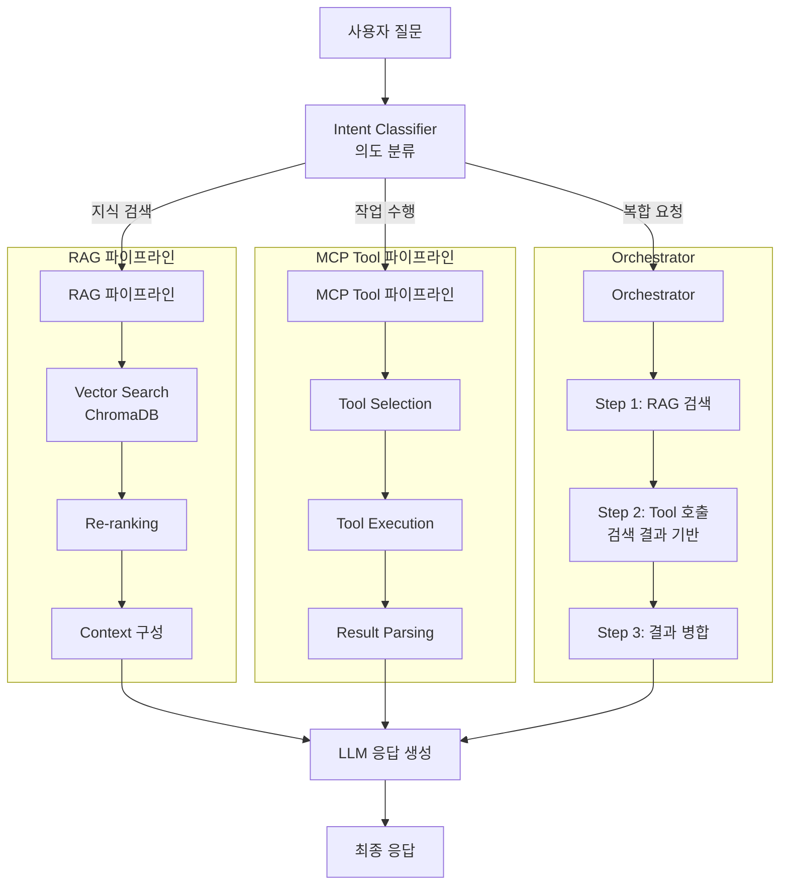
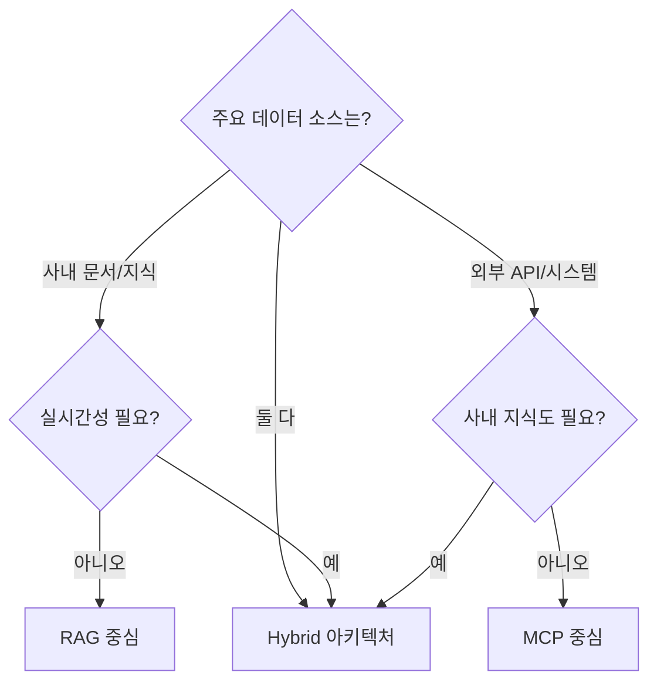
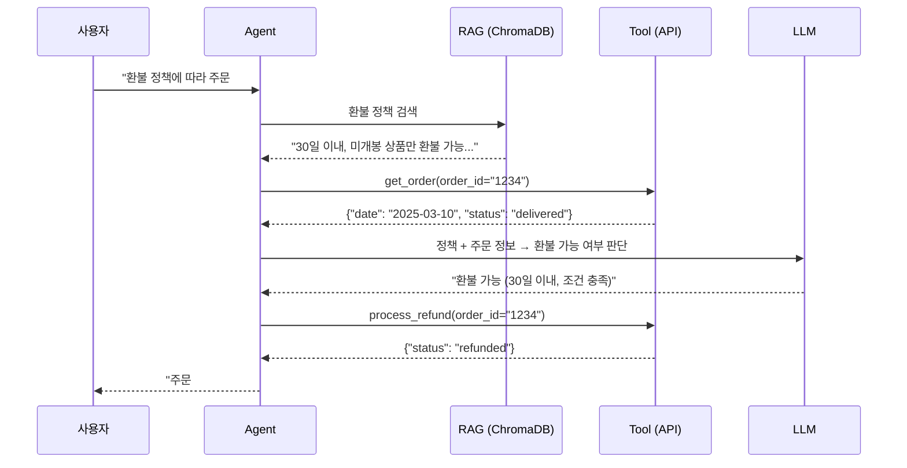
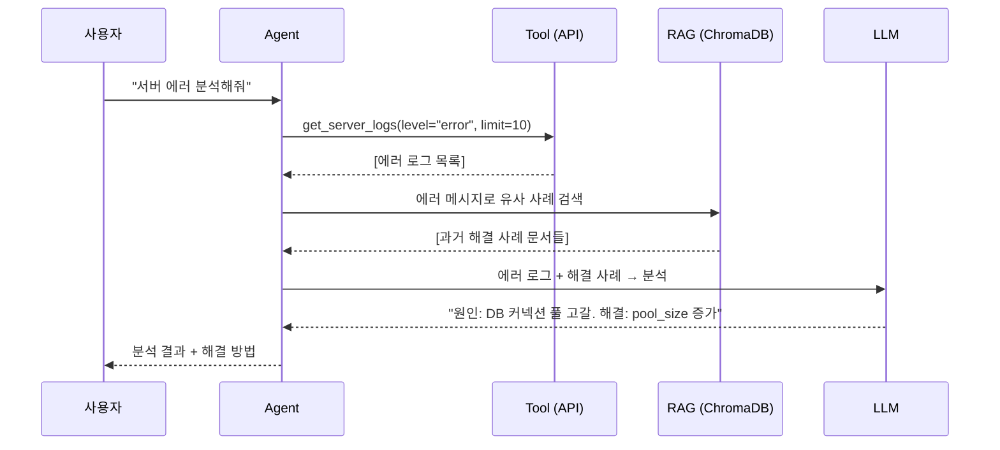
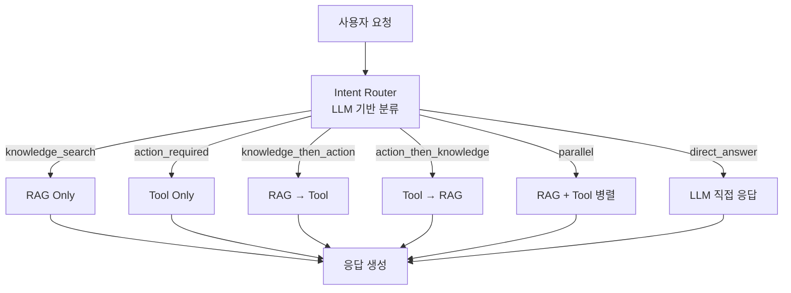

# Day 3 Session 4: Hybrid 아키텍처 설계 (2h)

## 1. 학습 목표

| 구분 | 내용 |
|------|------|
| **핵심 목표** | MCP(Tool) + RAG를 결합한 Hybrid 아키텍처를 설계하고 구현할 수 있다 |
| **세부 목표 1** | RAG 중심 / MCP 중심 / Hybrid 아키텍처의 선택 기준을 이해한다 |
| **세부 목표 2** | RAG-Then-Tool, Tool-Then-RAG, Router 기반 패턴을 구현할 수 있다 |
| **세부 목표 3** | 정확도, 비용, 확장성 Trade-off를 분석하고 최적의 아키텍처를 결정할 수 있다 |
| **실습 비중** | 이론 30% (약 35분) / 실습 70% (약 85분) |

---

## 2. Hybrid 아키텍처란

### 2.1 아키텍처 유형 비교

AI Agent 아키텍처는 크게 세 가지로 나눌 수 있다:

| 아키텍처 | 특징 | 적합한 상황 |
|---------|------|------------|
| **MCP 중심** | Tool 호출로 실시간 데이터 획득/작업 수행 | API 연동, CRUD, 실시간 정보 |
| **RAG 중심** | 벡터 검색으로 사내 지식 활용 | 문서 QA, 지식 검색, 고객 지원 |
| **Hybrid** | MCP + RAG를 상황에 따라 동적 선택 | 복합 업무, 엔터프라이즈 Agent |

### 2.2 Hybrid 아키텍처 다이어그램



### 2.3 선택 기준 플로우차트



---

## 3. 패턴 1: RAG -> Tool (검색 후 액션)

### 3.1 개념

사용자 질문에 먼저 RAG로 관련 지식을 검색하고, 검색 결과를 기반으로 필요한 Tool을 호출하는 패턴이다.

**적합한 시나리오:**
- "우리 회사 환불 정책에 따라 이 주문을 환불 처리해줘"
- 정책 문서를 검색(RAG) -> 조건 확인 -> 환불 API 호출(Tool)



### 3.2 구현 코드

```python
from openai import OpenAI
import chromadb
import json
import os


class RAGThenToolAgent:
    """RAG 검색 → Tool 실행 패턴"""

    def __init__(self):
        self.llm = OpenAI(api_key=os.environ.get("OPENAI_API_KEY"))
        self.db = chromadb.Client()
        self.collection = self.db.get_or_create_collection("policies")
        self.tools = self._define_tools()

    def _define_tools(self) -> list[dict]:
        return [
            {
                "type": "function",
                "function": {
                    "name": "get_order",
                    "description": "주문 ID로 주문 상세 정보를 조회합니다.",
                    "parameters": {
                        "type": "object",
                        "properties": {
                            "order_id": {
                                "type": "string",
                                "description": "주문 번호"
                            }
                        },
                        "required": ["order_id"],
                        "additionalProperties": False
                    }
                }
            },
            {
                "type": "function",
                "function": {
                    "name": "process_refund",
                    "description": "주문을 환불 처리합니다. 환불 정책 확인 후에만 호출하세요.",
                    "parameters": {
                        "type": "object",
                        "properties": {
                            "order_id": {"type": "string"},
                            "reason": {"type": "string", "description": "환불 사유"}
                        },
                        "required": ["order_id", "reason"],
                        "additionalProperties": False
                    }
                }
            }
        ]

    def run(self, query: str) -> str:
        """RAG → Tool 순서로 실행"""
        # Step 1: RAG로 관련 정책/지식 검색
        rag_results = self.collection.query(
            query_texts=[query],
            n_results=3
        )

        context = ""
        if rag_results["documents"][0]:
            context = "\n".join(rag_results["documents"][0])

        # Step 2: 정책 + 질문으로 Tool 호출 여부 결정
        system_prompt = f"""당신은 고객 지원 Agent입니다.

다음 회사 정책을 참고하여 고객 요청을 처리하세요:

---정책 문서---
{context}
---

정책에 명시된 조건을 반드시 확인한 후에 작업을 수행하세요.
정책에 어긋나는 요청은 정중히 거절하세요."""

        messages = [
            {"role": "system", "content": system_prompt},
            {"role": "user", "content": query}
        ]

        response = self.llm.chat.completions.create(
            model="gpt-4o",
            messages=messages,
            tools=self.tools,
            tool_choice="auto"
        )

        message = response.choices[0].message

        # Step 3: Tool 호출이 있으면 실행
        if message.tool_calls:
            messages.append(message)

            for tool_call in message.tool_calls:
                result = self._execute_tool(
                    tool_call.function.name,
                    json.loads(tool_call.function.arguments)
                )
                messages.append({
                    "role": "tool",
                    "tool_call_id": tool_call.id,
                    "content": json.dumps(result, ensure_ascii=False)
                })

            # Step 4: 최종 응답 생성
            final = self.llm.chat.completions.create(
                model="gpt-4o",
                messages=messages
            )
            return final.choices[0].message.content

        return message.content

    def _execute_tool(self, name: str, args: dict) -> dict:
        """Tool 실행 (실제로는 API 호출)"""
        if name == "get_order":
            # 시뮬레이션
            return {
                "order_id": args["order_id"],
                "date": "2025-03-10",
                "status": "delivered",
                "items": [{"name": "키보드", "price": 89000}],
                "total": 89000
            }
        elif name == "process_refund":
            return {"status": "refunded", "order_id": args["order_id"]}
        return {"error": f"Unknown tool: {name}"}
```

---

## 4. 패턴 2: Tool -> RAG (도구 결과를 컨텍스트로)

### 4.1 개념

먼저 Tool을 호출하여 실시간 데이터를 획득하고, 그 데이터를 RAG의 컨텍스트에 추가하여 더 정확한 응답을 생성하는 패턴이다.

**적합한 시나리오:**
- "현재 서버 에러 로그를 분석하고 해결 방법을 알려줘"
- 서버 로그 조회(Tool) -> 에러 패턴 매칭(RAG) -> 해결책 생성



### 4.2 구현 코드

```python
class ToolThenRAGAgent:
    """Tool 실행 → RAG 검색 패턴"""

    def __init__(self):
        self.llm = OpenAI(api_key=os.environ.get("OPENAI_API_KEY"))
        self.db = chromadb.Client()
        self.knowledge = self.db.get_or_create_collection("troubleshooting")

    def run(self, query: str) -> str:
        # Step 1: Tool로 실시간 데이터 획득
        live_data = self._fetch_live_data(query)

        # Step 2: 실시간 데이터를 키워드로 RAG 검색
        search_query = self._extract_search_keywords(live_data)

        rag_results = self.knowledge.query(
            query_texts=[search_query],
            n_results=5
        )

        knowledge_context = "\n".join(rag_results["documents"][0]) if rag_results["documents"][0] else ""

        # Step 3: 실시간 데이터 + 지식 베이스로 최종 분석
        response = self.llm.chat.completions.create(
            model="gpt-4o",
            messages=[
                {
                    "role": "system",
                    "content": (
                        "당신은 시스템 엔지니어입니다. "
                        "실시간 데이터와 과거 해결 사례를 기반으로 문제를 분석합니다."
                    )
                },
                {
                    "role": "user",
                    "content": (
                        f"사용자 요청: {query}\n\n"
                        f"--- 실시간 데이터 ---\n{json.dumps(live_data, ensure_ascii=False, indent=2)}\n\n"
                        f"--- 과거 해결 사례 ---\n{knowledge_context}\n\n"
                        "위 정보를 기반으로 문제를 분석하고 해결 방법을 제시하세요."
                    )
                }
            ]
        )

        return response.choices[0].message.content

    def _fetch_live_data(self, query: str) -> dict:
        """실시간 데이터 조회 (시뮬레이션)"""
        return {
            "server_logs": [
                {"time": "2025-03-17T10:30:00", "level": "ERROR", "message": "Connection pool exhausted"},
                {"time": "2025-03-17T10:30:05", "level": "ERROR", "message": "Database timeout after 30s"},
                {"time": "2025-03-17T10:30:10", "level": "WARN", "message": "Retry attempt 3/3 failed"},
            ],
            "metrics": {
                "cpu_usage": 85,
                "memory_usage": 72,
                "db_connections": "50/50",
                "response_time_p99": "12.5s"
            }
        }

    def _extract_search_keywords(self, data: dict) -> str:
        """실시간 데이터에서 검색 키워드 추출"""
        errors = [log["message"] for log in data.get("server_logs", []) if log["level"] == "ERROR"]
        return " ".join(errors)
```

---

## 5. 패턴 3: Router 기반 동적 선택

### 5.1 개념

사용자 요청을 분석하여 RAG, Tool, 또는 Hybrid 중 최적의 경로를 동적으로 선택하는 패턴이다. 가장 유연하지만 구현이 복잡하다.



### 5.2 LangGraph로 Router 구현

```python
from langgraph.graph import StateGraph, START, END
from typing import TypedDict, Literal
from openai import OpenAI
import chromadb
import json
import os


# ── State 정의 ───────────────────────────────────────────────
class AgentState(TypedDict):
    query: str
    intent: str
    rag_context: str
    tool_results: str
    final_answer: str


# ── 노드 함수들 ─────────────────────────────────────────────
llm_client = OpenAI(api_key=os.environ.get("OPENAI_API_KEY"))
db_client = chromadb.Client()
knowledge_collection = db_client.get_or_create_collection("knowledge")


def classify_intent(state: AgentState) -> AgentState:
    """사용자 의도를 분류"""
    response = llm_client.chat.completions.create(
        model="gpt-4o-mini",
        messages=[
            {
                "role": "system",
                "content": (
                    "사용자 요청의 의도를 분류하세요. "
                    "반드시 다음 중 하나만 JSON으로 반환:\n"
                    '{"intent": "knowledge_search"} - 지식/정보 검색\n'
                    '{"intent": "action_required"} - 작업 수행 필요\n'
                    '{"intent": "hybrid"} - 지식 검색 + 작업 수행 모두 필요\n'
                    '{"intent": "direct"} - Tool/검색 없이 직접 답변 가능'
                )
            },
            {"role": "user", "content": state["query"]}
        ],
        response_format={"type": "json_object"}
    )
    result = json.loads(response.choices[0].message.content)
    state["intent"] = result.get("intent", "direct")
    return state


def rag_search(state: AgentState) -> AgentState:
    """RAG 검색 수행"""
    results = knowledge_collection.query(
        query_texts=[state["query"]],
        n_results=5
    )

    if results["documents"][0]:
        state["rag_context"] = "\n\n".join(results["documents"][0])
    else:
        state["rag_context"] = "관련 문서를 찾지 못했습니다."

    return state


def tool_execution(state: AgentState) -> AgentState:
    """Tool 실행"""
    # Function Calling으로 Tool 선택 및 실행
    tools = [
        {
            "type": "function",
            "function": {
                "name": "get_current_data",
                "description": "실시간 데이터를 조회합니다.",
                "parameters": {
                    "type": "object",
                    "properties": {
                        "data_type": {
                            "type": "string",
                            "enum": ["weather", "stock", "news", "server_status"],
                            "description": "조회할 데이터 유형"
                        },
                        "query": {
                            "type": "string",
                            "description": "세부 조회 조건"
                        }
                    },
                    "required": ["data_type"],
                    "additionalProperties": False
                }
            }
        }
    ]

    response = llm_client.chat.completions.create(
        model="gpt-4o",
        messages=[{"role": "user", "content": state["query"]}],
        tools=tools,
        tool_choice="auto"
    )

    message = response.choices[0].message
    if message.tool_calls:
        results = []
        for tc in message.tool_calls:
            args = json.loads(tc.function.arguments)
            result = _simulate_tool(tc.function.name, args)
            results.append(f"{tc.function.name}: {json.dumps(result, ensure_ascii=False)}")
        state["tool_results"] = "\n".join(results)
    else:
        state["tool_results"] = ""

    return state


def generate_response(state: AgentState) -> AgentState:
    """최종 응답 생성"""
    context_parts = []
    if state.get("rag_context"):
        context_parts.append(f"검색된 지식:\n{state['rag_context']}")
    if state.get("tool_results"):
        context_parts.append(f"실시간 데이터:\n{state['tool_results']}")

    context = "\n\n".join(context_parts) if context_parts else "추가 컨텍스트 없음"

    response = llm_client.chat.completions.create(
        model="gpt-4o",
        messages=[
            {
                "role": "system",
                "content": (
                    "사용 가능한 정보를 기반으로 정확하게 답변하세요. "
                    "출처가 있으면 명시하세요."
                )
            },
            {
                "role": "user",
                "content": f"질문: {state['query']}\n\n{context}"
            }
        ]
    )
    state["final_answer"] = response.choices[0].message.content
    return state


def _simulate_tool(name: str, args: dict) -> dict:
    """Tool 시뮬레이션"""
    return {"status": "ok", "data": f"Simulated result for {name}({args})"}


# ── 라우팅 함수 ──────────────────────────────────────────────
def route_by_intent(state: AgentState) -> Literal["rag_search", "tool_execution", "hybrid_start", "generate_response"]:
    """의도에 따라 다음 노드 결정"""
    intent = state.get("intent", "direct")
    if intent == "knowledge_search":
        return "rag_search"
    elif intent == "action_required":
        return "tool_execution"
    elif intent == "hybrid":
        return "hybrid_start"
    else:
        return "generate_response"


# ── Graph 구성 ───────────────────────────────────────────────
def build_hybrid_graph() -> StateGraph:
    """Hybrid Agent 그래프 구성"""
    graph = StateGraph(AgentState)

    # 노드 추가
    graph.add_node("classify_intent", classify_intent)
    graph.add_node("rag_search", rag_search)
    graph.add_node("tool_execution", tool_execution)
    graph.add_node("generate_response", generate_response)

    # Hybrid: RAG → Tool 순서
    def hybrid_rag(state: AgentState) -> AgentState:
        return rag_search(state)

    def hybrid_tool(state: AgentState) -> AgentState:
        return tool_execution(state)

    graph.add_node("hybrid_start", hybrid_rag)
    graph.add_node("hybrid_tool", hybrid_tool)

    # 엣지 연결
    graph.add_edge(START, "classify_intent")
    graph.add_conditional_edges(
        "classify_intent",
        route_by_intent,
        {
            "rag_search": "rag_search",
            "tool_execution": "tool_execution",
            "hybrid_start": "hybrid_start",
            "generate_response": "generate_response"
        }
    )

    graph.add_edge("rag_search", "generate_response")
    graph.add_edge("tool_execution", "generate_response")
    graph.add_edge("hybrid_start", "hybrid_tool")
    graph.add_edge("hybrid_tool", "generate_response")
    graph.add_edge("generate_response", END)

    return graph.compile()


# ── 실행 예시 ────────────────────────────────────────────────
# agent = build_hybrid_graph()
# result = agent.invoke({
#     "query": "우리 회사 휴가 정책 알려주고, 내 남은 휴가 일수도 확인해줘",
#     "intent": "",
#     "rag_context": "",
#     "tool_results": "",
#     "final_answer": ""
# })
# print(result["final_answer"])
```

---

## 6. Trade-off 분석 프레임워크

### 6.1 정확도 / 비용 / 확장성 비교표

| 기준 | MCP 중심 | RAG 중심 | Hybrid |
|------|---------|---------|--------|
| **정확도** | 높음 (실시간 데이터) | 중상 (문서 품질 의존) | 최상 (상호 보완) |
| **Latency** | 낮음 (직접 호출) | 중간 (검색 + 생성) | 높음 (다단계) |
| **비용** | API 호출 비용 | 임베딩 + 저장 비용 | 양쪽 비용 합산 |
| **확장성** | Tool 추가 용이 | 문서 추가 용이 | 양쪽 확장 필요 |
| **유지보수** | Tool 스키마 관리 | 인덱스 업데이트 | 복합 관리 |
| **구현 복잡도** | 낮음 | 중간 | 높음 |

### 6.2 아키텍처 결정 매트릭스

다음 점수표로 프로젝트에 적합한 아키텍처를 결정할 수 있다:

| 질문 | MCP +1 | RAG +1 | Hybrid +1 |
|------|--------|--------|-----------|
| 실시간 데이터가 필수인가? | O | | O |
| 사내 문서 검색이 필요한가? | | O | O |
| 외부 시스템에 쓰기 작업이 있는가? | O | | O |
| 응답에 출처 인용이 필요한가? | | O | O |
| 사용자 요청이 다양한가? | | | O |
| Latency 요구가 엄격한가? | O | | |
| 개발 리소스가 제한적인가? | O | O | |

> **점수 해석**: 가장 높은 점수의 아키텍처를 선택. 동점이면 Hybrid가 유리 (확장성).

### 6.3 비용 산정 예시

```
시나리오: 일 10,000건 질문 처리 Agent

[MCP 중심]
- LLM 호출: 10,000 x $0.005 = $50/일
- API 호출: 10,000 x 1.5 Tool = 15,000 x $0.001 = $15/일
- 합계: ~$65/일 ($1,950/월)

[RAG 중심]
- 임베딩 (인덱싱): 월 1회 $5
- LLM 호출: 10,000 x $0.005 = $50/일
- 벡터 DB: $30/월 (관리형)
- 합계: ~$52/일 ($1,585/월)

[Hybrid]
- LLM 호출: 10,000 x $0.008 (라우팅 추가) = $80/일
- API 호출: 5,000 x $0.001 = $5/일  (50%만 Tool 필요)
- 벡터 DB: $30/월
- 합계: ~$86/일 ($2,610/월)
- 단, 정확도 향상으로 고객 만족도 증가 → 비용 대비 가치 높음
```

---

## 7. LangGraph로 Hybrid Agent 구현

Section 5에서 구현한 Router 기반 Hybrid Agent를 확장하여, 프로덕션 수준의 기능을 추가한다.

### 7.1 프로덕션 고려사항

```python
from langgraph.graph import StateGraph, START, END
from langgraph.checkpoint.memory import MemorySaver
from typing import TypedDict, Annotated
import operator


class ProductionAgentState(TypedDict):
    query: str
    intent: str
    rag_context: str
    tool_results: str
    final_answer: str
    # 프로덕션 추가 필드
    conversation_history: Annotated[list[dict], operator.add]
    error_log: Annotated[list[str], operator.add]
    metrics: dict


def with_error_handling(func):
    """에러 핸들링 데코레이터"""
    def wrapper(state: ProductionAgentState) -> ProductionAgentState:
        try:
            return func(state)
        except Exception as e:
            state["error_log"] = [f"{func.__name__}: {str(e)}"]
            return state
    return wrapper


@with_error_handling
def production_rag_search(state: ProductionAgentState) -> ProductionAgentState:
    """프로덕션 레벨 RAG 검색 (에러 핸들링, 메트릭 포함)"""
    import time
    start = time.time()

    results = knowledge_collection.query(
        query_texts=[state["query"]],
        n_results=5
    )

    elapsed = time.time() - start

    if results["documents"][0]:
        # Score Threshold 필터링
        filtered = []
        for doc, dist in zip(results["documents"][0], results["distances"][0]):
            if dist <= 0.7:  # cosine distance threshold
                filtered.append(doc)

        state["rag_context"] = "\n\n".join(filtered) if filtered else "관련 문서를 찾지 못했습니다."
    else:
        state["rag_context"] = "관련 문서를 찾지 못했습니다."

    state["metrics"] = {**state.get("metrics", {}), "rag_latency": elapsed}
    return state


def build_production_graph() -> StateGraph:
    """프로덕션 레벨 Hybrid Agent"""
    graph = StateGraph(ProductionAgentState)
    memory = MemorySaver()

    graph.add_node("classify", classify_intent)
    graph.add_node("rag", production_rag_search)
    graph.add_node("tool", tool_execution)
    graph.add_node("respond", generate_response)

    graph.add_edge(START, "classify")
    graph.add_conditional_edges(
        "classify",
        route_by_intent,
        {
            "rag_search": "rag",
            "tool_execution": "tool",
            "hybrid_start": "rag",
            "generate_response": "respond"
        }
    )

    graph.add_edge("rag", "respond")
    graph.add_edge("tool", "respond")
    graph.add_edge("respond", END)

    return graph.compile(checkpointer=memory)
```

---

## 8. 실습: Hybrid 구조 아키텍처 설계

> **실습 안내**: `labs/day3-hybrid-architecture/` 디렉토리로 이동하여 실습을 진행합니다.

### 실습 개요

| 단계 | 내용 | 시간 |
|------|------|------|
| **I DO** | Hybrid Agent 동작 시연 | 15분 |
| **WE DO** | 아키텍처 설계 토론 + 템플릿 작성 | 40분 |
| **YOU DO** | Hybrid Agent 구현 + 설계 문서 완성 | 30분 |

### I DO (강사 시연)

강사가 `src/hybrid_agent_template.py`를 실행하며 다음을 시연한다:
- LangGraph 기반 Hybrid Agent 동작 흐름
- Intent 분류 → RAG/Tool 라우팅 → 응답 생성
- 각 패턴(RAG->Tool, Tool->RAG, Router)의 차이 확인

### WE DO (함께 실습)

`artifacts/architecture-template.md`를 함께 작성한다:
- 주어진 시나리오에 적합한 아키텍처 선택
- Trade-off 분석 수행
- 컴포넌트 다이어그램 작성

### YOU DO (독립 과제)

1. `artifacts/architecture-template.md`를 자신의 프로젝트 시나리오에 맞게 완성
2. `src/hybrid_agent_template.py`를 확장하여 Hybrid Agent 구현
3. 3가지 유형의 테스트 쿼리로 Agent 동작 검증

> **참고**: `artifacts/example-architecture.md` (모범 설계 예시), `solution/hybrid_agent.py` (완성 코드)

---

## 핵심 요약

| 주제 | 핵심 포인트 |
|------|------------|
| **RAG -> Tool** | 지식 기반 의사결정 후 행동. 정책 준수형 Agent에 적합 |
| **Tool -> RAG** | 실시간 데이터 획득 후 지식으로 분석. 모니터링/트러블슈팅에 적합 |
| **Router 기반** | 가장 유연. LangGraph의 conditional_edges로 구현. 복합 요청 처리 |
| **Trade-off** | Hybrid는 정확도 최상이지만 비용/복잡도 증가. 결정 매트릭스로 판단 |
| **LangGraph** | StateGraph + conditional_edges + MemorySaver로 프로덕션 Agent 구현 |
