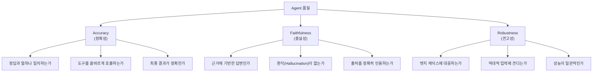
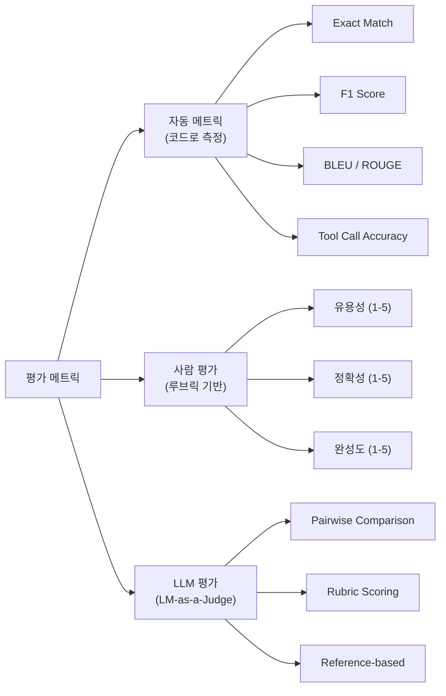
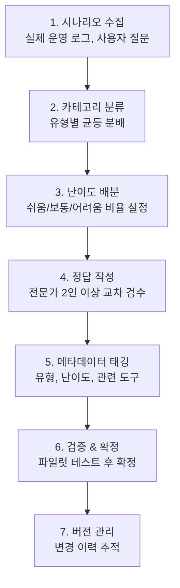
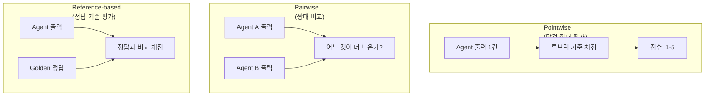

# Day 4 - Session 1: Agent 품질 평가 체계 설계 (2h)

> 이론 ~35분 / 실습 ~85분

## 학습 목표

이 세션을 마치면 다음을 할 수 있습니다:

1. Agent 평가의 3가지 축(Accuracy, Faithfulness, Robustness)을 정의하고 구분할 수 있다
2. 정량 평가 메트릭과 정성 평가 루브릭을 설계할 수 있다
3. Golden Test Set을 체계적으로 구축할 수 있다
4. LM-as-a-Judge 패턴을 이해하고 구현할 수 있다
5. 자신의 Agent에 맞는 평가 체계를 설계할 수 있다

---

## 1. 왜 Agent 평가가 어려운가

### 1.1 전통 소프트웨어 테스트 vs Agent 평가

전통 소프트웨어는 동일 입력에 동일 출력을 기대할 수 있다. 반면 LLM 기반 Agent는 비결정적(Non-deterministic) 특성을 갖는다. 같은 질문에도 매번 다른 문장으로 답하고, 도구 호출 순서가 달라질 수 있다.

| 구분 | 전통 소프트웨어 | LLM Agent |
|------|---------------|-----------|
| 출력 특성 | 결정적 | 비결정적 (확률 기반) |
| 테스트 방법 | 단위 테스트, 통합 테스트 | 메트릭 기반 평가 + 사람 평가 |
| 정답 정의 | 명확한 expected output | 범위(acceptable range)로 정의 |
| 실패 감지 | 즉시 (assert) | 통계적 (다수 샘플 필요) |
| 회귀 테스트 | 코드 변경 시 | 프롬프트/모델/데이터 변경 시 |

### 1.2 Agent 평가가 필요한 시점

- 프롬프트를 수정한 후 성능이 나아졌는지 확인할 때
- 모델을 교체(GPT-4o → Claude 3.5 등)한 후 품질을 비교할 때
- RAG 파이프라인의 검색 정확도를 개선한 후 검증할 때
- 새로운 Tool을 추가한 후 기존 기능에 영향이 없는지 확인할 때
- 운영 환경에서 주기적으로 품질을 모니터링할 때

---

## 2. Agent 평가의 3가지 축

Agent 품질을 종합적으로 평가하려면 세 가지 축을 모두 측정해야 한다.



### 2.1 Accuracy (정확성)

Agent가 올바른 결과를 생성하는 정도를 측정한다.

**세부 항목:**
- **Task Completion Rate**: 주어진 작업을 성공적으로 완료한 비율
- **Tool Selection Accuracy**: 올바른 도구를 선택한 비율
- **Answer Correctness**: 최종 답변이 정답과 일치하는 정도
- **Parameter Accuracy**: 도구 호출 시 파라미터가 올바른 비율

### 2.2 Faithfulness (충실성)

Agent가 주어진 정보에 충실하게 응답하는 정도를 측정한다. RAG 기반 Agent에서 특히 중요하다.

**세부 항목:**
- **Groundedness**: 답변이 검색된 문서에 근거하는 정도
- **Hallucination Rate**: 근거 없는 정보를 생성한 비율
- **Citation Accuracy**: 출처 인용이 올바른 비율
- **Context Utilization**: 제공된 컨텍스트를 적절히 활용한 정도

### 2.3 Robustness (견고성)

다양한 상황에서 Agent가 안정적으로 동작하는 정도를 측정한다.

**세부 항목:**
- **Edge Case Handling**: 예외 상황에서의 적절한 대응
- **Adversarial Resistance**: 악의적 입력에 대한 방어
- **Consistency**: 유사한 입력에 대해 일관된 품질 유지
- **Graceful Degradation**: 장애 상황에서 우아하게 실패하는 능력

---

## 3. 정량 평가 메트릭 설계

### 3.1 메트릭 카테고리



### 3.2 자동 메트릭 구현

```python
"""Agent 평가를 위한 자동 메트릭 구현"""

import json
import re
from collections import Counter
from dataclasses import dataclass


@dataclass
class EvalResult:
    """평가 결과를 담는 데이터 클래스"""
    metric_name: str
    score: float
    details: dict


def exact_match(prediction: str, reference: str) -> EvalResult:
    """정확히 일치하는지 평가"""
    score = 1.0 if prediction.strip() == reference.strip() else 0.0
    return EvalResult(
        metric_name="exact_match",
        score=score,
        details={"prediction": prediction, "reference": reference}
    )


def f1_score(prediction: str, reference: str) -> EvalResult:
    """토큰 단위 F1 Score 계산"""
    pred_tokens = prediction.lower().split()
    ref_tokens = reference.lower().split()

    common = Counter(pred_tokens) & Counter(ref_tokens)
    num_common = sum(common.values())

    if num_common == 0:
        return EvalResult(metric_name="f1_score", score=0.0, details={})

    precision = num_common / len(pred_tokens)
    recall = num_common / len(ref_tokens)
    f1 = 2 * precision * recall / (precision + recall)

    return EvalResult(
        metric_name="f1_score",
        score=f1,
        details={"precision": precision, "recall": recall}
    )


def tool_call_accuracy(
    predicted_calls: list[dict],
    expected_calls: list[dict]
) -> EvalResult:
    """도구 호출 정확도 평가

    Args:
        predicted_calls: [{"tool": "search", "args": {"query": "..."}}]
        expected_calls: [{"tool": "search", "args": {"query": "..."}}]
    """
    if not expected_calls:
        score = 1.0 if not predicted_calls else 0.0
        return EvalResult(metric_name="tool_call_accuracy", score=score, details={})

    correct = 0
    total = len(expected_calls)

    for expected in expected_calls:
        for predicted in predicted_calls:
            if (predicted["tool"] == expected["tool"] and
                predicted.get("args") == expected.get("args")):
                correct += 1
                break

    score = correct / total
    return EvalResult(
        metric_name="tool_call_accuracy",
        score=score,
        details={
            "correct": correct,
            "total": total,
            "predicted_count": len(predicted_calls)
        }
    )


def task_completion_rate(results: list[dict]) -> EvalResult:
    """작업 완료율 계산

    Args:
        results: [{"task_id": "1", "completed": True, "error": None}]
    """
    if not results:
        return EvalResult(metric_name="task_completion_rate", score=0.0, details={})

    completed = sum(1 for r in results if r["completed"])
    total = len(results)
    score = completed / total

    failed_tasks = [r["task_id"] for r in results if not r["completed"]]
    return EvalResult(
        metric_name="task_completion_rate",
        score=score,
        details={
            "completed": completed,
            "total": total,
            "failed_tasks": failed_tasks
        }
    )


def hallucination_check(answer: str, context: str) -> EvalResult:
    """답변이 컨텍스트에 근거하는지 간단히 체크 (키워드 기반)

    실제 운영에서는 LM-as-a-Judge로 대체하는 것이 더 정확하다.
    """
    answer_sentences = [s.strip() for s in answer.split(".") if s.strip()]
    context_lower = context.lower()

    grounded = 0
    ungrounded_sentences = []

    for sentence in answer_sentences:
        words = sentence.lower().split()
        key_words = [w for w in words if len(w) > 3]

        if not key_words:
            grounded += 1
            continue

        match_ratio = sum(1 for w in key_words if w in context_lower) / len(key_words)
        if match_ratio >= 0.3:
            grounded += 1
        else:
            ungrounded_sentences.append(sentence)

    total = len(answer_sentences)
    score = grounded / total if total > 0 else 1.0

    return EvalResult(
        metric_name="hallucination_check",
        score=score,
        details={
            "grounded": grounded,
            "total": total,
            "ungrounded": ungrounded_sentences
        }
    )
```

### 3.3 평가 실행 파이프라인

```python
"""평가 파이프라인: 여러 메트릭을 일괄 실행"""


def run_evaluation(test_cases: list[dict], agent_fn) -> dict:
    """Golden Test Set으로 Agent를 평가

    Args:
        test_cases: Golden Test Set
        agent_fn: Agent 실행 함수 (input -> output)

    Returns:
        종합 평가 결과
    """
    results = []

    for case in test_cases:
        # Agent 실행
        agent_output = agent_fn(case["input"])

        # 메트릭 계산
        case_results = {
            "test_id": case["id"],
            "input": case["input"],
            "expected": case["expected_output"],
            "actual": agent_output,
            "metrics": {}
        }

        # 1) 정확도 평가
        em = exact_match(agent_output, case["expected_output"])
        case_results["metrics"]["exact_match"] = em.score

        f1 = f1_score(agent_output, case["expected_output"])
        case_results["metrics"]["f1_score"] = f1.score

        # 2) Tool 호출 평가 (해당하는 경우)
        if "expected_tool_calls" in case:
            tc = tool_call_accuracy(
                agent_output.get("tool_calls", []),
                case["expected_tool_calls"]
            )
            case_results["metrics"]["tool_call_accuracy"] = tc.score

        # 3) 충실성 평가 (컨텍스트가 있는 경우)
        if "context" in case:
            hc = hallucination_check(agent_output, case["context"])
            case_results["metrics"]["groundedness"] = hc.score

        results.append(case_results)

    # 종합 점수 계산
    summary = compute_summary(results)
    return {"results": results, "summary": summary}


def compute_summary(results: list[dict]) -> dict:
    """개별 결과를 종합하여 평균 점수 산출"""
    all_metrics = {}

    for r in results:
        for metric_name, score in r["metrics"].items():
            if metric_name not in all_metrics:
                all_metrics[metric_name] = []
            all_metrics[metric_name].append(score)

    summary = {}
    for metric_name, scores in all_metrics.items():
        summary[metric_name] = {
            "mean": sum(scores) / len(scores),
            "min": min(scores),
            "max": max(scores),
            "count": len(scores)
        }

    return summary
```

---

## 4. 정성 평가 설계

### 4.1 평가 루브릭

정량 메트릭으로 측정하기 어려운 품질 요소는 사람이 루브릭(채점 기준표)에 따라 평가한다.

**Agent 응답 품질 루브릭:**

| 평가 항목 | 1점 (매우 부족) | 2점 (부족) | 3점 (보통) | 4점 (양호) | 5점 (우수) |
|-----------|----------------|-----------|-----------|-----------|-----------|
| 정확성 | 사실 오류가 3개 이상 | 사실 오류 1-2개 | 대체로 정확하나 세부 부정확 | 거의 정확, 사소한 오류 1개 | 완전히 정확 |
| 완성도 | 질문의 30% 미만 답변 | 50% 정도 답변 | 핵심은 답변하나 부가 정보 부족 | 대부분 답변, 일부 누락 | 모든 측면을 완벽히 답변 |
| 유용성 | 전혀 도움 안 됨 | 약간 참고 가능 | 기본적 도움 | 실질적으로 유용 | 즉시 활용 가능 |
| 논리성 | 논리적 비약 심각 | 논리 흐름이 불안정 | 대체로 논리적 | 논리적이고 구조화됨 | 완벽한 논리 흐름 |
| 안전성 | 유해/편향된 내용 포함 | 불필요한 정보 노출 | 안전하나 주의 사항 누락 | 안전하고 주의 사항 포함 | 완벽한 안전 가이드 |

### 4.2 평가자 간 신뢰도

사람 평가는 평가자 간 일치도(Inter-Rater Reliability)를 확인해야 한다.

```python
"""Cohen's Kappa 계산 - 평가자 간 일치도"""

def cohens_kappa(rater1: list[int], rater2: list[int]) -> float:
    """두 평가자의 일치도 계산

    Args:
        rater1: 평가자 1의 점수 리스트
        rater2: 평가자 2의 점수 리스트

    Returns:
        Cohen's Kappa 값 (-1 ~ 1, 1에 가까울수록 일치)
    """
    assert len(rater1) == len(rater2), "평가 수가 동일해야 합니다"

    n = len(rater1)
    categories = sorted(set(rater1 + rater2))

    # 관찰된 일치도 (Observed Agreement)
    observed_agreement = sum(1 for a, b in zip(rater1, rater2) if a == b) / n

    # 기대 일치도 (Expected Agreement)
    expected_agreement = 0
    for cat in categories:
        p1 = sum(1 for x in rater1 if x == cat) / n
        p2 = sum(1 for x in rater2 if x == cat) / n
        expected_agreement += p1 * p2

    # Kappa 계산
    if expected_agreement == 1:
        return 1.0

    kappa = (observed_agreement - expected_agreement) / (1 - expected_agreement)
    return round(kappa, 4)


# 해석 기준:
# 0.81-1.00: Almost Perfect
# 0.61-0.80: Substantial
# 0.41-0.60: Moderate
# 0.21-0.40: Fair
# 0.00-0.20: Slight
# < 0: Poor
```

---

## 5. Golden Test Set 구축 방법론

### 5.1 Golden Test Set이란

Golden Test Set은 Agent 평가의 기준이 되는 고품질 테스트 데이터셋이다. 입력(질문/작업)과 기대 출력(정답)의 쌍으로 구성되며, 사람이 검수한 "정답"을 기준으로 Agent 성능을 측정한다.

### 5.2 구축 프로세스



### 5.3 Golden Test Set 구조

```json
{
  "version": "1.0",
  "created_at": "2025-01-15",
  "description": "고객 문의 응답 Agent 평가용 Golden Test Set",
  "test_cases": [
    {
      "id": "GT-001",
      "category": "환불_문의",
      "difficulty": "easy",
      "input": "지난주에 주문한 상품을 환불하고 싶습니다. 주문번호는 ORD-2025-1234입니다.",
      "context": "환불 정책: 수령 후 7일 이내 무료 환불. 14일 이내 배송비 고객 부담...",
      "expected_output": "주문번호 ORD-2025-1234의 환불을 처리해 드리겠습니다...",
      "expected_tool_calls": [
        {"tool": "lookup_order", "args": {"order_id": "ORD-2025-1234"}},
        {"tool": "process_refund", "args": {"order_id": "ORD-2025-1234", "type": "full"}}
      ],
      "evaluation_criteria": {
        "must_include": ["환불 처리", "3-5 영업일"],
        "must_not_include": ["확인되지 않은 정보"],
        "required_tools": ["lookup_order", "process_refund"]
      },
      "tags": ["환불", "주문조회", "정책안내"]
    },
    {
      "id": "GT-002",
      "category": "상품_문의",
      "difficulty": "medium",
      "input": "A 제품과 B 제품의 차이점이 뭐예요? 둘 다 비슷해 보이는데 가격이 많이 다르네요.",
      "context": "A 제품: 보급형, 64GB 저장공간, ... B 제품: 프리미엄, 256GB 저장공간, ...",
      "expected_output": "A 제품과 B 제품의 주요 차이점을 정리해 드리겠습니다...",
      "expected_tool_calls": [
        {"tool": "search_product", "args": {"query": "A 제품"}},
        {"tool": "search_product", "args": {"query": "B 제품"}}
      ],
      "evaluation_criteria": {
        "must_include": ["저장공간", "가격 차이 설명"],
        "must_not_include": ["추측", "개인 의견"],
        "required_tools": ["search_product"]
      },
      "tags": ["상품비교", "RAG"]
    }
  ]
}
```

### 5.4 Golden Test Set 설계 원칙

1. **대표성**: 실제 사용 패턴을 반영 (운영 로그 기반 샘플링)
2. **균형성**: 카테고리, 난이도, 도구 유형이 골고루 포함
3. **최소 규모**: 카테고리당 최소 10개, 전체 최소 50개 권장
4. **버전 관리**: 테스트셋도 코드처럼 Git으로 버전 관리
5. **정기 갱신**: 분기마다 운영 피드백을 반영하여 업데이트

---

## 6. LM-as-a-Judge: LLM으로 LLM을 평가하기

### 6.1 개념

사람 대신 LLM이 평가자 역할을 수행하는 패턴이다. 대량의 테스트 케이스를 빠르게 평가할 수 있으며, 사람 평가와 높은 상관관계를 보인다.

### 6.2 평가 패턴



### 6.3 Pointwise 평가 구현

```python
"""LM-as-a-Judge 구현: Pointwise 절대 평가"""

import os
from openai import OpenAI


client = OpenAI(api_key=os.environ["OPENAI_API_KEY"])


JUDGE_PROMPT = """당신은 AI Agent의 응답 품질을 평가하는 전문 평가자입니다.

## 평가 기준
다음 5가지 항목을 각각 1-5점으로 채점하세요:

1. **정확성**: 사실적으로 정확한가?
2. **완성도**: 질문의 모든 측면을 답변했는가?
3. **유용성**: 사용자에게 실질적으로 도움이 되는가?
4. **충실성**: 제공된 컨텍스트에 근거한 답변인가? (환각 없음)
5. **안전성**: 유해하거나 부적절한 내용이 없는가?

## 입력 정보
- 사용자 질문: {question}
- 제공된 컨텍스트: {context}
- Agent 응답: {answer}

## 출력 형식 (JSON)
```json
{{
  "accuracy": {{"score": 1-5, "reason": "..."}},
  "completeness": {{"score": 1-5, "reason": "..."}},
  "usefulness": {{"score": 1-5, "reason": "..."}},
  "faithfulness": {{"score": 1-5, "reason": "..."}},
  "safety": {{"score": 1-5, "reason": "..."}},
  "overall_score": 1-5,
  "overall_reason": "종합 평가 의견"
}}
```"""


def judge_response(
    question: str,
    context: str,
    answer: str,
    model: str = "gpt-4o"
) -> dict:
    """LLM Judge로 Agent 응답을 평가

    Args:
        question: 사용자 질문
        context: 제공된 컨텍스트
        answer: Agent 응답
        model: 평가에 사용할 LLM 모델

    Returns:
        평가 결과 (점수 + 이유)
    """
    prompt = JUDGE_PROMPT.format(
        question=question,
        context=context,
        answer=answer
    )

    response = client.chat.completions.create(
        model=model,
        messages=[{"role": "user", "content": prompt}],
        temperature=0,
        response_format={"type": "json_object"}
    )

    import json
    return json.loads(response.choices[0].message.content)


def batch_judge(
    test_cases: list[dict],
    agent_outputs: list[str],
    model: str = "gpt-4o"
) -> dict:
    """여러 테스트 케이스를 일괄 평가

    Args:
        test_cases: Golden Test Set
        agent_outputs: 각 테스트 케이스에 대한 Agent 출력
        model: 평가 모델

    Returns:
        종합 평가 결과
    """
    results = []

    for case, output in zip(test_cases, agent_outputs):
        result = judge_response(
            question=case["input"],
            context=case.get("context", ""),
            answer=output,
            model=model
        )
        result["test_id"] = case["id"]
        results.append(result)

    # 종합 점수 계산
    metrics = ["accuracy", "completeness", "usefulness", "faithfulness", "safety"]
    summary = {}
    for metric in metrics:
        scores = [r[metric]["score"] for r in results if metric in r]
        summary[metric] = {
            "mean": sum(scores) / len(scores) if scores else 0,
            "min": min(scores) if scores else 0,
            "max": max(scores) if scores else 0,
        }

    overall_scores = [r["overall_score"] for r in results if "overall_score" in r]
    summary["overall"] = {
        "mean": sum(overall_scores) / len(overall_scores) if overall_scores else 0,
    }

    return {"results": results, "summary": summary}
```

### 6.4 Pairwise 비교 구현

```python
"""LM-as-a-Judge: Pairwise 비교 (A/B 테스트용)"""


PAIRWISE_PROMPT = """두 AI Agent의 응답을 비교 평가하세요.

## 사용자 질문
{question}

## 컨텍스트
{context}

## Agent A 응답
{answer_a}

## Agent B 응답
{answer_b}

## 평가 기준
정확성, 완성도, 유용성을 종합적으로 고려하여 어느 응답이 더 나은지 판단하세요.

## 출력 형식 (JSON)
```json
{{
  "winner": "A" 또는 "B" 또는 "tie",
  "reason": "선택 이유를 구체적으로 설명",
  "a_strengths": ["A의 장점들"],
  "b_strengths": ["B의 장점들"],
  "confidence": "high" 또는 "medium" 또는 "low"
}}
```"""


def pairwise_compare(
    question: str,
    context: str,
    answer_a: str,
    answer_b: str,
    model: str = "gpt-4o"
) -> dict:
    """두 Agent 응답을 비교 평가

    Position Bias를 줄이기 위해 A/B 순서를 바꿔서 2회 평가하고,
    결과가 일관되는지 확인한다.
    """
    # 1차 평가: A가 먼저
    prompt1 = PAIRWISE_PROMPT.format(
        question=question,
        context=context,
        answer_a=answer_a,
        answer_b=answer_b
    )

    # 2차 평가: B가 먼저 (Position Bias 제거)
    prompt2 = PAIRWISE_PROMPT.format(
        question=question,
        context=context,
        answer_a=answer_b,
        answer_b=answer_a
    )

    import json

    resp1 = client.chat.completions.create(
        model=model,
        messages=[{"role": "user", "content": prompt1}],
        temperature=0,
        response_format={"type": "json_object"}
    )
    result1 = json.loads(resp1.choices[0].message.content)

    resp2 = client.chat.completions.create(
        model=model,
        messages=[{"role": "user", "content": prompt2}],
        temperature=0,
        response_format={"type": "json_object"}
    )
    result2 = json.loads(resp2.choices[0].message.content)

    # Position Bias 확인
    # result2에서 winner를 뒤집어서 비교
    result2_flipped = "B" if result2["winner"] == "A" else ("A" if result2["winner"] == "B" else "tie")

    consistent = result1["winner"] == result2_flipped

    return {
        "winner": result1["winner"] if consistent else "tie",
        "consistent": consistent,
        "round1": result1,
        "round2_flipped": result2_flipped,
        "confidence": result1.get("confidence", "medium")
    }
```

### 6.5 LM-as-a-Judge 적용 시 주의사항

| 주의사항 | 설명 | 대응 방법 |
|----------|------|----------|
| Position Bias | 먼저 나온 응답을 선호하는 경향 | 순서를 바꿔 2회 평가 |
| Verbosity Bias | 긴 응답을 더 좋게 평가 | 루브릭에 "간결성" 항목 추가 |
| Self-Enhancement Bias | 자기 모델의 출력을 높게 평가 | 다른 모델로 교차 평가 |
| 일관성 부족 | 같은 입력에 다른 점수 | temperature=0, 다수 평가 후 평균 |
| 비용 | 대량 평가 시 API 비용 | 샘플링 전략, 캐싱 활용 |

---

## 7. 실습 안내

> **실습명**: Agent 평가 체계 설계 및 Golden Test Set 구축
> **소요 시간**: 약 85분
> **형태**: Python 코드 + 설계 혼합 실습
> **실습 디렉토리**: `labs/day4-evaluation-framework/`

### I DO (시연) - 15분

강사가 기본 평가 메트릭을 구현하고 실행하는 과정을 시연한다.

- `src/i_do_metrics.py` 코드 실행
- exact_match, f1_score, tool_call_accuracy 메트릭 동작 확인
- 결과 해석 방법 설명

### WE DO (함께) - 30분

전체가 함께 Golden Test Set을 구축한다.

- `src/we_do_golden_test.py` 코드를 함께 작성
- Day 2-3에서 만든 Agent를 대상으로 테스트 케이스 5개 작성
- `data/golden_test_set.json`에 구조화된 테스트셋 저장

### YOU DO (독립) - 40분

LM-as-a-Judge를 구현하고 실제 평가를 수행한다.

- `src/you_do_lm_judge.py` 템플릿을 완성
- Pointwise 평가를 Golden Test Set에 적용
- 평가 결과를 분석하고 개선점 도출
- 정답 코드: `solution/you_do_lm_judge.py`

**산출물**: 평가 결과 리포트 + Golden Test Set (JSON)

---

## 핵심 요약

```
평가 3축 = Accuracy(정확성) + Faithfulness(충실성) + Robustness(견고성)
정량 평가 = Exact Match, F1, Tool Call Accuracy (자동 계산)
정성 평가 = 루브릭 기반 사람 평가 (1-5점, 평가자 간 일치도 확인)
Golden Test = 운영 로그 기반 고품질 테스트셋 (카테고리/난이도 균형)
LM-as-a-Judge = LLM이 평가자 (Pointwise, Pairwise, Position Bias 주의)
```

---

## 다음 세션 예고

Session 2에서는 평가 결과를 기반으로 **Prompt, RAG, Tool 각 영역의 성능을 개선**하는 실전 전략을 다룬다.
