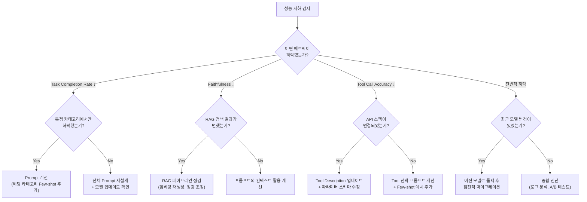
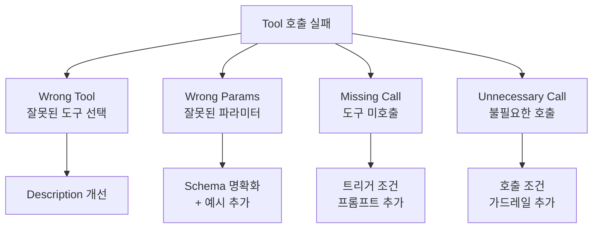
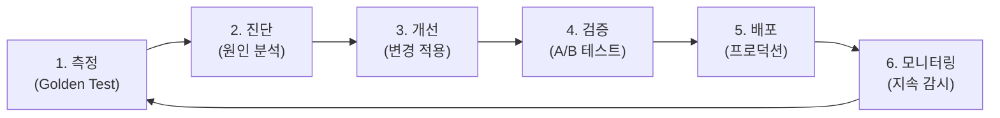

# Day 4 - Session 2: Prompt · RAG · Tool 성능 개선 전략 (2h)

> 이론 ~35분 / 실습 ~85분

## 학습 목표

이 세션을 마치면 다음을 할 수 있습니다:

1. Agent 성능 저하의 근본 원인을 체계적으로 진단할 수 있다
2. Prompt 버전 관리와 A/B 테스트를 구현할 수 있다
3. RAG의 Retrieval Drift를 감지하고 대응할 수 있다
4. Tool 호출 정확도를 개선하는 기법을 적용할 수 있다
5. 종합 성능 개선 파이프라인을 설계할 수 있다

---

## 1. 성능 저하 진단 프레임워크

### 1.1 Agent 성능 저하가 발생하는 이유

운영 중인 Agent의 성능은 시간이 지나면서 자연스럽게 저하된다. 주요 원인은 크게 4가지로 분류된다.

| 영역 | 저하 원인 | 증상 |
|------|----------|------|
| Prompt | 새로운 유형의 입력에 대응 못함 | 특정 카테고리에서 정확도 하락 |
| RAG | 문서 업데이트로 임베딩 불일치 | 관련 없는 문서가 검색됨 |
| Tool | API 스펙 변경, 새로운 도구 추가 | 도구 호출 실패, 파라미터 오류 |
| Model | LLM 업데이트로 행동 변화 | 전반적 품질 변화 (좋아지거나 나빠짐) |

### 1.2 진단 의사결정 트리



### 1.3 진단 자동화 코드

```python
"""Agent 성능 진단 자동화"""

import os
import json
from datetime import datetime, timedelta
from dataclasses import dataclass


@dataclass
class DiagnosisResult:
    """진단 결과"""
    area: str  # "prompt", "rag", "tool", "model"
    severity: str  # "critical", "warning", "info"
    message: str
    recommendation: str
    evidence: dict


def diagnose_performance(
    current_metrics: dict,
    baseline_metrics: dict,
    threshold: float = 0.05
) -> list[DiagnosisResult]:
    """성능 메트릭을 비교하여 저하 원인을 진단

    Args:
        current_metrics: 현재 측정된 메트릭
        baseline_metrics: 기준 메트릭 (이전 버전)
        threshold: 허용 하락 폭 (5%)

    Returns:
        진단 결과 목록
    """
    diagnoses = []

    for metric_name, current_value in current_metrics.items():
        baseline_value = baseline_metrics.get(metric_name)
        if baseline_value is None:
            continue

        drop = baseline_value - current_value

        if drop > threshold:
            severity = "critical" if drop > threshold * 2 else "warning"

            diagnosis = DiagnosisResult(
                area=_classify_area(metric_name),
                severity=severity,
                message=f"{metric_name} 하락: {baseline_value:.3f} → {current_value:.3f} ({drop:.3f} ↓)",
                recommendation=_get_recommendation(metric_name, drop),
                evidence={
                    "metric": metric_name,
                    "baseline": baseline_value,
                    "current": current_value,
                    "drop": drop
                }
            )
            diagnoses.append(diagnosis)

    return diagnoses


def _classify_area(metric_name: str) -> str:
    """메트릭 이름으로 영역 분류"""
    area_map = {
        "task_completion": "prompt",
        "exact_match": "prompt",
        "f1_score": "prompt",
        "groundedness": "rag",
        "hallucination": "rag",
        "retrieval_precision": "rag",
        "tool_call_accuracy": "tool",
        "parameter_accuracy": "tool",
    }
    for key, area in area_map.items():
        if key in metric_name:
            return area
    return "model"


def _get_recommendation(metric_name: str, drop: float) -> str:
    """메트릭별 개선 권고사항"""
    recommendations = {
        "task_completion": "카테고리별 성능 분석 후 약한 영역의 Few-shot 예시 보강",
        "exact_match": "출력 포맷 프롬프트 강화, 파싱 로직 점검",
        "f1_score": "프롬프트에 핵심 키워드 포함 지시 추가",
        "groundedness": "RAG 검색 결과 relevance score 임계값 조정",
        "hallucination": "컨텍스트 기반 답변 강제 프롬프트 추가",
        "retrieval_precision": "임베딩 모델 업데이트 또는 청킹 전략 재설계",
        "tool_call_accuracy": "Tool description 재작성, 파라미터 스키마 검증",
        "parameter_accuracy": "Tool 호출 Few-shot 예시 추가",
    }
    for key, rec in recommendations.items():
        if key in metric_name:
            return rec
    return "종합 진단 필요: 로그 분석 및 A/B 테스트 수행"
```

---

## 2. Prompt 버전 관리와 A/B 테스트

### 2.1 Prompt 버전 관리의 필요성

Prompt는 코드와 마찬가지로 버전 관리가 필요하다. 프롬프트 변경이 성능에 미치는 영향을 추적하고, 문제가 생기면 이전 버전으로 롤백할 수 있어야 한다.

### 2.2 Prompt Registry 구현

```python
"""Prompt 버전 관리 시스템"""

import os
import json
import hashlib
from datetime import datetime
from pathlib import Path


class PromptRegistry:
    """프롬프트 버전 관리 레지스트리

    프롬프트를 이름별로 관리하고, 변경 이력을 추적한다.
    """

    def __init__(self, storage_dir: str = "./prompt_registry"):
        self.storage_dir = Path(storage_dir)
        self.storage_dir.mkdir(parents=True, exist_ok=True)

    def register(
        self,
        name: str,
        template: str,
        description: str = "",
        metadata: dict = None
    ) -> dict:
        """새로운 프롬프트 버전을 등록

        Args:
            name: 프롬프트 이름 (예: "customer_support_v1")
            template: 프롬프트 템플릿 문자열
            description: 변경 설명
            metadata: 추가 메타데이터

        Returns:
            등록된 버전 정보
        """
        prompt_dir = self.storage_dir / name
        prompt_dir.mkdir(exist_ok=True)

        # 버전 번호 결정
        versions = self._get_versions(name)
        version = len(versions) + 1

        # 해시로 중복 체크
        content_hash = hashlib.sha256(template.encode()).hexdigest()[:12]
        for v in versions:
            if v.get("hash") == content_hash:
                return {"status": "duplicate", "existing_version": v["version"]}

        # 버전 정보 저장
        version_info = {
            "name": name,
            "version": version,
            "hash": content_hash,
            "template": template,
            "description": description,
            "metadata": metadata or {},
            "created_at": datetime.now().isoformat(),
            "is_active": False
        }

        version_file = prompt_dir / f"v{version}.json"
        with open(version_file, "w", encoding="utf-8") as f:
            json.dump(version_info, f, ensure_ascii=False, indent=2)

        return version_info

    def activate(self, name: str, version: int) -> dict:
        """특정 버전을 활성 버전으로 설정"""
        prompt_dir = self.storage_dir / name
        versions = self._get_versions(name)

        for v in versions:
            v["is_active"] = (v["version"] == version)
            version_file = prompt_dir / f"v{v['version']}.json"
            with open(version_file, "w", encoding="utf-8") as f:
                json.dump(v, f, ensure_ascii=False, indent=2)

        return {"name": name, "active_version": version}

    def get_active(self, name: str) -> str:
        """현재 활성 프롬프트 템플릿 반환"""
        versions = self._get_versions(name)
        for v in versions:
            if v.get("is_active"):
                return v["template"]
        # 활성 버전이 없으면 최신 버전 반환
        if versions:
            return versions[-1]["template"]
        raise ValueError(f"프롬프트 '{name}'이 등록되지 않았습니다")

    def get_history(self, name: str) -> list[dict]:
        """프롬프트 변경 이력 조회"""
        versions = self._get_versions(name)
        return [
            {
                "version": v["version"],
                "description": v["description"],
                "created_at": v["created_at"],
                "is_active": v["is_active"],
                "hash": v["hash"]
            }
            for v in versions
        ]

    def _get_versions(self, name: str) -> list[dict]:
        """모든 버전 로드"""
        prompt_dir = self.storage_dir / name
        if not prompt_dir.exists():
            return []

        versions = []
        for f in sorted(prompt_dir.glob("v*.json")):
            with open(f, encoding="utf-8") as fh:
                versions.append(json.load(fh))
        return versions
```

### 2.3 A/B 테스트 구현

```python
"""Prompt A/B 테스트 프레임워크"""

import os
import random
import json
from datetime import datetime
from openai import OpenAI


client = OpenAI(api_key=os.environ["OPENAI_API_KEY"])


class PromptABTest:
    """두 프롬프트 버전을 비교하는 A/B 테스트"""

    def __init__(
        self,
        prompt_a: str,
        prompt_b: str,
        test_name: str = "ab_test"
    ):
        self.prompt_a = prompt_a
        self.prompt_b = prompt_b
        self.test_name = test_name
        self.results = {"A": [], "B": []}

    def run(
        self,
        test_cases: list[dict],
        judge_fn=None,
        model: str = "gpt-4o"
    ) -> dict:
        """A/B 테스트 실행

        Args:
            test_cases: [{"input": "...", "expected": "..."}]
            judge_fn: 평가 함수 (없으면 기본 LLM Judge 사용)
            model: LLM 모델

        Returns:
            A/B 테스트 결과 요약
        """
        for case in test_cases:
            # 두 버전 모두 실행
            output_a = self._run_prompt(self.prompt_a, case["input"], model)
            output_b = self._run_prompt(self.prompt_b, case["input"], model)

            # 평가
            if judge_fn:
                score_a = judge_fn(case, output_a)
                score_b = judge_fn(case, output_b)
            else:
                score_a = self._default_judge(case, output_a, model)
                score_b = self._default_judge(case, output_b, model)

            self.results["A"].append({
                "input": case["input"],
                "output": output_a,
                "score": score_a
            })
            self.results["B"].append({
                "input": case["input"],
                "output": output_b,
                "score": score_b
            })

        return self._summarize()

    def _run_prompt(self, prompt_template: str, user_input: str, model: str) -> str:
        """프롬프트 실행"""
        response = client.chat.completions.create(
            model=model,
            messages=[
                {"role": "system", "content": prompt_template},
                {"role": "user", "content": user_input}
            ],
            temperature=0
        )
        return response.choices[0].message.content

    def _default_judge(self, case: dict, output: str, model: str) -> float:
        """기본 LLM Judge: 0-1 점수"""
        judge_prompt = f"""다음 응답의 품질을 0.0 ~ 1.0 점수로 평가하세요.

질문: {case['input']}
기대 답변: {case.get('expected', '없음')}
실제 답변: {output}

JSON으로 응답: {{"score": 0.0~1.0, "reason": "..."}}"""

        response = client.chat.completions.create(
            model=model,
            messages=[{"role": "user", "content": judge_prompt}],
            temperature=0,
            response_format={"type": "json_object"}
        )
        result = json.loads(response.choices[0].message.content)
        return result["score"]

    def _summarize(self) -> dict:
        """A/B 테스트 결과 요약"""
        scores_a = [r["score"] for r in self.results["A"]]
        scores_b = [r["score"] for r in self.results["B"]]

        mean_a = sum(scores_a) / len(scores_a) if scores_a else 0
        mean_b = sum(scores_b) / len(scores_b) if scores_b else 0

        # 승패 판정
        wins_a = sum(1 for a, b in zip(scores_a, scores_b) if a > b)
        wins_b = sum(1 for a, b in zip(scores_a, scores_b) if b > a)
        ties = sum(1 for a, b in zip(scores_a, scores_b) if a == b)

        winner = "A" if mean_a > mean_b else ("B" if mean_b > mean_a else "tie")
        improvement = ((mean_b - mean_a) / mean_a * 100) if mean_a > 0 else 0

        return {
            "test_name": self.test_name,
            "total_cases": len(scores_a),
            "version_a": {"mean_score": round(mean_a, 4), "wins": wins_a},
            "version_b": {"mean_score": round(mean_b, 4), "wins": wins_b},
            "ties": ties,
            "winner": winner,
            "improvement_pct": round(improvement, 2),
            "recommendation": self._get_recommendation(winner, abs(improvement))
        }

    def _get_recommendation(self, winner: str, improvement: float) -> str:
        """결과 기반 권고"""
        if winner == "tie" or improvement < 2:
            return "유의미한 차이 없음. 추가 테스트 케이스로 재검증 권장."
        elif improvement < 5:
            return f"Version {winner}가 소폭 우세. 더 많은 테스트 케이스로 검증 필요."
        else:
            return f"Version {winner}가 명확히 우세 ({improvement:.1f}% 개선). 배포 권장."
```

---

## 3. RAG 성능 저하: Retrieval Drift 진단 및 대응

### 3.1 Retrieval Drift란

시간이 지남에 따라 RAG의 검색 품질이 저하되는 현상이다. 문서가 업데이트되었지만 임베딩은 갱신되지 않았거나, 사용자 질문의 패턴이 변화하면서 발생한다.

### 3.2 Drift 유형

| Drift 유형 | 원인 | 증상 | 대응 |
|-----------|------|------|------|
| Document Drift | 원본 문서 내용 변경 | 오래된 정보로 답변 | 임베딩 재생성 스케줄링 |
| Query Drift | 사용자 질문 패턴 변화 | 검색 결과 relevance 하락 | 쿼리 분석 + 임베딩 모델 재학습 |
| Index Drift | 인덱스 크기 증가로 노이즈 | 정밀도(precision) 하락 | 인덱스 정리, 필터링 개선 |
| Embedding Drift | 임베딩 모델 변경/업데이트 | 기존 벡터와 호환성 저하 | 전체 재인덱싱 |

### 3.3 Retrieval Drift 감지 코드

```python
"""RAG Retrieval Drift 감지 및 대응"""

import os
import json
from datetime import datetime
from dataclasses import dataclass


@dataclass
class DriftReport:
    """Drift 감지 결과"""
    drift_type: str
    severity: float  # 0.0 ~ 1.0
    affected_queries: list[str]
    recommendation: str


def detect_retrieval_drift(
    golden_queries: list[dict],
    current_retrieval_fn,
    baseline_results: list[dict],
    relevance_threshold: float = 0.7
) -> list[DriftReport]:
    """Retrieval Drift를 감지

    Args:
        golden_queries: [{"query": "...", "expected_doc_ids": ["doc1", "doc2"]}]
        current_retrieval_fn: 현재 검색 함수 (query -> results)
        baseline_results: 이전에 저장된 검색 결과
        relevance_threshold: relevance score 임계값

    Returns:
        Drift 감지 결과 목록
    """
    drifts = []
    affected = []

    for i, golden in enumerate(golden_queries):
        query = golden["query"]
        expected_ids = set(golden["expected_doc_ids"])

        # 현재 검색 실행
        current_results = current_retrieval_fn(query)
        current_ids = set(r["doc_id"] for r in current_results[:5])

        # 이전 결과와 비교
        baseline = baseline_results[i] if i < len(baseline_results) else {}
        baseline_ids = set(baseline.get("retrieved_doc_ids", []))

        # Recall 계산
        recall = len(current_ids & expected_ids) / len(expected_ids) if expected_ids else 1.0

        # Stability 계산 (이전 결과 대비 변화)
        if baseline_ids:
            stability = len(current_ids & baseline_ids) / len(baseline_ids)
        else:
            stability = 1.0

        if recall < relevance_threshold:
            affected.append({
                "query": query,
                "recall": recall,
                "stability": stability,
                "missing_docs": list(expected_ids - current_ids)
            })

    if affected:
        avg_recall = sum(a["recall"] for a in affected) / len(affected)
        severity = 1.0 - avg_recall

        drifts.append(DriftReport(
            drift_type="retrieval_quality",
            severity=severity,
            affected_queries=[a["query"] for a in affected],
            recommendation=_drift_recommendation(severity, affected)
        ))

    return drifts


def _drift_recommendation(severity: float, affected: list[dict]) -> str:
    """심각도에 따른 대응 권고"""
    if severity > 0.5:
        return (
            "심각한 Retrieval Drift 감지. "
            "즉시 조치 필요:\n"
            "1. 임베딩 재생성\n"
            "2. 청킹 전략 재검토\n"
            "3. 쿼리 변환(Query Rewriting) 도입 검토"
        )
    elif severity > 0.2:
        return (
            "경미한 Drift 감지. "
            "다음 조치 권장:\n"
            "1. 영향받는 문서의 임베딩 부분 갱신\n"
            "2. relevance threshold 재조정"
        )
    else:
        return "모니터링 유지. 현재 수준은 허용 범위 내."


def schedule_reindex(
    drift_reports: list[DriftReport],
    auto_threshold: float = 0.5
) -> dict:
    """Drift 심각도에 따라 재인덱싱 스케줄 결정"""
    max_severity = max((d.severity for d in drift_reports), default=0)

    if max_severity > auto_threshold:
        return {
            "action": "immediate_reindex",
            "priority": "high",
            "scope": "full",
            "reason": f"심각도 {max_severity:.2f} - 즉시 전체 재인덱싱 필요"
        }
    elif max_severity > 0.2:
        return {
            "action": "scheduled_reindex",
            "priority": "medium",
            "scope": "partial",
            "reason": f"심각도 {max_severity:.2f} - 주말 부분 재인덱싱 권장"
        }
    else:
        return {
            "action": "monitor",
            "priority": "low",
            "scope": "none",
            "reason": f"심각도 {max_severity:.2f} - 정상 범위, 모니터링 유지"
        }
```

---

## 4. Tool 호출 정확도 개선 전략

### 4.1 Tool 호출 실패 유형



### 4.2 Tool Description 개선

```python
"""Tool Description 개선 전후 비교"""

# BAD: 모호한 Description
bad_tools = [
    {
        "type": "function",
        "function": {
            "name": "search",
            "description": "검색합니다",
            "parameters": {
                "type": "object",
                "properties": {
                    "query": {"type": "string"}
                }
            }
        }
    }
]

# GOOD: 명확한 Description + 예시
good_tools = [
    {
        "type": "function",
        "function": {
            "name": "search_knowledge_base",
            "description": (
                "회사 내부 지식 베이스에서 문서를 검색합니다. "
                "제품 사양, 환불 정책, FAQ 등의 정보를 찾을 때 사용합니다. "
                "고객의 질문에 답변하기 위해 관련 문서가 필요할 때 반드시 이 도구를 먼저 호출하세요. "
                "예시 쿼리: '환불 정책', 'A 제품 배터리 사양', '배송 추적 방법'"
            ),
            "parameters": {
                "type": "object",
                "properties": {
                    "query": {
                        "type": "string",
                        "description": "검색할 키워드 또는 자연어 질문. 구체적일수록 정확한 결과를 반환합니다."
                    },
                    "category": {
                        "type": "string",
                        "enum": ["product", "policy", "faq", "all"],
                        "description": "검색 범위를 특정 카테고리로 제한. 기본값 'all'"
                    },
                    "top_k": {
                        "type": "integer",
                        "description": "반환할 최대 문서 수 (기본값: 3, 최대: 10)"
                    }
                },
                "required": ["query"]
            }
        }
    }
]
```

### 4.3 Tool Description 품질 체크리스트

| 항목 | 체크 | 설명 |
|------|------|------|
| 목적 명시 | `[  ]` | "무엇을 위해" 사용하는 도구인지 첫 문장에 |
| 사용 시점 | `[  ]` | "언제" 호출해야 하는지 조건 명시 |
| 파라미터 설명 | `[  ]` | 각 파라미터의 용도와 제약 조건 |
| 예시 포함 | `[  ]` | 대표적인 호출 예시 1-2개 |
| 반환값 설명 | `[  ]` | 도구가 무엇을 반환하는지 |
| 제한 사항 | `[  ]` | 이 도구로 할 수 없는 것 |

### 4.4 Few-shot 예시를 통한 개선

```python
"""Tool 호출 Few-shot 예시로 정확도 개선"""

SYSTEM_PROMPT_WITH_EXAMPLES = """당신은 고객 지원 Agent입니다.

## 사용 가능한 도구
- search_knowledge_base: 지식 베이스 검색
- lookup_order: 주문 조회
- process_refund: 환불 처리

## 도구 호출 예시

### 예시 1: 상품 문의
사용자: "무선 이어폰 배터리 수명이 어떻게 되나요?"
→ search_knowledge_base(query="무선 이어폰 배터리 수명 사양", category="product")

### 예시 2: 주문 확인 후 환불
사용자: "ORD-1234 주문을 환불하고 싶어요"
→ lookup_order(order_id="ORD-1234")
→ [주문 정보 확인 후]
→ process_refund(order_id="ORD-1234", type="full", reason="customer_request")

### 예시 3: 정책 문의 (도구 호출 불필요한 경우도 있음)
사용자: "영업시간이 언제예요?"
→ search_knowledge_base(query="영업시간 운영시간", category="faq")
"""
```

---

## 5. 종합 성능 개선 파이프라인

### 5.1 개선 사이클



### 5.2 개선 우선순위 매트릭스

개선 효과와 구현 난이도로 우선순위를 결정한다.

```
            높은 효과
               │
    ┌──────────┼──────────┐
    │ Quick Win │  Major   │
    │          │ Project  │
    │ Prompt   │          │
    │ 개선     │ RAG 재설계│
    │──────────┼──────────│
    │ Low      │ Money    │
    │ Priority │ Pit      │
    │          │          │
    │ 포맷 조정 │ 모델 교체 │
    └──────────┼──────────┘
               │
            낮은 효과
  낮은 난이도        높은 난이도
```

**개선 순서 권장:**
1. Quick Win: Prompt 문구 수정, Few-shot 추가 (1-2시간)
2. Quick Win: Tool Description 개선 (2-4시간)
3. Major: RAG 청킹 전략 변경, 임베딩 모델 교체 (1-2일)
4. Major: 전체 파이프라인 아키텍처 변경 (1주+)

### 5.3 개선 효과 측정 자동화

```python
"""성능 개선 전후 비교 리포트 생성"""


def generate_improvement_report(
    before_metrics: dict,
    after_metrics: dict,
    change_description: str
) -> str:
    """개선 전후 비교 리포트 생성

    Args:
        before_metrics: 개선 전 메트릭
        after_metrics: 개선 후 메트릭
        change_description: 어떤 변경을 적용했는지

    Returns:
        마크다운 형식 리포트
    """
    report_lines = [
        "# 성능 개선 리포트",
        f"**변경 내용**: {change_description}",
        f"**측정 일시**: {datetime.now().isoformat()}",
        "",
        "## 메트릭 비교",
        "",
        "| 메트릭 | Before | After | 변화 | 판정 |",
        "|--------|--------|-------|------|------|",
    ]

    overall_improved = 0
    overall_degraded = 0

    for metric in sorted(set(list(before_metrics.keys()) + list(after_metrics.keys()))):
        before = before_metrics.get(metric, "N/A")
        after = after_metrics.get(metric, "N/A")

        if isinstance(before, (int, float)) and isinstance(after, (int, float)):
            change = after - before
            pct = (change / before * 100) if before != 0 else 0
            direction = "+" if change > 0 else ""
            verdict = "개선" if change > 0.01 else ("저하" if change < -0.01 else "유지")

            if change > 0.01:
                overall_improved += 1
            elif change < -0.01:
                overall_degraded += 1

            report_lines.append(
                f"| {metric} | {before:.4f} | {after:.4f} | "
                f"{direction}{change:.4f} ({direction}{pct:.1f}%) | {verdict} |"
            )
        else:
            report_lines.append(f"| {metric} | {before} | {after} | - | - |")

    report_lines.extend([
        "",
        "## 종합 판정",
        f"- 개선된 메트릭: {overall_improved}개",
        f"- 저하된 메트릭: {overall_degraded}개",
    ])

    if overall_degraded == 0 and overall_improved > 0:
        report_lines.append("- **판정: 배포 승인**")
    elif overall_degraded > 0:
        report_lines.append("- **판정: 저하된 메트릭 원인 분석 후 재검토 필요**")
    else:
        report_lines.append("- **판정: 유의미한 변화 없음. 추가 개선 필요**")

    return "\n".join(report_lines)
```

---

## 6. 실습 안내

> **실습명**: Agent 성능 분석 및 개선
> **소요 시간**: 약 85분
> **형태**: Python 코드 실습
> **실습 디렉토리**: `labs/day4-performance-tuning/`

### I DO (시연) - 15분

강사가 성능 저하 진단 코드를 실행하고 원인을 분석하는 과정을 시연한다.

- `src/i_do_diagnosis.py` 실행
- 메트릭 비교를 통한 저하 원인 식별
- 진단 결과 해석 방법 설명

### WE DO (함께) - 30분

전체가 함께 Prompt 버전 관리와 A/B 테스트를 구현한다.

- `src/we_do_prompt_versioning.py` 코드를 함께 작성
- PromptRegistry에 프롬프트 2개 버전 등록
- A/B 테스트 실행 및 결과 분석

### YOU DO (독립) - 40분

종합 성능 개선 파이프라인을 완성한다.

- `src/you_do_optimization.py` 템플릿을 완성
- 진단 → 개선 → A/B 테스트 → 리포트 생성 전체 파이프라인 구현
- 자신의 Agent에 적용하여 실제 개선 결과 확인
- 정답 코드: `solution/you_do_optimization.py`

**산출물**: 성능 개선 리포트 (Before/After 비교)

---

## 핵심 요약

```
진단 = 메트릭 비교 → 의사결정 트리 → 원인 특정 → 대응 선택
Prompt = 버전 관리(Registry) + A/B 테스트로 개선 검증
RAG = Retrieval Drift 감지 → 재인덱싱 스케줄링
Tool = Description 개선 + Few-shot 예시 + Schema 명확화
파이프라인 = 측정 → 진단 → 개선 → 검증 → 배포 → 모니터링 (반복)
```

---

## 다음 세션 예고

Session 3에서는 Agent 운영의 핵심인 **로그, 모니터링, 장애 대응 체계**를 LangSmith를 활용하여 설계한다.
