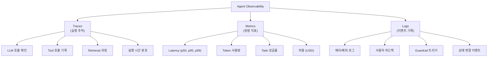
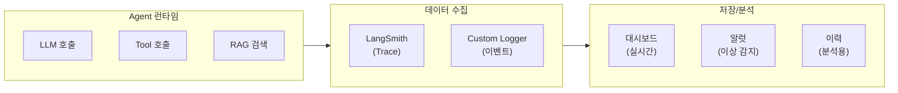
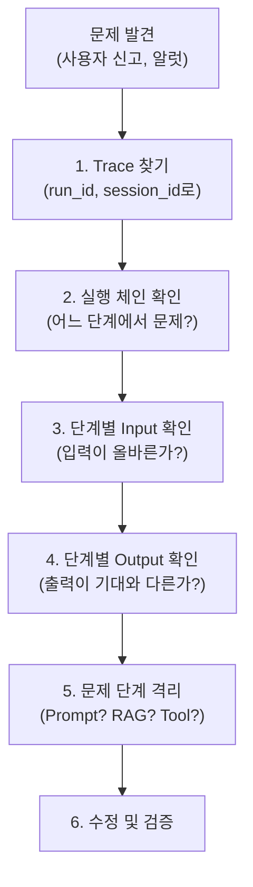
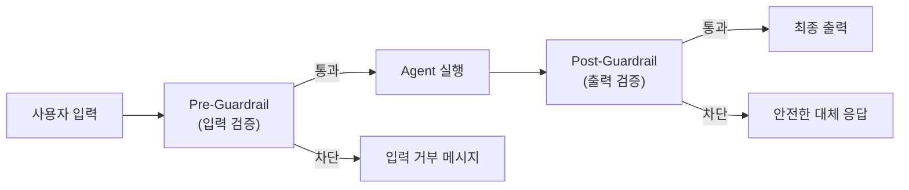

# Day 4 - Session 3: 로그 · 모니터링 · 장애 대응 설계 (2h)

> 이론 ~35분 / 실습 ~85분

## 학습 목표

이 세션을 마치면 다음을 할 수 있습니다:

1. Agent Observability의 전체 구조를 설계할 수 있다
2. LangSmith를 활용하여 Trace 로그를 수집하고 분석할 수 있다
3. Root Cause 분석 프로세스를 적용할 수 있다
4. Agent 실패 유형을 분류하고 대응 전략을 수립할 수 있다
5. Guardrail Layer를 설계하고 구현할 수 있다

---

## 1. Agent Observability 전체 구조

### 1.1 왜 Observability가 중요한가

전통적인 소프트웨어의 모니터링은 에러 로그와 응답 시간 정도면 충분했다. 그러나 LLM Agent는 내부 추론 과정이 블랙박스이므로, 단순 에러 로그만으로는 문제의 원인을 파악할 수 없다.

| 전통 소프트웨어 | LLM Agent |
|---------------|-----------|
| 에러 로그만 확인 | 전체 추론 Trace 필요 |
| Input/Output 비교 | 중간 단계별 결과 확인 필요 |
| 결정적 실행 | 비결정적 → 통계적 모니터링 |
| 코드 디버깅 | 프롬프트 + 도구 + 모델 종합 디버깅 |

### 1.2 Observability 3 Pillars for Agent



### 1.3 Agent Observability 아키텍처



---

## 2. LangSmith Trace 로그 설계 및 활용

### 2.1 LangSmith 기본 설정

```python
"""LangSmith 기본 설정 및 Trace 수집"""

import os

# LangSmith 환경 변수 설정
os.environ["LANGSMITH_API_KEY"] = os.environ.get("LANGSMITH_API_KEY", "")
os.environ["LANGSMITH_PROJECT"] = "ai-agent-monitoring"
os.environ["LANGSMITH_TRACING"] = "true"
```

### 2.2 LangSmith Trace 자동 수집 (LangChain 통합)

LangChain/LangGraph를 사용하면 LangSmith Trace가 자동으로 수집된다. 환경 변수만 설정하면 별도 코드 없이 모든 LLM 호출, Tool 호출, Chain 실행이 Trace로 기록된다.

```python
"""LangChain + LangSmith 자동 Trace 예제"""

import os
from langchain_openai import ChatOpenAI
from langchain_core.messages import HumanMessage, SystemMessage

# LangSmith 환경 변수가 설정되어 있으면 자동 Trace
os.environ["LANGSMITH_TRACING"] = "true"
os.environ["LANGSMITH_PROJECT"] = "agent-monitoring-demo"

llm = ChatOpenAI(
    model="gpt-4o",
    api_key=os.environ["OPENAI_API_KEY"],
    temperature=0
)

# 이 호출은 자동으로 LangSmith에 Trace로 기록됨
response = llm.invoke([
    SystemMessage(content="당신은 유용한 AI 어시스턴트입니다."),
    HumanMessage(content="Python의 GIL에 대해 간단히 설명해줘")
])

print(response.content)
```

### 2.3 커스텀 Trace 데코레이터

LangChain 외부의 함수도 `@traceable` 데코레이터로 Trace에 포함시킬 수 있다.

```python
"""langsmith @traceable 데코레이터로 커스텀 Trace"""

import os
from langsmith import traceable
from langchain_openai import ChatOpenAI
from langchain_core.messages import HumanMessage, SystemMessage


llm = ChatOpenAI(
    model="gpt-4o",
    api_key=os.environ["OPENAI_API_KEY"],
    temperature=0
)


@traceable(name="validate_input", run_type="chain")
def validate_input(user_input: str) -> dict:
    """사용자 입력 유효성 검사 - Trace에 기록됨"""
    issues = []

    if not user_input.strip():
        issues.append("빈 입력")
    if len(user_input) > 10000:
        issues.append("입력 길이 초과")

    return {
        "is_valid": len(issues) == 0,
        "issues": issues,
        "sanitized_input": user_input.strip()[:10000]
    }


@traceable(name="search_documents", run_type="retriever")
def search_documents(query: str) -> list[dict]:
    """문서 검색 - Trace에 retriever 타입으로 기록됨"""
    # 실제로는 ChromaDB 등에서 검색
    return [
        {"content": "Python GIL은 Global Interpreter Lock의 약자로...", "score": 0.95},
        {"content": "GIL은 멀티스레딩 성능에 영향을...", "score": 0.87}
    ]


@traceable(name="generate_response", run_type="llm")
def generate_response(query: str, context: list[dict]) -> str:
    """응답 생성 - Trace에 LLM 타입으로 기록됨"""
    context_text = "\n".join(doc["content"] for doc in context)

    response = llm.invoke([
        SystemMessage(content=f"다음 컨텍스트를 참고하여 답변하세요:\n{context_text}"),
        HumanMessage(content=query)
    ])

    return response.content


@traceable(name="agent_pipeline", run_type="chain")
def run_agent(user_input: str) -> dict:
    """Agent 전체 파이프라인 - 최상위 Trace"""

    # Step 1: 입력 검증
    validation = validate_input(user_input)
    if not validation["is_valid"]:
        return {"status": "error", "message": f"입력 오류: {validation['issues']}"}

    # Step 2: 문서 검색
    docs = search_documents(validation["sanitized_input"])

    # Step 3: 응답 생성
    answer = generate_response(validation["sanitized_input"], docs)

    return {
        "status": "success",
        "answer": answer,
        "sources": len(docs)
    }


# 실행 - LangSmith에 전체 Trace가 계층 구조로 기록됨
if __name__ == "__main__":
    result = run_agent("Python의 GIL에 대해 설명해줘")
    print(result)
```

### 2.4 Trace에 메타데이터 태깅

```python
"""Trace에 메타데이터를 추가하여 검색/필터링 용이하게"""

from langsmith import traceable
from langsmith.run_helpers import get_current_run_tree


@traceable(
    name="customer_support_agent",
    metadata={
        "agent_version": "2.1.0",
        "environment": "production",
        "team": "cs-bot"
    },
    tags=["production", "customer-support"]
)
def handle_customer_query(
    user_id: str,
    query: str,
    session_id: str
) -> dict:
    """고객 문의 처리 - 메타데이터 포함"""

    # 현재 실행 중인 Run에 추가 메타데이터 설정
    run_tree = get_current_run_tree()
    if run_tree:
        run_tree.extra = run_tree.extra or {}
        run_tree.extra["metadata"] = run_tree.extra.get("metadata", {})
        run_tree.extra["metadata"].update({
            "user_id": user_id,
            "session_id": session_id,
            "query_length": len(query)
        })

    # Agent 로직 실행
    # ...

    return {"status": "success", "response": "..."}
```

### 2.5 LangSmith 프로그래매틱 조회

```python
"""LangSmith API로 Trace 데이터를 프로그래매틱하게 조회"""

import os
from langsmith import Client
from datetime import datetime, timedelta


ls_client = Client(api_key=os.environ["LANGSMITH_API_KEY"])

PROJECT_NAME = "ai-agent-monitoring"


def get_recent_runs(hours: int = 24, limit: int = 100) -> list:
    """최근 N시간 내 실행 기록 조회"""
    runs = list(ls_client.list_runs(
        project_name=PROJECT_NAME,
        start_time=datetime.now() - timedelta(hours=hours),
        limit=limit,
    ))
    return runs


def get_error_runs(hours: int = 24) -> list:
    """에러가 발생한 실행 기록 조회"""
    runs = list(ls_client.list_runs(
        project_name=PROJECT_NAME,
        start_time=datetime.now() - timedelta(hours=hours),
        is_root=True,
        error=True,
    ))
    return runs


def get_slow_runs(hours: int = 24, latency_threshold_ms: int = 10000) -> list:
    """느린 실행 기록 조회 (latency 기준)"""
    runs = list(ls_client.list_runs(
        project_name=PROJECT_NAME,
        start_time=datetime.now() - timedelta(hours=hours),
        is_root=True,
    ))
    # latency 필터링
    slow_runs = []
    for run in runs:
        if run.end_time and run.start_time:
            latency = (run.end_time - run.start_time).total_seconds() * 1000
            if latency > latency_threshold_ms:
                slow_runs.append({
                    "run_id": str(run.id),
                    "name": run.name,
                    "latency_ms": latency,
                    "status": run.status,
                    "start_time": run.start_time.isoformat(),
                    "error": run.error
                })
    return slow_runs


def compute_daily_metrics(hours: int = 24) -> dict:
    """일일 운영 메트릭 산출"""
    runs = get_recent_runs(hours=hours, limit=1000)

    if not runs:
        return {"message": "No runs found"}

    total = len(runs)
    errors = sum(1 for r in runs if r.error)
    success = total - errors

    latencies = []
    total_tokens = 0
    total_cost = 0.0

    for run in runs:
        if run.end_time and run.start_time:
            lat = (run.end_time - run.start_time).total_seconds() * 1000
            latencies.append(lat)

        if run.total_tokens:
            total_tokens += run.total_tokens

        # LangSmith에서 비용 정보가 있는 경우
        if hasattr(run, "total_cost") and run.total_cost:
            total_cost += run.total_cost

    latencies.sort()

    return {
        "period_hours": hours,
        "total_runs": total,
        "success_rate": success / total if total > 0 else 0,
        "error_count": errors,
        "latency_p50_ms": latencies[len(latencies) // 2] if latencies else 0,
        "latency_p95_ms": latencies[int(len(latencies) * 0.95)] if latencies else 0,
        "latency_p99_ms": latencies[int(len(latencies) * 0.99)] if latencies else 0,
        "total_tokens": total_tokens,
        "estimated_cost_usd": round(total_cost, 4)
    }
```

---

## 3. Root Cause 분석: 5 Why + Trace 기반 디버깅

### 3.1 5 Why 기법

Agent 장애가 발생하면 표면적 증상이 아닌 근본 원인을 찾아야 한다. 5 Why는 "왜?"를 반복하여 근본 원인에 도달하는 기법이다.

**예시: Agent가 잘못된 환불 금액을 안내한 사건**

```
Why 1: 왜 잘못된 금액을 안내했는가?
→ LLM이 "부분 환불 50%"를 "전액 환불"로 해석했다

Why 2: 왜 잘못 해석했는가?
→ 검색된 환불 정책 문서에 두 가지 정책이 섞여 있었다

Why 3: 왜 두 정책이 섞여 있었는가?
→ RAG가 "일반 환불"과 "프로모션 환불" 문서를 모두 반환했다

Why 4: 왜 두 문서가 모두 반환되었는가?
→ 두 문서의 임베딩이 유사하여 구분이 안 되었다

Why 5: 왜 구분이 안 되었는가?
→ 청킹 시 문서 유형(일반/프로모션)을 메타데이터로 구분하지 않았다

근본 원인: 청킹 전략에서 문서 유형 메타데이터가 누락됨
해결책: 청크에 document_type 메타데이터 추가 + 검색 시 필터링 적용
```

### 3.2 Trace 기반 디버깅 프로세스



### 3.3 Trace 기반 디버깅 코드

```python
"""LangSmith Trace를 활용한 디버깅 유틸리티"""

import os
from langsmith import Client


ls_client = Client(api_key=os.environ["LANGSMITH_API_KEY"])


def debug_run(run_id: str) -> dict:
    """특정 Run의 전체 실행 과정을 분석

    Args:
        run_id: LangSmith Run ID

    Returns:
        디버깅 분석 결과
    """
    # 루트 Run 조회
    root_run = ls_client.read_run(run_id)

    # 하위 Run들 (child spans) 조회
    child_runs = list(ls_client.list_runs(
        project_name=root_run.session_name,
        trace_id=root_run.trace_id,
    ))

    # 실행 체인 구성
    chain = []
    for run in sorted(child_runs, key=lambda r: r.start_time):
        chain.append({
            "name": run.name,
            "type": run.run_type,
            "status": run.status,
            "latency_ms": (
                (run.end_time - run.start_time).total_seconds() * 1000
                if run.end_time and run.start_time else None
            ),
            "error": run.error,
            "input_preview": _preview(run.inputs),
            "output_preview": _preview(run.outputs),
            "tokens": run.total_tokens,
        })

    # 문제 지점 식별
    error_steps = [c for c in chain if c["error"]]
    slow_steps = [c for c in chain if c["latency_ms"] and c["latency_ms"] > 5000]

    return {
        "run_id": run_id,
        "total_steps": len(chain),
        "chain": chain,
        "error_steps": error_steps,
        "slow_steps": slow_steps,
        "root_error": root_run.error,
        "total_latency_ms": (
            (root_run.end_time - root_run.start_time).total_seconds() * 1000
            if root_run.end_time and root_run.start_time else None
        )
    }


def _preview(data, max_len: int = 200) -> str:
    """데이터 미리보기 (긴 내용 축약)"""
    if data is None:
        return "None"
    text = str(data)
    return text[:max_len] + "..." if len(text) > max_len else text


def find_similar_failures(
    project_name: str,
    error_pattern: str,
    hours: int = 72,
    limit: int = 50
) -> list[dict]:
    """유사한 에러 패턴을 가진 실행 검색"""
    error_runs = list(ls_client.list_runs(
        project_name=project_name,
        error=True,
        start_time=__import__("datetime").datetime.now()
            - __import__("datetime").timedelta(hours=hours),
        limit=limit,
    ))

    similar = []
    for run in error_runs:
        if run.error and error_pattern.lower() in run.error.lower():
            similar.append({
                "run_id": str(run.id),
                "name": run.name,
                "error": run.error[:200],
                "start_time": run.start_time.isoformat() if run.start_time else None,
            })

    return similar
```

---

## 4. 실패 유형 분류 체계

### 4.1 Agent 실패 분류표

| 분류 | 실패 유형 | 원인 | 심각도 | 대응 전략 |
|------|----------|------|--------|----------|
| LLM | 환각 (Hallucination) | 근거 없는 정보 생성 | 높음 | Guardrail + 출처 검증 |
| LLM | 지시 불이행 | 프롬프트 지시를 따르지 않음 | 중간 | 프롬프트 강화 + Few-shot |
| LLM | 무한 루프 | 종료 조건 미충족 | 높음 | 최대 반복 횟수 제한 |
| LLM | 포맷 오류 | JSON 파싱 실패 등 | 낮음 | 출력 파서 + 재시도 |
| RAG | 검색 실패 | 관련 문서 미검색 | 중간 | Query Rewriting + 임계값 조정 |
| RAG | 오답 검색 | 무관한 문서 반환 | 높음 | 임베딩 모델 개선 + 필터링 |
| Tool | 호출 실패 | API 에러, 타임아웃 | 중간 | 재시도 + Fallback |
| Tool | 파라미터 오류 | 잘못된 인자 전달 | 중간 | Schema 검증 + Description 개선 |
| Tool | 권한 오류 | 인증/인가 실패 | 높음 | 토큰 갱신 + 권한 사전 검증 |
| System | 토큰 초과 | 컨텍스트 윈도우 초과 | 중간 | 요약 + 컨텍스트 압축 |
| System | Rate Limit | API 호출 한도 초과 | 낮음 | 큐 + 백오프 전략 |
| System | 비용 초과 | 예산 한도 초과 | 높음 | 비용 알럿 + 자동 차단 |

### 4.2 실패 대응 자동화

```python
"""실패 유형별 자동 대응 핸들러"""

import time
import logging
from enum import Enum
from dataclasses import dataclass
from typing import Callable


logger = logging.getLogger(__name__)


class FailureType(Enum):
    HALLUCINATION = "hallucination"
    INSTRUCTION_VIOLATION = "instruction_violation"
    INFINITE_LOOP = "infinite_loop"
    FORMAT_ERROR = "format_error"
    RETRIEVAL_FAILURE = "retrieval_failure"
    TOOL_ERROR = "tool_error"
    PARAMETER_ERROR = "parameter_error"
    TOKEN_OVERFLOW = "token_overflow"
    RATE_LIMIT = "rate_limit"


@dataclass
class FailureHandler:
    """실패 대응 핸들러"""
    failure_type: FailureType
    max_retries: int
    backoff_seconds: float
    fallback_fn: Callable = None
    alert_threshold: int = 3  # 연속 N회 실패 시 알럿


class AgentErrorHandler:
    """Agent 실패 대응 관리자"""

    def __init__(self):
        self.handlers: dict[FailureType, FailureHandler] = {
            FailureType.FORMAT_ERROR: FailureHandler(
                failure_type=FailureType.FORMAT_ERROR,
                max_retries=3,
                backoff_seconds=0.5,
            ),
            FailureType.TOOL_ERROR: FailureHandler(
                failure_type=FailureType.TOOL_ERROR,
                max_retries=2,
                backoff_seconds=1.0,
            ),
            FailureType.RATE_LIMIT: FailureHandler(
                failure_type=FailureType.RATE_LIMIT,
                max_retries=5,
                backoff_seconds=2.0,
            ),
            FailureType.HALLUCINATION: FailureHandler(
                failure_type=FailureType.HALLUCINATION,
                max_retries=1,
                backoff_seconds=0,
            ),
            FailureType.TOKEN_OVERFLOW: FailureHandler(
                failure_type=FailureType.TOKEN_OVERFLOW,
                max_retries=1,
                backoff_seconds=0,
            ),
        }
        self.consecutive_failures: dict[FailureType, int] = {}

    def handle(
        self,
        failure_type: FailureType,
        retry_fn: Callable,
        **kwargs
    ) -> dict:
        """실패 유형에 맞는 대응 실행

        Args:
            failure_type: 실패 유형
            retry_fn: 재시도할 함수
            **kwargs: retry_fn에 전달할 인자

        Returns:
            실행 결과 또는 fallback 결과
        """
        handler = self.handlers.get(failure_type)
        if not handler:
            logger.error(f"Unknown failure type: {failure_type}")
            return {"status": "error", "message": "알 수 없는 실패 유형"}

        # 연속 실패 카운트
        count = self.consecutive_failures.get(failure_type, 0) + 1
        self.consecutive_failures[failure_type] = count

        # 알럿 임계값 확인
        if count >= handler.alert_threshold:
            self._send_alert(failure_type, count)

        # 재시도
        for attempt in range(handler.max_retries):
            try:
                result = retry_fn(**kwargs)
                self.consecutive_failures[failure_type] = 0  # 성공 시 리셋
                return {"status": "success", "result": result, "retries": attempt}
            except Exception as e:
                logger.warning(
                    f"Retry {attempt + 1}/{handler.max_retries} "
                    f"for {failure_type.value}: {e}"
                )
                if attempt < handler.max_retries - 1:
                    time.sleep(handler.backoff_seconds * (attempt + 1))

        # 모든 재시도 실패 → Fallback
        if handler.fallback_fn:
            fallback_result = handler.fallback_fn(**kwargs)
            return {"status": "fallback", "result": fallback_result}

        return {"status": "failed", "message": f"{handler.max_retries}회 재시도 후 실패"}

    def _send_alert(self, failure_type: FailureType, count: int):
        """알럿 발송 (Slack, Email 등)"""
        logger.critical(
            f"ALERT: {failure_type.value} 연속 {count}회 실패! "
            f"즉시 확인이 필요합니다."
        )
        # 실제 구현에서는 Slack Webhook, PagerDuty 등으로 알럿 발송
```

---

## 5. Guardrail Layer 설계 패턴

### 5.1 Guardrail이란

Agent의 입력과 출력에 대한 검증/차단 레이어이다. LLM의 비결정적 특성 때문에, Agent가 잘못된 행동을 하지 않도록 사전/사후에 방어선을 구축한다.



### 5.2 Guardrail 구현

```python
"""Agent Guardrail Layer 구현"""

import re
import json
import logging
from dataclasses import dataclass
from enum import Enum


logger = logging.getLogger(__name__)


class GuardrailAction(Enum):
    PASS = "pass"
    BLOCK = "block"
    MODIFY = "modify"
    WARN = "warn"


@dataclass
class GuardrailResult:
    """Guardrail 실행 결과"""
    action: GuardrailAction
    original: str
    modified: str = None
    reason: str = ""
    rule_name: str = ""


class PreGuardrail:
    """입력 Guardrail: 사용자 입력을 검증/필터링"""

    def __init__(self):
        self.rules = []

    def add_rule(self, name: str, check_fn, action: GuardrailAction = GuardrailAction.BLOCK):
        """규칙 추가"""
        self.rules.append({"name": name, "check_fn": check_fn, "action": action})

    def check(self, user_input: str) -> GuardrailResult:
        """입력 검증"""
        for rule in self.rules:
            is_violation = rule["check_fn"](user_input)
            if is_violation:
                logger.warning(f"Pre-Guardrail triggered: {rule['name']}")
                return GuardrailResult(
                    action=rule["action"],
                    original=user_input,
                    reason=f"규칙 위반: {rule['name']}",
                    rule_name=rule["name"]
                )

        return GuardrailResult(action=GuardrailAction.PASS, original=user_input)


class PostGuardrail:
    """출력 Guardrail: Agent 응답을 검증/필터링"""

    def __init__(self):
        self.rules = []

    def add_rule(self, name: str, check_fn, fix_fn=None):
        """규칙 추가

        Args:
            name: 규칙 이름
            check_fn: 위반 여부 판단 함수 (True면 위반)
            fix_fn: 위반 시 수정 함수 (없으면 차단)
        """
        self.rules.append({"name": name, "check_fn": check_fn, "fix_fn": fix_fn})

    def check(self, agent_output: str, context: dict = None) -> GuardrailResult:
        """출력 검증"""
        for rule in self.rules:
            is_violation = rule["check_fn"](agent_output, context or {})
            if is_violation:
                logger.warning(f"Post-Guardrail triggered: {rule['name']}")

                if rule["fix_fn"]:
                    modified = rule["fix_fn"](agent_output, context or {})
                    return GuardrailResult(
                        action=GuardrailAction.MODIFY,
                        original=agent_output,
                        modified=modified,
                        reason=f"출력 수정: {rule['name']}",
                        rule_name=rule["name"]
                    )
                else:
                    return GuardrailResult(
                        action=GuardrailAction.BLOCK,
                        original=agent_output,
                        reason=f"출력 차단: {rule['name']}",
                        rule_name=rule["name"]
                    )

        return GuardrailResult(action=GuardrailAction.PASS, original=agent_output)


# --- Guardrail 규칙 예시 ---

def check_prompt_injection(text: str) -> bool:
    """프롬프트 인젝션 패턴 감지"""
    injection_patterns = [
        r"ignore\s+(previous|above)\s+instructions",
        r"system\s*prompt",
        r"you\s+are\s+now",
        r"forget\s+(everything|all)",
        r"새로운\s+역할",
        r"시스템\s*프롬프트",
        r"이전\s+지시.*무시",
    ]
    text_lower = text.lower()
    return any(re.search(p, text_lower) for p in injection_patterns)


def check_pii_in_output(output: str, context: dict) -> bool:
    """출력에 개인정보(PII)가 포함되었는지 확인"""
    pii_patterns = [
        r"\d{6}[-\s]?\d{7}",          # 주민등록번호
        r"\d{3}[-\s]?\d{4}[-\s]?\d{4}",  # 전화번호
        r"[a-zA-Z0-9._%+-]+@[a-zA-Z0-9.-]+\.[a-zA-Z]{2,}",  # 이메일
        r"\d{4}[-\s]?\d{4}[-\s]?\d{4}[-\s]?\d{4}",  # 카드번호
    ]
    return any(re.search(p, output) for p in pii_patterns)


def mask_pii(output: str, context: dict) -> str:
    """개인정보 마스킹"""
    masked = output
    masked = re.sub(r"\d{6}[-\s]?\d{7}", "******-*******", masked)
    masked = re.sub(r"(\d{3})[-\s]?\d{4}[-\s]?(\d{4})", r"\1-****-\2", masked)
    masked = re.sub(
        r"[a-zA-Z0-9._%+-]+@[a-zA-Z0-9.-]+\.[a-zA-Z]{2,}",
        "***@***.***",
        masked
    )
    masked = re.sub(
        r"\d{4}[-\s]?\d{4}[-\s]?\d{4}[-\s]?\d{4}",
        "****-****-****-****",
        masked
    )
    return masked


# --- 조립 예시 ---

def create_guardrails() -> tuple[PreGuardrail, PostGuardrail]:
    """Guardrail 초기화"""
    pre = PreGuardrail()
    pre.add_rule("prompt_injection", check_prompt_injection, GuardrailAction.BLOCK)

    post = PostGuardrail()
    post.add_rule("pii_leak", check_pii_in_output, fix_fn=mask_pii)

    return pre, post
```

### 5.3 Guardrail 설계 체크리스트

| 단계 | 검증 항목 | 대응 |
|------|----------|------|
| Pre (입력) | 프롬프트 인젝션 | 차단 + 경고 로그 |
| Pre (입력) | 입력 길이 초과 | 잘라내기 또는 요약 |
| Pre (입력) | 금지 주제 (정치, 종교 등) | 차단 + 안내 메시지 |
| Post (출력) | 개인정보(PII) 노출 | 마스킹 |
| Post (출력) | 환각 감지 (근거 없는 정보) | 차단 또는 경고 태그 |
| Post (출력) | 유해 콘텐츠 | 차단 + 안전한 대체 응답 |
| Post (출력) | 포맷 오류 (JSON 파싱 실패) | 재시도 |
| Post (출력) | 비용 한도 초과 | 알럿 + 서비스 중단 |

---

## 6. 실습 안내

> **실습명**: LangSmith 기반 모니터링 구축
> **소요 시간**: 약 85분
> **형태**: Python 코드 실습 (LangSmith 핵심)
> **실습 디렉토리**: `labs/day4-langsmith-monitoring/`

### I DO (시연) - 15분

강사가 LangSmith 기본 설정과 Trace 수집을 시연한다.

- `src/i_do_trace_setup.py` 실행
- LangSmith 대시보드에서 Trace 확인
- 자동 Trace와 `@traceable` 데코레이터 동작 확인

### WE DO (함께) - 30분

전체가 함께 커스텀 Trace와 메트릭 수집을 구현한다.

- `src/we_do_custom_trace.py` 코드를 함께 작성
- Agent 파이프라인에 `@traceable` 적용
- 메타데이터 태깅 및 LangSmith API로 메트릭 조회

### YOU DO (독립) - 40분

모니터링 대시보드와 알럿을 설정한다.

- `src/you_do_monitoring.py` 템플릿을 완성
- 일일 메트릭 자동 산출 + Guardrail 구현
- 에러 패턴 분석 및 알럿 조건 설정
- 정답 코드: `solution/you_do_monitoring.py`

**산출물**: 모니터링 메트릭 리포트 + Guardrail 동작 확인

---

## 핵심 요약

```
Observability = Traces(실행 추적) + Metrics(정량 지표) + Logs(이벤트 기록)
LangSmith = 환경변수 설정으로 자동 Trace + @traceable로 커스텀 Trace
Root Cause = 5 Why + Trace 체인 분석으로 문제 단계 격리
실패 분류 = LLM/RAG/Tool/System 4개 영역별 유형화
Guardrail = Pre(입력 검증) + Post(출력 검증) 이중 방어선
```

---

## 다음 세션 예고

Session 4에서는 지금까지 만든 Agent를 **프로덕션 환경에서 운영**하기 위한 확장 가능한 서비스 아키텍처를 설계한다.
