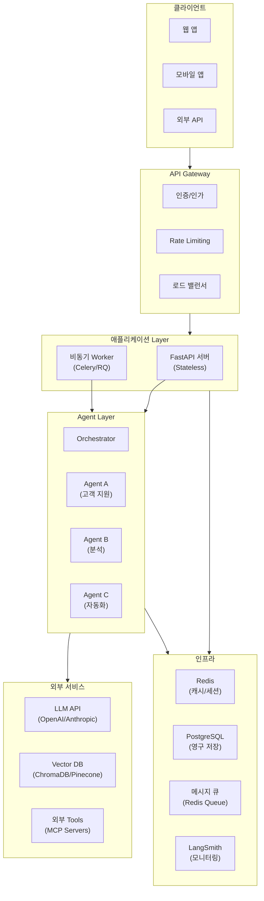
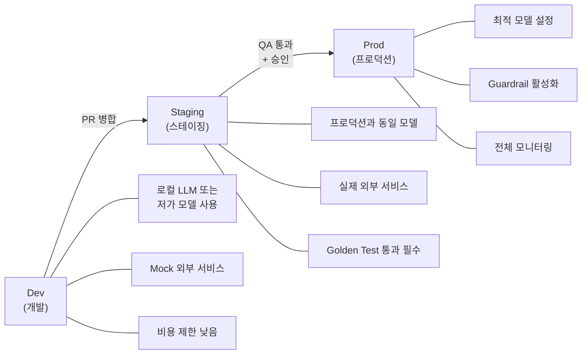
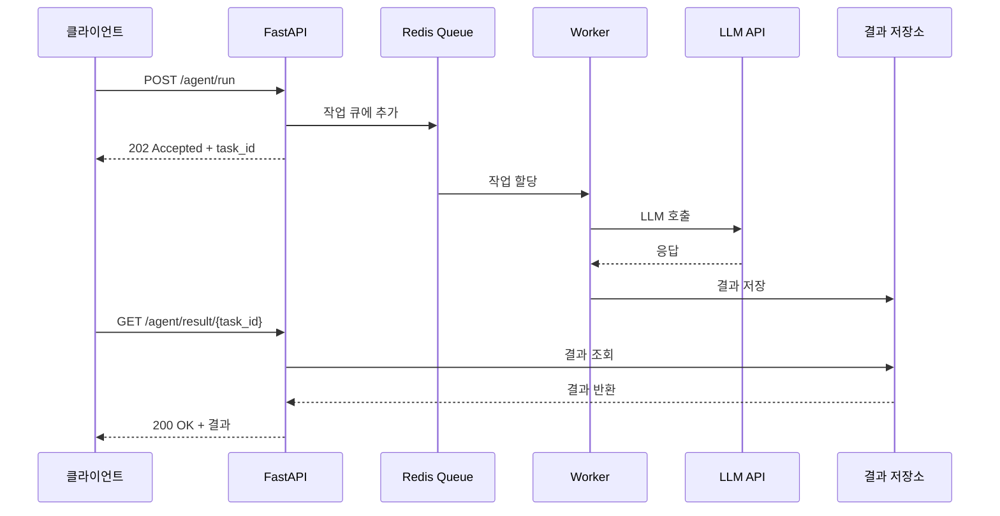
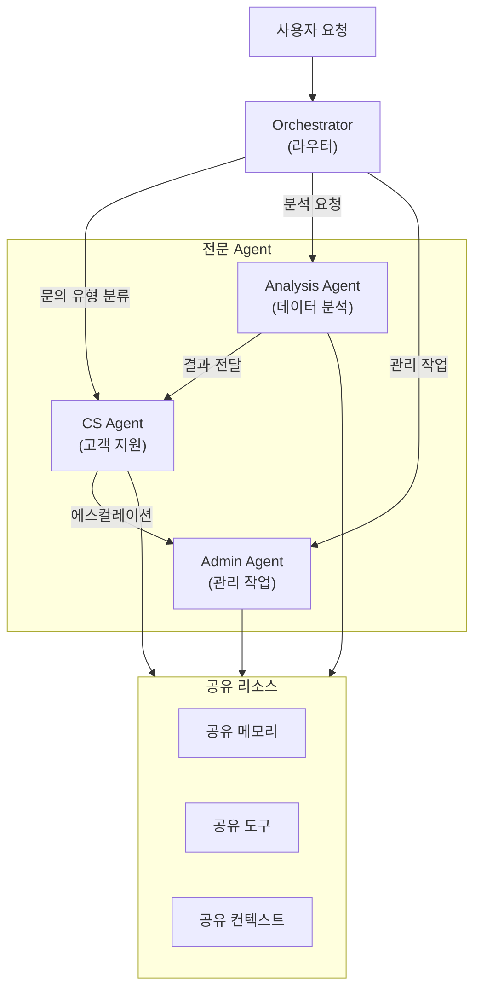
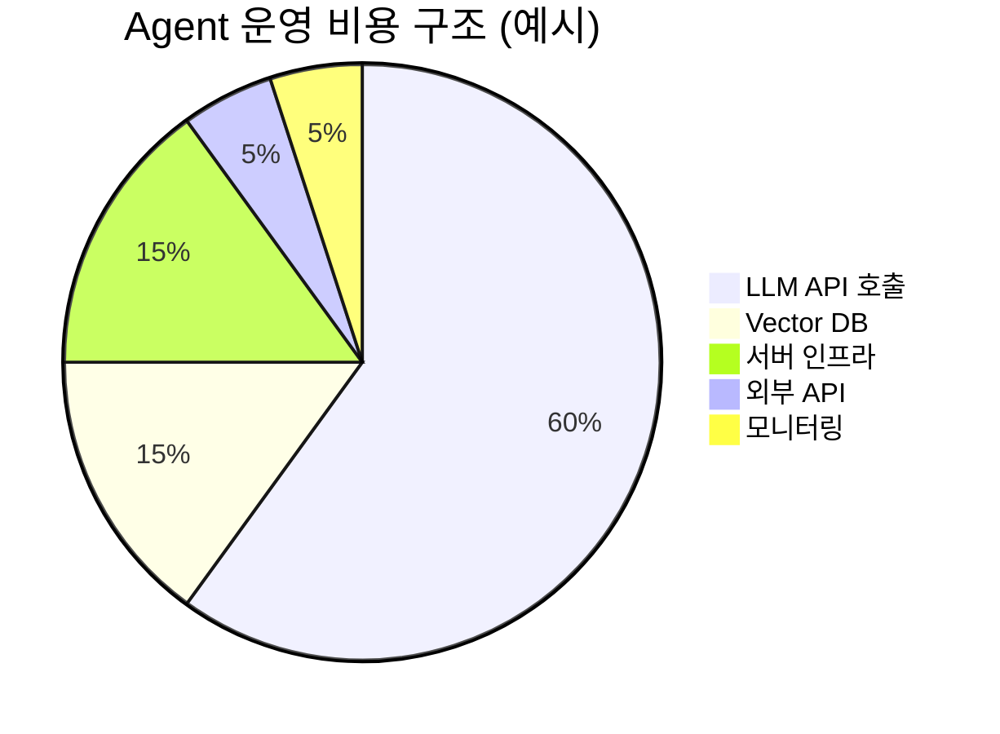

# Day 4 - Session 4: 확장 가능한 서비스 아키텍처 (2h)

> 이론 ~35분 / 실습 ~85분

## 학습 목표

이 세션을 마치면 다음을 할 수 있습니다:

1. Agent 서비스의 전체 아키텍처를 설계할 수 있다
2. Dev-Staging-Prod 환경을 분리하고 설정을 관리할 수 있다
3. 수평 확장과 비동기 처리 전략을 설계할 수 있다
4. Multi-Agent 시스템의 설계 패턴을 이해하고 적용할 수 있다
5. 운영 비용을 최적화하는 전략을 수립할 수 있다

---

## 1. Agent 서비스 아키텍처 전체 구조

### 1.1 프로토타입 vs 프로덕션

개발 단계의 Agent와 프로덕션 Agent는 요구사항이 완전히 다르다.

| 구분 | 프로토타입 | 프로덕션 |
|------|----------|---------|
| 사용자 수 | 개발자 1명 | 수백~수천 명 동시 접속 |
| 가용성 | 중단 가능 | 99.9%+ SLA |
| 에러 대응 | print + 재실행 | 자동 재시도 + Fallback + 알럿 |
| 비용 | 무시 가능 | 월 수백만 원 이상 |
| 보안 | API 키 하드코딩 | 시크릿 관리, 인증/인가 |
| 배포 | 수동 실행 | CI/CD 파이프라인 |

### 1.2 프로덕션 Agent 아키텍처



---

## 2. 환경 분리: Dev → Staging → Prod

### 2.1 3단계 환경 전략



### 2.2 환경별 설정 관리

```python
"""환경별 설정 관리 (Pydantic Settings)"""

import os
from pydantic_settings import BaseSettings
from pydantic import Field


class AgentSettings(BaseSettings):
    """Agent 서비스 설정

    환경변수 또는 .env 파일에서 로드한다.
    """

    # 환경 구분
    environment: str = Field(default="dev", description="dev | staging | prod")

    # LLM 설정
    openai_api_key: str = Field(default="", description="OpenAI API Key")
    anthropic_api_key: str = Field(default="", description="Anthropic API Key")
    llm_model: str = Field(default="gpt-4o-mini", description="기본 LLM 모델")
    llm_temperature: float = Field(default=0.0)
    llm_max_tokens: int = Field(default=4096)

    # RAG 설정
    chroma_host: str = Field(default="localhost")
    chroma_port: int = Field(default=8000)
    embedding_model: str = Field(default="text-embedding-3-small")
    retrieval_top_k: int = Field(default=5)

    # 모니터링
    langsmith_api_key: str = Field(default="")
    langsmith_project: str = Field(default="agent-dev")
    langsmith_tracing: bool = Field(default=True)

    # 비용 제한
    max_tokens_per_request: int = Field(default=8000)
    max_cost_per_day_usd: float = Field(default=10.0)
    max_requests_per_minute: int = Field(default=60)

    # Guardrail
    enable_pre_guardrail: bool = Field(default=True)
    enable_post_guardrail: bool = Field(default=True)
    enable_pii_masking: bool = Field(default=True)

    # 서버 설정
    host: str = Field(default="0.0.0.0")
    port: int = Field(default=8000)
    workers: int = Field(default=1)

    # Redis
    redis_url: str = Field(default="redis://localhost:6379")
    cache_ttl_seconds: int = Field(default=3600)

    # Feature Flag
    enable_streaming: bool = Field(default=False)
    enable_multi_agent: bool = Field(default=False)
    enable_cost_optimization: bool = Field(default=False)

    class Config:
        env_file = ".env"
        env_prefix = "AGENT_"


# 환경별 프리셋
ENVIRONMENT_PRESETS = {
    "dev": {
        "llm_model": "gpt-4o-mini",
        "langsmith_project": "agent-dev",
        "max_cost_per_day_usd": 5.0,
        "max_requests_per_minute": 30,
        "enable_post_guardrail": False,
        "workers": 1,
    },
    "staging": {
        "llm_model": "gpt-4o",
        "langsmith_project": "agent-staging",
        "max_cost_per_day_usd": 50.0,
        "max_requests_per_minute": 60,
        "enable_post_guardrail": True,
        "workers": 2,
    },
    "prod": {
        "llm_model": "gpt-4o",
        "langsmith_project": "agent-prod",
        "max_cost_per_day_usd": 500.0,
        "max_requests_per_minute": 200,
        "enable_post_guardrail": True,
        "enable_cost_optimization": True,
        "workers": 4,
    },
}


def get_settings(environment: str = None) -> AgentSettings:
    """환경별 설정 로드"""
    env = environment or os.environ.get("AGENT_ENVIRONMENT", "dev")

    # 프리셋 적용
    preset = ENVIRONMENT_PRESETS.get(env, {})

    # 환경변수가 프리셋보다 우선
    settings = AgentSettings(environment=env, **preset)
    return settings
```

### 2.3 Feature Flag 패턴

```python
"""Feature Flag로 기능 점진적 배포"""

import os
import json
from pathlib import Path


class FeatureFlags:
    """Feature Flag 관리

    JSON 파일 또는 환경변수로 기능 ON/OFF를 제어한다.
    프로덕션에서 새 기능을 안전하게 롤아웃할 때 사용한다.
    """

    def __init__(self, config_path: str = None):
        self._flags: dict[str, dict] = {}

        if config_path and Path(config_path).exists():
            with open(config_path, encoding="utf-8") as f:
                self._flags = json.load(f)

    def is_enabled(self, flag_name: str, default: bool = False) -> bool:
        """기능 활성화 여부 확인

        우선순위: 환경변수 > JSON 파일 > 기본값
        """
        # 1. 환경변수 확인 (FEATURE_FLAG_{NAME})
        env_key = f"FEATURE_FLAG_{flag_name.upper()}"
        env_val = os.environ.get(env_key)
        if env_val is not None:
            return env_val.lower() in ("true", "1", "yes")

        # 2. JSON 설정 확인
        flag_config = self._flags.get(flag_name, {})
        if isinstance(flag_config, bool):
            return flag_config
        if isinstance(flag_config, dict):
            return flag_config.get("enabled", default)

        return default

    def get_variant(self, flag_name: str) -> str:
        """A/B 테스트 변형(variant) 반환"""
        flag_config = self._flags.get(flag_name, {})
        if isinstance(flag_config, dict):
            return flag_config.get("variant", "control")
        return "control"


# 사용 예시
"""
feature_flags.json:
{
    "streaming_response": {"enabled": true, "variant": "v2"},
    "multi_agent_routing": {"enabled": false},
    "cost_optimization_cache": {"enabled": true},
    "new_prompt_template": {"enabled": true, "variant": "experiment_b"}
}
"""
```

---

## 3. Scaling: 수평 확장, 큐 기반 비동기 처리

### 3.1 확장 전략 비교

| 전략 | 설명 | 적합한 경우 | 비용 |
|------|------|-----------|------|
| 수직 확장 | 서버 성능 업그레이드 | 초기 단계, 단순 구조 | 중간 |
| 수평 확장 | 서버 인스턴스 추가 | 동시 사용자 증가 | 높음 (효율적) |
| 비동기 처리 | 큐 기반 백그라운드 | 긴 실행 시간 작업 | 낮음 |
| 캐싱 | 동일 요청 재활용 | 반복 질문이 많을 때 | 매우 낮음 |

### 3.2 비동기 처리 아키텍처



### 3.3 FastAPI 비동기 처리 구현

```python
"""FastAPI 기반 Agent 서비스 (비동기 처리)"""

import os
import uuid
import json
import asyncio
from datetime import datetime
from fastapi import FastAPI, HTTPException, BackgroundTasks
from pydantic import BaseModel
import redis


app = FastAPI(title="Agent Service", version="1.0.0")

# Redis 연결 (결과 저장 + 캐시)
redis_client = redis.Redis.from_url(
    os.environ.get("REDIS_URL", "redis://localhost:6379"),
    decode_responses=True
)


class AgentRequest(BaseModel):
    """Agent 요청"""
    query: str
    session_id: str = None
    metadata: dict = None


class AgentResponse(BaseModel):
    """Agent 응답"""
    task_id: str
    status: str  # "queued", "processing", "completed", "failed"
    result: dict = None


# --- 동기 처리 (간단한 요청) ---

@app.post("/agent/chat", response_model=dict)
async def chat(request: AgentRequest):
    """동기 처리: 즉시 응답이 필요한 간단한 요청"""
    # 캐시 확인
    cache_key = f"cache:{hash(request.query)}"
    cached = redis_client.get(cache_key)
    if cached:
        return json.loads(cached)

    # Agent 실행 (여기서는 간단한 예시)
    result = await run_agent_async(request.query)

    # 캐시 저장 (1시간)
    redis_client.setex(cache_key, 3600, json.dumps(result))

    return result


# --- 비동기 처리 (긴 실행 시간 작업) ---

@app.post("/agent/run", response_model=AgentResponse)
async def submit_task(request: AgentRequest, background_tasks: BackgroundTasks):
    """비동기 처리: 긴 작업은 큐에 넣고 즉시 응답"""
    task_id = str(uuid.uuid4())

    # 작업 상태 초기화
    task_data = {
        "task_id": task_id,
        "status": "queued",
        "query": request.query,
        "created_at": datetime.now().isoformat(),
        "result": None
    }
    redis_client.setex(f"task:{task_id}", 86400, json.dumps(task_data))

    # 백그라운드 실행
    background_tasks.add_task(process_task, task_id, request.query)

    return AgentResponse(task_id=task_id, status="queued")


@app.get("/agent/result/{task_id}", response_model=AgentResponse)
async def get_result(task_id: str):
    """작업 결과 조회"""
    task_data = redis_client.get(f"task:{task_id}")
    if not task_data:
        raise HTTPException(status_code=404, detail="Task not found")

    data = json.loads(task_data)
    return AgentResponse(
        task_id=data["task_id"],
        status=data["status"],
        result=data.get("result")
    )


async def process_task(task_id: str, query: str):
    """백그라운드에서 Agent 작업 처리"""
    # 상태 업데이트: processing
    task_data = json.loads(redis_client.get(f"task:{task_id}"))
    task_data["status"] = "processing"
    redis_client.setex(f"task:{task_id}", 86400, json.dumps(task_data))

    try:
        # Agent 실행
        result = await run_agent_async(query)

        # 상태 업데이트: completed
        task_data["status"] = "completed"
        task_data["result"] = result
        task_data["completed_at"] = datetime.now().isoformat()

    except Exception as e:
        # 상태 업데이트: failed
        task_data["status"] = "failed"
        task_data["result"] = {"error": str(e)}

    redis_client.setex(f"task:{task_id}", 86400, json.dumps(task_data))


async def run_agent_async(query: str) -> dict:
    """Agent 실행 (비동기)"""
    # 실제 Agent 로직은 여기에 구현
    # 여기서는 예시로 간단한 응답 반환
    await asyncio.sleep(0.1)  # LLM 호출 시뮬레이션
    return {
        "answer": f"'{query}'에 대한 응답입니다.",
        "sources": [],
        "tokens_used": 150
    }


# --- 헬스 체크 ---

@app.get("/health")
async def health_check():
    """서비스 상태 확인"""
    try:
        redis_client.ping()
        redis_ok = True
    except Exception:
        redis_ok = False

    return {
        "status": "healthy" if redis_ok else "degraded",
        "redis": "connected" if redis_ok else "disconnected",
        "timestamp": datetime.now().isoformat()
    }
```

### 3.4 응답 캐싱 전략

```python
"""LLM 응답 캐싱으로 비용 절감 + 응답 속도 향상"""

import hashlib
import json
import redis
from functools import wraps


class LLMCache:
    """LLM 응답 캐시

    동일한 프롬프트에 대해 캐시된 응답을 반환한다.
    temperature=0인 결정적 호출에 적합하다.
    """

    def __init__(self, redis_url: str = "redis://localhost:6379", ttl: int = 3600):
        self.redis = redis.Redis.from_url(redis_url, decode_responses=True)
        self.ttl = ttl
        self.stats = {"hits": 0, "misses": 0}

    def _make_key(self, model: str, messages: list[dict], **kwargs) -> str:
        """캐시 키 생성 (모델 + 메시지 해시)"""
        content = json.dumps({
            "model": model,
            "messages": messages,
            **kwargs
        }, sort_keys=True)
        return f"llm_cache:{hashlib.sha256(content.encode()).hexdigest()}"

    def get(self, model: str, messages: list[dict], **kwargs) -> dict | None:
        """캐시에서 응답 조회"""
        key = self._make_key(model, messages, **kwargs)
        cached = self.redis.get(key)
        if cached:
            self.stats["hits"] += 1
            return json.loads(cached)
        self.stats["misses"] += 1
        return None

    def set(self, model: str, messages: list[dict], response: dict, **kwargs):
        """캐시에 응답 저장"""
        key = self._make_key(model, messages, **kwargs)
        self.redis.setex(key, self.ttl, json.dumps(response))

    def get_hit_rate(self) -> float:
        """캐시 적중률"""
        total = self.stats["hits"] + self.stats["misses"]
        return self.stats["hits"] / total if total > 0 else 0

    def invalidate_by_pattern(self, pattern: str):
        """패턴으로 캐시 일괄 삭제"""
        for key in self.redis.scan_iter(f"llm_cache:{pattern}*"):
            self.redis.delete(key)
```

---

## 4. Multi-Agent 시스템 설계

### 4.1 Single Agent vs Multi-Agent

| 구분 | Single Agent | Multi-Agent |
|------|-------------|-------------|
| 구조 | 하나의 Agent가 모든 작업 처리 | 전문화된 여러 Agent가 협업 |
| 장점 | 단순, 디버깅 쉬움 | 전문화, 병렬 처리, 확장 용이 |
| 단점 | 프롬프트 비대화, 성능 한계 | 조율 복잡, 통신 오버헤드 |
| 적합 | 도메인이 좁고 명확한 경우 | 복합 도메인, 대규모 시스템 |

### 4.2 Orchestrator 패턴



### 4.3 라우팅 Orchestrator 구현

```python
"""Multi-Agent Orchestrator: 요청을 적절한 Agent로 라우팅"""

import os
from openai import OpenAI
from dataclasses import dataclass
import json


client = OpenAI(api_key=os.environ["OPENAI_API_KEY"])


@dataclass
class AgentConfig:
    """개별 Agent 설정"""
    name: str
    description: str
    system_prompt: str
    model: str = "gpt-4o"
    tools: list = None


class MultiAgentOrchestrator:
    """Multi-Agent 시스템 Orchestrator

    사용자 요청을 분석하여 적절한 전문 Agent로 라우팅한다.
    """

    def __init__(self, agents: list[AgentConfig]):
        self.agents = {a.name: a for a in agents}
        self.router_prompt = self._build_router_prompt()

    def _build_router_prompt(self) -> str:
        """라우터 프롬프트 생성"""
        agent_descriptions = "\n".join(
            f"- **{name}**: {agent.description}"
            for name, agent in self.agents.items()
        )

        return f"""당신은 Multi-Agent 시스템의 라우터입니다.
사용자의 요청을 분석하여 가장 적절한 Agent를 선택하세요.

## 사용 가능한 Agent
{agent_descriptions}

## 출력 형식 (JSON)
```json
{{"agent": "agent_name", "reason": "선택 이유", "confidence": 0.0~1.0}}
```

요청이 여러 Agent에 걸쳐 있으면 가장 핵심적인 Agent를 선택하세요."""

    def route(self, user_query: str) -> dict:
        """요청을 적절한 Agent로 라우팅

        Args:
            user_query: 사용자 요청

        Returns:
            {"agent": "...", "reason": "...", "confidence": 0.0~1.0}
        """
        response = client.chat.completions.create(
            model="gpt-4o-mini",  # 라우팅은 저가 모델로
            messages=[
                {"role": "system", "content": self.router_prompt},
                {"role": "user", "content": user_query}
            ],
            temperature=0,
            response_format={"type": "json_object"}
        )

        routing = json.loads(response.choices[0].message.content)
        return routing

    def run(self, user_query: str) -> dict:
        """전체 파이프라인: 라우팅 → Agent 실행

        Args:
            user_query: 사용자 요청

        Returns:
            Agent 실행 결과
        """
        # 1. 라우팅
        routing = self.route(user_query)
        agent_name = routing["agent"]

        if agent_name not in self.agents:
            return {"error": f"Unknown agent: {agent_name}", "routing": routing}

        agent_config = self.agents[agent_name]

        # 2. Agent 실행
        response = client.chat.completions.create(
            model=agent_config.model,
            messages=[
                {"role": "system", "content": agent_config.system_prompt},
                {"role": "user", "content": user_query}
            ],
            temperature=0,
            tools=agent_config.tools,
        )

        return {
            "routing": routing,
            "agent": agent_name,
            "response": response.choices[0].message.content,
            "model": agent_config.model,
        }


# --- Multi-Agent 시스템 구성 예시 ---

def create_demo_orchestrator() -> MultiAgentOrchestrator:
    """데모용 Multi-Agent 시스템 생성"""

    agents = [
        AgentConfig(
            name="customer_support",
            description="고객 문의 응대: 주문 조회, 환불, 배송, 상품 문의",
            system_prompt=(
                "당신은 고객 지원 전문 Agent입니다. "
                "친절하고 정확하게 고객 문의에 답변합니다. "
                "확인되지 않은 정보는 절대 제공하지 마세요."
            ),
            model="gpt-4o",
        ),
        AgentConfig(
            name="data_analyst",
            description="데이터 분석: 매출 분석, 트렌드 파악, 보고서 생성",
            system_prompt=(
                "당신은 데이터 분석 전문 Agent입니다. "
                "데이터를 기반으로 인사이트를 도출하고 "
                "명확한 보고서를 작성합니다."
            ),
            model="gpt-4o",
        ),
        AgentConfig(
            name="task_automation",
            description="업무 자동화: 스케줄링, 알림 설정, 문서 생성, 이메일 발송",
            system_prompt=(
                "당신은 업무 자동화 전문 Agent입니다. "
                "사용자의 반복 업무를 자동화하고 "
                "효율적인 워크플로우를 설계합니다."
            ),
            model="gpt-4o-mini",  # 비용 절감
        ),
    ]

    return MultiAgentOrchestrator(agents)
```

---

## 5. 운영 비용 최적화

### 5.1 비용 구조 분석



### 5.2 비용 최적화 전략

| 전략 | 절감 효과 | 구현 난이도 | 설명 |
|------|----------|-----------|------|
| 모델 티어링 | 30-50% | 낮음 | 간단한 작업은 저가 모델, 복잡한 작업만 고가 모델 |
| 응답 캐싱 | 20-40% | 낮음 | 동일 질문에 캐시 응답 반환 |
| 프롬프트 최적화 | 10-20% | 중간 | 불필요한 토큰 제거, 간결한 프롬프트 |
| 배치 처리 | 15-25% | 중간 | 비긴급 요청을 모아서 일괄 처리 |
| 컨텍스트 압축 | 10-15% | 높음 | RAG 컨텍스트 요약 후 전달 |

### 5.3 모델 티어링 구현

```python
"""모델 티어링: 요청 복잡도에 따라 모델 선택"""

import os
from openai import OpenAI
import json


client = OpenAI(api_key=os.environ["OPENAI_API_KEY"])


# 모델별 비용 (1M tokens 기준, USD)
MODEL_COSTS = {
    "gpt-4o": {"input": 2.50, "output": 10.00},
    "gpt-4o-mini": {"input": 0.15, "output": 0.60},
    "gpt-3.5-turbo": {"input": 0.50, "output": 1.50},
}


class ModelTiering:
    """요청 복잡도에 따른 자동 모델 선택"""

    def __init__(self):
        self.tiers = {
            "simple": "gpt-4o-mini",    # 간단한 질문, 분류
            "standard": "gpt-4o-mini",  # 일반적인 대화
            "complex": "gpt-4o",        # 복잡한 추론, 분석
        }

    def classify_complexity(self, query: str) -> str:
        """요청 복잡도 분류 (규칙 기반 + LLM)"""
        # 규칙 기반 빠른 분류
        if len(query) < 50:
            return "simple"

        # 복잡도 키워드 확인
        complex_keywords = [
            "분석", "비교", "설계", "전략", "왜", "어떻게",
            "장단점", "트레이드오프", "아키텍처", "최적화"
        ]
        has_complex = any(k in query for k in complex_keywords)

        if has_complex or len(query) > 500:
            return "complex"

        return "standard"

    def select_model(self, query: str) -> str:
        """요청에 적합한 모델 선택"""
        complexity = self.classify_complexity(query)
        return self.tiers[complexity]

    def estimate_cost(self, model: str, input_tokens: int, output_tokens: int) -> float:
        """비용 추정 (USD)"""
        costs = MODEL_COSTS.get(model, MODEL_COSTS["gpt-4o"])
        input_cost = (input_tokens / 1_000_000) * costs["input"]
        output_cost = (output_tokens / 1_000_000) * costs["output"]
        return round(input_cost + output_cost, 6)


class CostTracker:
    """일일 비용 추적 및 알럿"""

    def __init__(self, daily_budget_usd: float = 100.0):
        self.daily_budget = daily_budget_usd
        self.today_cost = 0.0
        self.call_count = 0

    def add(self, cost_usd: float):
        """비용 추가"""
        self.today_cost += cost_usd
        self.call_count += 1

        # 80% 도달 시 경고
        if self.today_cost >= self.daily_budget * 0.8:
            print(f"WARNING: 일일 예산의 {self.today_cost/self.daily_budget*100:.0f}% 사용")

        # 100% 초과 시 차단
        if self.today_cost >= self.daily_budget:
            raise RuntimeError(
                f"일일 비용 한도 초과: ${self.today_cost:.2f} / ${self.daily_budget:.2f}"
            )

    def get_summary(self) -> dict:
        """비용 요약"""
        return {
            "total_cost_usd": round(self.today_cost, 4),
            "call_count": self.call_count,
            "avg_cost_per_call": round(
                self.today_cost / self.call_count if self.call_count > 0 else 0, 6
            ),
            "budget_remaining_usd": round(self.daily_budget - self.today_cost, 4),
            "budget_usage_pct": round(self.today_cost / self.daily_budget * 100, 1),
        }
```

### 5.4 비용 산정 워크시트

```
=== Agent 운영 비용 산정 ===

[1] LLM API 비용
- 일일 예상 요청 수: _____ 건
- 평균 입력 토큰: _____ tokens/건
- 평균 출력 토큰: _____ tokens/건
- 사용 모델: gpt-4o / gpt-4o-mini
- 일일 비용: $_____
- 월간 비용: $_____

[2] Vector DB 비용
- 총 문서 수: _____ 건
- 임베딩 모델: text-embedding-3-small
- 초기 인덱싱 비용: $_____
- 월간 쿼리 비용: $_____
- 호스팅 비용: $_____ /월

[3] 인프라 비용
- 서버 (API): $_____ /월
- Worker (비동기): $_____ /월
- Redis: $_____ /월
- DB (PostgreSQL): $_____ /월

[4] 총 월간 비용
- LLM API: $_____
- Vector DB: $_____
- 인프라: $_____
- 기타 (모니터링 등): $_____
- 합계: $_____ /월
```

---

## 6. 실습 안내

> **실습명**: 운영 아키텍처 설계
> **소요 시간**: 약 85분
> **형태**: README 중심 설계 실습
> **실습 디렉토리**: `labs/day4-service-architecture/`

### I DO (시연) - 15분

강사가 프로덕션 Agent 아키텍처를 설계하는 과정을 시연한다.

- 아키텍처 다이어그램 작성 (Mermaid)
- 환경별 설정 구성
- 비용 산정 예시

### WE DO (함께) - 30분

전체가 함께 Day 2-3에서 만든 Agent의 프로덕션 아키텍처를 설계한다.

- `artifacts/architecture-template.md` 템플릿을 채우기
- 환경 분리 전략 결정
- Scaling 전략 토론

### YOU DO (독립) - 40분

개인 Agent 프로젝트의 프로덕션 아키텍처를 완성한다.

- 전체 아키텍처 다이어그램 작성
- 비용 산정 워크시트 완성
- Multi-Agent 적용 여부 판단
- 참고: `artifacts/example-architecture.md`

**산출물**: 아키텍처 설계 문서 + 비용 산정 워크시트

---

## 핵심 요약

```
아키텍처 = Client → Gateway → App → Agent → External + Infra
환경 분리 = Dev(저가 모델, Mock) → Staging(실제 모델, Golden Test) → Prod(최적화, Guardrail)
Scaling = 수평 확장 + 비동기 큐 + 응답 캐싱
Multi-Agent = Orchestrator가 요청을 전문 Agent로 라우팅
비용 최적화 = 모델 티어링(30-50%) + 캐싱(20-40%) + 프롬프트 최적화(10-20%)
```

---

## Day 4 마무리

오늘은 Agent의 **품질 평가, 성능 개선, 모니터링, 서비스 아키텍처**를 다루었다. 이 4가지는 Agent를 실험실에서 프로덕션으로 가져가는 핵심 역량이다.

**Day 5 예고**: 지금까지 배운 모든 내용을 종합하여 개인 **MVP 프로젝트**를 완성하고 최종 시연한다.
