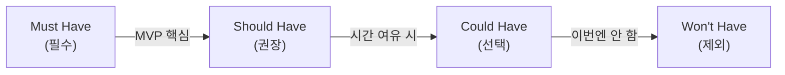
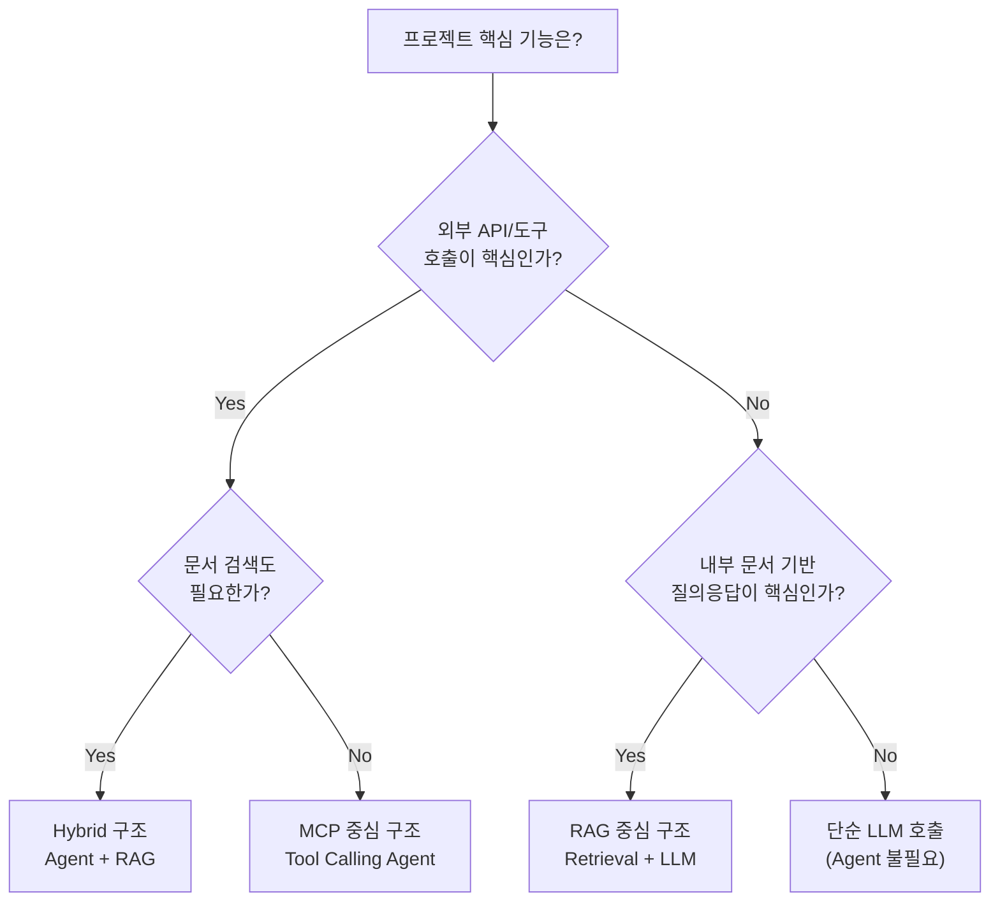

# Day 5 - Session 1: 프로젝트 설계 확정 (2h)

> 이론 ~30분 / 실습 ~90분

## 학습 목표

이 세션을 마치면 다음을 할 수 있습니다:

1. Day 1~4에서 학습한 핵심 개념을 자신의 프로젝트에 매핑할 수 있다
2. MoSCoW 기법으로 MVP 범위를 정의할 수 있다
3. MCP/RAG/Hybrid 중 프로젝트에 적합한 아키텍처를 선택하고 근거를 설명할 수 있다
4. 정량적 평가 기준을 설정할 수 있다
5. 프로젝트 설계서를 완성할 수 있다

---

## 1. Day 1~4 핵심 복습 체크리스트

프로젝트 설계 전에 아래 항목을 빠르게 점검한다. 체크가 안 되는 항목은 해당 Day 가이드를 다시 참고한다.

### Day 1 — 문제 정의 & 설계

- [ ] Pain → Task → Skill → Tool 프레임워크로 문제를 분해할 수 있다
- [ ] 자동화형 / 분석형 / Planner형 Agent 패턴을 구분할 수 있다
- [ ] RAG vs Agent vs Hybrid 의사결정 트리를 적용할 수 있다
- [ ] System / Few-shot / Chain-of-Thought 프롬프트 전략을 실무에 적용할 수 있다

### Day 2 — 제어 흐름 & 상태

- [ ] LangGraph의 StateGraph, Node, Edge 개념을 이해한다
- [ ] 조건부 분기(conditional_edges)를 설계할 수 있다
- [ ] Tool 호출에 Pydantic Validation을 적용할 수 있다
- [ ] Agent 상태를 TypedDict로 정의할 수 있다

### Day 3 — MCP & RAG 구현

- [ ] MCP Server/Client 구조를 이해하고 Tool을 정의할 수 있다
- [ ] ChromaDB로 문서를 색인하고 유사도 검색을 수행할 수 있다
- [ ] Chunking 전략(크기, 오버랩)을 선택할 수 있다
- [ ] Hybrid 아키텍처(Agent + RAG)를 설계할 수 있다

### Day 4 — 평가 & 운영

- [ ] Golden Test Set을 설계하고 자동 평가를 실행할 수 있다
- [ ] LangSmith로 Trace를 확인하고 병목을 분석할 수 있다
- [ ] Prompt 튜닝, Retrieval 파라미터 조정으로 성능을 개선할 수 있다
- [ ] 장애 대응 전략(재시도, 폴백, 타임아웃)을 설계할 수 있다

---

## 2. 프로젝트 설계서 작성 가이드

프로젝트 설계서는 MVP의 청사진이다. `artifacts/project-design-template.md`를 활용하여 아래 항목을 모두 채운다.

### 설계서 핵심 항목

```
1. 프로젝트명
2. 문제 정의 (Pain → Task → Skill → Tool)
3. 아키텍처 선택 (MCP / RAG / Hybrid + 근거)
4. MVP 범위 (MoSCoW 분류)
5. 기술 스택
6. 평가 기준 (정량 지표 3개 이상)
7. 구현 계획 (Session 2~3 시간 배분)
```

### 좋은 설계서 vs 나쁜 설계서

| 항목 | 좋은 설계서 | 나쁜 설계서 |
|------|-----------|-----------|
| 문제 정의 | "CS팀이 하루 200건 문의를 분류하는 데 3시간 소요" | "고객 서비스를 개선하고 싶다" |
| MVP 범위 | Must 3개, Should 2개로 명확히 구분 | "가능한 많이 구현" |
| 평가 기준 | "분류 정확도 85% 이상, 응답 시간 5초 이내" | "잘 작동하면 된다" |
| 시간 계획 | "Session 2: Tool 3개 구현, Session 3: 평가 실행" | "시간 되는 대로" |

---

## 3. MVP 범위 정의: MoSCoW 기법

### MoSCoW란?

요구사항의 우선순위를 4단계로 분류하는 기법이다. 제한된 시간(4시간) 안에 무엇을 반드시 완성하고, 무엇을 포기할지 결정한다.



### 분류 기준

| 등급 | 기준 | 예시 |
|------|------|------|
| **Must** | 이것 없이는 데모가 불가능 | Agent 기본 루프, 핵심 Tool 1-2개 |
| **Should** | 있으면 품질이 눈에 띄게 향상 | 에러 핸들링, 입력 검증 |
| **Could** | 시간이 남으면 추가 | UI 개선, 추가 Tool |
| **Won't** | 이번 MVP에서는 명시적으로 제외 | 멀티유저, 배포, 인증 |

### 적용 팁

- **Must는 3개 이하**로 제한한다. 4시간에 Must 5개는 비현실적이다
- **Won't를 명시적으로 적는다**. "안 하는 것"을 정하면 범위가 선명해진다
- Must를 모두 완성한 후에만 Should로 넘어간다

---

## 4. 아키텍처 선택 의사결정 매트릭스

Day 1에서 학습한 의사결정 트리를 프로젝트에 적용한다.

### 의사결정 매트릭스

| 판단 기준 | MCP 중심 | RAG 중심 | Hybrid |
|-----------|---------|---------|--------|
| 외부 시스템 연동 필요 | O | X | O |
| 내부 문서 검색 필요 | X | O | O |
| 다단계 추론 필요 | O | X | O |
| 구현 복잡도 | 중간 | 낮음 | 높음 |
| 4시간 내 MVP 가능성 | 높음 | 높음 | 중간 |

### 선택 플로우



### 아키텍처별 MVP 난이도

- **MCP 중심**: Tool 정의가 명확하면 빠르게 구현 가능. Day 3 실습 코드 재활용
- **RAG 중심**: 문서 준비가 핵심. ChromaDB 셋업은 Day 3 코드 활용
- **Hybrid**: 두 구조를 결합해야 하므로 Must를 2개 이하로 엄격히 제한

---

## 5. 평가 기준 설정 가이드

MVP라도 정량적 평가 기준이 있어야 "성공/실패"를 판단할 수 있다.

### 필수 평가 지표 (최소 3개 설정)

| 지표 카테고리 | 예시 지표 | 측정 방법 |
|-------------|----------|----------|
| **정확도** | Task 성공률, 분류 정확도 | Golden Test Set 자동 실행 |
| **성능** | 평균 응답 시간, P95 Latency | LangSmith Trace 분석 |
| **안정성** | 에러율, 재시도 성공률 | 로그 분석 |
| **비용** | 평균 토큰 사용량, 호출당 비용 | LangSmith 토큰 카운트 |

### Golden Test Set 설계

Day 4에서 학습한 Golden Test Set을 프로젝트에 맞게 설계한다.

```
최소 구성:
- 정상 케이스 5개 (Happy Path)
- 엣지 케이스 3개 (경계값, 긴 입력, 특수문자)
- 실패 케이스 2개 (잘못된 입력, 존재하지 않는 데이터)
```

평가 스크립트는 `src/evaluation.py` 템플릿을 활용한다.

---

## 6. 프로젝트 아이디어 예시

아이디어가 떠오르지 않는 경우 아래 예시를 참고한다. 난이도별로 정리했다.

### 예시 1: 기술 문서 QA Bot (난이도: 하)

```
구조: RAG 중심
Pain: 사내 기술 문서가 흩어져 있어 원하는 정보를 찾는 데 30분 이상 소요
Must: 문서 색인 + 질의응답 + 출처 표시
Should: 관련 문서 추천, 대화 히스토리
Tool: ChromaDB, OpenAI Embedding
평가: 답변 정확도 80%, 응답 시간 10초 이내
```

### 예시 2: 코드 리뷰 Assistant (난이도: 중)

```
구조: MCP 중심
Pain: PR 리뷰 요청이 밀려 평균 2일 대기
Must: 코드 diff 분석 + 리뷰 코멘트 생성 + 심각도 분류
Should: 보안 취약점 탐지, 컨벤션 체크
Tool: GitHub API (MCP), LLM 분석
평가: 리뷰 품질(사람 평가), 오탐률 20% 이하
```

### 예시 3: 회의록 자동 정리 Agent (난이도: 중)

```
구조: Hybrid
Pain: 회의 후 회의록 정리에 30분, 액션아이템 추적에 추가 시간 소요
Must: 회의 텍스트 요약 + 액션아이템 추출 + 담당자 매핑
Should: 이전 회의록 참조(RAG), Slack 알림
Tool: LLM 요약, ChromaDB (과거 회의록), Slack API
평가: 요약 품질(ROUGE-L), 액션아이템 추출 재현율 85%
```

### 예시 4: 데이터 분석 Agent (난이도: 중상)

```
구조: MCP 중심 + Planner 패턴
Pain: 비개발 직군이 데이터 분석을 요청하면 1~2일 대기
Must: 자연어 질문 → SQL 생성 → 실행 → 결과 해석
Should: 시각화 생성, 후속 질문 제안
Tool: DB 연결(MCP), Python 실행 환경
평가: SQL 정확도 75%, 해석 품질(사람 평가)
```

### 예시 5: 멀티소스 리서치 Agent (난이도: 상)

```
구조: Hybrid + Planner 패턴
Pain: 경쟁사 동향 리서치에 반나절 소요
Must: 검색 → 정보 수집 → 구조화 보고서 생성
Should: 소스 신뢰도 평가, 트렌드 비교
Tool: 웹 검색 API(MCP), ChromaDB (과거 보고서), LLM 분석
평가: 보고서 커버리지(주요 토픽 포함률), 소스 정확도
```

---

## 7. 실습 안내

> **실습명**: 프로젝트 설계 확정
> **소요 시간**: 약 90분
> **형태**: 설계 문서 작성 + 코드 스캐폴드 준비
> **실습 디렉토리**: `labs/day5-mvp-project/`

### I DO (시연) — 15분

강사가 "회의록 자동 정리 Agent" 예시로 설계서 작성 과정을 시연한다.

1. Pain → Task → Skill → Tool 분석
2. Hybrid 아키텍처 선택 근거 설명
3. MoSCoW 분류 시연
4. Golden Test Set 3개 작성
5. 구현 계획 시간표 작성

### WE DO (함께) — 15분

전체가 함께 1~2명의 아이디어를 선정하여 MoSCoW 분류를 진행한다.

1. 발표자가 프로젝트 아이디어를 1분 설명
2. 전체가 Must / Should / Could / Won't 분류를 토론
3. "이 MVP가 4시간 안에 가능한가?" 현실성 점검

### YOU DO (독립) — 60분

개인별 프로젝트 설계서를 완성한다.

1. `artifacts/project-design-template.md`를 복사하여 작성
2. 아키텍처 선택 + MoSCoW 분류 + 평가 기준 설정
3. `data/golden_test_set.json`에 테스트 케이스 최소 10개 작성
4. `src/` 디렉토리의 스캐폴드 코드를 프로젝트에 맞게 수정 시작
5. 완료 후 강사 확인을 받고 Session 2 구현에 진입

**산출물**: 완성된 프로젝트 설계서 + 초기 코드 스캐폴드

---

## 핵심 요약

```
설계서 = 문제 정의 + 아키텍처 선택 + MVP 범위 + 평가 기준
MVP 범위 = MoSCoW (Must 3개 이하로 제한)
아키텍처 = 프로젝트 특성에 맞는 MCP / RAG / Hybrid 선택
평가 기준 = 정량 지표 3개 이상 + Golden Test Set 10개
```

---

## 다음 세션 예고

Session 2에서는 설계서를 기반으로 **핵심 기능 구현**에 돌입한다. Must 항목부터 순서대로 구현하며, GitHub Copilot을 활용한 빠른 프로토타이핑 전략을 적용한다.
