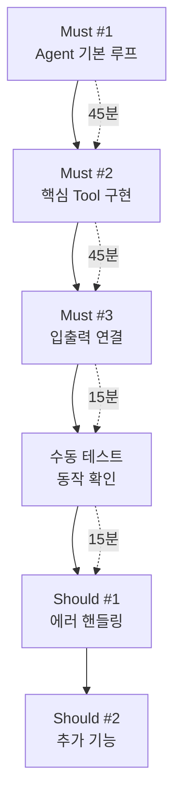
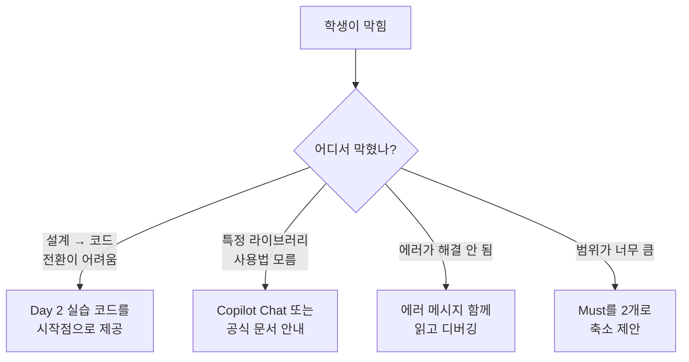

# Day 5 - Session 2: 핵심 기능 구현 (2h)

> 이론 ~15분 / 실습 ~105분

## 학습 목표

이 세션을 마치면 다음을 할 수 있습니다:

1. 설계서의 Must 항목을 우선순위대로 구현할 수 있다
2. LangGraph Agent 제어 흐름을 프로젝트에 맞게 구성할 수 있다
3. Tool 호출과 Retrieval 파이프라인에 Validation을 적용할 수 있다
4. Structured Output으로 Agent 응답을 정형화할 수 있다
5. GitHub Copilot을 활용하여 빠르게 프로토타이핑할 수 있다

---

## 1. 구현 우선순위 전략

### 핵심 경로 먼저 (Critical Path First)

4시간 중 2시간이 구현 시간이다. 가장 중요한 것부터 동작하게 만든다.



### 구현 순서 원칙

1. **뼈대 먼저**: `main.py` → `agent.py` → `tools.py` 순서로 연결
2. **하드코딩 OK**: 초기에는 설정값을 하드코딩하고 나중에 `config.py`로 분리
3. **완성 후 개선**: 동작하는 코드를 먼저 만들고, Session 3에서 개선
4. **테스트는 수동**: 자동 테스트보다 직접 실행하여 빠르게 확인

---

## 2. MVP 구현 체크리스트

아키텍처별로 반드시 구현해야 하는 항목을 정리했다. 자신의 아키텍처에 해당하는 섹션을 참고한다.

### MCP 중심 구조 체크리스트

```
[ ] 1. Agent 상태 정의 (TypedDict)
[ ] 2. LangGraph StateGraph 생성
[ ] 3. LLM Node 구현 (프롬프트 + 모델 호출)
[ ] 4. Tool Node 구현 (최소 1개 Tool)
[ ] 5. 조건부 분기 (tool_call 여부 판단)
[ ] 6. Tool 입력 Validation (Pydantic)
[ ] 7. main.py에서 end-to-end 실행
[ ] 8. 수동 테스트 3개 케이스 통과
```

### RAG 중심 구조 체크리스트

```
[ ] 1. 문서 로드 및 Chunking
[ ] 2. ChromaDB에 Embedding 색인
[ ] 3. 검색 함수 구현 (유사도 + 필터)
[ ] 4. 검색 결과 → LLM 컨텍스트 구성
[ ] 5. 답변 생성 + 출처 표시
[ ] 6. main.py에서 end-to-end 실행
[ ] 7. 수동 테스트 3개 케이스 통과
```

### Hybrid 구조 체크리스트

```
[ ] 1. Agent 상태 정의 (TypedDict)
[ ] 2. LangGraph StateGraph 생성
[ ] 3. RAG 검색 Node 구현
[ ] 4. Tool 호출 Node 구현 (최소 1개)
[ ] 5. Router Node (RAG vs Tool 분기)
[ ] 6. 응답 생성 Node
[ ] 7. main.py에서 end-to-end 실행
[ ] 8. 수동 테스트 3개 케이스 통과
```

---

## 3. 구현 중 흔한 문제와 해결법

### FAQ 1: LangGraph 그래프가 무한 루프에 빠진다

```
원인: 종료 조건이 없거나 조건부 분기가 항상 같은 노드를 가리킨다
해결:
  1. conditional_edges에서 END 조건을 명시적으로 추가
  2. 상태에 iteration_count를 두고 최대 횟수 제한
  3. recursion_limit 파라미터 설정 (기본값: 25)
```

```python
# recursion_limit 설정 예시
result = graph.invoke(
    {"messages": [HumanMessage(content=query)]},
    config={"recursion_limit": 10}
)
```

### FAQ 2: Tool 호출 결과가 Agent에 전달되지 않는다

```
원인: ToolMessage 형식이 잘못되었거나 tool_call_id가 매칭되지 않는다
해결:
  1. ToolMessage의 tool_call_id가 AIMessage의 tool_calls[].id와 일치하는지 확인
  2. ToolMessage의 content는 반드시 문자열이어야 한다 (dict면 json.dumps)
```

```python
# 올바른 ToolMessage 생성
from langchain_core.messages import ToolMessage
import json

tool_msg = ToolMessage(
    content=json.dumps(result, ensure_ascii=False),
    tool_call_id=tool_call["id"]
)
```

### FAQ 3: ChromaDB 검색 결과가 관련 없는 문서만 반환한다

```
원인: Chunking이 너무 크거나, 임베딩 모델과 쿼리 스타일이 맞지 않는다
해결:
  1. Chunk 크기를 500~1000자로 조정
  2. 쿼리를 키워드가 아닌 자연어 문장으로 작성
  3. n_results를 늘리고 상위 결과만 필터링
  4. metadata 필터를 추가하여 범위 축소
```

### FAQ 4: Structured Output이 파싱 실패한다

```
원인: LLM 응답이 정의한 스키마와 맞지 않는다
해결:
  1. with_structured_output() 사용 시 method="json_schema" 지정
  2. Pydantic 모델에 description을 상세히 작성
  3. Optional 필드 활용으로 유연성 확보
```

```python
from pydantic import BaseModel, Field
from typing import Optional

class AgentResponse(BaseModel):
    """Agent의 구조화된 응답"""
    answer: str = Field(description="사용자 질문에 대한 답변")
    confidence: float = Field(description="답변 신뢰도 0.0~1.0")
    sources: list[str] = Field(default=[], description="참조한 소스 목록")
    follow_up: Optional[str] = Field(default=None, description="후속 질문 제안")

llm_with_structure = llm.with_structured_output(AgentResponse)
```

### FAQ 5: API 키 관련 에러

```
원인: 환경변수가 설정되지 않았거나 키가 만료되었다
해결:
  1. .env 파일 확인 (OPENAI_API_KEY, ANTHROPIC_API_KEY)
  2. python-dotenv로 로드: load_dotenv()
  3. config.py에서 중앙 관리
```

---

## 4. GitHub Copilot 활용 팁

### Vibe Coding으로 빠른 프로토타이핑

GitHub Copilot을 최대한 활용하여 구현 속도를 높인다.

### 효과적인 Copilot 활용 전략

**전략 1: 주석 먼저, 코드 나중**

```python
# 1. 사용자 입력을 받아 Agent에 전달
# 2. Agent가 Tool 호출이 필요한지 판단
# 3. Tool 호출 결과를 Agent에 반환
# 4. 최종 응답을 Structured Output으로 반환
```

주석을 먼저 작성하면 Copilot이 각 단계에 맞는 코드를 제안한다.

**전략 2: Copilot Chat으로 구조 질문**

```
Copilot Chat 활용 예시:
- "이 LangGraph 그래프에 에러 핸들링 노드를 추가하려면?"
- "ChromaDB에서 metadata 필터와 유사도 검색을 결합하는 방법은?"
- "이 Pydantic 모델에 커스텀 validator를 추가하려면?"
```

**전략 3: 기존 코드 패턴 활용**

Day 2~3 실습 코드를 프로젝트 디렉토리에 참고 파일로 두면, Copilot이 해당 패턴을 학습하여 일관된 코드를 제안한다.

### Copilot 사용 시 주의점

- Copilot 제안을 **무조건 수락하지 않는다**. 특히 API 키, 엔드포인트 URL은 반드시 확인
- 생성된 코드의 **import 문**을 확인한다. 존재하지 않는 모듈을 import할 수 있다
- **비즈니스 로직**은 직접 작성한다. Copilot은 보일러플레이트에 강하다

---

## 5. 강사 서포트 포인트

구현 중 학생이 막히는 지점과 강사의 개입 타이밍을 정리했다.

### 서포트 체크포인트

| 시점 | 체크 항목 | 개입 조건 |
|------|----------|----------|
| **30분** | Agent 기본 루프 동작 여부 | 그래프 생성조차 안 됨 → 1:1 지원 |
| **60분** | 핵심 Tool 1개 동작 여부 | Tool 호출은 되지만 결과 처리 실패 → 힌트 제공 |
| **90분** | end-to-end 수동 테스트 | Must 1개도 미완성 → 범위 축소 제안 |
| **105분** | Session 3 진입 준비 | 동작하는 MVP가 있는지 확인 |

### 흔한 막힘 패턴과 대응



---

## 6. 실습 안내

> **실습명**: 핵심 기능 구현
> **소요 시간**: 약 105분
> **형태**: 코드 구현 (개인 프로젝트)
> **실습 디렉토리**: `labs/day5-mvp-project/`

### I DO (시연) — 10분

강사가 스캐폴드 코드의 구조를 설명하고, `main.py` → `agent.py` → `tools.py` 연결 과정을 시연한다.

```
시연 포인트:
1. main.py 실행 → agent.py의 그래프 호출 → tools.py의 Tool 실행 흐름
2. 상태 정의 → 노드 구현 → 엣지 연결 → 컴파일 순서
3. 첫 번째 수동 테스트까지 10분 이내 완료 시연
```

### WE DO (없음)

Session 2는 개인 구현 시간을 최대화하기 위해 WE DO를 생략한다.

### YOU DO (독립) — 95분

Must 항목부터 순서대로 구현한다.

```
권장 시간 배분:
  0~45분: Must #1, #2 구현
  45~75분: Must #3 구현 + end-to-end 연결
  75~90분: 수동 테스트 + 버그 수정
  90~105분: Should 항목 시작 (가능하면)
```

**체크포인트**: 75분 시점에 `python main.py`로 end-to-end 실행이 되어야 한다. 안 되면 강사에게 즉시 도움을 요청한다.

**산출물**: 동작하는 MVP 코드 (Must 항목 완성)

---

## 핵심 요약

```
구현 순서 = Must #1 → Must #2 → Must #3 → 수동 테스트 → Should
핵심 원칙 = 뼈대 먼저, 하드코딩 OK, 완성 후 개선
Copilot = 주석 먼저 작성 → 보일러플레이트 자동 완성
막힐 때 = 30분 이상 같은 문제면 강사에게 바로 요청
```

---

## 다음 세션 예고

Session 3에서는 동작하는 MVP를 기반으로 **Golden Test Set 평가, Prompt 튜닝, Retrieval 파라미터 조정**을 통해 성능을 개선하고 안정화한다.
