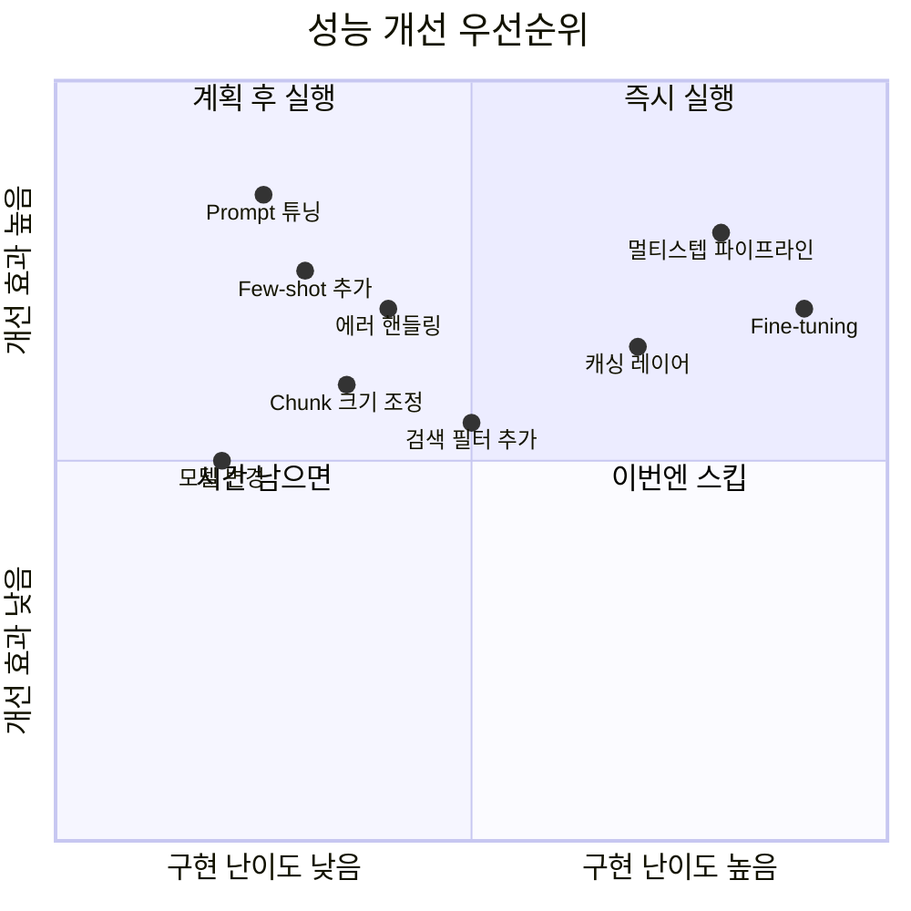
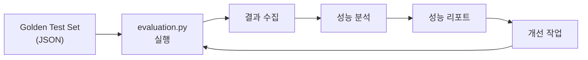

# Day 5 - Session 3: 성능 개선 & 안정화 (2h)

> 이론 ~15분 / 실습 ~105분

## 학습 목표

이 세션을 마치면 다음을 할 수 있습니다:

1. Golden Test Set으로 Agent 성능을 정량 평가할 수 있다
2. 평가 결과를 분석하여 개선 우선순위를 도출할 수 있다
3. Prompt 튜닝, Retrieval 파라미터 조정으로 성능을 개선할 수 있다
4. Latency 병목을 파악하고 최적화할 수 있다
5. 성능 리포트를 작성할 수 있다

---

## 1. 성능 개선 체크리스트 (우선순위 순)

개선 효과가 큰 순서대로 정리했다. 위에서부터 순서대로 시도한다.

### 우선순위 매트릭스



### 체크리스트

```
우선순위 1 (5~10분 소요, 효과 큼):
[ ] Prompt 튜닝 — System Prompt의 역할/제약/출력 형식 명확화
[ ] Few-shot 예시 추가 — 정답 예시 2~3개 삽입
[ ] 모델 파라미터 조정 — temperature, max_tokens

우선순위 2 (15~30분 소요, 효과 중):
[ ] Retrieval 파라미터 — chunk_size, overlap, n_results, 유사도 임계값
[ ] 에러 핸들링 강화 — try/except, 재시도 로직, 폴백 응답
[ ] 검색 필터 추가 — metadata 기반 필터링으로 정밀도 향상

우선순위 3 (30분+ 소요, 시간 여유 시):
[ ] 캐싱 — 동일 쿼리 결과 캐싱으로 Latency 감소
[ ] 병렬 처리 — 독립적인 Tool 호출을 병렬 실행
[ ] 파이프라인 최적화 — 불필요한 LLM 호출 제거
```

---

## 2. Golden Test Set 실행 및 분석 가이드

### 실행 절차



### Step 1: Golden Test Set 확인

`data/golden_test_set.json`에 최소 10개의 테스트 케이스가 있는지 확인한다.

```
테스트 케이스 구성:
- input: 사용자 입력 (질문 또는 명령)
- expected_output: 기대하는 출력 (정답 또는 핵심 키워드)
- category: 카테고리 (happy_path / edge_case / failure_case)
- difficulty: 난이도 (easy / medium / hard)
```

### Step 2: 평가 스크립트 실행

```bash
cd labs/day5-mvp-project
python src/evaluation.py
```

### Step 3: 결과 분석

평가 결과에서 다음을 확인한다:

| 분석 항목 | 확인 포인트 |
|----------|-----------|
| **전체 성공률** | 80% 미만이면 Must 기능 재점검 |
| **카테고리별 성공률** | edge_case 실패가 많으면 Validation 강화 |
| **실패 케이스 패턴** | 같은 유형이 반복 실패하면 해당 영역 집중 개선 |
| **평균 응답 시간** | 10초 초과 시 Latency 최적화 필요 |
| **토큰 사용량** | 예산 대비 과다하면 프롬프트 축소 |

### Step 4: 개선 → 재평가 루프

```
개선 루프 (최대 3회):
  1. 실패 케이스 분석
  2. 가장 효과적인 개선 1가지 적용
  3. 전체 테스트 재실행
  4. 성능 변화 기록
  5. 개선/악화 판단 → 다음 개선 또는 롤백
```

---

## 3. 빠른 개선 전략 Top 5

### 전략 1: System Prompt 정밀화

가장 적은 노력으로 가장 큰 효과를 얻는 방법이다.

```
Before (모호한 지시):
  "당신은 도움이 되는 AI 어시스턴트입니다."

After (명확한 역할·제약·출력):
  "당신은 사내 기술 문서 전문 QA 봇입니다.
   역할: 사용자의 기술 질문에 대해 사내 문서를 기반으로 답변합니다.
   제약: 문서에 없는 내용은 '해당 정보를 찾을 수 없습니다'라고 답합니다.
   출력: 답변 + 참조 문서 제목 + 관련 섹션 링크"
```

### 전략 2: Few-shot 예시 추가

실패하는 케이스와 유사한 정답 예시를 프롬프트에 2~3개 추가한다.

```
효과적인 Few-shot 작성:
- 실패 케이스와 유사한 입력을 사용
- 기대 출력 형식을 정확히 보여줌
- 추론 과정(Chain-of-Thought)도 포함하면 효과 증대
```

### 전략 3: Retrieval 파라미터 조정

RAG 구조에서 가장 직접적인 개선 방법이다.

| 파라미터 | 현재값 | 조정 방향 | 효과 |
|---------|-------|----------|------|
| chunk_size | 1000 | 500~800으로 축소 | 정밀도 향상 |
| chunk_overlap | 0 | 100~200으로 증가 | 문맥 유지 |
| n_results | 3 | 5~7로 증가 | 재현율 향상 |
| 유사도 임계값 | 없음 | 0.7 이상만 사용 | 노이즈 감소 |

### 전략 4: 에러 핸들링 강화

```python
# 기본 패턴: 재시도 + 폴백
import time

def call_with_retry(func, max_retries=3, delay=1.0):
    """재시도 로직이 포함된 함수 호출"""
    for attempt in range(max_retries):
        try:
            return func()
        except Exception as e:
            if attempt == max_retries - 1:
                return {"error": f"최대 재시도 횟수 초과: {str(e)}"}
            time.sleep(delay * (attempt + 1))
```

### 전략 5: 불필요한 LLM 호출 제거

```
Latency 최적화 체크리스트:
- 동일한 정보를 여러 번 LLM에 요청하고 있지 않은가?
- 단순 문자열 처리를 LLM으로 하고 있지 않은가?
- Tool 호출 결과를 캐싱할 수 있는가?
- 독립적인 Tool 호출을 순차가 아닌 병렬로 실행할 수 있는가?
```

---

## 4. 성능 리포트 작성 가이드

`artifacts/performance-report-template.md`를 활용하여 성능 리포트를 작성한다. 이 리포트는 Session 4 발표에서 핵심 자료가 된다.

### 리포트 필수 항목

```
1. 평가 결과 요약 (전체 성공률, 카테고리별)
2. 개선 전/후 비교 (최소 1개 지표)
3. 적용한 개선 전략과 효과
4. 남은 이슈 및 한계
5. Trade-off 분석 (정확도 vs 속도, 비용 vs 품질)
```

### Trade-off 분석 프레임워크

모든 개선에는 trade-off가 있다. 발표에서 이를 설명할 수 있어야 한다.

| 개선 | 얻는 것 | 잃는 것 |
|------|--------|--------|
| Few-shot 추가 | 정확도 향상 | 토큰 비용 증가, Latency 증가 |
| Chunk 크기 축소 | 검색 정밀도 향상 | 문맥 손실 가능 |
| n_results 증가 | 재현율 향상 | 노이즈 증가, 토큰 비용 증가 |
| temperature 낮춤 | 일관성 향상 | 창의성 감소 |
| 재시도 로직 | 안정성 향상 | 최악 Latency 증가 |

---

## 5. 안정화 체크리스트

발표 전 최종 점검 항목이다.

### 필수 안정화 항목

```
[ ] main.py 실행 시 에러 없이 시작된다
[ ] Golden Test Set 전체 실행이 중단 없이 완료된다
[ ] API 키가 없을 때 명확한 에러 메시지가 나온다
[ ] 빈 입력, 매우 긴 입력에 대해 적절히 처리한다
[ ] 3회 연속 실행 시 동일한 결과를 반환한다 (결정론적 동작)
```

### 시연 안정화 항목

```
[ ] 시연용 데모 시나리오 3개를 미리 준비했다
[ ] 각 시나리오의 예상 소요 시간을 확인했다 (시나리오당 1~2분)
[ ] 네트워크 실패 시 대비 스크린샷/녹화를 준비했다
[ ] .env 파일에 올바른 API 키가 설정되어 있다
```

---

## 6. 실습 안내

> **실습명**: 성능 개선 & 안정화
> **소요 시간**: 약 105분
> **형태**: 코드 개선 + 평가 (개인 프로젝트)
> **실습 디렉토리**: `labs/day5-mvp-project/`

### I DO (시연) — 10분

강사가 예시 프로젝트로 개선 루프를 시연한다.

```
시연 포인트:
1. Golden Test Set 실행 → 결과 확인 (성공률 60%)
2. 실패 케이스 분석 → System Prompt 수정
3. 재실행 → 성공률 변화 확인 (60% → 75%)
4. Few-shot 추가 → 재실행 (75% → 85%)
5. 성능 리포트에 결과 기록
```

### WE DO (없음)

Session 3도 개인 작업 시간을 최대화하기 위해 WE DO를 생략한다.

### YOU DO (독립) — 95분

성능 개선 → 평가 → 리포트 작성을 진행한다.

```
권장 시간 배분:
  0~10분: Golden Test Set 최초 실행 + 기준선(baseline) 기록
  10~50분: 개선 루프 (최대 3회 반복)
    - 실패 분석 → 개선 적용 → 재평가 → 기록
  50~75분: 안정화 체크리스트 점검 + 시연 시나리오 준비
  75~95분: 성능 리포트 작성 + 발표 준비
```

**체크포인트**: 50분 시점에 최소 1회 개선 루프를 완료했어야 한다.

**산출물**:
- 개선된 MVP 코드
- 완성된 성능 리포트 (`artifacts/performance-report-template.md`)
- 시연 시나리오 3개

---

## 핵심 요약

```
개선 순서 = Prompt 튜닝 → Few-shot → Retrieval 파라미터 → 에러 핸들링
평가 루프 = 실행 → 분석 → 개선 1가지 → 재실행 → 기록 (최대 3회)
안정화 = 에러 없는 실행 + 시연 시나리오 준비 + 네트워크 실패 대비
리포트 = 개선 전/후 비교 + Trade-off 분석이 핵심
```

---

## 다음 세션 예고

Session 4에서는 **10분 Demo + 5분 Q&A** 형식으로 최종 발표를 진행한다. 성능 리포트와 시연 시나리오를 기반으로 프로젝트의 설계, 구현, 개선 과정을 발표한다.
