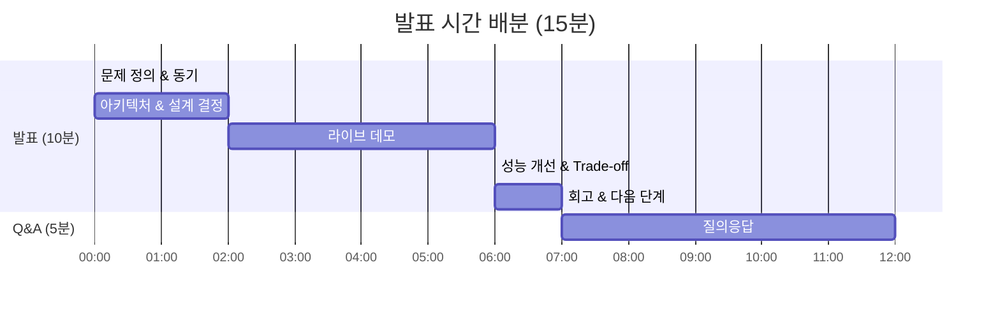
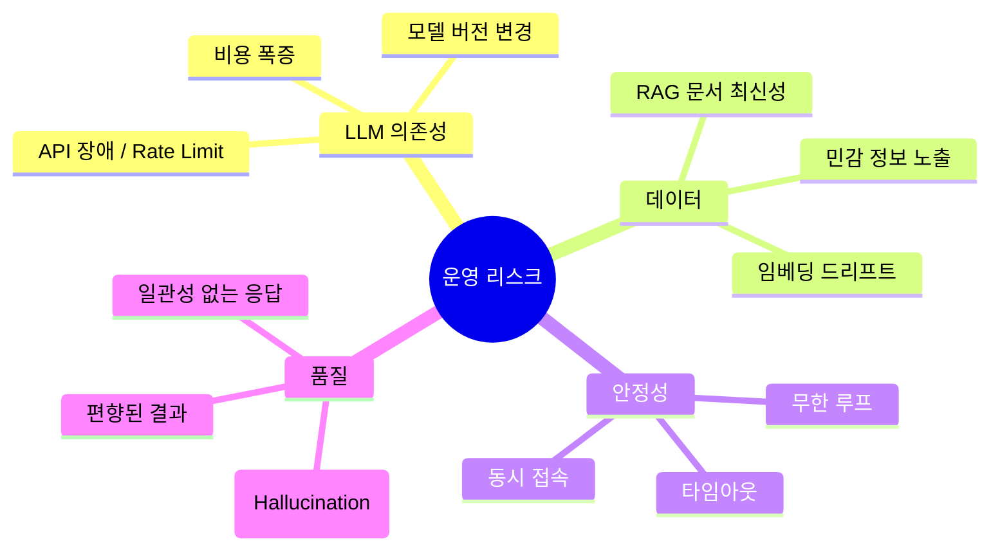
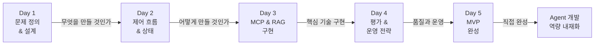
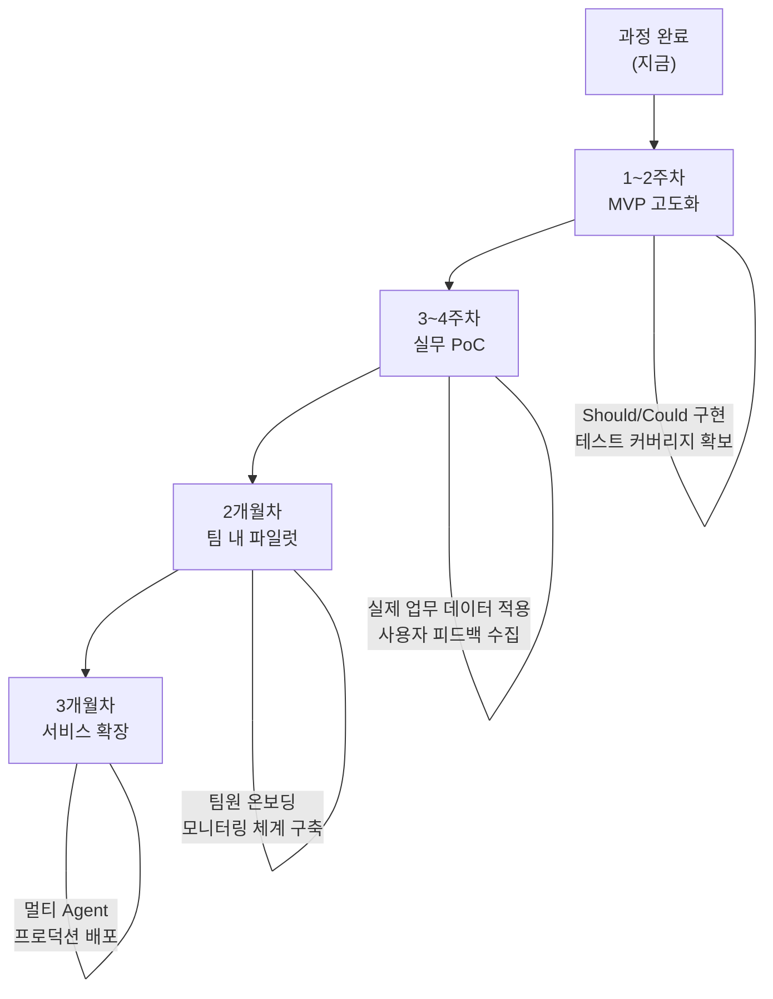

# Day 5 - Session 4: 최종 시연 및 발표 (2h)

> 발표 ~90분 / 마무리 ~30분

## 학습 목표

이 세션을 마치면 다음을 할 수 있습니다:

1. Agent 프로젝트의 설계-구현-개선 과정을 체계적으로 발표할 수 있다
2. 아키텍처 선택의 trade-off를 설명할 수 있다
3. 성능 개선 결과를 정량적으로 제시할 수 있다
4. 운영 리스크와 대응 전략을 설명할 수 있다
5. 동료의 발표에 건설적인 피드백을 제공할 수 있다

---

## 1. 발표 구조 가이드

### 기본 형식: 10분 Demo + 5분 Q&A

총 15분 = 발표 10분 + 질의응답 5분. 시간을 엄격히 준수한다.



### 시간 배분 상세

| 구간 | 시간 | 내용 |
|------|------|------|
| **문제 정의** | 1분 30초 | Pain 설명, 왜 Agent가 필요한지 |
| **아키텍처** | 2분 | 구조 다이어그램, 왜 이 구조를 선택했는지 |
| **라이브 데모** | 4분 | 실제 실행, 핵심 시나리오 2~3개 |
| **성능 개선** | 1분 30초 | 개선 전/후 비교, trade-off |
| **회고** | 1분 | 잘된 점, 아쉬운 점, 다음 단계 |
| **Q&A** | 5분 | 청중 질문 응답 |

---

## 2. 발표 슬라이드 권장 구성

슬라이드를 별도로 만들 필요 없이, 아래 구성을 **터미널 + 코드 에디터**로 시연해도 된다. 슬라이드를 만든다면 6~8장이 적정이다.

### 권장 슬라이드 구성 (6장)

```
슬라이드 1: 타이틀
  - 프로젝트명, 본인 이름
  - 한 줄 요약 (이 Agent는 무엇을 하는가?)

슬라이드 2: 문제 정의
  - Pain 설명 (구체적 수치 포함)
  - "이 Agent가 해결하는 핵심 문제"

슬라이드 3: 아키텍처
  - 구조 다이어그램 (Mermaid 또는 직접 그린 그림)
  - MCP / RAG / Hybrid 선택 이유

슬라이드 4: 라이브 데모
  - (터미널로 전환하여 실제 실행)

슬라이드 5: 성능 개선
  - 개선 전/후 비교 표
  - 적용한 전략, trade-off

슬라이드 6: 회고 & 다음 단계
  - 잘된 점 / 아쉬운 점
  - 다음에 추가하고 싶은 기능
```

### 발표에서 피해야 할 것

- 코드를 한 줄씩 설명하지 않는다 (아키텍처 수준에서 설명)
- "시간이 부족해서..."를 변명으로 사용하지 않는다 (MVP 범위를 설명)
- 동작하지 않는 기능을 시연하지 않는다 (동작하는 것만 보여준다)

---

## 3. 시연 체크리스트

### 발표 전 준비 (Session 4 시작 전 10분)

```
환경 준비:
[ ] 터미널을 열어 프로젝트 디렉토리로 이동했다
[ ] .env 파일에 API 키가 올바르게 설정되어 있다
[ ] python main.py가 에러 없이 실행된다
[ ] 시연 시나리오 3개를 미리 테스트했다
[ ] (RAG 프로젝트) 데이터가 이미 색인되어 있다

화면 준비:
[ ] 폰트 크기를 청중이 볼 수 있도록 키웠다 (터미널 + 에디터)
[ ] 불필요한 탭/창을 닫았다
[ ] 알림을 끄거나 방해금지 모드를 설정했다
```

### 시연 시 원칙

1. **Happy Path 먼저**: 가장 잘 동작하는 시나리오를 첫 번째로 시연
2. **Edge Case는 선택**: 시간이 되면 보여주되, 필수는 아님
3. **실패해도 당황하지 않기**: "이 부분은 개선이 필요한 영역입니다"로 전환
4. **타이머 확인**: 데모는 4분 이내. 시나리오당 1~2분

### 시연 시나리오 템플릿

각 시나리오는 아래 형식으로 미리 준비한다.

```
시나리오 1: [시나리오 이름]
  입력: "..."
  기대 동작: ...
  소요 시간: ~1분
  보여줄 포인트: [핵심 기능 / Tool 호출 / RAG 검색 등]

시나리오 2: [시나리오 이름]
  입력: "..."
  기대 동작: ...
  소요 시간: ~1분
  보여줄 포인트: [다른 기능 / 에러 핸들링 등]

시나리오 3 (선택): [Edge Case]
  입력: "..."
  기대 동작: ...
  소요 시간: ~1분
  보여줄 포인트: [Validation / 폴백 등]
```

---

## 4. Q&A 대응 전략

### 자주 나오는 질문 유형과 대응

| 질문 유형 | 예시 | 대응 전략 |
|----------|------|----------|
| **설계 선택** | "왜 RAG 대신 MCP를 선택했나요?" | 의사결정 매트릭스 기반으로 근거 설명 |
| **한계점** | "이 Agent가 처리 못하는 경우는?" | Won't Have 목록 + 향후 개선 방향 |
| **성능** | "응답 시간이 느린데 어떻게 개선할 계획인가요?" | Trade-off 분석 + 구체적 개선 전략 |
| **운영** | "실제 서비스에 배포하려면 뭐가 필요한가요?" | 운영 리스크 목록 + 대응 전략 |
| **비교** | "LangChain 대신 LangGraph를 쓴 이유는?" | 상태 관리, 조건부 분기 등 기술적 근거 |

### Q&A 응답 원칙

1. **모르면 모른다고 말한다**: "좋은 질문인데, 아직 검토하지 못했습니다"
2. **짧게 답한다**: 30초 이내. 길어지면 "이후에 자세히 논의하겠습니다"
3. **감사를 표한다**: 모든 질문에 "좋은 질문 감사합니다"로 시작

---

## 5. 운영 리스크 대응 전략

발표 시 "실제 서비스에 적용한다면?" 질문에 대비하여 아래 항목을 정리해둔다.

### 주요 운영 리스크



### 리스크별 대응 전략

| 리스크 | 대응 전략 |
|-------|----------|
| API 장애 | 재시도(3회) + 폴백 모델(GPT-4o → GPT-4o-mini) |
| Rate Limit | 요청 큐 + 지수 백오프(exponential backoff) |
| 비용 폭증 | 일일 예산 상한 + 토큰 모니터링 알림 |
| 환각 | RAG 기반 답변 강제 + "모르겠습니다" 폴백 |
| 무한 루프 | recursion_limit + 타임아웃 설정 |
| 민감 정보 | 입출력 필터링 + PII 마스킹 |

---

## 6. Best Architecture 선정 기준

전체 발표 후 투표로 Best Architecture를 선정한다.

### 평가 기준 (5점 척도)

| 기준 | 배점 | 설명 |
|------|------|------|
| **문제 적합성** | 20% | Agent가 이 문제에 적합한가? |
| **아키텍처 완성도** | 25% | 구조가 논리적이고 확장 가능한가? |
| **데모 품질** | 25% | 실제 동작하는 MVP인가? |
| **성능 개선** | 15% | 정량적 개선을 보여주었는가? |
| **발표 전달력** | 15% | 설명이 명확하고 시간을 준수했는가? |

### 투표 방식

1. 각 발표 후 평가표에 점수 기록 (자기 자신 제외)
2. 전체 발표 완료 후 집계
3. 최고 점수 + 강사 선정 = Best Architecture

---

## 7. 과정 마무리 및 다음 단계

### 5일간의 학습 여정 정리



### 과정에서 습득한 핵심 역량

```
1. 문제 분석: Pain → Task → Skill → Tool 프레임워크
2. 아키텍처: MCP / RAG / Hybrid 선택과 설계
3. 구현: LangGraph + ChromaDB + MCP 기반 Agent 개발
4. 품질: Golden Test Set + LangSmith 기반 평가·모니터링
5. 운영: 장애 대응, 비용 관리, 확장 전략
```

### 다음 단계: 실무 적용 로드맵



### 추천 학습 자료

```
공식 문서:
- LangGraph 공식 문서: https://langchain-ai.github.io/langgraph/
- MCP 공식 스펙: https://modelcontextprotocol.io/
- LangSmith 가이드: https://docs.smith.langchain.com/

심화 주제:
- Multi-Agent 시스템 (LangGraph의 subgraph)
- Human-in-the-Loop Agent (interrupt / approve 패턴)
- Agent 메모리 관리 (장기 메모리, 요약 메모리)
- 프로덕션 배포 (FastAPI + Docker + 모니터링)
```

### 마무리 메시지

```
Agent 개발은 기술보다 '문제 정의'가 80%입니다.
좋은 문제를 찾았다면, 기술은 이 과정에서 배운 것으로 충분합니다.
MVP를 빠르게 만들고, 사용자 피드백으로 개선하세요.
```

---

## 실습 안내

> **실습명**: 최종 시연 및 발표
> **소요 시간**: 약 120분
> **형태**: 발표 + 피드백 + 마무리

### 발표 진행 순서

```
1. 발표 준비 시간 (10분)
   - 시연 환경 최종 점검
   - 시나리오 리허설

2. 발표 진행 (인원수 x 15분)
   - 발표자: 10분 Demo + 5분 Q&A
   - 청중: 평가표 기록

3. Best Architecture 선정 (10분)
   - 투표 집계
   - 강사 코멘트
   - 수상자 발표

4. 과정 마무리 (20분)
   - 5일간 학습 여정 정리
   - 다음 단계 안내
   - 과정 설문
```

**산출물**: 발표 완료 + 평가표 제출 + 성능 리포트 최종본

---

## 핵심 요약

```
발표 = 10분 Demo(문제→아키텍처→시연→성능→회고) + 5분 Q&A
시연 = Happy Path 먼저, 동작하는 것만, 시나리오당 1~2분
Q&A = 짧게 답변, 모르면 모른다고, 감사 표현
선정 기준 = 문제 적합성 + 아키텍처 + 데모 + 성능 + 전달력
```
