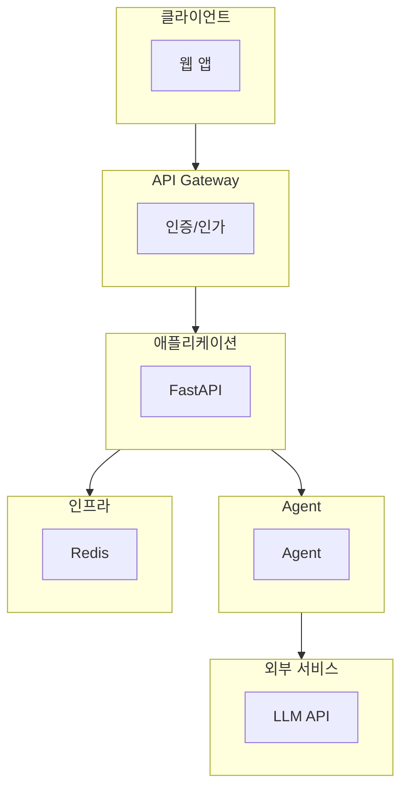

# Agent 서비스 아키텍처 설계서

> 작성자: _______________
> 작성일: _______________
> Agent 이름: _______________

---

## 1. 서비스 개요

| 항목 | 내용 |
|------|------|
| 서비스명 | |
| 목적 | |
| 대상 사용자 | |
| 예상 동시 접속자 | |
| SLA 목표 | (예: 99.9%) |

---

## 2. 전체 아키텍처 다이어그램

> 아래 Mermaid 다이어그램을 수정하여 자신의 아키텍처를 그리세요.

---

## 3. 환경 분리 전략

### Dev 환경

| 항목 | 설정 |
|------|------|
| LLM 모델 | (예: gpt-4o-mini) |
| 외부 서비스 | (Mock / 실제) |
| 비용 한도 | $/일 |
| 모니터링 | (On / Off) |
| Guardrail | (On / Off) |

### Staging 환경

| 항목 | 설정 |
|------|------|
| LLM 모델 | |
| 외부 서비스 | |
| 비용 한도 | $/일 |
| 모니터링 | |
| Golden Test 통과 | (필수 / 선택) |

### Prod 환경

| 항목 | 설정 |
|------|------|
| LLM 모델 | |
| 외부 서비스 | |
| 비용 한도 | $/일 |
| 모니터링 | |
| Guardrail | |
| 알럿 | |

---

## 4. Scaling 전략

### 4.1 현재 예상 트래픽

| 시간대 | 요청/분 | 특이사항 |
|--------|---------|---------|
| 평시 | | |
| 피크 | | |
| 야간 | | |

### 4.2 확장 계획

> 해당하는 전략에 체크하고 세부 사항을 작성하세요.

- [ ] **수평 확장**: 서버 인스턴스 추가
  - 트리거 조건: (예: CPU > 70%)
  - 최대 인스턴스:
  - Auto-scaling 설정:

- [ ] **비동기 처리**: 큐 기반 백그라운드
  - 대상 작업: (예: 보고서 생성, 대량 분석)
  - 큐 시스템: (Redis Queue / Celery / etc.)

- [ ] **응답 캐싱**: 동일 요청 재활용
  - 캐시 대상: (어떤 유형의 응답?)
  - TTL: (초)
  - 무효화 전략:

- [ ] **모델 티어링**: 복잡도별 모델 분기
  - Simple: (모델명)
  - Standard: (모델명)
  - Complex: (모델명)

---

## 5. Multi-Agent 적용 여부

### 판단 기준

- [ ] 도메인이 2개 이상 (예: 고객지원 + 데이터분석)
- [ ] 작업 유형별 전문화가 필요
- [ ] 병렬 처리로 성능 향상 가능
- [ ] 독립적 확장이 필요

### 판단 결과

- 적용 여부: (Yes / No)
- 근거:

### (적용 시) Agent 구성

| Agent | 역할 | 모델 | 도구 |
|-------|------|------|------|
| | | | |
| | | | |

---

## 6. 보안 설계

| 항목 | 구현 방법 |
|------|----------|
| API 키 관리 | (환경변수 / Secret Manager) |
| 인증 | (JWT / API Key / OAuth) |
| Rate Limiting | (요청/분) |
| Pre-Guardrail | (인젝션 탐지, 입력 검증) |
| Post-Guardrail | (PII 마스킹, 유해 콘텐츠 차단) |

---

## 7. 모니터링 계획

| 항목 | 도구 | 알럿 조건 |
|------|------|----------|
| Trace 로그 | LangSmith | |
| 성공률 | | < ___% |
| 지연시간 | | P95 > ___ms |
| 비용 | | > $___/일 |
| 에러 | | > ___건/시간 |

---

## 8. 배포 전략

- [ ] CI/CD 파이프라인 구성
- [ ] Golden Test 자동 실행
- [ ] Canary 배포 / Blue-Green 배포
- [ ] 롤백 절차 문서화
