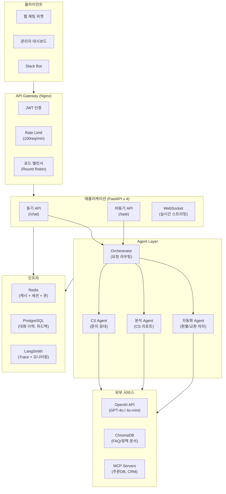
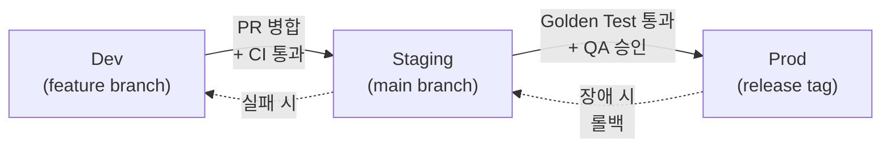
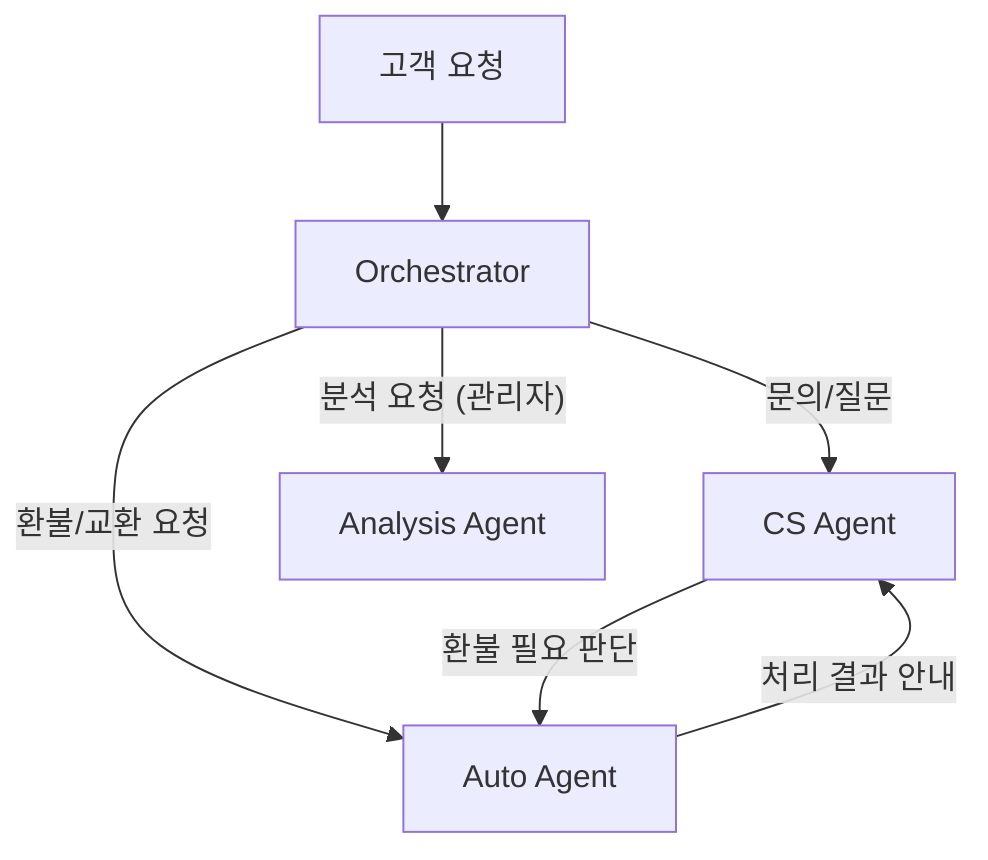

# Agent 서비스 아키텍처 설계서 (모범 답안)

> 작성자: 강사
> 작성일: 2025-01-15
> Agent 이름: SmartCS - 지능형 고객 지원 Agent

---

## 1. 서비스 개요

| 항목 | 내용 |
|------|------|
| 서비스명 | SmartCS (Smart Customer Support) |
| 목적 | 고객 문의를 자동으로 분류, 응답, 처리하여 CS 팀의 생산성을 3배 향상 |
| 대상 사용자 | 고객(B2C), CS 상담원(내부) |
| 예상 동시 접속자 | 평시 50명, 피크 200명 |
| SLA 목표 | 99.9% (월간 다운타임 43분 이내) |

---

## 2. 전체 아키텍처 다이어그램



---

## 3. 환경 분리 전략

### Dev 환경

| 항목 | 설정 |
|------|------|
| LLM 모델 | gpt-4o-mini (비용 절감) |
| 외부 서비스 | Mock (주문DB, CRM) |
| 비용 한도 | $5/일 |
| 모니터링 | On (LangSmith dev 프로젝트) |
| Guardrail | Off (개발 편의) |
| 서버 | 로컬 1대 |
| Vector DB | 로컬 ChromaDB (소규모 테스트 데이터) |

### Staging 환경

| 항목 | 설정 |
|------|------|
| LLM 모델 | gpt-4o (프로덕션과 동일) |
| 외부 서비스 | 실제 연동 (테스트 계정) |
| 비용 한도 | $50/일 |
| 모니터링 | On (LangSmith staging 프로젝트) |
| Golden Test 통과 | 필수 (배포 차단 조건) |
| 서버 | 2대 |
| Vector DB | ChromaDB (전체 데이터) |

### Prod 환경

| 항목 | 설정 |
|------|------|
| LLM 모델 | gpt-4o (복잡) / gpt-4o-mini (단순) |
| 외부 서비스 | 실제 연동 (프로덕션 계정) |
| 비용 한도 | $500/일 |
| 모니터링 | On (LangSmith prod 프로젝트) |
| Guardrail | On (Pre + Post 모두 활성) |
| 알럿 | Slack + PagerDuty |
| 서버 | 4대 (Auto-scaling 2~8) |
| Vector DB | ChromaDB 클러스터 |

### 배포 흐름



---

## 4. Scaling 전략

### 4.1 예상 트래픽

| 시간대 | 요청/분 | 특이사항 |
|--------|---------|---------|
| 평시 (10-18시) | 30-50 | 일반 문의 |
| 피크 (점심, 퇴근) | 100-150 | 주문/배송 문의 집중 |
| 야간 (22-08시) | 5-10 | 자동 응답만 |
| 이벤트/세일 | 300+ | 환불/교환 폭증 |

### 4.2 확장 계획

- [x] **수평 확장**: 서버 인스턴스 추가
  - 트리거 조건: CPU > 70% 또는 응답 시간 P95 > 5초
  - 최소 인스턴스: 2대
  - 최대 인스턴스: 8대
  - Auto-scaling: AWS ECS + CloudWatch 기반

- [x] **비동기 처리**: 큐 기반 백그라운드
  - 대상 작업: 환불 처리, CS 리포트 생성, 대량 분석
  - 큐 시스템: Redis Queue (rq)
  - Worker: 별도 2대 (독립 스케일링)
  - 타임아웃: 작업당 최대 5분

- [x] **응답 캐싱**: 동일 요청 재활용
  - 캐시 대상: FAQ 응답, 정책 안내 (temperature=0 응답)
  - TTL: 3600초 (1시간)
  - 무효화: 정책 문서 업데이트 시 관련 캐시 삭제
  - 예상 캐시 적중률: 25-30% (FAQ 비중)

- [x] **모델 티어링**: 복잡도별 모델 분기
  - Simple (FAQ, 단순 안내): gpt-4o-mini ($0.15/1M input)
  - Standard (일반 문의): gpt-4o-mini ($0.15/1M input)
  - Complex (복합 문의, 분석): gpt-4o ($2.50/1M input)
  - 비율: Simple 40%, Standard 35%, Complex 25%

---

## 5. Multi-Agent 적용

### 판단 기준

- [x] 도메인이 2개 이상: 고객 응대 + 데이터 분석 + 자동 처리
- [x] 작업 유형별 전문화 필요: CS / 분석 / 자동화
- [ ] 병렬 처리로 성능 향상: 대부분 순차 처리
- [x] 독립적 확장 필요: 분석 Agent는 야간 배치 전용

### 판단 결과

- 적용 여부: **Yes**
- 근거: 고객 응대(실시간), 데이터 분석(배치), 자동 처리(트랜잭션)는 요구사항이 완전히 다르다. 하나의 Agent에 모두 담으면 프롬프트가 비대해지고 성능이 하락한다.

### Agent 구성

| Agent | 역할 | 모델 | 도구 |
|-------|------|------|------|
| Orchestrator | 요청 분류 및 라우팅 | gpt-4o-mini | 없음 (분류만) |
| CS Agent | 고객 문의 응대 | gpt-4o / gpt-4o-mini | search_kb, lookup_order |
| Analysis Agent | CS 데이터 분석, 리포트 | gpt-4o | query_db, generate_chart |
| Auto Agent | 환불/교환 자동 처리 | gpt-4o-mini | process_refund, process_exchange |

### 라우팅 규칙



---

## 6. 보안 설계

| 항목 | 구현 방법 |
|------|----------|
| API 키 관리 | AWS Secrets Manager + 환경변수 주입 |
| 인증 | JWT (고객), API Key (내부 서비스) |
| Rate Limiting | 고객: 20req/min, 관리자: 100req/min |
| Pre-Guardrail | 프롬프트 인젝션 탐지 (정규식 + LLM 검증) |
| Post-Guardrail | PII 마스킹 (전화번호, 이메일, 카드번호) |
| 데이터 보존 | 대화 이력 90일 보관 후 자동 삭제 |

---

## 7. 모니터링 계획

| 항목 | 도구 | 알럿 조건 | 알럿 채널 |
|------|------|----------|----------|
| Trace 로그 | LangSmith | - | 대시보드 |
| 성공률 | LangSmith + Custom | < 95% | Slack Critical |
| 지연시간 | LangSmith + Custom | P95 > 5000ms | Slack Warning |
| 비용 | Custom Tracker | > $300/일 | Slack + Email |
| 에러 | LangSmith | > 5건/시간 | Slack + PagerDuty |
| 캐시 적중률 | Redis Metrics | < 20% | Slack Info |

---

## 8. 배포 전략

- [x] CI/CD: GitHub Actions (lint + test + Golden Test + deploy)
- [x] Golden Test: 50개 테스트 케이스 전부 통과 필수
- [x] 배포 방식: Blue-Green (무중단)
- [x] 롤백: 이전 컨테이너 이미지로 즉시 롤백 (< 5분)
- [x] Feature Flag: 새 기능은 Flag로 제어 → 점진적 롤아웃

### 배포 체크리스트

```
[ ] 코드 리뷰 완료
[ ] 단위 테스트 통과
[ ] Golden Test 통과 (Staging)
[ ] 성능 테스트 완료 (P95 < 5초)
[ ] Guardrail 동작 확인
[ ] 롤백 절차 확인
[ ] 모니터링 알럿 설정 확인
[ ] 배포 공지 (Slack)
```
