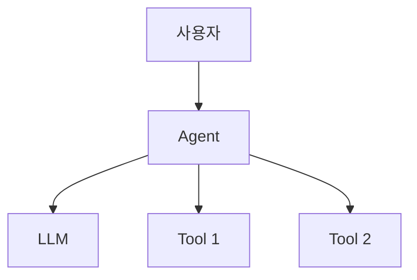

# 프로젝트 설계서

## 1. 기본 정보

| 항목 | 내용 |
|------|------|
| 프로젝트명 | |
| 작성자 | |
| 날짜 | |
| 아키텍처 | MCP / RAG / Hybrid (택1) |

## 2. 문제 정의

### Pain (고통점)

> 어떤 업무가, 누구에게, 얼마나 고통스러운가? 구체적 수치를 포함한다.

```
Pain:


현재 소요 시간:
영향 범위:
```

### Task 분해

```
1.
2.
3.
4.
5.
```

### Skill → Tool 매핑

| Task | 필요 Skill | 구현 Tool |
|------|-----------|----------|
| | | |
| | | |
| | | |
| | | |
| | | |

### Agent 패턴

- [ ] 자동화형 Agent
- [ ] 분석형 Agent
- [ ] Planner형 Agent

선택 이유:

## 3. 아키텍처 설계

### 구조 선택 근거

왜 이 구조(MCP/RAG/Hybrid)를 선택했는가?

```
1.
2.
3.
```

### 아키텍처 다이어그램



> TODO: 프로젝트에 맞게 다이어그램을 수정하세요.

### 기술 스택

| 카테고리 | 선택 | 이유 |
|----------|------|------|
| LLM | GPT-4o / Claude | |
| 프레임워크 | LangGraph | |
| Vector DB | ChromaDB (해당 시) | |
| 외부 API | | |
| 기타 | | |

## 4. MVP 범위 (MoSCoW)

### Must Have (필수 — 이것 없이는 데모 불가)

```
1.
2.
3.
```

### Should Have (권장 — 품질이 눈에 띄게 향상)

```
1.
2.
```

### Could Have (선택 — 시간이 남으면)

```
1.
2.
```

### Won't Have (제외 — 이번 MVP에서 명시적으로 안 함)

```
1.
2.
```

## 5. 평가 기준

### 정량 지표

| 지표 | 목표값 | 측정 방법 |
|------|-------|----------|
| | | |
| | | |
| | | |

### Golden Test Set 요약

| 카테고리 | 건수 | 설명 |
|----------|------|------|
| Happy Path | 5건 | 정상 시나리오 |
| Edge Case | 3건 | 경계값, 예외 입력 |
| Failure Case | 2건 | 의도된 실패 |

## 6. 구현 계획

### Session 2 (2시간) — 핵심 기능 구현

```
0~45분:
45~75분:
75~90분:
90~105분:
```

### Session 3 (2시간) — 성능 개선 & 안정화

```
0~10분: Golden Test Set 실행 (baseline)
10~50분: 개선 루프
50~75분: 안정화
75~95분: 리포트 작성 + 발표 준비
```

## 7. 리스크

| 리스크 | 영향 | 대응 |
|-------|------|------|
| | | |
| | | |
| | | |

---

> 강사 확인: [ ] 승인 / [ ] 수정 요청
>
> 코멘트:
