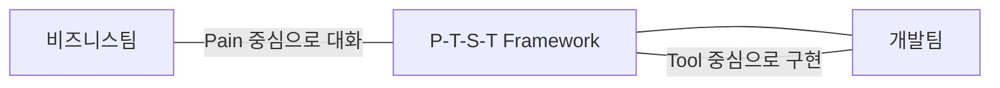
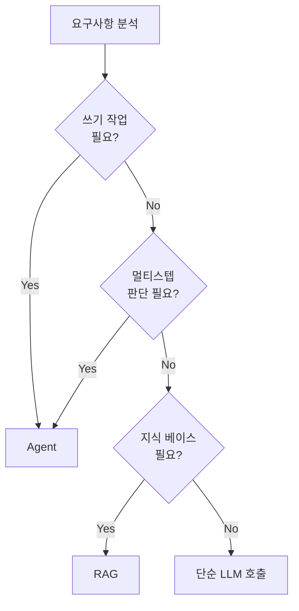

# Session 1
## Agent 문제 정의와 과제 도출

<div class="absolute bottom-10 left-10 text-xl font-medium opacity-80">
  AI Agent 개발 과정
</div>

<!--
[스크립트]
안녕하세요. AI 에이전트 개발 과정의 첫 번째 세션인 '에이전트 문제 정의와 과제 도출'을 시작해 보겠습니다. 
우리는 단순히 유행을 따르는 것이 아니라, 실제로 비즈니스 가치를 만들어낼 수 있는 에이전트를 설계하는 법을 배울 것입니다. 
준비되셨나요?

전환: 먼저 오늘 우리가 무엇을 배울지 학습 목표부터 살펴보겠습니다.
시간: 1분
-->

---

# 1. 학습 목표

<v-clicks>

- **AI Agent가 적합한 문제 유형**과 부적합한 문제 유형 구분
- **Pain - Task - Skill - Tool 프레임워크**로 업무 체계적 분해
- **RAG와 Agent의 구조적 차이** 이해 및 아키텍처 선택

</v-clicks>

<div class="mt-20 bg-blue-50 dark:bg-blue-900/30 p-6 rounded-xl border-l-6 border-blue-500">
  <p class="text-lg">"도구(Tool)를 정하기 전에 <strong>문제</strong>부터 정의합니다."</p>
</div>

<!--
[스크립트]
이번 세션의 학습 목표는 크게 세 가지입니다. 
[클릭] 첫째, 어떤 문제가 에이전트에 적합하고 어떤 문제가 부적합한지 명확히 구분하는 기준을 세울 것입니다. 모든 문제에 에이전트가 필요한 것은 아니니까요. 
[클릭] 둘째, 업무를 체계적으로 쪼개는 Pain-Task-Skill-Tool 프레임워크를 익힐 것입니다. 
[클릭] 셋째, 요즘 많이 쓰는 RAG와 에이전트의 차이를 이해하고 상황에 맞는 선택을 할 수 있게 됩니다. 

가장 중요한 것은 하단의 문구처럼, 도구보다 문제를 먼저 정의하는 습관을 들이는 것입니다.

전환: 그럼 첫 번째 개념인 에이전트 적합 문제 유형에 대해 알아보겠습니다.
시간: 1분
-->

---
layout: section
---

# 1. Agent가 적합한 문제 유형 정의
## "이 문제가 정말 Agent가 필요한가?"

<!--
[스크립트]
첫 번째 챕터입니다. 에이전트를 만들기 전에 우리는 스스로에게 이 질문을 던져야 합니다. "이 문제가 정말 에이전트가 필요한가?"
2023년부터 많은 기업이 에이전트 도입을 시도했지만, 상당수가 이 질문에 답하지 못해 실패했습니다.

전환: 왜 이 질문이 중요한지 좀 더 자세히 보겠습니다.
시간: 1분
-->

---

# 왜 이것이 중요한가

<v-clicks>

- **유행에 휩쓸린 도입**: 2023~2024년 기업들의 흔한 실패 사례
- **불필요한 복잡성**: 단순 스크립트로 풀 수 있는 문제를 어렵게 해결
- **리소스 낭비**: 비용 대비 효과가 낮은 곳에 엔지니어링 집중

</v-clicks>

<div v-click class="mt-12 text-center text-2xl font-black text-red-500">
  "무조건적인 에이전트 도입은 독입니다."
</div>

<!--
[스크립트]
왜 이게 중요할까요? 
[클릭] 최근 몇 년간 에이전트라는 단어가 유행하면서 많은 기업이 무조건적으로 도입을 시도했습니다. 
[클릭] 하지만 단순한 스크립트나 자동화 도구로 풀 수 있는 문제에 에이전트를 쓰면 불필요한 복잡성만 늘어납니다. 
[클릭] 결과적으로 개발 비용과 시간만 낭비하게 되죠. 
[클릭] 그래서 우리는 에이전트 도입이 독이 되지 않도록 명확한 기준을 가져야 합니다.

전환: 그렇다면 에이전트와 전통적인 자동화는 어떻게 다를까요?
시간: 1분
-->

---

# 전통적 자동화 vs AI Agent

<div class="grid grid-cols-2 gap-8 mt-10">
  <div class="bg-gray-50 dark:bg-gray-800 p-6 rounded-xl border-t-4 border-gray-400">
    <h3 class="mb-4">전통적 자동화</h3>
    <ul class="space-y-3 opacity-80">
      <li>사전 정의된 <strong>고정 경로</strong> 실행</li>
      <li>입력이 같으면 결과도 <strong>항상 동일</strong></li>
      <li>ETL, 크론잡, 단순 스크립트</li>
    </ul>
  </div>
  <div v-click class="bg-blue-50 dark:bg-blue-900/30 p-6 rounded-xl border-t-4 border-blue-500">
    <h3 class="mb-4">AI Agent</h3>
    <ul class="space-y-3">
      <li>중간 결과를 <strong>관찰(Observe)</strong></li>
      <li>다음 행동을 <strong>동적으로 결정(Think)</strong></li>
      <li>실제 세계에 <strong>영향(Act)</strong></li>
    </ul>
  </div>
</div>

<div v-click class="mt-8 text-center text-xl font-bold bg-yellow-50 p-4 rounded-lg">
  Observe → Think → Act 루프의 존재 여부
</div>

<!--
[스크립트]
전통적인 자동화와 에이전트의 차이를 비교해 보겠습니다.
좌측의 전통적인 자동화는 정해진 경로를 따라갑니다. 입력이 같으면 결과도 100% 똑같습니다. 결정론적이죠.
[클릭] 반면 에이전트는 상황을 관찰하고, 생각하고, 행동합니다. 
[클릭] 이 'Observe-Think-Act' 루프가 에이전트의 핵심입니다. 중간에 예상치 못한 결과가 나와도 에이전트는 '생각'을 해서 경로를 바꿀 수 있습니다.

전환: 구체적으로 어떤 조건일 때 에이전트가 필요할까요?
시간: 2분
-->

---

# Agent가 필요한 3가지 조건

<div class="grid grid-cols-3 gap-4 mt-8">
  <div v-click class="p-4 bg-white dark:bg-gray-800 shadow-lg rounded-xl border-b-6 border-blue-400">
    <div class="text-3xl mb-2">①</div>
    <div class="text-lg font-black mb-2">멀티스텝</div>
    <div class="text-sm opacity-80">작업이 2단계 이상의 순차적 과정을 요구할 때</div>
  </div>
  <div v-click class="p-4 bg-white dark:bg-gray-800 shadow-lg rounded-xl border-b-6 border-green-400">
    <div class="text-3xl mb-2">②</div>
    <div class="text-lg font-black mb-2">동적 판단</div>
    <div class="text-sm opacity-80">상황에 따라 다음 행동이 달라져야 할 때</div>
  </div>
  <div v-click class="p-4 bg-white dark:bg-gray-800 shadow-lg rounded-xl border-b-6 border-purple-400">
    <div class="text-3xl mb-2">③</div>
    <div class="text-lg font-black mb-2">도구 활용</div>
    <div class="text-sm opacity-80">외부 API, DB 등 실세계와 상호작용할 때</div>
  </div>
</div>

<div v-click class="mt-12 p-4 bg-red-50 text-red-700 rounded-lg text-center font-medium">
  "하나라도 부족하다면 단순 스크립트나 LLM API로 충분할 수 있습니다."
</div>

<!--
[스크립트]
에이전트 도입을 결정하는 세 가지 조건입니다. 
[클릭] 첫째, 멀티스텝입니다. 한 번의 호출로 끝나는 게 아니라 여러 단계를 거쳐야 합니다. 
[클릭] 둘째, 동적 판단입니다. 중간 결과에 따라 분기가 생기고 LLM이 판단해야 하는 경우입니다. if-else로 다 처리할 수 있다면 에이전트가 필요 없습니다. 
[클릭] 셋째, 도구 활용입니다. LLM만으론 정보를 읽기만 하지만, 에이전트는 API를 통해 실제 행동을 합니다. 
[클릭] 이 세 가지가 모두 충족될 때 비로소 에이전트의 진가가 발휘됩니다.

전환: 실무에서 흔히 비교되는 RPA와는 어떤 차이가 있을까요?
시간: 2분
-->

---

# RPA vs AI Agent

| 구분 | RPA | AI Agent |
|------|-----|----------|
| **동작 방식** | UI 수준 클릭/입력 재현 | API 수준 동적 판단 |
| **판단 능력** | 고정 규칙 의존 (Hard-coded) | LLM 기반 유연한 판단 |
| **회복 탄력성** | UI 변경 시 즉시 깨짐 | 상황 변화에 유연하게 대응 |
| **비용 구조** | LLM 호출 비용 없음 | 높은 LLM 토큰 비용 |

<div v-click class="mt-8 text-blue-600 font-bold italic">
  "RPA는 손발을 대신하고, AI Agent는 뇌를 대신합니다."
</div>

<!--
[스크립트]
현업에서 이미 많이 쓰고 계신 RPA와 비교해 볼까요? 
RPA는 사람이 하는 클릭을 그대로 흉내 냅니다. 고정된 규칙이 있죠. 
하지만 에이전트는 유연한 판단을 합니다. 
[클릭] 한마디로 요약하면, RPA는 정해진 일만 하는 '손발'이라면, 에이전트는 상황을 판단하는 '뇌' 역할을 포함합니다.

전환: 코드를 통해 이 차이를 더 명확히 이해해 보겠습니다.
시간: 2분
-->

---

# 코드 예제: 자동화 vs Agent

<div class="grid grid-cols-2 gap-4 h-[400px]">

```python {all|2-5|all}
# 단순 자동화: 고정 흐름
def automation(data):
    cleaned = clean(data)
    result = transform(cleaned)
    save(result)
    return result
```

```python {all|3|5-12|all}
# Agent: 동적 판단 루프
def agent_workflow(task):
    plan = llm.think(task)
    while not plan.done():
        step = plan.next()
        if step.needs_data():
            # 관찰 및 수집
            data = search(step.q)
            plan.update(data)
        elif step.needs_act():
            # 도구 활용 및 행동
            act(step.tool)
```

</div>

<!--
[스크립트]
코드 레벨에서 차이를 보시죠. 
왼쪽의 자동화는 경로가 정해져 있습니다. 에러 처리를 제외하면 분기가 거의 없죠. 
[클릭] 하지만 오른쪽 에이전트 코드를 보십시오. [클릭] 루프가 돕니다. 중간에 데이터가 더 필요하면 검색을 하고, 행동이 필요하면 도구를 씁니다. [클릭] 이 모든 과정이 LLM의 '생각(think)'에 기반해 동적으로 결정됩니다.

전환: 이제 퀴즈를 통해 여러분의 이해도를 확인해 보겠습니다.
시간: 3분
-->

---

# 퀴즈: Agent가 필요한 업무는?

<div class="space-y-4">
  <div v-click class="p-4 bg-gray-100 dark:bg-gray-800 rounded-lg border-2 border-transparent" id="q1">
    1. CSV 파일 1000개의 컬럼명을 일괄 변경
  </div>
  <div v-click class="p-4 bg-gray-100 dark:bg-gray-800 rounded-lg border-2 border-transparent" id="q2">
    2. 고객 리뷰 분석 → 개선점 도출 → Jira 티켓 생성
  </div>
  <div v-click class="p-4 bg-gray-100 dark:bg-gray-800 rounded-lg border-2 border-transparent" id="q3">
    3. 사내 위키에서 특정 키워드로 문서 검색
  </div>
  <div v-click class="p-4 bg-gray-100 dark:bg-gray-800 rounded-lg border-2 border-transparent" id="q4">
    4. 매일 9시에 서버 상태를 Slack으로 알림
  </div>
</div>

<v-click>
<style>
  .correct { border-color: #10b981 !important; background-color: #ecfdf5 !important; }
</style>
<script setup>
  // Note: Handled via v-click-hide and v-click classes in actual slidev, 
  // here we use simple class application logic.
</script>
</v-click>

<div v-click class="mt-8 p-4 bg-green-50 rounded-lg">
  <strong>정답: 2번</strong> (분석/판단 + 멀티스텝 + Jira API 도구 활용)
</div>

<!--
[스크립트]
다음 중 에이전트가 가장 적합한 업무는 무엇일까요?
[클릭] 1번, 일괄 변경은 스크립트가 훨씬 빠르고 저렴합니다.
[클릭] 2번, 리뷰를 분석해서 판단하고, 단계를 거쳐 티켓을 만드는 것. 어떻습니까?
[클릭] 3번, 단순 검색은 RAG로 충분합니다.
[클릭] 4번, 시간 맞춰 알림 보내는 건 크론잡이면 됩니다.
[클릭] 정답은 2번입니다. 에이전트의 세 가지 조건(멀티스텝, 동적 판단, 도구 활용)을 모두 갖췄기 때문입니다.

전환: 그럼 이런 에이전트를 어떻게 설계해야 할까요? 두 번째 개념으로 넘어가겠습니다.
시간: 3분
-->

---
layout: section
---

# 2. Pain - Task - Skill - Tool 프레임워크
## 기술이 아닌 문제에서 시작하기

<!--
[스크립트]
두 번째 파트는 설계 방법론입니다. 에이전트를 만들 때 가장 많이 하는 실수가 "도구부터 고르는 것"입니다. 
우리는 'Pain'에서 시작하는 4단계 프레임워크를 배울 것입니다.

전환: 왜 도구보다 고통(Pain)이 먼저일까요?
시간: 1분
-->

---

# 설계의 함정: Tool-first 접근

<div class="flex items-center justify-center h-80">
  <div class="text-center">
    <div class="text-6xl mb-6">🔨</div>
    <div class="text-2xl font-black">"망치를 들면 모든 것이 못으로 보인다"</div>
    <div class="mt-4 opacity-70">기술(LLM, Vector DB)이 있으니 문제를 억지로 끼워 맞춤</div>
  </div>
</div>

<v-clicks>

- **데모용 산출물**: 실제 업무에선 아무도 안 씀
- **오버엔지니어링**: RAG가 필요 없는 곳에 RAG 적용
- **가치 검증 실패**: AI 프로젝트의 70%가 PoC에서 중단 (McKinsey 2024)

</v-clicks>

<!--
[스크립트]
"망치를 들면 모든 것이 못으로 보인다"는 말이 있죠. 
[클릭] 도구부터 정하면 실제론 필요 없는 기술을 억지로 쓰게 됩니다. 
[클릭] 결과적으로 데모는 화려하지만 실무에선 안 쓰는 물건이 나오고, 
[클릭] 결국 70%의 AI 프로젝트가 실사용에 이르지 못하고 실패하게 됩니다.

전환: 이를 방지하기 위한 Top-Down 접근법을 소개합니다.
시간: 2분
-->

---

# Pain → Task → Skill → Tool

<div class="grid grid-cols-4 gap-2 mt-10">
  <div class="p-4 bg-red-50 dark:bg-red-900/20 rounded-lg">
    <div class="font-black text-red-600 mb-2">Pain</div>
    <div class="text-xs">비즈니스 비효율<br><strong>"왜 만드는가?"</strong></div>
  </div>
  <div class="flex items-center justify-center text-2xl opacity-30">→</div>
  <div class="p-4 bg-orange-50 dark:bg-orange-900/20 rounded-lg">
    <div class="font-black text-orange-600 mb-2">Task</div>
    <div class="text-xs">구체적 작업 단위<br><strong>"무엇을 하는가?"</strong></div>
  </div>
  <div class="flex items-center justify-center text-2xl opacity-30">→</div>
  <div class="p-4 bg-green-50 dark:bg-green-900/20 rounded-lg">
    <div class="font-black text-green-600 mb-2">Skill</div>
    <div class="text-xs">필요한 능력<br><strong>"무엇이 필요한가?"</strong></div>
  </div>
  <div class="flex items-center justify-center text-2xl opacity-30">→</div>
  <div class="p-4 bg-blue-50 dark:bg-blue-900/20 rounded-lg">
    <div class="font-black text-blue-600 mb-2">Tool</div>
    <div class="text-xs">구체적 기술 구현체<br><strong>"무엇으로 푸는가?"</strong></div>
  </div>
</div>

<v-clicks>

- **Pain**: 주당 소비 시간 등 수치화된 고통 (예: 주간 보고서 3시간)
- **Task**: 반복되는 동사 추출 (예: Jira 데이터 수집, 요약)
- **Skill**: 에이전트의 역량 (예: 자연어 요약, API 연동)
- **Tool**: 교체 가능한 기술 (예: GPT-4o, Slack API)

</v-clicks>

<!--
[스크립트]
이게 바로 Pain-Task-Skill-Tool 프레임워크입니다. 
[클릭] 먼저 '고통'을 정의합니다. 단순히 "불편하다"가 아니라 "일주일에 몇 시간을 쓴다"처럼 수치화해야 합니다. 
[클릭] 그 다음 그 고통을 없애기 위한 구체적 '작업'을 동사 위주로 뽑아냅니다. 
[클릭] 그 작업을 하기 위한 '능력'을 정의하고, 
[클릭] 마지막에 그 능력을 구현할 가장 최적의 '도구'를 선택합니다. 도구는 언제든 더 좋은 걸로 바뀔 수 있습니다.

전환: 이 프레임워크의 진짜 가치는 소통에 있습니다.
시간: 3분
-->

---

# 실무 가치: 이해관계자 소통



<v-clicks>

- **공통 언어**: 기술 논쟁을 비즈니스 가치 논쟁으로 전환
- **범위 제어**: 불필요한 기능 추가(Feature Creep) 방지
- **유연성**: 특정 모델이나 DB에 종속되지 않는 설계

</v-clicks>

<!--
[스크립트]
개발팀은 도구 얘기만 하고 싶어 하고, 비즈니스팀은 고통만 호소합니다. 
[클릭] 이 프레임워크는 그 둘 사이의 다리 역할을 합니다. 
[클릭] "이 기능이 왜 필요한가?"라는 질문에 대해 명확한 근거를 제공하며 범위를 관리해 줍니다. 
[클릭] 또한 기술 종속성에서 벗어나 더 유연한 설계를 가능하게 합니다.

전환: 이제 퀴즈를 통해 직접 Task를 도출해 봅시다.
시간: 2분
-->

---

# 퀴즈: Pain에서 Task 도출하기

<div class="p-6 bg-red-50 rounded-xl mb-6">
  <strong>Pain:</strong> "매주 주간 보고서 작성에 3시간이 걸립니다. Jira 티켓 정리, Git 요약, Slack 논의 정리를 수동으로 하고 있어요."
</div>

<v-clicks>

- **Task 1**: Jira에서 완료된 티켓 데이터 수집
- **Task 2**: Git 커밋 내역 요약
- **Task 3**: Slack에서 주요 의사결정 내용 추출
- **Task 4**: 수집된 정보를 템플릿에 맞게 종합

</v-clicks>

<div v-click class="mt-8 p-4 bg-blue-50 border-l-4 border-blue-500">
  <p class="font-bold">Skill: API 호출 능력, 텍스트 요약 능력, 문서 생성 능력</p>
</div>

<!--
[스크립트]
이런 고통이 있다고 해봅시다. 여기서 어떤 작업을 추출할 수 있을까요? 
[클릭] 지라 데이터 수집, [클릭] 깃 커밋 요약, [클릭] 슬랙 내용 추출, [클릭] 그리고 마지막으로 보고서 작성입니다. 
[클릭] 이렇게 작업을 쪼개고 나면 각 단계에 필요한 능력이 무엇인지 명확해집니다. 이게 바로 에이전트 설계의 시작입니다.

전환: 에이전트를 설계할 때 참고할 수 있는 3가지 대표 패턴을 알아보겠습니다.
시간: 3분
-->

---
layout: section
---

# 3. 업무 유형별 Agent 패턴
## 시행착오를 줄이는 설계 청사진

<!--
[스크립트]
세 번째 챕터, 에이전트 패턴입니다. 바닥부터 새로 설계하는 것보다 이미 검증된 패턴을 활용하는 것이 훨씬 빠릅니다.

전환: 어떤 패턴들이 있을까요?
시간: 1분
-->

---

# Agent의 3가지 핵심 패턴

<div class="grid grid-cols-3 gap-6 mt-10">
  <div v-click class="p-6 bg-blue-50 dark:bg-blue-900/20 rounded-2xl text-center">
    <div class="text-4xl mb-4">⚙️</div>
    <h3 class="font-black mb-2">자동화형</h3>
    <p class="text-xs opacity-80">Executor<br>정해진 워크플로우 대행</p>
  </div>
  <div v-click class="p-6 bg-green-50 dark:bg-green-900/20 rounded-2xl text-center">
    <div class="text-4xl mb-4">🔍</div>
    <h3 class="font-black mb-2">분석형</h3>
    <p class="text-xs opacity-80">Analyst<br>데이터 수집 및 통찰 도출</p>
  </div>
  <div v-click class="p-6 bg-purple-50 dark:bg-purple-900/20 rounded-2xl text-center">
    <div class="text-4xl mb-4">📅</div>
    <h3 class="font-black mb-2">계획형</h3>
    <p class="text-xs opacity-80">Planner<br>복잡한 목표 분해 및 관리</p>
  </div>
</div>

<div v-click class="mt-12 text-center text-lg italic">
  "실무에서는 이 패턴들이 <strong>복합적으로</strong> 나타납니다."
</div>

<!--
[스크립트]
에이전트는 목적에 따라 크게 세 가지로 나뉩니다. 
[클릭] 첫째, 자동화형입니다. 사람이 하던 반복 실행을 대신합니다. 
[클릭] 둘째, 분석형입니다. 방대한 데이터를 읽고 보고서를 씁니다. 
[클릭] 셋째, 계획형입니다. 큰 목표를 주면 스스로 단계를 쪼개고 실행합니다. 
[클릭] 실제로는 이 세 가지가 섞여 있는 경우가 많지만, 주 패턴이 무엇인지 정하는 것이 설계의 핵심입니다.

전환: 각 패턴의 설계 포인트를 하나씩 짚어보겠습니다.
시간: 2분
-->

---

# 패턴별 설계 포인트

<div class="space-y-6 mt-8">
  <div v-click class="flex gap-4 p-4 bg-white dark:bg-gray-800 shadow rounded-xl">
    <div class="w-24 font-black text-blue-500">자동화형</div>
    <div class="flex-1 text-sm">Tool 호출의 <strong>안정성</strong>과 실패 시 <strong>에러 복구</strong>가 핵심</div>
  </div>
  <div v-click class="flex gap-4 p-4 bg-white dark:bg-gray-800 shadow rounded-xl">
    <div class="w-24 font-black text-green-500">분석형</div>
    <div class="flex-1 text-sm">데이터 수집의 <strong>완전성</strong>과 분석 결과의 <strong>정확성</strong>이 핵심</div>
  </div>
  <div v-click class="flex gap-4 p-4 bg-white dark:bg-gray-800 shadow rounded-xl">
    <div class="w-24 font-black text-purple-500">계획형</div>
    <div class="flex-1 text-sm">목표 분해의 <strong>품질</strong>과 상황 변화에 따른 <strong>재계획 능력</strong>이 핵심</div>
  </div>
</div>

<!--
[스크립트]
[클릭] 자동화형은 실행이 중요하므로 에러 복구가 핵심입니다. 
[클릭] 분석형은 정보가 누락되면 안 되므로 수집의 완전성이 중요하죠. 
[클릭] 계획형은 머리가 좋아야 합니다. 목표를 얼마나 잘 쪼개고, 계획이 틀어졌을 때 얼마나 잘 수정하느냐가 관건입니다.

전환: 이제 RAG와 에이전트 사이의 선택 기준을 알아보겠습니다.
시간: 2분
-->

---
layout: section
---

# 4. RAG vs Agent 판단 기준
## 아키텍처 의사결정의 핵심

<!--
[스크립트]
마지막 주제입니다. 실무에서 가장 많이 고민하는 문제죠. "RAG로 될까요, 에이전트가 필요할까요?" 
이 둘의 경계를 명확히 해보겠습니다.

전환: 무엇이 가장 큰 차이일까요?
시간: 1분
-->

---

# 핵심 차이: "쓰기 능력(Side Effect)"

<div class="grid grid-cols-2 gap-8 mt-10">
  <div class="bg-gray-100 p-6 rounded-2xl">
    <h3 class="mb-4">RAG</h3>
    <div class="text-4xl mb-4">📖</div>
    <p class="font-bold text-gray-600">본질적으로 읽기 전용 (Read-only)</p>
    <ul class="mt-4 text-sm opacity-70">
      <li>문서 검색 및 답변</li>
      <li>정보 제공이 목적</li>
    </ul>
  </div>
  <div v-click class="bg-blue-50 p-6 rounded-2xl">
    <h3 class="mb-4 text-blue-600">Agent</h3>
    <div class="text-4xl mb-4">✍️</div>
    <p class="font-bold text-blue-600">읽기 + 쓰기 가능 (Read-Write)</p>
    <ul class="mt-4 text-sm opacity-70">
      <li>API 호출, 티켓 생성</li>
      <li>문제 해결이 목적</li>
    </ul>
  </div>
</div>

<div v-click class="mt-10 text-center text-xl font-black text-blue-600">
  "무언가 직접 '처리'해줘야 한다면 에이전트입니다."
</div>

<!--
[스크립트]
RAG와 에이전트의 가장 본질적인 차이는 '쓰기'에 있습니다. 
RAG는 정보를 찾아서 알려주는 데 특화되어 있습니다. 읽기 전용이죠. 
[클릭] 하지만 에이전트는 알려주는 걸 넘어 직접 행동합니다. 이메일을 보내고, 티켓을 만듭니다. 
[클릭] 사용자 요구사항에 "알려줘"가 아니라 "해줘"가 포함되어 있다면 에이전트로 가야 합니다.

전환: 더 세부적인 판단 기준 5가지를 보겠습니다.
시간: 2분
-->

---

# 판단을 위한 5가지 축

<div class="space-y-3 mt-6">
  <div v-click class="grid grid-cols-[150px_1fr] p-2 border-b">
    <div class="font-bold">① 상호작용</div>
    <div class="text-sm opacity-80">1회성 질의응답(RAG) vs 다단계 대화/행동(Agent)</div>
  </div>
  <div v-click class="grid grid-cols-[150px_1fr] p-2 border-b">
    <div class="font-bold">② 외부 연동</div>
    <div class="text-sm opacity-80">검색만 수행(RAG) vs API로 쓰기 작업 수행(Agent)</div>
  </div>
  <div v-click class="grid grid-cols-[150px_1fr] p-2 border-b">
    <div class="font-bold">③ 판단 복잡도</div>
    <div class="text-sm opacity-80">유사도 기반 검색(RAG) vs 추론 및 조건부 분기(Agent)</div>
  </div>
  <div v-click class="grid grid-cols-[150px_1fr] p-2 border-b">
    <div class="font-bold">④ 상태 관리</div>
    <div class="text-sm opacity-80">기본적으로 무상태(RAG) vs 진행 상황 추적(Agent)</div>
  </div>
  <div v-click class="grid grid-cols-[150px_1fr] p-2 border-b">
    <div class="font-bold">⑤ 실패 처리</div>
    <div class="text-sm opacity-80">"모름" 응답(RAG) vs 대안 시도 및 재시도(Agent)</div>
  </div>
</div>

<!--
[스크립트]
상세 판단 기준 5가지입니다. 
[클릭] 상호작용이 단발성인지 멀티턴인지, [클릭] API 쓰기가 있는지, [클릭] 복잡한 추론이 필요한지, [클릭] 상태를 유지해야 하는지, [클릭] 그리고 실패했을 때 다시 시도해야 하는지. 
이 질문들에 '그렇다'고 답할수록 에이전트가 필요하다는 증거입니다.

전환: 이를 흐름도로 그려보면 어떨까요?
시간: 2분
-->

---

# 아키텍처 의사결정 트리



<v-click>
<div class="mt-8 bg-blue-50 p-4 rounded-lg text-sm italic">
  "권장 접근법: <strong>RAG → Conversational RAG → Agentic RAG → Agent</strong> 순으로 점진적 확장"
</div>
</v-click>

<!--
[스크립트]
의사결정 트리입니다. 쓰기 작업이 있느냐, 멀티스텝 판단이 필요하냐를 먼저 따집니다. 
[클릭] 하지만 처음부터 복잡한 에이전트를 만드는 건 위험합니다. 
RAG로 시작해서 점진적으로 실행 기능을 추가하는 방식이 가장 안전하고 현실적입니다.

전환: 이제 배운 내용을 실습을 통해 적용해 보겠습니다.
시간: 2분
-->

---
layout: section
---

# 실습 가이드
## Pain에서 Agent까지 직접 설계하기

<!--
[스크립트]
이제 이론을 넘어 직접 해보는 시간입니다. 세 가지 실습을 통해 오늘 배운 내용을 내재화해 보겠습니다.

전환: 첫 번째 실습부터 확인해 볼까요?
시간: 1분
-->

---

# 실습 1: Agent 후보 도출

<div class="grid grid-cols-[3fr_7fr] gap-6 mt-6">
  <div class="space-y-4">
    <div class="p-4 bg-orange-100 rounded-lg font-bold text-center italic">I DO</div>
    <div class="p-4 bg-blue-100 rounded-lg font-bold text-center italic opacity-40">WE DO</div>
    <div class="p-4 bg-green-100 rounded-lg font-bold text-center italic opacity-40">YOU DO</div>
  </div>
  <div class="p-6 bg-gray-50 rounded-xl">
    <h3 class="mb-4">강사 시연 (I DO)</h3>
    <p class="text-sm leading-relaxed">
      강사의 실제 페인 포인트인 <strong>"주간 보고서 작성"</strong> 업무를 대상으로:<br><br>
      ① 구체적인 <strong>Pain</strong> 정의 (3시간 소요 등)<br>
      ② 4개 이상의 <strong>Task</strong>로 분해<br>
      ③ 필요한 <strong>Skill</strong>과 <strong>Tool</strong> 매핑
    </p>
  </div>
</div>

<!--
[스크립트]
첫 번째 실습은 에이전트 후보를 도출하는 것입니다. 
먼저 제가 시연을 보여드릴게요. 저는 매주 금요일마다 주간 보고서 쓰는 게 정말 고통스럽거든요. 
[클릭] 이 업무를 어떻게 고통, 작업, 능력, 도구로 쪼개는지 하나씩 보여드리겠습니다.

전환: 그 다음은 여러분과 함께 해보겠습니다.
시간: 2분
-->

---

# 실습 1: YOU DO (30분)

<div class="p-6 bg-green-50 rounded-xl border-l-6 border-green-500">
  <h3 class="mb-4">과제: 본인의 업무 중 에이전트 후보 3개 도출</h3>
  <ol class="space-y-3 text-sm">
    <li>1. 가장 시간이 많이 걸리는 반복 작업 3개를 고르세요.</li>
    <li>2. 각 후보에 대해 <strong>Pain-Task-Skill-Tool</strong> 템플릿을 작성하세요.</li>
    <li>3. 에이전트 적합성 3개 조건(멀티스텝, 동적 판단, 도구 활용)을 체크하세요.</li>
    <li>4. 최종적으로 가장 적합한 2개를 선정하세요.</li>
  </ol>
</div>

<div class="mt-8 bg-gray-100 p-4 rounded-lg">
  <p class="text-xs opacity-60">※ 제공된 <code>agent_candidate</code> 파이썬 딕셔너리 포맷으로 작성하세요.</p>
</div>

<!--
[스크립트]
이제 여러분 차례입니다. 
본인의 업무 중에서 딱 세 가지만 골라보세요. 
그리고 제가 나눠드린 템플릿에 맞춰서 쪼개보는 겁니다. 
마지막엔 "이게 진짜 에이전트가 필요한가?"를 스스로 질문해서 두 가지만 최종 후보로 남겨주세요. 
준비되셨으면 시작해 보겠습니다.

전환: 후보를 정했다면 구조를 결정해야겠죠? 실습 2로 넘어갑니다.
시간: 2분
-->

---

# 실습 2: 아키텍처 의사결정 (30분)

<div class="p-6 bg-blue-50 rounded-xl mb-6">
  <h3 class="mb-4">과제: RAG vs Agent 구조 선택 이유 작성</h3>
  <p class="text-sm">실습 1에서 선정한 2개 후보에 대해 <strong>의사결정 트리</strong>를 적용합니다.</p>
</div>

<div class="grid grid-cols-2 gap-4">
  <div class="p-4 bg-white shadow rounded-lg">
    <div class="font-bold text-blue-600 mb-2">체크포인트</div>
    <ul class="text-xs space-y-2">
      <li>- 외부 시스템 쓰기(Side Effect)가 있는가?</li>
      <li>- 단순 검색 이상의 동적 라우팅이 필요한가?</li>
      <li>- RAG만으로 배제한 논리적 근거는?</li>
    </ul>
  </div>
  <div class="p-4 bg-white shadow rounded-lg">
    <div class="font-bold text-gray-600 mb-2">작성 포맷</div>
    <ul class="text-xs space-y-2">
      <li>- Candidate Name</li>
      <li>- Requirements (Boolean)</li>
      <li>- Decision (Agent/RAG/Hybrid)</li>
      <li>- Reasoning (3가지 이상)</li>
    </ul>
  </div>
</div>

<!--
[스크립트]
두 번째 실습은 아키텍처 결정입니다. 
앞서 뽑은 후보들에 대해 "왜 에이전트인가?" 혹은 "왜 하이브리드인가?"를 논리적으로 증명하는 단계입니다. 
특히 'RAG로도 될 것 같은데 굳이 에이전트를 써야 하는 이유'를 명확히 하는 것이 포인트입니다.

전환: 마지막으로 에이전트의 구체적인 워크플로우를 그려보겠습니다.
시간: 2분
-->

---

# 실습 3: Agent 패턴 매핑 (25분)

<div class="p-6 bg-purple-50 rounded-xl mb-6">
  <h3 class="mb-4">과제: 패턴 판별 및 워크플로우 스케치</h3>
  <p class="text-sm">선정된 후보가 어떤 <strong>패턴(자동화/분석/계획)</strong>인지 분석하고 흐름을 설계합니다.</p>
</div>

<div class="space-y-4 text-sm">
  <div class="flex items-start gap-4">
    <div class="bg-purple-600 text-white px-2 py-1 rounded">1</div>
    <div><strong>주 패턴 & 보조 패턴 판별</strong>: 왜 그 패턴이 핵심 가치인가?</div>
  </div>
  <div class="flex items-start gap-4">
    <div class="bg-purple-600 text-white px-2 py-1 rounded">2</div>
    <div><strong>워크플로우 스케치</strong>: 입력 → 판단 → 실행 → 출력의 4단계 흐름도</div>
  </div>
</div>

<div class="mt-8 bg-yellow-50 p-4 rounded-lg italic text-sm">
  "패턴을 정하면 설계의 우선순위(안정성 vs 정확성 vs 추론력)가 결정됩니다."
</div>

<!--
[스크립트]
마지막 실습입니다. 에이전트의 성격을 규정하는 단계죠. 
내 에이전트가 주로 실행을 하는지, 분석을 하는지 정해보고 간단하게 워크플로우를 그려볼 것입니다. 
이 과정이 끝나면 여러분의 머릿속에는 에이전트의 설계도가 완성되어 있을 것입니다.

전환: 오늘 배운 내용을 핵심만 정리해 보겠습니다.
시간: 2분
-->

---

# 핵심 정리

<v-clicks>

- **Agent의 조건**: 멀티스텝 + 동적 판단 + 도구 활용
- **설계 순서**: Pain → Task → Skill → Tool (Top-Down)
- **주요 패턴**: 자동화형(Executor), 분석형(Analyst), 계획형(Planner)
- **RAG vs Agent**: 핵심 기준은 **"외부 시스템 쓰기(Side Effect)"** 유무
- **성공 전략**: RAG에서 시작하여 에이전트로 점진적 확장

</v-clicks>

<div v-click class="mt-12 text-center">
  <p class="text-2xl font-black text-blue-600">"도구는 해결책일 뿐,<br>본질은 여러분이 해결하려는 <strong>Pain</strong>에 있습니다."</p>
</div>

<!--
[스크립트]
오늘 세션의 핵심 요약입니다. 
[클릭] 에이전트는 멀티스텝, 동적 판단, 도구 활용이 있을 때 빛납니다. 
[클릭] 설계는 항상 고통(Pain)에서 시작하십시오. 
[클릭] 자동화, 분석, 계획 중 주 패턴을 먼저 정하십시오. 
[클릭] 쓰기 작업이 필요한 순간이 에이전트 도입 시점입니다. 
[클릭] 마지막으로, 점진적 확장이 가장 빠른 길입니다. 

[클릭] 여러분의 에이전트가 누군가의 고통을 해결해 주는 진정한 도구가 되길 바랍니다.

전환: 긴 시간 고생 많으셨습니다. 이상으로 Session 1을 마칩니다.
시간: 2분
-->

---
layout: end
---

# 감사합니다
## Session 2: LLM의 한계와 에이전트적 해결책에서 만나요!

<!--
[스크립트]
이것으로 Session 1을 모두 마치겠습니다. 수고하셨습니다!
다음 세션에서는 LLM의 한계와 이를 에이전트로 어떻게 해결하는지 더 깊이 있게 다뤄보겠습니다. 
궁금하신 점은 실습 시간에 개별적으로 질문해 주세요. 감사합니다.
-->
