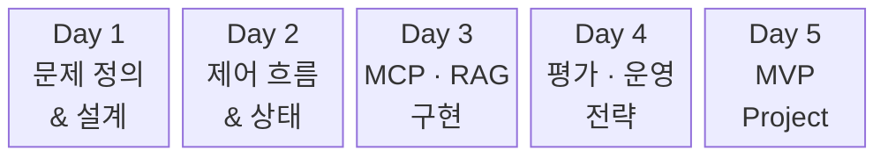
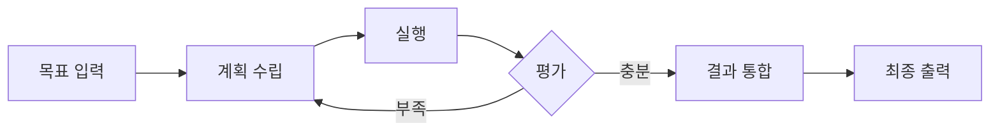
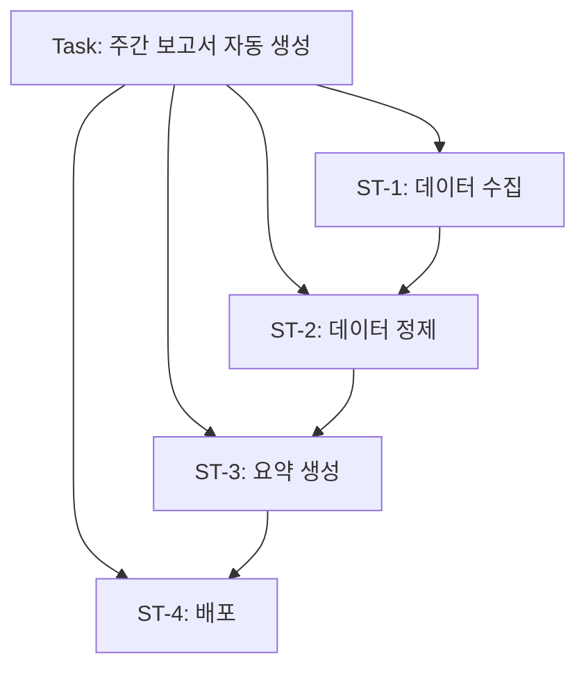

# AI Agent 전문 개발 과정

## Day 1 — 문제 정의 & 설계 전략

<div class="mt-8 text-lg opacity-70">
  MCP · RAG · Hybrid 아키텍처 기반의 실무형 AI Agent 설계
</div>

<div class="abs-br m-6 text-sm opacity-50">
  5일 과정 (40시간) · 강의 30% / 실습 70%
</div>

<!--
[스크립트 — script-writer가 작성 예정]
-->

---
transition: slide-left
---

## 5일 커리큘럼



<div class="grid grid-cols-5 gap-2 mt-6 text-sm">
  <div class="text-center">Pain→Task→Tool<br/>프롬프트 전략<br/>MCP·RAG 판단</div>
  <div class="text-center">LangGraph<br/>Tool Validation<br/>리팩토링</div>
  <div class="text-center">MCP 고급 설계<br/>RAG 튜닝<br/>Hybrid</div>
  <div class="text-center">품질 평가<br/>모니터링<br/>서비스 아키텍처</div>
  <div class="text-center">MVP 설계<br/>구현·시연<br/>발표</div>
</div>

<!--
[스크립트 — script-writer가 작성 예정]
-->

---
transition: slide-left
---

## Day 1 시간표

<div class="mt-4">

| 교시 | 시간 | 주제 | 실습 |
|:----:|------|------|------|
| **1** | 09:00–11:00 | Agent 문제 정의와 과제 도출 | Agent 후보 도출 워크시트 |
| **2** | 11:00–13:00 | LLM 동작 원리 · 프롬프트 전략 | 컨텍스트 전략 비교 |
| | 13:00–14:00 | 점심시간 | |
| **3** | 14:00–16:00 | Agent 기획서 구조화 | Agent 구조 다이어그램 |
| **4** | 16:00–18:00 | MCP · RAG · Hybrid 구조 판단 | MCP vs RAG 비교 구현 |

</div>

<!--
[스크립트 — script-writer가 작성 예정]
-->

---
transition: slide-left
---

## 환경 세팅

<div class="mt-2">

```bash
# 1. uv 설치 (Linux / WSL)
curl -LsSf https://astral.sh/uv/install.sh | sh
source $HOME/.local/bin/env

# 2. 의존성 설치 (day1/ 디렉토리에서)
cd labs/day1
uv sync

# 3. 환경변수 설정
cp .env.example .env
# .env에 OPENAI_API_KEY=sk-... 입력

# 4. Jupyter Lab 실행
uv run jupyter lab
```

</div>

<div class="mt-4 bg-slate-800/50 rounded-lg p-4 text-center text-lg">
  <strong>uv</strong>: Rust 기반 Python 패키지 매니저 — pip보다 10~100배 빠름
</div>

<!--
[스크립트 — script-writer가 작성 예정]
-->

---
layout: section
transition: fade
---

# 1교시

## Agent 문제 정의와 과제 도출

<div class="mt-4 opacity-70">Pain → Task → Skill → Tool</div>

<!--
[스크립트 — script-writer가 작성 예정]
-->

---
transition: slide-left
---

## Agent가 모든 문제의 해답이 아니다

<div class="mt-6 space-y-4">
  <v-clicks>
    <div class="text-xl">
      LLM 기술이 발전하면서 <strong>"Agent로 다 해결"</strong>이라는 기대가 높아졌다
    </div>
    <div class="text-xl">
      하지만 잘못된 문제에 Agent를 적용하면 <span class="text-red-400 font-bold">복잡도만 증가</span>
    </div>
    <div class="text-xl">
      <span class="text-green-400 font-bold">문제 정의</span>가 곧 프로젝트 성패를 결정한다
    </div>
  </v-clicks>
</div>

<v-click>
<div class="mt-8 bg-slate-800/50 rounded-lg p-4 text-center text-lg">
  Agent 프로젝트 실패의 가장 큰 이유:<br/><strong>"왜 Agent가 필요한지" 명확히 정의하지 않고 시작</strong>
</div>
</v-click>

<!--
[스크립트 — script-writer가 작성 예정]
-->

---
transition: slide-left
---

## Agent가 빛을 발하는 조건

<div class="mt-4">
<v-clicks>

- <strong>다단계 추론 필요</strong> — 여러 단계를 순차적으로 처리 (수집 → 분석 → 보고서)
- <strong>도구 사용 필요</strong> — 외부 API, DB, 파일 시스템 접근 (검색 + 계산 + 저장)
- <strong>비결정적 흐름</strong> — 상황에 따라 다음 단계가 달라짐 (에러 처리, 분기)
- <strong>반복 작업 자동화</strong> — 사람이 하면 지루하고 오래 걸리는 작업

</v-clicks>
</div>

<v-click>
<div class="mt-6 bg-slate-800/50 rounded-lg p-4 text-center text-lg">
  핵심: <strong>외부 시스템 상호작용</strong> + <strong>비결정적 흐름</strong> → Agent 적합
</div>
</v-click>

<!--
[스크립트 — script-writer가 작성 예정]
-->

---
transition: slide-left
---

## Agent가 과잉인 경우

<div class="mt-6">

| 상황 | 더 나은 대안 |
|------|-------------|
| 단순 Q&A | 일반 챗봇 or <strong>RAG</strong> |
| 고정 템플릿 생성 | <strong>프롬프트 엔지니어링</strong> |
| 단일 API 호출 | <strong>함수 직접 호출</strong> |
| 정형 데이터 처리 | <strong>전통적 파이프라인</strong> |

</div>

<v-click>
<div class="mt-6 bg-slate-800/50 rounded-lg p-4 text-center text-lg">
  <strong>LLM으로 할 수 있다</strong>고 해서 <strong>해야 하는 건 아니다</strong>
</div>
</v-click>

<!--
[스크립트 — script-writer가 작성 예정]
-->

---
transition: slide-left
clicks: 4
---

## Pain → Task → Skill → Tool

<div class="flex items-center justify-center gap-3 mt-8">
  <div class="px-5 py-4 rounded-xl text-center font-bold shadow-lg transition-all duration-300"
       :class="$clicks === 1 ? 'bg-red-600 text-white ring-2 ring-red-300 scale-105' : 'bg-red-600/60 text-white opacity-60'">
    <div class="text-sm opacity-70">1단계</div>
    <div>Pain</div>
    <div class="text-xs mt-1 opacity-70">고통</div>
  </div>
  <div class="text-2xl opacity-30">→</div>
  <div class="px-5 py-4 rounded-xl text-center font-bold shadow-lg transition-all duration-300"
       :class="$clicks === 2 ? 'bg-amber-600 text-white ring-2 ring-amber-300 scale-105' : 'bg-amber-600/60 text-white opacity-60'">
    <div class="text-sm opacity-70">2단계</div>
    <div>Task</div>
    <div class="text-xs mt-1 opacity-70">과제</div>
  </div>
  <div class="text-2xl opacity-30">→</div>
  <div class="px-5 py-4 rounded-xl text-center font-bold shadow-lg transition-all duration-300"
       :class="$clicks === 3 ? 'bg-blue-600 text-white ring-2 ring-blue-300 scale-105' : 'bg-blue-600/60 text-white opacity-60'">
    <div class="text-sm opacity-70">3단계</div>
    <div>Skill</div>
    <div class="text-xs mt-1 opacity-70">능력</div>
  </div>
  <div class="text-2xl opacity-30">→</div>
  <div class="px-5 py-4 rounded-xl text-center font-bold shadow-lg transition-all duration-300"
       :class="$clicks >= 4 ? 'bg-green-600 text-white ring-2 ring-green-300 scale-105' : 'bg-green-600/60 text-white opacity-60'">
    <div class="text-sm opacity-70">4단계</div>
    <div>Tool</div>
    <div class="text-xs mt-1 opacity-70">도구</div>
  </div>
</div>

<div class="mt-6 bg-slate-800/50 rounded-lg p-4 text-center min-h-16 relative overflow-hidden">
  <div class="text-lg transition-all duration-300 absolute inset-0 flex items-center justify-center"
       :class="$clicks === 0 ? 'opacity-50' : 'opacity-0 pointer-events-none'">클릭하여 각 단계 확인</div>
  <div class="text-lg transition-all duration-300 absolute inset-0 flex items-center justify-center"
       :class="$clicks === 1 ? 'opacity-100' : 'opacity-0 pointer-events-none'">
    <strong>Pain</strong>: 업무의 고통을 구체적 수치로 정의 — "매주 3시간 보고서 작성"
  </div>
  <div class="text-lg transition-all duration-300 absolute inset-0 flex items-center justify-center"
       :class="$clicks === 2 ? 'opacity-100' : 'opacity-0 pointer-events-none'">
    <strong>Task</strong>: Pain을 해결할 과제 정의 — "데이터 수집 후 요약본 자동 생성"
  </div>
  <div class="text-lg transition-all duration-300 absolute inset-0 flex items-center justify-center"
       :class="$clicks === 3 ? 'opacity-100' : 'opacity-0 pointer-events-none'">
    <strong>Skill</strong>: 과제 수행에 필요한 능력 — "데이터 수집, 수치 해석, 문서 작성"
  </div>
  <div class="text-lg transition-all duration-300 absolute inset-0 flex items-center justify-center"
       :class="$clicks >= 4 ? 'opacity-100' : 'opacity-0 pointer-events-none'">
    <strong>Tool</strong>: 능력을 구현하는 도구 — "Jira API, DB 쿼리, LLM 요약, Slack 발송"
  </div>
  <div class="invisible text-lg">placeholder</div>
</div>

<!--
[스크립트 — script-writer가 작성 예정]
-->

---
transition: slide-left
---

## 프레임워크 적용 예시

<div class="text-lg font-bold mb-4">주간 보고서 자동화</div>

<div class="space-y-3">
<v-clicks>

<div class="flex items-start gap-3">
  <span class="bg-red-600 text-white px-3 py-1 rounded-lg font-bold text-sm shrink-0">Pain</span>
  <span>매주 <strong>3시간</strong>을 보고서 수동 작성에 낭비한다</span>
</div>

<div class="flex items-start gap-3">
  <span class="bg-amber-600 text-white px-3 py-1 rounded-lg font-bold text-sm shrink-0">Task</span>
  <span>여러 시스템 데이터를 모아 <strong>요약본 자동 생성</strong></span>
</div>

<div class="flex items-start gap-3">
  <span class="bg-blue-600 text-white px-3 py-1 rounded-lg font-bold text-sm shrink-0">Skill</span>
  <span>데이터 수집 · 수치 해석 · 트렌드 파악 · 자연어 요약</span>
</div>

<div class="flex items-start gap-3">
  <span class="bg-green-600 text-white px-3 py-1 rounded-lg font-bold text-sm shrink-0">Tool</span>
  <span>Jira API · DB Query · LLM 요약 · Slack 발송</span>
</div>

</v-clicks>
</div>

<v-click>
<div class="mt-6 bg-slate-800/50 rounded-lg p-4 text-center text-lg">
  <strong>성공 기준</strong>: 보고서 작성 시간 3h → 5분 이내 단축
</div>
</v-click>

<!--
[스크립트 — script-writer가 작성 예정]
-->

---
transition: slide-left
---

## 업무 유형별 Agent 패턴

<div class="grid grid-cols-3 gap-4 mt-6">
<v-clicks>

<div class="bg-slate-800 rounded-xl border border-blue-500 p-5 text-center shadow-lg">
  <div class="text-3xl mb-2">⚙️</div>
  <div class="text-lg font-bold text-blue-400">자동화형</div>
  <div class="text-sm mt-2 opacity-70">정해진 프로세스를<br/>자동 실행</div>
  <div class="text-xs mt-3 opacity-50">트리거 → 처리 → 저장</div>
</div>

<div class="bg-slate-800 rounded-xl border border-green-500 p-5 text-center shadow-lg">
  <div class="text-3xl mb-2">🔍</div>
  <div class="text-lg font-bold text-green-400">분석형</div>
  <div class="text-sm mt-2 opacity-70">데이터 탐색하고<br/>인사이트 도출</div>
  <div class="text-xs mt-3 opacity-50">질문 → 탐색 → 분석 → 설명</div>
</div>

<div class="bg-slate-800 rounded-xl border border-purple-500 p-5 text-center shadow-lg">
  <div class="text-3xl mb-2">🧠</div>
  <div class="text-lg font-bold text-purple-400">Planner형</div>
  <div class="text-sm mt-2 opacity-70">스스로 계획 세우고<br/>실행</div>
  <div class="text-xs mt-3 opacity-50">목표 → 계획 → 실행 → 통합</div>
</div>

</v-clicks>
</div>

<!--
[스크립트 — script-writer가 작성 예정]
-->

---
transition: slide-left
clicks: 3
---

## 자동화형 Agent

<div class="flex items-center justify-center gap-3 mt-6">
  <div class="bg-gray-600 text-white px-4 py-3 rounded-xl font-bold shadow-lg transition-all duration-300"
       :class="$clicks >= 1 ? 'ring-2 ring-gray-300 scale-105' : 'opacity-40'">
    <div class="text-xs opacity-70">트리거</div>
    <div class="text-sm">월요일 오전 9시</div>
  </div>
  <div class="text-xl opacity-30">→</div>
  <div class="bg-green-600 text-white px-4 py-3 rounded-xl font-bold shadow-lg transition-all duration-300"
       :class="$clicks >= 2 ? 'ring-2 ring-green-300 scale-105' : 'opacity-40'">
    <div class="text-xs opacity-70">Tool</div>
    <div class="text-sm">데이터 집계</div>
  </div>
  <div class="text-xl opacity-30">→</div>
  <div class="bg-blue-600 text-white px-4 py-3 rounded-xl font-bold shadow-lg transition-all duration-300"
       :class="$clicks >= 2 ? 'ring-2 ring-blue-300 scale-105' : 'opacity-40'">
    <div class="text-xs opacity-70">LLM</div>
    <div class="text-sm">리포트 생성</div>
  </div>
  <div class="text-xl opacity-30">→</div>
  <div class="bg-green-600 text-white px-4 py-3 rounded-xl font-bold shadow-lg transition-all duration-300"
       :class="$clicks >= 3 ? 'ring-2 ring-green-300 scale-105' : 'opacity-40'">
    <div class="text-xs opacity-70">Tool</div>
    <div class="text-sm">Slack 전송</div>
  </div>
</div>

<div class="mt-6 space-y-2 text-lg">
<v-clicks>

- 반복 주기가 <strong>명확</strong>하다
- 처리 단계가 <strong>고정</strong>되어 있다
- 정상 흐름이 <strong>99%</strong>이다

</v-clicks>
</div>

<!--
[스크립트 — script-writer가 작성 예정]
-->

---
transition: slide-left
---

## 분석형 Agent

<div class="flex flex-col items-center gap-3 mt-4">
  <div class="bg-gray-600 text-white px-6 py-2 rounded-xl font-bold shadow-lg text-sm">
    "지난달 이탈 고객의 공통점은?"
  </div>
  <div class="text-xl opacity-30">↓</div>
  <div class="flex gap-3">
    <div class="bg-green-600 text-white px-4 py-2 rounded-xl font-bold shadow-lg text-sm">DB 조회</div>
    <div class="bg-green-600 text-white px-4 py-2 rounded-xl font-bold shadow-lg text-sm">로그 분석</div>
  </div>
  <div class="text-xl opacity-30">↓</div>
  <div class="bg-blue-600 text-white px-6 py-2 rounded-xl font-bold shadow-lg text-sm">LLM: 패턴 분석 + 인사이트 도출</div>
  <div class="text-xl opacity-30">↓</div>
  <div class="bg-gray-600 text-white px-6 py-2 rounded-xl font-bold shadow-lg text-sm">자연어 요약 결과</div>
</div>

<div class="mt-4 space-y-1">
<v-clicks>

- 분석 범위가 사전에 <strong>고정되지 않는다</strong>
- 데이터 소스가 <strong>다양</strong>하다
- 결과를 <strong>자연어</strong>로 설명해야 한다

</v-clicks>
</div>

<!--
[스크립트 — script-writer가 작성 예정]
-->

---
transition: slide-left
---

## Planner형 Agent



<div class="mt-4 space-y-2 text-lg">
<v-clicks>

- 목표가 <strong>추상적</strong>이고 실행 방법이 다양하다
- 실행 중 <strong>피드백을 반영</strong>해야 한다
- 실패 시 <strong>대안 경로</strong>가 필요하다

</v-clicks>
</div>

<!--
[스크립트 — script-writer가 작성 예정]
-->

---
transition: slide-left
---

## 3가지 패턴 종합 비교

<div class="mt-4">

| 항목 | 자동화형 | 분석형 | Planner형 |
|------|:--------:|:------:|:---------:|
| 입력 | 이벤트/스케줄 | 자연어 질문 | 목표 설명 |
| 계획 | 고정 | 반고정 | **동적** |
| 도구 수 | 적음 (1-3) | 중간 (3-5) | 많음 (5+) |
| 실패 처리 | 단순 재시도 | 대안 쿼리 | **계획 재수립** |
| 개발 난이도 | 낮음 | 중간 | **높음** |

</div>

<v-click>
<div class="mt-4 bg-slate-800/50 rounded-lg p-4 text-center text-lg">
  대부분의 실무 Agent는 <strong>자동화형</strong>으로 시작하여 점진적으로 확장한다
</div>
</v-click>

<!--
[스크립트 — script-writer가 작성 예정]
-->

---
transition: slide-left
---

## RAG vs Agent 판단 기준

<div class="grid grid-cols-2 gap-6 mt-6">
  <div>
    <h3 class="text-lg font-bold mb-3 text-blue-400">RAG</h3>
    <ul class="space-y-2">
      <v-clicks>
      <li><strong>핵심 목적</strong>: 지식 검색 + 생성</li>
      <li>검색 도구 고정</li>
      <li>Stateless 가능</li>
      <li>상대적으로 단순</li>
      <li>예: 사내 문서 Q&A</li>
      </v-clicks>
    </ul>
  </div>
  <div>
    <h3 class="text-lg font-bold mb-3 text-green-400">Agent</h3>
    <ul class="space-y-2">
      <v-clicks>
      <li><strong>핵심 목적</strong>: 작업 수행 + 자동화</li>
      <li>다양한 도구 동적 선택</li>
      <li>Stateful 필요한 경우 많음</li>
      <li>복잡한 흐름 처리</li>
      <li>예: 이슈 자동 처리</li>
      </v-clicks>
    </ul>
  </div>
</div>

<!--
[스크립트 — script-writer가 작성 예정]
-->

---
transition: slide-left
---

## RAG vs Agent 판단 질문

<div class="mt-6 space-y-4">
<v-clicks>

<div class="flex items-start gap-3 text-lg">
  <span class="text-blue-400 font-bold shrink-0">Q1.</span>
  <span>단순히 "찾아서 대답"하면 되는가? → <strong class="text-blue-400">RAG</strong></span>
</div>

<div class="flex items-start gap-3 text-lg">
  <span class="text-green-400 font-bold shrink-0">Q2.</span>
  <span>외부 시스템과 상호작용이 필요한가? → <strong class="text-green-400">Agent</strong></span>
</div>

<div class="flex items-start gap-3 text-lg">
  <span class="text-green-400 font-bold shrink-0">Q3.</span>
  <span>결과를 보고 다음 행동이 달라지는가? → <strong class="text-green-400">Agent</strong></span>
</div>

<div class="flex items-start gap-3 text-lg">
  <span class="text-blue-400 font-bold shrink-0">Q4.</span>
  <span>문서 기반 지식만 필요한가? → <strong class="text-blue-400">RAG</strong></span>
</div>

</v-clicks>
</div>

<v-click>
<div class="mt-6 bg-slate-800/50 rounded-lg p-4 text-center text-lg">
  RAG와 Agent는 <strong>배타적이지 않다</strong> — Agent가 RAG를 도구로 사용하는 Hybrid 구조가 많다
</div>
</v-click>

<!--
[스크립트 — script-writer가 작성 예정]
-->

---
transition: slide-left
---

## Agent Anti-Pattern

<div class="mt-6 space-y-4">
<v-clicks>

<div class="flex items-start gap-3">
  <span class="text-red-400 font-bold text-xl shrink-0">①</span>
  <div>
    <strong>망치를 들면 모든 것이 못으로 보인다</strong>
    <div class="text-sm opacity-70 mt-1">단순 규칙 기반이 더 빠르고 정확한 경우가 많다</div>
  </div>
</div>

<div class="flex items-start gap-3">
  <span class="text-red-400 font-bold text-xl shrink-0">②</span>
  <div>
    <strong>기술로 시작하는 설계</strong>
    <div class="text-sm opacity-70 mt-1">"API를 써서 뭔가 만들자" → 실패 확률 높음</div>
  </div>
</div>

<div class="flex items-start gap-3">
  <span class="text-red-400 font-bold text-xl shrink-0">③</span>
  <div>
    <strong>Edge Case 무시</strong>
    <div class="text-sm opacity-70 mt-1">설계 단계에서 실패 케이스를 미리 나열하라</div>
  </div>
</div>

<div class="flex items-start gap-3">
  <span class="text-red-400 font-bold text-xl shrink-0">④</span>
  <div>
    <strong>평가 기준 없는 배포</strong>
    <div class="text-sm opacity-70 mt-1">정량 지표를 먼저 정의: 정확도, 완료율, 처리 시간</div>
  </div>
</div>

</v-clicks>
</div>

<!--
[스크립트 — script-writer가 작성 예정]
-->

---
transition: slide-left
---

## ❓ Q&A — Session 1

<div class="mt-4 space-y-6">
  <div>
    <div class="text-xl font-bold text-blue-400">Q. Agent와 RPA의 차이는?</div>
    <v-click>
      <div class="mt-2 pl-4 border-l-3 border-blue-500 text-gray-300">
        A. RPA는 정해진 UI 흐름을 반복 실행한다. Agent는 상황을 이해하고 유연하게 판단한다.<br/>RPA는 UI가 바뀌면 깨지지만, Agent는 목표 기반으로 대응한다.
      </div>
    </v-click>
  </div>
  <div v-click>
    <div class="text-xl font-bold text-green-400">Q. Pain이 여러 개면 Agent도 여러 개?</div>
    <v-click>
      <div class="mt-2 pl-4 border-l-3 border-green-500 text-gray-300">
        A. 반드시 그렇지 않다. Pain들이 공통 Task로 묶이면 하나의 Agent로 처리 가능하다.<br/>반대로 Pain이 하나여도 복잡하면 여러 Sub-agent로 분리할 수 있다.
      </div>
    </v-click>
  </div>
</div>

<!--
[스크립트 — script-writer가 작성 예정]
-->

---
transition: slide-left
---

## 🧪 Quiz — Agent에 적합한 시나리오는?

<div class="mt-4 space-y-3">
  <div class="p-3 rounded-lg bg-slate-800/50">A) 사내 FAQ 문서에서 질문에 대한 답변 찾기</div>
  <div class="p-3 rounded-lg bg-slate-800/50">B) 고정된 HTML 템플릿에 데이터 채워 넣기</div>
  <div class="p-3 rounded-lg bg-slate-800/50">C) 이슈 티켓을 분석하고 담당자 지정 후 알림 발송</div>
  <div class="p-3 rounded-lg bg-slate-800/50">D) 주어진 텍스트를 영어에서 한국어로 번역</div>
</div>

<v-click>
<div class="mt-4 bg-green-900/30 rounded-lg p-4">
  <div class="font-bold text-green-400 text-lg">정답: C</div>
  <div class="text-sm mt-1 opacity-80">
    이슈 분석(LLM) + 담당자 DB 조회(Tool) + 알림 발송(Tool) → 다단계 추론 + 도구 사용
  </div>
</div>
</v-click>

<!--
[스크립트 — script-writer가 작성 예정]
-->

---
transition: slide-left
---

## 🧪 Quiz — Agent 패턴 분류

<div class="mt-4 bg-slate-800/50 rounded-lg p-4">
  <div class="text-lg">"사용자가 '경쟁사 동향 분석해줘'라고 입력하면, Agent가 검색 계획을 세우고 여러 소스를 탐색한 뒤 보고서를 작성한다."</div>
</div>

<div class="mt-4 text-lg">이 시나리오는 자동화형 / 분석형 / Planner형 중 무엇인가?</div>

<v-click>
<div class="mt-4 bg-green-900/30 rounded-lg p-4">
  <div class="font-bold text-green-400 text-lg">정답: Planner형</div>
  <div class="text-sm mt-1 opacity-80">
    목표가 추상적이고, 실행 계획을 Agent가 결정하며, 탐색 결과에 따라 다음 행동이 달라진다
  </div>
</div>
</v-click>

<!--
[스크립트 — script-writer가 작성 예정]
-->

---
transition: slide-left
---

## 실습 — Lab 1: Agent 문제 정의

<div class="mt-6 space-y-4">
  <div class="flex items-center gap-3">
    <span class="bg-blue-600 text-white px-3 py-1 rounded-lg font-bold text-sm">시연</span>
    <span class="text-lg">PydanticAI 기반 Agent 3가지 패턴 실행 (30분)</span>
  </div>
  <div class="flex items-center gap-3">
    <span class="bg-green-600 text-white px-3 py-1 rounded-lg font-bold text-sm">과제</span>
    <span class="text-lg">개인 업무 기반 Agent 후보 2-3개 도출 (45분)</span>
  </div>
  <div class="flex items-center gap-3">
    <span class="bg-amber-600 text-white px-3 py-1 rounded-lg font-bold text-sm">공유</span>
    <span class="text-lg">발표 + 피드백 (15분)</span>
  </div>
</div>

<div class="mt-6 bg-slate-800/50 rounded-lg p-4 text-center text-lg">
  <strong>labs/day1/s1-agent-problem-definition/</strong> — README.md 참고
</div>

<!--
[스크립트 — script-writer가 작성 예정]
-->

---
transition: slide-left
---

## 시연: PydanticAI 기본 — Agent 생성

```python {1-2|4-8|10-12}
from pydantic_ai import Agent
from pydantic import BaseModel

# 가장 간단한 Agent — 모델만 지정
simple_agent = Agent("openai:gpt-5.4")
result = await simple_agent.run("PydanticAI를 한 줄로 설명해줘.")
print(result.output)

# instructions로 역할 부여
chef_agent = Agent(
    "openai:gpt-5.4",
    instructions="너는 친절한 요리사야. 모든 답변을 요리 비유로 해줘.",
)
```

<v-click>
<div class="mt-2 bg-slate-800/50 rounded-lg p-3 text-center text-lg">
  <strong>Agent(모델명)</strong> → <strong>await agent.run(프롬프트)</strong> → <strong>result.output</strong>
</div>
</v-click>

<!--
[스크립트 — script-writer가 작성 예정]
-->

---
transition: slide-left
---

## 시연: Structured Output — output_type

```python {1-5|7-11|13-16}
class MovieReview(BaseModel):
    title: str       # 영화 제목
    score: int       # 평점 (1~10)
    pros: list[str]  # 장점 목록
    cons: list[str]  # 단점 목록

review_agent = Agent(
    "openai:gpt-5.4",
    output_type=MovieReview,  # ← Pydantic 모델로 응답 강제
    instructions="영화 평론가로서 평가. 한국어로 작성.",
)

result = await review_agent.run("인터스텔라를 평가해주세요.")
review = result.output          # MovieReview 타입!
print(f"제목: {review.title}")  # 속성으로 바로 접근
print(f"평점: {review.score}/10")
```

<v-click>
<div class="mt-2 bg-slate-800/50 rounded-lg p-3 text-center text-lg">
  <strong>output_type=모델</strong> → LLM이 반드시 해당 스키마로 응답
</div>
</v-click>

<!--
[스크립트 — script-writer가 작성 예정]
-->

---
transition: slide-left
---

## 시연: Tool 등록 — @agent.tool_plain

```python {1-4|6-13|15-17}
calc_agent = Agent(
    "openai:gpt-5.4",
    instructions="계산이 필요하면 제공된 도구를 사용하라.",
)

@calc_agent.tool_plain
def add(a: int, b: int) -> int:
    """두 숫자를 더한다."""  # ← docstring이 LLM에게 전달
    return a + b

@calc_agent.tool_plain
def multiply(a: int, b: int) -> int:
    """두 숫자를 곱한다."""
    return a * b

result = await calc_agent.run("17+28을 구하고, 결과에 3을 곱해.")
print(result.output)  # LLM이 add→multiply 순서로 자동 호출
```

<v-click>
<div class="mt-2 bg-slate-800/50 rounded-lg p-3 text-center text-lg">
  <strong>@agent.tool_plain</strong> + <strong>docstring</strong> → LLM이 알아서 도구 선택·호출
</div>
</v-click>

<!--
[스크립트 — script-writer가 작성 예정]
-->

---
transition: slide-left
---

## 시연: 자동화형 Agent — GitHub 이슈 보고

```python {1-4|6-10|12-18}{maxHeight:'320px'}
class DailyReport(BaseModel):
    summary: str
    issue_count: int
    highlights: list[str]

agent = Agent(
    "openai:gpt-5.4",
    output_type=DailyReport,
    instructions="fetch_github_issues로 이슈 수집 → send_slack_message로 발송",
)

@agent.tool_plain
def fetch_github_issues(repo: str) -> str:
    """GitHub 저장소의 최근 이슈 목록을 가져온다."""
    resp = httpx.get(f"https://api.github.com/repos/{repo}/issues", ...)
    return "\n".join([f"#{i['number']} {i['title']}" for i in resp.json()])

@agent.tool_plain
def send_slack_message(channel: str, message: str) -> str:
    """Slack 채널에 메시지를 발송한다."""
    httpx.post("https://slack.com/api/chat.postMessage", ...)
    return f"#{channel} 발송 완료"
```

<!--
[스크립트 — script-writer가 작성 예정]
-->

---
transition: slide-left
---

## PydanticAI 핵심 패턴 정리

<div class="mt-4">

| 개념 | 역할 | 코드 |
|------|------|------|
| **Agent** | LLM을 감싸는 핵심 객체 | `Agent("openai:gpt-5.4")` |
| **instructions** | 역할·규칙 부여 | `instructions="..."` |
| **output_type** | 응답을 Pydantic 모델로 강제 | `output_type=MyModel` |
| **@tool_plain** | LLM이 호출할 함수 등록 | `@agent.tool_plain` |
| **await run()** | Agent 실행 | `await agent.run("...")` |

</div>

<v-click>
<div class="mt-4 bg-slate-800/50 rounded-lg p-4 text-center text-lg">
  이 패턴들이 모든 실습의 기반 — <strong>Agent + instructions + output_type + Tool</strong>
</div>
</v-click>

<!--
[스크립트 — script-writer가 작성 예정]
-->

---
transition: fade
---

## ☕ 쉬는 시간

<div class="mt-20 text-center text-2xl opacity-50">
  10분 후 2교시를 시작합니다
</div>

<!--
[스크립트 — script-writer가 작성 예정]
-->

---
layout: section
transition: fade
---

# 2교시

## LLM 동작 원리 및 프롬프트 전략

<div class="mt-4 opacity-70">Context Window · Hallucination · Structured Output</div>

<!--
[스크립트 — script-writer가 작성 예정]
-->

---
transition: slide-left
---

## 프롬프트는 Agent의 두뇌 설계다

<div class="mt-6 space-y-4">
<v-clicks>

<div class="text-xl">
  Agent를 만든다 = <strong>LLM을 코드로 제어</strong>한다
</div>

<div class="text-xl">
  LLM이 어떻게 작동하는지 모르면 Agent 동작을 <span class="text-red-400 font-bold">예측할 수 없다</span>
</div>

<div class="text-xl">
  프롬프트 전략이 <span class="text-green-400 font-bold">결과 품질</span>과 <span class="text-green-400 font-bold">비용</span>을 동시에 결정한다
</div>

</v-clicks>
</div>

<v-click>
<div class="mt-8 bg-slate-800/50 rounded-lg p-4 text-center text-lg">
  올바른 프롬프트 전략은 <strong>비용 50%</strong>, <strong>지연 30%</strong>를 줄일 수 있다
</div>
</v-click>

<!--
[스크립트 — script-writer가 작성 예정]
-->

---
transition: slide-left
clicks: 2
---

## Token과 Context Window

<div class="flex items-center justify-center gap-3 mt-6">
  <div class="bg-blue-600 text-white px-5 py-3 rounded-xl font-bold shadow-lg transition-all duration-300"
       :class="$clicks === 1 ? 'ring-2 ring-blue-300 scale-105' : 'opacity-60'">
    <div class="text-sm">Token</div>
    <div class="text-xs opacity-70">단어/글자 조각</div>
  </div>
  <div class="text-xl opacity-30">⊂</div>
  <div class="bg-green-600 text-white px-8 py-4 rounded-xl font-bold shadow-lg transition-all duration-300"
       :class="$clicks >= 2 ? 'ring-2 ring-green-300 scale-105' : 'opacity-60'">
    <div class="text-sm">Context Window</div>
    <div class="text-xs opacity-70">처리 가능한 최대 토큰 수</div>
  </div>
</div>

<div class="mt-6 bg-slate-800/50 rounded-lg p-4 text-center min-h-16 relative overflow-hidden">
  <div class="text-lg transition-all duration-300 absolute inset-0 flex items-center justify-center"
       :class="$clicks === 0 ? 'opacity-50' : 'opacity-0 pointer-events-none'">클릭하여 확인</div>
  <div class="text-lg transition-all duration-300 absolute inset-0 flex items-center justify-center"
       :class="$clicks === 1 ? 'opacity-100' : 'opacity-0 pointer-events-none'">
    <strong>Token</strong>: 영어 1단어 ≈ 1-2토큰 · 한국어 1글자 ≈ 1-2토큰 · 코드 100줄 ≈ 500-1,000토큰
  </div>
  <div class="text-lg transition-all duration-300 absolute inset-0 flex items-center justify-center"
       :class="$clicks >= 2 ? 'opacity-100' : 'opacity-0 pointer-events-none'">
    <strong>Context Window</strong> = System Prompt + 대화 이력 + 현재 입력 + 출력 전부 포함
  </div>
  <div class="invisible text-lg">placeholder</div>
</div>

<!--
[스크립트 — script-writer가 작성 예정]
-->

---
transition: slide-left
---

## Context Window 구조

<div class="flex flex-col items-center mt-4">
  <div class="w-96 border-2 border-slate-500 rounded-xl overflow-hidden">
    <div class="bg-blue-600/80 px-4 py-2 text-sm font-bold text-center">System Prompt (500 토큰)</div>
    <div class="bg-green-600/60 px-4 py-2 text-sm font-bold text-center">대화 이력 (2,000 토큰)</div>
    <div class="bg-amber-600/60 px-4 py-2 text-sm font-bold text-center">현재 사용자 입력 (300 토큰)</div>
    <div class="bg-purple-600/60 px-4 py-2 text-sm font-bold text-center">출력 — Max Tokens (1,000 토큰)</div>
  </div>
  <div class="text-sm opacity-50 mt-2">= 총 3,800 토큰 사용</div>
</div>

<div class="mt-4 space-y-1">
<v-clicks>

- 긴 대화 이력은 Context를 <strong>빠르게 소모</strong>한다
- Context 초과 시 <span class="text-red-400 font-bold">앞부분이 잘리거나 에러 발생</span>
- RAG의 검색 결과도 Context를 소모한다

</v-clicks>
</div>

<!--
[스크립트 — script-writer가 작성 예정]
-->

---
transition: slide-left
---

## Hallucination — LLM이 거짓을 자신 있게 말한다

<div class="mt-4 text-lg">확률 기반 모델의 <strong>구조적 한계</strong></div>

<div class="mt-4 space-y-3">
<v-clicks>

<div class="flex items-start gap-3">
  <span class="text-red-400 font-bold shrink-0">①</span>
  <span>최신 정보가 필요한 질문 (학습 데이터 이후 사건)</span>
</div>
<div class="flex items-start gap-3">
  <span class="text-red-400 font-bold shrink-0">②</span>
  <span>구체적 수치, 날짜, 인용 요청</span>
</div>
<div class="flex items-start gap-3">
  <span class="text-red-400 font-bold shrink-0">③</span>
  <span>너무 제약이 없는 열린 질문</span>
</div>
<div class="flex items-start gap-3">
  <span class="text-red-400 font-bold shrink-0">④</span>
  <span>모델이 잘 모르는 도메인의 세부 사항</span>
</div>

</v-clicks>
</div>

<v-click>
<div class="mt-4 bg-slate-800/50 rounded-lg p-4 text-center text-lg">
  Agent 설계 시 <strong>"LLM이 틀릴 수 있다"</strong>는 전제로 검증 로직을 포함하라
</div>
</v-click>

<!--
[스크립트 — script-writer가 작성 예정]
-->

---
transition: slide-left
---

## Hallucination 완화 전략

<div class="mt-4">

| 전략 | 설명 | 방법 |
|------|------|------|
| 근거 요청 | "왜 그렇게 생각하는지 설명하라" | CoT 프롬프트 |
| 출처 제공 | 관련 문서를 Context에 포함 | RAG 결합 |
| 불확실성 명시 | "모르면 모른다고 답하라" | System Prompt |
| 검증 루프 | 생성 후 별도 검증 단계 | 자기 검토 |
| 구조화 출력 | JSON Schema로 응답 제한 | Structured Output |

</div>

<v-click>
<div class="mt-4 bg-slate-800/50 rounded-lg p-4 text-center text-lg">
  <strong>RAG + Structured Output + 검증 루프</strong> = Hallucination 대폭 감소
</div>
</v-click>

<!--
[스크립트 — script-writer가 작성 예정]
-->

---
transition: slide-left
---

## Zero-shot 전략

<div class="mt-4 text-lg">지시만 제공하고 <strong>예시 없이</strong> 수행 요청</div>

```python
prompt = """
다음 고객 리뷰를 긍정/부정/중립으로 분류하라.

리뷰: "배송이 빠르긴 했는데 포장이 엉망이었어요."
"""
```

<div class="mt-4 grid grid-cols-3 gap-4 text-center text-sm">
<v-clicks>
  <div class="bg-green-900/30 rounded-lg p-3">
    <div class="font-bold text-green-400">장점</div>
    <div>프롬프트 짧음<br/>토큰 효율</div>
  </div>
  <div class="bg-red-900/30 rounded-lg p-3">
    <div class="font-bold text-red-400">단점</div>
    <div>복잡한 작업에서<br/>품질 저하</div>
  </div>
  <div class="bg-blue-900/30 rounded-lg p-3">
    <div class="font-bold text-blue-400">적합</div>
    <div>단순 분류<br/>번역, 요약</div>
  </div>
</v-clicks>
</div>

<!--
[스크립트 — script-writer가 작성 예정]
-->

---
transition: slide-left
---

## Few-shot 전략

<div class="mt-2 text-lg">작업 방식을 <strong>예시(shot)</strong>로 보여준다</div>

```python {1-4|6-14|16-17}{maxHeight:'250px'}
prompt = """
고객 리뷰를 긍정/부정/중립으로 분류하라.

예시 1:
리뷰: "정말 마음에 들어요!" → 긍정

예시 2:
리뷰: "완전 실망입니다." → 부정

예시 3:
리뷰: "평범한 제품이에요." → 중립

리뷰: "배송이 빠르긴 했는데 포장이 엉망이었어요."
분류:
"""
```

<div class="mt-2 grid grid-cols-2 gap-4 text-center text-sm">
  <div class="bg-green-900/30 rounded-lg p-2">
    <span class="font-bold text-green-400">장점</span>: 출력 형식과 품질 안정적
  </div>
  <div class="bg-red-900/30 rounded-lg p-2">
    <span class="font-bold text-red-400">단점</span>: 토큰 사용량 증가
  </div>
</div>

<!--
[스크립트 — script-writer가 작성 예정]
-->

---
transition: slide-left
---

## Chain-of-Thought (CoT) 전략

<div class="mt-2 text-lg"><strong>단계적 추론 과정</strong>을 포함하도록 유도</div>

```python
prompt = """
다음 리뷰를 단계별로 분석하여 분류하라.

리뷰: "배송이 빠르긴 했는데 포장이 엉망이었어요."

1단계: 긍정적 표현 추출
2단계: 부정적 표현 추출
3단계: 전체 감정 판단
4단계: 최종 분류
"""
```

<div class="mt-3 grid grid-cols-2 gap-4 text-center text-sm">
  <div class="bg-green-900/30 rounded-lg p-2">
    <span class="font-bold text-green-400">장점</span>: 복잡한 추론 정확도 <strong>대폭 향상</strong>
  </div>
  <div class="bg-red-900/30 rounded-lg p-2">
    <span class="font-bold text-red-400">단점</span>: 출력 토큰 증가 → 비용/지연 증가
  </div>
</div>

<!--
[스크립트 — script-writer가 작성 예정]
-->

---
transition: slide-left
clicks: 3
---

## 전략 선택 가이드

<div class="flex flex-col items-center mt-6 text-lg">
  <div class="bg-amber-600 text-white px-6 py-3 rounded-xl font-bold shadow-lg transition-all duration-300"
       :class="$clicks === 1 ? 'ring-2 ring-amber-300 scale-105' : 'opacity-60'">
    작업이 단순한가? (분류, 번역)
  </div>
  <div class="flex gap-12 mt-3">
    <div class="text-center">
      <div class="text-sm opacity-50 mb-1">Yes</div>
      <div class="bg-blue-600 text-white px-4 py-2 rounded-xl font-bold shadow-lg transition-all duration-300 text-sm"
           :class="$clicks === 1 ? 'ring-2 ring-blue-300' : 'opacity-60'">Zero-shot</div>
    </div>
    <div class="text-center">
      <div class="text-sm opacity-50 mb-1">No ↓</div>
      <div class="bg-amber-600 text-white px-4 py-2 rounded-xl font-bold shadow-lg transition-all duration-300 text-sm"
           :class="$clicks === 2 ? 'ring-2 ring-amber-300 scale-105' : 'opacity-60'">출력 형식이 중요?</div>
    </div>
  </div>
  <div class="flex gap-12 mt-3">
    <div class="text-center">
      <div class="text-sm opacity-50 mb-1">Yes</div>
      <div class="bg-green-600 text-white px-4 py-2 rounded-xl font-bold shadow-lg transition-all duration-300 text-sm"
           :class="$clicks === 2 ? 'ring-2 ring-green-300' : 'opacity-60'">Few-shot</div>
    </div>
    <div class="text-center">
      <div class="text-sm opacity-50 mb-1">추론 필요?</div>
      <div class="bg-purple-600 text-white px-4 py-2 rounded-xl font-bold shadow-lg transition-all duration-300 text-sm"
           :class="$clicks >= 3 ? 'ring-2 ring-purple-300' : 'opacity-60'">CoT</div>
    </div>
  </div>
</div>

<!--
[스크립트 — script-writer가 작성 예정]
-->

---
transition: slide-left
---

## 전략별 특성 비교

<div class="mt-6">

| 전략 | 토큰 사용 | 정확도 | 응답 속도 | 추천 상황 |
|------|:---------:|:------:|:---------:|-----------|
| Zero-shot | 낮음 | 보통 | 빠름 | 단순 작업 |
| Few-shot | 중간 | 높음 | 중간 | 형식 중요 |
| CoT | 높음 | 높음 | 느림 | 복잡한 추론 |
| CoT + Few-shot | 매우 높음 | **매우 높음** | 느림 | 고정확도 |

</div>

<v-click>
<div class="mt-6 bg-slate-800/50 rounded-lg p-4 text-center text-lg">
  <strong>비용 < 정확도</strong> → Zero-shot 먼저 · <strong>정확도 > 비용</strong> → Few-shot + 검증
</div>
</v-click>

<!--
[스크립트 — script-writer가 작성 예정]
-->

---
transition: slide-left
clicks: 3
---

## Structured Output — JSON Schema

<div class="flex items-center justify-center gap-3 mt-6">
  <div class="bg-gray-600 text-white px-4 py-3 rounded-xl font-bold shadow-lg text-sm transition-all duration-300"
       :class="$clicks >= 1 ? 'ring-2 ring-gray-300 scale-105' : 'opacity-40'">
    <div class="text-xs opacity-70">입력</div>
    <div>"리뷰 분류해줘"</div>
  </div>
  <div class="text-xl opacity-30">→</div>
  <div class="bg-blue-600 text-white px-4 py-3 rounded-xl font-bold shadow-lg text-sm transition-all duration-300"
       :class="$clicks >= 2 ? 'ring-2 ring-blue-300 scale-105' : 'opacity-40'">
    <div class="text-xs opacity-70">LLM</div>
    <div>JSON Schema 강제</div>
  </div>
  <div class="text-xl opacity-30">→</div>
  <div class="bg-green-600 text-white px-4 py-3 rounded-xl font-bold shadow-lg text-sm transition-all duration-300"
       :class="$clicks >= 3 ? 'ring-2 ring-green-300 scale-105' : 'opacity-40'">
    <div class="text-xs opacity-70">출력</div>
    <div>{"category": "부정"}</div>
  </div>
</div>

<div class="mt-6 bg-slate-800/50 rounded-lg p-4 text-center min-h-16 relative overflow-hidden">
  <div class="text-lg transition-all duration-300 absolute inset-0 flex items-center justify-center"
       :class="$clicks === 0 ? 'opacity-50' : 'opacity-0 pointer-events-none'">클릭하여 확인</div>
  <div class="text-lg transition-all duration-300 absolute inset-0 flex items-center justify-center"
       :class="$clicks === 1 ? 'opacity-100' : 'opacity-0 pointer-events-none'">
    Agent에서 LLM 출력은 다음 로직의 <strong>입력</strong>으로 사용된다
  </div>
  <div class="text-lg transition-all duration-300 absolute inset-0 flex items-center justify-center"
       :class="$clicks === 2 ? 'opacity-100' : 'opacity-0 pointer-events-none'">
    자연어 파싱은 <strong class="text-red-400">불안정</strong> — JSON Schema로 응답 형식을 <strong class="text-green-400">강제</strong>
  </div>
  <div class="text-lg transition-all duration-300 absolute inset-0 flex items-center justify-center"
       :class="$clicks >= 3 ? 'opacity-100' : 'opacity-0 pointer-events-none'">
    Tool Use 방식이 더 안정적 — LLM이 <strong>반드시</strong> 지정한 스키마로 응답
  </div>
  <div class="invisible text-lg">placeholder</div>
</div>

<!--
[스크립트 — script-writer가 작성 예정]
-->

---
transition: slide-left
---

## PydanticAI의 Structured Output

```python {1-8|10-16|18-20}{maxHeight:'340px'}
from pydantic import BaseModel, Field
from enum import Enum

class Sentiment(str, Enum):
    positive = "긍정"
    negative = "부정"
    neutral = "중립"

class ReviewResult(BaseModel):
    category: Sentiment
    confidence: float = Field(ge=0, le=1)
    reason: str = Field(description="분류 이유 (1문장)")

from pydantic_ai import Agent

agent = Agent("openai:gpt-4o-mini", output_type=ReviewResult)
result = await agent.run("배송이 빠르긴 했는데 포장이 엉망이었어요.")
print(result.output.category)    # Sentiment.negative
print(result.output.confidence)  # 0.85
```

<v-click>
<div class="mt-2 bg-slate-800/50 rounded-lg p-3 text-center text-lg">
  <strong>output_type</strong>으로 Pydantic 모델 지정 → 파싱 실패율 대폭 감소
</div>
</v-click>

<!--
[스크립트 — script-writer가 작성 예정]
-->

---
transition: slide-left
---

## 비용 계산과 최적화

<div class="mt-4 bg-slate-800/50 rounded-lg p-4 text-center text-xl font-bold">
  비용 = (입력 토큰 × 입력 단가) + (출력 토큰 × 출력 단가)
</div>

<div class="mt-6 space-y-3">
<v-clicks>

<div class="flex items-start gap-3">
  <span class="bg-green-600 text-white px-3 py-1 rounded-lg font-bold text-sm shrink-0">1순위</span>
  <span class="text-lg"><strong>모델 선택 최적화</strong> — 단순 분류에 고성능 모델 불필요</span>
</div>

<div class="flex items-start gap-3">
  <span class="bg-blue-600 text-white px-3 py-1 rounded-lg font-bold text-sm shrink-0">2순위</span>
  <span class="text-lg"><strong>출력 길이 제한</strong> — max_tokens 적절히 설정</span>
</div>

<div class="flex items-start gap-3">
  <span class="bg-amber-600 text-white px-3 py-1 rounded-lg font-bold text-sm shrink-0">3순위</span>
  <span class="text-lg"><strong>입력 압축</strong> — 불필요한 Context 제거</span>
</div>

<div class="flex items-start gap-3">
  <span class="bg-purple-600 text-white px-3 py-1 rounded-lg font-bold text-sm shrink-0">4순위</span>
  <span class="text-lg"><strong>캐싱 활용</strong> — 반복 System Prompt 캐싱</span>
</div>

</v-clicks>
</div>

<!--
[스크립트 — script-writer가 작성 예정]
-->

---
transition: slide-left
---

## Latency 최적화

<div class="grid grid-cols-2 gap-6 mt-6">
  <div>
    <h3 class="text-lg font-bold mb-3 text-blue-400">병렬 호출</h3>
    <div class="flex flex-col items-center gap-2">
      <div class="bg-gray-600 text-white px-4 py-2 rounded-lg text-sm font-bold">3개 리뷰 입력</div>
      <div class="text-sm opacity-50">↓ 동시에</div>
      <div class="flex gap-2">
        <div class="bg-blue-600 text-white px-3 py-1 rounded-lg text-xs">LLM ①</div>
        <div class="bg-blue-600 text-white px-3 py-1 rounded-lg text-xs">LLM ②</div>
        <div class="bg-blue-600 text-white px-3 py-1 rounded-lg text-xs">LLM ③</div>
      </div>
      <div class="text-sm opacity-50">↓ 취합</div>
      <div class="bg-green-600 text-white px-4 py-2 rounded-lg text-sm font-bold">결과 3개</div>
    </div>
  </div>
  <div>
    <h3 class="text-lg font-bold mb-3 text-green-400">스트리밍</h3>
    <div class="flex flex-col items-center gap-2">
      <div class="bg-gray-600 text-white px-4 py-2 rounded-lg text-sm font-bold">요청</div>
      <div class="text-sm opacity-50">↓ 실시간</div>
      <div class="bg-blue-600 text-white px-6 py-3 rounded-lg text-sm">
        <div class="font-bold">응답 스트리밍</div>
        <div class="text-xs opacity-70">토큰 단위로 전달</div>
      </div>
      <div class="text-sm opacity-50">↓</div>
      <div class="bg-green-600 text-white px-4 py-2 rounded-lg text-sm font-bold">체감 속도 개선</div>
    </div>
  </div>
</div>

<!--
[스크립트 — script-writer가 작성 예정]
-->

---
transition: slide-left
---

## 프롬프트 설계 실수 5가지

<div class="mt-4 space-y-3">
<v-clicks>

<div class="flex items-start gap-3">
  <span class="text-red-400 font-bold text-xl shrink-0">①</span>
  <div>
    <strong>System Prompt 비대화</strong>
    <span class="text-sm opacity-70 ml-2">매 호출마다 비용 증가</span>
  </div>
</div>

<div class="flex items-start gap-3">
  <span class="text-red-400 font-bold text-xl shrink-0">②</span>
  <div>
    <strong>JSON 파싱 실패 처리 누락</strong>
    <span class="text-sm opacity-70 ml-2">항상 try-except 필수</span>
  </div>
</div>

<div class="flex items-start gap-3">
  <span class="text-red-400 font-bold text-xl shrink-0">③</span>
  <div>
    <strong>max_tokens 과소 설정</strong>
    <span class="text-sm opacity-70 ml-2">CoT 응답은 예상보다 길다</span>
  </div>
</div>

<div class="flex items-start gap-3">
  <span class="text-red-400 font-bold text-xl shrink-0">④</span>
  <div>
    <strong>모델 과사용</strong>
    <span class="text-sm opacity-70 ml-2">단계별로 적합한 모델 선택</span>
  </div>
</div>

<div class="flex items-start gap-3">
  <span class="text-red-400 font-bold text-xl shrink-0">⑤</span>
  <div>
    <strong>프롬프트 인젝션 무시</strong>
    <span class="text-sm opacity-70 ml-2">사용자 입력을 별도 태그로 감싸라</span>
  </div>
</div>

</v-clicks>
</div>

<!--
[스크립트 — script-writer가 작성 예정]
-->

---
transition: slide-left
---

## ❓ Q&A — Session 2

<div class="mt-4 space-y-6">
  <div>
    <div class="text-xl font-bold text-blue-400">Q. Context Window가 길수록 무조건 좋은가?</div>
    <v-click>
      <div class="mt-2 pl-4 border-l-3 border-blue-500 text-gray-300">
        A. 더 많은 정보를 처리할 수 있지만 비용도 증가한다.<br/>Context가 길어지면 중간 정보를 놓치는 "lost in the middle" 현상이 발생한다.
      </div>
    </v-click>
  </div>
  <div v-click>
    <div class="text-xl font-bold text-green-400">Q. Hallucination을 완전히 없앨 수 있는가?</div>
    <v-click>
      <div class="mt-2 pl-4 border-l-3 border-green-500 text-gray-300">
        A. 현재 기술로는 완전히 제거하기 어렵다.<br/>RAG + Structured Output + 검증 단계를 추가하면 대폭 줄일 수 있다.
      </div>
    </v-click>
  </div>
</div>

<!--
[스크립트 — script-writer가 작성 예정]
-->

---
transition: slide-left
---

## 🧪 Quiz — Context Window

<div class="mt-4 text-lg">Agent 실행 중 "context length exceeded" 에러 발생 시 가장 먼저 확인할 것은?</div>

<div class="mt-4 space-y-3">
  <div class="p-3 rounded-lg bg-slate-800/50">A) LLM 모델 버전</div>
  <div class="p-3 rounded-lg bg-slate-800/50">B) System Prompt + 대화 이력 + 현재 입력의 총 토큰 수</div>
  <div class="p-3 rounded-lg bg-slate-800/50">C) 인터넷 연결 상태</div>
  <div class="p-3 rounded-lg bg-slate-800/50">D) API 키 유효성</div>
</div>

<v-click>
<div class="mt-4 bg-green-900/30 rounded-lg p-4">
  <div class="font-bold text-green-400 text-lg">정답: B</div>
  <div class="text-sm mt-1 opacity-80">
    Context Window 초과는 입력 토큰 총합이 한계를 넘었을 때 발생한다
  </div>
</div>
</v-click>

<!--
[스크립트 — script-writer가 작성 예정]
-->

---
transition: slide-left
---

## 🧪 Quiz — 프롬프트 전략 선택

<div class="mt-4 bg-slate-800/50 rounded-lg p-4 text-lg">
  "보험 청구서 PDF를 분석하여 청구 유효성을 판단. 판단 근거를 단계별로 설명해야 하며, 실수 허용 범위가 매우 낮다."
</div>

<div class="mt-4 text-lg">가장 적합한 프롬프트 전략은?</div>

<v-click>
<div class="mt-4 bg-green-900/30 rounded-lg p-4">
  <div class="font-bold text-green-400 text-lg">정답: CoT + Few-shot 조합</div>
  <div class="text-sm mt-1 opacity-80">
    CoT: 단계별 추론 → 정확도 향상 · Few-shot: 올바른 판단 예시 → 일관성 확보<br/>
    + Structured Output 추가 시 더욱 안정적
  </div>
</div>
</v-click>

<!--
[스크립트 — script-writer가 작성 예정]
-->

---
transition: slide-left
---

## 실습 — Lab 2: Context 전략 비교

<div class="mt-6 space-y-4">
  <div class="flex items-center gap-3">
    <span class="bg-blue-600 text-white px-3 py-1 rounded-lg font-bold text-sm">시연</span>
    <span class="text-lg">컨텍스트 전략별 응답 비교 (20분)</span>
  </div>
  <div class="flex items-center gap-3">
    <span class="bg-green-600 text-white px-3 py-1 rounded-lg font-bold text-sm">실습</span>
    <span class="text-lg">LangSmith 셋업 + Structured Output (25분)</span>
  </div>
  <div class="flex items-center gap-3">
    <span class="bg-amber-600 text-white px-3 py-1 rounded-lg font-bold text-sm">과제</span>
    <span class="text-lg">자기 도메인에 전략 적용 + 비교 분석 (35분)</span>
  </div>
</div>

<div class="mt-6 bg-slate-800/50 rounded-lg p-4 text-center text-lg">
  <strong>labs/day1/s2-context-strategy/</strong> — README.md 참고
</div>

<!--
[스크립트 — script-writer가 작성 예정]
-->

---
transition: slide-left
---

## 시연: System Prompt 변형 비교

```python {1-2|4-7|9-18}
# 전략 A: System Prompt 없음 — 형식 불안정
agent_a = Agent(MODEL)

# 전략 B: 역할 지정 — 품질 향상, 형식은 자유
agent_b = Agent(MODEL,
    instructions="이커머스 고객 경험 분석 전문가입니다.",
)

# 전략 C: 역할 + 제약 + 출력형식 — 가장 안정
agent_c = Agent(MODEL,
    instructions=(
        "이커머스 고객 경험 분석 전문가.\n"
        "규칙:\n"
        "1. 반드시 JSON만 출력. 다른 텍스트 금지.\n"
        "2. 감성은 '긍정/부정/중립' 중 하나.\n"
        "3. 키워드 최대 3개.\n"
        "4. 요약 1문장 20자 이내."
    ),
)
```

<v-click>
<div class="mt-2 bg-slate-800/50 rounded-lg p-3 text-center text-lg">
  <strong>instructions가 길어질수록</strong> 토큰 증가 but <strong>형식 안정성 향상</strong>
</div>
</v-click>

<!--
[스크립트 — script-writer가 작성 예정]
-->

---
transition: slide-left
---

## 시연: Structured Output vs 자유 응답

```python {1-6|8-10|12-18}
# Pydantic 모델로 스키마 정의
class ReviewAnalysis(BaseModel):
    sentiment: str = Field(description="감성: 긍정/부정/중립")
    keywords: list[str] = Field(description="핵심 키워드 (최대 3개)")
    summary: str = Field(description="리뷰 요약 (1문장)")
    confidence: float = Field(ge=0, le=1)

# 자유 응답 — 형식이 매번 달라짐
agent_text = Agent(MODEL, instructions="리뷰를 분석해주세요.")

# Structured Output — 100% 스키마 보장
agent_struct = Agent(MODEL,
    output_type=ReviewAnalysis,  # ← 핵심
    instructions="리뷰를 분석하세요.",
)
result = await agent_struct.run(review)
r = result.output              # ReviewAnalysis 타입
print(r.sentiment, r.keywords) # 타입 안전 접근
```

<v-click>
<div class="mt-2 bg-slate-800/50 rounded-lg p-3 text-center text-lg">
  Agent 파이프라인에서는 <strong>Structured Output이 필수</strong> — 다음 단계 입력으로 바로 사용
</div>
</v-click>

<!--
[스크립트 — script-writer가 작성 예정]
-->

---
transition: slide-left
---

## 시연: 비용·토큰 측정

```python {1-9|11-16}
async def run_agent(agent, prompt, label) -> dict:
    start = time.time()
    result = await agent.run(prompt)
    usage = result.usage()  # 입력/출력 토큰 수 조회
    return {
        "input_tokens": usage.input_tokens,
        "output_tokens": usage.output_tokens,
        "latency_sec": round(time.time() - start, 2),
        "cost_usd": calculate_cost(MODEL, usage.input_tokens, usage.output_tokens),
    }

# 비용 계산: 단가 × 토큰 수
# 출력 토큰이 입력보다 ~4배 비싸다!
PRICING = {
    "openai:gpt-5.4":      {"input": 2.50, "output": 10.00},  # $/1M tokens
    "openai:gpt-5.4-mini":  {"input": 0.15, "output": 0.60},
}
```

<v-click>
<div class="mt-2 bg-slate-800/50 rounded-lg p-3 text-center text-lg">
  <strong>result.usage()</strong>로 토큰 측정 → 전략별 비용 비교가 핵심
</div>
</v-click>

<!--
[스크립트 — script-writer가 작성 예정]
-->

---
transition: fade
---

## 🍽️ 점심시간

<div class="mt-20 text-center text-2xl opacity-50">
  13:00 — 14:00
</div>

<!--
[스크립트 — script-writer가 작성 예정]
-->

---
layout: section
transition: fade
---

# 3교시

## Agent 기획서 구조화

<div class="mt-4 opacity-70">Task 분해 · Stateless vs Stateful · IPO 명세 · 실패 처리</div>

<!--
[스크립트 — script-writer가 작성 예정]
-->

---
transition: slide-left
---

## 기획 없는 Agent는 방향 없는 자동화다

<div class="mt-6 space-y-4">
<v-clicks>

<div class="text-xl">
  코드를 먼저 짜고 싶은 충동이 있다
</div>

<div class="text-xl">
  명확하지 않은 Agent는 개발 중반에 <span class="text-red-400 font-bold">방향을 잃는다</span>
</div>

<div class="text-xl">
  <span class="text-green-400 font-bold">구조화된 기획서</span>가 개발 속도와 품질을 동시에 높인다
</div>

</v-clicks>
</div>

<v-click>
<div class="mt-8 bg-slate-800/50 rounded-lg p-4 text-center text-lg">
  <strong>"어디서 시작해서 어디서 끝나는지"</strong> 모르면 테스트도, 예외 처리도 할 수 없다
</div>
</v-click>

<!--
[스크립트 — script-writer가 작성 예정]
-->

---
transition: slide-left
---

## Task → Sub-task → Workflow 분해

<div class="mt-4 space-y-3 text-lg">
<v-clicks>

- 하나의 Sub-task는 <strong>하나의 책임</strong>만 가진다
- Sub-task는 독립적으로 <strong>테스트 가능</strong>해야 한다
- Sub-task 출력이 다음 Sub-task <strong>입력</strong>이 된다

</v-clicks>
</div>

<v-click>



</v-click>

<!--
[스크립트 — script-writer가 작성 예정]
-->

---
transition: slide-left
clicks: 5
---

## Workflow 다이어그램

<div class="flex flex-col items-center mt-2 text-sm">
  <div class="bg-gray-600 text-white px-4 py-2 rounded-xl font-bold shadow-lg transition-all duration-300"
       :class="$clicks >= 1 ? 'ring-2 ring-gray-300 scale-105' : 'opacity-40'">트리거: 월요일 09시</div>
  <div class="text-lg opacity-30">↓</div>
  <div class="bg-green-600 text-white px-4 py-2 rounded-xl font-bold shadow-lg transition-all duration-300"
       :class="$clicks >= 2 ? 'ring-2 ring-green-300 scale-105' : 'opacity-40'">ST-1: 데이터 수집</div>
  <div class="text-lg opacity-30">↓</div>
  <div class="bg-amber-600 text-white px-4 py-2 rounded-xl font-bold shadow-lg transition-all duration-300"
       :class="$clicks >= 3 ? 'ring-2 ring-amber-300 scale-105' : 'opacity-40'">수집 성공?</div>
  <div class="flex gap-8 mt-1">
    <div class="text-center">
      <div class="text-xs opacity-50">Yes ↓</div>
      <div class="bg-green-600 text-white px-3 py-1 rounded-xl font-bold shadow-lg text-xs transition-all duration-300"
           :class="$clicks >= 4 ? 'ring-2 ring-green-300 scale-105' : 'opacity-40'">ST-2: 정제</div>
    </div>
    <div class="text-center">
      <div class="text-xs opacity-50">No ↓</div>
      <div class="bg-red-600 text-white px-3 py-1 rounded-xl font-bold shadow-lg text-xs transition-all duration-300"
           :class="$clicks >= 4 ? 'ring-2 ring-red-300' : 'opacity-40'">에러 알림</div>
    </div>
  </div>
  <div class="text-lg opacity-30 mt-1">↓</div>
  <div class="bg-blue-600 text-white px-4 py-2 rounded-xl font-bold shadow-lg transition-all duration-300"
       :class="$clicks >= 5 ? 'ring-2 ring-blue-300 scale-105' : 'opacity-40'">ST-3: 요약 → ST-4: 배포</div>
</div>

<!--
[스크립트 — script-writer가 작성 예정]
-->

---
transition: slide-left
---

## Stateless vs Stateful

<div class="grid grid-cols-2 gap-6 mt-6">
  <div>
    <h3 class="text-lg font-bold mb-3 text-blue-400">Stateless</h3>
    <ul class="space-y-2">
      <v-clicks>
      <li>각 호출이 <strong>독립적</strong></li>
      <li>수평 확장 <strong>쉬움</strong></li>
      <li>실패 시 재시도 <strong>안전</strong></li>
      <li>예: 티켓 분류, 번역</li>
      </v-clicks>
    </ul>
  </div>
  <div>
    <h3 class="text-lg font-bold mb-3 text-green-400">Stateful</h3>
    <ul class="space-y-2">
      <v-clicks>
      <li>이전 결과를 <strong>기억</strong></li>
      <li>단계적 처리 <strong>가능</strong></li>
      <li>대화형 상호작용 <strong>지원</strong></li>
      <li>예: 리서치, Assistant</li>
      </v-clicks>
    </ul>
  </div>
</div>

<v-click>
<div class="mt-6 bg-slate-800/50 rounded-lg p-4 text-center text-lg">
  이전 실행 결과가 다음 실행에 필요한가? → <strong>Yes: Stateful</strong> · <strong>No: Stateless</strong>
</div>
</v-click>

<!--
[스크립트 — script-writer가 작성 예정]
-->

---
transition: slide-left
---

## Stateless vs Stateful 비교

<div class="mt-6">

| 항목 | Stateless | Stateful |
|------|:---------:|:--------:|
| 구현 복잡도 | 낮음 | **높음** |
| 확장성 | **매우 좋음** | 제한적 |
| 실패 복구 | 단순 재시도 | 체크포인트 필요 |
| 메모리 사용 | 낮음 | **높음** |
| 적합 패턴 | 자동화형 | **Planner형** |
| 디버깅 | 쉬움 | **어려움** |

</div>

<!--
[스크립트 — script-writer가 작성 예정]
-->

---
transition: slide-left
---

## IPO 명세 — Input · Process · Output

<div class="mt-4 text-lg">모든 Sub-task는 <strong>I/O가 명확</strong>해야 한다 — 명확하지 않으면 테스트할 수 없다</div>

```python {1-6|8-13|15-18}{maxHeight:'300px'}
# INPUT
@dataclass
class TicketInput:
    ticket_id: str
    content: str
    priority: Literal["low", "medium", "high"] = "medium"

# OUTPUT
@dataclass
class TicketOutput:
    category: Literal["bug", "feature", "question"]
    severity: int  # 1-5
    assignee: str
    reason: str

# EXCEPTION
# content 빈 값 → ValueError
# LLM 응답 파싱 실패 → category="unclassified"
```

<!--
[스크립트 — script-writer가 작성 예정]
-->

---
transition: slide-left
---

## 실패 유형 분류

<div class="mt-4">
<v-clicks>

| 유형 | 예시 | 처리 전략 |
|------|------|-----------|
| 외부 API 실패 | Jira 타임아웃 | 재시도 + 대체 데이터 |
| LLM 응답 오류 | JSON 파싱 실패 | 재시도 + 기본값 |
| 데이터 오류 | 필수 필드 누락 | 검증 후 조기 실패 |
| 비즈니스 오류 | 예산 초과 | 사람에게 에스컬레이션 |
| 무한 루프 | 같은 행동 반복 | 최대 시도 횟수 제한 |

</v-clicks>
</div>

<v-click>
<div class="mt-4 bg-slate-800/50 rounded-lg p-4 text-center text-lg">
  Agent는 실패할 수 있다 — <strong>실패를 설계</strong>해야 한다
</div>
</v-click>

<!--
[스크립트 — script-writer가 작성 예정]
-->

---
transition: slide-left
clicks: 3
---

## 에스컬레이션 전략

<div class="flex items-center justify-center gap-2 mt-6">
  <div class="px-4 py-3 rounded-xl text-center font-bold shadow-lg text-sm transition-all duration-300"
       :class="$clicks >= 1 ? 'bg-blue-600 text-white ring-2 ring-blue-300 scale-105' : 'bg-blue-600/60 text-white opacity-60'">
    <div class="text-xs opacity-70">Level 1</div>
    <div>자동 재시도</div>
  </div>
  <div class="text-xl opacity-30">→</div>
  <div class="px-4 py-3 rounded-xl text-center font-bold shadow-lg text-sm transition-all duration-300"
       :class="$clicks >= 2 ? 'bg-amber-600 text-white ring-2 ring-amber-300 scale-105' : 'bg-amber-600/60 text-white opacity-60'">
    <div class="text-xs opacity-70">Level 2</div>
    <div>Fallback 처리</div>
  </div>
  <div class="text-xl opacity-30">→</div>
  <div class="px-4 py-3 rounded-xl text-center font-bold shadow-lg text-sm transition-all duration-300"
       :class="$clicks >= 2 ? 'bg-orange-600 text-white ring-2 ring-orange-300 scale-105' : 'bg-orange-600/60 text-white opacity-60'">
    <div class="text-xs opacity-70">Level 3</div>
    <div>알림 발송</div>
  </div>
  <div class="text-xl opacity-30">→</div>
  <div class="px-4 py-3 rounded-xl text-center font-bold shadow-lg text-sm transition-all duration-300"
       :class="$clicks >= 3 ? 'bg-red-600 text-white ring-2 ring-red-300 scale-105' : 'bg-red-600/60 text-white opacity-60'">
    <div class="text-xs opacity-70">Level 4</div>
    <div>사람 검토</div>
  </div>
  <div class="text-xl opacity-30">→</div>
  <div class="px-4 py-3 rounded-xl text-center font-bold shadow-lg text-sm transition-all duration-300"
       :class="$clicks >= 3 ? 'bg-red-800 text-white ring-2 ring-red-500 scale-105' : 'bg-red-800/60 text-white opacity-60'">
    <div class="text-xs opacity-70">Level 5</div>
    <div>전체 중단</div>
  </div>
</div>

<div class="mt-6 bg-slate-800/50 rounded-lg p-4 text-center min-h-16 relative overflow-hidden">
  <div class="text-lg transition-all duration-300 absolute inset-0 flex items-center justify-center"
       :class="$clicks === 0 ? 'opacity-50' : 'opacity-0 pointer-events-none'">클릭하여 확인</div>
  <div class="text-lg transition-all duration-300 absolute inset-0 flex items-center justify-center"
       :class="$clicks === 1 ? 'opacity-100' : 'opacity-0 pointer-events-none'">
    <strong>TimeoutError, ConnectionError</strong> → 자동 재시도 (지수 백오프)
  </div>
  <div class="text-lg transition-all duration-300 absolute inset-0 flex items-center justify-center"
       :class="$clicks === 2 ? 'opacity-100' : 'opacity-0 pointer-events-none'">
    <strong>JSONDecodeError</strong> → Fallback 기본값 사용, <strong>알 수 없는 에러</strong> → 알림
  </div>
  <div class="text-lg transition-all duration-300 absolute inset-0 flex items-center justify-center"
       :class="$clicks >= 3 ? 'opacity-100' : 'opacity-0 pointer-events-none'">
    <strong>비즈니스 오류</strong> → 사람 검토, <strong>데이터 손상</strong> → 전체 중단
  </div>
  <div class="invisible text-lg">placeholder</div>
</div>

<!--
[스크립트 — script-writer가 작성 예정]
-->

---
transition: slide-left
---

## 기획서 작성 실수

<div class="mt-6 space-y-4">
<v-clicks>

<div class="flex items-start gap-3">
  <span class="text-red-400 font-bold text-xl shrink-0">①</span>
  <div>
    <strong>Sub-task 경계가 모호함</strong>
    <div class="text-sm opacity-70 mt-1">"데이터 처리" ✗ → "원시 JSON → 정규화 DataFrame 변환" ✓</div>
  </div>
</div>

<div class="flex items-start gap-3">
  <span class="text-red-400 font-bold text-xl shrink-0">②</span>
  <div>
    <strong>성공 케이스만 정의</strong>
    <div class="text-sm opacity-70 mt-1">"외부 API가 실패하면 어떻게 되는가?" 반드시 답하라</div>
  </div>
</div>

<div class="flex items-start gap-3">
  <span class="text-red-400 font-bold text-xl shrink-0">③</span>
  <div>
    <strong>상태 저장 위치 미결정</strong>
    <div class="text-sm opacity-70 mt-1">메모리? DB? Redis? → 재시작 후에도 유지돼야 하는가?</div>
  </div>
</div>

<div class="flex items-start gap-3">
  <span class="text-red-400 font-bold text-xl shrink-0">④</span>
  <div>
    <strong>입출력 타입 불일치</strong>
    <div class="text-sm opacity-70 mt-1">Sub-task A 출력이 B 입력 타입과 맞아야 한다</div>
  </div>
</div>

</v-clicks>
</div>

<!--
[스크립트 — script-writer가 작성 예정]
-->

---
transition: slide-left
---

## ❓ Q&A — Session 3

<div class="mt-4 space-y-6">
  <div>
    <div class="text-xl font-bold text-blue-400">Q. Sub-task 분해는 얼마나 세분화해야 하는가?</div>
    <v-click>
      <div class="mt-2 pl-4 border-l-3 border-blue-500 text-gray-300">
        A. 독립적으로 테스트할 수 있는 최소 단위가 적당하다.<br/>"하나의 도구를 사용하는 단위"가 좋은 기준이다.
      </div>
    </v-click>
  </div>
  <div v-click>
    <div class="text-xl font-bold text-green-400">Q. 예외 처리를 미리 다 정의할 수 있는가?</div>
    <v-click>
      <div class="mt-2 pl-4 border-l-3 border-green-500 text-gray-300">
        A. 모든 경우를 정의하기는 어렵다.<br/>"외부 의존성 실패", "데이터 오류", "LLM 응답 오류" 세 범주만 커버해도 80%를 처리할 수 있다.
      </div>
    </v-click>
  </div>
</div>

<!--
[스크립트 — script-writer가 작성 예정]
-->

---
transition: slide-left
---

## 🧪 Quiz — Sub-task 분해 원칙

<div class="mt-4 text-lg">다음 중 올바른 Sub-task 분해 원칙이 <strong>아닌 것</strong>은?</div>

<div class="mt-4 space-y-3">
  <div class="p-3 rounded-lg bg-slate-800/50">A) 하나의 Sub-task는 하나의 책임만 가진다</div>
  <div class="p-3 rounded-lg bg-slate-800/50">B) Sub-task는 독립적으로 테스트 가능해야 한다</div>
  <div class="p-3 rounded-lg bg-slate-800/50">C) 하나의 Sub-task에 가능한 많은 기능을 묶어 효율을 높인다</div>
  <div class="p-3 rounded-lg bg-slate-800/50">D) Sub-task 출력이 다음 Sub-task 입력이 된다</div>
</div>

<v-click>
<div class="mt-4 bg-green-900/30 rounded-lg p-4">
  <div class="font-bold text-green-400 text-lg">정답: C</div>
  <div class="text-sm mt-1 opacity-80">
    단일 책임 원칙(SRP) 위반 — 실패 시 어디서 문제가 생겼는지 파악 어렵다
  </div>
</div>
</v-click>

<!--
[스크립트 — script-writer가 작성 예정]
-->

---
transition: slide-left
---

## 🧪 Quiz — Stateful이 반드시 필요한 경우는?

<div class="mt-4 space-y-3">
  <div class="p-3 rounded-lg bg-slate-800/50">A) 이메일 제목에서 카테고리를 추출 (건당 독립 처리)</div>
  <div class="p-3 rounded-lg bg-slate-800/50">B) PDF를 텍스트로 변환</div>
  <div class="p-3 rounded-lg bg-slate-800/50">C) 사용자와 대화하며 점진적으로 요구사항을 수집</div>
  <div class="p-3 rounded-lg bg-slate-800/50">D) 이미지에서 텍스트를 OCR</div>
</div>

<v-click>
<div class="mt-4 bg-green-900/30 rounded-lg p-4">
  <div class="font-bold text-green-400 text-lg">정답: C</div>
  <div class="text-sm mt-1 opacity-80">
    대화형 요구사항 수집은 이전 대화 내용을 기억해야 한다 — A, B, D는 Stateless로 충분
  </div>
</div>
</v-click>

<!--
[스크립트 — script-writer가 작성 예정]
-->

---
transition: slide-left
---

## 실습 — Lab 3: Agent 구조 다이어그램

<div class="mt-6 space-y-4">
  <div class="flex items-center gap-3">
    <span class="bg-blue-600 text-white px-3 py-1 rounded-lg font-bold text-sm">강의</span>
    <span class="text-lg">Agent 구조 패턴 + 다이어그램 요소 (30분)</span>
  </div>
  <div class="flex items-center gap-3">
    <span class="bg-blue-600 text-white px-3 py-1 rounded-lg font-bold text-sm">시연</span>
    <span class="text-lg">Excalidraw로 Planner형 다이어그램 구축 (25분)</span>
  </div>
  <div class="flex items-center gap-3">
    <span class="bg-green-600 text-white px-3 py-1 rounded-lg font-bold text-sm">과제</span>
    <span class="text-lg">개인 Agent 구조 다이어그램 완성 (45분)</span>
  </div>
  <div class="flex items-center gap-3">
    <span class="bg-amber-600 text-white px-3 py-1 rounded-lg font-bold text-sm">공유</span>
    <span class="text-lg">발표 + 피드백 (20분)</span>
  </div>
</div>

<div class="mt-6 bg-slate-800/50 rounded-lg p-4 text-center text-lg">
  <strong>labs/day1/s3-agent-blueprint/</strong> — README.md 참고
</div>

<!--
[스크립트 — script-writer가 작성 예정]
-->

---
transition: fade
---

## ☕ 쉬는 시간

<div class="mt-20 text-center text-2xl opacity-50">
  10분 후 4교시를 시작합니다
</div>

<!--
[스크립트 — script-writer가 작성 예정]
-->

---
layout: section
transition: fade
---

# 4교시

## MCP · RAG · Hybrid 구조 판단

<div class="mt-4 opacity-70">Tool 설계 · 청킹 전략 · 구조 선택 기준</div>

<!--
[스크립트 — script-writer가 작성 예정]
-->

---
transition: slide-left
---

## 구조 선택이 시스템 한계를 결정한다

<div class="mt-6 space-y-4">
<v-clicks>

<div class="text-xl">
  MCP, RAG, Hybrid — 세 구조는 각기 <strong>다른 문제</strong>를 해결한다
</div>

<div class="text-xl">
  잘못된 구조 선택 → 기능 추가할수록 <span class="text-red-400 font-bold">복잡도만 증가</span>
</div>

<div class="text-xl">
  나중에 마이그레이션하는 비용은 처음부터 올바르게 설계하는 것보다 <span class="text-red-400 font-bold">5-10배</span>
</div>

</v-clicks>
</div>

<v-click>
<div class="mt-8 bg-slate-800/50 rounded-lg p-4 text-center text-lg">
  <strong>초기 설계 단계</strong>에서 올바른 구조를 선택해야 한다
</div>
</v-click>

<!--
[스크립트 — script-writer가 작성 예정]
-->

---
transition: slide-left
clicks: 4
---

## MCP(Function Calling) 동작 원리

<div class="flex items-center justify-center gap-2 mt-8">
  <div class="px-4 py-3 rounded-xl text-center font-bold shadow-lg text-sm transition-all duration-300"
       :class="$clicks === 1 ? 'bg-gray-600 text-white ring-2 ring-gray-300 scale-105' : 'bg-gray-600/60 text-white opacity-60'">
    <div>사용자 요청</div>
  </div>
  <div class="text-xl opacity-30">→</div>
  <div class="px-4 py-3 rounded-xl text-center font-bold shadow-lg text-sm transition-all duration-300"
       :class="$clicks === 2 ? 'bg-blue-600 text-white ring-2 ring-blue-300 scale-105' : 'bg-blue-600/60 text-white opacity-60'">
    <div>LLM</div>
    <div class="text-xs opacity-70">Tool 선택</div>
  </div>
  <div class="text-xl opacity-30">→</div>
  <div class="px-4 py-3 rounded-xl text-center font-bold shadow-lg text-sm transition-all duration-300"
       :class="$clicks === 3 ? 'bg-green-600 text-white ring-2 ring-green-300 scale-105' : 'bg-green-600/60 text-white opacity-60'">
    <div>Tool 실행</div>
    <div class="text-xs opacity-70">API / DB</div>
  </div>
  <div class="text-xl opacity-30">→</div>
  <div class="px-4 py-3 rounded-xl text-center font-bold shadow-lg text-sm transition-all duration-300"
       :class="$clicks >= 4 ? 'bg-blue-600 text-white ring-2 ring-blue-300 scale-105' : 'bg-blue-600/60 text-white opacity-60'">
    <div>최종 답변</div>
    <div class="text-xs opacity-70">LLM 생성</div>
  </div>
</div>

<div class="mt-6 bg-slate-800/50 rounded-lg p-4 text-center min-h-16 relative overflow-hidden">
  <div class="text-lg transition-all duration-300 absolute inset-0 flex items-center justify-center"
       :class="$clicks === 0 ? 'opacity-50' : 'opacity-0 pointer-events-none'">클릭하여 흐름 확인</div>
  <div class="text-lg transition-all duration-300 absolute inset-0 flex items-center justify-center"
       :class="$clicks === 1 ? 'opacity-100' : 'opacity-0 pointer-events-none'">
    사용자가 자연어로 요청
  </div>
  <div class="text-lg transition-all duration-300 absolute inset-0 flex items-center justify-center"
       :class="$clicks === 2 ? 'opacity-100' : 'opacity-0 pointer-events-none'">
    LLM이 <strong>"어떤 Tool을 어떤 인자로 호출할지"</strong> 명령 생성
  </div>
  <div class="text-lg transition-all duration-300 absolute inset-0 flex items-center justify-center"
       :class="$clicks === 3 ? 'opacity-100' : 'opacity-0 pointer-events-none'">
    시스템이 실제 Tool 실행 → 결과를 LLM에 전달
  </div>
  <div class="text-lg transition-all duration-300 absolute inset-0 flex items-center justify-center"
       :class="$clicks >= 4 ? 'opacity-100' : 'opacity-0 pointer-events-none'">
    LLM이 Tool 결과를 기반으로 <strong>최종 자연어 답변</strong> 생성
  </div>
  <div class="invisible text-lg">placeholder</div>
</div>

<!--
[스크립트 — script-writer가 작성 예정]
-->

---
transition: slide-left
---

## 좋은 Tool 설계 기준

<div class="mt-4 space-y-4">
<v-clicks>

<div class="flex items-start gap-3">
  <span class="bg-blue-600 text-white px-3 py-1 rounded-lg font-bold text-sm shrink-0">①</span>
  <div>
    <strong>단일 책임</strong> — 하나의 Tool은 하나의 명확한 기능만 수행
    <div class="text-sm opacity-70 mt-1">✗ manage_data(action, data) → ✓ get_user_by_id(user_id)</div>
  </div>
</div>

<div class="flex items-start gap-3">
  <span class="bg-green-600 text-white px-3 py-1 rounded-lg font-bold text-sm shrink-0">②</span>
  <div>
    <strong>명확한 Description</strong> — LLM이 언제 이 Tool을 써야 하는지 이해
    <div class="text-sm opacity-70 mt-1">docstring이 Tool의 사용 가이드가 된다</div>
  </div>
</div>

<div class="flex items-start gap-3">
  <span class="bg-amber-600 text-white px-3 py-1 rounded-lg font-bold text-sm shrink-0">③</span>
  <div>
    <strong>적절한 에러 응답</strong> — Tool 실패 시 LLM이 이해할 수 있는 메시지
    <div class="text-sm opacity-70 mt-1">{"success": false, "error": "이유 설명"}</div>
  </div>
</div>

</v-clicks>
</div>

<v-click>
<div class="mt-4 bg-slate-800/50 rounded-lg p-4 text-center text-lg">
  Tool 수가 <strong>15개 이상</strong>이면 성능 문제 → 그룹화 또는 Sub-agent 분리
</div>
</v-click>

<!--
[스크립트 — script-writer가 작성 예정]
-->

---
transition: slide-left
---

## Tool 설계: 나쁜 예 vs 좋은 예

<div class="grid grid-cols-2 gap-6 mt-6">
  <div>
    <h3 class="text-lg font-bold mb-3"><span class="text-red-400">✗</span> 나쁜 예</h3>

```python
def manage_data(
    action: str,
    data: dict
) -> dict:
    """데이터 관리:
    생성/조회/수정/삭제"""
    ...
```

<div class="text-sm mt-2 opacity-70">
  <span class="text-red-400 font-bold">문제</span>: 책임이 4개, LLM이 언제 쓸지 모름
</div>
  </div>
  <div>
    <h3 class="text-lg font-bold mb-3"><span class="text-green-400">✓</span> 좋은 예</h3>

```python
def get_user_by_id(
    user_id: str
) -> dict:
    """사용자 ID로 정보 조회"""
    ...

def update_user_email(
    user_id: str,
    new_email: str
) -> dict:
    """사용자 이메일 변경"""
    ...
```

  </div>
</div>

<!--
[스크립트 — script-writer가 작성 예정]
-->

---
transition: slide-left
clicks: 5
---

## RAG 전체 흐름

<div class="flex flex-col items-center gap-1 mt-4 text-sm">
  <div class="text-xs font-bold opacity-50 mb-1">색인 단계</div>
  <div class="flex items-center gap-2">
    <div class="px-3 py-2 rounded-xl font-bold shadow-lg transition-all duration-300"
         :class="$clicks === 1 ? 'bg-gray-600 text-white ring-2 ring-gray-300 scale-105' : 'bg-gray-600/60 text-white opacity-60'">문서 수집</div>
    <div class="text-lg opacity-30">→</div>
    <div class="px-3 py-2 rounded-xl font-bold shadow-lg transition-all duration-300"
         :class="$clicks === 2 ? 'bg-amber-600 text-white ring-2 ring-amber-300 scale-105' : 'bg-amber-600/60 text-white opacity-60'">청킹</div>
    <div class="text-lg opacity-30">→</div>
    <div class="px-3 py-2 rounded-xl font-bold shadow-lg transition-all duration-300"
         :class="$clicks === 2 ? 'bg-blue-600 text-white ring-2 ring-blue-300 scale-105' : 'bg-blue-600/60 text-white opacity-60'">임베딩</div>
    <div class="text-lg opacity-30">→</div>
    <div class="px-3 py-2 rounded-xl font-bold shadow-lg transition-all duration-300"
         :class="$clicks === 2 ? 'bg-green-600 text-white ring-2 ring-green-300 scale-105' : 'bg-green-600/60 text-white opacity-60'">벡터 DB</div>
  </div>

  <div class="text-xs font-bold opacity-50 mt-3 mb-1">검색 단계</div>
  <div class="flex items-center gap-2">
    <div class="px-3 py-2 rounded-xl font-bold shadow-lg transition-all duration-300"
         :class="$clicks === 3 ? 'bg-gray-600 text-white ring-2 ring-gray-300 scale-105' : 'bg-gray-600/60 text-white opacity-60'">질문</div>
    <div class="text-lg opacity-30">→</div>
    <div class="px-3 py-2 rounded-xl font-bold shadow-lg transition-all duration-300"
         :class="$clicks === 4 ? 'bg-blue-600 text-white ring-2 ring-blue-300 scale-105' : 'bg-blue-600/60 text-white opacity-60'">질문 임베딩</div>
    <div class="text-lg opacity-30">→</div>
    <div class="px-3 py-2 rounded-xl font-bold shadow-lg transition-all duration-300"
         :class="$clicks === 4 ? 'bg-purple-600 text-white ring-2 ring-purple-300 scale-105' : 'bg-purple-600/60 text-white opacity-60'">유사도 검색</div>
    <div class="text-lg opacity-30">→</div>
    <div class="px-3 py-2 rounded-xl font-bold shadow-lg transition-all duration-300"
         :class="$clicks >= 5 ? 'bg-blue-600 text-white ring-2 ring-blue-300 scale-105' : 'bg-blue-600/60 text-white opacity-60'">LLM 답변</div>
  </div>
</div>

<div class="mt-4 bg-slate-800/50 rounded-lg p-4 text-center min-h-12 relative overflow-hidden">
  <div class="transition-all duration-300 absolute inset-0 flex items-center justify-center"
       :class="$clicks === 0 ? 'opacity-50' : 'opacity-0 pointer-events-none'">클릭하여 흐름 확인</div>
  <div class="transition-all duration-300 absolute inset-0 flex items-center justify-center"
       :class="$clicks === 1 ? 'opacity-100' : 'opacity-0 pointer-events-none'">문서를 수집하여 RAG 파이프라인에 투입</div>
  <div class="transition-all duration-300 absolute inset-0 flex items-center justify-center"
       :class="$clicks === 2 ? 'opacity-100' : 'opacity-0 pointer-events-none'">문서를 <strong>청크로 분할</strong> → <strong>벡터로 변환</strong> → DB에 저장</div>
  <div class="transition-all duration-300 absolute inset-0 flex items-center justify-center"
       :class="$clicks === 3 ? 'opacity-100' : 'opacity-0 pointer-events-none'">사용자 질문이 들어오면 검색 시작</div>
  <div class="transition-all duration-300 absolute inset-0 flex items-center justify-center"
       :class="$clicks === 4 ? 'opacity-100' : 'opacity-0 pointer-events-none'">질문을 임베딩 → <strong>코사인 유사도</strong>로 관련 청크 검색</div>
  <div class="transition-all duration-300 absolute inset-0 flex items-center justify-center"
       :class="$clicks >= 5 ? 'opacity-100' : 'opacity-0 pointer-events-none'">검색된 청크를 Context에 포함하여 LLM이 답변 생성</div>
  <div class="invisible">placeholder</div>
</div>

<!--
[스크립트 — script-writer가 작성 예정]
-->

---
transition: slide-left
---

## 청킹 전략 비교

<div class="mt-4">
<v-clicks>

| 전략 | 방법 | 적합 문서 | 특징 |
|------|------|-----------|------|
| 고정 크기 | N 토큰마다 분할 | 균일한 텍스트 | 단순, 문장 끊길 수 있음 |
| 문장 단위 | 문장 경계로 분할 | 일반 문서 | 의미 보존 |
| 단락 단위 | 빈 줄 기준 분할 | 구조화된 문서 | 의미 단위 보존 |
| 계층적 | 섹션 > 단락 > 문장 | 기술 문서 | 가장 정확 |

</v-clicks>
</div>

<v-click>
<div class="mt-4 bg-slate-800/50 rounded-lg p-4 text-center text-lg">
  청킹 전략에 <strong>정답은 없다</strong> — 문서 유형에 따라 <strong>실험</strong>을 통해 최적값을 찾아라
</div>
</v-click>

<!--
[스크립트 — script-writer가 작성 예정]
-->

---
transition: slide-left
---

## 임베딩과 유사도 검색

<div class="flex flex-col items-center gap-3 mt-6">
  <div class="flex items-center gap-6">
    <div class="bg-gray-600 text-white px-4 py-3 rounded-xl font-bold shadow-lg text-sm text-center">
      <div>"환불 정책이<br/>어떻게 되나요?"</div>
    </div>
    <div class="text-xl opacity-30">→</div>
    <div class="bg-blue-600 text-white px-4 py-3 rounded-xl font-bold shadow-lg text-sm text-center">
      <div>Embedding<br/>Model</div>
    </div>
    <div class="text-xl opacity-30">→</div>
    <div class="bg-purple-600 text-white px-4 py-3 rounded-xl font-bold shadow-lg text-sm text-center">
      <div>[0.23, -0.45,<br/>0.12, ...]</div>
    </div>
  </div>
  <div class="text-xl opacity-30">↓ 코사인 유사도</div>
  <div class="flex gap-3">
    <div class="bg-green-600/80 text-white px-3 py-2 rounded-lg text-xs font-bold">환불 정책 청크<br/>유사도: 0.92</div>
    <div class="bg-green-600/40 text-white px-3 py-2 rounded-lg text-xs font-bold">배송 안내 청크<br/>유사도: 0.67</div>
    <div class="bg-green-600/20 text-white px-3 py-2 rounded-lg text-xs font-bold">FAQ 청크<br/>유사도: 0.45</div>
  </div>
</div>

<v-click>
<div class="mt-4 bg-slate-800/50 rounded-lg p-4 text-center text-lg">
  <strong>Top-K</strong> 관련 청크를 검색하여 LLM Context에 주입
</div>
</v-click>

<!--
[스크립트 — script-writer가 작성 예정]
-->

---
transition: slide-left
---

## Tool 중심 vs RAG 중심

<div class="grid grid-cols-2 gap-6 mt-6">
  <div>
    <h3 class="text-lg font-bold mb-3 text-blue-400">MCP (Tool 중심)</h3>
    <ul class="space-y-2 text-sm">
      <v-clicks>
      <li><span class="text-green-400 font-bold">실시간 데이터</span> 지원</li>
      <li><span class="text-green-400 font-bold">외부 시스템 조작</span> 가능</li>
      <li>계산·변환 작업 가능</li>
      <li><span class="text-red-400 font-bold">비정형 Q&A</span>에 불리</li>
      <li>Tool 수 많으면 선택 어려움</li>
      </v-clicks>
    </ul>
  </div>
  <div>
    <h3 class="text-lg font-bold mb-3 text-green-400">RAG 중심</h3>
    <ul class="space-y-2 text-sm">
      <v-clicks>
      <li><span class="text-green-400 font-bold">지식 기반 Q&A</span> 강점</li>
      <li><span class="text-green-400 font-bold">근거 있는 답변</span></li>
      <li>정적 문서에 적합</li>
      <li><span class="text-red-400 font-bold">실시간 데이터</span> 미지원</li>
      <li>검색 품질에 전적으로 의존</li>
      </v-clicks>
    </ul>
  </div>
</div>

<!--
[스크립트 — script-writer가 작성 예정]
-->

---
transition: slide-left
clicks: 3
---

## Hybrid 구조

<div class="flex flex-col items-center gap-2 mt-6 text-sm">
  <div class="bg-gray-600 text-white px-6 py-2 rounded-xl font-bold shadow-lg transition-all duration-300"
       :class="$clicks >= 1 ? 'ring-2 ring-gray-300 scale-105' : 'opacity-60'">사용자 요청</div>
  <div class="text-lg opacity-30">↓</div>
  <div class="bg-blue-600 text-white px-6 py-2 rounded-xl font-bold shadow-lg transition-all duration-300"
       :class="$clicks >= 1 ? 'ring-2 ring-blue-300 scale-105' : 'opacity-60'">LLM: 전략 판단</div>
  <div class="flex gap-8 mt-1">
    <div class="text-center">
      <div class="text-xs opacity-50">문서 필요</div>
      <div class="bg-purple-600 text-white px-4 py-2 rounded-xl font-bold shadow-lg transition-all duration-300"
           :class="$clicks >= 2 ? 'ring-2 ring-purple-300 scale-105' : 'opacity-60'">RAG 검색</div>
    </div>
    <div class="text-center">
      <div class="text-xs opacity-50">API 필요</div>
      <div class="bg-green-600 text-white px-4 py-2 rounded-xl font-bold shadow-lg transition-all duration-300"
           :class="$clicks >= 2 ? 'ring-2 ring-green-300 scale-105' : 'opacity-60'">Tool 호출</div>
    </div>
  </div>
  <div class="text-lg opacity-30 mt-1">↓ 결과 통합</div>
  <div class="bg-blue-600 text-white px-6 py-2 rounded-xl font-bold shadow-lg transition-all duration-300"
       :class="$clicks >= 3 ? 'ring-2 ring-blue-300 scale-105' : 'opacity-60'">LLM: 최종 답변</div>
</div>

<v-click at="3">
<div class="mt-2 bg-slate-800/50 rounded-lg p-3 text-center text-lg">
  RAG와 Tool을 <strong>함께 사용</strong> — Agent가 Tool의 일부로 RAG를 사용
</div>
</v-click>

<!--
[스크립트 — script-writer가 작성 예정]
-->

---
transition: slide-left
---

## Hybrid 설계 결정 기준

<div class="mt-6">

| 기준 | RAG 비중 높임 | Tool 비중 높임 |
|------|:-------------:|:--------------:|
| 데이터 변경 빈도 | 낮음 (문서) | **높음 (실시간)** |
| 정확도 요구 | 근거 문서 필요 | 최신 데이터 필요 |
| 비용 | 임베딩 비용 | API 호출 비용 |
| 응답 속도 | 상대적 빠름 | API 지연 있음 |

</div>

<v-click>
<div class="mt-6 bg-slate-800/50 rounded-lg p-4 text-center text-lg">
  Hybrid는 <strong>두 구조의 복잡도 합산</strong> — 충분한 이유가 있을 때만 선택
</div>
</v-click>

<!--
[스크립트 — script-writer가 작성 예정]
-->

---
transition: slide-left
---

## 세 구조 종합 비교

<div class="mt-4">

| 항목 | MCP (Tool) | RAG | Hybrid |
|------|:----------:|:---:|:------:|
| 실시간 데이터 | ✓ | ✗ | ✓ |
| 지식 Q&A | 제한적 | **강함** | **강함** |
| 외부 조작 | **강함** | ✗ | **강함** |
| 구현 복잡도 | 중간 | 중간 | **높음** |
| 운영 비용 | API 비용 | 임베딩 비용 | **높음** |
| 정확도 | Tool 의존 | 검색 의존 | 높은 편 |

</div>

<!--
[스크립트 — script-writer가 작성 예정]
-->

---
transition: slide-left
---

## 구조 선택 실수

<div class="mt-6 space-y-4">
<v-clicks>

<div class="flex items-start gap-3">
  <span class="text-red-400 font-bold text-xl shrink-0">①</span>
  <div>
    <strong>Hybrid를 기본 선택으로 삼는 것</strong>
    <div class="text-sm opacity-70 mt-1">RAG나 Tool 단독으로 해결되는지 먼저 확인</div>
  </div>
</div>

<div class="flex items-start gap-3">
  <span class="text-red-400 font-bold text-xl shrink-0">②</span>
  <div>
    <strong>Tool 수를 과도하게 늘리는 것</strong>
    <div class="text-sm opacity-70 mt-1">15개 이상 시 성능 저하 → 그룹화 또는 Sub-agent</div>
  </div>
</div>

<div class="flex items-start gap-3">
  <span class="text-red-400 font-bold text-xl shrink-0">③</span>
  <div>
    <strong>청킹 크기를 기본값으로 방치</strong>
    <div class="text-sm opacity-70 mt-1">문서 유형에 따라 최적 크기가 다르다</div>
  </div>
</div>

<div class="flex items-start gap-3">
  <span class="text-red-400 font-bold text-xl shrink-0">④</span>
  <div>
    <strong>임베딩 모델 미스매치</strong>
    <div class="text-sm opacity-70 mt-1">색인·검색 시 반드시 같은 모델 사용</div>
  </div>
</div>

</v-clicks>
</div>

<!--
[스크립트 — script-writer가 작성 예정]
-->

---
transition: slide-left
---

## ❓ Q&A — Session 4

<div class="mt-4 space-y-6">
  <div>
    <div class="text-xl font-bold text-blue-400">Q. Tool 수가 많아지면 어떻게?</div>
    <v-click>
      <div class="mt-2 pl-4 border-l-3 border-blue-500 text-gray-300">
        A. 라우팅 레이어 추가: 첫 번째 LLM이 Tool 그룹을 판단하고, 두 번째 LLM이 구체적 Tool을 선택.<br/>또는 도메인별로 Sub-agent를 분리하여 각각이 관련 Tool만 관리.
      </div>
    </v-click>
  </div>
  <div v-click>
    <div class="text-xl font-bold text-green-400">Q. 벡터 DB는 어떤 것을 써야?</div>
    <v-click>
      <div class="mt-2 pl-4 border-l-3 border-green-500 text-gray-300">
        A. 소규모(100만 이하): pgvector로 시작. 대규모: Pinecone, Weaviate.<br/>가장 중요한 것은 임베딩 모델 선택 — 벡터 DB는 나중에 교체 가능.
      </div>
    </v-click>
  </div>
</div>

<!--
[스크립트 — script-writer가 작성 예정]
-->

---
transition: slide-left
---

## 🧪 Quiz — 구조 선택

<div class="mt-4 bg-slate-800/50 rounded-lg p-4 text-lg">
  "고객 서비스 Agent: 제품 매뉴얼(PDF 500p)에서 답변을 찾고, 필요 시 주문 시스템에서 고객 주문 현황을 조회한다."
</div>

<div class="mt-4 space-y-3">
  <div class="p-3 rounded-lg bg-slate-800/50">A) MCP만 사용</div>
  <div class="p-3 rounded-lg bg-slate-800/50">B) RAG만 사용</div>
  <div class="p-3 rounded-lg bg-slate-800/50">C) Hybrid (RAG + MCP)</div>
  <div class="p-3 rounded-lg bg-slate-800/50">D) 단순 LLM 호출</div>
</div>

<v-click>
<div class="mt-4 bg-green-900/30 rounded-lg p-4">
  <div class="font-bold text-green-400 text-lg">정답: C (Hybrid)</div>
  <div class="text-sm mt-1 opacity-80">
    매뉴얼 검색 → RAG (정적 문서) · 주문 현황 조회 → MCP Tool (실시간 DB)
  </div>
</div>
</v-click>

<!--
[스크립트 — script-writer가 작성 예정]
-->

---
transition: slide-left
---

## 🧪 Quiz — RAG가 잘 처리하지 못하는 경우

<div class="mt-4 space-y-3">
  <div class="p-3 rounded-lg bg-slate-800/50">A) "환불 정책이 어떻게 되나요?" (정책 문서 기반)</div>
  <div class="p-3 rounded-lg bg-slate-800/50">B) "제 주문 #12345의 현재 배송 위치는?" (실시간 추적)</div>
  <div class="p-3 rounded-lg bg-slate-800/50">C) "제품 설치 방법을 알려주세요" (매뉴얼 기반)</div>
  <div class="p-3 rounded-lg bg-slate-800/50">D) "이전 고객 문의에서 비슷한 케이스를 찾아주세요"</div>
</div>

<v-click>
<div class="mt-4 bg-green-900/30 rounded-lg p-4">
  <div class="font-bold text-green-400 text-lg">정답: B</div>
  <div class="text-sm mt-1 opacity-80">
    실시간 배송 위치는 배송 API를 통해 조회해야 한다 — RAG는 이미 임베딩된 문서만 검색 가능
  </div>
</div>
</v-click>

<!--
[스크립트 — script-writer가 작성 예정]
-->

---
transition: slide-left
---

## 실습 — Lab 4: MCP vs RAG 비교

<div class="mt-6 space-y-4">
  <div class="flex items-center gap-3">
    <span class="bg-blue-600 text-white px-3 py-1 rounded-lg font-bold text-sm">강의</span>
    <span class="text-lg">MCP와 RAG 개념 · 동작 원리 (25분)</span>
  </div>
  <div class="flex items-center gap-3">
    <span class="bg-blue-600 text-white px-3 py-1 rounded-lg font-bold text-sm">시연</span>
    <span class="text-lg">PydanticAI로 MCP/RAG 각각 구현 시연 (25분)</span>
  </div>
  <div class="flex items-center gap-3">
    <span class="bg-green-600 text-white px-3 py-1 rounded-lg font-bold text-sm">과제</span>
    <span class="text-lg">MCP/RAG 비교 구현 + 의사결정 매트릭스 (40분)</span>
  </div>
  <div class="flex items-center gap-3">
    <span class="bg-amber-600 text-white px-3 py-1 rounded-lg font-bold text-sm">같이 보기</span>
    <span class="text-lg">온보딩 도우미 Agent 시나리오 토론 (15분)</span>
  </div>
</div>

<div class="mt-4 bg-slate-800/50 rounded-lg p-4 text-center text-lg">
  <strong>labs/day1/s4-architecture-decision/</strong> — README.md 참고
</div>

<!--
[스크립트 — script-writer가 작성 예정]
-->

---
transition: slide-left
---

## 시연: MCP 방식 — Tool 호출 Agent

```python {1-6|8-14|16-18}{maxHeight:'320px'}
# Agent 생성
agent = Agent(
    "openai:gpt-5.4",
    instructions="TechShop 고객 상담 에이전트. Tool로 정확한 정보 제공.",
)

# Tool 등록 — docstring이 LLM의 Tool 선택 기준
@agent.tool_plain
def get_refund_policy(product_id: str) -> str:
    """제품별 환불 정책을 조회한다. 환불 기간, 조건, 방법을 반환."""
    return DATA["refund_policies"][product_id]

@agent.tool_plain
def get_order_status(order_id: str) -> str:
    """주문 번호로 배송 현황, 예상 도착일을 조회."""
    return DATA["orders"][order_id]

# 실행 — LLM이 질문 분석 → 적절한 Tool 자동 선택·호출
result = await agent.run("PROD-001 환불 정책이 어떻게 되나요?")
```

<v-click>
<div class="mt-2 bg-slate-800/50 rounded-lg p-3 text-center text-lg">
  복합 질문 → LLM이 <strong>여러 Tool을 순서대로 자동 호출</strong>
</div>
</v-click>

<!--
[스크립트 — script-writer가 작성 예정]
-->

---
transition: slide-left
---

## 시연: RAG 방식 — 문서 검색 Agent

```python {1-6|8-15|17-23}{maxHeight:'340px'}
# 1. 문서 청킹 + 임베딩
chunks = split_document(doc_text, chunk_size=300)
embeddings = [embed(chunk) for chunk in chunks]

# 2. 유사도 검색 함수
def search(query: str, top_k: int = 3) -> list[str]:
    q_emb = embed(query)
    sims = [cosine_similarity(q_emb, e) for e in embeddings]
    ranked = sorted(zip(chunks, sims), key=lambda x: x[1], reverse=True)
    return [c for c, _ in ranked[:top_k]]

# 3. 검색 결과를 Agent instructions에 주입
relevant = search("환불 정책이 어떻게 되나요?")
context = "\n\n---\n\n".join(relevant)

rag_agent = Agent("openai:gpt-5.4",
    instructions=f"다음 문서를 바탕으로 답변.\n문서에 없는 내용은 모른다고 답하라.\n\n{context}"
)
result = await rag_agent.run("환불 정책이 어떻게 되나요?")
```

<!--
[스크립트 — script-writer가 작성 예정]
-->

---
transition: slide-left
---

## MCP vs RAG — 같은 질문, 다른 방식

<div class="grid grid-cols-2 gap-6 mt-4">
  <div>
    <h3 class="text-lg font-bold mb-3 text-blue-400">MCP (Tool 호출)</h3>
    <div class="bg-slate-800 rounded-lg p-3 text-sm space-y-1">
      <div class="opacity-50">질문 → LLM 판단</div>
      <div><span class="text-green-400 font-bold">[Tool]</span> get_refund_policy("PROD-001")</div>
      <div class="opacity-50">→ 정확한 정책 데이터 반환</div>
      <div><span class="text-blue-400 font-bold">[LLM]</span> 자연어 답변 생성</div>
    </div>
    <div class="text-sm mt-2 opacity-70">
      <span class="text-green-400 font-bold">장점</span>: 실시간, 정확<br/>
      <span class="text-red-400 font-bold">단점</span>: 사전 Tool 설계 필요
    </div>
  </div>
  <div>
    <h3 class="text-lg font-bold mb-3 text-green-400">RAG (문서 검색)</h3>
    <div class="bg-slate-800 rounded-lg p-3 text-sm space-y-1">
      <div class="opacity-50">질문 → 임베딩</div>
      <div><span class="text-purple-400 font-bold">[검색]</span> 유사도 0.92 청크 3개</div>
      <div class="opacity-50">→ Context에 청크 주입</div>
      <div><span class="text-blue-400 font-bold">[LLM]</span> 문서 기반 답변 생성</div>
    </div>
    <div class="text-sm mt-2 opacity-70">
      <span class="text-green-400 font-bold">장점</span>: 근거 기반, 확장 쉬움<br/>
      <span class="text-red-400 font-bold">단점</span>: 실시간 데이터 불가
    </div>
  </div>
</div>

<!--
[스크립트 — script-writer가 작성 예정]
-->

---
transition: slide-left
---

## Day 1 핵심 키워드

<div class="grid grid-cols-2 gap-4 mt-6">
<v-clicks>

<div class="bg-slate-800 rounded-xl border border-red-500 p-5 text-center shadow-lg">
  <div class="text-2xl font-bold text-red-400 mb-2">Pain → Tool</div>
  <div class="text-sm opacity-70">문제에서 출발하라<br/>기술에서 출발하지 마라</div>
</div>

<div class="bg-slate-800 rounded-xl border border-blue-500 p-5 text-center shadow-lg">
  <div class="text-2xl font-bold text-blue-400 mb-2">프롬프트 전략</div>
  <div class="text-sm opacity-70">Zero-shot → Few-shot → CoT<br/>비용과 정확도의 트레이드오프</div>
</div>

<div class="bg-slate-800 rounded-xl border border-green-500 p-5 text-center shadow-lg">
  <div class="text-2xl font-bold text-green-400 mb-2">구조화된 기획</div>
  <div class="text-sm opacity-70">Sub-task 분해 + IPO 명세<br/>실패를 설계하라</div>
</div>

<div class="bg-slate-800 rounded-xl border border-purple-500 p-5 text-center shadow-lg">
  <div class="text-2xl font-bold text-purple-400 mb-2">MCP · RAG · Hybrid</div>
  <div class="text-sm opacity-70">단순한 구조부터 시작<br/>Hybrid는 충분한 이유 필요</div>
</div>

</v-clicks>
</div>

<!--
[스크립트 — script-writer가 작성 예정]
-->

---
transition: slide-left
---

## Day 1 산출물 점검

<div class="mt-6">

| Lab | 산출물 | 확인 |
|:---:|--------|:----:|
| 1 | Agent 후보 도출 워크시트 2-3매 | ☐ |
| 2 | 컨텍스트 전략 비교 코드 (정확도 비교) | ☐ |
| 3 | Agent 구조 다이어그램 1매 | ☐ |
| 4 | MCP vs RAG 비교 코드 + 구조 설계 문서 | ☐ |

</div>

<v-click>
<div class="mt-6 bg-slate-800/50 rounded-lg p-4 text-center text-lg">
  이 산출물들은 <strong>Day 2부터의 코드 구현</strong>에서 직접 참조됩니다
</div>
</v-click>

<!--
[스크립트 — script-writer가 작성 예정]
-->

---
layout: end
---

# Day 2 예고

## Agent 제어 흐름 설계 & 상태 관리

<div class="mt-6 opacity-70">
  LangGraph · Tool Validation · 구조 리팩토링
</div>

<!--
[스크립트 — script-writer가 작성 예정]
-->
