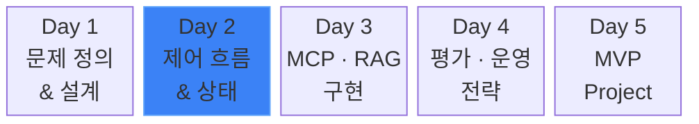
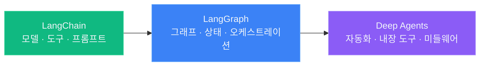
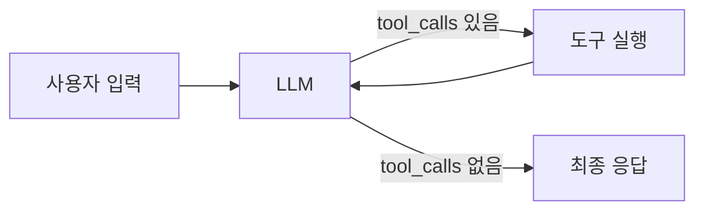
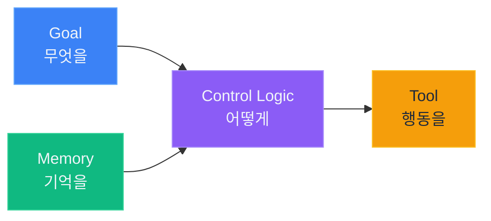
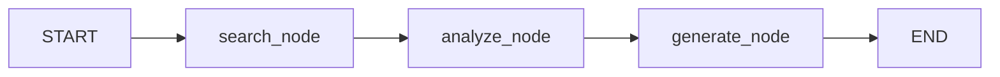
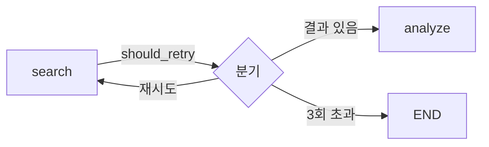
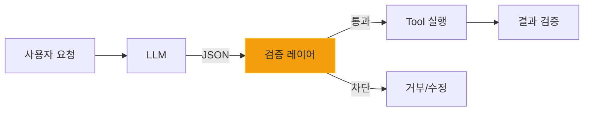

# AI Agent 전문 개발 과정

## Day 2 — 제어 흐름 & 상태 관리

<div class="mt-8 text-lg opacity-70">
  LangChain · LangGraph · Deep Agents 프레임워크로 배우는 Agent 설계
</div>

<div class="abs-br m-6 text-sm opacity-50">
  5일 과정 (40시간) · 강의 30% / 실습 70%
</div>

<!--
[스크립트 — script-writer가 작성 예정]
-->

---
transition: slide-left
---

## 5일 커리큘럼



<div class="grid grid-cols-5 gap-2 mt-6 text-sm">
  <div class="text-center opacity-50">Pain→Task→Tool<br/>프롬프트 전략<br/>MCP·RAG 판단</div>
  <div class="text-center font-bold text-blue-400">LangGraph<br/>Tool Validation<br/>리팩토링</div>
  <div class="text-center opacity-50">MCP 고급 설계<br/>RAG 튜닝<br/>Hybrid</div>
  <div class="text-center opacity-50">품질 평가<br/>모니터링<br/>서비스 아키텍처</div>
  <div class="text-center opacity-50">MVP 설계<br/>구현·시연<br/>발표</div>
</div>

<!--
[스크립트 — script-writer가 작성 예정]
-->

---
transition: slide-left
---

## Day 2 시간표

<div class="mt-2">

| 시간 | 내용 | 실습 |
|------|------|------|
| 08:00–08:20 | Langfuse 셀프 호스팅 | Docker Compose |
| 08:20–09:30 | 프레임워크 기초 (I DO) | `00_basics/` 00~04 |
| 09:30–10:00 | Deep Agents + 비교 | `05~06` 노트북 |
| 10:00–10:10 | 휴식 | |
| 10:10–12:00 | Agent 4요소 · LangGraph 이론 | 가이드 Session 1–2 |
| 12:00–13:00 | 점심 | |
| 13:00–14:30 | LangGraph 워크플로 실습 | `01_langgraph_workflows/` |
| 14:30–14:40 | 휴식 | |
| 14:40–15:40 | Tool 통제 & 미들웨어 | `02_tool_middleware/` |
| 15:40–15:50 | 휴식 | |
| 15:50–17:00 | 리팩토링 & Observability | 가이드 내 코드 예제 |

</div>

<!--
[스크립트 — script-writer가 작성 예정]
-->

---
transition: slide-left
---

## 환경 세팅

<div class="mt-2">

```bash
# 1. 의존성 설치 (day2/ 디렉토리에서)
cd labs/day2
uv sync

# 2. 환경변수 설정
cp .env.example .env
# .env에 OPENAI_API_KEY=sk-... 입력

# 3. VS Code에서 노트북 열기
code .
```

</div>

<div class="mt-4 bg-slate-800/50 rounded-lg p-4 text-center text-lg">
  <strong>VS Code</strong>에서 .ipynb 파일을 열고 Jupyter 커널을 선택하여 실행
</div>

<!--
[스크립트 — script-writer가 작성 예정]
-->

---
layout: section
transition: fade
---

# Langfuse 셀프 호스팅

## LLM Observability를 사내망에서

<div class="mt-4 opacity-70">Docker Compose로 20분 만에 구축</div>

<!--
[스크립트 — script-writer가 작성 예정]
-->

---
transition: slide-left
---

## 왜 Docker를 쓰는가

<div class="grid grid-cols-2 gap-6 mt-4">
<div class="bg-red-900/30 rounded-lg p-4">

<div class="text-red-400 font-bold text-center mb-3">직접 설치한다면</div>

<v-clicks>

- PostgreSQL 설치
- Redis 설치
- ClickHouse 설치
- MinIO 설치
- 버전 충돌, 포트 충돌...

</v-clicks>

</div>
<div class="bg-green-900/30 rounded-lg p-4">

<div class="text-green-400 font-bold text-center mb-3">Docker를 쓰면</div>

<v-clicks>

- `docker compose up -d`
- 끝

</v-clicks>

</div>
</div>

<v-click>

<div class="mt-4 bg-slate-800/50 rounded-lg p-4 text-center text-lg">
  각 서비스를 <strong>컨테이너</strong>라는 격리된 상자에 넣어 실행 — 내 PC 환경 오염 없음
</div>

</v-click>

<!--
[스크립트 — script-writer가 작성 예정]
-->

---
transition: slide-left
---

## Docker Desktop은 왜 설치하는가

<div class="mt-6">

<v-clicks>

- Docker는 원래 <strong>Linux 전용</strong> 기술
- Windows/macOS에서 쓰려면 <strong>가상 Linux 환경</strong>이 필요
- Docker Desktop이 이 환경을 <strong>자동으로 생성</strong>
- GUI 대시보드로 컨테이너 상태를 시각적으로 확인

</v-clicks>

</div>

<v-click>

<div class="mt-6 bg-slate-800/50 rounded-lg p-4 text-center text-lg">
  Docker Desktop이 실행 중이어야 <strong>docker 명령이 동작</strong>한다
</div>

</v-click>

<!--
[스크립트 — script-writer가 작성 예정]
-->

---
transition: slide-left
---

## Docker Compose 핵심 명령

<div class="mt-4">

| 명령 | 역할 |
|------|------|
| `docker compose up -d` | 모든 서비스 시작 (백그라운드) |
| `docker compose ps` | 서비스 상태 확인 |
| `docker compose logs -f` | 실시간 로그 확인 |
| `docker compose down` | 모든 서비스 중지 |
| `docker compose down -v` | 중지 + <strong>데이터 삭제</strong> |

</div>

<v-click>

<div class="mt-6 bg-slate-800/50 rounded-lg p-4 text-center text-lg">
  <strong>compose.yml</strong> = 어떤 서비스를 어떻게 실행할지 적은 레시피
</div>

</v-click>

<!--
[스크립트 — script-writer가 작성 예정]
-->

---
transition: slide-left
---

## Day 1에서 LangSmith를 배운 이유

<div class="mt-6">

<v-clicks>

- LLM Observability 플랫폼은 <strong>대부분 비슷한 기능</strong>을 제공
- LangSmith로 개념을 익히면 <strong>다른 도구에도 그대로 적용</strong>
- 트레이싱, 프롬프트 관리, 평가 — 핵심 개념은 동일

</v-clicks>

</div>

<v-click>

<div class="mt-6 bg-slate-800/50 rounded-lg p-4 text-center text-lg">
  "그런데 클라우드 서비스라 사내에서 못 쓰는 거 아닌가?"<br/>
  → 그래서 오늘은 <strong>직접 설치하는 Langfuse</strong>로 전환합니다
</div>

</v-click>

<!--
[스크립트 — script-writer가 작성 예정]
-->

---
transition: slide-left
---

## LangSmith vs Langfuse — 역할 비교

<div class="mt-2">

| 기준 | LangSmith | Langfuse |
|------|:---------:|:--------:|
| <strong>생태계 통합</strong> | LangChain 네이티브 | CallbackHandler |
| <strong>배포 환경</strong> | 클라우드 전용 | 클라우드 + 셀프 호스팅 |
| <strong>평가</strong> | Online + Offline | Online + Offline |
| <strong>프롬프트 관리</strong> | Hub + Playground | 버전 관리 + Playground |
| <strong>Agent 배포</strong> | Fleet / Studio | 미지원 |
| <strong>프레임워크 지원</strong> | 다중 (OpenAI, Anthropic 등) | 50+ (OpenTelemetry) |
| <strong>라이선스</strong> | 상용 (무료 티어) | 오픈소스 (MIT) |

</div>

<v-click>

<div class="mt-3 bg-slate-800/50 rounded-lg p-4 text-center text-lg">
  <strong>경쟁이 아니라 보완</strong> — 클라우드 OK면 LangSmith, 사내망이면 Langfuse
</div>

</v-click>

<!--
[스크립트 — script-writer가 작성 예정]
-->

---
transition: slide-left
---

## Langfuse 아키텍처

<div class="flex items-center justify-center mt-2 gap-3">
  <div class="bg-emerald-900/40 rounded-lg p-3 text-center text-sm">
    <div class="font-bold text-green-400">Agent</div>
    <div class="text-xs opacity-70">(Python)</div>
  </div>
  <div class="text-2xl opacity-50">→</div>
  <div class="bg-blue-900/60 rounded-lg p-4 text-center">
    <div class="font-bold text-blue-400 text-lg">langfuse-web</div>
    <div class="text-xs opacity-70">:3000</div>
  </div>
  <div class="text-2xl opacity-50">→</div>
  <div class="grid grid-cols-2 gap-2">
    <div class="bg-slate-700/50 rounded p-2 text-center text-xs">PostgreSQL<br/><span class="opacity-50">:5432</span></div>
    <div class="bg-slate-700/50 rounded p-2 text-center text-xs">ClickHouse<br/><span class="opacity-50">:8123</span></div>
    <div class="bg-slate-700/50 rounded p-2 text-center text-xs">Redis<br/><span class="opacity-50">:6379</span></div>
    <div class="bg-slate-700/50 rounded p-2 text-center text-xs">MinIO<br/><span class="opacity-50">:9090</span></div>
  </div>
</div>

<v-click>

<div class="mt-6 bg-slate-800/50 rounded-lg p-4 text-center text-lg">
  <strong>compose.yml</strong> 하나로 5개 서비스가 자동 실행
</div>

</v-click>

<!--
[스크립트 — script-writer가 작성 예정]
-->

---
transition: slide-left
---

## Step 1 — Docker Compose 실행

<div class="mt-4">

```bash
# Docker Desktop이 실행 중인지 확인
docker --version

# langfuse-self-host 디렉토리로 이동
cd labs/day2/langfuse-self-host

# 백그라운드 실행 (첫 실행: 이미지 다운로드 3~5분)
docker compose up -d
```

</div>

<v-click>

<div class="mt-4">

```bash
# 진행 상황 확인
docker compose logs -f langfuse-web

# 모든 서비스 상태 확인
docker compose ps
```

</div>

</v-click>

<!--
[스크립트 — script-writer가 작성 예정]
-->

---
transition: slide-left
---

## Step 2 — 계정 생성 & API 키

<div class="mt-4">

<v-clicks>

- 브라우저에서 `http://localhost:3000` 접속
- <strong>Sign Up</strong> → 이메일/비밀번호 입력 (로컬이라 아무 값 OK)
- Settings → API Keys → <strong>Create API Key</strong>
- `Secret Key`, `Public Key` 복사

</v-clicks>

</div>

<v-click>

<div class="mt-4">

```bash
# labs/day2/.env에 추가
LANGFUSE_SECRET_KEY=sk-lf-...
LANGFUSE_PUBLIC_KEY=pk-lf-...
LANGFUSE_HOST=http://localhost:3000
```

</div>

</v-click>

<!--
[스크립트 — script-writer가 작성 예정]
-->

---
transition: slide-left
---

## 연동 확인

<div class="mt-4">

```python
# 00_setup.ipynb 실행 시 아래가 출력되면 성공
# "Langfuse tracing ON — http://localhost:3000"
```

</div>

<v-click>

<div class="mt-6">

<v-clicks>

- 이후 모든 `agent.invoke()` 호출이 <strong>자동으로 Trace</strong>됨
- `localhost:3000`에서 실시간 확인 가능
- 실습 종료 후: `docker compose down`

</v-clicks>

</div>

</v-click>

<!--
[스크립트 — script-writer가 작성 예정]
-->

---
layout: section
transition: fade
---

# 프레임워크 기초

## LangChain · LangGraph · Deep Agents

<div class="mt-4 opacity-70">실습: 00_basics 노트북</div>

<!--
[스크립트 — script-writer가 작성 예정]
-->

---
transition: slide-left
---

## 3개 프레임워크의 계층 구조



<div class="mt-6">

<v-clicks>

- <strong>LangChain</strong> = 부품 (엔진, 바퀴)
- <strong>LangGraph</strong> = 설계도 (회로 다이어그램)
- <strong>Deep Agents</strong> = 완성차 (운전만 하면 됨)

</v-clicks>

</div>

<!--
[스크립트 — script-writer가 작성 예정]
-->

---
transition: slide-left
---

## LangChain — 기반 레이어

<div class="mt-4">

```python {1-3|5-8|10-11}{maxHeight:'340px'}
from langchain.tools import tool
from langchain.chat_models import init_chat_model
from langgraph.prebuilt import create_react_agent

@tool
def multiply(a: int, b: int) -> int:
    """두 수를 곱합니다."""
    return a * b

model = init_chat_model("gpt-5.4")
agent = create_react_agent(model, tools=[multiply])
```

</div>

<div class="mt-4 bg-slate-800/50 rounded-lg p-4 text-center text-lg">
  <strong>@tool</strong> 데코레이터 하나로 LLM이 호출 가능한 도구가 된다
</div>

<!--
[스크립트 — script-writer가 작성 예정]
-->

---
transition: slide-left
---

## LangChain — ReAct 자동 루프



<div class="mt-6">

<v-clicks>

- LLM이 도구 호출 여부를 <strong>스스로 판단</strong>
- 도구 결과를 받아 다시 LLM에 전달
- tool_calls가 없으면 자동 종료

</v-clicks>

</div>

<!--
[스크립트 — script-writer가 작성 예정]
-->

---
transition: slide-left
---

## LangGraph — 오케스트레이션

<div class="mt-2">

```python {1-4|6-9|11-14}{maxHeight:'340px'}
from langgraph.graph import StateGraph, START, END
from typing import TypedDict, Annotated
import operator
from langchain_core.messages import AnyMessage

class State(TypedDict):
    messages: Annotated[list[AnyMessage], operator.add]

def llm_node(state: State) -> dict:
    result = model.invoke(state["messages"])
    return {"messages": [result]}

graph = StateGraph(State)
graph.add_node("llm", llm_node)
```

</div>

<div class="mt-2 bg-slate-800/50 rounded-lg p-4 text-center text-lg">
  모든 Node는 <strong>State를 받아서 State를 반환</strong>한다
</div>

<!--
[스크립트 — script-writer가 작성 예정]
-->

---
transition: slide-left
---

## Deep Agents — 완성형 하네스

<div class="mt-2">

```python {1-2|4-7|9}{maxHeight:'300px'}
from deepagents import create_deep_agent
from langchain_openai import ChatOpenAI

agent = create_deep_agent(
    model=ChatOpenAI(model="gpt-5.4"),
    system_prompt="데이터 분석가입니다.",
)

# 내장 도구: ls, read_file, write_file, edit_file, glob, grep, write_todos, task
```

</div>

<div class="mt-4">

<v-clicks>

- 파일 도구 6종 + 계획 도구 + 서브에이전트 <strong>자동 포함</strong>
- `backend` 파라미터로 저장소 전환 (State → Filesystem → Store)
- LangGraph의 `CompiledStateGraph`를 반환

</v-clicks>

</div>

<!--
[스크립트 — script-writer가 작성 예정]
-->

---
transition: slide-left
---

## 프레임워크 선택 기준

<div class="mt-4">

| 기준 | LangChain | LangGraph | Deep Agents |
|------|:---------:|:---------:|:-----------:|
| 복잡도 | 낮음 | 중간 | 높음 (자동화) |
| 제어 수준 | ReAct 자동 | 노드 단위 | 미들웨어 |
| 파일 I/O | 수동 | 수동 | <strong>내장</strong> |
| 멀티에이전트 | 핸드오프 | 서브그래프 | 서브에이전트 |
| 계획 수립 | 수동 | 수동 | <strong>write_todos</strong> |

</div>

<v-click>

<div class="mt-4 bg-slate-800/50 rounded-lg p-4 text-center text-lg">
  단순 Tool 호출 → <strong>LangChain</strong> · 복잡한 분기 → <strong>LangGraph</strong> · 파일 작업 → <strong>Deep Agents</strong>
</div>

</v-click>

<!--
[스크립트 — script-writer가 작성 예정]
-->

---
transition: slide-left
---

## 실습: 프레임워크 기초 체험

<div class="bg-slate-800/50 rounded-lg p-6 mt-4">
  <div class="text-lg font-bold mb-4">00_basics 노트북 순서</div>

<v-clicks>

- `00_setup.ipynb` — 환경 설정, Langfuse 연동 (15분)
- `01_llm_basics.ipynb` — 메시지 구조, 스트리밍 (15분)
- `02_langchain_basics.ipynb` — @tool, ReAct Agent (20분)
- `03_langchain_memory.ipynb` — InMemorySaver, thread_id (15분)
- `04_langgraph_basics.ipynb` — StateGraph, Node-Edge (25분)

</v-clicks>

</div>

<!--
[스크립트 — script-writer가 작성 예정]
-->

---
transition: slide-left
---

## 실습: Deep Agents + 비교

<div class="bg-slate-800/50 rounded-lg p-6 mt-4">

<v-clicks>

- `05_deep_agents_basics.ipynb` — create_deep_agent, 내장 도구, Backend (20분)
- `06_comparison.ipynb` — 3 프레임워크 동일 작업 비교 (10분)

</v-clicks>

</div>

<v-click>

<div class="mt-6 text-center text-lg">
  같은 "웹 검색 Agent"가 프레임워크마다 <strong>어떻게 달라지는지</strong> 직접 확인
</div>

</v-click>

<!--
[스크립트 — script-writer가 작성 예정]
-->

---
layout: section
transition: fade
---

# Agent 4요소

## Goal · Memory · Tool · Control Logic

<div class="mt-4 opacity-70">Session 1 이론</div>

<!--
[스크립트 — script-writer가 작성 예정]
-->

---
transition: slide-left
---

## Agent = 4가지 요소의 조합



<div class="mt-6">

| 요소 | 핵심 질문 |
|------|-----------|
| <strong>Goal</strong> | "성공 조건은 무엇인가?" |
| <strong>Memory</strong> | "어떤 컨텍스트를 유지하는가?" |
| <strong>Tool</strong> | "어떤 외부 능력이 필요한가?" |
| <strong>Control Logic</strong> | "언제 멈추고, 언제 재시도하는가?" |

</div>

<!--
[스크립트 — script-writer가 작성 예정]
-->

---
transition: slide-left
---

## Goal — 목표 정의

<div class="mt-4">

```python {1-2|4-8}
# 나쁜 예: 목표가 모호함
goal = "데이터를 분석해"

# 좋은 예: 조건이 명확함
goal = Goal(
    description="판매 데이터에서 이상치를 탐지한다",
    success_condition="이상치 목록 + 근거 보고서 생성 완료",
    abort_condition="데이터 접근 실패 또는 3회 재시도 초과",
)
```

</div>

<v-click>

<div class="mt-4 bg-slate-800/50 rounded-lg p-4 text-center text-lg">
  잘못 정의된 Goal은 <strong>무한 루프</strong>의 주요 원인
</div>

</v-click>

<!--
[스크립트 — script-writer가 작성 예정]
-->

---
transition: slide-left
---

## Goal — 프레임워크별 구현

<div class="mt-4">

| | LangChain | LangGraph | Deep Agents |
|--|:---------:|:---------:|:-----------:|
| 방식 | SystemMessage | SystemMessage | system_prompt |
| 확장 | — | — | AGENTS.md |

</div>

<v-click>

<div class="mt-4">

```python
# Deep Agents — 문서로 Goal 관리 (코드 수정 없이 변경 가능)
agent = create_deep_agent(
    model=model,
    system_prompt="판매 이상치를 탐지합니다.",
    memory=["/project/AGENTS.md"],  # 영구 규칙 자동 주입
)
```

</div>

</v-click>

<!--
[스크립트 — script-writer가 작성 예정]
-->

---
transition: slide-left
---

## Memory — 4가지 레이어

<div class="mt-2">

```
┌─────────────────────────────────────┐
│ Episodic Memory   (이번 대화/세션)   │ ← 가장 빠름, 가장 휘발성
├─────────────────────────────────────┤
│ Working Memory    (현재 Task 상태)  │ ← Agent State에 보관
├─────────────────────────────────────┤
│ Semantic Memory   (도메인 지식)     │ ← Vector DB, RAG
├─────────────────────────────────────┤
│ Procedural Memory (실행 패턴)       │ ← 프롬프트, Few-shot
└─────────────────────────────────────┘
```

</div>

<v-click>

<div class="mt-4 bg-slate-800/50 rounded-lg p-4 text-center text-lg">
  <strong>Working Memory</strong>에 무엇을 담을지 결정하는 것이 설계의 핵심
</div>

</v-click>

<!--
[스크립트 — script-writer가 작성 예정]
-->

---
transition: slide-left
---

## Memory — 프레임워크별 구현

<div class="mt-4">

| | LangChain | LangGraph | Deep Agents |
|--|:---------:|:---------:|:-----------:|
| 단기 | InMemorySaver | 동일 | 동일 |
| 장기 | InMemoryStore (수동) | Store (수동) | CompositeBackend (자동) |

</div>

<v-click>

<div class="mt-4">

```python
# Deep Agents — 경로 기반 자동 라우팅
backend=lambda rt: CompositeBackend(
    default=StateBackend(rt),               # / → 임시
    routes={"/memories/": StoreBackend(rt)}, # /memories/ → 영속
)
# /memories/에 쓰면 자동으로 장기 저장!
```

</div>

</v-click>

<!--
[스크립트 — script-writer가 작성 예정]
-->

---
transition: slide-left
---

## Tool — 원자적 설계

<div class="grid grid-cols-2 gap-6 mt-4">
<div>

<div class="text-red-400 font-bold mb-2">나쁜 예</div>

```python
# 하나의 Tool이 3가지 역할
def search_and_summarize(q):
    results = web_search(q)
    summary = llm_summarize(results)
    save_to_db(summary)
    return summary
```

</div>
<div>

<div class="text-green-400 font-bold mb-2">좋은 예</div>

```python
# 각 Tool은 하나의 역할
@tool
def web_search(q: str) -> list:
    ...
@tool
def summarize(text: str) -> str:
    ...
@tool
def save_result(k: str, v: str):
    ...
```

</div>
</div>

<!--
[스크립트 — script-writer가 작성 예정]
-->

---
transition: slide-left
---

## Tool — 프레임워크별 비교

<div class="mt-4">

| | LangChain | LangGraph | Deep Agents |
|--|:---------:|:---------:|:-----------:|
| 커스텀 도구 | @tool | @tool | @tool |
| 파일 I/O | 수동 | 수동 | <strong>내장 6종</strong> |
| 계획 수립 | 수동 | 수동 | <strong>write_todos</strong> |
| 서브에이전트 | 수동 | 서브그래프 | <strong>task</strong> |
| 셸 실행 | 수동 | 수동 | <strong>execute</strong> |

</div>

<v-click>

<div class="mt-4 bg-slate-800/50 rounded-lg p-4 text-center text-lg">
  Deep Agents는 <strong>create_deep_agent()</strong> 한 번이면 코딩 에이전트 완성
</div>

</v-click>

<!--
[스크립트 — script-writer가 작성 예정]
-->

---
transition: slide-left
---

## Control Logic — 세 가지 패턴

<div class="grid grid-cols-3 gap-4 mt-4">

<v-click>

<div class="bg-emerald-900/40 rounded-lg p-4 text-center">
  <div class="text-green-400 font-bold text-lg mb-2">LangChain</div>
  <div class="text-sm">ReAct 자동 루프</div>
  <div class="mt-2 text-xs opacity-70">블랙박스 — LLM이 알아서 판단</div>
</div>

</v-click>

<v-click>

<div class="bg-blue-900/40 rounded-lg p-4 text-center">
  <div class="text-blue-400 font-bold text-lg mb-2">LangGraph</div>
  <div class="text-sm">Graph 명시적 제어</div>
  <div class="mt-2 text-xs opacity-70">노드/엣지 단위로 흐름 정의</div>
</div>

</v-click>

<v-click>

<div class="bg-purple-900/40 rounded-lg p-4 text-center">
  <div class="text-purple-400 font-bold text-lg mb-2">Deep Agents</div>
  <div class="text-sm">Middleware 파이프라인</div>
  <div class="mt-2 text-xs opacity-70">미들웨어로 인터셉트 + 확장</div>
</div>

</v-click>

</div>

<v-click>

<div class="mt-6 bg-slate-800/50 rounded-lg p-4 text-center text-lg">
  제어 수준: <strong>자동(LangChain)</strong> → <strong>명시적(LangGraph)</strong> → <strong>자동+확장(Deep Agents)</strong>
</div>

</v-click>

<!--
[스크립트 — script-writer가 작성 예정]
-->

---
transition: slide-left
---

## 4요소 종합 비교

<div class="mt-4">

| 요소 | LangChain | LangGraph | Deep Agents |
|------|:---------:|:---------:|:-----------:|
| Goal | SystemMessage | SystemMessage | system_prompt + AGENTS.md |
| Memory | 체크포인터 + 수동 | 체크포인터 + Store | CompositeBackend 자동 |
| Tool | @tool 직접 정의 | @tool + bind_tools | @tool + <strong>내장 8종</strong> |
| Control | ReAct 자동 | Graph 명시적 | Middleware 자동+확장 |

</div>

<v-click>

<div class="mt-4 bg-slate-800/50 rounded-lg p-4 text-center text-lg">
  세 프레임워크는 경쟁이 아니라 <strong>계층 구조</strong>다
</div>

</v-click>

<!--
[스크립트 — script-writer가 작성 예정]
-->

---
transition: slide-left
---

## Single-step vs Multi-step

<div class="grid grid-cols-2 gap-6 mt-4">
<div class="bg-green-900/30 rounded-lg p-4">

<div class="text-green-400 font-bold text-center mb-3">Single-step</div>

<v-clicks>

- LLM 호출 <strong>1회</strong>
- 상태 관리 불필요
- 분류, 요약, 번역
- 비용 낮음

</v-clicks>

</div>
<div class="bg-blue-900/30 rounded-lg p-4">

<div class="text-blue-400 font-bold text-center mb-3">Multi-step</div>

<v-clicks>

- LLM 호출 <strong>여러 번</strong>
- 상태 관리 필수
- 조사, 계획, 자동화
- 실패 복구 가능

</v-clicks>

</div>
</div>

<v-click>

<div class="mt-4 bg-slate-800/50 rounded-lg p-4 text-center text-lg">
  "LLM 한 번 호출로 끝나는가?" → Yes면 Single-step
</div>

</v-click>

<!--
[스크립트 — script-writer가 작성 예정]
-->

---
layout: section
transition: fade
---

# LangGraph 제어 흐름

## Node · Edge · State

<div class="mt-4 opacity-70">Session 2 이론</div>

<!--
[스크립트 — script-writer가 작성 예정]
-->

---
transition: slide-left
---

## Node–Edge–State



<div class="mt-4">

<v-clicks>

- <strong>Node</strong> = Python 함수 (State → dict)
- <strong>Edge</strong> = 다음 Node 연결
- <strong>State</strong> = 모든 Node가 공유하는 데이터

</v-clicks>

</div>

<v-click>

<div class="mt-4 bg-slate-800/50 rounded-lg p-4 text-center text-lg">
  핵심 계약: Node는 <strong>State를 받아서 dict를 반환</strong>한다
</div>

</v-click>

<!--
[스크립트 — script-writer가 작성 예정]
-->

---
transition: slide-left
---

## State 설계 — Annotated 리듀서

<div class="mt-2">

```python {1-3|5-10}
from typing import TypedDict, Annotated
import operator

class AgentState(TypedDict):
    query: str                                  # 단순 덮어쓰기
    messages: Annotated[list, operator.add]      # 리스트 누적
    retry_count: Annotated[int, operator.add]    # 카운터 누적
```

</div>

<v-click>

<div class="mt-4">

| 필드 | 현재 값 | 반환 값 | 결과 |
|------|--------|--------|------|
| query | "AI" | "ML" | <strong>"ML"</strong> (덮어쓰기) |
| messages | ["a"] | ["b"] | <strong>["a","b"]</strong> (누적) |
| retry_count | 2 | 1 | <strong>3</strong> (합산) |

</div>

</v-click>

<!--
[스크립트 — script-writer가 작성 예정]
-->

---
transition: slide-left
---

## 조건 분기 — Conditional Edge



<div class="mt-4">

```python {1-6|8-13}
def should_retry(state: WorkflowState) -> str:
    if state["retry_count"] >= 3:
        return "fail"
    if not state["search_results"]:
        return "retry"
    return "analyze"

graph.add_conditional_edges(
    "search",
    should_retry,
    {"analyze": "analyze", "retry": "search", "fail": END}
)
```

</div>

<!--
[스크립트 — script-writer가 작성 예정]
-->

---
transition: slide-left
---

## Workflow vs Agent

<div class="grid grid-cols-2 gap-6 mt-4">
<div>


</div>
<div>

<v-clicks>

- <strong>Workflow</strong> — 흐름이 코드로 고정
- <strong>Agent</strong> — LLM이 스스로 흐름 결정
- 대부분의 실무는 <strong>Workflow + Agent 혼합</strong>

</v-clicks>

</div>
</div>

<div class="absolute bottom-4 left-14 text-xs opacity-50">
  출처: docs.langchain.com/oss/python/langgraph/workflows-agents
</div>

<!--
[스크립트 — script-writer가 작성 예정]
-->

---
transition: slide-left
---

## Prompt Chaining

<div class="grid grid-cols-2 gap-6 mt-2">
<div>


</div>
<div>

<v-clicks>

- LLM 호출을 <strong>순차적으로 연결</strong>
- 이전 출력이 다음 입력으로 전달
- 예: 번역 → 검수 → 포맷팅

</v-clicks>

</div>
</div>

<!--
[스크립트 — script-writer가 작성 예정]
-->

---
transition: slide-left
---

## Parallelization

<div class="grid grid-cols-2 gap-6 mt-2">
<div>


</div>
<div>

<v-clicks>

- 독립적인 작업을 <strong>동시 실행</strong>
- LangGraph의 `Send()` API 활용
- 예: 3개 URL 병렬 크롤링

</v-clicks>

</div>
</div>

<!--
[스크립트 — script-writer가 작성 예정]
-->

---
transition: slide-left
---

## Routing

<div class="grid grid-cols-2 gap-6 mt-2">
<div>


</div>
<div>

<v-clicks>

- 입력을 분류하여 <strong>전문 경로로 분기</strong>
- `add_conditional_edges` 활용
- 예: 쿼리 → 단순/코드/복잡 처리

</v-clicks>

</div>
</div>

<!--
[스크립트 — script-writer가 작성 예정]
-->

---
transition: slide-left
---

## Orchestrator-Worker

<div class="grid grid-cols-2 gap-6 mt-2">
<div>


</div>
<div>

<v-clicks>

- 오케스트레이터가 <strong>태스크를 분해</strong>
- 워커에게 위임 후 결과 통합
- 예: 리서치 계획 → 병렬 조사 → 보고서

</v-clicks>

</div>
</div>

<!--
[스크립트 — script-writer가 작성 예정]
-->

---
transition: slide-left
---

## Evaluator-Optimizer

<div class="grid grid-cols-2 gap-6 mt-2">
<div>


</div>
<div>

<v-clicks>

- 생성 LLM + 평가 LLM <strong>반복 개선</strong>
- 품질 기준 달성까지 루프
- 예: 코드 생성 → 테스트 → 수정

</v-clicks>

</div>
</div>

<!--
[스크립트 — script-writer가 작성 예정]
-->

---
transition: slide-left
---

## Agent 패턴 — Tool-Calling Loop

<div class="grid grid-cols-2 gap-6 mt-2">
<div>


</div>
<div>

<v-clicks>

- LLM이 <strong>스스로 도구 선택</strong>과 순서를 결정
- 연속 피드백 루프로 동작
- `create_react_agent`가 이 패턴을 구현

</v-clicks>

</div>
</div>

<div class="absolute bottom-4 left-14 text-xs opacity-50">
  출처: docs.langchain.com/oss/python/langgraph/workflows-agents
</div>

<!--
[스크립트 — script-writer가 작성 예정]
-->

---
transition: slide-left
---

## 실습: LangGraph 워크플로

<div class="bg-slate-800/50 rounded-lg p-6 mt-4">
  <div class="text-lg font-bold mb-4">01_langgraph_workflows 노트북</div>

<v-clicks>

- `01_graph_api.ipynb` — StateGraph, 조건 분기, 리듀서 (30분)
- `02_workflows.ipynb` — 5가지 워크플로 패턴 실행 (40분)

</v-clicks>

</div>

<!--
[스크립트 — script-writer가 작성 예정]
-->

---
layout: section
transition: fade
---

# Tool 호출 통제

## Schema · Validation · Middleware

<div class="mt-4 opacity-70">Session 3 이론 + 실습</div>

<!--
[스크립트 — script-writer가 작성 예정]
-->

---
transition: slide-left
---

## Tool 호출의 위험



<div class="mt-4">

<v-clicks>

- LLM은 여전히 <strong>잘못된 인자</strong>로 Tool을 호출한다
- 이메일 발송, 파일 삭제 등 <strong>되돌릴 수 없는 행동</strong>
- 반드시 <strong>검증 레이어</strong>를 거쳐야 한다

</v-clicks>

</div>

<!--
[스크립트 — script-writer가 작성 예정]
-->

---
transition: slide-left
---

## Pydantic args_schema

<div class="mt-2">

```python {1-2|4-11|13-17}{maxHeight:'340px'}
from pydantic import BaseModel, Field
from langchain_core.tools import tool

class SearchInput(BaseModel):
    query: str = Field(
        description="검색 키워드. 최대 100자.",
        max_length=100,
    )
    max_results: int = Field(
        default=5, ge=1, le=20,
    )

@tool(args_schema=SearchInput)
def web_search(query: str, max_results: int = 5):
    """웹에서 정보를 검색합니다.
    실시간 뉴스, 특정 사실 확인에 사용하세요.
    LLM이 이미 아는 일반 지식에는 사용하지 마세요."""
```

</div>

<!--
[스크립트 — script-writer가 작성 예정]
-->

---
transition: slide-left
---

## 무한 루프 방지 — 3가지 패턴

<div class="mt-4">

<v-clicks>

- <strong>패턴 1</strong>: 동일 Tool 반복 → `search("AI") → 결과 없음 → search("AI") → ...`
- <strong>패턴 2</strong>: Tool 간 순환 → `analyze() → fetch() → analyze() → ...`
- <strong>패턴 3</strong>: 품질 미달 루프 → `write() → check() → rewrite() → ...`

</v-clicks>

</div>

<v-click>

<div class="mt-6">

```python
class LoopGuard:
    def __init__(self, max_steps=20, max_same_tool=3):
        self.max_steps = max_steps
        self.max_same_tool = max_same_tool
    # 최대 스텝 초과 → 강제 중단
    # 동일 Tool 연속 N회 → 강제 중단
```

</div>

</v-click>

<!--
[스크립트 — script-writer가 작성 예정]
-->

---
transition: slide-left
---

## 미들웨어로 Tool 통제

<div class="mt-2">

```python {1-4|6-9}
# 호출 횟수 제한
from deepagents.middleware import ToolCallLimitMiddleware

middleware = ToolCallLimitMiddleware(max_calls=20)

# 커스텀: 실행 시간 측정
@wrap_tool_call
def timing_middleware(tool_call, next):
    start = time.time()
    result = next(tool_call)
    print(f"{tool_call.name}: {time.time()-start:.2f}s")
    return result
```

</div>

<v-click>

<div class="mt-4 bg-slate-800/50 rounded-lg p-4 text-center text-lg">
  미들웨어 = Tool 호출 전후에 <strong>코드를 끼워넣는</strong> 패턴
</div>

</v-click>

<!--
[스크립트 — script-writer가 작성 예정]
-->

---
transition: slide-left
---

## 실습: Tool 검증 & 미들웨어

<div class="bg-slate-800/50 rounded-lg p-6 mt-4">
  <div class="text-lg font-bold mb-4">02_tool_middleware 노트북</div>

<v-clicks>

- `01_tools.ipynb` — Pydantic 스키마, Structured Output (25분)
- `02_middleware.ipynb` — ToolCallLimit, 커스텀 미들웨어 (25분)

</v-clicks>

</div>

<!--
[스크립트 — script-writer가 작성 예정]
-->

---
layout: section
transition: fade
---

# 구조 리팩토링

## 단일 Agent → 확장형 설계

<div class="mt-4 opacity-70">Session 4 이론</div>

<!--
[스크립트 — script-writer가 작성 예정]
-->

---
transition: slide-left
---

## 단일 Agent의 문제

<div class="mt-2">

```python
def run_agent(input):
    result1 = llm_call_1(input)        # LLM과 로직이 섞임
    result2 = tool_call(result1)       # Tool이 직접 연결됨
    result3 = llm_call_2(result2)      # 중간 상태 추적 불가
    return result3
```

</div>

<v-click>

<div class="mt-4 text-center">

```
[확장형 구조]
┌─────────┐    ┌──────────┐    ┌───────────┐
│ Planner │ →  │ Executor │ →  │ Validator │
└─────────┘    └──────────┘    └───────────┘
     ↑                ↑               ↑
  교체 가능        독립 테스트       독립 교체
```

</div>

</v-click>

<!--
[스크립트 — script-writer가 작성 예정]
-->

---
transition: slide-left
---

## 전환 시점 판단

<div class="mt-6">

<v-clicks>

- Tool이 <strong>3개를 초과</strong>할 때
- 분기 조건이 <strong>2개를 초과</strong>할 때
- 실행 시간이 <strong>10초를 초과</strong>할 때
- 팀원이 코드를 혼자 <strong>이해하기 어렵다</strong>고 할 때

</v-clicks>

</div>

<v-click>

<div class="mt-6 bg-slate-800/50 rounded-lg p-4 text-center text-lg">
  "조기 최적화를 피한다" — 단순하게 시작하고, 병목이 <strong>증명</strong>되었을 때 확장
</div>

</v-click>

<!--
[스크립트 — script-writer가 작성 예정]
-->

---
transition: slide-left
---

## Observability — Langfuse 연동

<div class="mt-2">

```python {1-2|4-7}
from langfuse.langchain import CallbackHandler
handler = CallbackHandler()

result = agent.invoke(
    {"messages": [...]},
    config={"callbacks": [handler]},
)
# → Langfuse 대시보드에서 Trace 확인
```

</div>

<!--
[스크립트 — script-writer가 작성 예정]
-->

---
transition: slide-left
---

## Langfuse가 추적하는 것

<div class="mt-4">

<v-clicks>

- Node별 <strong>실행 시간</strong> — 어디서 병목이 발생하는가
- <strong>토큰 비용</strong> — 호출당 얼마나 소비하는가
- <strong>오류 로그</strong> — 어떤 Node에서 실패했는가
- LangSmith 또는 Langfuse 중 선택 가능

</v-clicks>

</div>

<v-click>

<div class="mt-6 bg-slate-800/50 rounded-lg p-4 text-center text-lg">
  Trace 없이 프로덕션에 배포하지 않는다 — <strong>유일한 디버깅 수단</strong>
</div>

</v-click>

<!--
[스크립트 — script-writer가 작성 예정]
-->

---
transition: slide-left
---

## Deep Agents가 자동화하는 것

<div class="mt-4">

| 수동 구현 | Deep Agents 자동화 |
|-----------|-------------------|
| Planner 클래스 | <strong>write_todos</strong> |
| Executor 분리 | <strong>task</strong> (서브에이전트) |
| Tool 래퍼 | <strong>FilesystemMiddleware</strong> |
| Memory 관리 | <strong>SummarizationMiddleware</strong> |
| HITL 게이트 | <strong>interrupt_on</strong> |

</div>

<v-click>

<div class="mt-4">

```python
agent = create_deep_agent(
    model=model,
    interrupt_on={"execute": True},  # 위험한 도구는 승인 필요
)
```

</div>

</v-click>

<!--
[스크립트 — script-writer가 작성 예정]
-->

---
transition: slide-left
---

## Day 2 핵심 정리

<div class="grid grid-cols-2 gap-4 mt-4">
<div class="bg-slate-800/50 rounded-lg p-4">
  <div class="font-bold text-lg mb-2">Agent 4요소</div>
  Goal · Memory · Tool · Control Logic
</div>
<div class="bg-slate-800/50 rounded-lg p-4">
  <div class="font-bold text-lg mb-2">프레임워크 계층</div>
  LangChain → LangGraph → Deep Agents
</div>
<div class="bg-slate-800/50 rounded-lg p-4">
  <div class="font-bold text-lg mb-2">LangGraph 핵심</div>
  Node-Edge-State + Conditional Edge
</div>
<div class="bg-slate-800/50 rounded-lg p-4">
  <div class="font-bold text-lg mb-2">Tool 통제</div>
  Schema + Middleware + LoopGuard
</div>
</div>

<!--
[스크립트 — script-writer가 작성 예정]
-->

---
layout: end
---

# Day 3 예고

## MCP · RAG 구현 & 외부 시스템 연동

<div class="mt-6 opacity-70">
  MCP 고급 설계 · RAG 튜닝 · Hybrid 아키텍처
</div>

<!--
[스크립트 — script-writer가 작성 예정]
-->
