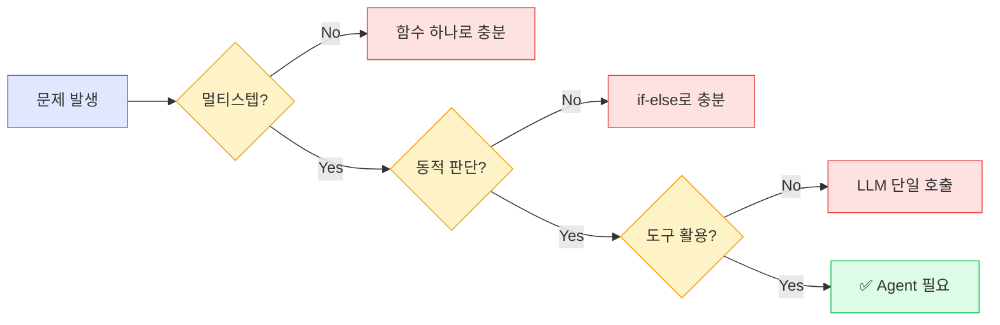
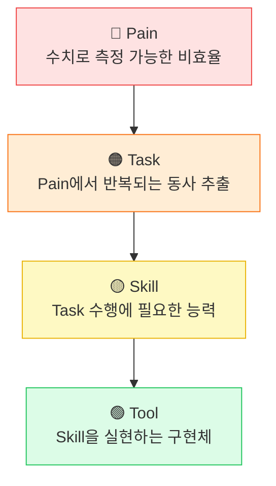
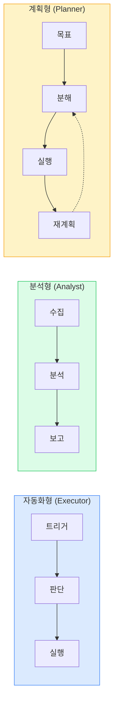

# AI Agent 전문 개발 과정

Session 1: Agent 문제 정의와 과제 도출

<div class="abs-br m-6 text-sm opacity-50">
Day 1 | Session 1 | 2h
</div>

<!--
[스크립트]
안녕하세요, AI Agent 전문 개발 과정에 오신 것을 환영합니다.
오늘 첫 번째 세션에서는 Agent를 만들기 전에 반드시 답해야 할 근본적인 질문부터 시작하겠습니다.
"이 문제가 정말 Agent가 필요한가?" — 이 질문에 체계적으로 답하는 방법을 배우게 됩니다.

[Q&A 대비]
Q: 이 과정에서 실제로 Agent를 만들어보나요?
A: 네, 이 세션에서는 먼저 문제를 정의하는 방법을 배우고, 이후 세션에서 직접 구현합니다. 좋은 Agent는 좋은 문제 정의에서 시작합니다.

전환: 먼저 오늘 세션의 학습 목표를 살펴보겠습니다.
시간: 1분
-->

---
transition: fade
---

# 학습 목표

<v-clicks>

- AI Agent가 적합한 문제와 부적합한 문제를 구분할 수 있다
- Pain - Task - Skill - Tool 프레임워크로 업무를 체계적으로 분해할 수 있다
- RAG와 Agent의 구조적 차이를 이해하고 상황에 맞는 아키텍처를 선택할 수 있다

</v-clicks>

<!--
[click]
첫째, Agent가 적합한 문제와 부적합한 문제를 명확히 구분하는 기준을 배웁니다. 모든 문제에 Agent가 필요한 것은 아닙니다.

[click]
둘째, Pain-Task-Skill-Tool이라는 4단계 프레임워크를 활용해서 업무를 체계적으로 분해하는 방법을 익힙니다.

[click]
셋째, 실무에서 가장 자주 부딪히는 의사결정 — "RAG로 충분한가, Agent가 필요한가" — 에 대한 판단 기준을 세웁니다.

이 세 가지를 마스터하면, Agent 프로젝트를 시작할 때 가장 흔한 실수를 피할 수 있습니다.

전환: 그러면 첫 번째 주제부터 시작하겠습니다.
시간: 1분
-->

---
layout: section
transition: fade
---

# 1. Agent가 적합한 문제 유형

<!--
[스크립트]
첫 번째 주제는 "Agent가 적합한 문제 유형 정의"입니다.
AI Agent라는 단어가 유행처럼 번지고 있지만, 모든 문제에 Agent가 적합한 것은 아닙니다.
잘못 적용하면 단순 스크립트로 풀 수 있는 문제에 불필요한 복잡성만 추가하게 됩니다.
2023년에서 2024년 사이에 많은 기업이 Agent 도입을 시도했지만 문제 유형을 잘못 판단해서 실패한 사례가 많았습니다.

전환: Agent를 만들기 전에 먼저 물어야 할 핵심 질문이 있습니다.
시간: 1분
-->

---

# 먼저 물어야 할 질문

<div class="mt-12 flex justify-center">
<div class="bg-amber-50 dark:bg-amber-900/30 rounded-lg p-8 text-center max-w-xl">
<p class="text-2xl font-bold text-amber-800 dark:text-amber-200">
"이 문제가 정말 Agent가 필요한가?"
</p>
</div>
</div>

<div class="mt-8 text-center text-gray-500 text-sm">
Agent를 만들기 전에 반드시 답해야 할 질문
</div>

<!--
[스크립트]
Agent를 만들기 전에 반드시 이 질문을 던져야 합니다.
"이 문제가 정말 Agent가 필요한가?"
이 질문에 명확하게 "예"라고 답할 수 없다면, 더 단순한 솔루션을 먼저 고려해야 합니다.
많은 팀이 이 질문을 건너뛰고 바로 Agent 개발에 뛰어들었다가, 단순 스크립트로도 충분한 문제에 수개월을 낭비하는 경우가 있습니다.

[Q&A 대비]
Q: 그럼 Agent가 필요 없는 경우가 더 많은 건가요?
A: 네, 실제로 그렇습니다. 현업 업무의 상당수는 고정된 규칙 기반 자동화로 충분합니다. Agent가 진짜 빛나는 영역은 분명히 있지만, 그 영역을 정확히 아는 것이 중요합니다.

전환: 그러면 전통적 자동화와 Agent의 근본적 차이를 살펴보겠습니다.
시간: 1분
-->

---
layout: two-cols-header
---

# 전통적 자동화 vs AI Agent

::left::

<div class="pr-4">
<div class="bg-red-100 dark:bg-red-900/30 rounded-lg p-4 mb-4">
<h3 class="text-red-600 dark:text-red-400 font-semibold">전통적 자동화</h3>
<p class="text-sm mt-2">스크립트, ETL, 크론잡</p>
</div>

<v-clicks>

- 사전 정의된 <strong>고정 경로</strong> 실행
- 입력이 같으면 <strong>항상 같은 결과</strong>

</v-clicks>
</div>

::right::

<div class="pl-4">
<div class="bg-blue-100 dark:bg-blue-900/30 rounded-lg p-4 mb-4">
<h3 class="text-blue-600 dark:text-blue-400 font-semibold">AI Agent</h3>
<p class="text-sm mt-2">LLM 기반 동적 시스템</p>
</div>

<v-clicks>

- 중간 결과를 <strong>관찰</strong>하고 다음 행동을 <strong>동적 결정</strong>
- <strong>Observe → Think → Act</strong> 루프

</v-clicks>
</div>

<style>
.two-cols-header { column-gap: 2rem; }
</style>

<!--
[스크립트]
핵심 차이를 먼저 이해해야 합니다.
왼쪽은 전통적 자동화입니다. 스크립트, ETL, 크론잡 같은 것들이죠.
[click] 이것들은 사전에 정의된 고정 경로를 그대로 실행합니다.
[click] 입력이 같으면 항상 같은 결과가 나옵니다. 결정론적이죠.

오른쪽은 AI Agent입니다.
[click] Agent는 중간 결과를 관찰하고, 그에 따라 다음 행동을 동적으로 결정합니다.
[click] 이것이 바로 Observe-Think-Act 루프입니다. 관찰하고, 생각하고, 행동하는 사이클이죠.

이 차이가 Agent의 가장 근본적인 특성입니다.

전환: 그러면 Agent가 필요한 구체적 조건 세 가지를 살펴보겠습니다.
시간: 2분
-->

---

# Agent가 필요한 3가지 조건



<div class="mt-4 text-center text-sm text-gray-500">
세 가지 조건을 모두 만족해야 Agent가 적합하다
</div>

<!--
[스크립트]
Agent가 정말 필요한지 판단하는 의사결정 트리입니다.
문제가 발생하면 세 가지 질문을 순서대로 던집니다.

첫째, "이 작업이 2단계 이상의 순차적 과정을 요구하는가?" — 멀티스텝인지 확인합니다.
단일 API 호출로 끝나는 작업이라면 함수 하나로 충분합니다.

둘째, "중간 결과에 따라 다음 행동이 달라져야 하는가?" — 동적 판단이 필요한지 확인합니다.
분기가 사전에 고정되어 있다면 if-else로 충분합니다.

셋째, "외부 API, DB, 파일 시스템과 상호작용하는가?" — 도구 활용이 필요한지 확인합니다.
LLM만으로는 실세계에 영향을 줄 수 없으니까요.

세 가지를 모두 만족해야 Agent가 적합합니다.

[Q&A 대비]
Q: 두 가지만 만족하면 Agent를 쓰면 안 되나요?
A: 꼭 안 된다기보다는, 더 단순한 솔루션이 있을 가능성이 높다는 의미입니다. 예를 들어 멀티스텝이고 도구를 쓰지만 판단이 고정적이라면, 파이프라인 도구인 Airflow가 더 적합할 수 있습니다.

전환: 각 조건을 좀 더 구체적으로 살펴보겠습니다.
시간: 2분
-->

---

# 조건 상세: 멀티스텝과 동적 판단

<div class="grid grid-cols-2 gap-6 mt-4">
<div class="bg-blue-50 dark:bg-blue-900/30 rounded-lg p-4">
<h3 class="text-blue-700 dark:text-blue-300 font-semibold mb-3">멀티스텝 (Multi-step)</h3>
<v-clicks>

- 작업이 <strong>2단계 이상</strong>의 순차적 과정
- 단일 API 호출로 끝나면 함수로 충분

</v-clicks>
</div>

<div class="bg-green-50 dark:bg-green-900/30 rounded-lg p-4">
<h3 class="text-green-700 dark:text-green-300 font-semibold mb-3">동적 판단 (Dynamic Decision)</h3>
<v-clicks>

- 중간 결과에 따라 <strong>다음 행동이 달라짐</strong>
- LLM이 상황을 판단해야 할 때 Agent 필요

</v-clicks>
</div>
</div>

<v-click>
<div class="bg-purple-50 dark:bg-purple-900/30 rounded-lg p-4 mt-4">
<h3 class="text-purple-700 dark:text-purple-300 font-semibold mb-3">도구 활용 (Tool Usage)</h3>

- 외부 API, DB, 파일 시스템과 <strong>상호작용</strong>
- LLM만으로는 실세계에 영향을 줄 수 없다

</div>
</v-click>

<!--
[스크립트]
세 가지 조건을 하나씩 살펴봅시다.

[click] 멀티스텝입니다. 작업이 2단계 이상의 순차적 과정을 요구해야 합니다.
[click] 단일 API 호출로 끝나는 작업이라면 굳이 Agent를 쓸 이유가 없습니다.

[click] 동적 판단입니다. 중간 결과에 따라 다음 행동이 달라져야 합니다.
[click] 핵심은 "LLM이 상황을 판단해야 하는가"입니다. 분기 조건이 사전에 고정되어 있다면 if-else로 충분합니다.

[click] 마지막으로 도구 활용입니다. Agent는 외부 시스템과 상호작용해서 실세계에 영향을 줄 수 있어야 합니다.
LLM 단독으로는 텍스트를 생성할 뿐, 이메일을 보내거나 티켓을 만들지는 못하니까요.

전환: 이 조건들을 실제 예시와 함께 코드로 비교해봅시다.
시간: 2분
-->

---

# 코드로 보는 차이: 단순 자동화

```python {all|1-5|all}
# 단순 자동화: 고정된 흐름, 판단 없음
def simple_automation(data):
    cleaned = clean_data(data)
    result = transform(cleaned)
    save(result)
    return result
```

<v-click>
<div class="mt-4 bg-gray-100 dark:bg-gray-800 rounded-lg p-3">
<p class="text-sm"><strong>특징:</strong> 입력 → 정해진 순서대로 처리 → 출력. 판단 없음, 분기 없음.</p>
</div>
</v-click>

<!--
[스크립트]
코드로 차이를 명확히 보겠습니다.
먼저 단순 자동화 코드입니다.
[click] clean, transform, save — 세 단계를 정해진 순서대로 실행합니다.
입력이 같으면 항상 같은 결과가 나옵니다. 여기에는 어떤 판단도 없습니다.
[click] 이런 코드에 Agent를 적용하면 오버엔지니어링입니다. LLM 호출 비용만 늘어나고 얻는 것이 없죠.

전환: 이제 Agent가 필요한 코드를 보겠습니다.
시간: 1분
-->

---

# 코드로 보는 차이: Agent 워크플로우

```python {1-2|4-5|7-13|all}{maxHeight:'380px'}
# Agent: 상황에 따라 판단하고 경로를 선택
def agent_workflow(task):
    plan = llm.think(f"이 작업을 어떻게 처리할까? {task}")

    while not plan.is_complete():
        next_step = plan.get_next_step()

        if next_step.needs_data():
            data = tool_call("search", next_step.query)
            plan.update_context(data)
        elif next_step.needs_action():
            result = tool_call(next_step.tool, next_step.params)
            plan.evaluate_result(result)
        elif next_step.needs_human():
            feedback = request_human_input(next_step.question)
            plan.incorporate_feedback(feedback)

    return plan.final_output()
```

<!--
[스크립트]
이번에는 Agent 워크플로우 코드입니다.
[click] 먼저 LLM이 작업을 어떻게 처리할지 "생각"합니다. 이게 Think 단계입니다.
[click] 그리고 완료될 때까지 루프를 돕니다. 매 반복마다 다음 스텝을 가져옵니다.
[click] 여기서 핵심이 나옵니다. 다음 스텝의 종류에 따라 — 데이터가 필요하면 검색하고, 행동이 필요하면 도구를 호출하고, 사람 확인이 필요하면 사람에게 묻습니다.
매 단계마다 결과를 평가하고 컨텍스트를 업데이트합니다.
[click] 이것이 Observe-Think-Act 루프의 코드 구현입니다.

앞의 단순 자동화와 비교해보세요. 고정 경로 대 동적 경로, 이것이 근본적 차이입니다.

전환: Agent가 적합한 문제와 부적합한 문제의 구체적 예시를 표로 정리해봅시다.
시간: 2분
-->

---

# Agent 적합 vs 부적합 판단

| 조건 | 설명 | 예시 |
|------|------|------|
| 멀티스텝 | 2단계 이상 순차 작업 | 데이터 수집 → 분석 → 보고서 |
| 동적 판단 | 중간 결과로 다음 행동 변경 | 에러 유형별 다른 해결책 |
| 도구 활용 | 외부 시스템 상호작용 | Slack 읽기 → Jira 티켓 생성 |

<v-click>
<div class="mt-4 bg-red-50 dark:bg-red-900/30 rounded-lg p-3">
<p class="text-sm"><strong>흔한 실수:</strong> 단순 자동화를 Agent로 <strong>과잉 설계</strong> → 비용/지연 증가 | 복잡한 업무를 스크립트로 <strong>억지 구현</strong> → 스파게티 코드</p>
</div>
</v-click>

<!--
[스크립트]
표로 정리하면 이렇습니다.
멀티스텝은 2단계 이상의 순차 작업입니다. 예를 들어 데이터를 수집하고, 분석하고, 보고서를 생성하는 것처럼요.
동적 판단은 중간 결과에 따라 다음 행동이 바뀌는 것입니다. 에러가 발생했을 때 에러 유형에 따라 다른 해결책을 적용하는 것이 대표적이죠.
도구 활용은 외부 시스템과 상호작용하는 것입니다. Slack에서 메시지를 읽고 Jira에 티켓을 생성하는 것처럼요.

[click] 현업에서 흔한 실수 두 가지를 기억하세요.
첫째, 단순 자동화를 Agent로 과잉 설계하면 비용과 지연만 늘어납니다.
둘째, 반대로 복잡한 업무를 단순 스크립트로 억지 구현하면 스파게티 코드가 됩니다.
올바른 판단 기준이 중요합니다.

전환: 부적합한 경우의 코드 예시도 함께 보겠습니다.
시간: 2분
-->

---

# Agent가 부적합한 사례

```python {1-3|5-7|9-12}
# ❌ 단순 변환 (판단 불필요)
def format_date(date_str):
    return datetime.strptime(date_str, "%Y-%m-%d").strftime("%m/%d/%Y")

# ❌ 단일 질의응답 (멀티스텝 불필요)
def simple_qa(question):
    return llm.chat(question)

# ❌ 실시간 제어 (지연 허용 불가)
def real_time_control(sensor_data):
    if sensor_data.temperature > 100:
        return emergency_shutdown()
```

<!--
[스크립트]
Agent가 부적합한 세 가지 사례를 코드로 보겠습니다.
[click] 첫째, 날짜 포맷 변환 같은 단순 변환입니다. 여기서 LLM이 판단할 것이 아무것도 없습니다. 함수 하나면 됩니다.
[click] 둘째, 단일 질의응답입니다. 질문 하나에 답변 하나를 생성하는 것은 그냥 LLM 호출이지 Agent가 아닙니다. 멀티스텝이 아니니까요.
[click] 셋째, 실시간 제어입니다. 온도가 100도를 넘으면 즉시 비상 정지해야 하는데, LLM 호출에 몇 초씩 걸리면 안 되겠죠. 지연이 허용되지 않는 영역에서는 Agent를 사용하면 안 됩니다.

[Q&A 대비]
Q: LLM 호출 지연이 얼마나 되나요?
A: 모델과 프롬프트 길이에 따라 다르지만, 일반적으로 1~10초 정도입니다. 실시간 제어나 밀리초 단위 응답이 필요한 시스템에는 부적합합니다.

전환: RPA와 AI Agent의 차이도 짚고 넘어가겠습니다.
시간: 2분
-->

---
layout: two-cols-header
---

# RPA vs AI Agent

::left::

<div class="pr-4">
<div class="bg-red-100 dark:bg-red-900/30 rounded-lg p-3 mb-3">
<h3 class="text-red-600 dark:text-red-400 font-semibold">RPA</h3>
</div>

<v-clicks>

- UI 수준 클릭/입력 재현
- <strong>고정 규칙</strong> 의존
- UI 변경 시 즉시 깨짐
- LLM 호출 비용 없음

</v-clicks>
</div>

::right::

<div class="pl-4">
<div class="bg-blue-100 dark:bg-blue-900/30 rounded-lg p-3 mb-3">
<h3 class="text-blue-600 dark:text-blue-400 font-semibold">AI Agent</h3>
</div>

<v-clicks>

- API 수준 동적 판단
- LLM 기반 <strong>유연한 판단</strong>
- UI 변경에 영향 없음
- LLM 호출 비용 발생

</v-clicks>
</div>

<style>
.two-cols-header { column-gap: 2rem; }
</style>

<!--
[스크립트]
RPA와 AI Agent를 비교해보겠습니다. 둘 다 업무를 자동화하지만 근본적으로 다릅니다.

왼쪽 RPA부터 보겠습니다.
[click] RPA는 UI 수준에서 클릭과 입력을 재현합니다. 사람이 마우스로 하던 걸 그대로 따라하는 거죠.
[click] 고정 규칙에 의존합니다. "이 버튼을 클릭하고, 저 필드에 입력하고" 같은 스크립트입니다.
[click] 그래서 UI가 바뀌면 즉시 깨집니다. 버튼 위치가 바뀌거나 메뉴 구조가 달라지면 전체를 다시 만들어야 합니다.
[click] 대신 LLM 호출이 없어서 운영 비용은 낮습니다.

오른쪽 AI Agent입니다.
[click] API 수준에서 동적으로 판단합니다. UI가 아니라 데이터와 로직 레벨에서 작동하죠.
[click] LLM 기반으로 유연하게 판단합니다. "이 이메일은 일정 변경 요청이니 기존 일정을 수정하자"는 판단이 가능합니다.
[click] UI 변경에 영향을 받지 않습니다. API 인터페이스가 유지되면 됩니다.
[click] 대신 LLM 호출 비용이 발생합니다. 이것은 반드시 고려해야 할 트레이드오프입니다.

전환: 퀴즈를 하나 풀어보겠습니다.
시간: 2분
-->

---

# 퀴즈: Agent가 가장 적합한 업무는?

<div class="grid grid-cols-1 gap-3 mt-4">

<div v-click-hide class="bg-gray-100 dark:bg-gray-800 rounded-lg p-3 text-sm">
<strong>A.</strong> CSV 파일 1000개의 컬럼명을 일괄 변경
</div>
<div v-click class="bg-gray-100 dark:bg-gray-800 rounded-lg p-3 text-sm -mt-[52px]">
<strong>A.</strong> CSV 파일 1000개의 컬럼명을 일괄 변경 <span class="text-red-500 ml-2">→ 스크립트</span>
</div>

<div v-click-hide class="bg-gray-100 dark:bg-gray-800 rounded-lg p-3 text-sm">
<strong>B.</strong> 고객 리뷰 분석 → 개선점 도출 → Jira 티켓 생성
</div>
<div v-click class="bg-green-100 dark:bg-green-900/30 rounded-lg p-3 text-sm -mt-[52px]">
<strong>B.</strong> 고객 리뷰 분석 → 개선점 도출 → Jira 티켓 생성 <span class="text-green-600 ml-2">→ ✅ Agent</span>
</div>

<div v-click-hide class="bg-gray-100 dark:bg-gray-800 rounded-lg p-3 text-sm">
<strong>C.</strong> 사내 위키에서 특정 키워드로 문서 검색
</div>
<div v-click class="bg-gray-100 dark:bg-gray-800 rounded-lg p-3 text-sm -mt-[52px]">
<strong>C.</strong> 사내 위키에서 특정 키워드로 문서 검색 <span class="text-red-500 ml-2">→ RAG</span>
</div>

<div v-click-hide class="bg-gray-100 dark:bg-gray-800 rounded-lg p-3 text-sm">
<strong>D.</strong> 매일 9시에 서버 상태를 Slack으로 알림
</div>
<div v-click class="bg-gray-100 dark:bg-gray-800 rounded-lg p-3 text-sm -mt-[52px]">
<strong>D.</strong> 매일 9시에 서버 상태를 Slack으로 알림 <span class="text-red-500 ml-2">→ 크론잡</span>
</div>

</div>

<!--
[스크립트]
퀴즈 시간입니다. 다음 중 AI Agent가 가장 적합한 업무는 무엇일까요?
잠시 생각해보세요.

[잠깐 멈춤 - 10초]

자, 하나씩 확인해봅시다.
[click][click] A번, CSV 컬럼명 일괄 변경 — 이건 스크립트 한 줄이면 됩니다. 판단이 필요 없으니까요.
[click][click] B번이 정답입니다! 고객 리뷰 분석은 판단이 필요하고, 개선점 도출은 멀티스텝이고, Jira 티켓 생성은 도구 활용입니다. 세 조건을 모두 만족합니다.
[click][click] C번, 키워드 문서 검색 — 이건 RAG가 적합합니다. 검색하고 답변 생성하면 되니까요.
[click][click] D번, 정해진 시간에 서버 상태 알림 — 이건 크론잡과 스크립트 조합이면 충분합니다. 동적 판단이 없습니다.

전환: 이제 두 번째 주제로 넘어가겠습니다.
시간: 3분
-->

---
layout: section
transition: fade
---

# 2. Pain-Task-Skill-Tool 프레임워크

<!--
[스크립트]
두 번째 주제는 Pain-Task-Skill-Tool 프레임워크입니다.
Agent 설계 시 가장 흔한 실수가 무엇인지 아시나요?
바로 도구부터 정하고 문제를 끼워 맞추는 것입니다.
"GPT-4 API가 있으니까 뭔가를 만들어보자" — 이런 접근이 대표적입니다.
이 방식은 실제 비즈니스 가치 없이 기술 데모로 끝나는 경우가 대부분입니다.

올바른 순서는 Pain, 즉 고통에서 출발하여 Tool로 구체화하는 Top-Down 접근입니다.

전환: 왜 이런 프레임워크가 필요한지 데이터로 확인해봅시다.
시간: 1분
-->

---

# 왜 Pain에서 시작해야 하는가

<div class="flex justify-center mt-6">
<div class="bg-red-50 dark:bg-red-900/30 rounded-lg p-6 max-w-lg text-center">
<p class="text-4xl font-black text-red-600 dark:text-red-400">70%</p>
<p class="text-sm mt-2 text-gray-600 dark:text-gray-400">AI 프로젝트가 PoC를 넘기지 못한다</p>
<p class="text-xs mt-1 text-gray-400">주요 원인: 기술 중심 접근 (Tool-first)</p>
</div>
</div>

<v-click>
<div class="mt-6 text-center">
<p class="text-xl font-bold">"GPT API가 있으니 뭔가 만들어보자"</p>
<p class="text-sm text-gray-500 mt-1">→ 비즈니스 가치 없이 기술 데모로 끝남</p>
</div>
</v-click>

<!--
[스크립트]
McKinsey 보고서에 따르면 AI 프로젝트의 70%가 PoC, 즉 개념 증명 단계를 넘기지 못합니다.
주요 원인 중 하나가 바로 기술 중심 접근, Tool-first 접근입니다.

[click] "GPT API가 있으니까 뭔가를 만들어보자" — 이런 접근이 전형적인 Tool-first입니다.
기술은 있는데 풀어야 할 문제가 명확하지 않으니, 데모는 멋있지만 실제 비즈니스 가치를 만들지 못하는 겁니다.

반대로 Pain에서 시작하면 비즈니스 가치를 먼저 검증한 후 최적의 기술을 선택할 수 있습니다.

[Q&A 대비]
Q: 해커톤이나 프로토타이핑에서는 Tool-first도 괜찮지 않나요?
A: 맞습니다. 빠른 탐색이 목적인 해커톤에서는 Tool-first도 유효합니다. 하지만 프로덕션 개발에서는 반드시 Pain-first로 접근해야 합니다.

전환: 4단계 프레임워크를 하나씩 살펴보겠습니다.
시간: 2분
-->

---

# Pain-Task-Skill-Tool 4단계



<div class="mt-2 text-center text-sm text-gray-500">
각 단계는 이전 단계의 "왜?"에 대한 답을 제공한다
</div>

<!--
[스크립트]
Pain-Task-Skill-Tool 4단계 프레임워크입니다.
위에서 아래로, Pain에서 시작해서 Tool로 내려가는 Top-Down 접근입니다.

Pain은 수치로 측정 가능한 비효율입니다. "불편하다"가 아니라 "주당 5시간 소비"처럼 구체적이어야 합니다.

Task는 Pain에서 반복되는 동사를 추출한 것입니다. "수집한다", "분류한다", "작성한다" — 각각이 하나의 Task가 됩니다.

Skill은 Task를 수행하기 위해 Agent가 갖춰야 할 능력입니다. 과도한 기능 추가를 방지하는 역할을 합니다.

Tool은 Skill을 실현하는 구체적 기술 구현체입니다. LLM API, Vector DB, Slack API 같은 것들이죠. 항상 교체 가능해야 합니다.

각 단계는 이전 단계의 "왜?"에 대한 답을 제공합니다. "왜 이 Tool이 필요한가?" → "이 Skill을 구현하려고" → "이 Task를 수행하려고" → "이 Pain을 해결하려고"

전환: 각 단계를 더 구체적으로 살펴보겠습니다.
시간: 2분
-->

---

# Pain: 고통점 정의

<div class="grid grid-cols-2 gap-6 mt-6">
<div class="bg-red-50 dark:bg-red-900/30 rounded-lg p-4">
<h3 class="text-red-600 dark:text-red-400 font-semibold mb-3">핵심 질문</h3>
<p class="text-lg font-bold">"무엇이 가장 시간을 많이 잡아먹는가?"</p>
</div>

<div class="bg-blue-50 dark:bg-blue-900/30 rounded-lg p-4">
<h3 class="text-blue-600 dark:text-blue-400 font-semibold mb-3">좋은 Pain 정의</h3>
<v-clicks>

- <span class="text-red-500 line-through">"불편하다"</span> → 모호함
- <span class="text-green-600">"주당 5시간 소비"</span> → 측정 가능

</v-clicks>
</div>
</div>

<v-click>
<div class="mt-6 bg-amber-50 dark:bg-amber-900/30 rounded-lg p-4">
<p class="text-sm"><strong>예시:</strong> "신규 입사자 온보딩에 매번 2시간씩 같은 설명을 반복한다"</p>
</div>
</v-click>

<!--
[스크립트]
첫 번째 단계 Pain, 고통점 정의입니다.

핵심 질문은 "무엇이 가장 시간을 많이 잡아먹는가?"입니다.

[click] Pain은 반드시 수치로 측정 가능해야 합니다. "불편하다"는 모호해서 안 됩니다.
[click] "주당 5시간 소비"처럼 구체적이어야 합니다. 수치가 있어야 나중에 Agent 도입 후 효과를 측정할 수 있으니까요.

[click] 예를 들면, "신규 입사자 온보딩에 매번 2시간씩 같은 설명을 반복한다" — 이렇게 정의하면 빈도(매번), 시간(2시간), 내용(같은 설명 반복)이 명확합니다.

전환: Pain을 정의했으면 다음은 Task를 도출합니다.
시간: 1분
-->

---

# Task → Skill → Tool 도출

<div class="text-sm">

| 단계 | 질문 | 예시 (온보딩 자동화) |
|------|------|---------------------|
| Task | 어떤 작업이 필요한가? | 질문 답변, 문서 전달, 진행 추적 |
| Skill | 어떤 능력이 필요한가? | 자연어 이해, 문서 검색, 맥락 유지 |
| Tool | 어떤 도구로 구현하나? | LLM API, Vector DB, Slack API |

</div>

<v-click>
<div class="mt-4 bg-blue-50 dark:bg-blue-900/30 rounded-lg p-4">
<p class="font-semibold">핵심 원칙</p>

<v-clicks>

- Tool은 항상 <strong>교체 가능</strong>해야 한다
- Skill에서 <strong>feature creep</strong>(과도한 기능 추가)을 방지한다
- Task는 Pain에서 <strong>반복되는 동사</strong>를 추출한다

</v-clicks>
</div>
</v-click>

<!--
[스크립트]
Pain을 정의한 후에는 Task, Skill, Tool을 순서대로 도출합니다.

표를 보시면, 온보딩 자동화 예시에서 Task는 "질문에 답변한다", "문서를 전달한다", "진행을 추적한다"입니다.
각 Task에 필요한 Skill은 "자연어 이해", "문서 검색", "대화 맥락 유지"입니다.
그리고 각 Skill을 구현하는 Tool이 LLM API, Vector DB, Slack API입니다.

[click] 세 가지 핵심 원칙을 기억하세요.
[click] Tool은 항상 교체 가능해야 합니다. Vector DB를 FAISS에서 Pinecone으로 바꿔도 시스템이 동작해야 합니다.
[click] Skill 단계에서 feature creep을 방지합니다. "이 능력이 정말 이 Task에 필요한가?"를 검증하는 거죠.
[click] Task는 Pain에서 반복되는 동사를 추출합니다. "수집한다", "분류한다", "작성한다" 같은 구체적 행동입니다.

전환: Tool-first 접근과 비교해봅시다.
시간: 2분
-->

---
layout: two-cols-header
---

# Pain-first vs Tool-first

::left::

<div class="pr-4">
<div class="bg-green-100 dark:bg-green-900/30 rounded-lg p-3 mb-3">
<h3 class="text-green-700 dark:text-green-300 font-semibold">Pain-first (Top-Down)</h3>
</div>

<v-clicks>

- 시작점: <strong>비즈니스 고통</strong>
- 가치 검증 후 기술 선택
- 프로덕션 개발에 적합

</v-clicks>
</div>

::right::

<div class="pl-4">
<div class="bg-red-100 dark:bg-red-900/30 rounded-lg p-3 mb-3">
<h3 class="text-red-700 dark:text-red-300 font-semibold">Tool-first (Bottom-Up)</h3>
</div>

<v-clicks>

- 시작점: <strong>보유 기술/도구</strong>
- 기술에 맞는 문제 탐색
- 해커톤, 프로토타이핑에만 적합

</v-clicks>
</div>

<style>
.two-cols-header { column-gap: 2rem; }
</style>

<!--
[스크립트]
두 접근법을 비교해봅시다.

왼쪽은 Pain-first, Top-Down 접근입니다.
[click] 비즈니스 고통에서 시작합니다.
[click] 가치를 먼저 검증하고 나서 기술을 선택합니다.
[click] 프로덕션 개발에 적합합니다.

오른쪽은 Tool-first, Bottom-Up 접근입니다.
[click] 보유한 기술이나 도구에서 시작합니다.
[click] 기술에 맞는 문제를 찾아 나섭니다.
[click] 해커톤이나 빠른 프로토타이핑에서만 유효합니다.

Tool-first의 대표적 함정은 "망치를 들면 모든 것이 못으로 보인다"입니다.
"Vector DB가 있으니 RAG를 쓰자"로 시작하면 RAG가 필요 없는 문제에도 RAG를 적용하게 됩니다.

전환: 이 프레임워크의 가장 큰 가치를 살펴보겠습니다.
시간: 2분
-->

---

# 프레임워크의 실무 가치

<div class="mt-4">

<p class="text-xl font-bold text-center">이해관계자 소통의 공통 언어</p>

<div class="grid grid-cols-2 gap-6 mt-6">
<v-click>
<div>
<p class="text-sm text-gray-500">개발팀</p>
<p class="font-semibold text-blue-600 dark:text-blue-400">Tool 수준에서 대화</p>
<p class="text-xs text-gray-400 mt-1">"Vector DB를 FAISS로 할까요?"</p>
</div>
</v-click>

<v-click>
<div>
<p class="text-sm text-gray-500">비즈니스팀</p>
<p class="font-semibold text-red-600 dark:text-red-400">Pain 수준에서 대화</p>
<p class="text-xs text-gray-400 mt-1">"보고서 작성에 3시간이 걸려요"</p>
</div>
</v-click>
</div>

</div>

<v-click>
<div class="mt-4 text-center text-sm text-gray-500">
프레임워크가 있으면 두 팀이 같은 구조 위에서 대화할 수 있다
</div>
</v-click>

<!--
[스크립트]
이 프레임워크의 가장 큰 실무 가치는 이해관계자 소통의 공통 언어를 제공한다는 것입니다.

[click] 개발팀은 보통 Tool 수준에서 대화합니다. "Vector DB를 FAISS로 할까요, Pinecone으로 할까요?" 이런 식이죠.
[click] 비즈니스팀은 Pain 수준에서 대화합니다. "보고서 작성에 3시간이 걸려요. 이걸 줄여주세요."

이 프레임워크 없이는 기술 논쟁에 빠져서 본질적인 질문을 놓치게 됩니다.
[click] 프레임워크가 있으면 Pain-Task-Skill-Tool이라는 같은 구조 위에서 두 팀이 대화할 수 있습니다.
개발팀은 "이 Tool이 이 Skill을 구현하기 위한 겁니다"라고 설명하고, 비즈니스팀은 "이 Pain이 정말 우선순위인가요?"를 논의할 수 있죠.

전환: 퀴즈로 프레임워크를 연습해봅시다.
시간: 2분
-->

---

# 퀴즈: Pain에서 Task 도출하기

<div class="bg-amber-50 dark:bg-amber-900/30 rounded-lg p-4 mt-4">
<p class="font-semibold">Pain</p>
<p class="text-sm">"매주 금요일 주간 보고서를 작성하는데 3시간이 걸린다. Jira 티켓 정리, Git 커밋 요약, Slack 논의 정리를 수동으로 한다."</p>
</div>

<v-click>
<div class="mt-4 bg-green-50 dark:bg-green-900/30 rounded-lg p-4">
<p class="font-semibold mb-2">도출된 Task (반복되는 동사 추출)</p>
<v-clicks>

- Jira에서 완료/진행 중 티켓 <strong>수집 및 분류</strong>
- Git 저장소에서 커밋 내역 <strong>수집 및 요약</strong>
- Slack 채널에서 주요 논의 <strong>추출</strong>
- 수집된 정보를 보고서 템플릿에 <strong>종합 작성</strong>

</v-clicks>
</div>
</v-click>

<!--
[스크립트]
퀴즈 시간입니다.
이 Pain을 보세요. "매주 금요일 주간 보고서를 작성하는데 3시간이 걸린다. Jira 티켓 정리, Git 커밋 요약, Slack 논의 정리를 수동으로 한다."
여기서 Task를 도출해보세요. 힌트는 — Pain에서 반복되는 구체적 동사를 추출하면 됩니다.

[잠깐 멈춤 - 10초]

[click] 정답을 확인합시다.
[click] Task 1: Jira에서 완료/진행 중 티켓을 수집하고 분류합니다.
[click] Task 2: Git 저장소에서 이번 주 커밋 내역을 수집하고 요약합니다.
[click] Task 3: Slack 채널에서 주요 논의 내용을 추출합니다.
[click] Task 4: 수집된 정보를 주간 보고서 템플릿에 맞게 종합 작성합니다.

"정리", "요약", "정리" — 이런 반복되는 동사를 추출하면 Task가 됩니다.
각 Task에 필요한 Skill은 API 호출(Jira, Git, Slack), 정보 요약(LLM), 문서 생성(LLM)입니다.

전환: 세 번째 주제, 업무 유형별 Agent 패턴으로 넘어가겠습니다.
시간: 3분
-->

---
layout: section
transition: fade
---

# 3. 업무 유형별 Agent 패턴

<!--
[스크립트]
세 번째 주제는 업무 유형별 Agent 패턴입니다.
Agent를 백지 상태에서 설계하면 시행착오가 큽니다.
하지만 반복적으로 등장하는 패턴을 알면 설계를 크게 가속할 수 있습니다.
디자인 패턴이 소프트웨어 설계를 가속하듯, Agent 패턴은 Agent 설계를 가속합니다.

전환: 세 가지 핵심 패턴을 살펴보겠습니다.
시간: 1분
-->

---

# 3가지 Agent 패턴 개요



<div class="mt-2 text-center text-sm text-gray-500">
Agent는 해결하는 문제의 특성에 따라 3가지 패턴으로 분류된다
</div>

<!--
[스크립트]
Agent는 해결하는 문제의 특성에 따라 크게 3가지 패턴으로 분류됩니다.

자동화형 Executor는 트리거를 받아 판단하고 실행하는 패턴입니다. 사람이 반복적으로 수행하던 업무를 대신 실행합니다.

분석형 Analyst는 데이터를 수집하고 분석해서 보고하는 패턴입니다. 수 시간 걸리는 데이터 분석을 자동화합니다.

계획형 Planner는 복잡한 목표를 서브태스크로 분해하고 실행하는 패턴입니다. 특히 실행 중에 재계획이 가능하다는 점이 핵심입니다. 다이어그램에서 점선 화살표가 바로 이 재계획 루프를 나타냅니다.

전환: 각 패턴을 하나씩 자세히 살펴보겠습니다.
시간: 2분
-->

---

# 자동화형 (Executor)

<div class="grid grid-cols-[7fr_3fr] gap-6 mt-4">
<div>

<v-clicks>

- <strong>트리거</strong>를 받아 작업을 자동 실행
- 핵심 가치: 반복 업무 대리 수행
- 설계 핵심: Tool 호출의 안정성과 에러 복구

</v-clicks>

<v-click>
<div class="mt-4 bg-blue-50 dark:bg-blue-900/30 rounded-lg p-3 text-sm">
<strong>예시:</strong> 이메일 분류 → 우선순위 판단 → 자동 응답 또는 담당자 배정
</div>
</v-click>

</div>

<div class="flex items-center justify-center">
<div class="bg-blue-100 dark:bg-blue-900/40 rounded-full w-32 h-32 flex items-center justify-center">
<span class="text-4xl">⚡</span>
</div>
</div>
</div>

<!--
[스크립트]
첫 번째, 자동화형 Executor 패턴입니다.
[click] 외부 이벤트, 즉 트리거를 받아서 일련의 작업을 자동으로 실행합니다.
[click] 핵심 가치는 "사람이 반복적으로 수행하던 업무를 대신 실행"하는 것입니다.
[click] 설계할 때 가장 중요한 것은 Tool 호출의 안정성과 에러 복구입니다. API가 실패하면 어떻게 할 것인가를 반드시 설계해야 합니다.

[click] 구체적 예시를 봅시다. 이메일이 오면 내용을 분류하고, 우선순위를 판단하고, 간단한 문의는 자동 응답하고, 복잡한 건은 적절한 담당자에게 배정합니다.
여기서 "이메일 내용에 따라 다른 행동을 한다"는 것이 동적 판단이고, 이것이 단순 규칙 기반 필터링과 다른 점입니다.

전환: 두 번째 패턴을 봅시다.
시간: 1분
-->

---

# 분석형 (Analyst)

<div class="grid grid-cols-[7fr_3fr] gap-6 mt-4">
<div>

<v-clicks>

- 여러 소스에서 데이터를 <strong>수집</strong>하고 인사이트 도출
- 핵심 가치: 데이터 분석 자동화
- 설계 핵심: 수집의 완전성과 분석의 정확성

</v-clicks>

<v-click>
<div class="mt-4 bg-green-50 dark:bg-green-900/30 rounded-lg p-3 text-sm">
<strong>예시:</strong> 경쟁사 블로그/뉴스 수집 → 트렌드 분석 → 주간 인사이트 보고서
</div>
</v-click>

</div>

<div class="flex items-center justify-center">
<div class="bg-green-100 dark:bg-green-900/40 rounded-full w-32 h-32 flex items-center justify-center">
<span class="text-4xl">📊</span>
</div>
</div>
</div>

<!--
[스크립트]
두 번째, 분석형 Analyst 패턴입니다.
[click] 여러 소스에서 데이터를 수집하고 인사이트를 도출합니다.
[click] 핵심 가치는 수 시간 걸리는 데이터 분석을 자동화하는 것입니다.
[click] 설계할 때는 데이터 수집의 완전성 — 빠뜨리는 데이터가 없는지 — 과 분석의 정확성이 가장 중요합니다.

[click] 예시를 봅시다. 경쟁사 블로그와 뉴스를 수집하고, 트렌드를 분석하고, 주간 인사이트 보고서를 생성합니다.
사람이 하면 반나절 걸릴 작업을 Agent가 자동으로 수행하는 거죠.

[Q&A 대비]
Q: 분석형 Agent와 RAG의 차이는?
A: RAG는 "질문에 대한 정보 검색 및 답변 생성"에 집중합니다. 분석형 Agent는 RAG를 내부 도구로 활용하면서 데이터 가공, 다단계 추론, 보고서 생성 같은 복합 작업을 수행합니다.

전환: 세 번째 패턴을 보겠습니다.
시간: 1분
-->

---

# 계획형 (Planner)

<div class="grid grid-cols-[7fr_3fr] gap-6 mt-4">
<div>

<v-clicks>

- 복잡한 목표를 <strong>서브태스크로 분해</strong>
- 핵심 가치: 프로젝트 계획과 추적 자동화
- 설계 핵심: 목표 분해 품질과 <strong>재계획</strong> 능력

</v-clicks>

<v-click>
<div class="mt-4 bg-amber-50 dark:bg-amber-900/30 rounded-lg p-3 text-sm">
<strong>예시:</strong> "앱 출시 준비" → 서브태스크 분해 → 순서 결정 → 실행 중 장애 시 재계획
</div>
</v-click>

</div>

<div class="flex items-center justify-center">
<div class="bg-amber-100 dark:bg-amber-900/40 rounded-full w-32 h-32 flex items-center justify-center">
<span class="text-4xl">🗺️</span>
</div>
</div>
</div>

<!--
[스크립트]
세 번째, 계획형 Planner 패턴입니다.
[click] 복잡한 목표를 서브태스크로 분해하고 실행 계획을 수립합니다.
[click] 핵심 가치는 복잡한 프로젝트의 계획과 추적을 자동화하는 것입니다.
[click] 설계의 핵심은 두 가지입니다. 목표 분해의 품질 — 얼마나 적절하게 나누는가 — 그리고 재계획 능력 — 중간에 문제가 생기면 계획을 수정할 수 있는가.

[click] 예시를 봅시다. "앱 출시 준비"라는 큰 목표가 주어지면, 디자인 검수, QA 테스트, 스토어 등록 같은 서브태스크로 분해하고, 실행 순서를 결정하고, 중간에 QA에서 크리티컬 버그가 나오면 출시 일정을 재계획합니다.
이 "재계획" 능력이 전통적인 Airflow 같은 워크플로우 도구와의 핵심 차이입니다.

전환: 전통적 소프트웨어와 비교해봅시다.
시간: 2분
-->

---

# Agent 패턴 vs 전통 소프트웨어

| Agent 패턴 | 전통 소프트웨어 대응 | Agent의 차이점 |
|------------|-------------------|--------------|
| 자동화형 | 메시지 큐 Worker | LLM 기반 유연한 판단 |
| 분석형 | ETL/ELT 파이프라인 | 비결정적 분석 가능 |
| 계획형 | Airflow, Temporal | 동적 재계획 능력 |

<v-click>
<div class="mt-6 bg-red-50 dark:bg-red-900/30 rounded-lg p-4">
<p class="font-semibold text-red-700 dark:text-red-300">주의: 비결정성(non-determinism)</p>
<p class="text-sm mt-1">LLM 기반 판단은 같은 입력에도 다른 결과가 나올 수 있다. 테스트와 모니터링 전략이 전통적 소프트웨어와 달라야 한다.</p>
</div>
</v-click>

<!--
[스크립트]
각 Agent 패턴이 전통적 소프트웨어에서 어떤 것에 대응되는지 비교해봅시다.

자동화형은 메시지 큐 기반 Worker에 대응됩니다. 차이점은 LLM 기반 유연한 판단이 가능하다는 것이죠.
분석형은 ETL/ELT 파이프라인에 대응됩니다. 차이점은 사전에 정의되지 않은 비결정적 분석이 가능하다는 것입니다.
계획형은 Airflow나 Temporal에 대응됩니다. 차이점은 동적으로 재계획할 수 있다는 것입니다.

[click] 하지만 주의해야 할 점이 있습니다. 비결정성입니다.
LLM 기반 판단은 같은 입력에도 다른 결과가 나올 수 있습니다. 이것은 테스트와 모니터링 전략이 전통적 소프트웨어와 완전히 달라야 한다는 뜻입니다.
"동일 입력에 동일 출력"을 보장할 수 없으니 다른 방식의 품질 관리가 필요합니다.

전환: 코드로 각 패턴을 확인해봅시다.
시간: 2분
-->

---

# 코드로 보는 Agent 패턴 (1/2)

```python {1-4|5-13}{maxHeight:'380px'}
class ExecutorAgent(BaseAgent):
    """자동화형: 트리거 → 판단 → 실행"""
    def run(self, input_data: dict) -> dict:
        classification = self.llm.classify(input_data["event"])
        workflow = self.select_workflow(classification)
        results = []
        for step in workflow.steps:
            tool = self.tools[step.tool_name]
            result = tool.execute(step.params)
            results.append(result)
            if not self.llm.should_continue(results):
                break
        return {"status": "completed", "results": results}
```

<!--
[스크립트]
코드로 각 패턴을 확인합시다.
[click] 먼저 자동화형 ExecutorAgent입니다. 이벤트를 분류하고 적절한 워크플로우를 선택합니다.
[click] 그리고 워크플로우의 각 스텝을 실행하면서, 매번 LLM에게 "계속할까?"를 물어봅니다.
중간에 결과가 좋지 않으면 중단할 수 있는 거죠. 이것이 단순 스크립트와 다른 점입니다.

전환: 분석형과 계획형도 봅시다.
시간: 1분
-->

---

# 코드로 보는 Agent 패턴 (2/2)

```python {1-6|8-15}{maxHeight:'380px'}
class AnalystAgent(BaseAgent):
    """분석형: 수집 → 분석 → 보고"""
    def run(self, input_data: dict) -> dict:
        raw_data = self.collect_data(input_data["sources"])
        analysis = self.llm.analyze(raw_data, input_data["question"])
        report = self.llm.generate_report(analysis)
        return {"report": report, "insights": analysis.key_findings}

class PlannerAgent(BaseAgent):
    """계획형: 목표 분해 → 계획 → 실행 → 재계획"""
    def run(self, input_data: dict) -> dict:
        goal = input_data["goal"]
        plan = self.llm.decompose(goal)
        for task in plan.tasks:
            result = self.execute_task(task)
            if result.failed:
                plan = self.llm.replan(plan, task, result.error)
        return {"plan": plan, "status": plan.overall_status}
```

<!--
[스크립트]
[click] 분석형 AnalystAgent입니다. 데이터를 수집하고, LLM으로 분석하고, 보고서를 생성합니다. 수집-분석-보고라는 깔끔한 3단계입니다.

[click] 계획형 PlannerAgent입니다. 목표를 서브태스크로 분해한 후, 각 태스크를 실행합니다.
여기서 핵심은 15~16번 줄입니다. 태스크가 실패하면 LLM이 replan, 즉 재계획합니다.
"이 태스크가 실패했는데, 원래 계획을 어떻게 수정해야 하나?" — 이것을 LLM이 판단합니다.
Airflow 같은 도구는 실패하면 재시도하거나 알림을 보내지만, 계획 자체를 수정하지는 못합니다.

전환: 실무에서 패턴을 판단하는 방법을 보겠습니다.
시간: 2분
-->

---

# 실무 패턴 판단법

<div class="mt-4">
<div class="bg-blue-50 dark:bg-blue-900/30 rounded-lg p-4 mb-4">
<p class="font-semibold mb-2">핵심 질문 두 가지</p>

<v-clicks>

- Agent가 주로 <strong>실행</strong>하는가, <strong>분석</strong>하는가, <strong>계획</strong>하는가?
- 최종 산출물이 <strong>행동의 결과</strong>인가, <strong>보고서</strong>인가, <strong>실행 계획</strong>인가?

</v-clicks>
</div>

<v-click>
<div class="bg-amber-50 dark:bg-amber-900/30 rounded-lg p-4">
<p class="font-semibold mb-2">실무 팁: 복합 패턴이 일반적</p>
<p class="text-sm">주 패턴을 먼저 정하고 → 보조 패턴을 추가한다</p>
<p class="text-xs text-gray-500 mt-1">처음부터 "만능 Agent"를 만들려 하면 어느 패턴에서도 품질을 보장하기 어렵다</p>
</div>
</v-click>
</div>

<!--
[스크립트]
실무에서 어떤 패턴이 맞는지 판단하는 방법입니다.

두 가지 질문을 던져보세요.
[click] 첫째, "이 Agent가 주로 실행하는가, 분석하는가, 계획하는가?" — 가장 많은 시간을 쓰는 활동이 무엇인지 보는 겁니다.
[click] 둘째, "최종 산출물이 행동의 결과인가, 보고서인가, 실행 계획인가?" — 산출물의 성격으로 판단할 수도 있습니다.

[click] 실무 팁을 하나 드리면, 현업의 대부분 Agent는 하나의 주 패턴에 보조 패턴이 결합된 복합 형태입니다.
주 패턴을 먼저 정하고, 필요한 보조 패턴을 추가하세요.
처음부터 "만능 Agent"를 만들려 하면 어느 패턴에서도 품질을 보장하기 어렵습니다.

전환: 퀴즈로 확인해봅시다.
시간: 2분
-->

---

# 퀴즈: 어떤 Agent 패턴일까?

<div class="bg-amber-50 dark:bg-amber-900/30 rounded-lg p-4 mt-2">
<p class="text-sm">"사용자가 '다음 주 화요일에 팀 회의를 잡아줘'라고 말하면, 참석자들의 캘린더를 확인하고, 가능한 시간대를 찾아 회의를 생성하고, 참석자들에게 알림을 보낸다."</p>
</div>

<div class="grid grid-cols-3 gap-3 mt-4">

<div class="relative">
<div v-click-hide class="bg-gray-100 dark:bg-gray-800 rounded-lg p-3 text-center text-sm">
<strong>자동화형</strong>
</div>
<div v-click class="absolute inset-0 bg-green-100 dark:bg-green-900/30 rounded-lg p-3 text-center text-sm">
<strong>자동화형 ✅</strong>
</div>
</div>

<div class="relative">
<div v-click-hide class="bg-gray-100 dark:bg-gray-800 rounded-lg p-3 text-center text-sm">
<strong>분석형</strong>
</div>
<div v-click class="absolute inset-0 bg-gray-100 dark:bg-gray-800 rounded-lg p-3 text-center text-sm">
<strong>분석형</strong> <span class="text-red-500">✗</span>
</div>
</div>

<div class="relative">
<div v-click-hide class="bg-gray-100 dark:bg-gray-800 rounded-lg p-3 text-center text-sm">
<strong>계획형</strong>
</div>
<div v-click class="absolute inset-0 bg-gray-100 dark:bg-gray-800 rounded-lg p-3 text-center text-sm">
<strong>계획형</strong> <span class="text-red-500">✗</span>
</div>
</div>

</div>

<v-click>
<div class="mt-4 bg-green-50 dark:bg-green-900/30 rounded-lg p-3 text-sm">
<strong>해설:</strong> 트리거(사용자 요청) → 판단(시간대 확인) → 실행(회의 생성, 알림). 핵심 가치가 "자동 실행"에 있다. 일부 Planner 요소(최적 시간 결정)가 보조적으로 포함된다.
</div>
</v-click>

<!--
[스크립트]
퀴즈입니다. 이 시나리오를 읽어보세요.
사용자가 "다음 주 화요일에 팀 회의를 잡아줘"라고 말하면, 참석자 캘린더 확인, 시간대 탐색, 회의 생성, 알림 발송을 합니다.
이것은 어떤 패턴일까요?

[잠깐 멈춤 - 10초]

[click][click] 정답은 자동화형 Executor입니다!
[click] 트리거가 사용자 요청이고, 판단은 시간대 확인이고, 실행은 회의 생성과 알림 전송입니다.
핵심 가치가 "자동 실행"에 있습니다.
물론 최적 시간을 결정하는 부분에서 Planner 요소가 보조적으로 포함되지만, 주 패턴은 자동화형입니다.

전환: 이제 마지막 주제, RAG vs Agent 판단 기준으로 넘어가겠습니다.
시간: 2분
-->

---
layout: section
transition: fade
---

# 4. RAG vs Agent 판단 기준

<!--
[스크립트]
마지막 주제입니다. RAG vs Agent 판단 기준.
실무에서 가장 자주 발생하는 아키텍처 의사결정이 바로 이것입니다.
"RAG로 충분한가, Agent가 필요한가?"

잘못 판단하면 두 방향으로 실패합니다.
RAG로 충분한 문제에 Agent를 적용하면 복잡도와 비용이 폭발하고,
Agent가 필요한 문제에 RAG만 적용하면 "검색은 잘 되는데 문제를 해결해주지 않는다"는 불만이 나옵니다.

많은 기업의 AI 챗봇이 후자의 함정에 빠져 있습니다. "알려주는 것 말고, 직접 처리해줬으면 좋겠다" — 이런 요구가 나오는 순간이 Agent 도입의 시작점입니다.

전환: 판단의 5가지 축을 살펴보겠습니다.
시간: 1분
-->

---

# RAG vs Agent: 핵심 차이

<div class="mt-8 text-center">
<p class="text-2xl font-bold">핵심 차이: "쓰기 능력"의 유무</p>
<p class="text-sm mt-2 text-gray-500">RAG는 읽기 전용, Agent는 읽기 + 쓰기</p>
</div>

<div class="grid grid-cols-2 gap-6 mt-8">
<v-click>
<div class="text-center">
<p class="font-semibold text-blue-600 dark:text-blue-400 text-lg">RAG</p>
<p class="text-sm mt-1">"이 문서에 따르면..."</p>
<p class="text-xs text-gray-500 mt-1">정보를 <strong>찾아서 알려준다</strong></p>
</div>
</v-click>

<v-click>
<div class="text-center">
<p class="font-semibold text-green-600 dark:text-green-400 text-lg">Agent</p>
<p class="text-sm mt-1">"티켓을 생성했습니다"</p>
<p class="text-xs text-gray-500 mt-1">정보를 바탕으로 <strong>직접 처리한다</strong></p>
</div>
</v-click>
</div>

<!--
[스크립트]
RAG와 Agent의 핵심 차이를 한 마디로 요약하면 "쓰기 능력의 유무"입니다.
RAG는 본질적으로 읽기 전용이고, Agent는 읽기에 더해 쓰기가 가능합니다.

[click] RAG는 "이 문서에 따르면..." 하고 정보를 찾아서 알려줍니다.
[click] Agent는 "티켓을 생성했습니다" 하고 정보를 바탕으로 직접 처리합니다.

이 차이가 아키텍처 선택의 가장 중요한 기준입니다.
외부 시스템에 쓰기 작업, 즉 side effect가 필요한 순간이 Agent 도입 시점입니다.

[Q&A 대비]
Q: RAG에 쓰기 기능을 추가하면 Agent가 되나요?
A: 단순히 기능을 추가하는 것이 아닙니다. Agent는 "언제 어떤 쓰기를 할지"를 LLM이 동적으로 판단합니다. RAG에 API 호출을 하드코딩하는 것과는 구조적으로 다릅니다.

전환: 5가지 판단 축을 자세히 봅시다.
시간: 2분
-->

---

# 5가지 판단 축 (1/2)

<div class="space-y-3 mt-4">

<v-click>
<div class="bg-blue-50 dark:bg-blue-900/30 rounded-lg p-3">
<div class="flex justify-between items-center">
<span class="font-semibold">상호작용 방식</span>
<span class="text-xs bg-gray-200 dark:bg-gray-700 rounded px-2 py-1">RAG: 1-turn | Agent: Multi-turn</span>
</div>
</div>
</v-click>

<v-click>
<div class="bg-green-50 dark:bg-green-900/30 rounded-lg p-3">
<div class="flex justify-between items-center">
<span class="font-semibold">외부 시스템 연동</span>
<span class="text-xs bg-gray-200 dark:bg-gray-700 rounded px-2 py-1">RAG: 읽기 | Agent: 읽기+쓰기</span>
</div>
</div>
</v-click>

<v-click>
<div class="bg-amber-50 dark:bg-amber-900/30 rounded-lg p-3">
<div class="flex justify-between items-center">
<span class="font-semibold">판단의 복잡도</span>
<span class="text-xs bg-gray-200 dark:bg-gray-700 rounded px-2 py-1">RAG: 유사도 검색 | Agent: 조건부 분기+추론</span>
</div>
</div>
</v-click>

</div>

<!--
[스크립트]
RAG vs Agent 판단을 5가지 축으로 체계화합니다. 먼저 3개를 보겠습니다.

[click] 첫째, 상호작용 방식입니다. RAG는 단일 질의-응답, 1-turn에 최적화되어 있습니다. Agent는 멀티턴 대화와 중간 행동을 포함한 복합 상호작용을 지원합니다.

[click] 둘째, 외부 시스템 연동입니다. RAG는 본질적으로 읽기 전용입니다. 검색해서 정보를 가져오기만 하죠. Agent는 읽기에 더해 쓰기가 가능합니다. API 호출로 티켓을 생성하거나 이메일을 보내는 것처럼요.

[click] 셋째, 판단의 복잡도입니다. RAG는 유사도 기반 검색 — "어떤 문서가 관련 있는가?" — 수준입니다. Agent는 조건부 분기와 다단계 추론 — "어떤 행동을 해야 하는가?" — 수준의 판단을 합니다.

전환: 나머지 2개 축을 보겠습니다.
시간: 2분
-->

---

# 5가지 판단 축 (2/2)

<div class="space-y-3 mt-4">

<v-click>
<div class="bg-purple-50 dark:bg-purple-900/30 rounded-lg p-3">
<div class="flex justify-between items-center">
<span class="font-semibold">상태 관리</span>
<span class="text-xs bg-gray-200 dark:bg-gray-700 rounded px-2 py-1">RAG: Stateless | Agent: Stateful</span>
</div>
</div>
</v-click>

<v-click>
<div class="bg-red-50 dark:bg-red-900/30 rounded-lg p-3">
<div class="flex justify-between items-center">
<span class="font-semibold">실패 처리</span>
<span class="text-xs bg-gray-200 dark:bg-gray-700 rounded px-2 py-1">RAG: "없습니다" | Agent: 대안 전략 시도</span>
</div>
</div>
</v-click>

</div>

<v-click>
<div class="mt-6 bg-blue-50 dark:bg-blue-900/30 rounded-lg p-4">
<p class="text-sm"><strong>체크리스트:</strong> 5가지 축에서 Agent 쪽 특성이 2개 이상이면 Agent 고려, 4개 이상이면 Agent 필수</p>
</div>
</v-click>

<!--
[스크립트]
나머지 2개 축입니다.

[click] 넷째, 상태 관리입니다. RAG는 기본적으로 Stateless입니다. 각 질의가 독립적이죠. Agent는 Stateful하게 동작합니다. 이전 결과가 다음 행동에 영향을 미칩니다.

[click] 다섯째, 실패 처리입니다. RAG는 정보를 못 찾으면 "관련 정보를 찾을 수 없습니다"로 응답합니다. Agent는 대안 전략을 시도하고, 재시도하고, 그래도 안 되면 사람에게 에스컬레이션합니다.

[click] 실무 체크리스트입니다. 5가지 축에서 Agent 쪽 특성이 2개 이상이면 Agent를 고려해야 하고, 4개 이상이면 Agent가 필수입니다.

전환: 아키텍처별 스펙트럼을 표로 정리해봅시다.
시간: 2분
-->

---
zoom: 0.9
---

# 아키텍처 스펙트럼

<div class="text-sm">

| 구분 | Basic RAG | Conversational RAG | Agentic RAG | Agent |
|------|-----------|-------------------|-------------|-------|
| 대화 맥락 | - | O | O | O |
| 쓰기 작업 | - | - | - | O |
| 검색 재작성 | - | - | O | O |
| 복잡도 | 낮음 | 중간 | 중간 | 높음 |

</div>

<v-click>
<div class="mt-4 bg-amber-50 dark:bg-amber-900/30 rounded-lg p-3">
<p class="text-sm font-semibold">점진적 전환이 현실적</p>
<p class="text-xs mt-1">Basic RAG → Conversational RAG → Agentic RAG → Agent</p>
<p class="text-xs text-gray-500 mt-1">리스크 최소화 + 빠른 가치 검증</p>
</div>
</v-click>

<!--
[스크립트]
RAG에서 Agent까지의 스펙트럼을 표로 정리했습니다.

Basic RAG는 대화 맥락도 없고, 쓰기도 없고, 검색 재작성도 없습니다. 가장 단순하죠.
Conversational RAG는 대화 맥락을 유지합니다. 이전 질문을 기억하고 후속 질문에 답할 수 있습니다.
Agentic RAG는 검색 재작성이 추가됩니다. 첫 검색 결과가 부족하면 쿼리를 수정해서 다시 검색합니다.
Agent는 여기에 쓰기 작업이 추가됩니다. 유일하게 외부 시스템에 변경을 가할 수 있습니다.

[click] 실무에서 가장 현실적인 접근은 점진적 전환입니다.
Basic RAG로 시작해서, 운영하며 필요에 따라 단계적으로 올라가는 겁니다.
리스크를 최소화하면서 빠르게 가치를 검증할 수 있습니다.

전환: 의사결정 코드를 봅시다.
시간: 2분
-->

---

# 의사결정 트리 코드

```python {1-3|5-6|8-9|11-14}
def decide_architecture(requirements: dict) -> str:
    """아키텍처 의사결정 트리"""
    if requirements.get("needs_action"):
        if requirements.get("knowledge_base"):
            return "Hybrid (Agent + RAG)"
        return "Agent"

    if requirements.get("multi_step") and requirements.get("dynamic_routing"):
        return "Agent"

    if requirements.get("knowledge_base"):
        if requirements.get("needs_context"):
            return "Conversational RAG"
        return "Basic RAG"

    return "Simple LLM Call"
```

<!--
[스크립트]
아키텍처 의사결정을 코드로 표현하면 이렇습니다.
[click] 먼저 "쓰기 작업(action)이 필요한가?"를 확인합니다. 이것이 가장 중요한 분기점입니다.
[click] 쓰기가 필요하면서 knowledge base도 있으면 Hybrid, 즉 Agent와 RAG를 결합합니다. knowledge base가 없으면 순수 Agent입니다.
[click] 쓰기가 필요 없더라도, 멀티스텝이고 동적 라우팅이 필요하면 Agent입니다.
[click] knowledge base가 있으면 RAG 계열입니다. 대화 맥락이 필요하면 Conversational RAG, 아니면 Basic RAG입니다.
어디에도 해당하지 않으면 단순 LLM 호출로 충분합니다.

이 로직을 머릿속에 넣어두면 실무에서 빠르게 의사결정할 수 있습니다.

전환: 의사결정 결과 예시를 봅시다.
시간: 2분
-->

---

# 의사결정 결과 예시

<div class="grid grid-cols-2 gap-4 mt-4">

<v-click>
<div>
<p class="text-sm text-gray-500">사내 규정 질의응답</p>
<p class="font-semibold text-blue-600">→ Basic RAG</p>
</div>
</v-click>

<v-click>
<div>
<p class="text-sm text-gray-500">고객 주문 처리 자동화</p>
<p class="font-semibold text-green-600">→ Agent</p>
</div>
</v-click>

<v-click>
<div>
<p class="text-sm text-gray-500">기술 문서 기반 장애 진단</p>
<p class="font-semibold text-purple-600">→ Hybrid (Agent + RAG)</p>
</div>
</v-click>

<v-click>
<div>
<p class="text-sm text-gray-500">제품 설명 생성</p>
<p class="font-semibold text-gray-600">→ Simple LLM Call</p>
</div>
</v-click>

</div>

<v-click>
<div class="mt-4 text-sm text-red-600 dark:text-red-400">
<strong>비용 주의:</strong> RAG로 충분한 문제에 Agent를 적용하면 LLM 호출 3~4회, 응답 5~10초, 비용 10배 증가
</div>
</v-click>

<!--
[스크립트]
의사결정 트리를 실제 사례에 적용한 결과입니다.

[click] 사내 규정 질의응답 — 규정 문서를 검색해서 답변하면 되니까 Basic RAG입니다.
[click] 고객 주문 처리 자동화 — 주문 접수, 재고 확인, 배송 요청 등 쓰기 작업이 필요하니 Agent입니다.
[click] 기술 문서 기반 장애 진단 — 문서 검색도 필요하고, 진단 결과에 따라 조치도 필요하니 Hybrid입니다.
[click] 제품 설명 생성 — 입력을 받아 텍스트를 생성하면 되니 Simple LLM Call입니다.

[click] 비용 주의사항입니다. RAG로 충분한 문제에 Agent를 적용하면 LLM 호출이 3~4회로 늘어나고, 응답 시간이 5~10초로 길어지며, 비용이 10배 증가합니다.
반드시 비용 대비 효과를 따져야 합니다.

전환: 퀴즈로 마무리합시다.
시간: 2분
-->

---

# 퀴즈: 적합한 아키텍처는?

<div class="bg-amber-50 dark:bg-amber-900/30 rounded-lg p-3 mt-2 text-sm">
<strong>요구사항:</strong> "PR이 올라오면 관련 설계 문서를 찾아 설계 의도와 구현 일치 여부를 분석하고, 불일치 시 자동으로 리뷰 코멘트를 작성한다."
</div>

<div class="grid grid-cols-2 gap-3 mt-4">

<div class="relative">
<div v-click-hide class="bg-gray-100 dark:bg-gray-800 rounded-lg p-3 text-center text-sm">
<strong>Basic RAG</strong>
</div>
<div v-click class="absolute inset-0 bg-gray-100 dark:bg-gray-800 rounded-lg p-3 text-center text-sm">
<strong>Basic RAG</strong> <span class="text-red-500">✗</span>
</div>
</div>

<div class="relative">
<div v-click-hide class="bg-gray-100 dark:bg-gray-800 rounded-lg p-3 text-center text-sm">
<strong>Agent</strong>
</div>
<div v-click class="absolute inset-0 bg-gray-100 dark:bg-gray-800 rounded-lg p-3 text-center text-sm">
<strong>Agent</strong> <span class="text-red-500">✗</span>
</div>
</div>

<div class="relative">
<div v-click-hide class="bg-gray-100 dark:bg-gray-800 rounded-lg p-3 text-center text-sm">
<strong>Hybrid (Agent + RAG)</strong>
</div>
<div v-click class="absolute inset-0 bg-green-100 dark:bg-green-900/30 rounded-lg p-3 text-center text-sm">
<strong>Hybrid (Agent + RAG) ✅</strong>
</div>
</div>

<div class="relative">
<div v-click-hide class="bg-gray-100 dark:bg-gray-800 rounded-lg p-3 text-center text-sm">
<strong>Simple LLM Call</strong>
</div>
<div v-click class="absolute inset-0 bg-gray-100 dark:bg-gray-800 rounded-lg p-3 text-center text-sm">
<strong>Simple LLM Call</strong> <span class="text-red-500">✗</span>
</div>
</div>

</div>

<v-click>
<div class="mt-3 text-xs text-gray-600 dark:text-gray-400">
<strong>해설:</strong> 설계 문서 검색 → RAG 필요 | PR 분석 + 코멘트 작성(GitHub API) → Agent 필요
</div>
</v-click>

<!--
[스크립트]
마지막 퀴즈입니다.
PR이 올라오면 관련 설계 문서를 찾아서 구현과 설계의 일치 여부를 분석하고, 불일치하는 부분에 자동으로 리뷰 코멘트를 작성합니다.
어떤 아키텍처가 적합할까요?

[잠깐 멈춤 - 10초]

하나씩 확인합시다.
[click][click] Basic RAG — 아닙니다. 문서 검색만으로는 코멘트 작성이 불가능합니다.
[click][click] Agent만으로도 부족합니다. 설계 문서를 검색하는 RAG 기능이 필요합니다.
[click][click] 정답은 Hybrid입니다! 설계 문서 검색에는 RAG가 필요하고, PR 분석과 GitHub API를 통한 코멘트 작성에는 Agent가 필요합니다.
[click][click] Simple LLM Call은 당연히 아닙니다.

[click] RAG를 Agent의 Tool로 통합하는 Hybrid 구조가 적합합니다.

전환: 오늘 배운 내용을 정리하겠습니다.
시간: 3분
-->

---

# Session 1 핵심 정리

<v-clicks>

- AI Agent는 <strong>멀티스텝 + 동적 판단 + 도구 활용</strong> 3가지 조건을 만족하는 문제에 적합
- Agent 설계는 <strong>Pain → Task → Skill → Tool</strong> 순서로 Top-Down 접근
- Agent 패턴은 <strong>자동화형, 분석형, 계획형</strong> 3가지 (실무에서는 복합 패턴)
- RAG vs Agent 핵심 기준: <strong>쓰기(side effect) 필요 여부</strong>
- 점진적 접근이 유효: <strong>RAG → Conversational RAG → Agent</strong>

</v-clicks>

<!--
[스크립트]
오늘 Session 1에서 배운 핵심을 정리합니다.

[click] 첫째, AI Agent는 멀티스텝, 동적 판단, 도구 활용 — 이 3가지 조건을 모두 만족하는 문제에 적합합니다. 하나라도 빠지면 더 단순한 솔루션을 고려하세요.

[click] 둘째, Agent 설계는 Pain에서 시작해서 Task, Skill, Tool로 내려가는 Top-Down 접근을 합니다. Tool-first는 "망치를 들면 모든 것이 못" 함정에 빠집니다.

[click] 셋째, Agent 패턴은 자동화형, 분석형, 계획형 3가지입니다. 실무에서는 하나의 주 패턴에 보조 패턴이 결합된 복합 형태가 일반적입니다.

[click] 넷째, RAG vs Agent 판단의 핵심 기준은 외부 시스템에 대한 쓰기, 즉 side effect가 필요한지 여부입니다.

[click] 다섯째, 점진적 접근이 가장 현실적입니다. RAG로 시작해서 운영하며 Agent로 발전시키세요.

전환: 이제 실습 시간입니다. 오늘 배운 프레임워크를 직접 적용해봅시다.
시간: 2분
-->

---

# 실습 안내

<div class="grid grid-cols-3 gap-4 mt-4">

<v-click>
<div class="bg-blue-50 dark:bg-blue-900/30 rounded-lg p-4">
<h3 class="font-semibold text-blue-700 dark:text-blue-300 mb-2">실습 1 (30분)</h3>
<p class="text-sm">Pain-Task-Skill-Tool로 Agent 후보 도출</p>
<p class="text-xs text-gray-500 mt-2">본인 업무에서 반복 작업 3개 → 프레임워크 적용</p>
</div>
</v-click>

<v-click>
<div class="bg-green-50 dark:bg-green-900/30 rounded-lg p-4">
<h3 class="font-semibold text-green-700 dark:text-green-300 mb-2">실습 2 (30분)</h3>
<p class="text-sm">RAG vs Agent 구조 선택</p>
<p class="text-xs text-gray-500 mt-2">의사결정 트리 적용 → 선택 근거 작성</p>
</div>
</v-click>

<v-click>
<div class="bg-amber-50 dark:bg-amber-900/30 rounded-lg p-4">
<h3 class="font-semibold text-amber-700 dark:text-amber-300 mb-2">실습 3 (25분)</h3>
<p class="text-sm">Agent 패턴 매핑</p>
<p class="text-xs text-gray-500 mt-2">후보별 패턴 판별 → 워크플로우 스케치</p>
</div>
</v-click>

</div>

<!--
[스크립트]
이제 실습 시간입니다. 3개의 실습이 준비되어 있습니다.

[click] 실습 1은 30분짜리입니다. 오늘 배운 Pain-Task-Skill-Tool 프레임워크를 본인의 실제 업무에 적용합니다. 반복되는 작업 3개를 찾아서 프레임워크로 분해하고, Agent에 가장 적합한 2개를 선정합니다.

[click] 실습 2도 30분입니다. 실습 1에서 선정한 후보에 대해 RAG vs Agent 의사결정 트리를 적용합니다. 5가지 축으로 분석하고 선택 근거를 작성합니다.

[click] 실습 3은 25분입니다. 선정한 Agent 후보의 패턴을 판별하고 워크플로우를 스케치합니다. 주 패턴과 보조 패턴을 함께 도출합니다.

실습 가이드에 I DO, WE DO, YOU DO 각 단계가 상세히 안내되어 있으니 따라가시면 됩니다.
그럼 실습을 시작하겠습니다!

시간: 1분
-->
