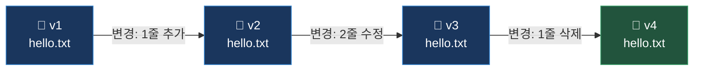
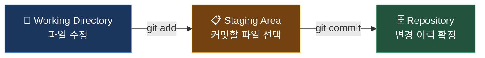
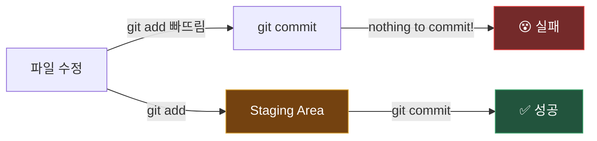
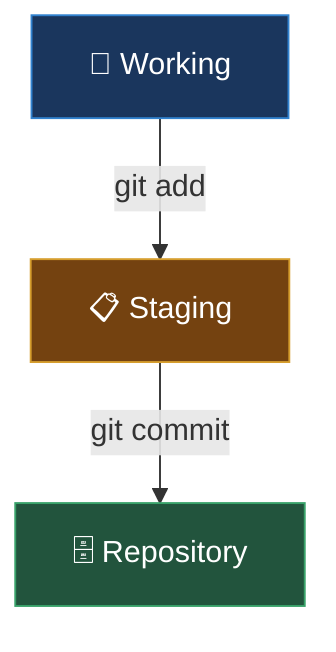
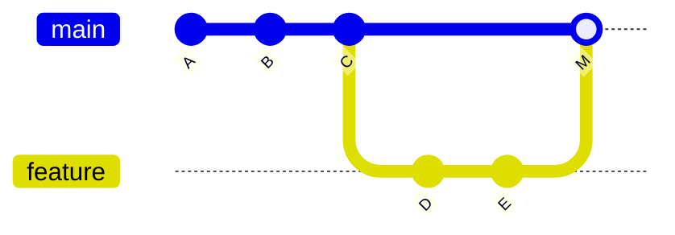
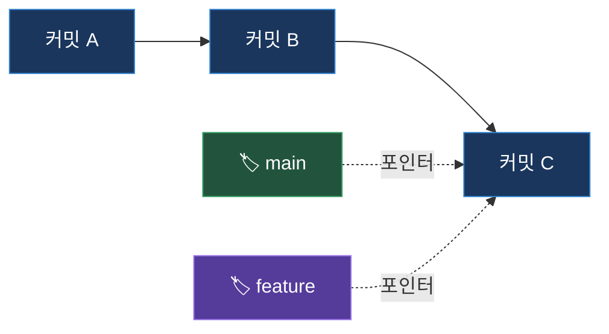
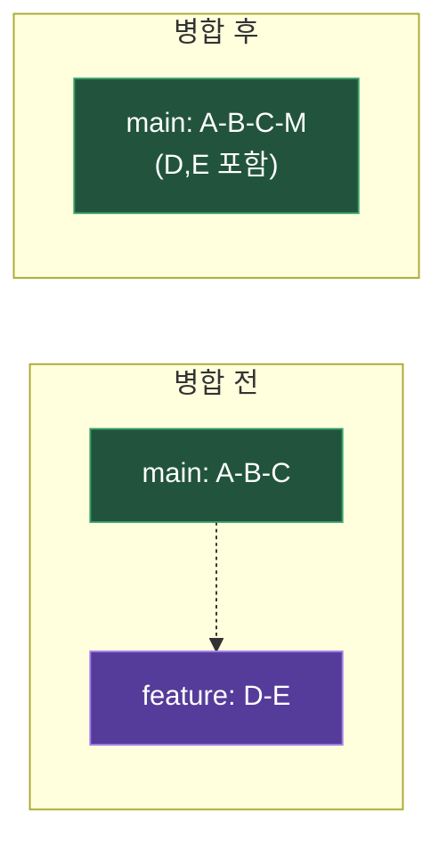
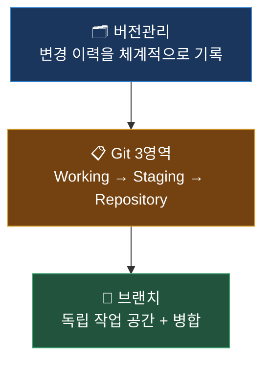

# Git 기초

## 버전관리 개념부터 브랜치까지

<div class="mt-8 text-lg text-gray-400">
Day 1 - Session 1 (1시간)
</div>

<div class="absolute bottom-8 left-14 text-sm text-gray-500">
대상: 주니어 개발자 | CLI 기본 조작 가능 수준
</div>

<!--
[스크립트]
안녕하세요, 반갑습니다. 오늘은 Git 기초를 함께 배워보겠습니다.

화면에 보이는 것처럼, 이번 세션은 1시간짜리 수업이고 대상은 코딩 경험이 있지만 Git은 처음이거나 기초만 아시는 주니어 개발자 여러분입니다.

혹시 코드를 작성하다가 "어제 상태로 돌아가고 싶은데 방법이 없다"고 느끼신 적이 있으신가요? 오늘 수업이 끝나면 그 고민이 해결됩니다. 버전관리의 개념부터 시작해서, Git의 핵심 구조를 이해하고, 브랜치로 안전하게 실험하는 방법까지 다루겠습니다.

강의는 약 18분 정도이고, 나머지 42분은 직접 손으로 해보는 실습 시간입니다.

전환: 먼저 오늘 수업의 전체 흐름을 한눈에 살펴보겠습니다.
시간: 1분
-->

<style>
:global(.slidev-layout.two-cols-header) {
  column-gap: 2rem !important;
}
:global(.slidev-layout.two-cols) {
  column-gap: 2rem !important;
}
</style>

---
transition: slide-left
---

# 오늘 배울 것


<v-clicks>

- 버전관리의 필요성과 Git의 핵심 개념
- Git의 3가지 영역: Working Directory, Staging Area, Repository
- 기본 명령어: `init`, `add`, `commit`, `status`, `log`
- 브랜치 생성과 병합(merge)

</v-clicks>

<!--
[스크립트]
화면 상단의 다이어그램을 보시면, 오늘 수업의 흐름이 네 단계로 나와 있습니다. 버전관리에서 시작해서 Git의 3영역, 브랜치, 그리고 마지막으로 실습까지. 왼쪽에서 오른쪽으로 자연스럽게 이어집니다.

[click] 첫 번째, 버전관리의 필요성과 Git의 핵심 개념입니다. 왜 버전관리가 필요한지, Git이 다른 도구와 어떻게 다른지 알아봅니다.

[click] 두 번째, Git의 3가지 영역입니다. Working Directory, Staging Area, Repository. 이 세 영역의 관계를 이해하면 Git의 동작 원리가 명확해집니다.

[click] 세 번째, 기본 명령어입니다. init, add, commit, status, log. 이 다섯 가지만 알면 로컬 저장소를 관리할 수 있습니다.

[click] 네 번째, 브랜치 생성과 병합입니다. 안전하게 실험하고, 성공한 결과만 합치는 방법을 배웁니다.

전환: 그러면 첫 번째 주제, 버전관리가 대체 무엇이고 왜 필요한지부터 시작하겠습니다.
시간: 1분
-->

---
layout: section
transition: fade
---

# 1. 버전관리란 무엇인가

<!--
[스크립트]
자, 버전관리란 무엇인가. 이 질문에 답하기 위해 먼저 여러분이 겪어봤을 법한 상황을 하나 보여드리겠습니다.

시간: 0.5분
-->

---
transition: slide-left
---

# 이런 경험, 있지 않나요?

<div class="mt-4 text-xl font-bold text-center text-gray-300">
파일 이름으로 버전 관리하기
</div>

<div class="flex justify-center mt-6 gap-3">

<v-clicks>

<div class="bg-gray-800 rounded-lg px-4 py-3 text-center">
  <div class="text-3xl mb-2">📄</div>
  <div class="text-sm">report_final.docx</div>
</div>

<div class="bg-gray-800 rounded-lg px-4 py-3 text-center">
  <div class="text-3xl mb-2">📄</div>
  <div class="text-sm">report_final_v2.docx</div>
</div>

<div class="bg-gray-800 rounded-lg px-4 py-3 text-center">
  <div class="text-3xl mb-2">📄</div>
  <div class="text-sm">report_진짜최종.docx</div>
</div>

<div class="bg-gray-800 rounded-lg px-4 py-3 text-center">
  <div class="text-3xl mb-2">📄</div>
  <div class="text-sm">report_최종_수정3.docx</div>
</div>

<div class="bg-red-900/40 rounded-lg px-4 py-3 text-center border border-red-500/50">
  <div class="text-3xl mb-2">❓</div>
  <div class="text-sm font-bold text-red-400">어떤 게 진짜?</div>
</div>

</v-clicks>

</div>

<div v-click class="mt-8 text-center text-lg">
코드에서는 <span class="text-red-400 font-bold">더 심각</span>하다 — 수정 후 원래대로 돌아갈 수 없다
</div>

<!--
[스크립트]
화면을 보시면 "파일 이름으로 버전 관리하기"라는 제목이 보입니다. 학교 과제든 회사 보고서든, 한 번쯤은 이렇게 해보신 적이 있을 겁니다.

[click] report_final.docx. 처음에는 이게 최종본이라고 생각합니다.

[click] 그런데 수정이 생기면 report_final_v2.docx가 등장합니다.

[click] 또 수정이 들어오면... report_진짜최종.docx. 이름부터 비장합니다.

[click] 여기서 끝이 아닙니다. report_최종_수정3.docx까지 만들어집니다.

[click] 그리고 결국 이렇게 됩니다. "어떤 게 진짜?" 파일이 네다섯 개가 되면 어떤 파일이 가장 최신인지 아무도 모릅니다.

💡 여기서 잠깐 — 이건 문서 파일일 때의 이야기입니다.

[click] 코드에서는 상황이 더 심각합니다. 잘 돌아가던 기능을 수정했는데, 이전 상태로 돌아갈 수가 없습니다. 코드 파일을 복사해서 관리하는 건 현실적으로 불가능합니다. 파일이 수십, 수백 개이기 때문입니다.

바로 이 문제를 해결하는 것이 **버전관리 시스템**입니다.

[Q&A 대비]
Q: 저는 파일 복사 방식으로 잘 해왔는데, 꼭 버전관리를 배워야 하나요?
A: 혼자서 간단한 프로젝트를 할 때는 파일 복사로도 버틸 수 있습니다. 하지만 파일이 10개만 넘어가도 어떤 복사본이 최신인지 추적하기 어렵습니다. 팀 프로젝트에서는 사실상 불가능합니다. 버전관리를 쓰면 "3일 전 상태로 되돌리기"가 명령어 하나로 됩니다.

Q: 실무에서도 파일 복사 방식을 쓰는 곳이 있나요?
A: 거의 없습니다. 모든 소프트웨어 회사가 Git 같은 버전관리 시스템을 사용합니다. 채용 공고에서도 Git은 기본 요구사항으로 들어갑니다. 개인 프로젝트에서도 Git을 쓰는 것이 업계 표준입니다.

전환: 그렇다면 버전관리는 구체적으로 어떻게 동작하는 걸까요? 게임에 비유하면 이해가 쉽습니다.
시간: 1.5분
-->

---
transition: slide-left
---

# 버전관리 = 게임 세이브 포인트

<div class="grid grid-cols-2 gap-8 mt-6">

<div>
  <div class="text-center mb-4">
    <span class="text-4xl">🎮</span>
    <div class="text-lg font-bold mt-2">게임 세이브</div>
  </div>

<v-clicks>

  <div class="text-sm space-y-2">
    <div>- 중요 지점마다 <span class="text-green-400 font-bold">세이브</span></div>
    <div>- 실패하면 <span class="text-blue-400 font-bold">그 지점부터 재시작</span></div>
    <div>- 여러 슬롯에 저장 가능</div>
  </div>

</v-clicks>

</div>

<div>
  <div class="text-center mb-4">
    <span class="text-4xl">💻</span>
    <div class="text-lg font-bold mt-2">Git 버전관리</div>
  </div>

<v-clicks>

  <div class="text-sm space-y-2">
    <div>- 의미 있는 변경마다 <span class="text-green-400 font-bold">커밋(세이브)</span></div>
    <div>- 실수하면 <span class="text-blue-400 font-bold">원하는 시점으로 복원</span></div>
    <div>- 여러 브랜치로 분기 가능</div>
  </div>

</v-clicks>

</div>

</div>

<div v-click class="mt-6 text-center text-sm text-gray-400">
단, 게임 세이브는 혼자지만 Git은 <span class="text-yellow-400 font-bold">여러 명이 동시에</span> 세이브하고 합칠 수 있다
</div>

<!--
[스크립트]
방금 파일 복사 방식의 한계를 봤습니다. 그러면 버전관리는 어떤 원리로 동작하는 걸까요? 게임의 세이브 포인트를 떠올려 보십시오.

화면 왼쪽에 게임 세이브, 오른쪽에 Git 버전관리가 나란히 있습니다. 하나씩 비교해 보겠습니다.

[click] 왼쪽을 보시면, 게임에서는 중요한 지점마다 세이브를 합니다. 보스 앞에서 세이브, 갈림길에서 세이브. 실패하면 그 세이브 지점부터 다시 시작할 수 있습니다. 여러 슬롯에 저장해 두면 원하는 시점을 골라서 돌아갈 수도 있습니다.

[click] 오른쪽, Git 버전관리도 동일합니다. 의미 있는 변경을 할 때마다 커밋이라는 세이브를 합니다. 실수하면 원하는 시점으로 복원할 수 있습니다. 그리고 여러 브랜치로 분기해서 동시에 다른 실험을 할 수도 있습니다.

💡 여기서 잠깐 — 이 비유에는 한계가 있습니다.

[click] 화면 하단에 나와 있듯이, 게임 세이브는 혼자만 쓰지만, Git은 여러 명이 동시에 세이브하고 그 결과를 합칠 수 있습니다. 이 부분은 뒤에서 브랜치를 배울 때 자세히 다루겠습니다.

[Q&A 대비]
Q: 혼자 개발하는데도 Git이 필요한가요?
A: 반드시 필요합니다. 혼자 개발해도 "어제 수정한 코드로 돌아가고 싶다"는 상황은 반드시 발생합니다. Git이 있으면 git checkout이나 git revert로 즉시 복구할 수 있습니다. 실험적인 기능을 브랜치로 분리해서 안전하게 시도할 수 있다는 점도 큰 장점입니다.

Q: 세이브 포인트 비유가 이해가 되는데, 실제로 Git이 파일을 어떻게 저장하나요?
A: Git은 파일 전체를 매번 복사하지 않습니다. "무엇이 바뀌었는지", 즉 변경 사항(diff)만 기록합니다. 그래서 저장 공간도 효율적이고, 과거 어느 시점이든 재구성할 수 있습니다. 바로 다음 슬라이드에서 이 동작 방식을 구체적으로 살펴보겠습니다.

전환: 비유로 감을 잡았으니, 버전관리가 실제로 어떤 방식으로 변경 사항을 기록하는지 구체적으로 보겠습니다.
시간: 1.5분
-->

---
transition: slide-left
---

# 버전관리의 핵심 동작

<div class="mt-4 text-center text-lg text-gray-300">
파일 전체를 복사하는 게 아니라, <span class="text-green-400 font-bold">변경 사항(diff)</span>만 기록한다
</div>



<v-clicks>

<div class="mt-4 text-sm space-y-1">

- ✅ 전체 파일이 아니라 <span class="text-green-400 font-bold">변경분만 저장</span> → 효율적
- ✅ 누가, 언제, 왜 바꿨는지 <span class="text-blue-400 font-bold">이력이 남는다</span>
- ✅ 언제든 <span class="text-yellow-400 font-bold">과거 시점으로 되돌릴 수 있다</span>

</div>

</v-clicks>

<!--
[스크립트]
게임 세이브 비유에서 한 걸음 더 들어가 보겠습니다. 버전관리의 핵심 동작 원리입니다.

화면 상단에 "파일 전체를 복사하는 게 아니라, 변경 사항(diff)만 기록한다"라고 되어 있습니다. 이것이 핵심입니다.

다이어그램을 보시면, hello.txt 파일이 v1에서 v4까지 변해가는 과정이 보입니다. v1에서 v2로 갈 때 "1줄 추가", v2에서 v3로 갈 때 "2줄 수정", v3에서 v4로 갈 때 "1줄 삭제". 매번 파일 전체를 저장하는 것이 아니라, 바뀐 부분만 기록합니다.

[click] 첫 번째 장점입니다. 전체 파일이 아니라 변경분만 저장하므로 저장 공간이 효율적입니다. 파일이 아무리 커도 바뀐 줄 몇 개만 기록하면 됩니다.

[click] 두 번째, 누가, 언제, 왜 바꿨는지 이력이 남습니다. 3개월 뒤에 "이 코드 누가 왜 이렇게 바꿨지?" 하는 질문에 답할 수 있습니다.

[click] 세 번째, 언제든 과거 시점으로 되돌릴 수 있습니다. "지난주 화요일 버전으로 돌아가고 싶다" — Git에서는 이게 가능합니다.

[Q&A 대비]
Q: diff만 저장한다면, 옛날 버전의 전체 파일을 보고 싶을 때는 어떻게 하나요?
A: Git이 내부적으로 변경 사항을 역추적해서 해당 시점의 완전한 파일을 재구성해 줍니다. 사용자는 git checkout이나 git show 명령어로 과거 어느 시점의 파일이든 그대로 볼 수 있습니다. 이 과정은 자동이라 사용자가 직접 diff를 조합할 필요가 없습니다.

Q: 이미지나 바이너리 파일도 diff로 관리되나요?
A: 텍스트 파일은 줄 단위 diff가 잘 동작하지만, 이미지나 바이너리 파일은 변경 사항을 줄 단위로 비교할 수 없어서 파일 전체를 새로 저장합니다. 그래서 Git 저장소에 큰 바이너리 파일을 넣는 것은 권장하지 않습니다. 이런 경우에는 Git LFS라는 별도 도구를 사용합니다.

전환: 버전관리의 원리를 이해했으니, 버전관리 도구들이 어떻게 발전해 왔는지, 그리고 왜 Git이 표준이 되었는지 비교해 보겠습니다.
시간: 1분
-->

---
transition: slide-left
---

# 버전관리 방식 비교

<div class="mt-2 text-sm">

| 구분 | 파일 복사 방식 | 중앙집중형 (SVN) | <span class="text-green-400 font-bold">분산형 (Git)</span> |
|------|:---:|:---:|:---:|
| 이력 관리 | 파일명으로 구분 | 중앙 서버에 기록 | 로컬+원격 모두 기록 |
| 협업 | 충돌 빈발 | 서버 연결 필수 | 오프라인 작업 가능 |
| 속도 | - | 서버 의존 (느림) | 로컬 처리 (빠름) |
| 복구 | 사실상 불가능 | 서버 장애 시 위험 | 모든 복제본이 전체 이력 |

</div>

<div v-click class="mt-6 text-center text-lg">
현재 업계 표준 = <span class="text-green-400 font-bold">Git</span>
</div>

<!--
[스크립트]
화면에 세 가지 버전관리 방식을 비교한 표가 보입니다. 왼쪽부터 파일 복사 방식, 중앙집중형인 SVN, 그리고 분산형인 Git입니다.

이력 관리 행을 보시면, 파일 복사는 파일명으로 구분합니다. 아까 본 report_final_v2 같은 방식입니다. SVN은 중앙 서버에 기록합니다. Git은 로컬과 원격 모두에 기록합니다. 내 컴퓨터에도 전체 이력이 있고, 서버에도 있습니다.

협업을 보시면, 파일 복사는 충돌이 빈발합니다. 같은 파일을 두 사람이 동시에 수정하면 누군가의 작업이 덮어씌워집니다. SVN은 서버에 연결되어 있어야만 작업할 수 있습니다. Git은 오프라인에서도 작업이 가능합니다.

속도 측면에서 SVN은 서버에 의존하므로 느리고, Git은 로컬에서 처리하므로 빠릅니다.

복구를 보시면, 파일 복사는 사실상 불가능, SVN은 서버가 죽으면 위험합니다. 반면 Git은 모든 복제본이 전체 이력을 갖고 있어서, 서버가 죽어도 누군가의 로컬에서 복원할 수 있습니다.

[click] 그래서 현재 업계 표준은 Git입니다. 거의 모든 소프트웨어 회사가 Git을 사용하고 있습니다.

[Q&A 대비]
Q: SVN을 쓰던 팀인데 Git으로 바꿔야 하나요?
A: 현재 업계 표준은 Git입니다. SVN에서 Git으로 전환하는 가장 큰 이유는 오프라인 작업과 브랜치 비용입니다. SVN은 브랜치를 만드는 데 디렉토리 전체를 복사하지만, Git은 포인터 하나만 생성하므로 거의 비용이 없습니다. 다만 SVN이 잘 동작하고 있고 팀이 만족한다면, 무리하게 전환할 필요는 없습니다.

Q: Git 말고 다른 분산형 버전관리 시스템도 있나요?
A: Mercurial(hg)이 대표적입니다. Git과 비슷한 분산형 구조를 갖고 있고, 한때 Facebook에서도 사용했습니다. 하지만 현재는 Git이 압도적인 점유율을 가지고 있어서, 새로 배우신다면 Git에 집중하시는 것이 맞습니다.

전환: Git이 표준인 것은 알겠는데, Git에 대해 잘못 알려진 내용도 많습니다. 흔한 오해 세 가지를 짚어보겠습니다.
시간: 1.5분
-->

---
transition: slide-left
---

# Git에 대한 흔한 오해

<div class="mt-6 space-y-6">

<v-clicks>

<div>
  <div class="text-lg">❌ <span class="text-red-400">"Git은 백업 도구다"</span></div>
  <div class="text-sm text-gray-400 mt-1">→ Git은 단순 백업이 아니라 <span class="text-green-400 font-bold">변경 이력 추적</span> 도구다. "누가, 언제, 왜 바꿨는지" 기록하는 것이 핵심.</div>
</div>

<div>
  <div class="text-lg">❌ <span class="text-red-400">"Git과 GitHub는 같은 것이다"</span></div>
  <div class="text-sm text-gray-400 mt-1">→ Git은 <span class="text-blue-400 font-bold">로컬 버전관리 도구</span>, GitHub는 Git 저장소를 <span class="text-blue-400 font-bold">온라인 호스팅</span>하는 서비스. Git 없이 GitHub는 쓸 수 없지만, GitHub 없이 Git은 사용할 수 있다.</div>
</div>

<div>
  <div class="text-lg">❌ <span class="text-red-400">"혼자 개발하면 Git이 필요 없다"</span></div>
  <div class="text-sm text-gray-400 mt-1">→ 혼자라도 "어제 코드로 돌아가고 싶다"는 순간은 반드시 온다. Git 없이는 <span class="text-red-500 font-bold">복구 불가능</span>.</div>
</div>

</v-clicks>

</div>

<!--
[스크립트]
방금 Git이 업계 표준이라고 했는데, Git을 처음 접하는 분들이 자주 하시는 오해가 세 가지 있습니다. 하나씩 바로잡아 보겠습니다.

[click] 첫 번째, "Git은 백업 도구다"라는 오해입니다. Git은 단순히 파일을 복사해두는 백업이 아닙니다. 핵심은 변경 이력 추적입니다. 누가, 언제, 왜 바꿨는지를 기록하는 것이 Git의 가치입니다. 단순 백업은 USB에 복사해도 되지만, "3일 전에 김 개발자가 왜 이 함수를 바꿨는지" 알려면 Git이 필요합니다.

[click] 두 번째, "Git과 GitHub는 같은 것이다"라는 오해입니다. 이건 정말 많은 분이 헷갈려하십니다. Git은 여러분의 컴퓨터, 로컬에서 동작하는 버전관리 도구입니다. GitHub는 Git 저장소를 온라인에서 호스팅해주는 서비스입니다. Git 없이 GitHub를 쓸 수는 없지만, GitHub 없이 Git만으로도 충분히 버전관리를 할 수 있습니다. 오늘 수업에서도 GitHub 없이 로컬 Git만으로 실습합니다.

[click] 세 번째, "혼자 개발하면 Git이 필요 없다"는 오해입니다. 혼자라도 "어제 코드로 돌아가고 싶다"는 순간은 반드시 옵니다. 새벽에 열심히 수정했는데 다음 날 보니 어제 버전이 더 나았다 — 이런 경험 한 번쯤 있으실 겁니다. Git 없이는 복구가 불가능합니다.

[Q&A 대비]
Q: Git을 GUI 도구로만 쓰면 안 되나요?
A: GitKraken, SourceTree 같은 GUI 도구는 시각적으로 편리합니다. 하지만 CLI 명령어를 먼저 익혀야 GUI가 내부에서 무엇을 하는지 이해할 수 있습니다. 문제가 발생했을 때 CLI 없이는 디버깅이 어렵습니다. CLI를 먼저 익히고 GUI를 병행하는 것을 권장합니다.

Q: GitHub 말고 다른 호스팅 서비스도 있나요?
A: GitLab, Bitbucket이 대표적입니다. 세 가지 모두 Git 저장소를 호스팅하는 서비스이고 기본 기능은 비슷합니다. 회사마다 선호하는 서비스가 다르지만, Git 자체를 알면 어느 서비스든 사용할 수 있습니다.

전환: 오해를 바로잡았으니, 이제 코드로 버전관리의 효과를 직접 눈으로 확인해 보겠습니다.
시간: 1.5분
-->

---
transition: slide-left
---

# 버전관리 있을 때 vs 없을 때

<div class="mt-4">

```bash {1-5|7-12}{maxHeight:'380px'}
# 버전관리 없이: 파일 복사 방식
cp app.py app_v1.py
cp app.py app_v2.py
cp app.py app_final.py
# → 어떤 파일이 최신인지 혼란 😵

# 버전관리 있을 때: Git 방식
git log --oneline
# a1b2c3d 로그인 기능 추가
# e4f5g6h 회원가입 폼 구현
# i7j8k9l 프로젝트 초기 설정
# → 변경 이력이 명확하게 기록됨 ✅
```

</div>

<div v-click class="mt-4 text-sm text-gray-400">
<code>git log</code>의 각 줄이 하나의 <span class="text-green-400 font-bold">커밋(commit)</span> — 커밋을 만들려면 Git의 3가지 영역을 이해해야 한다
</div>

<!--
[스크립트]
방금 오해를 바로잡았으니, 이제 코드로 직접 차이를 비교해 보겠습니다.

코드 블록을 보시면, 먼저 위쪽이 버전관리 없이 파일을 복사하는 방식입니다.
첫 번째 줄, `cp app.py app_v1.py` — 파일을 복사해서 v1이라고 이름 붙입니다.
두 번째 줄, `cp app.py app_v2.py` — 또 복사합니다.
세 번째 줄, `cp app.py app_final.py` — final이라고 붙여봤지만, 이미 어떤 파일이 최신인지 혼란스럽습니다.

[click] 아래쪽을 보시면, Git 방식입니다. `git log --oneline`이라는 명령어 하나만 치면 됩니다.
출력 결과를 보시면, 각 줄에 해시값과 메시지가 보입니다.
`a1b2c3d 로그인 기능 추가` — 가장 최근 커밋입니다.
`e4f5g6h 회원가입 폼 구현` — 그 전 커밋입니다.
`i7j8k9l 프로젝트 초기 설정` — 최초 커밋입니다.
변경 이력이 시간순으로 명확하게 기록되어 있습니다. 파일명으로 버전을 구분할 필요가 전혀 없습니다.

[click] 화면 하단에 중요한 포인트가 나와 있습니다. `git log`의 각 줄이 하나의 커밋입니다. 그런데 이 커밋을 만들려면 Git의 3가지 영역을 먼저 이해해야 합니다.

[Q&A 대비]
Q: git log에 나오는 a1b2c3d 같은 문자열은 무엇인가요?
A: 커밋 해시(hash)라고 합니다. Git이 각 커밋에 자동으로 부여하는 고유 식별자입니다. SHA-1 알고리즘으로 생성되며, 전 세계에서 유일합니다. 이 해시를 사용해서 특정 커밋으로 이동하거나 비교할 수 있습니다.

Q: 커밋 메시지를 한글로 써도 되나요?
A: 기술적으로는 문제없습니다. 다만 팀 컨벤션에 따라 다릅니다. 오픈소스 프로젝트는 영문이 표준이고, 사내 프로젝트는 한글을 쓰는 팀도 많습니다. 중요한 것은 "무엇을 왜 변경했는지"가 담겨 있어야 한다는 점입니다.

전환: 커밋을 만들려면 Git의 3가지 영역을 반드시 이해해야 합니다. 이제 그 핵심 구조로 들어가 보겠습니다.
시간: 1.5분
-->

---
layout: section
transition: fade
---

# 2. Git의 3가지 영역과 기본 명령어

<!--
[스크립트]
지금까지 버전관리가 무엇이고 왜 필요한지를 살펴봤습니다. 이제 Git의 핵심 구조인 3가지 영역과 기본 명령어를 배우겠습니다. 이 파트가 오늘 수업에서 가장 중요합니다.

시간: 0.5분
-->

---
transition: slide-left
---

# 왜 3가지 영역을 알아야 하나?

<div class="mt-4 text-lg text-gray-300">
이 구조를 모르면 이런 상황이 벌어진다
</div>

<div class="mt-6 space-y-4">

<v-clicks>

<div class="flex items-start gap-3">
  <span class="text-2xl">😤</span>
  <div>
    <div class="text-base">파일을 수정했는데 <code>git commit</code>이</div>
    <div class="text-red-400 font-bold">"nothing to commit"</div>
  </div>
</div>

<div class="flex items-start gap-3">
  <span class="text-2xl">😤</span>
  <div>
    <div class="text-base">어떤 파일은 커밋에 포함되고, 어떤 파일은 빠진다</div>
  </div>
</div>

<div class="flex items-start gap-3">
  <span class="text-2xl">😤</span>
  <div>
    <div class="text-base"><code>git status</code>의 <span class="text-red-400">빨간색</span>/<span class="text-green-400">녹색</span> 출력이 무슨 뜻인지 모르겠다</div>
  </div>
</div>

</v-clicks>

</div>

<div v-click class="mt-6 text-center text-lg">
3영역을 이해하면, 위 상황이 모두 <span class="text-green-400 font-bold">당연한 동작</span>이 된다
</div>

<!--
[스크립트]
Git의 3영역이 왜 중요한지, 모르면 어떤 일이 벌어지는지부터 보겠습니다. 화면에 "이 구조를 모르면 이런 상황이 벌어진다"라고 되어 있습니다.

[click] 첫 번째 상황입니다. 파일을 분명히 수정했는데, `git commit`을 실행하면 "nothing to commit"이라고 나옵니다. 분명 파일을 바꿨는데 왜 커밋이 안 되는 건지 답답합니다. 이건 3영역을 이해하면 바로 이유를 알 수 있습니다.

[click] 두 번째 상황입니다. 파일 여러 개를 수정했는데, 어떤 파일은 커밋에 포함되고 어떤 파일은 빠집니다. 왜 선택적으로 들어가는지 이해가 안 됩니다.

[click] 세 번째, `git status`를 실행하면 빨간색, 녹색으로 파일이 표시되는데, 이 색깔이 무엇을 의미하는지 모르겠습니다.

[click] 3영역을 이해하면, 위의 세 가지 상황이 모두 당연한 동작이 됩니다. 혼란이 아니라 "아, 이래서 그렇구나" 하고 납득이 됩니다.

[Q&A 대비]
Q: 다른 버전관리 도구도 3영역 구조를 가지고 있나요?
A: SVN 같은 중앙집중형 도구는 Staging Area 개념이 없습니다. 변경한 파일이 곧바로 커밋 대상이 됩니다. Staging Area는 Git의 독특한 설계이고, 커밋 단위를 정밀하게 제어할 수 있게 해주는 핵심 기능입니다.

Q: 3영역을 몰라도 Git을 쓸 수는 있지 않나요?
A: git add와 git commit을 기계적으로 입력하면 당장은 쓸 수 있습니다. 하지만 예상과 다른 결과가 나왔을 때 원인을 파악할 수 없습니다. 3영역을 이해하면 Git의 모든 동작이 논리적으로 설명됩니다.

전환: 이 3영역을 쉽게 이해하기 위해 택배 발송에 비유해 보겠습니다.
시간: 1분
-->

---
transition: slide-left
---

# Git의 3영역 = 택배 발송 과정

<div class="grid grid-cols-3 gap-4 mt-6">

<v-clicks>

<div class="text-center">
  <div class="text-4xl mb-3">📦</div>
  <div class="text-lg font-bold text-blue-400">물건 준비</div>
  <div class="text-sm font-bold mt-1">Working Directory</div>
  <div class="text-xs text-gray-400 mt-2">집에서 보낼 물건을 고른다<br/>아직 포장하지 않은 상태</div>
</div>

<div class="text-center">
  <div class="text-4xl mb-3">📋</div>
  <div class="text-lg font-bold text-yellow-400">박스에 담기</div>
  <div class="text-sm font-bold mt-1">Staging Area</div>
  <div class="text-xs text-gray-400 mt-2">택배 상자에 넣는다<br/>아직 발송하지는 않았다</div>
</div>

<div class="text-center">
  <div class="text-4xl mb-3">🚚</div>
  <div class="text-lg font-bold text-green-400">발송 완료</div>
  <div class="text-sm font-bold mt-1">Repository</div>
  <div class="text-xs text-gray-400 mt-2">택배를 발송한다<br/>이력이 남고 추적 가능</div>
</div>

</v-clicks>

</div>

<div v-click class="mt-6 text-center text-sm text-gray-400">
택배는 한 번 보내면 끝이지만, Git은 <span class="text-yellow-400 font-bold">과거 이력 조회</span>와 <span class="text-yellow-400 font-bold">되돌리기</span>가 가능하다
</div>

<!--
[스크립트]
Git의 3영역을 이해하려면 택배 발송 과정을 떠올려 보시면 됩니다. 화면에 세 단계가 나란히 보입니다.

[click] 첫 번째, 물건 준비 — Working Directory입니다. 집에서 보낼 물건을 고르는 단계입니다. 아직 포장하지 않은 상태입니다. Git에서는 여러분이 실제로 파일을 편집하는 공간입니다. VS Code에서 코드를 수정하면, 그 파일은 Working Directory에 있는 겁니다.

[click] 두 번째, 박스에 담기 — Staging Area입니다. 택배 상자에 물건을 넣는 단계입니다. 아직 발송하지는 않았습니다. 보낼 물건을 고르는 것처럼, 커밋에 포함할 파일을 선택하는 영역입니다. `git add` 명령어가 이 역할을 합니다.

[click] 세 번째, 발송 완료 — Repository입니다. 택배를 발송하면 운송장 번호가 생기고 추적이 가능해집니다. Git에서도 `git commit`을 하면 커밋 해시가 생기고, 이력이 영구적으로 기록됩니다.

💡 여기서 잠깐 — 이 비유에도 한계가 있습니다.

[click] 화면 하단을 보시면, 택배는 한 번 보내면 끝이지만 Git은 과거 이력을 조회하고 되돌리는 것이 가능하다고 되어 있습니다. 또한 택배 상자에 넣었다가 다시 뺄 수 있듯이, Staging Area에 올린 파일도 `git reset`으로 다시 내릴 수 있습니다.

[Q&A 대비]
Q: Staging Area에 올렸다가 다시 빼려면 어떻게 하나요?
A: `git reset HEAD 파일명` 또는 `git restore --staged 파일명`으로 Staging Area에서 내릴 수 있습니다. 파일 내용이 삭제되는 것이 아니라, Working Directory에 수정된 상태 그대로 남아 있으면서 스테이징만 취소됩니다.

Q: Working Directory와 Staging Area는 물리적으로 다른 장소인가요?
A: Working Directory는 프로젝트 폴더 그 자체입니다. Staging Area와 Repository는 프로젝트 폴더 안의 `.git` 숨김 폴더에 저장됩니다. `git init`을 하면 이 `.git` 폴더가 생기면서 Git 저장소가 됩니다.

전환: 비유로 감을 잡았으니, 이제 실제 Git 명령어와 함께 3영역이 어떻게 동작하는지 보겠습니다.
시간: 1.5분
-->

---
transition: slide-left
---

# 3영역의 실제 동작



<div class="mt-4 space-y-2 text-sm">

<v-clicks>

<div class="flex items-center gap-2">
  <span class="text-blue-400 font-bold">Working Directory</span>
  <span class="text-gray-500">—</span>
  <span>실제 파일을 편집하는 공간</span>
</div>

<div class="flex items-center gap-2">
  <span class="text-yellow-400 font-bold">Staging Area (Index)</span>
  <span class="text-gray-500">—</span>
  <span>다음 커밋에 포함할 변경 사항을 모아두는 공간</span>
</div>

<div class="flex items-center gap-2">
  <span class="text-green-400 font-bold">Repository (.git)</span>
  <span class="text-gray-500">—</span>
  <span>커밋된 이력이 영구 저장되는 공간</span>
</div>

</v-clicks>

</div>

<div v-click class="mt-4 text-sm text-gray-400 text-center">
<code>git add</code>는 Working → Staging, <code>git commit</code>은 Staging → Repository
</div>

<!--
[스크립트]
택배 비유를 실제 Git 동작으로 매핑해 보겠습니다. 화면 상단의 다이어그램을 보시면, 왼쪽에서 오른쪽으로 세 개의 영역이 화살표로 연결되어 있습니다.

Working Directory에서 `git add`를 하면 Staging Area로 이동합니다. Staging Area에서 `git commit`을 하면 Repository로 이동합니다. 이 흐름을 기억하시면 됩니다. 항상 왼쪽에서 오른쪽, 두 단계입니다.

[click] Working Directory — 실제 파일을 편집하는 공간입니다. 여러분의 프로젝트 폴더 그 자체입니다. VS Code에서 파일을 열어서 수정하면 이 영역에서 작업하는 겁니다.

[click] Staging Area, Index라고도 부릅니다. 다음 커밋에 포함할 변경 사항을 모아두는 공간입니다. "이번 커밋에는 이 파일들만 넣겠다"고 선택하는 영역입니다.

[click] Repository, 프로젝트 폴더 안의 `.git` 디렉토리입니다. 커밋된 이력이 영구 저장되는 공간입니다. 한번 커밋되면 이력이 남아서 언제든 돌아갈 수 있습니다.

[click] 정리하면, `git add`는 Working에서 Staging으로, `git commit`은 Staging에서 Repository로. 이 두 단계가 Git 워크플로우의 핵심입니다.

[Q&A 대비]
Q: `git add .`과 `git add 파일명`의 차이는 무엇인가요?
A: `git add .`은 현재 디렉토리의 모든 변경 파일을 Staging Area에 올립니다. `git add 파일명`은 지정한 파일만 올립니다. 실무에서는 의도하지 않은 파일이 커밋되는 것을 방지하기 위해 파일명을 명시적으로 지정하는 것을 권장합니다. `.gitignore` 파일을 함께 사용하면 더 안전합니다.

Q: `git status`에 나오는 색상(빨간색, 녹색)은 무엇을 의미하나요?
A: 빨간색은 Working Directory에서 변경되었지만 아직 스테이징되지 않은 파일입니다. 녹색은 Staging Area에 올라가서 다음 커밋에 포함될 파일입니다. 이 색상은 뒤에서 자세히 다루겠습니다.

전환: 3영역의 구조를 이해했습니다. 그런데 왜 굳이 Staging Area라는 중간 단계가 필요한 걸까요?
시간: 1.5분
-->

---
transition: slide-left
---

# Staging Area가 왜 필요한가?

<div class="mt-4 text-lg text-gray-300">
파일 10개를 수정해도, 관련된 3개만 골라서 커밋할 수 있다
</div>

<div class="grid grid-cols-2 gap-6 mt-6">

<v-clicks>

<div>
  <div class="text-sm font-bold text-red-400 mb-2">❌ Staging 없이 (SVN 등)</div>
  <div class="text-xs space-y-1 text-gray-400">
    <div>- 변경된 전체 파일이 커밋됨</div>
    <div>- 의도치 않은 파일이 포함될 수 있음</div>
    <div>- 여러 작업이 하나의 커밋에 섞임</div>
  </div>
</div>

<div>
  <div class="text-sm font-bold text-green-400 mb-2">✅ Git의 Staging Area</div>
  <div class="text-xs space-y-1 text-gray-400">
    <div>- 원하는 파일만 <span class="text-green-400">선택</span> 가능</div>
    <div>- <code>git status</code>로 확인 후 커밋</div>
    <div>- 작업 단위별로 <span class="text-green-400">분리</span> 가능</div>
  </div>
</div>

</v-clicks>

</div>

<div v-click class="mt-6 text-sm text-center">
<span class="text-yellow-400">💡</span> "로그인 기능 추가"와 "오타 수정"이 한 커밋에 섞이면 코드 리뷰가 어렵다
</div>

<!--
[스크립트]
"Working Directory에서 바로 Repository로 보내면 안 되나? 왜 중간에 Staging Area가 필요하지?" 이런 의문이 드실 수 있습니다. 화면에 답이 있습니다. 파일 10개를 수정해도, 관련된 3개만 골라서 커밋할 수 있기 때문입니다.

[click] 왼쪽을 보시면, Staging 없이 동작하는 SVN 같은 도구의 문제점입니다. 변경된 전체 파일이 한꺼번에 커밋됩니다. 의도치 않은 파일이 포함될 수 있고, 여러 작업이 하나의 커밋에 섞여버립니다.

[click] 오른쪽, Git의 Staging Area가 있으면 달라집니다. 원하는 파일만 선택해서 커밋할 수 있습니다. `git status`로 무엇이 포함되는지 확인한 뒤 커밋합니다. 작업 단위별로 깔끔하게 분리할 수 있습니다.

[click] 화면 하단의 포인트가 중요합니다. "로그인 기능 추가"와 "오타 수정"이 한 커밋에 섞이면 코드 리뷰가 어렵습니다. Staging Area 덕분에 "로그인 기능 추가"는 하나의 커밋, "오타 수정"은 별도의 커밋으로 분리할 수 있습니다. 이렇게 하면 리뷰어가 각 커밋의 의도를 명확히 파악할 수 있습니다.

[Q&A 대비]
Q: 커밋 메시지는 어떻게 쓰는 게 좋나요?
A: 커밋 메시지는 "무엇을 왜 변경했는지"를 담아야 합니다. "수정함", "업데이트"처럼 모호한 메시지는 나중에 이력을 추적할 때 쓸모가 없습니다. 일반적으로 `feat: 로그인 기능 추가`, `fix: 비밀번호 검증 오류 수정` 같은 Conventional Commits 형식을 사용합니다.

Q: 파일의 일부 변경만 스테이징할 수도 있나요?
A: 네, `git add -p` 명령어를 쓰면 하나의 파일 안에서도 변경된 부분을 선택적으로 스테이징할 수 있습니다. 하지만 이건 고급 기능이라 기본기를 익힌 뒤에 사용하시는 것을 권장합니다.

전환: Staging Area의 가치를 이해했으니, `git add`에 대해 흔히 하는 오해 두 가지를 짚어보겠습니다.
시간: 1분
-->

---
transition: slide-left
---

# git add에 대한 흔한 오해

<div class="mt-6 space-y-6">

<v-clicks>

<div>
  <div class="text-lg">❌ <span class="text-red-400">"git add를 하면 커밋이 된다"</span></div>
  <div class="text-sm text-gray-400 mt-1">→ <code>git add</code>는 Staging Area에 올리는 것뿐. 이력에 기록하려면 반드시 <code class="text-green-400">git commit</code>을 해야 한다.</div>
</div>

<div>
  <div class="text-lg">❌ <span class="text-red-400">"한 번 add한 파일은 이후 수정해도 자동 스테이징"</span></div>
  <div class="text-sm text-gray-400 mt-1">→ <code>git add</code> 이후 파일을 다시 수정하면, 수정된 내용은 스테이징되지 <span class="text-red-500 font-bold">않는다</span>. 수정할 때마다 <code class="text-green-400">git add</code>를 다시 해야 한다.</div>
</div>

</v-clicks>

</div>

<div v-click class="mt-8 text-center text-sm text-gray-400">
Git은 <code>git add</code> 시점의 파일 상태를 <span class="text-blue-400 font-bold">스냅샷</span>으로 저장한다
</div>

<!--
[스크립트]
Staging Area가 왜 필요한지 이해했으니, `git add`에 대해 흔히 하는 두 가지 오해를 바로잡겠습니다.

[click] 첫 번째 오해, "`git add`를 하면 커밋이 된다"입니다. 이건 아닙니다. `git add`는 Staging Area에 올리는 것뿐입니다. 이력에 기록하려면 반드시 `git commit`까지 해야 합니다. `git add`와 `git commit`은 항상 2단계입니다. 택배 비유로 돌아가면, 상자에 물건을 담은 것이지 발송한 것은 아닙니다.

[click] 두 번째 오해, "한 번 `add`한 파일은 이후 수정해도 자동으로 스테이징된다"입니다. 이것도 아닙니다. `git add` 이후에 파일을 다시 수정하면, 수정된 내용은 스테이징되지 않습니다. 수정할 때마다 `git add`를 다시 해야 합니다. 이 부분에서 정말 많은 분이 헷갈려하십니다.

💡 여기서 잠깐 — 왜 이렇게 동작하는 걸까요?

[click] Git은 `git add` 시점의 파일 상태를 스냅샷으로 저장하기 때문입니다. add를 실행한 그 순간의 파일 내용이 찍히는 겁니다. 이후에 파일을 수정하면 그건 새로운 변경이므로, 다시 add를 해야 새로운 스냅샷이 찍힙니다.

[Q&A 대비]
Q: 매번 git add를 치는 게 번거로운데, 한 번에 add와 commit을 할 수는 없나요?
A: `git commit -am "메시지"` 명령어를 쓰면 이미 추적 중인 파일에 대해 add와 commit을 한 번에 할 수 있습니다. 하지만 새로 만든 파일(untracked)은 포함되지 않으므로 주의가 필요합니다. 처음에는 add와 commit을 분리해서 익히시는 것을 권장합니다.

Q: git add를 실수로 했으면 취소할 수 있나요?
A: 네, `git reset HEAD 파일명` 또는 `git restore --staged 파일명`으로 Staging Area에서 내릴 수 있습니다. 파일 내용은 그대로 유지되고 스테이징만 취소됩니다. 안심하셔도 됩니다.

전환: 이론만으로는 감이 안 올 수 있습니다. 코드를 보면서 3영역이 실제로 어떻게 동작하는지 확인하겠습니다.
시간: 1분
-->

---
transition: slide-left
---

# 실습: 첫 Git 저장소 만들기

<div class="mt-2">

```bash {1-4|6-9|11-14|16-18}{maxHeight:'380px'}
# ① 프로젝트 디렉토리 생성 및 Git 초기화
mkdir my-project
cd my-project
git init

# ② 파일 생성 후 상태 확인
echo "Hello Git" > hello.txt
git status
# Untracked files: hello.txt  ← Working Directory에만 있음

# ③ Staging Area에 추가
git add hello.txt
git status
# Changes to be committed: new file: hello.txt  ← Staging Area에 올라감

# ④ 커밋 (Repository에 기록)
git commit -m "첫 번째 커밋: hello.txt 추가"
# [main (root-commit) a1b2c3d] 첫 번째 커밋: hello.txt 추가
```

</div>

<div v-click class="mt-2 text-sm text-gray-400 text-center">
<code>git status</code>의 출력이 각 단계에서 어떻게 변하는지 주목하세요
</div>

<!--
[스크립트]
이론을 충분히 다뤘으니, 이제 코드로 직접 확인해 보겠습니다. Git 저장소를 처음부터 만드는 과정입니다.

코드 블록의 첫 번째 단계를 보시면, 프로젝트 디렉토리 생성 및 Git 초기화입니다.
`mkdir my-project` — 새 폴더를 만듭니다.
`cd my-project` — 그 폴더로 이동합니다.
`git init` — 이 명령어가 핵심입니다. 이 폴더를 Git 저장소로 만듭니다. 실행하면 `.git`이라는 숨김 폴더가 생기고, 이 안에 Repository가 들어갑니다.

[click] 두 번째 단계, 파일 생성 후 상태 확인입니다.
`echo "Hello Git" > hello.txt` — 텍스트 파일을 하나 만듭니다.
`git status`를 실행하면 "Untracked files: hello.txt"라고 나옵니다. 빨간색으로 표시될 겁니다. 이 파일은 Working Directory에만 있고, Git이 아직 추적하지 않고 있다는 뜻입니다.

[click] 세 번째 단계, Staging Area에 추가입니다.
`git add hello.txt` — 이 파일을 Staging Area에 올립니다.
다시 `git status`를 보면 "Changes to be committed: new file: hello.txt"로 바뀝니다. 녹색으로 표시됩니다. 이제 커밋 준비가 된 상태입니다.

[click] 네 번째 단계, 커밋입니다.
`git commit -m "첫 번째 커밋: hello.txt 추가"` — Repository에 이력을 기록합니다.
출력에서 `a1b2c3d`라는 커밋 해시가 보입니다. 이것이 이 커밋의 고유 식별자입니다.

[click] 화면 하단의 포인트를 보시면, `git status`의 출력이 각 단계에서 어떻게 변하는지 주목하라고 되어 있습니다. Untracked(빨간색) → Staged(녹색) → clean 상태. 이 변화가 3영역 사이의 이동을 보여주는 것입니다.

[Q&A 대비]
Q: git init은 프로젝트마다 한 번만 실행하면 되나요?
A: 네, 한 프로젝트에 한 번만 실행합니다. 이미 git init이 된 폴더에서 다시 실행해도 기존 이력이 삭제되지는 않지만, 할 필요가 없습니다. 보통 프로젝트 시작할 때 한 번, 또는 GitHub에서 clone하면 자동으로 초기화됩니다.

Q: .git 폴더를 삭제하면 어떻게 되나요?
A: .git 폴더를 삭제하면 Git 저장소의 모든 이력이 사라집니다. 파일 자체는 남아 있지만 커밋 히스토리, 브랜치 정보 등이 전부 없어집니다. 절대로 삭제하면 안 됩니다.

전환: 정상적인 흐름을 봤으니, 이제 실수하는 경우를 보겠습니다. git add를 빠뜨리면 어떻게 될까요?
시간: 1.5분
-->

---
transition: slide-left
---

# git add 없이 커밋하면?

<div class="mt-4">

```bash {1-3|5-8}
# ❌ 잘못된 방법: add 없이 바로 커밋
echo "new line" >> hello.txt
git commit -m "내용 추가"
# → nothing to commit ← Staging Area가 비어 있으므로 커밋 불가!

# ✅ 올바른 방법: add → commit
git add hello.txt
git commit -m "hello.txt에 내용 추가"
```

</div>

<div v-click class="mt-6">



</div>

<!--
[스크립트]
방금 정상적인 흐름을 봤습니다. 그러면 `git add`를 빠뜨리면 어떻게 되는지 보겠습니다.

코드 상단을 보시면, 잘못된 방법입니다.
`echo "new line" >> hello.txt` — 파일을 수정합니다.
그런데 `git add` 없이 바로 `git commit -m "내용 추가"`를 실행합니다.
결과는? "nothing to commit"입니다. Staging Area가 비어 있으므로 커밋할 것이 없다는 뜻입니다.

💡 여기서 잠깐 — 앞에서 배운 3영역을 떠올려 보십시오. 파일을 수정하면 Working Directory에서 변경이 생긴 것이고, Staging Area에는 아무것도 올라가지 않았습니다. 커밋은 Staging Area에 있는 것만 기록하므로 "커밋할 게 없다"고 나오는 것이 당연합니다.

[click] 아래쪽이 올바른 방법입니다.
`git add hello.txt` — 먼저 Staging Area에 올리고,
`git commit -m "hello.txt에 내용 추가"` — 그다음 커밋합니다.
항상 add 다음에 commit. 이 순서를 반드시 지켜야 합니다.

[click] 하단의 다이어그램이 이 흐름을 정리합니다. 왼쪽 경로를 보시면, 파일 수정 후 git add를 빠뜨리고 git commit을 하면 실패합니다. 오른쪽 경로를 보시면, 파일 수정 → git add → Staging Area → git commit → 성공입니다.

[Q&A 대비]
Q: "nothing to commit"이 자주 나오는데 원인을 모르겠어요.
A: 가장 흔한 원인 두 가지입니다. 첫째, git add를 안 했거나 잊은 경우입니다. 둘째, 이미 커밋한 뒤 변경 없이 다시 커밋하려는 경우입니다. `git status`를 먼저 실행해서 현재 상태를 확인하는 습관을 들이시면 해결됩니다.

Q: git add를 했는데 그 이후에 파일을 또 수정했다면?
A: 처음 add한 시점의 내용만 Staging Area에 있습니다. 이후 수정분은 다시 git add를 해야 스테이징됩니다. git status를 보면 같은 파일이 녹색(스테이징된 이전 내용)과 빨간색(새로 수정한 내용) 둘 다 표시됩니다.

전환: add와 commit의 관계를 이해했으니, 이제 git status의 출력을 읽는 방법을 정리해 보겠습니다.
시간: 1분
-->

---
transition: slide-left
---

# git status 읽는 법

<div class="mt-4 text-gray-300">
<code>git status</code>는 Git에서 가장 자주 쓰는 명령어
</div>

<div class="grid grid-cols-2 gap-6 mt-6">

<v-clicks>

<div class="text-center">
  <div class="text-4xl mb-2">🔴</div>
  <div class="font-bold text-red-400">빨간색</div>
  <div class="text-sm text-gray-400 mt-2">Working Directory에서<br/>변경되었지만 아직<br/><span class="text-red-400">스테이징되지 않은</span> 파일</div>
  <div class="text-xs text-gray-500 mt-3"><code>git add</code>가 필요</div>
</div>

<div class="text-center">
  <div class="text-4xl mb-2">🟢</div>
  <div class="font-bold text-green-400">녹색</div>
  <div class="text-sm text-gray-400 mt-2">Staging Area에 올라가서<br/>다음 커밋에<br/><span class="text-green-400">포함될</span> 파일</div>
  <div class="text-xs text-gray-500 mt-3"><code>git commit</code>할 준비 완료</div>
</div>

</v-clicks>

</div>

<div v-click class="mt-6 text-center text-sm text-gray-400">
색상만 봐도 "이 파일이 어느 영역에 있는지" 즉시 알 수 있다
</div>

<!--
[스크립트]
코드 예시로 3영역의 동작을 봤으니, 이제 `git status` 출력을 읽는 법을 확실히 정리하겠습니다. `git status`는 Git에서 가장 자주 쓰는 명령어입니다. 작업 중에 수시로 확인하게 됩니다.

[click] 왼쪽, 빨간색입니다. Working Directory에서 변경되었지만 아직 스테이징되지 않은 파일입니다. 쉽게 말해 "수정은 했는데 아직 add 안 한 파일"입니다. `git add`가 필요한 상태입니다.

[click] 오른쪽, 녹색입니다. Staging Area에 올라가서 다음 커밋에 포함될 파일입니다. "add는 했고, commit만 하면 되는 파일"입니다. `git commit`할 준비가 된 상태입니다.

[click] 화면 하단을 보시면, 색상만 봐도 "이 파일이 어느 영역에 있는지" 즉시 알 수 있다고 되어 있습니다. 빨간색은 Working Directory, 녹색은 Staging Area. 이것만 기억하시면 `git status` 출력이 한눈에 읽힙니다.

실습할 때 `git status`를 자주 실행해 보십시오. 매 단계마다 색상이 어떻게 바뀌는지 관찰하시면 3영역이 체감됩니다.

[Q&A 대비]
Q: git status 출력이 길어서 읽기 어려운데 간단하게 볼 수 있나요?
A: `git status -s` 또는 `git status --short`를 쓰면 한 줄씩 간결하게 표시됩니다. M은 수정됨, A는 새로 추가, ??는 추적하지 않는 파일을 뜻합니다. 왼쪽 열은 Staging 상태, 오른쪽 열은 Working Directory 상태입니다.

Q: 아무 것도 안 나오면 무슨 뜻인가요?
A: "nothing to commit, working tree clean"이라고 나옵니다. 모든 변경 사항이 커밋되어 있고, Working Directory에도 새로운 수정이 없다는 뜻입니다. 깨끗한 상태입니다.

전환: 이제 지금까지 배운 기본 명령어들을 한 장으로 정리하겠습니다.
시간: 1분
-->

---
transition: slide-left
---

# 기본 명령어 정리

<div class="mt-4 text-sm">

| 명령어 | 역할 | 영역 이동 |
|--------|------|-----------|
| `git init` | 새 저장소 초기화 | - |
| `git add <파일>` | 스테이징 | Working → Staging |
| `git commit -m "메시지"` | 커밋 | Staging → Repository |
| `git status` | 현재 상태 확인 | - |
| `git log --oneline` | 커밋 이력 조회 | - |

</div>

<v-click>

<div class="mt-6 text-sm text-center text-gray-400">
<span class="text-yellow-400">💡</span> 커밋 메시지 팁: <code class="text-green-400">feat: 로그인 기능 추가</code>, <code class="text-green-400">fix: 비밀번호 검증 오류 수정</code>
</div>

</v-click>

<!--
[스크립트]
지금까지 배운 명령어들을 한 장으로 정리합니다. 화면의 표를 보시면 다섯 가지 명령어가 있습니다.

`git init` — 새 저장소를 초기화합니다. 프로젝트 시작할 때 한 번.
`git add` — 파일을 스테이징합니다. Working Directory에서 Staging Area로 이동.
`git commit -m "메시지"` — 커밋합니다. Staging Area에서 Repository로 이동.
`git status` — 현재 상태를 확인합니다. 수시로 사용합니다.
`git log --oneline` — 커밋 이력을 한 줄씩 조회합니다.

이 다섯 가지만 알면 로컬 저장소를 관리할 수 있습니다.

[click] 화면 하단에 커밋 메시지 팁이 보입니다. `feat: 로그인 기능 추가`, `fix: 비밀번호 검증 오류 수정` 같은 형식입니다. Conventional Commits라고 부르는 컨벤션입니다. 팀에서 약속한 형식이 있다면 그것을 따르시고, 없다면 이 형식을 추천합니다.

[Q&A 대비]
Q: git log에서 커밋 이력을 더 자세히 보려면 어떻게 하나요?
A: `git log` 명령어를 옵션 없이 실행하면 커밋 해시 전체, 작성자, 날짜, 메시지가 모두 표시됩니다. `git log --oneline --graph`를 쓰면 브랜치 구조까지 시각적으로 볼 수 있습니다. 뒤에서 브랜치를 배우면 이 명령어가 더 유용해집니다.

Q: 커밋 메시지를 나중에 수정할 수 있나요?
A: 가장 최근 커밋 메시지는 `git commit --amend`로 수정할 수 있습니다. 하지만 이미 팀원과 공유한 커밋을 수정하면 문제가 생길 수 있으므로, 처음부터 메시지를 잘 쓰는 습관을 들이시는 것이 좋습니다.

전환: 명령어를 정리했으니, 여기서 퀴즈로 지금까지 배운 내용을 확인해 보겠습니다.
시간: 1분
-->

---
transition: slide-left
---

# 퀴즈: Git의 3영역

<div class="grid grid-cols-2 gap-4">

<div>
<div class="text-base font-bold mb-3">
Git의 3가지 영역을 올바른 순서로 나열한 것은?
</div>

<div class="space-y-2 text-sm">
<div class="bg-gray-800 rounded-lg px-3 py-1.5">A) Repository → Staging → Working</div>
<div class="bg-gray-800 rounded-lg px-3 py-1.5">B) Working → Repository → Staging</div>
<div class="bg-gray-800 rounded-lg px-3 py-1.5">C) Working → Staging → Repository</div>
<div class="bg-gray-800 rounded-lg px-3 py-1.5">D) Staging → Working → Repository</div>
</div>
</div>

<div class="flex items-center">



</div>

</div>

<div v-click class="mt-2 bg-green-900/40 rounded-lg p-3 border border-green-500/50">
  <div class="font-bold text-green-400">정답: C</div>
  <div class="text-sm text-gray-300 mt-1">파일 수정(Working) → <code>git add</code>(Staging) → <code>git commit</code>(Repository)</div>
</div>

<!--
[스크립트]
퀴즈를 하나 풀어보겠습니다. 화면 왼쪽에 문제가 있습니다. "Git의 3가지 영역을 올바른 순서로 나열한 것은?"

A부터 D까지 네 개의 보기가 있습니다. 오른쪽에 힌트가 되는 다이어그램도 보입니다. 30초 정도 생각해 보십시오.

... 생각하셨나요?

[click] 정답은 C입니다. Working Directory에서 `git add`로 Staging Area로, Staging Area에서 `git commit`으로 Repository로. 파일을 수정하는 곳에서 시작해서, 선택하는 단계를 거쳐, 최종 이력이 저장되는 곳으로 끝납니다.

A를 고르신 분은 순서가 거꾸로 된 겁니다. B를 고르신 분은 Staging Area를 건너뛴 겁니다. D를 고르신 분은 시작점이 잘못된 겁니다. 항상 Working에서 출발한다는 것을 기억하십시오.

전환: 하나 더 확인해 보겠습니다. git add의 역할이 정확히 무엇인지 짚어보겠습니다.
시간: 1분
-->

---
transition: slide-left
---

# 퀴즈: git add의 역할

<div class="mt-6 text-lg font-bold">
다음 중 <code>git add</code> 명령어의 역할로 올바른 것은?
</div>

<div class="mt-6 space-y-3">

<div class="bg-gray-800 rounded-lg px-4 py-2">A) 변경 사항을 Repository에 영구 저장한다</div>
<div class="bg-gray-800 rounded-lg px-4 py-2">B) 변경 사항을 Staging Area에 올린다</div>
<div class="bg-gray-800 rounded-lg px-4 py-2">C) 새 브랜치를 생성한다</div>
<div class="bg-gray-800 rounded-lg px-4 py-2">D) 원격 저장소에서 코드를 가져온다</div>

</div>

<div v-click class="mt-6 bg-green-900/40 rounded-lg p-4 border border-green-500/50">
  <div class="font-bold text-green-400">정답: B</div>
  <div class="text-sm text-gray-300 mt-1"><code>git add</code>는 Working Directory → Staging Area. 실제 이력 기록은 <code>git commit</code>의 역할.</div>
</div>

<!--
[스크립트]
두 번째 퀴즈입니다. "`git add` 명령어의 역할로 올바른 것은?"

네 개의 보기를 읽어보겠습니다.
A, 변경 사항을 Repository에 영구 저장한다.
B, 변경 사항을 Staging Area에 올린다.
C, 새 브랜치를 생성한다.
D, 원격 저장소에서 코드를 가져온다.

택배 비유를 떠올려 보십시오. `git add`는 물건을 "박스에 담는" 단계에 해당합니다.

[click] 정답은 B입니다. `git add`는 Working Directory의 변경 사항을 Staging Area로 이동시킵니다. A를 고르신 분 — 이건 `git commit`의 역할입니다. C는 `git branch`이고, D는 `git pull`이나 `git fetch`의 역할입니다.

핵심은 `git add`와 `git commit`의 차이입니다. add는 선택, commit은 확정. 이 구분을 확실히 해두십시오.

전환: 3영역과 기본 명령어를 마스터했습니다. 이제 Git의 가장 강력한 기능인 브랜치로 넘어가겠습니다. main 코드를 건드리지 않고 안전하게 실험하는 방법을 배울 차례입니다.
시간: 1분
-->

---
layout: section
transition: fade
---

# 3. 브랜치와 병합

<!--
[스크립트]
지금까지 커밋으로 변경 이력을 기록하는 방법을 배웠습니다. 이제 Git의 꽃이라 할 수 있는 브랜치와 병합을 다루겠습니다.

시간: 0.5분
-->

---
transition: slide-left
---

# 왜 브랜치가 필요한가?

<div class="mt-4 text-lg text-gray-300">
"새로운 기능을 개발하다가 실패하면?"
</div>

<div class="mt-6 space-y-4">

<v-clicks>

<div class="flex items-start gap-3">
  <span class="text-red-400 font-bold text-xl">❌</span>
  <div>
    <div class="font-bold">main에서 직접 작업</div>
    <div class="text-sm text-gray-400">실패한 코드가 원본에 남는다. 다른 사람이 그 위에 작업했다면 복구가 어렵다.</div>
  </div>
</div>

<div class="flex items-start gap-3">
  <span class="text-green-400 font-bold text-xl">✅</span>
  <div>
    <div class="font-bold">브랜치에서 작업</div>
    <div class="text-sm text-gray-400">원본을 건드리지 않고 독립된 공간에서 실험. 성공하면 합치고, 실패하면 삭제.</div>
  </div>
</div>

</v-clicks>

</div>

<div v-click class="mt-6 text-center text-lg">
<span class="text-green-400 font-bold">브랜치</span> = 안전한 실험 공간
</div>

<!--
[스크립트]
커밋으로 이력을 기록하는 것까지 배웠는데, 여기서 한 가지 질문이 생깁니다. 화면에 "새로운 기능을 개발하다가 실패하면?"이라는 질문이 보입니다.

[click] 첫 번째 방법, main에서 직접 작업하는 것입니다. 실패한 코드가 원본에 남습니다. 다른 사람이 그 위에 작업했다면 복구가 정말 어렵습니다. 커밋을 하나씩 취소해야 하는데, 이미 팀원이 그 코드 위에 새 기능을 만들었다면 엉킵니다.

[click] 두 번째 방법, 브랜치에서 작업하는 것입니다. 원본을 건드리지 않고 독립된 공간에서 실험합니다. 성공하면 합치고, 실패하면 브랜치만 삭제하면 됩니다. 원본에는 아무 영향이 없습니다.

[click] 정리하면, 브랜치는 안전한 실험 공간입니다. 마음껏 코드를 수정하고, 결과가 좋으면 반영하고, 나쁘면 버리면 됩니다. 리스크 없이 도전할 수 있는 것이 브랜치의 핵심 가치입니다.

[Q&A 대비]
Q: 브랜치 없이 git revert나 git reset으로 되돌리면 안 되나요?
A: 기술적으로는 가능합니다. 하지만 revert는 "되돌리는 커밋"이 이력에 남고, reset은 이력을 삭제하므로 위험합니다. 특히 팀원과 공유한 커밋을 reset하면 큰 문제가 됩니다. 브랜치를 쓰면 이런 위험 자체가 없습니다.

Q: 개인 프로젝트에서도 브랜치를 만들어야 하나요?
A: 권장합니다. 개인 프로젝트라도 "이 기능 넣을까 말까" 고민될 때 브랜치를 만들어서 시도하면, main은 항상 동작하는 상태로 유지됩니다. 브랜치 생성 비용이 거의 없으므로 부담 없이 쓸 수 있습니다.

전환: 브랜치가 왜 필요한지 이해했으니, 이제 브랜치가 어떻게 동작하는지 평행 우주에 비유해서 보겠습니다.
시간: 1분
-->


---
transition: slide-left
---

# 브랜치 = 평행 우주

<div class="grid grid-cols-2 gap-6 mt-4">

<div>

<v-clicks>

<div class="space-y-3 text-sm">
  <div class="flex items-start gap-2">
    <span>🌍</span>
    <div>현재 세계(main)에서 <span class="text-blue-400 font-bold">분기점</span>을 만든다</div>
  </div>
  <div class="flex items-start gap-2">
    <span>🌀</span>
    <div>평행 우주(새 브랜치)에서 <span class="text-yellow-400 font-bold">마음껏 실험</span></div>
  </div>
  <div class="flex items-start gap-2">
    <span>✅</span>
    <div>성공하면 원래 세계에 <span class="text-green-400 font-bold">합친다(merge)</span></div>
  </div>
  <div class="flex items-start gap-2">
    <span>🗑️</span>
    <div>실패하면 평행 우주를 <span class="text-red-400 font-bold">삭제</span>하면 끝</div>
  </div>
</div>

</v-clicks>

</div>

<div>



</div>

</div>

<div v-click class="mt-4 text-sm text-gray-400 text-center">
평행 우주와 달리, Git 브랜치는 합칠 때 <span class="text-yellow-400 font-bold">충돌(conflict)</span>이 발생할 수 있다
</div>

<!--
[스크립트]
방금 브랜치가 왜 필요한지 봤습니다. 그런데 필요성을 이해한 다음에는, 브랜치가 머릿속에서 어떻게 움직이는지 그림으로 잡혀야 실제 명령어도 덜 헷갈립니다.

지금 제목이 "브랜치 = 평행 우주"라고 되어 있죠. 오른쪽 Mermaid 다이어그램을 먼저 보시면, 커밋 A, B, C까지는 main 세계에서 시간순으로 쌓여 있습니다. 그다음 C 지점에서 feature 브랜치가 갈라지고, 그 아래에서 D와 E라는 새 커밋이 이어집니다. 마지막에는 다시 main으로 돌아와서 merge feature가 실행되고, M이라는 병합 커밋이 생기면서 두 흐름이 다시 하나로 합쳐집니다.

[click] 왼쪽 목록이 지금 같이 보이는데, 첫 번째 줄의 지구 아이콘은 현재 세계인 main에서 분기점을 만든다는 뜻입니다. 두 번째 줄의 소용돌이 아이콘은 새 브랜치에서 마음껏 실험한다는 뜻인데, 여기서 중요한 포인트는 실험 중인 변경이 곧바로 main을 더럽히지 않는다는 점입니다. 세 번째와 네 번째 줄까지 연결해서 보면, 결과가 좋으면 merge로 가져오고 결과가 나쁘면 브랜치를 지우면 되니까, 브랜치는 안전한 실험실처럼 생각하시면 됩니다.

💡 여기서 잠깐 — 여기서 많은 분이 헷갈려하시는 부분이 있습니다. 브랜치를 만든다고 해서 내 프로젝트가 통째로 복제되는 것처럼 상상하시는 경우가 많은데, 지금은 이해를 돕기 위한 비유일 뿐입니다. 실제 Git 내부 동작은 다음 슬라이드에서 보겠지만, 파일 복사라기보다 특정 커밋을 가리키는 기준점에 가깝습니다.

[click] 아래 문장에 충돌(conflict)이라는 경고가 추가됐습니다. 평행 우주 비유는 이해하기 쉽지만, 현실의 Git은 두 우주를 다시 합칠 때 항상 자동으로 끝나는 것은 아닙니다. 같은 파일의 같은 부분을 두 브랜치에서 다르게 고치면 Git이 어느 쪽을 선택해야 할지 모르기 때문에, 그때 개발자가 직접 판단해서 정리해야 합니다.

[Q&A 대비]
Q: 브랜치를 하나 만들면 main의 파일들이 전부 복사되나요?
A: 지금 단계에서는 그렇게 느껴질 수 있지만, 실제로는 파일 전체 복사라고 보시면 안 됩니다. 브랜치는 기본적으로 특정 커밋을 가리키는 이름표에 가깝습니다. 그래서 브랜치를 만드는 비용이 매우 작고, 여러 개를 만들어도 부담이 적습니다.

Q: feature 브랜치에서 작업하면 main은 완전히 안전한가요?
A: 작업 중에는 main 이력에 직접 영향이 가지 않는다는 점에서 안전합니다. 다만 나중에 merge할 때 충돌이 날 수 있고, 잘못된 코드를 합치면 결국 main에도 반영됩니다. 즉 실험 공간은 분리되지만, 최종 병합 판단은 여전히 사람이 신중하게 해야 합니다.

전환: 지금 브랜치를 평행 우주처럼 이해해 봤습니다. 그런데 이 비유를 실제 Git 구조로 바꾸면 브랜치는 무엇인지가 바로 다음에 나옵니다.
시간: 1.2분
-->

---
transition: slide-left
---

# 브랜치의 실체: 포인터

<div class="mt-4 text-lg text-gray-300">
브랜치는 파일 복사가 <span class="text-red-400">아니다</span> — 커밋을 가리키는 <span class="text-green-400 font-bold">포인터</span>다
</div>

<div class="mt-6">



</div>

<v-clicks>

<div class="mt-4 space-y-2 text-sm">
  <div>- 새 브랜치 생성 = <span class="text-green-400 font-bold">41바이트 파일</span> 하나 생성 (거의 비용 제로)</div>
  <div>- SVN은 디렉토리 전체를 복사 → Git은 <span class="text-blue-400 font-bold">포인터 하나</span>만 추가</div>
  <div>- 아무리 많이 만들어도 저장 공간이 거의 늘지 않는다</div>
</div>

</v-clicks>

<!--
[스크립트]
방금 평행 우주라는 비유로 흐름을 봤다면, 이제 그 비유를 걷어내고 Git이 실제로 무엇을 저장하는지 봐야 합니다. 이걸 알아야 브랜치를 왜 가볍게 만들고 지울 수 있는지 정확히 이해됩니다.

위쪽 문장에 핵심이 그대로 적혀 있습니다. 브랜치는 파일 복사가 아니고, 특정 커밋을 가리키는 포인터입니다. 아래 다이어그램을 보시면 커밋 A, B, C가 일렬로 이어져 있고, `main`과 `feature`라는 두 라벨이 둘 다 현재는 커밋 C를 가리키고 있습니다. 즉 브랜치는 커밋 덩어리 자체가 아니라, "지금 이 브랜치의 끝은 여기입니다"라고 표시하는 이름표라고 이해하시면 됩니다.

[click] 아래 설명이 나타나면 숫자 감각까지 같이 가져가시면 됩니다. 첫 번째 줄은 새 브랜치를 만드는 일이 41바이트 파일 하나를 만드는 수준이라서 비용이 거의 0에 가깝다는 뜻입니다. 두 번째 줄처럼 SVN 계열은 디렉토리 복사에 가깝게 느껴질 수 있지만, Git은 포인터 하나만 추가하니 매우 가볍고, 그래서 세 번째 줄처럼 브랜치를 많이 만들어도 저장 공간이 거의 늘지 않습니다.

💡 여기서 잠깐 — 포인터라는 말을 들으면 어렵게 느껴질 수 있는데, 복잡한 메모리 개념으로 받아들이실 필요는 없습니다. 지금은 "브랜치 이름이 어느 커밋을 가리키고 있나"만 추적하면 충분합니다. 나중에 새 커밋을 만들면 그 브랜치 이름표가 새 커밋 쪽으로 앞으로 이동한다고 생각하시면 됩니다.

[Q&A 대비]
Q: 왜 하필 41바이트인가요?
A: Git 브랜치는 내부적으로 참조 정보를 아주 작은 파일 형태로 저장합니다. 버전과 환경에 따라 보이는 세부 값은 다를 수 있지만, 핵심은 브랜치가 매우 작은 메타데이터라는 점입니다. 그래서 브랜치 생성 자체는 거의 비용이 없다고 이해하시면 됩니다.

Q: 그러면 브랜치를 100개 만들어도 괜찮나요?
A: 저장 공간 관점에서는 큰 부담이 없습니다. 다만 브랜치 수가 너무 많아지면 사람이 관리하기 어려워지고, 오래된 브랜치가 쌓여 협업 흐름이 복잡해질 수 있습니다. 그래서 기술적으로는 가볍지만, 운영 측면에서는 주기적으로 정리하는 습관이 중요합니다.

전환: 지금 브랜치가 포인터라는 점을 봤으니, 이 가벼운 구조가 실제 작업 방식에서 어떤 차이를 만드는지가 다음 비교에서 바로 드러납니다.
시간: 1.0분
-->

---
transition: slide-left
---

# 브랜치 있을 때 vs 없을 때

<div class="mt-4 text-sm">

| 구분 | 브랜치 없이 작업 | 브랜치 사용 |
|------|:---:|:---:|
| 실험 | main에서 직접 수정<br/>실패 시 복구 어려움 | 별도 브랜치에서 실험<br/>실패해도 삭제만 하면 됨 |
| 협업 | 동시 수정 시 충돌 빈발 | 각자 브랜치에서 작업 후 병합 |
| 배포 | 개발 중인 코드가<br/>배포에 섞임 | main은 항상<br/>안정 상태 유지 |

</div>

<div v-click class="mt-6 text-center text-lg">
실무 원칙: <span class="text-green-400 font-bold">하나의 기능 = 하나의 브랜치</span>
</div>

<!--
[스크립트]
지금 브랜치가 가벼운 포인터라는 점까지 봤다면, 그래서 실제로 무엇이 좋아지는지를 비교로 확인해야 합니다. 결국 도구는 개념보다도, 작업 방식이 얼마나 안전해지는지가 중요하니까요.

표를 왼쪽에서 오른쪽으로 같이 보겠습니다. 첫 번째 행 실험을 보시면, 브랜치 없이 작업할 때는 main에서 직접 수정하니까 실패했을 때 복구가 어렵습니다. 반면 브랜치를 사용하면 별도 브랜치에서 실험하고, 안 되면 그 브랜치만 버리면 되기 때문에 원본 안정성이 높아집니다. 두 번째 행 협업에서는 브랜치가 없으면 모두가 같은 줄에서 동시에 움직이는 셈이라 충돌이 잦아지고, 브랜치를 쓰면 각자 분리된 공간에서 작업한 뒤 병합하므로 역할 분리가 쉬워집니다. 세 번째 행 배포에서는 브랜치가 없으면 개발 중인 코드가 섞여 들어갈 수 있지만, 브랜치를 쓰면 main을 항상 배포 가능한 상태에 가깝게 유지할 수 있습니다.

💡 여기서 잠깐 — 협업에서 충돌이 줄어든다고 해서 충돌이 사라진다는 뜻은 아닙니다. 브랜치는 충돌을 없애는 도구가 아니라, 충돌 가능성을 관리 가능한 시점으로 미루고 작업 범위를 분리하는 도구입니다. 그래서 브랜치를 잘 나누는 것과 자주 동기화하는 습관이 같이 필요합니다.

[click] 아래에 실무 원칙 하나가 크게 강조됐습니다. "하나의 기능 = 하나의 브랜치"라고 기억하시면, 작업 단위와 리뷰 단위가 자연스럽게 맞춰집니다. 로그인 기능을 만들면 로그인 브랜치, 결제 버그를 고치면 결제 수정 브랜치처럼 나누는 방식이어서, 나중에 Pull Request를 올릴 때도 변경 목적이 명확해집니다.

[Q&A 대비]
Q: 작은 수정도 브랜치를 따로 파는 게 맞나요?
A: 팀의 운영 방식에 따라 다르지만, 대부분은 작은 수정도 별도 브랜치에서 처리하는 편이 안전합니다. 이유는 수정 범위가 작아도 배포와 리뷰 단위가 분리되기 때문입니다. 특히 여러 사람이 함께 작업하는 환경에서는 습관을 일관되게 가져가는 편이 실수를 줄입니다.

Q: 혼자 작업하는 개인 프로젝트에서도 브랜치가 필요한가요?
A: 개인 프로젝트라서 꼭 복잡한 브랜치 전략이 필요한 것은 아닙니다. 다만 새 기능 실험이나 리팩터링처럼 실패 가능성이 있는 작업에서는 혼자여도 브랜치가 큰 안전장치가 됩니다. 즉 협업 때문만이 아니라, 실험과 복구를 쉽게 하려고 쓰는 습관이라고 보시면 됩니다.

전환: 지금 표로 장점을 비교해 봤습니다. 그런데 초보자가 실제로 가장 자주 잘못 이해하는 부분은 따로 있어서, 그 오해를 바로 다음에서 정리하겠습니다.
시간: 0.8분
-->

---
transition: slide-left
---

# 브랜치에 대한 흔한 오해

<div class="mt-6 space-y-6">

<v-clicks>

<div>
  <div class="text-lg">❌ <span class="text-red-400">"브랜치를 만들면 파일이 복사된다"</span></div>
  <div class="text-sm text-gray-400 mt-1">→ 브랜치는 <span class="text-green-400 font-bold">커밋을 가리키는 포인터</span>다. 파일 복사가 아니므로 생성 비용이 거의 제로.</div>
</div>

<div>
  <div class="text-lg">❌ <span class="text-red-400">"merge하면 항상 충돌이 난다"</span></div>
  <div class="text-sm text-gray-400 mt-1">→ <span class="text-yellow-400 font-bold">같은 파일의 같은 줄</span>을 수정한 경우에만 충돌 발생. 서로 다른 파일/다른 부분은 Git이 자동으로 합친다.</div>
</div>

<div>
  <div class="text-lg">⚠️ <span class="text-yellow-400">merge vs rebase</span></div>
  <div class="text-sm text-gray-400 mt-1">→ merge는 이력 보존, rebase는 이력 정리. 초보자는 <span class="text-green-400 font-bold">merge부터</span> 익히는 것을 권장.</div>
</div>

</v-clicks>

</div>

<!--
[스크립트]
앞에서 장점을 봤더라도, 오해를 그대로 두면 실습할 때 다시 불안해집니다. 그래서 마지막으로 실제로 많이 나오는 오해 세 가지를 짧고 정확하게 정리하겠습니다.

[click] 첫 번째 오해는 "브랜치를 만들면 파일이 복사된다"입니다. 방금 나타난 설명처럼 브랜치는 커밋을 가리키는 포인터이기 때문에, 프로젝트 전체를 새로 복제하는 개념이 아닙니다. 그래서 생성 비용이 거의 0에 가깝고, 브랜치를 만드는 것 자체를 무겁게 생각하실 필요가 없습니다.

💡 여기서 잠깐 — 이 오해가 생기는 이유는 작업 화면만 보면 브랜치를 바꿨을 때 파일 구성이 달라 보여서 정말 복사본처럼 느껴지기 때문입니다. 하지만 Git이 관리하는 핵심은 파일 사본이 아니라 커밋 이력과 그 끝을 가리키는 참조입니다. 겉모습이 복사처럼 보여도 내부 모델은 다르다는 점을 잡고 가셔야 합니다.

[click] 두 번째 오해는 "merge하면 항상 충돌이 난다"입니다. 실제로는 같은 파일의 같은 줄을 양쪽에서 다르게 수정했을 때 주로 충돌이 납니다. 서로 다른 파일을 수정했거나 같은 파일이라도 다른 위치를 수정했다면, Git이 대부분 자동으로 병합합니다.

[click] 세 번째는 merge와 rebase를 같은 난이도로 받아들이는 경우입니다. 여기 적힌 것처럼 merge는 이력을 있는 그대로 보존하고, rebase는 이력을 다시 정리하는 방식입니다. 지금 단계에서는 merge부터 익히는 편이 안전한데, 이유는 눈에 보이는 커밋 흐름을 유지한 채 브랜치 생성과 병합의 기본 감각을 먼저 잡을 수 있기 때문입니다.

[Q&A 대비]
Q: 충돌이 나면 Git이 망가진 건가요?
A: 아닙니다. 충돌은 Git이 이상하게 동작한 것이 아니라, 자동으로 결정하기 어려운 상황을 정확히 알려준 것입니다. 충돌 표시를 보고 어느 변경을 남길지 개발자가 선택하면 됩니다. 해결 후 `git add`와 `git commit`으로 마무리하면 정상적인 이력으로 이어집니다.

Q: 그럼 실무에서는 rebase를 아예 안 쓰나요?
A: 많이 씁니다. 다만 처음부터 rebase까지 같이 배우면 브랜치 개념보다 이력 재작성의 부담이 더 크게 느껴질 수 있습니다. 그래서 입문 단계에서는 merge로 기본기를 먼저 잡고, 이후에 rebase를 별도 주제로 배우는 편이 이해가 더 잘 됩니다.

전환: 지금 브랜치의 개념, 실체, 오해까지 정리했습니다. 이제 이걸 손으로 익혀야 하니까, 바로 다음에서 브랜치를 만들고 전환하는 명령을 실제로 실행해 보겠습니다.
시간: 1.2분
-->

---
transition: slide-left
---

# 실습: 브랜치 생성과 전환

<div class="mt-2">

```bash {1-2|4-5|7-10|12-14}{maxHeight:'380px'}
# ① 현재 브랜치 확인
git branch
# * main

# ② 새 브랜치 생성 및 전환
git checkout -b feature/greeting
# Switched to a new branch 'feature/greeting'

# ③ 브랜치에서 작업
echo "Good morning!" > greeting.txt
git add greeting.txt
git commit -m "인사말 파일 추가"

# ④ main으로 돌아가기
git checkout main
# greeting.txt가 보이지 않는다 → main에는 영향 없음!
```

</div>

<div v-click class="mt-2 text-sm text-center text-gray-400">
<span class="text-yellow-400">💡</span> <code>checkout main</code>하면 greeting.txt가 사라진다 — 브랜치가 <span class="text-green-400 font-bold">진짜 독립 공간</span>임을 체감
</div>

<!--
[스크립트]
방금 전까지 브랜치에 대한 흔한 오해를 정리했고, 이제 그 개념이 화면에서 어떻게 보이는지 바로 확인해 보겠습니다.

제목은 "실습: 브랜치 생성과 전환"입니다. 중앙에는 네 단계로 나뉜 bash 코드 블록이 있고, ① 현재 브랜치 확인, ② 새 브랜치 생성 및 전환, ③ 브랜치에서 작업, ④ main으로 돌아가기가 순서대로 적혀 있습니다. 맨 아래에는 노란 전구 아이콘과 함께 `checkout main`을 하면 `greeting.txt`가 사라진다는 문장이 있어, 브랜치가 독립 공간이라는 점을 시각적으로 다시 강조하고 있습니다.

[click] 먼저 1번 구간입니다. `git branch`는 현재 로컬 브랜치 목록을 보여주고, 별표가 붙은 `main`이 지금 제가 서 있는 브랜치라는 뜻입니다. 브랜치 실습은 출발 지점을 정확히 확인하는 것부터 시작해야 뒤에서 어디로 돌아왔는지 헷갈리지 않습니다.

[click] 다음은 2번 구간입니다. `git checkout -b feature/greeting`은 새 브랜치를 만들면서 동시에 그 브랜치로 이동하라는 명령입니다. 출력문 `Switched to a new branch 'feature/greeting'`까지 확인해야, 브랜치가 생성만 된 것이 아니라 작업 위치도 바뀌었다는 점을 놓치지 않습니다.

[click] 이제 3번 구간을 한 줄씩 보겠습니다. `echo "Good morning!" > greeting.txt`는 `greeting.txt` 파일을 만들고 내용을 한 줄 넣는 명령이고, `git add greeting.txt`는 그 파일을 스테이징 영역에 올립니다. 마지막 `git commit -m "인사말 파일 추가"`까지 실행하면 이 작업은 `feature/greeting` 브랜치의 역사로만 저장됩니다.

💡 여기서 잠깐 — 파일을 만들고 커밋했다고 해서 모든 브랜치에 자동으로 퍼지는 것은 아닙니다. 지금 커밋은 현재 체크아웃된 브랜치 하나에만 붙습니다. 그래서 브랜치를 바꾸면 같은 작업 디렉터리라도 보이는 파일 상태가 달라질 수 있습니다.

[click] 마지막 코드 구간입니다. `git checkout main`으로 다시 `main`으로 돌아오면 방금 만든 `greeting.txt`가 작업 폴더에서 보이지 않습니다. 파일이 삭제된 것이 아니라, `main`이 아직 그 커밋을 모르기 때문에 그 시점의 스냅샷으로 작업 디렉터리가 되돌아온 것입니다.

[click] 여기서 아래쪽 회색 안내문이 나타납니다. 노란 전구와 함께 `checkout main`을 하면 파일이 사라진다고 적혀 있는데, 이 장면이 브랜치를 가장 직관적으로 이해하게 해 줍니다. 브랜치는 폴더를 통째로 복사한 것이 아니라, 각 브랜치가 서로 다른 커밋 흐름을 가리키고 있기 때문에 같은 폴더에서도 다른 결과가 보입니다.

[Q&A 대비]
Q: `git checkout -b` 대신 두 번 나눠서 해도 되나요?
A: 가능합니다. `git branch feature/greeting`으로 브랜치를 만든 뒤 `git checkout feature/greeting`으로 이동해도 같은 결과입니다. 다만 실습에서는 한 번에 보여 주는 편이 흐름을 이해하기 쉽습니다. 최신 Git에서는 `git switch -c feature/greeting`으로도 같은 동작을 할 수 있습니다.

Q: `main`으로 돌아왔을 때 파일이 사라지면 데이터가 날아간 건가요?
A: 아닙니다. 파일을 만든 커밋은 `feature/greeting` 브랜치에 그대로 남아 있습니다. 다시 `git checkout feature/greeting`으로 돌아가면 같은 파일이 다시 보입니다. 브랜치마다 바라보는 커밋 시점이 달라서 작업 디렉터리 상태가 달라지는 것입니다.

전환: 이제 독립적으로 만든 작업을 `main`에 합쳐야 실제 협업 흐름이 완성되므로, 바로 병합 과정을 이어서 보겠습니다.
시간: 1.4분
-->

---
transition: slide-left
---

# 실습: 브랜치 병합

<div class="mt-2">

```bash {1-3|5-7}{maxHeight:'380px'}
# ⑤ 브랜치 병합 (main에서 실행!)
git checkout main
git merge feature/greeting
# → greeting.txt가 main에도 나타난다

# ⑥ 병합 완료 후 브랜치 삭제 (선택)
git branch -d feature/greeting
# Deleted branch feature/greeting
```

</div>

<div v-click class="mt-4">



</div>

<div v-click class="mt-2 text-sm text-center text-gray-400">
병합은 반드시 <span class="text-green-400 font-bold">"받아들이는 쪽(main)"</span>에서 실행한다
</div>

<!--
[스크립트]
방금 `feature/greeting`에서 안전하게 작업해 봤으니, 이제 그 결과를 `main`이 받아들이는 순간을 확인하겠습니다.

위쪽에는 병합 명령 두 단계가 들어 있는 bash 코드 블록이 있고, 아래에는 병합 전후 커밋 흐름을 보여 주는 머메이드 다이어그램이 이어집니다. 마지막 줄에는 초록색 강조로 "받아들이는 쪽(main)에서 실행한다"는 규칙이 다시 한 번 표시되어 있어, 명령 순서를 외우는 기준점 역할을 합니다.

[click] 먼저 코드의 1번 구간입니다. `git checkout main`으로 병합을 받을 대상 브랜치로 이동한 뒤 `git merge feature/greeting`을 실행합니다. 그 결과 `greeting.txt`가 `main`에서도 보이기 시작하는데, 이것이 브랜치의 변경 사항이 메인 흐름에 반영됐다는 가장 눈에 띄는 증거입니다.

[click] 다음은 2번 구간입니다. `git branch -d feature/greeting`은 병합이 끝난 뒤 더 이상 쓰지 않는 작업 브랜치를 정리하는 선택 명령입니다. 삭제해도 병합된 커밋 내용은 `main`에 남아 있으므로, 작업 흔적을 없애는 것이 아니라 브랜치 포인터만 정리하는 것에 가깝습니다.

💡 여기서 잠깐 — 병합 명령은 "무엇을 가져올까"보다 "어디에서 실행할까"를 먼저 생각해야 덜 헷갈립니다. `main`을 최신 결과물로 만들고 싶다면 `main`에 서서 다른 브랜치를 합칩니다. 반대로 `feature`에 서서 `merge main`을 하면 방향이 완전히 달라집니다.

[click] 이제 가운데 다이어그램이 나타납니다. 왼쪽 "병합 전"에는 `main: A-B-C`와 `feature: D-E`가 분리되어 있고, 오른쪽 "병합 후"에는 `main: A-B-C-M` 아래에 `(D,E 포함)`이 표시됩니다. 색도 `main`은 초록, `feature`는 보라로 구분되어 있어서 두 흐름이 하나로 합쳐진다는 점을 빠르게 읽을 수 있습니다.

[click] 마지막 안내문까지 보겠습니다. "병합은 반드시 받아들이는 쪽에서 실행한다"는 문장을 규칙처럼 기억해 두면, 병합 순서를 묻는 문제에서 실수할 가능성이 크게 줄어듭니다. 실무에서도 대부분 `main`, `develop`, `release`처럼 기준이 되는 브랜치로 먼저 이동한 뒤 병합합니다.

[Q&A 대비]
Q: 병합 후 브랜치를 바로 삭제해도 괜찮나요?
A: 병합이 정상적으로 끝났고 더 이상 추가 작업이 없다면 보통 삭제합니다. `-d` 옵션은 병합되지 않은 브랜치를 실수로 지우지 않도록 한 번 더 확인하는 안전장치 역할도 합니다. 협업 중이라면 원격 브랜치 정리 시점은 팀 규칙에 맞추면 됩니다.

Q: 항상 merge commit이 생기나요?
A: 항상 그런 것은 아닙니다. 브랜치가 단순히 앞서 있는 상태라면 fast-forward로 처리되어 별도의 merge commit 없이 포인터만 이동할 수 있습니다. 다만 입문 단계에서는 "받아들이는 쪽에서 merge를 실행한다"는 원칙을 먼저 확실히 잡는 것이 더 중요합니다. 세부 병합 전략은 이후에 더 배워도 충분합니다.

전환: 병합이 편리한 이유를 봤으니, 반대로 `main`에서 직접 실험하면 어떤 문제가 생기는지 바로 비교해 보겠습니다.
시간: 1.2분
-->

---
transition: slide-left
---

# ❌ 잘못된 예: main에서 직접 실험

<div class="mt-4">

```bash {1-5}
# main 브랜치에서 바로 실험적 코드 작성
echo "experimental code" > experiment.txt
git add experiment.txt
git commit -m "실험 코드"
# → 실패하면 main 이력에 불필요한 커밋이 남음
```

</div>

<div class="mt-6 grid grid-cols-2 gap-6">

<v-clicks>

<div class="text-center">
  <div class="text-red-400 font-bold mb-2">문제점</div>
  <div class="text-sm text-gray-400 space-y-1">
    <div>- main 이력이 지저분해짐</div>
    <div>- 다른 팀원이 pull하면 실험 코드 전파</div>
    <div>- 되돌리기가 복잡해짐</div>
  </div>
</div>

<div class="text-center">
  <div class="text-green-400 font-bold mb-2">올바른 방법</div>
  <div class="text-sm text-gray-400 space-y-1">
    <div>- <code>git checkout -b experiment</code></div>
    <div>- 별도 브랜치에서 실험</div>
    <div>- 실패하면 브랜치만 삭제</div>
  </div>
</div>

</v-clicks>

</div>

<!--
[스크립트]
방금 병합은 안전하게 합치는 절차라는 점을 봤으니, 왜 처음부터 `main`에서 바로 실험하면 안 되는지도 함께 봐야 흐름이 완성됩니다.

위에는 `main`에서 곧바로 파일을 만들고 커밋하는 bash 예제가 있고, 아래에는 두 칸 비교 영역이 배치되어 있습니다. 왼쪽은 빨간색 "문제점", 오른쪽은 초록색 "올바른 방법"으로 대비되어 있어서, 잘못된 습관과 권장 습관을 한눈에 비교하도록 구성되어 있습니다.

[click] 코드 블록을 먼저 보겠습니다. `echo "experimental code" > experiment.txt`로 실험 파일을 만들고, `git add experiment.txt`, `git commit -m "실험 코드"`까지 모두 `main`에서 실행하고 있습니다. 마지막 주석처럼 이렇게 남은 커밋은 실패하더라도 `main` 이력에 그대로 남기 때문에, 실험을 보호한 것이 아니라 기준 브랜치를 오염시킨 셈이 됩니다.

💡 여기서 잠깐 — `main`은 혼자 쓰는 개인 메모장이 아니라 팀이 신뢰하는 기준선이라고 생각하면 판단이 쉬워집니다. 기준선에 실험 커밋이 섞이면 나중에 되돌릴 때도 기록이 복잡해집니다. 브랜치는 이런 위험을 싸고 빠르게 격리하려고 쓰는 도구입니다.

[click] 이제 왼쪽 빨간 박스가 보입니다. 문제점으로 `main` 이력이 지저분해지고, 다른 팀원이 pull하면 실험 코드가 전파되고, 되돌리기가 복잡해진다고 적혀 있습니다. 세 항목 모두 결국 "안전하게 실패할 공간이 없다"는 하나의 문제로 연결됩니다.

[click] 마지막으로 오른쪽 초록 박스를 보겠습니다. `git checkout -b experiment`로 새 브랜치를 만든 뒤 별도 브랜치에서 실험하고, 실패하면 브랜치만 삭제하라는 흐름이 적혀 있습니다. 같은 실험이라도 어디에서 하느냐에 따라 팀 전체에 미치는 영향이 완전히 달라진다는 점을 여기서 기억하시면 됩니다.

[Q&A 대비]
Q: 혼자 작업하는 저장소라면 `main`에서 바로 실험해도 되지 않나요?
A: 기술적으로는 가능합니다. 하지만 습관이 한 번 굳으면 협업 저장소에서도 같은 방식으로 작업하게 되기 쉽습니다. 개인 저장소에서도 브랜치로 분리해 두면 되돌리기와 비교가 쉬워져서 장기적으로 더 유리합니다.

Q: 실수로 `main`에 커밋했으면 어떻게 하나요?
A: 아직 push하지 않았다면 새 브랜치를 만든 뒤 커밋을 옮기거나 reset으로 정리하는 방법이 있습니다. 이미 공유된 뒤라면 히스토리를 함부로 바꾸기보다 revert로 되돌리는 쪽이 안전한 경우가 많습니다. 중요한 것은 실수 이후 기술보다, 애초에 브랜치에서 작업하는 습관으로 그런 상황을 줄이는 것입니다.

전환: 안전하게 작업하는 방법을 봤으니, 실무에서 자주 쓰는 브랜치 이름 규칙까지 정리해 두면 바로 업무에 적용할 수 있습니다.
시간: 1.0분
-->

---
transition: slide-left
---

# 브랜치 이름 짓기

<div class="mt-4 text-lg text-gray-300">
실무에서 널리 쓰이는 브랜치 네이밍 패턴
</div>

<div class="mt-6 text-sm">

| 카테고리 | 패턴 | 예시 |
|----------|------|------|
| 기능 개발 | `feature/기능명` | `feature/login` |
| 버그 수정 | `fix/버그명` | `fix/password-validation` |
| 긴급 수정 | `hotfix/내용` | `hotfix/security-patch` |

</div>

<v-clicks>

<div class="mt-6 space-y-2 text-sm">
  <div><span class="text-green-400">✅</span> 슬래시(<code>/</code>)로 카테고리를 구분하면 정리가 편하다</div>
  <div><span class="text-green-400">✅</span> 한글보다 <span class="text-blue-400 font-bold">영문</span>을 권장한다</div>
  <div><span class="text-green-400">✅</span> 팀 컨벤션이 있다면 그것을 따른다</div>
</div>

</v-clicks>

<!--
[스크립트]
방금 왜 브랜치를 나눠 써야 하는지 봤으니, 이제는 그 브랜치를 실무에서 어떤 이름으로 관리하는지 정리해 보겠습니다.

상단에는 "실무에서 널리 쓰이는 브랜치 네이밍 패턴"이라는 설명 문장이 있고, 아래 표에는 카테고리, 패턴, 예시가 세 열로 배치되어 있습니다. 기능 개발은 `feature/기능명`, 버그 수정은 `fix/버그명`, 긴급 수정은 `hotfix/내용`으로 정리되어 있어 가장 많이 보는 세 가지 접두어를 한 번에 비교할 수 있습니다.

💡 여기서 잠깐 — 브랜치 이름은 Git 문법보다 팀 커뮤니케이션에 더 가깝습니다. 이름만 보고도 "무슨 작업인지, 어떤 성격인지"가 읽혀야 리뷰와 배포 흐름이 빨라집니다. 그래서 짧고 일관된 패턴이 중요합니다.

[click] 아래 체크 표시가 있는 안내문이 함께 나타납니다. 슬래시로 카테고리를 구분하면 목록이 정리되고, 한글보다 영문을 권장하며, 팀 컨벤션이 있으면 그 규칙을 따르라고 적혀 있습니다. 결국 중요한 것은 멋있는 이름보다 팀이 같은 기준으로 읽을 수 있는 이름을 쓰는 것입니다.

[Q&A 대비]
Q: 브랜치 이름에 꼭 슬래시를 써야 하나요?
A: 필수는 아닙니다. Git이 슬래시 없는 이름도 문제없이 처리합니다. 다만 `feature/login`, `fix/auth-bug`처럼 카테고리와 내용을 구분하면 목록이 훨씬 읽기 쉬워서 실무에서 널리 사용합니다.

Q: 한글 브랜치 이름을 쓰면 안 되나요?
A: 기술적으로는 가능합니다. 하지만 터미널, CI 로그, URL, 외부 도구 연동에서 인코딩이나 가독성 문제가 생길 수 있어 영문이 더 안전합니다. 특히 여러 도구를 거치는 협업 환경에서는 영문 소문자와 하이픈 조합이 가장 무난합니다.

전환: 이제 이름 규칙과 병합 원칙까지 정리했으니, 마지막으로 순서를 정확히 기억하고 있는지 짧은 퀴즈로 확인해 보겠습니다.
시간: 0.7분
-->

---
transition: slide-left
---

# 퀴즈: 브랜치 병합 순서

<div class="mt-4 text-lg font-bold">
브랜치 <code>feature/signup</code>에서 작업 후 <code>main</code>에 병합하려 한다.<br/>올바른 명령어 순서는?
</div>

<div class="mt-6 space-y-3">

<div class="bg-gray-800 rounded-lg px-4 py-2">A) <code>git merge feature/signup</code> → <code>git checkout main</code></div>
<div class="bg-gray-800 rounded-lg px-4 py-2">B) <code>git checkout main</code> → <code>git merge feature/signup</code></div>
<div class="bg-gray-800 rounded-lg px-4 py-2">C) <code>git checkout feature/signup</code> → <code>git merge main</code></div>
<div class="bg-gray-800 rounded-lg px-4 py-2">D) <code>git branch -d feature/signup</code> → <code>git merge</code></div>

</div>

<div v-click class="mt-4 bg-green-900/40 rounded-lg p-4 border border-green-500/50">
  <div class="font-bold text-green-400">정답: B</div>
  <div class="text-sm text-gray-300 mt-1">병합은 "받아들이는 쪽"에서 실행. 먼저 <code>main</code>으로 이동 후 <code>merge</code>.</div>
</div>

<!--
[스크립트]
바로 앞에서 병합 규칙을 정리했으니, 마지막은 손으로 명령을 칠 때 순서를 틀리지 않는지 점검하는 문제로 마무리하겠습니다.

화면에는 `feature/signup`에서 작업한 뒤 `main`에 병합하는 상황이 적혀 있고, 아래에는 A부터 D까지 네 개의 선택지가 카드처럼 세로로 배치되어 있습니다. 정답이 공개되면 초록색 박스에 "정답: B"와 함께 "받아들이는 쪽에서 실행"이라는 핵심 문장이 다시 나타나는 구성입니다.

문제를 먼저 읽어 드리겠습니다. 브랜치 `feature/signup`에서 작업 후 `main`에 병합하려 할 때 올바른 명령어 순서는 무엇일까요. 30초 생각해 보십시오. 기준은 하나입니다. 최종 결과를 받아들일 브랜치가 어디인지 먼저 떠올리시면 됩니다.

[click] 정답은 B입니다. `git checkout main`으로 먼저 `main`으로 이동한 뒤 `git merge feature/signup`을 실행해야 방향이 맞습니다. A는 병합을 어느 브랜치에서 실행하는지 빠져 있고, C는 `feature` 쪽이 `main`을 받는 흐름이라 목적과 반대이며, D는 병합도 하기 전에 브랜치를 지우려는 순서라 성립하지 않습니다.

💡 여기서 잠깐 — 병합 문제를 외울 때 명령 전체를 통째로 암기하기보다 "받아들이는 쪽으로 먼저 이동"만 기억하면 응용 문제가 쉬워집니다. `main`에 넣고 싶으면 `main`으로 갑니다. `develop`에 넣고 싶으면 `develop`으로 가면 됩니다.

[Q&A 대비]
Q: `git pull`과 `git merge`는 같은 건가요?
A: 완전히 같지는 않습니다. `git pull`은 원격 변경을 가져오는 `fetch`와 현재 브랜치에 합치는 `merge` 또는 `rebase`를 묶은 명령입니다. 지금 퀴즈는 로컬 브랜치 두 개를 합치는 상황이라 `merge` 방향을 정확히 이해하는 것이 핵심입니다.

Q: 병합 전에 꼭 `main`을 최신으로 맞춰야 하나요?
A: 실무에서는 보통 그렇습니다. 원격의 최신 `main`을 먼저 받아서 로컬 기준 브랜치를 최신 상태로 만든 뒤 병합해야 예상치 못한 충돌을 줄일 수 있습니다. 다만 오늘 문제의 핵심은 최신화 여부보다 "병합은 받아들이는 쪽에서 실행한다"는 순서 원칙입니다.

전환: 여기까지 브랜치 생성, 전환, 병합, 네이밍, 그리고 병합 순서까지 확인했으니, 다음 장에서는 오늘 배운 핵심 세 가지를 짧게 정리하겠습니다.
시간: 0.9분
-->

---
layout: section
transition: fade
---

# 핵심 정리

<!--
[스크립트]
방금 퀴즈에서 병합은 받아들이는 쪽인 `main`에서 실행한다는 감각까지 확인했습니다. 이제 오늘 배운 내용을 머릿속에 한 번 깔끔하게 정리하고 실습으로 바로 연결하겠습니다.

지금 화면에는 큰 제목으로 `핵심 정리`만 보입니다. 이 한 장은 앞에서 배운 버전관리 개념, Git의 3영역, 브랜치와 병합을 한 덩어리로 묶어 주는 구간이라고 받아들이시면 됩니다. 이어지는 몇 장에서 꼭 기억해야 할 포인트만 빠르게 다시 잡겠습니다.

[Q&A 대비]
Q: 정리 파트에서 가장 우선으로 기억해야 할 한 가지는 무엇인가요?
A: 오늘은 명령어를 많이 본 것 같아도 핵심은 흐름입니다. 작업하고, 필요한 변경만 올리고, 의미 있는 단위로 커밋하고, 브랜치로 분리해서 합친다는 흐름이 잡히면 됩니다. 개별 명령어는 반복하면서 익숙해집니다. 그래서 실습에서도 순서와 이유를 같이 확인하는 것이 중요합니다.

전환: 먼저 오늘 수업을 세 가지 키워드로 압축해 보겠습니다.
시간: 0.5분
-->

---
transition: slide-left
---

# 오늘 배운 것: 3가지 핵심

<div class="mt-4">



</div>

<v-clicks>

<div class="mt-4 space-y-2 text-sm">

- <span class="text-blue-400 font-bold">버전관리</span> — 파일의 변경 이력을 기록. Git은 분산형 VCS로 로컬에서 독립 동작
- <span class="text-yellow-400 font-bold">3영역</span> — `git add`(Working→Staging)와 `git commit`(Staging→Repository)이 핵심
- <span class="text-green-400 font-bold">브랜치</span> — 커밋의 포인터. 생성 비용 제로. 기능마다 브랜치를 만드는 것이 좋은 습관

</div>

</v-clicks>

<!--
[스크립트]
방금 병합 순서를 맞혔다는 것은, 사실 오늘 배운 큰 흐름을 이미 이해하고 있다는 뜻입니다. 화면 가운데에는 위에서 아래로 이어지는 세 개의 상자가 보이는데, 파란 상자는 버전관리, 갈색 상자는 Git의 3영역, 초록 상자는 브랜치와 병합을 뜻합니다. 화살표가 위에서 아래로 이어지는 이유는 개념이 따로 노는 것이 아니라, 변경 이력을 관리하려고 Git을 쓰고, 그 Git을 실제로 움직이는 방식이 3영역이며, 협업과 기능 분리를 가능하게 하는 도구가 브랜치이기 때문입니다.

[click] 첫 번째로 아래 목록에 파란색 `버전관리` 항목이 나타납니다. 파일의 변경 이력을 체계적으로 기록한다는 문장이 핵심이고, Git은 분산형 VCS라서 로컬에서도 독립적으로 동작한다는 점을 함께 떠올리시면 됩니다. 즉 인터넷이 끊겨도 커밋과 이력 조회는 할 수 있고, 그래서 실험과 복구가 훨씬 편해집니다.

[click] 두 번째로 노란색 `3영역` 항목이 보입니다. Working, Staging, Repository라는 세 구간 사이를 `git add`와 `git commit`이 연결한다는 문장이 오늘 명령어의 중심입니다. 💡 여기서 잠깐 — 많은 분이 `add`를 저장이라고 느끼는데, 실제로는 커밋 후보를 고르는 단계이고 최종 확정은 `commit`에서 일어납니다.

[click] 마지막으로 초록색 `브랜치` 항목이 나타납니다. 브랜치는 커밋을 가리키는 포인터라서 생성 비용이 거의 없고, 그래서 기능마다 브랜치를 만드는 습관이 안전하고 효율적입니다. 독립적으로 작업한 뒤 필요한 시점에 병합하는 흐름까지 연결되면 오늘 수업의 큰 줄기가 완성됩니다.

[Q&A 대비]
Q: Git을 쓰면 꼭 브랜치를 매번 따야 하나요?
A: 모든 변경에 무조건 브랜치가 필요한 것은 아니지만, 기능 작업이나 실험성 수정에는 브랜치를 쓰는 편이 훨씬 안전합니다. 브랜치는 가볍게 만들 수 있고, 작업 단위를 분리해 주기 때문에 되돌리거나 비교하기가 쉬워집니다. 혼자 작업할 때도 유용하고, 협업에서는 거의 기본 습관에 가깝습니다.

전환: 이 세 가지 개념을 실제 손으로 다룰 때 어떤 명령어를 쓰는지 한 장으로 묶어 보겠습니다.
시간: 1.5분
-->

---
transition: slide-left
---

# 핵심 명령어 한눈에

<div class="mt-4 text-sm">

| 명령어 | 하는 일 |
|--------|---------|
| `git init` | 새 저장소 초기화 |
| `git add <파일>` | Staging Area에 추가 |
| `git commit -m "메시지"` | 커밋 (이력 확정) |
| `git status` | 현재 상태 확인 |
| `git log --oneline` | 커밋 이력 조회 |
| `git branch` | 브랜치 목록 확인 |
| `git checkout -b <이름>` | 새 브랜치 생성 + 전환 |
| `git checkout <이름>` | 브랜치 전환 |
| `git merge <브랜치>` | 브랜치 병합 |
| `git branch -d <이름>` | 브랜치 삭제 |

</div>

<div v-click class="mt-4 text-center text-sm text-gray-400">
<span class="text-yellow-400">💡</span> Git 2.23+에서는 <code>git switch</code>(브랜치 전환), <code>git restore</code>(파일 복원)도 사용 가능
</div>

<!--
[스크립트]
지금까지 개념을 잡았다면, 이제 손이 기억해야 할 명령어를 빠르게 훑어보면 됩니다. 화면에는 두 열짜리 표가 있고, 왼쪽은 명령어, 오른쪽은 그 명령어가 하는 일입니다. 위에서부터 `git init`은 저장소 초기화, `git add`는 스테이징 추가, `git commit -m`은 이력 확정, `git status`는 현재 상태 확인, `git log --oneline`은 짧은 이력 조회입니다. 그 아래 다섯 줄은 브랜치 관련으로, `git branch`는 목록 확인, `git checkout -b`는 생성과 전환을 한 번에, `git checkout`은 전환만, `git merge`는 브랜치 병합, `git branch -d`는 브랜치 삭제를 뜻합니다.

[click] 표 아래 회색 안내문이 추가로 나타나고, 노란 전구 아이콘 옆에 `git switch`와 `git restore`가 보입니다. 최신 Git에서는 브랜치 전환과 파일 복원을 더 명확한 이름으로 분리해서 쓰기도 하니, 자료마다 명령어가 조금 달라도 당황하지 않으시면 됩니다. 💡 여기서 잠깐 — 오늘 실습은 표에 있는 `checkout` 중심으로 진행해도 충분하고, 나중에 `switch`, `restore`를 익혀도 전혀 늦지 않습니다.

[Q&A 대비]
Q: `git add .`처럼 한 번에 올리는 것과 `git add <파일>`은 어떤 차이가 있나요?
A: 둘 다 스테이징이라는 점은 같지만 범위가 다릅니다. `git add .`은 현재 위치 기준 변경 파일을 넓게 올리기 때문에 실수로 불필요한 파일까지 포함하기 쉽습니다. 처음에는 파일 단위로 올리면서 내가 무엇을 커밋하는지 명확히 확인하는 습관이 좋습니다. 익숙해진 뒤에도 `git status`로 검토하는 과정은 유지하는 편이 안전합니다.

전환: 명령어를 외우는 데서 멈추지 말고, 여기서 한 단계 더 가면 무엇을 배우면 좋은지도 같이 보겠습니다.
시간: 1.0분
-->

---
transition: slide-left
---

# 다음 단계

<div class="mt-6 space-y-4">

<v-clicks>

<div class="flex items-center gap-3">
  <div class="w-8 h-8 rounded-full bg-blue-900/50 flex items-center justify-center text-blue-400 font-bold">①</div>
  <div>
    <span class="font-bold">원격 저장소 (GitHub)</span>
    <span class="text-sm text-gray-400 ml-2">— 코드를 온라인에 호스팅</span>
  </div>
</div>

<div class="flex items-center gap-3">
  <div class="w-8 h-8 rounded-full bg-blue-900/50 flex items-center justify-center text-blue-400 font-bold">②</div>
  <div>
    <span class="font-bold">push / pull</span>
    <span class="text-sm text-gray-400 ml-2">— 로컬 ↔ 원격 동기화</span>
  </div>
</div>

<div class="flex items-center gap-3">
  <div class="w-8 h-8 rounded-full bg-blue-900/50 flex items-center justify-center text-blue-400 font-bold">③</div>
  <div>
    <span class="font-bold">Pull Request</span>
    <span class="text-sm text-gray-400 ml-2">— 협업 워크플로우의 핵심</span>
  </div>
</div>

<div class="flex items-center gap-3">
  <div class="w-8 h-8 rounded-full bg-blue-900/50 flex items-center justify-center text-blue-400 font-bold">④</div>
  <div>
    <span class="font-bold">충돌 해결</span>
    <span class="text-sm text-gray-400 ml-2">— merge conflict 다루기</span>
  </div>
</div>

</v-clicks>

</div>

<!--
[스크립트]
오늘은 Git의 가장 기초적인 뼈대를 세웠고, 여기서부터는 실무에 가까운 방향으로 확장하면 됩니다. 화면에는 번호가 붙은 네 줄이 세로로 보이고, 각 줄마다 파란 원 안에 숫자와 함께 다음 학습 주제가 적혀 있습니다. 하나씩 보면 ①은 원격 저장소 GitHub, ②는 `push / pull`, ③은 Pull Request, ④는 충돌 해결입니다.

[click] 첫 번째로 `원격 저장소 (GitHub)`가 나타나고, 오른쪽 설명에는 코드를 온라인에 호스팅한다고 적혀 있습니다. 지금까지는 내 컴퓨터 안에서 Git을 다뤘다면, 이제는 그 결과를 팀과 공유할 공간이 필요합니다. GitHub는 단순 백업이 아니라 협업의 기준점 역할을 한다고 이해하시면 좋습니다.

[click] 두 번째로 `push / pull`이 보이고, 로컬과 원격을 동기화한다는 설명이 붙습니다. `push`는 내 로컬 변경을 원격으로 올리는 것이고, `pull`은 원격 변경을 내 로컬로 가져오는 것입니다. 즉 Git의 기본 흐름에 네트워크가 연결되는 지점이 바로 여기입니다.

[click] 세 번째로 `Pull Request`가 등장합니다. 협업에서는 코드를 바로 합치기보다 변경 내용을 검토받고 대화한 뒤 병합하는 흐름이 중요합니다. 그래서 Pull Request는 단순 기능이 아니라 팀의 작업 품질과 소통 방식을 정리해 주는 절차라고 보시면 됩니다.

[click] 마지막으로 `충돌 해결`이 나타나고, merge conflict를 다룬다고 적혀 있습니다. 충돌은 Git이 고장 난 상황이 아니라, 같은 부분을 두 작업이 함께 건드려서 사람의 판단이 필요한 순간입니다. 오늘 배운 브랜치와 병합이 익숙해질수록, 충돌도 더 침착하게 읽고 해결할 수 있습니다.

[Q&A 대비]
Q: 기초를 끝내고 나면 무엇부터 이어서 공부하는 게 가장 좋나요?
A: 가장 좋은 순서는 GitHub 연결, `push`와 `pull` 연습, 그리고 Pull Request 경험입니다. 이 세 가지를 해 보면 Git이 개인 도구에서 협업 도구로 확장되는 느낌이 확실히 옵니다. 그다음에 충돌 해결과 브랜치 전략을 익히면 실무 감각이 훨씬 빨리 붙습니다.

전환: 그 흐름을 머리로만 끝내지 않도록, 이제 실습 시간 구성을 확인하겠습니다.
시간: 1.8분
-->

---
transition: slide-left
---

# 실습 시간

<div class="mt-8 text-center">
  <div class="text-6xl mb-4">⌨️</div>
  <div class="text-2xl font-bold">Git 저장소 생성부터 브랜치 병합까지</div>
  <div class="text-lg text-gray-400 mt-4">약 42분 (전체 수업의 70%)</div>
</div>

<div class="mt-8 grid grid-cols-2 gap-6 text-sm">

<div class="text-center">
  <div class="font-bold text-blue-400 mb-2">실습 1: Git 기본 워크플로우</div>
  <div class="text-gray-400">init → add → commit 사이클 반복</div>
  <div class="text-xs text-gray-500 mt-1">20분</div>
</div>

<div class="text-center">
  <div class="font-bold text-green-400 mb-2">실습 2: 브랜치 생성과 병합</div>
  <div class="text-gray-400">branch → checkout → merge 워크플로우</div>
  <div class="text-xs text-gray-500 mt-1">22분</div>
</div>

</div>

<!--
[스크립트]
정리만 하고 끝내면 손에 남지 않기 때문에, 오늘 수업의 대부분은 이제부터 직접 해 보는 시간입니다. 화면 중앙에는 키보드 이모지와 함께 `Git 저장소 생성부터 브랜치 병합까지`라는 큰 제목이 있고, 그 아래에 `약 42분`, 그리고 `전체 수업의 70%`라는 안내가 보입니다. 아래 두 칸을 보면 왼쪽 파란 블록은 실습 1로 `init → add → commit` 사이클을 20분 동안 반복하고, 오른쪽 초록 블록은 실습 2로 `branch → checkout → merge` 워크플로우를 22분 동안 다루게 됩니다.

💡 여기서 잠깐 — 실습에서 가장 많이 막히는 지점은 명령어를 모르는 순간보다, 지금 내가 어느 브랜치에 있고 무엇이 스테이징되었는지 놓치는 순간입니다. 그래서 중간에 헷갈리면 먼저 `git status`와 `git branch`로 현재 위치를 확인하시면 됩니다. 병합 전에 `main`으로 돌아왔는지도 꼭 확인해 보시면 좋겠습니다.

[Q&A 대비]
Q: 실습 중에 꼬였을 때 처음으로 확인할 명령어는 무엇인가요?
A: 보통은 `git status`가 가장 먼저입니다. 현재 변경 사항이 무엇인지, 스테이징된 파일이 있는지, 커밋할 것이 남았는지를 바로 보여 주기 때문입니다. 브랜치가 헷갈리면 `git branch`까지 같이 보면 대부분의 상황이 정리됩니다. 그래도 복구가 어렵다면 새 저장소를 다시 만들어 흐름을 한 번 더 반복하는 것도 좋은 학습 방법입니다.

전환: 마지막으로 오늘 수업을 한 문장으로 닫고 바로 실습을 시작하겠습니다.
시간: 0.9분
-->

---
layout: end
---

# 수고하셨습니다

오늘 배운 Git 기초를 활용하여 실습을 시작하세요

<div class="mt-4 text-gray-400 text-sm">
참고: git-scm.com/doc | Pro Git Book (한국어)
</div>

<!--
[스크립트]
방금 정리한 흐름을 바로 손으로 옮기면 오늘 내용이 가장 오래 남습니다. 화면에는 `수고하셨습니다`라는 제목, `오늘 배운 Git 기초를 활용하여 실습을 시작하세요`라는 문장, 그리고 아래 참고 자료로 `git-scm.com/doc`와 `Pro Git Book`이 보입니다.

[Q&A 대비]
Q: 실습 후에 혼자 복습할 때 참고 자료는 무엇을 보면 좋나요?
A: 기본 문법과 명령어 의미는 공식 문서인 `git-scm.com/doc`가 가장 정확합니다. 조금 더 서술형으로 이해하고 싶다면 `Pro Git Book` 한국어판이 좋습니다. 다만 자료를 읽기만 하기보다 작은 저장소를 직접 만들고 명령어를 반복하는 쪽이 훨씬 빨리 익숙해집니다.

전환: 실습에서 `init`, `add`, `commit`, 브랜치 생성과 병합까지 직접 해 보면서 오늘 배운 흐름을 완성해 보겠습니다.
시간: 0.2분
-->
