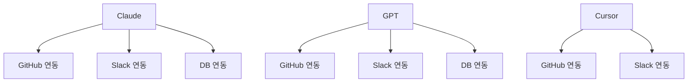
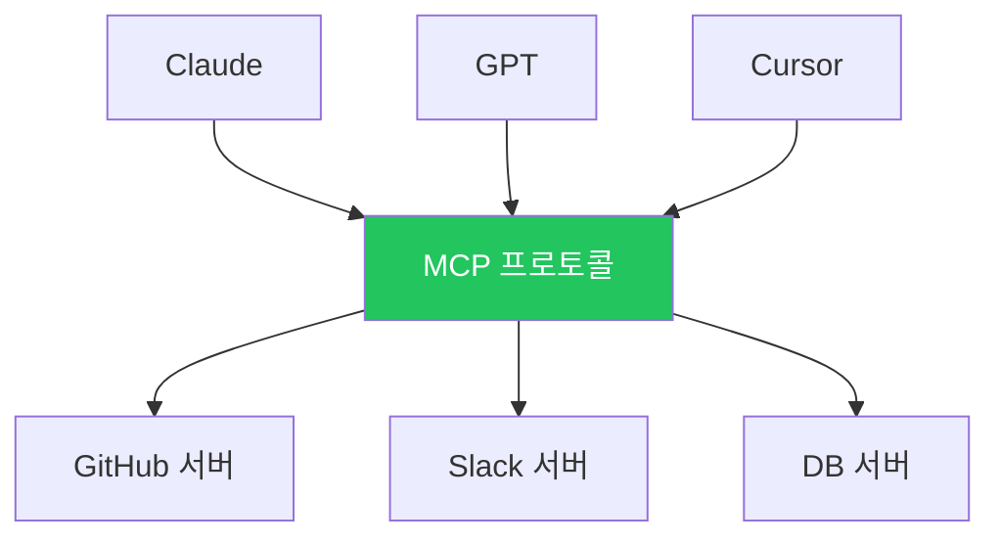
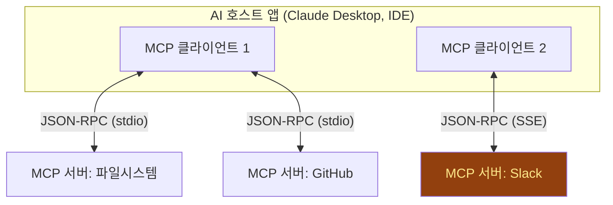

# MCP vs CLI

## AI 도구 연동의 두 가지 패러다임

CLI에 익숙한 개발자를 위한 MCP 입문 — 1시간 과정

<!--
[스크립트]
안녕하세요, 여러분. 오늘은 AI가 외부 도구와 소통하는 두 가지 방법, CLI와 MCP를 비교해 보겠습니다.

여러분은 이미 터미널에서 명령어를 치는 것에 매우 익숙하신 분들입니다. `git`, `docker`, `kubectl` — 이런 CLI 도구를 매일 쓰고 계시죠. 그런데 최근에 Claude나 Cursor 같은 AI 도구를 쓰시면서 "이 AI가 내 도구들을 어떻게 쓰는 거지?" 하는 궁금증이 생기신 적 있을 겁니다.

오늘 그 궁금증을 해소합니다. AI가 도구를 쓰는 전통적인 방법(CLI 방식)과 새롭게 등장한 표준(MCP)을 비교하고, 언제 어떤 방식을 선택해야 하는지를 정리하겠습니다.

시간: 1분
-->

---

# 오늘의 목표

<v-click>

## ① MCP가 왜 등장했는가

CLI 방식의 **한계**를 이해하고, MCP가 해결하려는 문제를 설명할 수 있다

</v-click>

<v-click>

## ② 두 방식의 구조적 차이

CLI 방식과 MCP 방식의 **아키텍처 차이**를 그림으로 그릴 수 있다

</v-click>

<v-click>

## ③ 상황에 맞는 선택

"이 경우에는 CLI가 낫다 / MCP가 낫다"를 **근거를 들어** 판단할 수 있다

</v-click>

<!--
[스크립트]
오늘의 목표 세 가지입니다.

[click]
첫 번째, MCP가 왜 등장했는지를 이해하는 것입니다. 새로운 기술이 나오면 "왜 필요한데?"라는 질문이 가장 중요합니다. CLI로 잘 하고 있었는데 왜 MCP라는 게 나왔을까요? 기존 방식의 한계를 먼저 정확히 짚고, 그 한계에서 MCP가 어떻게 탄생했는지를 이해하겠습니다.

[click]
두 번째, 두 방식의 구조적 차이를 파악하는 것입니다. "대충 다른 거겠지"가 아니라, 아키텍처 수준에서 어디가 어떻게 다른지를 명확히 구분할 수 있어야 합니다. 데이터가 어디서 어디로 흐르는지, 도구 정의가 어디에 있는지, 이런 구조적 차이를 그림으로 그릴 수 있는 수준까지 가겠습니다.

[click]
세 번째이자 가장 실무적인 목표입니다. "그래서 나는 뭘 써야 하는데?" — 이 질문에 답할 수 있어야 합니다. CLI가 적합한 상황, MCP가 적합한 상황을 구분하고, 그 판단의 근거를 댈 수 있게 되는 것이 오늘의 최종 목표입니다.

💡 여기서 잠깐 — 혹시 "MCP가 CLI를 완전히 대체하는 건가?" 하는 생각이 드셨다면, 오늘 수업이 끝날 때쯤 그 생각이 바뀌실 겁니다. 결론부터 말씀드리면, 둘은 대체 관계가 아니라 보완 관계입니다. 이 부분은 뒤에서 자세히 다루겠습니다.

[Q&A 대비]
Q: MCP를 아직 한 번도 써본 적이 없는데 따라갈 수 있나요?
A: 네, 전혀 문제없습니다. 오늘 수업은 MCP를 처음 접하는 분을 기준으로 설계되어 있습니다. CLI에 익숙하시다면 MCP의 개념을 이해하는 것은 훨씬 수월합니다. CLI에서의 경험이 오히려 MCP를 이해하는 데 좋은 배경지식이 됩니다.

Q: Function Calling이랑 MCP는 같은 건가요? (← 이미 AI API를 써본 개발자)
A: 다릅니다. Function Calling은 AI 모델이 "이 함수를 호출하겠다"고 결정하는 메커니즘이고, MCP는 "어떤 함수(도구)들이 있는지 AI에게 알려주는" 프로토콜입니다. 레이어가 다릅니다. MCP로 발견된 도구가 Function Calling으로 실행되는 겁니다. 이 부분은 Session 2에서 자세히 다룹니다.

전환: 그럼 먼저, 우리가 잘 알고 있는 CLI 방식부터 복습해 보겠습니다.
시간: 3분
-->

---
layout: section
---

# Session 1
# CLI 방식 복습

우리가 아는 도구 연동 — **10분**

<!--
[스크립트]
Session 1입니다. CLI 방식으로 AI가 도구를 사용하는 방법을 복습하겠습니다.

여러분이 매일 쓰시는 그 CLI입니다. `git status`, `docker ps`, `ls -la` — 이런 명령어를 AI가 대신 실행하는 방식이 CLI 방식의 도구 연동입니다. 새로운 개념은 아닙니다. 이미 아시는 것을 "AI 도구 연동"이라는 프레임으로 다시 보는 것입니다.

전환: 구체적으로 데이터가 어떻게 흐르는지 살펴보겠습니다.
시간: 30초
-->

---

# CLI 도구 연동 — 데이터 흐름

<div class="flex items-center justify-center gap-2 mt-8">
  <div class="bg-indigo-600 text-white px-5 py-4 rounded-xl text-center font-bold shadow-lg transition-all duration-300" :class="$clicks === 0 ? 'ring-2 ring-indigo-300 scale-105' : 'opacity-40'">
    <div class="text-xs opacity-70">① 요청</div>
    <div>AI 모델</div>
  </div>
  <div class="text-2xl opacity-30">→</div>
  <div class="bg-emerald-600 text-white px-5 py-4 rounded-xl text-center font-bold shadow-lg transition-all duration-300" :class="$clicks === 1 ? 'ring-2 ring-emerald-300 scale-105' : $clicks > 1 ? 'opacity-40' : 'opacity-40'">
    <div class="text-xs opacity-70">② 실행</div>
    <div>AI 앱</div>
  </div>
  <div class="text-2xl opacity-30">→</div>
  <div class="bg-amber-500 text-black px-5 py-4 rounded-xl text-center font-bold shadow-lg transition-all duration-300" :class="$clicks === 2 ? 'ring-2 ring-amber-300 scale-105' : $clicks > 2 ? 'opacity-40' : 'opacity-40'">
    <div class="text-xs opacity-70">③ 명령</div>
    <div>Shell</div>
  </div>
  <div class="text-2xl opacity-30">→</div>
  <div class="bg-emerald-600 text-white px-5 py-4 rounded-xl text-center font-bold shadow-lg transition-all duration-300" :class="$clicks === 3 ? 'ring-2 ring-emerald-300 scale-105' : $clicks > 3 ? 'opacity-40' : 'opacity-40'">
    <div class="text-xs opacity-70">④ stdout</div>
    <div>AI 앱</div>
  </div>
  <div class="text-2xl opacity-30">→</div>
  <div class="bg-indigo-600 text-white px-5 py-4 rounded-xl text-center font-bold shadow-lg transition-all duration-300" :class="$clicks >= 4 ? 'ring-2 ring-indigo-300 scale-105' : 'opacity-40'">
    <div class="text-xs opacity-70">⑤ 해석</div>
    <div>AI 모델</div>
  </div>
</div>

<v-clicks>

- AI 모델이 "이 명령어를 실행해줘"라고 요청
- AI 앱이 `subprocess.run()` 또는 `exec()`으로 쉘 실행
- stdout/stderr를 캡처하여 **문자열 그대로** AI에게 반환
- AI가 이 텍스트를 **해석**하여 다음 행동 결정

</v-clicks>

<!--
[스크립트]
CLI 방식의 데이터 흐름입니다. 다이어그램을 보시겠습니다.

왼쪽의 보라색 박스가 AI 모델입니다. AI 모델이 "git status를 실행해줘"라고 요청합니다. 가운데 초록색 박스가 AI 앱, 즉 에이전트입니다. Claude Code나 Cursor 같은 도구라고 생각하시면 됩니다. 이 앱이 실제로 쉘 명령어를 실행합니다. 오른쪽 노란색 박스가 Shell입니다. 명령어가 실행되고 stdout으로 결과가 돌아옵니다.

[click]
단계별로 보겠습니다. 첫 번째, AI 모델이 자연어로 "이 명령어를 실행해줘"라고 요청합니다.

[click]
두 번째, AI 앱이 Python의 `subprocess.run()`이나 Node.js의 `exec()` 같은 함수로 쉘 명령어를 실행합니다. 여러분이 스크립트에서 외부 명령어를 호출할 때 쓰는 것과 완전히 같습니다.

[click]
세 번째, 실행 결과인 stdout과 stderr를 캡처합니다. 중요한 점은, 이 결과가 **문자열 그대로** AI에게 전달된다는 것입니다. JSON이나 구조화된 데이터가 아니라, 터미널에 찍히는 그 텍스트 그대로입니다.

[click]
네 번째, AI가 이 텍스트를 해석해서 다음에 뭘 할지 결정합니다.

💡 여기서 잠깐 — "문자열 그대로"라는 점이 핵심입니다. `git status`의 출력을 생각해 보십시오. `modified: src/app.ts`, `Untracked files:` 같은 텍스트가 나옵니다. 사람은 이걸 쉽게 읽지만, AI가 이 텍스트를 정확하게 파싱하려면 문맥을 이해해야 합니다. 대부분은 잘 하지만, 가끔 출력 형식이 예상과 다르면 AI가 오해석하는 경우가 생깁니다. 이것이 뒤에서 다룰 CLI 방식의 핵심 한계입니다.

[Q&A 대비]
Q: AI가 쉘 명령어를 직접 실행하면 보안 문제가 없나요?
A: 매우 중요한 질문입니다. 대표적으로 쉘 인젝션 공격이 가능합니다. AI가 사용자 입력을 그대로 쉘에 전달하면 `; rm -rf /` 같은 명령이 섞여들어갈 수 있습니다. 그래서 대부분의 AI 도구는 샌드박스 안에서 실행하거나, Claude Code처럼 실행 전에 사용자 승인을 요청하는 방식을 씁니다. 보안은 CLI 방식의 가장 큰 약점 중 하나입니다.

Q: stdout 말고 exit code도 AI한테 전달되나요?
A: 구현에 따라 다릅니다. 잘 만든 에이전트는 exit code(0이면 성공, 그 외 실패)도 함께 전달합니다. 하지만 많은 구현체가 stdout 텍스트만 전달하고 exit code는 무시합니다. 이 경우 명령이 실패했는데 AI가 모르는 상황이 생길 수 있습니다.

전환: 이 방식이 잘 동작하는 경우도 많지만, 분명한 한계가 있습니다. 어떤 한계인지 정리해 보겠습니다.
시간: 4분
-->

---

# CLI 방식의 장점과 한계

<div class="grid grid-cols-2 gap-8">
<div>

### ✅ 장점

<v-clicks>

- **기존 도구 재활용** — 새로 만들 것이 없다
- **디버깅 쉬움** — 터미널에서 직접 실행 가능
- **학습 비용 제로** — 이미 아는 것
- **빠른 프로토타이핑** — 5분이면 도구 하나 연동

</v-clicks>

</div>
<div>

### ❌ 한계

<v-clicks>

- **비정형 출력** — AI가 텍스트 파싱에 실패
- **하드코딩** — 도구 추가마다 코드 수정
- **보안 취약** — 쉘 인젝션 위험
- **상태 없음** — 각 명령이 독립적
- **N×M 문제** — 앱별, 도구별 개별 구현

</v-clicks>

</div>
</div>

<!--
[스크립트]
CLI 방식의 장점과 한계를 나란히 놓고 비교하겠습니다. 왼쪽이 장점, 오른쪽이 한계입니다.

먼저 장점부터 보겠습니다.

[click]
첫 번째 장점, 기존 도구를 그대로 재활용할 수 있습니다. `git`, `docker`, `kubectl`, `curl` — 이미 수천 개의 CLI 도구가 존재합니다. 새로 만들 필요가 없습니다.

[click]
두 번째, 디버깅이 매우 쉽습니다. AI가 실행한 명령어를 그대로 복사해서 터미널에 붙여넣으면 같은 결과가 나옵니다. "AI가 뭘 했는지" 추적하기가 간단합니다.

[click]
세 번째, 학습 비용이 제로입니다. 여러분이 이미 알고 계신 것이니까요.

[click]
네 번째, 프로토타이핑이 빠릅니다. subprocess 호출 한 줄이면 도구 하나를 연동할 수 있습니다.

이제 오른쪽, 한계를 보겠습니다.

[click]
첫 번째이자 가장 큰 한계, 비정형 출력입니다. `docker ps`의 출력을 생각해 보십시오. 테이블 형태의 텍스트가 나옵니다. 사람은 쉽게 읽지만, AI가 이 텍스트에서 "컨테이너 이름"과 "상태"를 정확히 추출하려면 출력 형식을 알아야 합니다. 버전에 따라 출력 형식이 미묘하게 바뀌기도 합니다.

[click]
두 번째, 도구 목록이 하드코딩됩니다. AI에게 "너는 git과 docker를 쓸 수 있어"라고 코드에 적어놔야 합니다. 새 도구를 추가하려면 코드를 수정하고 재배포해야 합니다.

[click]
세 번째, 보안 취약성입니다. 쉘 명령어를 실행한다는 것 자체가 공격 표면을 넓힙니다.

[click]
네 번째, 상태 관리가 안 됩니다. 각 명령이 독립적으로 실행되기 때문에, 이전 명령의 결과를 다음 명령이 자동으로 참조하지 못합니다.

[click]
다섯 번째, N×M 문제입니다. 이것이 MCP가 등장한 핵심 이유입니다. 이 부분은 다음 세션에서 자세히 설명하겠습니다.

💡 여기서 잠깐 — 장점과 한계를 보면서 "한계가 더 많은데?"라고 느끼실 수 있습니다. 하지만 이것은 CLI 방식이 나쁘다는 뜻이 아닙니다. 단순한 사용 사례에서는 CLI가 가장 효율적입니다. 한계가 문제가 되는 것은 **규모가 커졌을 때**입니다. 도구가 2~3개일 때는 CLI로 충분하지만, 10개, 20개로 늘어나면 이 한계들이 급격히 부각됩니다.

[Q&A 대비]
Q: "--json" 플래그로 JSON 출력을 받으면 비정형 출력 문제가 해결되지 않나요?
A: 맞습니다. `docker ps --format json`이나 `gh api` 같은 도구는 JSON 출력을 지원합니다. 이 경우 파싱 문제가 크게 줄어듭니다. 하지만 모든 CLI 도구가 JSON 출력을 지원하는 것은 아니고, JSON 스키마가 표준화되어 있지 않아서 도구마다 구조가 다릅니다. MCP는 이 "출력 형식의 표준화"를 프로토콜 레벨에서 해결합니다.

Q: subprocess로 호출하면 되는데 왜 복잡하게 만드나요?
A: 단일 도구를 호출할 때는 subprocess로 충분합니다. 하지만 10개, 20개 도구를 AI에게 제공해야 한다면, 각 도구의 입력 스키마, 출력 형식, 에러 처리를 일일이 코딩해야 합니다. 도구가 늘어날수록 유지보수 비용이 기하급수적으로 증가합니다.

전환: 바로 이 "규모의 문제"를 해결하려고 등장한 것이 MCP입니다. 어떻게 해결하는지 보겠습니다.
시간: 5분
-->

---
layout: section
---

# Session 2
# MCP 등장

새로운 패러다임 — **20분**

<!--
[스크립트]
Session 2, MCP의 등장입니다. 여기가 오늘의 핵심 세션입니다. 20분 동안 MCP가 무엇이고, 어떤 문제를 해결하며, 어떤 구조로 동작하는지를 다룹니다.

앞에서 CLI 방식의 한계를 봤습니다. 특히 마지막에 말씀드린 "N×M 문제"가 핵심이었습니다. MCP는 바로 이 문제에서 출발합니다.

전환: 그 N×M 문제가 정확히 뭔지부터 짚어보겠습니다.
시간: 30초
-->

---

# N×M 문제 — Before MCP

<div class="text-center">

### 🔴 각 AI 앱이 각 도구에 개별 연동

</div>



<div class="text-center text-xl mt-2">

3 앱 × 3 도구 = <strong class="text-red-400">9개</strong> 어댑터 — 도구가 늘어날수록 <strong class="text-red-400">폭발적 증가</strong>

</div>

<!--
[스크립트]
N×M 문제입니다. 이 다이어그램은 MCP가 없을 때의 상황입니다.

AI 앱이 3개 있습니다. Claude, GPT, Cursor. 연결하려는 도구도 3개입니다. GitHub, Slack, DB. 각 앱이 각 도구에 연결하려면 조합마다 별도의 연동 코드가 필요합니다. 3×3 = 9개의 어댑터를 만들어야 합니다.

앱이 10개, 도구가 10개면 100개입니다. 이것이 N×M 문제입니다. 규모가 커질수록 유지보수가 불가능해집니다. 한 도구의 API가 바뀌면 그 도구와 연결된 N개의 어댑터를 전부 수정해야 합니다.

전환: MCP가 이 문제를 어떻게 해결하는지 보겠습니다.
시간: 2분
-->

---

# N+M 해결 — After MCP

<div class="text-center">

### 🟢 MCP 프로토콜이 중간 표준으로

</div>



<div class="text-center text-xl mt-2">

3 앱 + 3 서버 = <strong class="text-green-400">6개</strong> 구현 — USB처럼 <strong class="text-green-400">하나의 표준</strong>으로 연결

</div>

<!--
[스크립트]
N×M 문제입니다. 이 슬라이드가 MCP의 존재 이유를 한 장으로 보여줍니다.

왼쪽 다이어그램을 보시겠습니다. MCP가 없을 때의 상황입니다. AI 앱이 3개 있습니다. Claude, GPT, Cursor. 연결하려는 도구도 3개입니다. GitHub, Slack, DB. 각 앱이 각 도구에 연결하려면 조합마다 별도의 연동 코드가 필요합니다. 3×3 = 9개의 어댑터를 만들어야 합니다.

앱이 10개, 도구가 10개면 100개입니다. 이것이 N×M 문제입니다. 규모가 커질수록 유지보수가 불가능해집니다. 한 도구의 API가 바뀌면 그 도구와 연결된 N개의 어댑터를 전부 수정해야 합니다.

[click]
오른쪽을 보시겠습니다. MCP가 있을 때입니다. 가운데 초록색 박스, MCP 프로토콜이 중간 레이어로 들어갔습니다. 이제 각 AI 앱은 MCP 클라이언트만 구현하면 됩니다. 각 도구는 MCP 서버만 구현하면 됩니다. 3+3 = 6개의 구현으로 충분합니다.

💡 여기서 잠깐 — 이 구조, 어디서 많이 보신 것 같지 않습니까? USB와 똑같은 구조입니다. USB가 등장하기 전에는 프린터마다 전용 케이블, 스캐너마다 전용 케이블이 필요했습니다. USB가 중간 표준이 되면서 모든 장치가 하나의 포트로 연결됩니다. MCP는 AI-도구 연결의 "USB"입니다.

이 비유를 기억해 두십시오. MCP를 설명해야 할 때 가장 효과적인 비유입니다.

[Q&A 대비]
Q: 실제로 N×M 문제가 그렇게 심각한가요? 회사에서 쓰는 AI 앱은 하나인데요.
A: AI 앱이 하나라면 체감이 적을 수 있습니다. 하지만 도구 측면에서 보면 이야기가 달라집니다. GitHub, Slack, Jira, Confluence, 사내 DB, 사내 API — 연결할 도구가 늘어날수록 각각에 대한 연동 코드를 별도로 작성해야 합니다. 게다가 도구의 API가 바뀌면 연동 코드도 수정해야 합니다. MCP는 이 "연동 코드 관리"를 표준화해서 부담을 줄여줍니다.

Q: OpenAI의 Function Calling도 비슷한 문제를 풀지 않나요?
A: Function Calling은 "AI가 함수를 호출하는 메커니즘"이고, MCP는 "어떤 함수가 있는지 AI에게 알려주는 프로토콜"입니다. Function Calling에서는 개발자가 함수 스키마를 직접 API 호출에 포함시켜야 합니다. MCP에서는 서버가 자신의 도구 목록을 동적으로 알려줍니다. 레이어가 다릅니다. MCP로 발견된 도구가 Function Calling으로 실행되는 겁니다.

전환: N×M이 왜 문제인지 이해하셨으니, 이제 MCP의 구체적인 아키텍처를 살펴보겠습니다.
시간: 5분
-->

---

# MCP 아키텍처



<v-clicks>

- **호스트**: AI 앱 (Claude Desktop, Cursor, VS Code 등)
- **클라이언트**: 호스트 내부에서 MCP 서버와 1:1 연결을 관리
- **서버**: 도구/데이터를 제공하는 경량 프로세스
- **통신**: JSON-RPC 2.0 — 로컬은 stdio, 원격은 SSE/HTTP

</v-clicks>

<!--
[스크립트]
MCP의 아키텍처입니다. 이 다이어그램이 MCP의 전체 구조를 보여줍니다.

가장 위에 있는 큰 박스가 AI 호스트 앱입니다. Claude Desktop이나 Cursor 같은 AI 도구라고 생각하시면 됩니다. 이 호스트 내부에 MCP 클라이언트가 있습니다. 클라이언트는 하나 이상일 수 있습니다.

각 클라이언트는 MCP 서버와 1:1로 연결됩니다. 아래쪽에 초록색으로 표시된 것이 MCP 서버들입니다. 파일시스템 서버, GitHub 서버 — 각각이 독립적인 프로세스입니다.

[click]
호스트는 AI 앱 자체입니다. 여러분이 사용하는 Claude Desktop, Cursor, VS Code 등이 호스트입니다.

[click]
클라이언트는 호스트 내부에서 동작합니다. 각 MCP 서버와 1:1 연결을 관리하는 역할입니다. 하나의 호스트가 여러 클라이언트를 가질 수 있고, 각 클라이언트는 하나의 서버와 연결됩니다.

[click]
서버는 실제로 도구와 데이터를 제공하는 경량 프로세스입니다. Python이나 TypeScript로 작성된 작은 프로그램이라고 생각하시면 됩니다. 무거운 서버가 아닙니다.

[click]
통신 방식은 JSON-RPC 2.0입니다. 로컬 서버와는 stdio(표준입출력)로 통신합니다. 프로세스 간 파이프로 연결하는 것입니다. 원격 서버와는 SSE(Server-Sent Events) over HTTP로 통신합니다. 오른쪽의 노란색 Slack 서버가 원격 서버 예시입니다.

💡 여기서 잠깐 — "JSON-RPC"가 낯설게 느껴지실 수 있습니다. 간단합니다. JSON 형태로 "이 함수를 이 파라미터로 호출해줘"라고 보내고, JSON으로 결과를 받는 것입니다. REST API와 비슷한데, 메서드 이름과 파라미터를 JSON에 담는 방식입니다. 이미 여러분이 알고 계신 개념의 변형일 뿐입니다.

[Q&A 대비]
Q: stdio로 통신한다는 게 정확히 뭔가요? 파일에 쓰고 읽는 건가요?
A: 프로세스 간 통신입니다. MCP 호스트가 서버 프로세스를 실행하고, 서버의 stdin으로 JSON을 쓰고 stdout에서 JSON을 읽습니다. Unix 파이프(`|`)와 같은 원리입니다. `echo '{"method":"tools/list"}' | mcp-server` — 이런 식으로 동작한다고 생각하시면 됩니다.

Q: 서버 하나가 죽으면 다른 서버에 영향이 있나요?
A: 없습니다. 각 MCP 서버는 독립 프로세스이므로, GitHub 서버가 죽어도 파일시스템 서버는 정상 동작합니다. 호스트가 서버의 상태를 모니터링하고, 필요하면 재시작할 수 있습니다. 마이크로서비스와 비슷한 격리 모델입니다.

전환: 아키텍처를 봤으니, MCP 서버가 구체적으로 어떤 것을 제공하는지 살펴보겠습니다.
시간: 4분
-->

---

# MCP 서버가 제공하는 3가지

<div class="grid grid-cols-3 gap-6">

<div class="text-center">
<v-click>
<div class="text-4xl mb-2">🔧</div>

### Tools
AI가 **호출**하는 함수

<div class="text-sm mt-2 text-left">

- `search_issues`
- `send_message`
- `run_query`

</div>

<div class="text-xs opacity-60 mt-2">AI가 능동적으로 실행</div>
</v-click>
</div>

<div class="text-center">
<v-click>
<div class="text-4xl mb-2">📄</div>

### Resources
AI가 **읽는** 데이터

<div class="text-sm mt-2 text-left">

- 파일 내용
- DB 스키마
- API 응답 캐시

</div>

<div class="text-xs opacity-60 mt-2">AI가 참조만 함 (읽기전용)</div>
</v-click>
</div>

<div class="text-center">
<v-click>
<div class="text-4xl mb-2">💬</div>

### Prompts
미리 정의된 **템플릿**

<div class="text-sm mt-2 text-left">

- "이 코드 리뷰해줘"
- "이 로그 분석해줘"
- "SQL 쿼리 생성해줘"

</div>

<div class="text-xs opacity-60 mt-2">사용자가 선택하여 활용</div>
</v-click>
</div>

</div>

<!--
[스크립트]
MCP 서버가 제공하는 세 가지 요소입니다.

[click]
첫 번째, Tools입니다. AI가 직접 호출할 수 있는 함수입니다. `search_issues`로 GitHub 이슈를 검색하거나, `send_message`로 Slack 메시지를 보내거나, `run_query`로 DB 쿼리를 실행하는 것입니다. CLI 방식에서 쉘 명령어를 실행하던 것을 정형화된 함수 호출로 바꾼 것이라고 보시면 됩니다. AI가 능동적으로 실행하는 것이 핵심입니다.

[click]
두 번째, Resources입니다. AI가 읽을 수 있는 데이터입니다. 파일 내용, DB 스키마, API 응답 캐시 같은 것들입니다. Tools와 다른 점은, Resources는 읽기 전용입니다. AI가 데이터를 참조만 하고 수정하지는 않습니다. "이 코드를 읽어서 이해해"라고 할 때 코드 파일을 Resources로 제공하는 겁니다.

[click]
세 번째, Prompts입니다. 미리 정의된 프롬프트 템플릿입니다. "이 코드 리뷰해줘", "이 로그 분석해줘" 같은 자주 쓰는 작업을 템플릿으로 만들어놓는 것입니다. Prompts는 AI가 자동으로 쓰는 것이 아니라, 사용자가 선택해서 활용합니다.

💡 여기서 잠깐 — 이 세 가지 중 가장 많이 쓰이는 것은 압도적으로 Tools입니다. 실무에서 MCP 서버를 만든다고 하면, 대부분 Tools를 정의하는 것입니다. Resources와 Prompts는 보조적인 역할이라고 생각하시면 됩니다. 오늘 수업에서도 Tools에 집중하겠습니다.

한 가지 더 — CLI 방식과 비교해 보겠습니다. CLI에서는 "어떤 명령어를 쓸 수 있는지"를 AI에게 텍스트로 알려줬습니다. MCP에서는 서버가 Tools 목록을 JSON 스키마로 동적으로 제공합니다. AI가 "이 서버에 어떤 도구가 있지?"라고 물으면, 서버가 도구 목록과 각 도구의 입출력 스키마를 알려줍니다. 이것이 "동적 디스커버리"이고, CLI 방식과의 가장 큰 차이점입니다.

[Q&A 대비]
Q: Resources가 있으면 RAG(검색 증강 생성)가 필요 없나요?
A: 용도가 다릅니다. Resources는 "이미 알고 있는 구조화된 데이터"를 제공하는 것이고, RAG는 "대량의 비정형 문서에서 관련 정보를 검색"하는 것입니다. DB 스키마를 제공하는 것은 Resources, 사내 위키에서 답을 찾는 것은 RAG입니다. 물론 RAG 기능을 MCP 서버의 Tool로 구현할 수도 있습니다.

Q: Prompts는 시스템 프롬프트와 뭐가 다른가요?
A: 시스템 프롬프트는 AI의 전체 행동을 제어하는 고정된 지시입니다. MCP Prompts는 특정 작업을 위한 재사용 가능한 템플릿입니다. "코드 리뷰" 프롬프트를 선택하면 해당 작업에 최적화된 프롬프트가 자동으로 적용되는 식입니다. 사용자가 상황에 맞게 골라 쓸 수 있다는 점이 다릅니다.

전환: 개념은 충분히 봤으니, 실제 MCP 서버 코드가 어떻게 생겼는지 보겠습니다.
시간: 4분
-->

---

# MCP 서버 코드 — 생각보다 간단합니다

```python {1-4|6-10|12-21|23-25}{maxHeight:'380px'}
# pip install mcp
from mcp.server.fastmcp import FastMCP
import subprocess

mcp = FastMCP("git-tools")

# 도구 정의: 데코레이터 하나로 끝
@mcp.tool()
def git_status(repo_path: str) -> str:
    """Git 저장소의 현재 상태를 반환합니다"""
    result = subprocess.run(
        ["git", "status", "--porcelain"],
        cwd=repo_path,
        capture_output=True, text=True
    )
    return result.stdout or "변경사항 없음"

@mcp.tool()
def git_log(repo_path: str, count: int = 5) -> str:
    """최근 커밋 로그를 반환합니다"""
    result = subprocess.run(
        ["git", "log", f"--oneline", f"-{count}"],
        cwd=repo_path,
        capture_output=True, text=True
    )
    return result.stdout

# 서버 실행
mcp.run(transport="stdio")
```

<!--
[스크립트]
MCP 서버 코드입니다. Python으로 작성한 예시입니다. 보시면 생각보다 간단하다는 것을 느끼실 겁니다.

코드를 위에서부터 한 줄씩 보겠습니다.

첫 번째 블록입니다. `from mcp.server.fastmcp import FastMCP` — MCP의 Python SDK에서 FastMCP 클래스를 가져옵니다. `subprocess`도 import합니다. 그리고 `FastMCP("git-tools")`로 서버 인스턴스를 만듭니다. "git-tools"는 이 서버의 이름입니다.

[click]
두 번째 블록, 도구 정의입니다. `@mcp.tool()` 데코레이터 하나만 붙이면 됩니다. 일반적인 Python 함수에 데코레이터를 붙이는 것만으로 MCP 도구가 됩니다. 함수의 docstring이 도구의 설명이 되고, 매개변수의 타입 힌트가 입력 스키마가 됩니다. FastAPI를 써보신 분은 매우 익숙하실 겁니다. `@app.get()` 데코레이터와 거의 동일한 패턴입니다.

💡 여기서 잠깐 — 함수 내부를 보십시오. `subprocess.run(["git", "status", "--porcelain"])` — 이것, 아까 Session 1에서 봤던 CLI 방식 그대로입니다. MCP 서버 내부에서 CLI 도구를 호출하고 있습니다. MCP가 CLI를 대체하는 것이 아니라, CLI를 **감싸는 래퍼**라는 것이 바로 여기서 보입니다. 기존의 CLI 도구를 그대로 활용하면서, AI에게 제공하는 인터페이스만 표준화한 것입니다.

[click]
세 번째 블록도 같은 패턴입니다. `git_log` 함수에 `count: int = 5` 매개변수가 있습니다. 기본값이 5이므로, AI가 "최근 커밋 보여줘"라고 하면 5개를, "최근 10개 보여줘"라고 하면 count=10으로 호출합니다. MCP가 이 매개변수 정보를 AI에게 자동으로 알려줍니다.

[click]
마지막 줄, `mcp.run(transport="stdio")`로 서버를 실행합니다. 이게 전부입니다. 총 25줄도 안 되는 코드로 MCP 서버가 완성됩니다.

CLI 방식이었다면 이 두 도구를 AI에게 제공하려면 어떻게 해야 했을까요? 도구 목록을 텍스트로 적고, 입력 파싱 로직을 작성하고, 출력 형식을 정의하고... MCP에서는 그런 보일러플레이트가 없습니다. 데코레이터와 타입 힌트가 전부 해결합니다.

[Q&A 대비]
Q: TypeScript로도 만들 수 있나요?
A: 네. MCP SDK는 Python과 TypeScript 두 가지를 공식 지원합니다. TypeScript 버전도 거의 동일한 구조입니다. `server.tool("git_status", schema, handler)` 형태로 정의합니다. 선호하는 언어로 선택하시면 됩니다.

Q: 기존에 만든 CLI 도구를 MCP 서버로 감싸는 게 가능한가요?
A: 네, 방금 본 코드가 바로 그 패턴입니다. 기존 CLI 도구를 subprocess로 호출하고, 출력을 정형화해서 반환합니다. 기존 자산을 버리는 것이 아니라, "AI 친화적 래퍼"를 씌우는 것입니다. 가장 흔하고 실용적인 MCP 서버 패턴입니다.

전환: MCP의 코드까지 봤으니, 이제 CLI와 MCP를 나란히 놓고 정식으로 비교하겠습니다.
시간: 5분
-->

---
layout: section
---

# Session 3
# MCP vs CLI 비교

어떤 상황에서 무엇을 선택할 것인가 — **15분**

<!--
[스크립트]
Session 3입니다. 지금까지 CLI 방식과 MCP 방식을 각각 살펴봤습니다. 이제 둘을 나란히 놓고 직접 비교하겠습니다.

이 세션이 끝나면 "이 상황에서는 CLI가 낫다", "저 상황에서는 MCP가 낫다"를 근거를 들어 판단할 수 있게 됩니다.

전환: 먼저 항목별 비교 테이블부터 보겠습니다.
시간: 30초
-->

---

# 핵심 비교

| 구분 | CLI 방식 | MCP 방식 |
|------|---------|---------|
| **도구 정의** | 코드에 하드코딩 | 서버가 동적으로 제공 |
| **출력 형식** | 비정형 텍스트 (stdout) | 정형 JSON |
| **도구 검색** | ❌ 불가 | ✅ 동적 디스커버리 |
| **상태 관리** | ❌ 없음 (무상태) | ✅ 세션 기반 |
| **보안** | ⚠️ 쉘 인젝션 위험 | ✅ 권한 스코프 |
| **재사용성** | 낮음 (앱별 구현) | 높음 (표준 프로토콜) |
| **구현 난이도** | 매우 쉬움 | 쉬움 (SDK 활용) |
| **생태계 성숙도** | 매우 높음 | 성장 중 |

<!--
[스크립트]
CLI와 MCP를 항목별로 비교한 테이블입니다. 하나씩 짚어보겠습니다.

첫 번째 행, 도구 정의 방식입니다. CLI에서는 "이 AI는 git과 docker를 쓸 수 있다"고 코드에 직접 적어야 합니다. 도구가 추가되면 코드를 수정해야 합니다. MCP에서는 서버가 "나는 이런 도구들을 가지고 있어"라고 AI에게 동적으로 알려줍니다. 새 MCP 서버를 연결하기만 하면 도구가 자동으로 추가됩니다.

두 번째, 출력 형식입니다. CLI는 터미널에 찍히는 텍스트 그대로 AI에게 전달됩니다. MCP는 JSON으로 구조화된 응답을 반환합니다. AI 입장에서 JSON을 파싱하는 것이 비정형 텍스트를 해석하는 것보다 훨씬 안정적입니다.

세 번째, 도구 검색입니다. CLI에서는 AI가 "어떤 명령어를 쓸 수 있지?"를 스스로 알아낼 방법이 없습니다. 미리 알려줘야 합니다. MCP에서는 서버에 "도구 목록 줘"라고 요청하면 JSON 스키마로 응답이 옵니다. 이것이 동적 디스커버리입니다.

네 번째, 상태 관리입니다. CLI에서 각 명령은 독립적입니다. `cd /tmp`을 실행하고 다음 명령에서 `ls`를 해도 `/tmp`이 아닌 원래 디렉토리에서 실행됩니다. MCP는 세션 개념이 있어서 상태를 유지할 수 있습니다.

다섯 번째, 보안입니다. CLI는 쉘을 직접 사용하므로 인젝션 위험이 있습니다. MCP는 함수 호출 방식이라 쉘을 거치지 않고, 각 도구에 권한 스코프를 지정할 수 있습니다.

여섯 번째, 재사용성입니다. CLI 연동 코드는 앱마다 별도로 작성합니다. MCP 서버는 한 번 만들면 MCP를 지원하는 모든 앱에서 재사용할 수 있습니다.

마지막 두 행을 보시면, 구현 난이도는 CLI가 "매우 쉬움", MCP가 "쉬움"입니다. 차이가 크지 않습니다. 하지만 생태계 성숙도에서는 CLI가 압도적으로 높습니다. MCP는 2024년 11월에 공개되었으니, 아직 1년 반 정도밖에 되지 않았습니다.

💡 여기서 잠깐 — 이 테이블을 보면 "MCP가 모든 면에서 낫네"라고 느끼실 수 있습니다. 하지만 "생태계 성숙도"가 매우 중요한 변수입니다. 아무리 프로토콜이 좋아도, 실제로 쓸 수 있는 MCP 서버가 없으면 의미가 없습니다. 현재 성장 속도는 매우 빠르지만, CLI 생태계의 수십 년 축적과 비교하면 아직 초기입니다.

[Q&A 대비]
Q: MCP의 "세션 기반 상태 관리"가 구체적으로 어떻게 동작하나요?
A: MCP 클라이언트와 서버가 연결되면 하나의 세션이 생성됩니다. 이 세션 동안 서버는 내부 상태를 유지할 수 있습니다. 예를 들어 DB MCP 서버라면, 세션 시작 시 DB에 연결하고 세션 동안 해당 연결을 재사용합니다. CLI에서는 매번 `psql -c "SELECT ..."` 명령을 실행할 때마다 새 연결을 맺어야 합니다.

Q: CLI에서도 "--json" 플래그로 JSON 출력이 가능한데, 그러면 출력 형식 차이가 없어지지 않나요?
A: JSON 출력을 지원하는 도구라면 차이가 줄어듭니다. 하지만 두 가지 차이가 여전히 남습니다. 첫째, 모든 CLI가 JSON을 지원하지는 않습니다. 둘째, JSON을 지원하더라도 스키마가 도구마다 제각각입니다. MCP는 도구 목록, 입력 스키마, 출력 형식을 모두 표준화합니다.

전환: 비교 테이블을 봤으니, 실무에서의 선택 기준을 정리하겠습니다.
시간: 5분
-->

---

# 벤치마크: Token Efficiency Score

<div class="text-center mt-12">

<v-click>

<div class="flex items-end justify-center gap-16">
<div>
<div class="text-7xl font-bold text-blue-400">202</div>
<div class="text-lg mt-2 opacity-70">CLI</div>
</div>
<div class="text-3xl opacity-30 mb-4">vs</div>
<div>
<div class="text-7xl font-bold text-orange-400">152</div>
<div class="text-lg mt-2 opacity-70">MCP</div>
</div>
</div>

</v-click>

<v-click>

<div class="mt-8 text-xl text-green-400 font-bold">

CLI가 33% 더 효율적으로 토큰을 사용

</div>
<div class="text-sm opacity-50 mt-2">작업 완료율도 CLI가 28% 높음</div>

</v-click>

</div>

<div class="absolute bottom-6 left-14 text-xs opacity-40">

출처: <a href="https://gist.github.com/szymdzum/c3acad9ea58f2982548ef3a9b2cdccce" target="_blank">GitHub Gist — MCP vs CLI Benchmark Comparison (2026)</a>

</div>

<!--
[스크립트]
실제 벤치마크 데이터를 보겠습니다. 이 수치는 2026년 초에 발표된 CLI vs MCP 브라우저 자동화 벤치마크에서 나온 것입니다.

[click]
Token Efficiency Score입니다. CLI가 202점, MCP가 152점. CLI가 33% 더 효율적으로 토큰을 사용했습니다. 같은 작업을 수행하는 데 CLI가 더 적은 토큰으로 더 높은 성공률을 보인 것입니다.

[click]
작업 완료율도 CLI가 28% 더 높았습니다.

💡 여기서 잠깐 — 이 수치를 보면 "그러면 MCP 안 쓰면 되잖아"라고 생각하실 수 있습니다. 하지만 이 벤치마크는 단일 도구 호출 시나리오입니다. 도구가 1~2개일 때 CLI가 빠른 것은 당연합니다. MCP의 진짜 장점은 도구가 10개, 20개로 늘어날 때 나옵니다. 이 점을 기억하고 수치를 해석하셔야 합니다.

[Q&A 대비]
Q: 이 벤치마크가 모든 상황을 대표한다고 볼 수 있나요?
A: 아닙니다. 이 벤치마크는 브라우저 자동화라는 특정 시나리오에서 측정된 것입니다. 파일시스템 조작, DB 쿼리, API 통합 등 다른 시나리오에서는 결과가 다를 수 있습니다. 벤치마크 하나로 기술을 판단하는 것은 위험합니다.

전환: 왜 이런 차이가 나는 걸까요? 구조적 원인을 살펴보겠습니다.
시간: 2분
-->

---

# 왜 CLI가 벤치마크에서 이기는가?

<v-clicks>

- **MCP 오버헤드**: 매 호출마다 도구 메타데이터가 컨텍스트에 반복 주입
- **컨텍스트 포화**: 3~4회 도구 호출 후 컨텍스트 윈도우가 차서 추론 품질 저하
- **CLI 효율**: 컨텍스트의 95%를 순수 추론에 활용 가능
- **파이프라인**: CLI는 여러 명령을 한 번에 구성 (`git status | grep modified`)

</v-clicks>

<v-click>

<div class="bg-yellow-900/30 rounded-lg p-4 mt-6">

**단, 이 비교는 도구 1~2개 시나리오** — 도구가 10개 이상이면 CLI의 관리 비용이 MCP 오버헤드를 초과한다

</div>

</v-click>

<!--
[스크립트]
CLI가 벤치마크에서 이기는 구조적 이유를 보겠습니다.

[click]
첫 번째, MCP 오버헤드입니다. MCP는 도구를 호출할 때마다 도구 메타데이터를 컨텍스트에 반복 주입합니다. 도구 설명, 입력 스키마, 출력 형식 — 이런 정보가 매번 들어갑니다.

[click]
두 번째, 컨텍스트 포화입니다. 3~4회 도구 호출 후에는 누적된 메타데이터가 컨텍스트 윈도우를 상당 부분 차지합니다. AI의 attention 품질이 떨어지는 구간에 진입하게 됩니다.

[click]
세 번째, CLI는 이런 오버헤드가 없어서 컨텍스트의 95%를 순수 추론에 쓸 수 있습니다.

[click]
네 번째, CLI는 Unix 파이프라인으로 여러 명령을 한 번에 구성할 수 있습니다. MCP는 도구를 하나씩 호출해야 합니다.

[click]
하지만 이 비교에는 중요한 전제가 있습니다. 도구가 1~2개인 시나리오라는 것입니다. 도구가 10개 이상으로 늘어나면 CLI의 관리 비용 — 각 도구의 파싱, 에러 처리, 스키마 관리 — 이 MCP 오버헤드를 초과합니다. 규모에 따라 유불리가 역전됩니다.

[Q&A 대비]
Q: MCP의 메타데이터 오버헤드를 줄이는 방법이 있나요?
A: 2026년 MCP 로드맵에서 도구 메타데이터 최적화가 핵심 과제로 올라와 있습니다. 실무에서는 필요한 도구만 선택적으로 로드하는 방식으로 우회합니다. 전체 도구 20개 중 현재 대화에 필요한 5개만 활성화하는 식입니다.

전환: 벤치마크만 보면 CLI가 우세해 보입니다. 하지만 업계에서는 더 큰 논쟁이 벌어지고 있습니다.
시간: 3분
-->

---

# 회의론 ① — "MCP is a fad"


<div class="mt-3 text-sm">

"과대포장된 미들웨어에 불과하다. 결국 사라질 것이다." — Hacker News 토론에서 가장 많이 나온 주장

</div>

<div class="mt-2 text-xs opacity-50">
출처: <a href="https://news.ycombinator.com/item?id=46552254" target="_blank">Hacker News — MCP is a fad</a>
</div>

<!--
[스크립트]
업계의 실제 목소리를 하나씩 보겠습니다. 이 논쟁을 알아야 현장에서 "MCP 어떻게 생각하세요?"라는 질문에 답할 수 있습니다.

첫 번째, Hacker News 토론입니다. 화면에 보이는 것이 실제 토론 페이지입니다. 빨간 박스로 표시된 부분이 핵심 주장입니다. "MCP is a fad" — MCP는 유행일 뿐이라는 겁니다. 과대포장된 미들웨어에 불과하고, 결국 사라질 것이라는 주장입니다.

이 토론에서 나온 핵심 근거는: MCP가 해결하려는 문제를 기존 도구(Function Calling, CLI)로도 충분히 해결할 수 있다는 것입니다. 추가 레이어를 만들어봐야 복잡성만 늘어난다는 거죠.

[Q&A 대비]
Q: Hacker News 의견이 업계 전체를 대표하나요?
A: HN은 얼리어답터와 시니어 개발자가 많아서 기술 트렌드의 초기 반응을 잘 반영합니다. 다만 부정적 의견이 더 눈에 띄는 플랫폼 특성이 있으니, 한쪽 의견만 보지 않는 것이 중요합니다.

전환: 이것이 비판의 한 축이라면, 다른 쪽에서는 어떤 데이터를 내놓고 있을까요?
시간: 2분
-->

---

# 회의론 ② — "CLI가 새로운 MCP다"


<div class="mt-3 text-sm">

"CLI가 AI 에이전트의 더 우수한 통합 패턴으로 부상하고 있다" — 실전 예제와 아키텍처 분석 포함

</div>

<div class="mt-2 text-xs opacity-50">
출처: <a href="https://oneuptime.com/blog/post/2026-02-03-cli-is-the-new-mcp/view" target="_blank">OneUptime — Why CLI is the New MCP for AI Agents (Feb 2026)</a>
</div>

<!--
[스크립트]
두 번째 회의론입니다. 화면에 보이는 블로그 글이 2026년 2월에 게시된 "Why CLI Tools Are Beating MCP for AI Agents"입니다.

이 글에서 저자는 실제 벤치마크 데이터를 근거로 CLI가 MCP보다 우수하다고 주장합니다. 앞서 본 Token Efficiency Score(CLI 202 vs MCP 152)도 이 계열의 벤치마크에서 나온 것입니다.

💡 여기서 잠깐 — 이 벤치마크는 단일 도구, 단기 작업 시나리오입니다. 도구가 10개 이상인 엔터프라이즈 환경에서는 결과가 역전될 수 있습니다. 벤치마크의 전제를 항상 확인하는 습관이 중요합니다.

전환: 비판이 이렇게 강한데, 그럼에도 MCP가 살아남은 이유가 있습니다.
시간: 2분
-->

---

# 반론 — "MCP가 이미 이겼다"


<div class="mt-3 text-sm">

OpenAI·Google·MS 모두 채택. 월간 SDK 다운로드 **9,700만**. Linux Foundation에 거버넌스 이관 완료.

</div>

<div class="mt-2 text-xs opacity-50">
출처: <a href="https://thenewstack.io/why-the-model-context-protocol-won/" target="_blank">The New Stack — Why the Model Context Protocol Won</a>
</div>

<!--
[스크립트]
반대편 목소리입니다. The New Stack의 "Why the Model Context Protocol Won" — MCP가 이미 승리했다는 분석입니다.

화면에 보이는 기사의 핵심은: 프로토콜의 생존은 완벽함이 아니라 채택에 달려 있고, MCP는 이미 그 임계점을 넘었다는 것입니다.

근거를 보겠습니다. OpenAI, Google, Microsoft가 모두 2025년에 MCP를 채택했습니다. 월간 SDK 다운로드가 9,700만입니다. 2025년 12월에는 Anthropic이 MCP를 Linux Foundation 산하 Agentic AI Foundation에 기부하여 업계 공동 거버넌스를 확립했습니다.

HTTP가 처음에 비판받았지만 살아남은 이유와 같습니다. 완벽해서가 아니라 충분히 많은 사람이 쓰기 때문입니다.

[Q&A 대비]
Q: MCP가 정말 살아남을 수 있을까요?
A: 프로토콜의 생존은 거버넌스와 채택에 달려 있습니다. MCP는 둘 다 확보했습니다. Linux Foundation 거버넌스로 단일 벤더 리스크가 해소되었고, 빅테크 3사가 모두 채택했습니다.

전환: 찬반 논쟁을 충분히 봤습니다. 결론은 의외로 단순합니다.
시간: 2분
-->

---

# 논쟁의 결론

<div class="text-center mt-12">

<div class="text-3xl font-bold text-green-400 mb-8">

"The MCP vs CLI Debate Is the Wrong Fight"

</div>

<div class="text-lg opacity-80">

이 논쟁 자체가 잘못된 프레임이다 — 둘은 <strong>경쟁이 아니라 보완 관계</strong>

</div>

<div class="mt-8 text-sm opacity-50">
<a href="https://medium.com/@tobias_pfuetze/the-mcp-vs-cli-debate-is-the-wrong-fight-a87f1b4c8006" target="_blank">Tobias Pfuetze, Medium, 2026</a>
</div>

</div>

<!--
[스크립트]
세 가지 목소리를 봤습니다. "MCP는 유행이다", "CLI가 이기고 있다", "MCP가 이미 이겼다".

결론은 의외로 단순합니다. 화면의 인용문을 보시겠습니다. "The MCP vs CLI Debate Is the Wrong Fight" — 이 논쟁 자체가 잘못된 프레임이라는 것입니다.

CLI와 MCP는 경쟁 관계가 아니라 보완 관계입니다. CLI는 명령을 실행하는 방법이고, MCP는 AI에게 도구를 알려주는 프로토콜입니다. 레이어가 다릅니다. 실무에서는 MCP 서버 안에서 CLI를 호출합니다.

이것이 오늘 수업의 핵심 결론이기도 합니다. 이제 실무에서 어떻게 선택할지를 정리하겠습니다.

시간: 1분
-->

---

# 선택 기준 — 언제 무엇을 쓰는가

<div class="grid grid-cols-2 gap-6 mt-4">

<div class="bg-blue-900/30 rounded-xl p-5 border border-blue-700/50">

<div class="text-center text-2xl font-bold text-blue-400 mb-4">🔧 CLI</div>

<v-clicks>

- 도구 **2~3개** 이하
- 이미 잘 동작하는 CLI가 있음
- **빠른 프로토타이핑** 목적
- 1회성 스크립트/자동화
- AI 연동이 **부차적** 기능

</v-clicks>

</div>

<div class="bg-purple-900/30 rounded-xl p-5 border border-purple-700/50">

<div class="text-center text-2xl font-bold text-purple-400 mb-4">🔌 MCP</div>

<v-clicks>

- 도구 **5개 이상**으로 많음
- **여러 AI 앱**에서 동일 도구 사용
- 도구 목록이 **동적으로 변경**됨
- 입출력 **정형화**가 중요
- **프로덕션** 레벨 도구 제공

</v-clicks>

</div>

</div>

<v-click>

<div class="text-center mt-4 text-sm text-green-400">

가장 현실적인 패턴: **CLI로 시작 → 규모 커지면 MCP로 전환**

</div>

</v-click>

<!--
[스크립트]
실무에서의 선택 기준입니다. 왼쪽 파란 카드가 CLI, 오른쪽 보라 카드가 MCP입니다.

CLI가 적합한 경우를 보겠습니다.

[click]
도구가 2~3개 이하일 때입니다. subprocess 두 줄이면 충분합니다.

[click]
이미 잘 동작하는 CLI 도구가 있을 때입니다.

[click]
빠른 프로토타이핑이 목적일 때입니다.

[click]
1회성 스크립트일 때입니다.

[click]
AI 연동이 부차적인 기능일 때입니다.

이제 MCP가 적합한 경우를 보겠습니다.

[click]
도구가 5개 이상으로 많을 때입니다.

[click]
여러 AI 앱에서 동일 도구를 사용해야 할 때입니다.

[click]
도구 목록이 동적으로 변경될 때입니다.

[click]
입출력 정형화가 중요할 때입니다.

[click]
프로덕션 레벨의 도구 제공이 목적일 때입니다.

[click]
화면 하단을 보시면, 가장 현실적인 패턴이 있습니다. CLI로 시작해서 규모가 커지면 MCP로 전환합니다.

💡 여기서 잠깐 — "전부 MCP로" 또는 "전부 CLI로" 같은 극단적 선택은 오히려 비효율적입니다. 핵심 도구 10개는 MCP로 관리하고, 간단한 1회성 명령은 CLI로 처리하는 하이브리드 방식이 가장 흔합니다.

[Q&A 대비]
Q: "도구가 5개 이상"이라는 기준은 어디서 나온 건가요?
A: 경험적 가이드라인입니다. 도구가 5개를 넘기면 각 도구의 입출력 처리, 에러 핸들링, 도구 목록 관리 코드가 급격히 복잡해집니다. MCP는 그 "도구 관리 시스템"을 표준으로 제공하는 것입니다.

Q: 두 방식을 섞어서 쓸 수도 있나요?
A: 물론입니다. 실무에서 이것이 가장 현실적입니다. Claude Code도 내부적으로 CLI와 MCP를 모두 transport layer로 사용합니다.

전환: 마지막으로 오늘 배운 내용을 핵심 한 문장으로 정리하겠습니다.
시간: 4분
-->

---

# 핵심 결론

<div class="text-center mt-6">

<v-click>

<div class="text-2xl font-bold mb-8">

CLI와 MCP는 경쟁이 아니라 <span class="text-green-400">보완 관계</span>다

</div>

</v-click>

<v-click>

<div class="grid grid-cols-3 gap-6 text-center">
<div class="bg-gray-800/50 rounded-lg p-4">
<div class="text-sm opacity-50 mb-2">구분</div>
<div class="font-bold text-lg">본질</div>
<div class="font-bold text-lg mt-3">비유</div>
<div class="font-bold text-lg mt-3">레이어</div>
</div>
<div class="bg-blue-900/30 rounded-lg p-4 border border-blue-700/30">
<div class="text-sm text-blue-400 font-bold mb-2">CLI</div>
<div class="text-lg">명령을 <strong class="text-blue-400">실행</strong>하는 방법</div>
<div class="text-lg mt-3">전용 케이블</div>
<div class="text-lg mt-3">실행 레이어</div>
</div>
<div class="bg-purple-900/30 rounded-lg p-4 border border-purple-700/30">
<div class="text-sm text-purple-400 font-bold mb-2">MCP</div>
<div class="text-lg">AI에게 도구를 <strong class="text-purple-400">알려주는</strong> 방법</div>
<div class="text-lg mt-3">USB 표준</div>
<div class="text-lg mt-3">프로토콜 레이어</div>
</div>
</div>

</v-click>

<v-click>

<div class="mt-8 text-xl font-bold">

가장 흔한 실무 패턴: <span class="text-green-400">MCP 서버 내부에서 CLI를 호출한다</span>

</div>

</v-click>

</div>

<!--
[스크립트]
오늘의 핵심 결론입니다.

[click]
CLI와 MCP는 경쟁이 아니라 보완 관계입니다. 수업 시작할 때 "MCP가 CLI를 대체하는 건가?"라는 질문을 던졌었죠. 답은 아닙니다. 둘은 레이어가 다릅니다.

[click]
테이블을 보시겠습니다. CLI의 본질은 "명령을 실행하는 방법"입니다. MCP의 본질은 "AI에게 도구를 알려주는 방법"입니다. 비유로 말하면, CLI는 프린터 전용 케이블이고 MCP는 USB 표준입니다. USB가 나왔다고 프린터가 사라진 것이 아니듯, MCP가 나왔다고 CLI가 사라지는 것이 아닙니다. 연결 방식이 표준화된 것입니다.

레이어를 보시면, CLI는 실행 레이어에 있고 MCP는 프로토콜 레이어에 있습니다. 서로 다른 층에서 동작합니다.

[click]
그래서 가장 흔한 실무 패턴이 바로 이것입니다. MCP 서버 내부에서 CLI를 호출한다. 아까 코드에서 봤죠? `subprocess.run(["git", "status"])` — MCP 서버 안에서 기존 CLI 도구를 그대로 쓰고, AI에게는 정형화된 인터페이스를 제공합니다. 기존 자산을 버리는 것이 아니라, AI 친화적인 래퍼를 씌우는 것입니다.

오늘 배운 것을 세 문장으로 정리합니다.
하나, CLI는 익숙하고 강력하지만 규모가 커지면 관리가 어렵다.
둘, MCP는 AI-도구 연결을 표준화하여 N×M을 N+M으로 줄인다.
셋, 둘은 대체가 아니라 보완이고, 실무에서는 MCP 안에서 CLI를 쓴다.

[Q&A 대비]
Q: MCP를 지금 당장 도입해야 하나요?
A: "지금 당장"보다는 "필요할 때"가 맞습니다. 도구가 2~3개이고 AI 앱이 하나라면 CLI로 충분합니다. 하지만 도구가 늘어나거나 여러 AI 앱에서 도구를 재사용하고 싶다면, 그때 MCP 전환을 고려하십시오. 좋은 소식은, CLI로 만든 것을 MCP로 감싸는 것이 매우 쉽다는 것입니다.

Q: MCP의 미래 전망은 어떤가요?
A: 2025년 현재, OpenAI, Google, Microsoft 등 주요 AI 업체들이 MCP 지원을 발표하거나 도입 중입니다. 사실상의 표준(de facto standard)이 되어가고 있습니다. 개발자 도구(IDE, CI/CD)에서의 채택도 빠르게 진행 중입니다. "언젠가 써야 할 것"이 아니라 "곧 써야 할 것"에 가깝습니다.

시간: 4분
-->

---
layout: end
---

# 감사합니다

## Q&A

오늘 배운 핵심: **CLI는 실행, MCP는 프로토콜 — 보완 관계**

<!--
[스크립트]
오늘 수업은 여기까지입니다. 감사합니다.

혹시 질문이 있으신 분 계신가요? 수업 중에 다루지 못한 내용이나 추가로 궁금한 점이 있으시면 편하게 질문해 주세요.

질문이 없으시면 마무리하겠습니다. 오늘 핵심은 하나입니다. CLI는 명령을 실행하는 방법이고, MCP는 AI에게 도구를 알려주는 프로토콜입니다. 둘은 대체가 아니라 보완 관계입니다. MCP 서버 안에서 CLI를 쓰는 것이 가장 흔한 실무 패턴이라는 것, 기억해 주십시오.

수고하셨습니다.

시간: 5분 (Q&A 포함)
-->
