# React.js 실무과정

## Next.js 공식 학습 자료 한국어판

<div class="pt-12 opacity-80">

React Foundations 12 챕터 + App Router(Dashboard) 17 챕터

</div>

<div class="pt-8 text-sm opacity-60">

출처: <code>https://nextjs.org/learn</code>

</div>

<!--
[스크립트]
안녕하세요, 여러분. 오늘부터 저와 함께 React와 Next.js를 배워보겠습니다.

화면에 보이는 제목 그대로입니다. 이 코스는 Next.js 공식 학습 사이트의 자료를 한국어로 번역·정리한 것입니다. React 기초 12챕터, 그리고 Next.js App Router로 대시보드 앱을 만드는 17챕터, 총 29챕터를 함께 나아갑니다.

React를 전혀 모르셔도 괜찮습니다. 이 코스의 출발점은 HTML, CSS, JavaScript 기본 지식만 있으면 됩니다.

전환: 먼저 코스 전체 안내를 간단히 살펴보고 바로 시작하겠습니다.
시간: 1분
-->

---
layout: section
---

# Part 0
## 코스 안내

<!--
[스크립트]
Part 0, 코스 안내입니다. 수업을 시작하기 전에 오늘 뭘 배우는지, 어떻게 진행되는지 큰 그림을 먼저 그려드리겠습니다.

전환: 먼저 이 코스에서 무엇을 만드는지 보여드리겠습니다.
시간: 30초
-->

---

## 이 코스에서 만드는 것

<div class="grid grid-cols-2 gap-8 pt-4">

<div>

### 🧩 Part 1 — React 기초 다지기
- HTML과 DOM의 관계
- 명령형 vs 선언형
- React Component, Props, State
- React → Next.js 마이그레이션

**작은 페이지를 직접 손으로 만들어 봅니다.**

</div>

<div>

### 📊 Part 2 — Next.js로 풀스택 앱
- 금융 대시보드
- 인증 + 인보이스 CRUD
- Postgres 데이터베이스 연결
- 검색·페이지네이션·서버 액션

**실제 서비스에 가까운 앱을 완성합니다.**

</div>

</div>

<div class="absolute bottom-8 left-12 right-12 text-sm bg-blue-900/30 border border-blue-500/40 rounded p-3">

🎯 **목표**: HTML/CSS/JS는 알지만 React는 처음인 사람이 첫 Next.js 앱을 배포까지 완료할 수 있게 한다.

</div>

<!--
[스크립트]
이 코스에서 우리가 만들 것을 한눈에 보여드리는 슬라이드입니다.

왼쪽, **Part 1 — React 기초 다지기**입니다. HTML과 DOM의 관계부터 시작해서, 명령형 코드와 선언형 코드의 차이, React의 핵심 세 가지 개념인 Component·Props·State, 그리고 React를 Next.js로 마이그레이션하는 과정까지 다룹니다. 이 파트에서는 작은 HTML 페이지를 직접 손으로 만들어 보면서 React가 왜 필요한지 몸으로 느끼게 됩니다.

오른쪽, **Part 2 — Next.js로 풀스택 앱**입니다. 금융 대시보드를 만드는데요. 인증, 인보이스 CRUD, Postgres 데이터베이스 연결, 검색과 페이지네이션, 서버 액션까지 실제 서비스에 가까운 앱을 완성합니다.

화면 하단의 목표 박스를 보시면 — "HTML·CSS·JS는 알지만 React는 처음인 사람이 첫 Next.js 앱을 배포까지 완료할 수 있게 한다"입니다. 이것이 이 코스의 단 하나의 목표입니다.

[Q&A 대비]
Q: React를 이미 어느 정도 아는 경우 Part 1을 건너뛰어도 되나요?
A: 네, 가능합니다. 이미 React의 Component·Props·State를 잘 안다면 Chapter 9 "From React to Next.js"부터 시작하거나, 바로 Part 2로 넘어가셔도 됩니다. 다만 Part 1의 뒷부분인 Server Components/Client Components 개념은 Next.js에서 핵심이므로 Chapter 11은 확인해보시길 권장합니다.

Q: TypeScript를 모르는데 괜찮나요?
A: 걱정하지 않으셔도 됩니다. Part 2에서 TypeScript 파일(.tsx)이 등장하지만, 코드를 보면서 자연스럽게 익숙해지도록 설명합니다. TypeScript 지식이 없어도 따라올 수 있게 구성되어 있습니다.

전환: 학습이 어떤 순서로 흘러가는지 큰 그림을 보여드리겠습니다.
시간: 3분
-->

---

## 학습 흐름 한눈에 보기

<div class="pt-6 flex flex-col items-center gap-3 text-xs">

<div class="flex items-center justify-center gap-1 flex-wrap">
  <div class="bg-blue-900/40 border border-blue-500/40 rounded px-2 py-2 text-center w-28">HTML / JS</div>
  <span class="opacity-60">→</span>
  <div class="bg-blue-900/40 border border-blue-500/40 rounded px-2 py-2 text-center w-28">React 기초</div>
  <span class="opacity-60">→</span>
  <div class="bg-blue-900/40 border border-blue-500/40 rounded px-2 py-2 text-center w-28">Components<br/>Props · State</div>
  <span class="opacity-60">→</span>
  <div class="bg-blue-900/40 border border-blue-500/40 rounded px-2 py-2 text-center w-28">Next.js 설치</div>
  <span class="opacity-60">→</span>
  <div class="bg-blue-900/40 border border-blue-500/40 rounded px-2 py-2 text-center w-28">Server / Client<br/>Components</div>
</div>

<div class="text-2xl opacity-50">↓</div>

<div class="flex items-center justify-center gap-1 flex-wrap">
  <div class="bg-purple-900/40 border border-purple-500/40 rounded px-2 py-2 text-center w-28">Routing<br/>Layouts</div>
  <span class="opacity-60">→</span>
  <div class="bg-purple-900/40 border border-purple-500/40 rounded px-2 py-2 text-center w-28">Database<br/>Data Fetching</div>
  <span class="opacity-60">→</span>
  <div class="bg-purple-900/40 border border-purple-500/40 rounded px-2 py-2 text-center w-28">Streaming</div>
  <span class="opacity-60">→</span>
  <div class="bg-purple-900/40 border border-purple-500/40 rounded px-2 py-2 text-center w-28">Mutating Data<br/>+ Auth</div>
  <span class="opacity-60">→</span>
  <div class="bg-purple-900/40 border border-purple-500/40 rounded px-2 py-2 text-center w-28">배포<br/>+ Metadata</div>
</div>

</div>

<div class="pt-6 grid grid-cols-2 gap-4 text-xs opacity-80">
  <div class="text-center"><span class="inline-block w-3 h-3 bg-blue-500/60 rounded-sm mr-1 align-middle"></span>Part 1 — React 기초</div>
  <div class="text-center"><span class="inline-block w-3 h-3 bg-purple-500/60 rounded-sm mr-1 align-middle"></span>Part 2 — Next.js 풀스택</div>
</div>

<!--
[스크립트]
학습 흐름을 화살표로 표현한 슬라이드입니다.

위 줄, 파란색 블록들이 **Part 1 — React 기초** 흐름입니다. HTML·JS 기본에서 시작해, React 기초를 익히고, Components·Props·State를 배운 뒤, Next.js 설치로 넘어가고, Server/Client Component 개념으로 마무리됩니다.

그 아래, 보라색 블록들이 **Part 2 — Next.js 풀스택** 흐름입니다. Routing과 Layouts, Database와 Data Fetching, Streaming, Mutating Data와 Auth, 마지막으로 배포와 Metadata까지 이어집니다.

각 파트가 독립된 것이 아니라 위에서 아래로, 왼쪽에서 오른쪽으로 쌓여가는 구조입니다. 앞에서 배운 개념이 뒤에서 계속 활용됩니다.

전환: 이 코스를 시작하기 전에 필요한 것들을 확인해 봅니다.
시간: 2분
-->

---

## 사전 지식 & 시스템 요구사항

<div class="grid grid-cols-2 gap-8 pt-4">

<div>

### 📚 사전 지식
- **HTML**: 태그·속성 기본
- **CSS**: 클래스·기본 셀렉터
- **JavaScript**: 변수·함수·배열·객체

✅ React는 몰라도 OK
✅ TypeScript는 코드 보면서 익숙해지면 OK

</div>

<div>

### 💻 시스템 요구사항
- **Node.js** 20.9 이상
- **OS**: macOS / Windows(WSL) / Linux
- **에디터**: VS Code 권장
- Part 2에서는 추가로
  - **GitHub** 계정
  - **Vercel** 계정 (무료)

</div>

</div>

<!--
[스크립트]
사전 지식과 시스템 요구사항입니다.

왼쪽을 보시면 **사전 지식**입니다. HTML 태그와 속성 기본, CSS 클래스와 기본 셀렉터, JavaScript 변수·함수·배열·객체 정도면 충분합니다. 중요한 것은, **React는 몰라도 됩니다**. 그리고 **TypeScript는 코드를 보면서 익숙해지면 됩니다**. 처음부터 완벽하게 알 필요가 없습니다.

오른쪽을 보시면 **시스템 요구사항**입니다. Node.js 20.9 이상이 필요합니다. OS는 macOS, Windows WSL, Linux 모두 됩니다. 에디터는 VS Code를 권장합니다. 그리고 Part 2에서는 GitHub 계정과 Vercel 계정이 추가로 필요한데, 둘 다 무료입니다.

💡 여기서 잠깐 — Node.js 버전을 확인해 보셨나요? 터미널에서 `node -v`를 치면 버전이 나옵니다. 20.9 미만이면 nodejs.org에서 최신 LTS 버전을 받아서 설치해 주세요. 버전이 맞지 않으면 Part 2에서 예상치 못한 오류가 날 수 있습니다.

[Q&A 대비]
Q: Windows에서 WSL 없이 PowerShell만으로도 됩니까?
A: 가능은 하지만 WSL을 강력히 추천합니다. Next.js 개발은 Linux/Mac 환경을 기준으로 설계되어 있고, WSL을 쓰면 터미널 명령어가 강사와 동일하게 동작합니다. WSL2 설치는 Microsoft 공식 문서에 단계별로 잘 나와 있습니다.

전환: 슬라이드를 어떻게 활용하는지 잠깐 보고 바로 본론으로 들어가겠습니다.
시간: 2분
-->

---

## 슬라이드 활용법

<div class="pt-4 grid grid-cols-2 gap-6">

<div class="bg-slate-800/50 p-4 rounded">

### 🟦 개념 슬라이드
배경 지식을 한국어로 풀어 설명. 이미지·다이어그램과 함께 봅니다.

</div>

<div class="bg-slate-800/50 p-4 rounded">

### 🟩 코드 슬라이드
실제 작성할 코드와 옆에 한국어 설명. 코드는 영문 그대로 보존.

</div>

<div class="bg-slate-800/50 p-4 rounded">

### 🟨 직접 해보기
함께 따라할 수 있는 lab은 `labs/` 폴더에 단계별로 준비되어 있습니다.

</div>

<div class="bg-slate-800/50 p-4 rounded">

### 🟥 정리 박스
챕터 끝마다 핵심 3~5가지를 박스로 정리.

</div>

</div>

<!--
[스크립트]
슬라이드를 어떻게 활용하는지 설명드립니다.

화면에 네 가지 박스가 보입니다. **파란색 — 개념 슬라이드**입니다. 배경 지식을 한국어로 풀어 설명하고, 이미지나 다이어그램과 함께 봅니다. **초록색 — 코드 슬라이드**입니다. 실제 작성할 코드와 설명이 함께 나옵니다. 코드 자체는 영문 그대로 보존합니다. **노란색 — 직접 해보기**입니다. 함께 따라할 수 있는 실습은 `labs/` 폴더에 단계별로 준비되어 있습니다. **빨간색 — 정리 박스**입니다. 챕터가 끝날 때마다 핵심 3~5가지를 녹색 박스로 정리해 드립니다.

전환: 이제 코스 안내는 끝났습니다. Part 1, React 기초로 바로 들어가겠습니다.
시간: 1분
-->

---
layout: section
---

# Part 1
## React 기초 다지기

<div class="pt-4 text-sm opacity-70">

총 12 챕터 · 작은 HTML 페이지를 React → Next.js로 진화시킵니다

</div>

<!--
[스크립트]
Part 1, React 기초 다지기입니다. 총 12챕터로 구성되어 있고, 작은 HTML 페이지를 React → Next.js로 진화시키는 과정을 함께 걷습니다.

전환: 왜 React부터 배워야 하는지, 동기 부여부터 시작합니다.
시간: 30초
-->

---

## 💡 왜 이 Part가 필요한가

<div class="pt-6 space-y-4 text-lg">

- 모던 웹 개발의 출발점은 **React**입니다. Next.js를 비롯한 거의 모든 도구가 React 위에서 동작합니다.
- 그렇다고 처음부터 거대한 프레임워크를 들이대면 길을 잃기 쉽습니다.
- 이 Part는 **HTML 한 줄에서 React 컴포넌트로 진화하는 과정**을 직접 손으로 만들어 보면서, "React가 왜 필요한지" 몸으로 느끼게 합니다.

</div>

<div class="absolute bottom-8 left-12 right-12 text-base bg-emerald-900/30 border border-emerald-500/40 rounded p-3">

🎯 **이 Part를 마치면**: React의 3대 핵심 개념(Component, Props, State)을 손에 익히고, 첫 Next.js 앱을 띄울 수 있습니다.

</div>

<!--
[스크립트]
왜 이 파트가 필요한지 솔직하게 말씀드리겠습니다.

모던 웹 개발의 출발점은 React입니다. Next.js, Remix, Gatsby, 심지어 최근의 많은 프레임워크들이 모두 React 위에서 동작합니다. React를 모르면 이 생태계에 발을 들이기 어렵습니다.

그렇다고 처음부터 Next.js라는 거대한 프레임워크를 들이대면 어디서부터 시작해야 할지 막막합니다. 설정 파일이 많고, 디렉토리 구조가 복잡하고, 개념이 너무 많이 한꺼번에 쏟아집니다.

그래서 이 파트는 전략이 있습니다. **HTML 한 줄에서 React 컴포넌트로 진화하는 과정**을 직접 손으로 만들어 보면서, "아, 이래서 React가 필요하구나"를 몸으로 느끼게 합니다.

화면 하단을 보시면 — 이 파트를 마치면 React의 핵심 세 가지 개념을 손에 익히고, 첫 Next.js 앱을 띄울 수 있게 됩니다.

[Q&A 대비]
Q: HTML·JS만으로도 웹 앱을 만들 수 있는데 왜 굳이 React를 써야 하나요?
A: 작은 프로젝트라면 HTML·JS만으로도 충분합니다. 하지만 앱이 커지면 DOM을 직접 조작하는 코드가 폭발적으로 늘어나고, 어느 코드가 어느 요소를 바꾸는지 추적하기가 매우 힘들어집니다. React는 이 복잡성을 관리할 수 있는 구조를 제공합니다. 이 파트에서 직접 경험하게 됩니다.

전환: Chapter 1부터 시작합니다.
시간: 2분
-->

---
layout: section
---

# Chapter 1
## React Foundations 시작하기

<div class="pt-4 text-sm opacity-60">

source: <code>https://nextjs.org/learn/react-foundations</code>

</div>

<!--
[스크립트]
Chapter 1, React Foundations 시작하기입니다. 이 챕터는 본격적인 수업 전 오리엔테이션 챕터입니다.

전환: 이 코스가 한 문장으로 무엇을 다루는지 보겠습니다.
시간: 30초
-->

---

## 코스 인트로 한 줄 요약

<div class="text-2xl pt-8 text-center font-bold">

JavaScript와 React 기초를 익혀<br/>
**Next.js로 갈 준비**를 합니다.

</div>

<div class="pt-12 grid grid-cols-3 gap-4 text-sm">

<div class="bg-slate-800/50 p-3 rounded">

**Step 1**

작은 JS 앱

</div>

<div class="bg-slate-800/50 p-3 rounded">

**Step 2**

React 앱으로 마이그레이션

</div>

<div class="bg-slate-800/50 p-3 rounded">

**Step 3**

Next.js 앱으로 마이그레이션

</div>

</div>

<div class="pt-8 text-center text-base opacity-80">

각 챕터는 이전 챕터 위에 쌓이도록 설계되어 있습니다.

</div>

<!--
[스크립트]
코스를 한 문장으로 요약하면 이렇습니다 — "JavaScript와 React 기초를 익혀 Next.js로 갈 준비를 합니다."

그 아래 세 단계를 보시면, 이 코스의 여정이 보입니다. **Step 1 — 작은 JS 앱**을 먼저 만듭니다. 바닐라 JavaScript로, 아주 기본적인 HTML 페이지입니다. **Step 2 — React 앱으로 마이그레이션**합니다. 방금 만든 JS 앱을 React로 바꿉니다. **Step 3 — Next.js 앱으로 마이그레이션**합니다. React 앱을 다시 Next.js로 업그레이드합니다.

하단에 쓰여 있듯이, 각 챕터는 이전 챕터 위에 쌓이도록 설계되어 있습니다. 하나를 건너뛰면 다음이 어색할 수 있으니 순서대로 따라오시길 권합니다.

전환: 이 코스에서 무엇을 배우는지 항목으로 확인해 봅니다.
시간: 2분
-->

---

## 코스에서 다룰 주제

<div class="grid grid-cols-2 gap-x-8 gap-y-2 pt-4 text-base">

- React와 Next.js가 무엇인지
- UI를 어떻게 화면에 렌더링하는지
- JavaScript로 UI를 어떻게 갱신하는지
- React를 어떻게 시작하는지

<div></div>

- Component로 UI를 어떻게 구성하는지
- Props로 데이터를 어떻게 전달하는지
- State로 어떻게 상호작용을 추가하는지
- React에서 Next.js로 어떻게 옮겨가는지
- Next.js를 어떻게 설치·사용하는지
- Server / Client Component의 차이

</div>

<div class="pt-6 text-sm opacity-70 text-center">

총 12 챕터 · 처음 11 챕터가 본문, 마지막은 다음 단계 안내

</div>

<!--
[스크립트]
이 코스에서 다룰 주제 목록입니다.

왼쪽 열부터 읽겠습니다. React와 Next.js가 무엇인지, UI를 어떻게 화면에 렌더링하는지, JavaScript로 UI를 어떻게 갱신하는지, React를 어떻게 시작하는지.

오른쪽 열입니다. Component로 UI를 어떻게 구성하는지, Props로 데이터를 어떻게 전달하는지, State로 어떻게 상호작용을 추가하는지, React에서 Next.js로 어떻게 옮겨가는지, Next.js를 어떻게 설치하고 사용하는지, Server와 Client Component의 차이가 무엇인지.

하단을 보시면 — 총 12챕터이고, 처음 11챕터가 본문이고 마지막 챕터는 다음 단계 안내입니다.

전환: 시작하기 전 준비물을 확인하겠습니다.
시간: 2분
-->

---

## 시작 전 체크리스트

<div class="grid grid-cols-2 gap-6 pt-6">

<div class="bg-slate-800/50 p-4 rounded">

### ✅ 사전 지식
- HTML, CSS, JavaScript 기본
- React 지식은 **불필요**
- 이미 React를 안다면 Chapter 9 ("From React to Next.js") 부터 봐도 무방

</div>

<div class="bg-slate-800/50 p-4 rounded">

### ✅ 시스템
- Node.js **20.12.0** 이상
- macOS / Windows(WSL) / Linux
- VS Code 또는 선호하는 에디터

</div>

</div>

<div class="pt-8 bg-blue-900/30 border border-blue-500/40 rounded p-3 text-sm">

🤝 **Discord 커뮤니티**: <code>https://discord.gg/Q3AsD4efFC</code> — 막히는 부분이 있으면 도움을 요청할 수 있습니다.

</div>

<!--
[스크립트]
시작 전 체크리스트입니다.

왼쪽 박스를 보겠습니다. **사전 지식** — HTML, CSS, JavaScript 기본이면 됩니다. React 지식은 불필요합니다. 이미 React를 안다면 Chapter 9 "From React to Next.js"부터 봐도 무방합니다.

오른쪽 박스입니다. **시스템** — Node.js 20.12.0 이상, macOS·Windows WSL·Linux, VS Code 또는 본인이 편한 에디터.

하단을 보시면 공식 Discord 커뮤니티 링크가 있습니다. 영어 커뮤니티이지만 막히는 부분이 생기면 질문해볼 수 있습니다.

💡 여기서 잠깐 — React를 이미 아신다면 Chapter 9부터 시작해도 된다고 했는데, 그래도 Chapter 2부터 3 정도는 훑어보시길 권합니다. 특히 DOM과 명령형·선언형 개념은 React가 왜 만들어졌는지 이해하는 데 큰 도움이 됩니다.

전환: 이제 본론입니다. Chapter 2, React와 Next.js가 무엇인지 알아봅니다.
시간: 2분
-->

---
layout: section
---

# Chapter 2
## React와 Next.js, 무엇이 다른가

<div class="pt-4 text-sm opacity-60">

source: <code>https://nextjs.org/learn/react-foundations/what-is-react-and-nextjs</code>

</div>

<!--
[스크립트]
Chapter 2, React와 Next.js가 무엇인지 알아봅니다.

지금 바로 React 코드를 쓰는 것도 중요하지만, 그 전에 "왜 React인가", "왜 Next.js인가"를 이해하는 것이 장기적으로 훨씬 중요합니다. 이 챕터가 그 토대를 잡아드립니다.

전환: 먼저 모던 웹 앱이 어떤 요소로 구성되는지 보겠습니다.
시간: 30초
-->

---

## 모던 웹 앱의 빌딩블록

<div class="grid grid-cols-3 gap-3 pt-4 text-sm">

<div class="bg-slate-800/50 p-3 rounded">

**🎨 User Interface**
사용자가 화면에서 보고 만지는 부분

</div>

<div class="bg-slate-800/50 p-3 rounded">

**🛣 Routing**
앱의 어느 페이지로 이동하는가

</div>

<div class="bg-slate-800/50 p-3 rounded">

**🔌 Data Fetching**
데이터가 어디 있고 어떻게 가져오는가

</div>

<div class="bg-slate-800/50 p-3 rounded">

**🖼 Rendering**
정적·동적 콘텐츠를 언제·어디서 만드는가

</div>

<div class="bg-slate-800/50 p-3 rounded">

**🧩 Integrations**
CMS·결제·인증 같은 외부 서비스 연결

</div>

<div class="bg-slate-800/50 p-3 rounded">

**☁️ Infrastructure**
어디에 배포하고 어떻게 실행하는가

</div>

<div class="bg-slate-800/50 p-3 rounded">

**⚡ Performance**
사용자 입장에서 빠른가

</div>

<div class="bg-slate-800/50 p-3 rounded">

**📈 Scalability**
팀·데이터·트래픽이 늘어도 버티는가

</div>

<div class="bg-slate-800/50 p-3 rounded">

**🛠 Developer Experience**
만드는 사람의 경험

</div>

</div>

<div class="pt-6 text-center opacity-80">

각 항목마다 "직접 만들지" vs "기존 도구를 쓸지" 결정해야 합니다.

</div>

<!--
[스크립트]
모던 웹 애플리케이션을 만들려면 여러 가지를 결정해야 합니다. 화면에 9개의 빌딩블록이 보입니다.

첫째, **User Interface** — 사용자가 화면에서 보고 만지는 부분입니다. 버튼, 텍스트, 이미지, 폼 등이 여기에 속합니다. 둘째, **Routing** — 앱의 어느 페이지로 이동하는가입니다. URL이 바뀔 때 어떤 페이지를 보여줄지의 문제입니다. 셋째, **Data Fetching** — 데이터가 어디 있고 어떻게 가져오는가입니다. 서버에서 가져올지, 클라이언트에서 가져올지, 캐싱은 어떻게 할지의 문제입니다.

넷째, **Rendering** — 정적·동적 콘텐츠를 언제, 어디서 만드는가입니다. 다섯째, **Integrations** — CMS, 결제, 인증 같은 외부 서비스와의 연결입니다. 여섯째, **Infrastructure** — 어디에 배포하고 어떻게 실행하는가입니다.

그리고 **Performance, Scalability, Developer Experience** — 성능, 확장성, 개발자 경험입니다.

하단의 문장을 보시면 — "각 항목마다 직접 만들지 vs 기존 도구를 쓸지 결정해야 합니다." 이게 웹 개발의 현실입니다. 다 직접 만들면 너무 많은 시간이 걸리고, 다 남의 도구를 쓰면 내 앱에 맞지 않을 수 있습니다. 이 균형을 잡는 것이 개발자의 역할입니다.

전환: 이 중에서 User Interface 부분을 담당하는 것이 React입니다.
시간: 3분
-->

---

## React란?

<div class="pt-4 text-xl">

[React](https://react.dev)는 **상호작용 가능한 UI를 만들기 위한 JavaScript 라이브러리**입니다.

</div>

<div class="pt-6 grid grid-cols-2 gap-6">

<div class="bg-slate-800/50 p-4 rounded">

### 📚 라이브러리란?
React는 UI를 만들기 위한 **함수(API)** 를 제공합니다. 그 함수를 어디에 어떻게 쓸지는 개발자에게 맡깁니다.

</div>

<div class="bg-slate-800/50 p-4 rounded">

### 🎒 그래서?
React는 **다른 부분에 대해 의견이 거의 없습니다.** 덕분에 React 주변에 풍부한 생태계가 자랐고, Next.js도 그 중 하나입니다.

</div>

</div>

<div class="pt-6 text-base opacity-80">

단, React 하나로 처음부터 풀스택 앱을 만들려면 라우팅·빌드·데이터 패칭 등을 직접 골라 조립해야 합니다.

</div>

<!--
[스크립트]
React가 무엇인지 정의부터 시작합니다.

React는 **상호작용 가능한 UI를 만들기 위한 JavaScript 라이브러리**입니다. 여기서 핵심 단어가 두 가지입니다. 하나는 "상호작용 가능한 UI"이고, 다른 하나는 "라이브러리"입니다.

왼쪽 박스 — **라이브러리란?** React는 UI를 만들기 위한 함수, 즉 API를 제공합니다. 그 함수를 어디에, 어떻게 쓸지는 개발자에게 맡깁니다. React는 "이렇게 해야 한다"는 강제가 거의 없습니다.

오른쪽 박스 — **그래서?** React는 다른 부분에 대해 의견이 거의 없기 때문에, React 주변에 풍부한 생태계가 자랐습니다. 라우팅을 위한 React Router, 상태 관리를 위한 Redux, 폼을 위한 React Hook Form... 그리고 Next.js도 그 생태계의 일부입니다.

하단에 중요한 내용이 있습니다 — "React 하나로 처음부터 풀스택 앱을 만들려면 라우팅·빌드·데이터 패칭 등을 직접 골라 조립해야 합니다." 이것이 Next.js가 필요한 이유입니다.

[Q&A 대비]
Q: 라이브러리와 프레임워크의 차이가 정확히 뭔가요?
A: 핵심 차이는 "누가 제어권을 갖느냐"입니다. 라이브러리는 우리가 필요할 때 가져다 쓰는 도구입니다. 우리 코드가 주도권을 갖고, 필요할 때 라이브러리 함수를 호출합니다. 프레임워크는 반대입니다. 프레임워크가 구조를 정하고, 우리 코드가 그 구조 안에서 동작합니다. "Don't call us, we'll call you" — 이것을 제어의 역전(Inversion of Control)이라고 합니다.

전환: React가 만드는 UI가 어떻게 생겼는지 직접 보겠습니다.
시간: 3분
-->

---

## React가 만드는 UI 예시

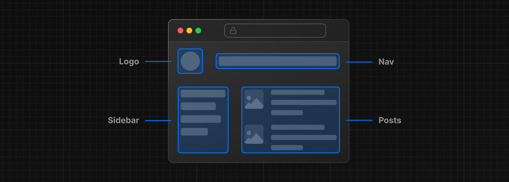

<div class="pt-3 text-sm opacity-70 text-center">

이런 화면(네비게이션, 사이드바, 게시물 목록 등)이 React가 다루는 "UI"입니다.

</div>

<!--
[스크립트]
화면에 이미지가 보입니다. 브라우저 창 안에 네비게이션 바, 왼쪽에 사이드바, 오른쪽에 게시물 목록이 있는 화면입니다.

이런 화면이 React가 다루는 "UI"입니다. 네비게이션 바 하나, 사이드바 하나, 게시물 카드 하나하나가 각각 React 컴포넌트가 됩니다. 이 컴포넌트들을 조립해서 완성된 화면을 만드는 것이 React의 역할입니다.

전환: 이런 UI를 React로 만들 때, 더 많은 기능이 필요합니다. 그것을 제공하는 것이 Next.js입니다.
시간: 1분
-->

---

## Next.js란?

<div class="pt-4 text-xl">

Next.js는 **React로 웹 앱을 만들기 위한 프레임워크**입니다.

</div>

<div class="pt-6 grid grid-cols-2 gap-6">

<div class="bg-slate-800/50 p-4 rounded">

### 🏗 프레임워크란?
React에 필요한 **도구·설정·구조**를 미리 정해서 제공합니다. 여기에 더해 라우팅·데이터 패칭·캐싱 같은 공통 기능도 함께 줍니다.

</div>

<div class="bg-slate-800/50 p-4 rounded">

### 🤝 React + Next.js
React로 UI를 만들고, Next.js의 기능을 **점진적으로** 도입하면 됩니다. 학습자나 작은 프로젝트도, 큰 팀의 큰 앱도 잘 다룰 수 있습니다.

</div>

</div>

<!--
[스크립트]
Next.js가 무엇인지 설명합니다.

Next.js는 **React로 웹 앱을 만들기 위한 프레임워크**입니다.

왼쪽 박스 — **프레임워크란?** React에 필요한 도구, 설정, 구조를 미리 정해서 제공합니다. 그리고 여기에 더해, 라우팅·데이터 패칭·캐싱 같은 공통 기능도 함께 줍니다. 개발자가 매번 같은 것을 만들지 않아도 됩니다.

오른쪽 박스 — **React + Next.js** 관계입니다. React로 UI 컴포넌트를 만들고, Next.js의 기능을 점진적으로 도입하면 됩니다. "점진적으로"가 중요합니다. Next.js의 모든 기능을 처음부터 다 쓸 필요가 없습니다. 필요한 것부터 하나씩 추가합니다.

💡 여기서 잠깐 — "React와 Next.js는 경쟁 관계가 아니냐"고 물으시는 분이 있습니다. 전혀 그렇지 않습니다. Vercel이라는 회사가 Next.js를 만들었는데, Vercel은 React의 주요 기여자이기도 합니다. React가 있어야 Next.js가 동작하고, Next.js는 React를 더 잘 쓸 수 있게 해줍니다.

전환: 그 관계를 다이어그램으로 보겠습니다.
시간: 2분
-->

---

## 라이브러리 vs 프레임워크 (다이어그램)

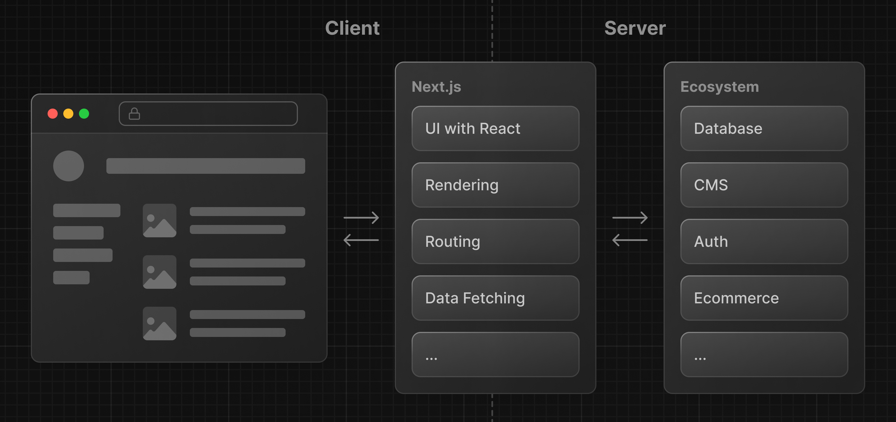

<div class="pt-3 text-sm opacity-70 text-center">

Next.js는 서버부터 클라이언트까지 걸쳐 있고, React만으로는 부족한 영역(라우팅·데이터 패칭·렌더링)을 채워줍니다.

</div>

<!--
[스크립트]
이 다이어그램은 Next.js와 React의 관계를 시각적으로 보여줍니다.

그림을 보시면, 왼쪽에 서버, 오른쪽에 클라이언트(브라우저)가 있습니다. Next.js는 이 두 영역에 걸쳐 있습니다. 서버에서의 렌더링, 데이터 패칭, API 처리부터, 클라이언트에서의 상호작용까지 모두 담당합니다.

React는 그 중에서 주로 클라이언트 쪽의 UI 부분을 담당합니다. Next.js가 React를 품고 있는 구조입니다.

비유를 들자면 — React는 망치나 드라이버 같은 도구이고, Next.js는 그 도구들이 잘 정리된 작업장입니다. 작업장(Next.js)에 들어가면 도구(React)가 이미 준비되어 있고, 작업대도 있고, 전기도 들어옵니다.

전환: Chapter 2 정리입니다.
시간: 2분
-->

---

## 📦 챕터 정리

<div class="bg-emerald-900/30 border border-emerald-500/40 rounded p-5 mt-8">

1. **React** = UI를 만들기 위한 **JavaScript 라이브러리**. 의견이 거의 없음.
2. **Next.js** = React 위의 **프레임워크**. 라우팅·데이터·캐싱 등 공통 기능을 제공.
3. 둘은 **경쟁 관계가 아니라 상호 보완** 관계.
4. React로 UI를 만들고, 필요해지면 Next.js 기능을 골라 쓰면 됩니다.

</div>

<!--
[스크립트]
Chapter 2 정리입니다.

이 챕터에서 배운 핵심 네 가지를 짚어드립니다.

첫째, **React = UI를 만들기 위한 JavaScript 라이브러리입니다. 의견이 거의 없습니다.** 즉, 강제하는 것이 적고 유연합니다. 둘째, **Next.js = React 위의 프레임워크입니다. 라우팅, 데이터, 캐싱 등 공통 기능을 제공합니다.** 셋째, **둘은 경쟁이 아니라 상호 보완 관계입니다.** 넷째, **React로 UI를 만들고, 필요해지면 Next.js 기능을 골라 쓰면 됩니다.** 처음부터 Next.js의 모든 기능을 알 필요는 없습니다.

전환: React가 UI를 만드는 원리를 이해하려면, 먼저 브라우저가 어떻게 화면을 그리는지 알아야 합니다. Chapter 3으로 넘어갑니다.
시간: 2분
-->

---
layout: section
---

# Chapter 3
## 브라우저는 UI를 어떻게 그리나

<div class="pt-4 text-sm opacity-60">

source: <code>https://nextjs.org/learn/react-foundations/rendering-ui</code>

</div>

<!--
[스크립트]
Chapter 3, 브라우저는 UI를 어떻게 그리나입니다.

React를 제대로 이해하려면 DOM을 이해해야 합니다. DOM을 이해하면 React가 왜 등장했는지가 자연스럽게 납득이 됩니다.

전환: 페이지가 어떻게 화면에 나타나는지 단계별로 봅니다.
시간: 30초
-->

---

## 페이지가 화면에 그려지기까지

<div class="pt-4 text-lg space-y-4">

1. 사용자가 페이지에 접속합니다.
2. 서버는 **HTML 파일**을 브라우저에 보냅니다.
3. 브라우저는 HTML을 읽어 **DOM(Document Object Model)** 을 만듭니다.
4. DOM을 화면에 렌더링하면 우리가 보는 UI가 됩니다.

</div>

<div class="pt-8 text-center text-base bg-blue-900/30 border border-blue-500/40 rounded p-3">

React를 이해하려면, 먼저 **DOM이 무엇인지** 이해해야 합니다.

</div>

<!--
[스크립트]
페이지가 화면에 그려지는 과정을 단계별로 설명합니다.

첫째, 사용자가 페이지에 접속합니다. 브라우저 주소창에 URL을 입력하거나 링크를 클릭합니다. 둘째, 서버는 HTML 파일을 브라우저에 보냅니다. 셋째, 브라우저는 그 HTML을 읽어 DOM을 만듭니다. 넷째, DOM을 화면에 렌더링하면 우리가 보는 UI가 됩니다.

하단의 파란색 박스 — "React를 이해하려면, 먼저 DOM이 무엇인지 이해해야 합니다." 이것이 이 챕터의 핵심 메시지입니다.

💡 여기서 잠깐 — 많은 분이 HTML과 DOM을 같은 것으로 생각합니다. 하지만 다음 슬라이드에서 보겠지만, HTML과 DOM은 다릅니다. 이 차이를 이해하는 것이 JavaScript와 React를 이해하는 데 매우 중요합니다.

전환: HTML과 DOM이 어떻게 다른지 그림으로 보겠습니다.
시간: 2분
-->

---

## HTML과 DOM

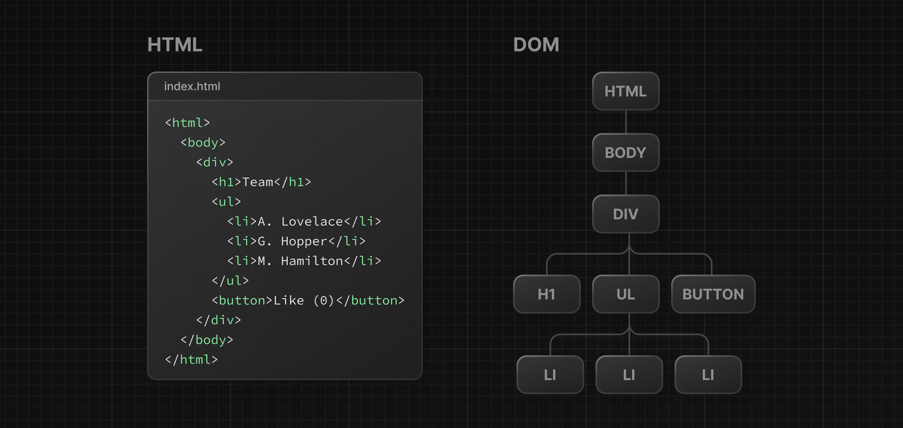

<div class="pt-3 text-sm opacity-70 text-center">

왼쪽은 HTML 소스, 오른쪽은 그 HTML로 만들어진 DOM 트리.

</div>

<!--
[스크립트]
화면에 이미지가 보입니다. 왼쪽에 HTML 코드, 오른쪽에 DOM 트리 구조가 나란히 있습니다.

왼쪽의 HTML을 보면 `<html>`, `<head>`, `<body>`, `<h1>`, `<p>` 같은 태그들이 들여쓰기로 계층 구조를 이루고 있습니다. 오른쪽의 DOM 트리도 동일한 계층 구조를 가집니다. Document가 최상위, 그 아래 html, html 아래 head와 body, body 아래 h1과 p...

HTML을 작성하면 브라우저가 그것을 읽어서 이런 트리 구조의 DOM으로 변환합니다. HTML은 텍스트 파일이고, DOM은 그것을 메모리에 올린 객체들의 트리입니다.

전환: DOM이 정확히 무엇인지 더 자세히 알아봅니다.
시간: 2분
-->

---

## DOM이란?

<div class="pt-4 space-y-4 text-lg">

- DOM은 HTML 요소들의 **객체 표현**입니다.
- 우리 코드와 사용자 인터페이스 사이의 **다리** 역할을 합니다.
- **트리 구조**를 가집니다 (부모·자식 관계).

</div>

<div class="pt-6 bg-slate-800/50 p-4 rounded">

### DOM으로 할 수 있는 일

- 사용자 이벤트를 듣고 응답하기 (click, input 등)
- 특정 요소를 **선택·추가·수정·삭제**
- 요소의 **스타일**과 **내용**을 바꾸기

</div>

<!--
[스크립트]
DOM이란 무엇인지 정의합니다.

세 가지가 핵심입니다. **DOM은 HTML 요소들의 객체 표현입니다.** HTML 파일의 텍스트를 JavaScript가 다룰 수 있는 객체로 변환한 것입니다. **우리 코드와 사용자 인터페이스 사이의 다리 역할을 합니다.** JavaScript가 화면의 내용을 읽거나 바꾸려면 이 DOM을 통해야 합니다. **트리 구조를 가집니다.** 부모와 자식 관계가 있습니다.

하단 박스를 보시면 DOM으로 할 수 있는 일들이 나열되어 있습니다. 사용자 이벤트를 듣고 응답하기, 특정 요소를 선택·추가·수정·삭제하기, 요소의 스타일과 내용을 바꾸기.

이것들이 바로 JavaScript가 웹 페이지를 "동적"으로 만드는 방법입니다. 클릭하면 뭔가 바뀌고, 폼을 제출하면 새로운 내용이 나타나는 것들이 모두 DOM 조작을 통해 이루어집니다.

[Q&A 대비]
Q: DOM 조작을 직접 배워야 하나요, 아니면 React를 쓰면 불필요한가요?
A: React를 쓰면 DOM을 직접 조작하는 코드는 거의 쓰지 않습니다. 하지만 DOM이 무엇인지 이해하고 있으면 React가 내부에서 무슨 일을 하는지 이해하는 데 큰 도움이 됩니다. 또한 React를 쓰더라도 특정 DOM 요소에 직접 접근해야 하는 경우가 있는데, 그때 `useRef`라는 훅을 씁니다.

전환: 이 DOM 트리가 실제 화면이 되는 과정을 보겠습니다.
시간: 3분
-->

---

## DOM이 화면이 되는 과정

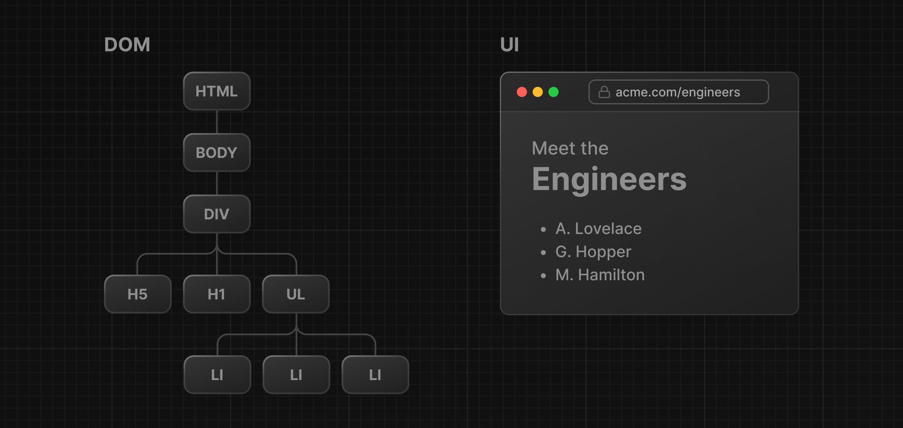

<div class="pt-3 text-sm opacity-70 text-center">

왼쪽 DOM 트리가 오른쪽 화면 UI로 렌더링됩니다.

</div>

<!--
[스크립트]
이 이미지도 두 개가 나란히 있습니다. 왼쪽에 DOM 트리, 오른쪽에 렌더링된 UI 화면입니다.

DOM 트리의 각 노드가 화면의 각 요소에 대응됩니다. DOM에 h1이 있으면 화면에 큰 제목이 나타나고, p가 있으면 단락이 나타납니다.

중요한 점은 — DOM이 바뀌면 화면도 바뀝니다. JavaScript로 DOM을 수정하면, 브라우저가 그것을 감지하고 화면을 다시 그립니다. 이것이 동적 웹 페이지의 원리입니다.

전환: Chapter 3 정리입니다.
시간: 1분
-->

---

## 📦 챕터 정리

<div class="bg-emerald-900/30 border border-emerald-500/40 rounded p-5 mt-8">

1. 서버는 **HTML**을 보내고, 브라우저는 그것으로 **DOM** 을 만듭니다.
2. DOM은 **HTML 요소의 객체 표현**이며 트리 구조입니다.
3. JavaScript는 DOM을 통해 UI를 **읽고 바꿀 수 있습니다.**
4. 다음 챕터에서는 실제로 JavaScript로 DOM을 조작해 봅니다.

</div>

<div class="pt-6 text-sm opacity-70">

🔗 더 알아보기: <code>developer.mozilla.org/docs/Web/API/Document_Object_Model/Introduction</code>

</div>

<!--
[스크립트]
Chapter 3 정리입니다.

서버는 HTML을 보내고, 브라우저는 그것으로 DOM을 만듭니다. DOM은 HTML 요소의 객체 표현이며 트리 구조입니다. JavaScript는 DOM을 통해 UI를 읽고 바꿀 수 있습니다.

다음 챕터에서는 실제로 JavaScript로 DOM을 조작해 봅니다. 코드를 직접 써보면서 "왜 이게 힘든지", 그리고 "왜 React가 필요한지"를 체감하게 됩니다.

전환: Chapter 4, 이제 직접 JavaScript로 DOM을 조작해 봅니다.
시간: 2분
-->

---
layout: section
---

# Chapter 4
## JavaScript로 UI 갱신하기

<div class="pt-4 text-sm opacity-60">

source: <code>https://nextjs.org/learn/react-foundations/updating-ui-with-javascript</code>

</div>

<!--
[스크립트]
Chapter 4, JavaScript로 UI를 갱신하는 방법입니다.

이 챕터는 이 코스에서 가장 중요한 챕터 중 하나입니다. JavaScript로 DOM을 직접 조작하는 방법을 배우고, 그것이 얼마나 번거로운지 경험합니다. 그 번거로움이 React가 존재하는 이유입니다.

전환: 아주 기본적인 HTML 파일부터 만들기 시작합니다.
시간: 30초
-->

---

## 첫 HTML 만들기

새 `index.html` 파일을 만들고 비어있는 div를 둡니다.

```html {all|3|3-4|all}
<html>
  <body>
    <div></div>
  </body>
</html>
```

<div class="pt-4 text-base opacity-80">

빈 캔버스. 여기에 JavaScript로 그림을 그려 보겠습니다.

</div>

<!--
[스크립트]
코드를 보겠습니다. 아주 단순한 HTML 파일입니다.

`<html>`, `<body>`, 그리고 비어있는 `<div>` 하나. 이게 전부입니다. 이 div가 우리가 JavaScript로 내용을 채울 빈 캔버스입니다.

브라우저에서 이 파일을 열면 아무것도 보이지 않습니다. 화면이 완전히 비어있습니다. 이제 JavaScript로 여기에 무언가를 그려 넣겠습니다.

전환: 이 div를 JavaScript에서 찾을 수 있도록 ID를 부여합니다.
시간: 1분
-->

---

## div에 id 붙이기

JavaScript에서 이 div를 찾을 수 있도록 **id**를 줍니다.

```html {3}
<html>
  <body>
    <div id="app"></div>
  </body>
</html>
```

<div class="pt-4 text-base opacity-80">

`id="app"`은 마치 그 요소에 이름표를 달아놓는 것과 같습니다.

</div>

<!--
[스크립트]
코드를 보시면 `<div id="app"></div>`으로 바뀌었습니다. `id="app"` 속성이 추가되었습니다.

이 id는 마치 그 요소에 이름표를 달아놓는 것과 같습니다. JavaScript에서 "app이라는 이름의 div를 찾아줘"라고 말할 수 있게 됩니다.

전환: 이제 JavaScript를 쓸 수 있는 영역을 만들겠습니다.
시간: 1분
-->

---

## script 태그로 JavaScript 영역 만들기

```html {4}
<html>
  <body>
    <div id="app"></div>
    <script type="text/javascript"></script>
  </body>
</html>
```

<div class="pt-4 text-base opacity-80">

`<script>` 태그 안에 JavaScript 코드를 작성할 수 있습니다.

</div>

<!--
[스크립트]
코드를 보시면 `<div id="app">` 아래에 `<script type="text/javascript"></script>` 태그가 추가되었습니다.

`<script>` 태그는 HTML 안에 JavaScript 코드를 작성하는 영역입니다. 이 태그 안에 우리가 원하는 JavaScript 코드를 넣을 수 있습니다.

💡 여기서 잠깐 — script 태그의 위치가 body 태그 마지막 부분에 있습니다. HTML 요소들이 이미 DOM에 로드된 다음에 JavaScript가 실행되도록 하기 위해서입니다. script를 head에 넣으면 DOM이 만들어지기 전에 JavaScript가 실행되어 요소를 찾을 수 없는 문제가 발생할 수 있습니다.

전환: 이제 JavaScript 코드로 div를 선택해 봅니다.
시간: 1분
-->

---

## getElementById로 요소 선택하기

```html {5}
<html>
  <body>
    <div id="app"></div>
    <script type="text/javascript">
      const app = document.getElementById('app');
    </script>
  </body>
</html>
```

<div class="pt-4 text-base opacity-80">

`document.getElementById('app')`은 "DOM 트리에서 id가 'app'인 요소를 찾아줘"라는 명령입니다.

</div>

<!--
[스크립트]
script 태그 안에 첫 줄의 JavaScript 코드가 추가되었습니다.

`const app = document.getElementById('app');` 이 코드를 읽어보겠습니다. `document`는 현재 페이지 전체를 나타내는 객체입니다. `.getElementById('app')`은 "id가 'app'인 요소를 찾아줘"라는 메서드 호출입니다. 결과를 `app`이라는 변수에 저장합니다.

이제 `app` 변수에는 우리가 만든 div 요소가 담겨있습니다. 이 변수를 통해 그 div를 자유롭게 조작할 수 있습니다.

전환: 이제 h1 요소를 만들어서 이 div 안에 넣어보겠습니다.
시간: 1분
-->

---

## h1 요소 만들고 끼워넣기

```html
<script type="text/javascript">
  // 1) id가 app인 div 선택
  const app = document.getElementById('app');

  // 2) 새 H1 요소 생성
  const header = document.createElement('h1');

  // 3) 텍스트 노드 만들기
  const text = 'Develop. Preview. Ship.';
  const headerContent = document.createTextNode(text);

  // 4) 텍스트를 H1 안에 넣기
  header.appendChild(headerContent);

  // 5) H1을 div 안에 넣기
  app.appendChild(header);
</script>
```

<div class="pt-2 text-sm opacity-70">

브라우저에서 열면 'Develop. Preview. Ship.' 텍스트가 보입니다.

</div>

<!--
[스크립트]
이제 본격적인 DOM 조작 코드입니다. 5단계로 진행됩니다.

코드를 한 줄씩 보겠습니다.

**1번 줄** — `const app = document.getElementById('app');` 앞에서 본 것처럼 id가 'app'인 div를 찾습니다.

**3번 줄** — `const header = document.createElement('h1');` `createElement` 메서드로 새로운 h1 요소를 만듭니다. 아직 DOM에 붙어있지 않은, 메모리에만 있는 새 요소입니다.

**5~6번 줄** — `const text = 'Develop. Preview. Ship.';` `const headerContent = document.createTextNode(text);` 텍스트 노드를 만듭니다. DOM에서 텍스트도 하나의 노드입니다.

**9번 줄** — `header.appendChild(headerContent);` 텍스트 노드를 h1 안에 넣습니다.

**12번 줄** — `app.appendChild(header);` h1을 div 안에 넣습니다. 이 순간 화면에 텍스트가 나타납니다.

이 코드를 실행하면 'Develop. Preview. Ship.'이라는 텍스트가 화면에 나타납니다.

💡 여기서 잠깐 — 이 코드가 좀 길고 복잡하게 느껴지시나요? 고작 h1 하나 추가하는데 이렇게 많은 코드가 필요합니다. 단계가 5개나 됩니다. 이것이 다음 슬라이드에서 이야기할 "명령형 프로그래밍"의 특징입니다.

[Q&A 대비]
Q: innerHTML을 쓰면 더 짧지 않나요? app.innerHTML = '<h1>Develop. Preview. Ship.</h1>'
A: 네, 그렇게 쓸 수도 있습니다. 하지만 innerHTML은 보안 문제(XSS 취약점)가 있고, 기존 DOM 내용을 전부 덮어쓰는 등의 부작용이 있습니다. 복잡한 앱에서는 innerHTML보다 createElement와 appendChild 패턴이 더 안전하고 제어하기 쉽습니다.

전환: 이 코드를 실행하고 나면 흥미로운 현상이 있습니다. HTML 파일에는 h1이 없는데 DOM에는 h1이 있습니다.
시간: 4분
-->

---

## HTML과 DOM이 다를 수 있다

<div class="pt-4 text-lg space-y-4">

- 브라우저 개발자 도구로 보면 `<h1>`이 들어 있습니다.
- 그런데 우리가 작성한 **HTML 소스에는 `<h1>`이 없습니다.**
- 왜?

</div>

<div class="pt-4 bg-slate-800/50 p-4 rounded">

**HTML** = 페이지의 **초기 상태** <br/>
**DOM** = JavaScript가 손댄 후의 **현재 상태**

</div>

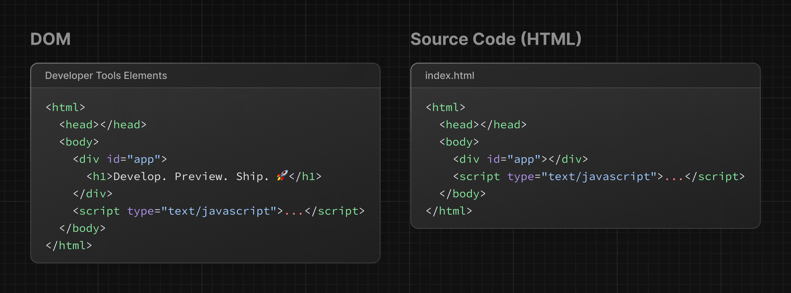

<!--
[스크립트]
이 슬라이드가 매우 중요합니다.

브라우저 개발자 도구로 보면 h1이 있습니다. 그런데 우리가 작성한 HTML 파일에는 h1이 없습니다. 왜 이런 현상이 생길까요?

하단의 박스를 보시면 답이 있습니다. **HTML은 페이지의 초기 상태**입니다. 파일을 처음 열 때의 상태입니다. **DOM은 JavaScript가 손댄 후의 현재 상태**입니다.

아래 이미지를 보시면, 왼쪽에 렌더링된 DOM에는 h1이 보이고, 오른쪽 소스 코드(HTML 파일)에는 h1이 없습니다. 이 차이가 "HTML과 DOM은 다를 수 있다"는 개념입니다.

이것이 왜 중요한가? 디버깅할 때 "HTML 파일에는 이렇게 되어 있는데 왜 화면은 다르지?"라는 상황이 생깁니다. JavaScript로 DOM을 수정했기 때문에 그런 것입니다.

전환: 이런 DOM 조작 방식의 특징에 이름이 있습니다. 바로 "명령형"입니다.
시간: 2분
-->

---

## 명령형 vs 선언형

<div class="grid grid-cols-2 gap-6 pt-6">

<div class="bg-slate-800/50 p-4 rounded">

### 🛠 명령형 (Imperative)
**"어떻게 할지"** 단계별로 알려주기.
- div를 찾아라
- h1을 만들어라
- 텍스트 노드를 만들어라
- 붙여라

방금 작성한 코드가 명령형입니다.

</div>

<div class="bg-slate-800/50 p-4 rounded">

### 🪄 선언형 (Declarative)
**"무엇을 보여줄지"** 만 선언.
- "이 div에 h1을 보여줘"
- 어떻게 만드는지는 신경 쓰지 않음

React가 선언형 라이브러리입니다.

</div>

</div>

<div class="pt-6 text-center text-lg">

🍕 명령형 = 셰프에게 피자 만드는 법을 단계별로 시키기<br/>
🍕 선언형 = 그냥 피자를 주문하기

</div>

<!--
[스크립트]
명령형과 선언형의 차이입니다. 프로그래밍의 두 가지 스타일입니다.

왼쪽 박스 — **명령형(Imperative)**입니다. "어떻게 할지" 단계별로 알려주는 방식입니다. 방금 우리가 작성한 코드가 명령형입니다. div를 찾아라, h1을 만들어라, 텍스트 노드를 만들어라, 붙여라 — 이렇게 단계별로 지시합니다.

오른쪽 박스 — **선언형(Declarative)**입니다. "무엇을 보여줄지"만 선언하는 방식입니다. 어떻게 만드는지는 신경 쓰지 않습니다. React가 선언형 라이브러리입니다.

하단의 피자 비유가 아주 직관적입니다. 명령형은 셰프에게 피자를 만드는 법을 단계별로 시키는 것과 같습니다. 밀가루 반죽을 200g 준비해라, 물 100ml를 넣어라, 5분간 치대어라... 선언형은 그냥 "페퍼로니 피자 주세요"라고 주문하는 것입니다.

React를 쓰면 "이 컴포넌트를 여기에 보여줘"라고만 하면 됩니다. 어떻게 DOM을 업데이트할지는 React가 알아서 처리합니다.

[Q&A 대비]
Q: 명령형이 더 세밀하게 제어할 수 있다면, 오히려 더 좋지 않나요?
A: 작은 앱에서는 그럴 수 있습니다. 하지만 앱이 커질수록 문제가 생깁니다. 여러 곳에서 동시에 DOM을 수정하면 어떤 상태가 맞는 상태인지 파악하기 어려워집니다. 그리고 어떤 코드가 어떤 요소를 수정하는지 추적하기 어려워집니다. 선언형은 이 복잡성을 React에게 위임합니다.

전환: Chapter 4 정리입니다.
시간: 3분
-->

---

## 📦 챕터 정리

<div class="bg-emerald-900/30 border border-emerald-500/40 rounded p-5 mt-8">

1. JavaScript로 DOM을 직접 조작하면 **장황(verbose)** 합니다.
2. **HTML(초기 상태) ≠ DOM(현재 상태)**.
3. 명령형은 "어떻게", 선언형은 "무엇을".
4. 앱이 커질수록 명령형 코드는 관리가 어려워집니다.
5. **React는 선언형** 으로 UI를 만들 수 있게 해줍니다.

</div>

<!--
[스크립트]
Chapter 4 정리입니다.

다섯 가지를 짚겠습니다. 첫째, JavaScript로 DOM을 직접 조작하면 코드가 장황합니다. 고작 h1 하나를 추가하는데 5단계가 필요했습니다. 둘째, HTML은 초기 상태, DOM은 JavaScript가 조작한 현재 상태입니다. 둘은 다를 수 있습니다. 셋째, 명령형은 "어떻게", 선언형은 "무엇을"입니다. 넷째, 앱이 커질수록 명령형 코드는 관리가 매우 어려워집니다. 다섯째, React는 선언형으로 UI를 만들 수 있게 해줍니다.

다음 챕터에서는 실제로 React를 사용해서 이 코드가 얼마나 간결해지는지 보겠습니다.

전환: Chapter 5, React를 실제로 시작해 봅니다.
시간: 2분
-->

---
layout: section
---

# Chapter 5
## React 시작하기

<div class="pt-4 text-sm opacity-60">

source: <code>https://nextjs.org/learn/react-foundations/getting-started-with-react</code>

</div>

<!--
[스크립트]
Chapter 5, React를 실제로 시작합니다.

앞 챕터에서 명령형 DOM 조작이 얼마나 번거로운지 봤습니다. 이제 React를 쓰면 얼마나 간결해지는지 직접 비교해 봅니다.

전환: React를 쓰려면 먼저 두 가지 스크립트를 불러와야 합니다.
시간: 30초
-->

---

## React 스크립트 두 개 불러오기

```html {4-5}
<html>
  <body>
    <div id="app"></div>
    <script src="https://unpkg.com/react@18/umd/react.development.js"></script>
    <script src="https://unpkg.com/react-dom@18/umd/react-dom.development.js"></script>
    <script type="text/javascript">
      // 기존 명령형 코드
    </script>
  </body>
</html>
```

<div class="pt-2 text-sm opacity-80">

- **react** — React의 핵심 라이브러리
- **react-dom** — 브라우저 DOM과 React를 연결해주는 패키지

</div>

<!--
[스크립트]
코드를 보시면, 4번째와 5번째 줄에 두 개의 script 태그가 추가되었습니다. 하이라이트된 줄들입니다.

첫 번째, `https://unpkg.com/react@18/umd/react.development.js` — 이것이 **react** 패키지입니다. React의 핵심 라이브러리로, 컴포넌트를 만들고 렌더링하는 핵심 기능이 들어있습니다.

두 번째, `https://unpkg.com/react-dom@18/umd/react-dom.development.js` — 이것이 **react-dom** 패키지입니다. React와 브라우저의 DOM을 연결해주는 패키지입니다. React가 만든 가상의 UI를 실제 브라우저 DOM에 반영하는 역할을 합니다.

💡 여기서 잠깐 — 왜 두 개로 분리되어 있을까요? React 코어는 브라우저뿐 아니라 모바일 앱(React Native)이나 서버에서도 쓸 수 있습니다. 브라우저 전용 기능은 react-dom에 분리해서 환경에 따라 교체할 수 있게 설계되었습니다.

전환: 이제 DOM 메서드 코드를 React 코드로 교체해 봅니다.
시간: 2분
-->

---

## DOM 메서드를 React로 교체

```html {6-8}
<html>
  <body>
    <div id="app"></div>
    <script src="https://unpkg.com/react@18/umd/react.development.js"></script>
    <script src="https://unpkg.com/react-dom@18/umd/react-dom.development.js"></script>
    <script>
      const app = document.getElementById('app');
      const root = ReactDOM.createRoot(app);
      root.render(<h1>Develop. Preview. Ship.</h1>);
    </script>
  </body>
</html>
```

<div class="pt-2 text-sm opacity-80">

- `ReactDOM.createRoot(app)` — id가 'app'인 요소를 React가 다룰 **루트**로 지정.
- `root.render(...)` — 그 안에 무엇을 그릴지 선언.

</div>

<!--
[스크립트]
코드를 보시면 하이라이트된 줄들, 6번에서 8번이 핵심입니다.

`const app = document.getElementById('app');` 이건 똑같습니다. div를 찾습니다. `const root = ReactDOM.createRoot(app);` `ReactDOM.createRoot(app)`으로 이 div를 React의 루트로 지정합니다. "여기를 React가 관리할 영역으로 쓸게"라는 선언입니다. `root.render(<h1>Develop. Preview. Ship.</h1>);` 이제 렌더링 명령입니다. "이 루트 안에 h1을 보여줘"라고 선언합니다.

이전 챕터의 명령형 코드와 비교해보시면 — 예전에는 createElement, createTextNode, appendChild를 각각 호출했습니다. 지금은 그냥 `<h1>...</h1>`이라고 쓰기만 하면 됩니다.

그런데 이 코드를 실행하면 문제가 생깁니다.

전환: 어떤 에러가 나는지 보겠습니다.
시간: 2분
-->

---

## 잠깐, 에러가 납니다

```text
Uncaught SyntaxError: expected expression, got '<'
```

<div class="pt-4 text-lg">

`<h1>...</h1>`은 JavaScript가 아니라 **JSX**라는 새로운 문법입니다.

</div>

<!--
[스크립트]
에러 메시지입니다. `Uncaught SyntaxError: expected expression, got '<'`

브라우저의 JavaScript 엔진이 `<h1>` 태그를 보고 "이게 뭐지? JavaScript 문법이 아닌데?"라고 에러를 냅니다.

왜냐하면 `<h1>...</h1>`은 표준 JavaScript가 아니기 때문입니다. 이것은 **JSX**라는 특별한 문법입니다.

전환: JSX가 무엇인지 알아봅니다.
시간: 1분
-->

---

## JSX란?

<div class="pt-4 text-lg space-y-4">

- JSX = JavaScript의 **확장 문법**
- HTML과 비슷하게 UI를 적을 수 있습니다.
- 3가지 [JSX 규칙](https://react.dev/learn/writing-markup-with-jsx#the-rules-of-jsx)만 지키면 끝.
- **단점**: 브라우저는 JSX를 모릅니다.

</div>

<div class="pt-6 bg-slate-800/50 p-4 rounded text-base">

해결: **Babel**로 JSX를 일반 JavaScript로 변환합니다.

</div>

<!--
[스크립트]
JSX가 무엇인지 설명합니다.

**JSX = JavaScript의 확장 문법**입니다. HTML과 비슷하게 UI를 적을 수 있습니다. React 개발자들이 만든 특별한 문법입니다.

세 가지 JSX 규칙만 지키면 됩니다. 하나의 루트 요소만 반환해야 한다는 것, 모든 태그는 닫아야 한다는 것, camelCase를 사용한다는 것입니다. 이 규칙들은 나중에 실습하면서 자연스럽게 익히게 됩니다.

단점이 있습니다 — 브라우저는 JSX를 모릅니다. 브라우저는 표준 JavaScript만 이해합니다.

해결책은 박스에 있습니다 — **Babel**로 JSX를 일반 JavaScript로 변환합니다. Babel은 컴파일러입니다. JSX 코드를 브라우저가 이해하는 JavaScript로 변환해줍니다.

[Q&A 대비]
Q: JSX 없이 React를 쓸 수 있나요?
A: 기술적으로 가능합니다. JSX는 내부적으로 `React.createElement()` 호출로 변환됩니다. `React.createElement('h1', null, 'Hello')` 이런 식으로 직접 쓸 수 있습니다. 하지만 UI가 복잡해질수록 JSX 없이는 코드가 엄청나게 길고 읽기 어려워집니다. 실무에서는 거의 모든 React 개발자가 JSX를 사용합니다.

전환: Babel을 추가해서 JSX를 쓸 수 있게 해봅니다.
시간: 2분
-->

---

## Babel을 추가해 JSX 활성화

```html {6-7,8}
<html>
  <body>
    <div id="app"></div>
    <script src="https://unpkg.com/react@18/umd/react.development.js"></script>
    <script src="https://unpkg.com/react-dom@18/umd/react-dom.development.js"></script>
    <!-- Babel Script -->
    <script src="https://unpkg.com/@babel/standalone/babel.min.js"></script>
    <script type="text/jsx">
      const domNode = document.getElementById('app');
      const root = ReactDOM.createRoot(domNode);
      root.render(<h1>Develop. Preview. Ship.</h1>);
    </script>
  </body>
</html>
```

<div class="pt-2 text-sm opacity-80">

`type="text/javascript"` → `type="text/jsx"` 로 바꿔야 Babel이 컴파일해 줍니다.

</div>

<!--
[스크립트]
코드를 보시면 두 가지 변화가 있습니다. 하이라이트된 6번째와 7번째 줄, 그리고 8번째 줄입니다.

6번줄 — `<!-- Babel Script -->` 주석과 함께 `<script src="https://unpkg.com/@babel/standalone/babel.min.js"></script>` Babel을 CDN에서 불러오는 스크립트 태그가 추가되었습니다.

8번째 줄 — `<script type="text/javascript">` 였던 것이 `<script type="text/jsx">`로 바뀌었습니다. 이 `type="text/jsx"` 덕분에 Babel이 "이 스크립트 태그 안의 코드는 JSX야, 내가 변환할게"라고 인식합니다.

이제 `<h1>Develop. Preview. Ship.</h1>` 코드가 에러 없이 동작합니다.

전환: 명령형 코드와 선언형 React 코드를 나란히 비교해 봅니다.
시간: 2분
-->

---

## 명령형 vs 선언형, 같은 결과 다른 코드

<div class="grid grid-cols-2 gap-4 text-sm">

<div>

**명령형 (Vanilla JS, 7 줄)**

```javascript
const app = document.getElementById('app');
const header = document.createElement('h1');
const text = 'Develop. Preview. Ship.';
const headerContent =
  document.createTextNode(text);
header.appendChild(headerContent);
app.appendChild(header);
```

</div>

<div>

**선언형 (React, 3 줄)**

```jsx
const app = document.getElementById('app');
const root = ReactDOM.createRoot(app);
root.render(<h1>Develop. Preview. Ship.</h1>);
```

</div>

</div>

<div class="pt-6 text-center text-lg">

같은 화면을 만드는데 **코드가 절반 이하** 입니다.

</div>

<!--
[스크립트]
이 슬라이드에서 React의 위력이 한눈에 보입니다.

왼쪽 — 명령형 Vanilla JS 코드입니다. 7줄입니다. getElementById, createElement, createTextNode, appendChild... 매 단계를 하나씩 명령합니다.

오른쪽 — 선언형 React 코드입니다. 3줄입니다. div를 찾고, 루트를 만들고, h1을 렌더링합니다.

둘 다 같은 화면을 만듭니다. 'Develop. Preview. Ship.'이라는 h1 텍스트가 화면에 나타납니다. 그런데 코드는 절반 이하입니다.

지금은 h1 하나를 추가하는 아주 단순한 예입니다. 현실의 앱은 수십, 수백 개의 요소가 있습니다. 그 차이가 얼마나 커지는지 상상해보시면 React가 왜 필요한지 이해가 되실 겁니다.

전환: React를 잘 쓰려면 몇 가지 JavaScript 개념을 알면 도움이 됩니다.
시간: 2분
-->

---

## React에 도움 되는 JS 개념

<div class="grid grid-cols-2 gap-x-6 gap-y-2 pt-4 text-base">

- 함수 / 화살표 함수 (Arrow Functions)
- 객체 (Objects)
- 배열 / 배열 메서드 (Arrays)
- 구조 분해 (Destructuring)

<div></div>

- 템플릿 리터럴 (Template literals)
- 삼항 연산자 (Ternary)
- ES Modules / import / export

</div>

<div class="pt-8 text-base opacity-80">

JS와 React를 같이 배워도 괜찮지만, JS 기본기가 탄탄할수록 React가 쉽게 느껴집니다. 너무 부담 갖지 마세요.

</div>

<!--
[스크립트]
React를 배우면서 함께 알면 도움이 되는 JavaScript 개념들입니다.

왼쪽 열 — 함수와 화살표 함수, 객체, 배열과 배열 메서드, 구조 분해. 오른쪽 열 — 템플릿 리터럴, 삼항 연산자, ES Modules·import·export.

처음부터 이것들을 다 완벽하게 알아야 한다는 부담은 갖지 마세요. 코스를 진행하면서 필요한 시점에 하나씩 나옵니다. 처음 보면 "저게 뭐지?" 할 수 있지만, 몇 번 보다 보면 자연스럽게 익숙해집니다.

만약 JavaScript 기초가 약하다고 느끼신다면, MDN 문서에서 이 개념들을 간단히 훑어보시는 것을 권합니다. 특히 화살표 함수, 구조 분해, ES 모듈은 React 코드에서 매우 자주 등장합니다.

전환: Chapter 5 정리입니다.
시간: 2분
-->

---

## 📦 챕터 정리

<div class="bg-emerald-900/30 border border-emerald-500/40 rounded p-5 mt-8">

1. **React + ReactDOM** 두 패키지를 CDN에서 불러옵니다.
2. `createRoot` + `render`로 어디에 무엇을 그릴지 선언합니다.
3. `<h1>...</h1>` 같은 문법은 **JSX**입니다.
4. JSX는 브라우저가 모르므로 **Babel**로 변환해야 합니다.
5. React 코드는 명령형 코드보다 훨씬 간결합니다.

</div>

<!--
[스크립트]
Chapter 5 정리입니다.

다섯 가지를 짚겠습니다. React와 ReactDOM 두 패키지를 CDN에서 불러옵니다. createRoot와 render로 어디에 무엇을 그릴지 선언합니다. `<h1>...</h1>` 같은 문법은 JSX입니다. JSX는 브라우저가 모르므로 Babel로 변환해야 합니다. 그리고 React 코드는 명령형 코드보다 훨씬 간결합니다.

다음 챕터부터는 React의 핵심 개념 세 가지, Component·Props·State를 배웁니다. 이것들을 이해하면 React 개발의 기초가 완성됩니다.

전환: Chapter 6, Component로 UI를 조립하는 방법입니다.
시간: 2분
-->

---
layout: section
---

# Chapter 6
## Component로 UI 조립하기

<div class="pt-4 text-sm opacity-60">

source: <code>https://nextjs.org/learn/react-foundations/building-ui-with-components</code>

</div>

<!--
[스크립트]
Chapter 6, Component로 UI를 조립하는 방법입니다.

이 챕터부터 React의 3대 핵심 개념을 배웁니다. Component가 그 첫 번째입니다.

전환: React의 3대 핵심 개념을 먼저 소개합니다.
시간: 30초
-->

---

## React의 3대 핵심 개념

<div class="pt-8 grid grid-cols-3 gap-6 text-center">

<div class="bg-blue-900/30 border border-blue-500/40 rounded p-6">

### 🧩
**Components**

UI를 만드는 작은 조각

</div>

<div class="bg-purple-900/30 border border-purple-500/40 rounded p-6">

### 📨
**Props**

부모가 자식에게 주는 데이터

</div>

<div class="bg-pink-900/30 border border-pink-500/40 rounded p-6">

### 💾
**State**

컴포넌트 안에 사는 변하는 값

</div>

</div>

<div class="pt-8 text-center text-base opacity-80">

이번 챕터부터 세 가지를 차례로 배웁니다.

</div>

<!--
[스크립트]
화면에 세 가지가 보입니다. 이것이 React의 3대 핵심 개념입니다.

왼쪽, 파란색 박스 — **Components**입니다. UI를 만드는 작은 조각입니다. 이 챕터에서 배웁니다. 가운데, 보라색 박스 — **Props**입니다. 부모가 자식에게 주는 데이터입니다. 다음 챕터에서 배웁니다. 오른쪽, 분홍색 박스 — **State**입니다. 컴포넌트 안에 사는 변하는 값입니다. 그 다음 챕터에서 배웁니다.

이 세 가지를 이해하면 React 개발의 80%는 이해한 것입니다. 차례로 하나씩 배웁니다.

전환: Component가 무엇인지부터 시작합니다.
시간: 2분
-->

---

## Component란? 🧱

<div class="pt-4 text-lg">

UI를 더 작은, **재사용 가능한 조각**으로 쪼갠 것.

</div>

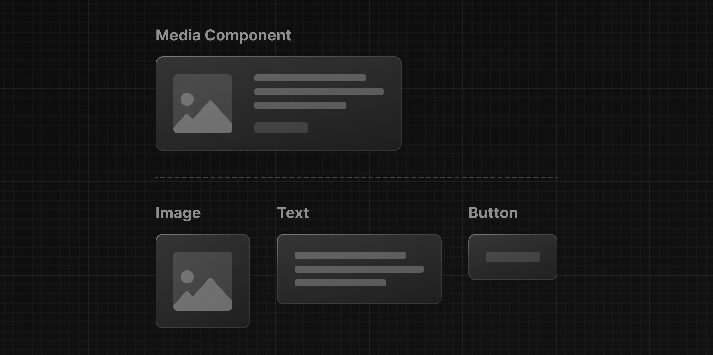

<div class="pt-3 text-sm opacity-70 text-center">

🎯 LEGO 블록처럼: 조각을 모으면 큰 구조가 되고, 한 조각만 갈아끼울 수도 있습니다.

</div>

<!--
[스크립트]
Component는 UI를 더 작은, 재사용 가능한 조각으로 쪼갠 것입니다.

화면에 이미지가 보입니다. 이미지 컴포넌트, 텍스트 컴포넌트, 버튼 컴포넌트 세 개가 모여서 하나의 Media 컴포넌트를 이루고 있습니다.

하단에 LEGO 비유가 있습니다. LEGO 블록과 매우 비슷합니다. 작은 블록(컴포넌트)들을 모으면 큰 구조(앱)가 됩니다. 그리고 한 블록만 갈아끼워도 나머지는 그대로입니다.

실제 앱을 생각해보시면 — 네이버 뉴스 페이지를 예로 들면, 헤더 컴포넌트, 검색창 컴포넌트, 뉴스 카드 컴포넌트, 사이드바 컴포넌트... 이렇게 쪼개서 만들 수 있습니다. 각 컴포넌트는 독립적이어서, 뉴스 카드 디자인을 바꿔도 헤더는 영향받지 않습니다.

전환: React에서 컴포넌트는 구체적으로 어떻게 만드는지 봅니다.
시간: 2분
-->

---

## React Component = 함수

```jsx {all|3|4|all}
const app = document.getElementById('app');

function header() {
}

const root = ReactDOM.createRoot(app);
root.render(<h1>Develop. Preview. Ship.</h1>);
```

<div class="pt-4 text-base opacity-80">

함수가 **UI 요소를 return** 하면 그것이 컴포넌트입니다.

</div>

<!--
[스크립트]
코드를 보겠습니다. 하이라이트가 세 단계로 변합니다.

처음에는 전체가 보입니다. 이전 챕터에서 쓴 코드 구조입니다. `getElementById`, 빈 `header` 함수, `createRoot`, `render`가 있습니다.

3번째 줄에 `function header() {}` — 지금은 아무것도 하지 않는 빈 함수입니다. 이 함수가 UI 요소를 return 하면 컴포넌트가 됩니다.

핵심 정의입니다 — "함수가 UI 요소를 return하면 그것이 컴포넌트입니다." 매우 단순합니다. 특별한 클래스나 인터페이스가 필요하지 않습니다. 그냥 JSX를 반환하는 함수입니다.

전환: 이 함수가 실제로 JSX를 반환하도록 만들겠습니다.
시간: 2분
-->

---

## return으로 JSX 돌려주기

```jsx {3-5}
const app = document.getElementById('app');

function header() {
  return <h1>Develop. Preview. Ship.</h1>;
}

const root = ReactDOM.createRoot(app);
root.render(<h1>Develop. Preview. Ship.</h1>);
```

<div class="pt-4 text-base opacity-80">

이 컴포넌트를 실제로 화면에 띄우려면 `root.render()`에 넘겨야 합니다.

</div>

<!--
[스크립트]
코드가 바뀌었습니다. 하이라이트된 3번에서 5번 줄을 보시면.

`function header() { return <h1>Develop. Preview. Ship.</h1>; }` 이제 함수가 JSX를 반환합니다. 이것이 React 컴포넌트입니다.

그런데 맨 마지막 줄을 보시면 `root.render(<h1>Develop. Preview. Ship.</h1>)` — 아직 이전 코드를 쓰고 있습니다. 우리가 만든 header 함수를 쓰지 않고 있습니다.

이 컴포넌트를 실제로 화면에 띄우려면 `root.render()`에 넘겨야 합니다. 그리고 여기서 중요한 두 가지 규칙이 있습니다.

전환: React 컴포넌트의 두 가지 규칙을 알아봅니다.
시간: 2분
-->

---

## ⚠️ 두 가지 규칙

<div class="grid grid-cols-2 gap-6 pt-4">

<div class="bg-slate-800/50 p-4 rounded">

### 1️⃣ 이름은 대문자로 시작
React는 소문자 이름을 HTML 태그로 인식합니다. 컴포넌트는 반드시 대문자로 시작해야 합니다.

```jsx {1}
function Header() {
  return <h1>Develop. Preview. Ship.</h1>;
}
```

</div>

<div class="bg-slate-800/50 p-4 rounded">

### 2️⃣ HTML 태그처럼 사용
컴포넌트는 `<Header />` 형태로 사용합니다.

```jsx {3}
const root = ReactDOM.createRoot(app);
root.render(<Header />);
```

</div>

</div>

<!--
[스크립트]
React 컴포넌트의 두 가지 규칙입니다. 이걸 어기면 에러가 납니다.

왼쪽 박스 — **규칙 1: 이름은 대문자로 시작**입니다. React는 소문자로 시작하는 이름을 HTML 태그로 인식합니다. 예를 들어 `<header>`는 HTML의 헤더 태그입니다. 반면 `<Header>`는 우리가 만든 React 컴포넌트입니다. 코드에서 `function Header()` — 대문자 H로 시작합니다.

오른쪽 박스 — **규칙 2: HTML 태그처럼 사용**합니다. 컴포넌트를 쓸 때는 `<Header />`처럼 자기 닫는 태그(self-closing tag)처럼 씁니다. 혹은 내용이 있으면 `<Header>내용</Header>` 형태로도 쓸 수 있습니다.

💡 여기서 잠깐 — 예전 코드에서는 `function header() {}` 소문자로 썼습니다. 지금은 `function Header() {}` 대문자로 바꿨습니다. 이 차이 하나가 에러와 정상 동작을 가릅니다. 컴포넌트 이름은 반드시 대문자입니다.

[Q&A 대비]
Q: 왜 소문자는 HTML 태그로 인식하나요?
A: React가 JSX를 컴파일할 때 만든 약속입니다. 소문자 태그는 내장 HTML 요소로, 대문자 태그는 사용자 정의 컴포넌트로 처리합니다. 이 약속 덕분에 `<div>`, `<span>`, `<h1>` 같은 일반 HTML 태그와 `<Header>`, `<Button>` 같은 커스텀 컴포넌트를 구분할 수 있습니다.

전환: 컴포넌트를 다른 컴포넌트 안에 넣는 방법을 봅니다.
시간: 3분
-->

---

## Component 중첩(nesting)

다른 컴포넌트 안에 컴포넌트를 넣을 수 있습니다.

```jsx {3-10}
function Header() {
  return <h1>Develop. Preview. Ship.</h1>;
}

function HomePage() {
  return (
    <div>
      {/* Nesting the Header component */}
      <Header />
    </div>
  );
}

const root = ReactDOM.createRoot(app);
root.render(<HomePage />);
```

<!--
[스크립트]
컴포넌트 중첩(nesting)입니다. 하이라이트된 3번에서 10번 줄을 봅니다.

`function HomePage() { return ( <div> {/* Nesting the Header component */} <Header /> </div> ); }` — HomePage라는 새 컴포넌트를 만들었습니다. 이 컴포넌트의 return 안에 `<Header />`가 들어있습니다.

이것이 컴포넌트 중첩입니다. HomePagei안에 Header가 있습니다. 중괄호와 슬래시로 이루어진 `{/* Nesting the Header component */}`는 JSX 주석입니다.

그리고 맨 마지막 줄 `root.render(<HomePage />)` — 이제 render에 HomePage를 넘깁니다. React는 HomePage를 렌더링할 때 그 안의 Header도 함께 렌더링합니다.

전환: 이런 중첩 구조가 트리를 이룹니다.
시간: 2분
-->

---

## 컴포넌트 트리

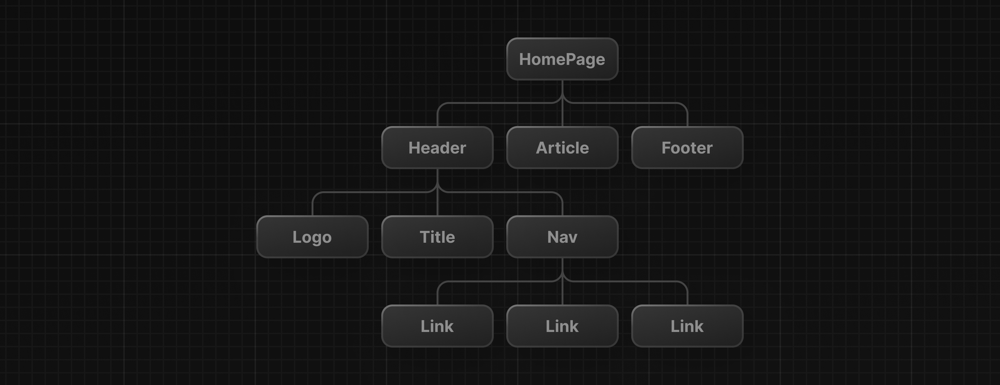

<div class="pt-4 text-base opacity-80 text-center">

`HomePage`가 최상위, 그 아래 `Header` · `Article` · `Footer`,<br/>
다시 그 아래 `Logo` · `Title` · `Navigation` ...

</div>

<!--
[스크립트]
컴포넌트 트리 이미지입니다.

화면을 보시면 트리 구조가 보입니다. 맨 위에 HomePage, 그 아래에 Header, Article, Footer가 있습니다. Header 아래에는 Logo, Title이, Footer 아래에는 Navigation이 있습니다.

이것이 실제 React 앱의 구조입니다. HTML의 DOM 트리처럼, React 앱도 컴포넌트 트리를 이룹니다. 부모-자식 관계가 있고, 부모가 자식을 포함합니다.

이 구조의 장점 — 특정 컴포넌트만 수정해도 나머지는 영향받지 않습니다. Navigation을 바꿔도 Header는 그대로입니다.

[Q&A 대비]
Q: 컴포넌트를 얼마나 작게 쪼개야 하나요?
A: 정해진 답은 없습니다. 일반적으로 단일 책임 원칙을 적용합니다 — 하나의 컴포넌트는 하나의 역할만 합니다. 또한 같은 UI가 여러 곳에 반복된다면 컴포넌트로 분리하는 것이 좋습니다. 너무 작게 쪼개면 파일이 너무 많아지고, 너무 크게 두면 재사용이 어렵습니다. 경험으로 감을 잡게 됩니다.

전환: Chapter 6 정리입니다.
시간: 2분
-->

---

## 📦 챕터 정리

<div class="bg-emerald-900/30 border border-emerald-500/40 rounded p-5 mt-8">

1. React 3대 핵심: **Components, Props, State**
2. Component는 **UI를 반환하는 함수**입니다.
3. 이름은 **대문자**로 시작, 사용은 `<Component />` 형태.
4. 컴포넌트를 중첩해 **트리** 를 만들 수 있고, 같은 컴포넌트를 여러 곳에서 재사용할 수 있습니다.

</div>

<!--
[스크립트]
Chapter 6 정리입니다.

네 가지를 짚겠습니다. React 3대 핵심은 Components, Props, State입니다. Component는 UI를 반환하는 함수입니다. 이름은 대문자로 시작하고, 사용은 `<Component />` 형태입니다. 그리고 컴포넌트를 중첩해 트리를 만들 수 있고, 같은 컴포넌트를 여러 곳에서 재사용할 수 있습니다.

다음 챕터에서는 두 번째 핵심 개념인 Props를 배웁니다. Props가 있어야 컴포넌트가 진짜 재사용 가능해집니다.

전환: Chapter 7, Props로 데이터를 전달하는 방법입니다.
시간: 2분
-->

---
layout: section
---

# Chapter 7
## Props로 데이터 전달하기

<div class="pt-4 text-sm opacity-60">

source: <code>https://nextjs.org/learn/react-foundations/displaying-data-with-props</code>

</div>

<!--
[스크립트]
Chapter 7, Props로 데이터를 전달하는 방법입니다.

앞 챕터에서 컴포넌트를 재사용 가능한 조각이라고 했습니다. 그런데 지금까지 만든 Header 컴포넌트는 항상 "Develop. Preview. Ship."이라는 같은 텍스트만 보여줍니다. 진짜 재사용이 가능하려면 다른 데이터를 넣을 수 있어야 합니다. 그것이 Props입니다.

전환: Props가 왜 필요한지 직관적으로 보여드립니다.
시간: 30초
-->

---

## 떠올려 봅시다 — 버튼 한 컴포넌트, 세 가지 모습

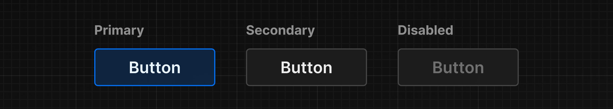

<div class="pt-4 text-base opacity-80 text-center">

같은 `<Button />` 컴포넌트로 Primary / Secondary / Disabled 세 모습을 만들고 싶다면?<br/>
**props** 가 그 답입니다.

</div>

<!--
[스크립트]
이미지를 보시면 버튼 컴포넌트 세 가지 변형이 있습니다. Primary 버튼, Secondary 버튼, Disabled 버튼.

만약 props가 없다면 세 개의 서로 다른 컴포넌트를 각각 만들어야 합니다. PrimaryButton, SecondaryButton, DisabledButton... 하지만 같은 버튼인데 색상과 상태만 다릅니다. props를 쓰면 하나의 컴포넌트로 세 가지를 모두 표현할 수 있습니다.

하단 텍스트 — "props가 그 답입니다." 이 개념을 이해하면 컴포넌트의 진짜 재사용성이 열립니다.

전환: 같은 컴포넌트를 다른 데이터로 쓰는 문제를 구체적으로 봅니다.
시간: 2분
-->

---

## 같은 컴포넌트를 다른 데이터로 쓰고 싶다

<div class="pt-4 text-lg">

`<Header />`를 두 번 쓰면 두 개 모두 같은 텍스트만 보여집니다. 이래서는 재사용이 안 되겠죠?

</div>

```jsx
function Header() {
  return <h1>Develop. Preview. Ship.</h1>;
}

function HomePage() {
  return (
    <div>
      <Header />
      <Header />
    </div>
  );
}
```

<div class="pt-4 text-base opacity-80">

HTML의 ``처럼, 컴포넌트에도 **속성** 을 넘길 방법이 필요합니다. 이게 **props** 입니다.

</div>

<!--
[스크립트]
코드를 봅니다. `<Header />`를 두 번 쓰면 두 개 모두 "Develop. Preview. Ship."이라는 같은 텍스트만 보입니다.

이래서는 재사용이 안 됩니다. 첫 번째 헤더에는 "React"를, 두 번째 헤더에는 "Next.js"를 보여주고 싶으면 어떻게 할까요?

하단 설명이 힌트입니다 — HTML의 `` 처럼, 컴포넌트에도 속성을 넘길 방법이 필요합니다. img 태그에 src 속성을 주면 다른 이미지를 보여주는 것처럼, 컴포넌트에도 그런 속성을 줄 수 있습니다. 그것이 **props**입니다.

전환: props를 전달하는 방법을 봅니다.
시간: 2분
-->

---

## props 전달하기

부모 컴포넌트에서 props를 HTML 속성처럼 넘깁니다.

```jsx {4}
function HomePage() {
  return (
    <div>
      <Header title="React" />
    </div>
  );
}
```

자식 컴포넌트는 **첫 번째 함수 파라미터**로 받습니다.

```jsx {1}
function Header(props) {
  return <h1>Develop. Preview. Ship.</h1>;
}
```

<!--
[스크립트]
props를 전달하고 받는 방법입니다. 두 단계입니다.

위 코드를 보시면, `<Header title="React" />` — HTML 속성처럼 title이라는 속성을 넘깁니다. 부모 컴포넌트 HomePage에서 자식 컴포넌트 Header로 "React"라는 값을 title이라는 이름으로 넘깁니다.

아래 코드를 보시면, `function Header(props)` — 함수의 첫 번째 파라미터로 받습니다. 이름은 관례상 `props`라고 하지만 어떤 이름이든 됩니다.

아직 반환하는 JSX는 바뀌지 않았습니다 — `return <h1>Develop. Preview. Ship.</h1>` 다음 단계에서 props를 실제로 사용합니다.

전환: props 안에 무엇이 들어있는지 확인해 봅니다.
시간: 2분
-->

---

## props는 객체다

```jsx {2}
function Header(props) {
  console.log(props); // { title: "React" }
  return <h1>Develop. Preview. Ship.</h1>;
}
```

<div class="pt-4 text-base opacity-80">

`props`는 객체이고, 그 안에 우리가 넘긴 속성들이 들어 있습니다.

</div>

<!--
[스크립트]
코드를 보시면 `console.log(props)` — props를 콘솔에 찍었습니다.

결과는 주석으로 보이듯 `{ title: "React" }` — 객체입니다. 우리가 전달한 `title="React"` 속성이 객체 안에 들어있습니다.

props는 객체입니다. 우리가 부모에서 전달한 모든 속성들이 이 객체 안에 모여 있습니다. 여러 개의 props를 전달하면 객체에 여러 개의 키-값 쌍이 들어있습니다.

전환: 객체에서 값을 꺼내는 깔끔한 방법, 구조 분해를 봅니다.
시간: 2분
-->

---

## 객체 구조 분해(destructuring)로 깔끔하게

```jsx {1}
function Header({ title }) {
  console.log(title); // "React"
  return <h1>Develop. Preview. Ship.</h1>;
}
```

<div class="pt-4 text-base opacity-80">

`{ title }`은 "props 객체에서 title 속성만 꺼낸다"는 뜻입니다. 자주 쓰는 패턴.

</div>

<!--
[스크립트]
코드가 바뀌었습니다. `function Header(props)` 였던 것이 `function Header({ title })`로 바뀌었습니다.

`{ title }`은 JavaScript 구조 분해(destructuring) 문법입니다. "이 파라미터로 들어오는 객체에서 title이라는 속성만 꺼내서 title이라는 변수로 쓸게"라는 뜻입니다.

결과 — `console.log(title)` — 이제 props 객체 전체가 아니라 title 값 "React"만 바로 쓸 수 있습니다.

이 패턴은 React 코드에서 가장 자주 쓰이는 패턴입니다. 거의 모든 컴포넌트에서 이 방식으로 props를 받습니다. 처음엔 낯설어도 금방 익숙해집니다.

전환: 이제 JSX 안에서 이 title 변수를 화면에 보여주는 방법을 봅니다.
시간: 2분
-->

---

## JSX에서 변수 보여주기 — 중괄호 `{}`

<div class="grid grid-cols-2 gap-4">

<div>

❌ 그냥 쓰면 문자열로 인식

```jsx
function Header({ title }) {
  return <h1>title</h1>;
}
```

화면: `title`

</div>

<div>

✅ 중괄호로 감싸면 JS 표현식

```jsx
function Header({ title }) {
  return <h1>{title}</h1>;
}
```

화면: `React`

</div>

</div>

<div class="pt-6 text-center text-base">

중괄호 `{}` = JSX에서 **JavaScript 영역으로 들어가는 문**

</div>

<!--
[스크립트]
매우 중요한 개념입니다. JSX 안에서 변수를 보여주는 방법입니다.

왼쪽을 보시면 — `<h1>title</h1>` — 그냥 title을 쓰면 화면에 "title"이라는 문자열이 그대로 나옵니다. 변수가 아닌 텍스트로 인식합니다.

오른쪽 — `<h1>{title}</h1>` — 중괄호로 감싸면 JavaScript 표현식으로 인식합니다. title 변수의 값인 "React"가 화면에 나옵니다.

하단 설명이 정확합니다 — 중괄호 `{}`는 JSX에서 JavaScript 영역으로 들어가는 문입니다. 중괄호 안에서는 JavaScript 코드를 쓸 수 있습니다. 중괄호 밖은 JSX, 중괄호 안은 JavaScript입니다.

[Q&A 대비]
Q: 중괄호 안에 모든 JavaScript 코드를 쓸 수 있나요?
A: 표현식(expression)만 가능합니다. 표현식은 값을 반환하는 코드입니다. 변수, 함수 호출, 삼항 연산자, 산술 연산 등이 됩니다. 반면 if/else 문이나 for 루프 같은 구문(statement)은 직접 넣을 수 없습니다. 조건부 렌더링을 위해서는 삼항 연산자나 && 연산자를 씁니다.

전환: 중괄호 안에서 할 수 있는 표현식 4가지를 봅니다.
시간: 3분
-->

---

## 중괄호 안에서 가능한 표현식 4가지

<div class="grid grid-cols-2 gap-4 text-sm">

<div class="bg-slate-800/50 p-3 rounded">

**1. 객체 속성 (도트 표기법)**

```jsx
function Header(props) {
  return <h1>{props.title}</h1>;
}
```

</div>

<div class="bg-slate-800/50 p-3 rounded">

**2. 템플릿 리터럴**

```jsx
function Header({ title }) {
  return <h1>{`Cool ${title}`}</h1>;
}
```

</div>

<div class="bg-slate-800/50 p-3 rounded">

**3. 함수 호출 결과**

```jsx
function createTitle(title) {
  if (title) return title;
  else return 'Default title';
}

function Header({ title }) {
  return <h1>{createTitle(title)}</h1>;
}
```

</div>

<div class="bg-slate-800/50 p-3 rounded">

**4. 삼항 연산자**

```jsx
function Header({ title }) {
  return (
    <h1>{title ? title : 'Default Title'}</h1>
  );
}
```

</div>

</div>

<!--
[스크립트]
중괄호 안에서 쓸 수 있는 표현식 4가지입니다.

**첫 번째, 객체 속성 도트 표기법**입니다. `{props.title}` — props 객체에서 title 속성을 가져옵니다. 구조 분해를 쓰지 않을 때 이 방식을 씁니다.

**두 번째, 템플릿 리터럴**입니다. `` {`Cool ${title}`} `` — 백틱(`)으로 감싸고 달러 중괄호 안에 변수를 넣습니다. "Cool React"처럼 문자열과 변수를 조합할 때 씁니다.

**세 번째, 함수 호출 결과**입니다. `{createTitle(title)}` — 함수를 호출하고 그 반환값을 보여줍니다. createTitle 함수를 보시면 — title이 있으면 title을, 없으면 'Default title'을 반환합니다.

**네 번째, 삼항 연산자**입니다. `{title ? title : 'Default Title'}` — 가장 많이 쓰이는 패턴입니다. "title이 있으면 title을, 없으면 'Default Title'을 보여줘"라는 뜻입니다.

[Q&A 대비]
Q: 삼항 연산자와 함수를 통한 처리 중 어느 것이 더 좋은가요?
A: 로직이 단순하면 삼항 연산자가 깔끔합니다. 로직이 복잡하거나 조건이 3개 이상이면 함수로 분리하는 것이 가독성이 좋습니다. 삼항 연산자를 중첩하면 읽기 어려워집니다.

전환: 배열을 리스트로 렌더링하는 방법을 봅니다.
시간: 3분
-->

---

## 리스트 렌더링 — array.map()

```jsx {3,7-9}
function HomePage() {
  const names = ['Ada Lovelace', 'Grace Hopper', 'Margaret Hamilton'];

  return (
    <div>
      <Header title="Develop. Preview. Ship." />
      <ul>
        {names.map((name) => (
          <li>{name}</li>
        ))}
      </ul>
    </div>
  );
}
```

<div class="pt-2 text-base opacity-80">

JSX 안에서 `.map()`을 사용해 배열을 `<li>` 리스트로 변환.

</div>

<!--
[스크립트]
리스트 렌더링입니다. 하이라이트된 3번과 7~9번 줄을 봅니다.

3번 줄 — `const names = ['Ada Lovelace', 'Grace Hopper', 'Margaret Hamilton'];` 세 사람의 이름이 배열로 있습니다.

7~9번 줄 — `{names.map((name) => (<li>{name}</li>))}` — 중괄호 안에서 `.map()`을 호출합니다. `.map()`은 배열의 각 요소를 변환해서 새 배열을 만드는 메서드입니다. 각 name에 대해 `<li>{name}</li>`를 반환합니다.

결과적으로 세 개의 `<li>` 요소가 만들어집니다.

이 패턴, `배열.map((요소) => <JSX요소 />)` — React에서 리스트를 렌더링할 때 사용하는 표준 패턴입니다. 꼭 기억해 두세요.

전환: 이 코드를 실행하면 경고가 나옵니다.
시간: 2분
-->

---

## ⚠️ key prop을 잊지 마세요

<div class="pt-2 text-base">

위 코드를 그대로 실행하면 React가 경고합니다.

</div>

```text
Warning: Each child in a list should have a unique "key" prop.
```

```jsx {4}
<ul>
  {names.map((name) => (
    <li key={name}>{name}</li>
  ))}
</ul>
```

<div class="pt-3 text-sm opacity-80">

React는 리스트의 각 항목을 구분할 **고유한 key** 가 필요합니다. 가능하면 ID처럼 절대 변하지 않는 값을 쓰세요.

</div>

<!--
[스크립트]
key prop을 잊지 마세요. 이 경고는 React 개발을 하면 정말 자주 보게 됩니다.

경고 메시지 — "Warning: Each child in a list should have a unique 'key' prop." 리스트의 각 자식은 고유한 key prop이 있어야 합니다.

아래 코드를 보시면 `<li key={name}>{name}</li>` — key prop이 추가되었습니다. 각 li에 key로 name을 줬습니다.

왜 key가 필요한가? React가 리스트를 업데이트할 때 어떤 항목이 추가되고, 변경되고, 삭제되었는지 효율적으로 파악하기 위해 key를 씁니다. key가 없으면 React가 전체 리스트를 다시 렌더링해야 합니다.

💡 여기서 잠깐 — 배열의 인덱스를 key로 쓰면 안 되나요? `key={index}` — 피하는 것이 좋습니다. 리스트의 순서가 바뀌면 인덱스가 바뀌어 버리고, 그러면 key의 의미가 없어집니다. DB에서 가져온 데이터라면 ID를 key로 쓰세요.

[Q&A 대비]
Q: key를 쓰지 않으면 어떤 일이 생기나요?
A: 경고만 나오고 동작은 합니다. 하지만 성능 문제와 예상치 못한 버그가 생길 수 있습니다. 특히 리스트 항목이 추가되거나 순서가 바뀔 때 UI가 이상하게 동작할 수 있습니다.

전환: 데이터가 어느 방향으로 흐르는지 봅니다.
시간: 3분
-->

---

## 단방향 데이터 흐름

<div class="pt-6 text-center text-2xl">

부모 → 자식<br/>
**Props**<br/><br/>
🚫 자식이 부모의 props를 직접 바꿀 수는 없습니다.

</div>

<div class="pt-8 text-base opacity-80">

이걸 React에서는 **one-way data flow** 라고 부릅니다. 데이터의 출처가 명확해지고, 디버깅이 쉬워집니다.

</div>

<!--
[스크립트]
단방향 데이터 흐름입니다. React의 매우 중요한 특성입니다.

화면을 보시면 — 부모 → 자식, Props. 그리고 자식이 부모의 props를 직접 바꿀 수는 없습니다.

React는 데이터가 한 방향으로만 흐릅니다. 부모에서 자식으로만 흐릅니다. 자식에서 부모 방향으로는 props를 통해 데이터가 직접 올라가지 않습니다. 자식이 부모에게 영향을 줄 때는 부모가 함수를 props로 내려주고, 자식이 그 함수를 호출하는 방식을 씁니다.

이것을 **one-way data flow**라고 합니다. 이 특성 덕분에 데이터의 출처가 명확하고 디버깅이 쉬워집니다. "이 데이터가 어디서 왔지?"를 추적할 때 부모 방향으로만 따라가면 됩니다.

[Q&A 대비]
Q: Angular나 Vue는 양방향 데이터 바인딩이 있는데 React는 왜 단방향인가요?
A: 양방향 바인딩은 편리하지만 데이터 흐름이 복잡해져 버그 찾기가 어려워질 수 있습니다. React는 예측 가능성을 위해 단방향을 선택했습니다. 대신 React에서는 상태 끌어올리기(lifting state up)라는 패턴을 씁니다. 자식에서 이벤트가 발생하면 부모가 props로 내려준 콜백 함수를 호출해서 부모의 state를 업데이트합니다.

전환: Chapter 7 정리입니다.
시간: 3분
-->

---

## 📦 챕터 정리

<div class="bg-emerald-900/30 border border-emerald-500/40 rounded p-5 mt-8">

1. **Props**는 부모가 자식에게 주는 데이터입니다.
2. props는 객체이며, **구조 분해** 로 깔끔히 받을 수 있습니다.
3. JSX 안에서 JS 표현식을 쓰려면 **중괄호 `{}`**.
4. 리스트는 `array.map()`으로 렌더링하고, 각 항목에 **`key`** 를 줘야 합니다.
5. 데이터는 **부모 → 자식** 한 방향으로 흐릅니다.

</div>

<!--
[스크립트]
Chapter 7 정리입니다.

다섯 가지입니다. Props는 부모가 자식에게 주는 데이터입니다. props는 객체이며 구조 분해로 깔끔히 받을 수 있습니다. JSX 안에서 JS 표현식을 쓰려면 중괄호 `{}`입니다. 리스트는 `array.map()`으로 렌더링하고 각 항목에 key를 줘야 합니다. 데이터는 부모에서 자식으로, 한 방향으로만 흐릅니다.

다음 챕터는 세 번째 핵심 개념, State입니다. State를 이해하면 버튼 클릭, 폼 입력, 카운터 증가 같은 상호작용을 만들 수 있습니다.

전환: Chapter 8, State로 상호작용을 추가합니다.
시간: 2분
-->

---
layout: section
---

# Chapter 8
## State로 상호작용 추가하기

<div class="pt-4 text-sm opacity-60">

source: <code>https://nextjs.org/learn/react-foundations/updating-state</code>

</div>

<!--
[스크립트]
Chapter 8, State로 상호작용을 추가하는 방법입니다.

Props는 부모가 주는 정적인 데이터였습니다. State는 컴포넌트 안에서 시간에 따라 변하는 값입니다. 버튼 클릭 횟수, 체크박스 체크 여부, 입력창의 텍스트 — 이런 것들이 State로 관리됩니다.

전환: Like 버튼을 만들면서 State를 배웁니다.
시간: 30초
-->

---

## "Like" 버튼 만들기

`HomePage` 안에 버튼을 추가합니다.

```jsx {12}
function HomePage() {
  const names = ['Ada Lovelace', 'Grace Hopper', 'Margaret Hamilton'];

  return (
    <div>
      <Header title="Develop. Preview. Ship." />
      <ul>
        {names.map((name) => (
          <li key={name}>{name}</li>
        ))}
      </ul>
      <button>Like</button>
    </div>
  );
}
```

<!--
[스크립트]
코드를 보시면 12번째 줄이 하이라이트됩니다. `<button>Like</button>` — 버튼 하나를 추가했습니다.

아직 이 버튼은 클릭해도 아무것도 안 합니다. 이제 이 버튼을 클릭할 때 반응하도록 만들겠습니다.

전환: 버튼 클릭 이벤트를 듣는 방법을 봅니다.
시간: 1분
-->

---

## 이벤트 듣기 — onClick

```jsx
<button onClick={}>Like</button>
```

<div class="pt-4 text-base opacity-80">

React에서는 이벤트 이름을 **camelCase** 로 씁니다: `onClick`, `onChange`, `onSubmit` ...

</div>

<!--
[스크립트]
`<button onClick={}>Like</button>` — 버튼에 onClick 속성이 추가되었습니다. 아직 중괄호 안이 비어있습니다.

React에서는 이벤트 이름을 camelCase로 씁니다. HTML에서는 `onclick` (소문자)이지만, React에서는 `onClick` (O 대문자)입니다. 마찬가지로 `onchange` → `onChange`, `onsubmit` → `onSubmit`입니다.

onClick은 "클릭됐을 때 실행할 것"입니다. 중괄호 안에 함수를 넣어야 합니다.

전환: 실제 핸들러 함수를 만들어서 연결합니다.
시간: 1분
-->

---

## 핸들러 함수 만들기

```jsx {3-5,11}
function HomePage() {
  // ...
  function handleClick() {
    console.log('increment like count');
  }

  return (
    <div>
      {/* ... */}
      <button onClick={handleClick}>Like</button>
    </div>
  );
}
```

<div class="pt-4 text-base opacity-80">

`onClick={handleClick}` — 함수를 **호출하지 않고 참조만 전달** 합니다 (`handleClick()`이 아님).

</div>

<!--
[스크립트]
코드를 보겠습니다. 하이라이트된 3~5번 줄과 11번 줄입니다.

3~5번 줄 — `function handleClick() { console.log('increment like count'); }` — handleClick 함수를 정의합니다. 지금은 콘솔에 메시지만 출력합니다.

11번 줄 — `<button onClick={handleClick}>Like</button>` — onClick에 handleClick 함수를 전달합니다.

여기서 매우 중요한 점! `onClick={handleClick}` — 괄호가 없습니다. `onClick={handleClick()}` — 이렇게 괄호를 붙이면 안 됩니다.

괄호 없이 — 함수의 참조를 전달합니다. "클릭될 때 이 함수를 실행해"라는 뜻입니다. 괄호 있이 — 지금 당장 함수를 실행하고 그 결과를 전달합니다. 렌더링될 때마다 handleClick이 실행되어 버립니다.

[Q&A 대비]
Q: 화살표 함수로 쓰면 어떻게 되나요? onClick={() => handleClick()}
A: 이것도 맞습니다. 화살표 함수로 감싸면 클릭될 때 화살표 함수가 실행되고, 그 안에서 handleClick()이 호출됩니다. 이 방식은 파라미터를 전달할 때 유용합니다. 예: `onClick={() => handleClick(item.id)}`

전환: 콘솔에 출력만 하면 화면이 바뀌지 않습니다. 화면을 바꾸려면 state가 필요합니다.
시간: 3분
-->

---

## React Hooks 그리고 state

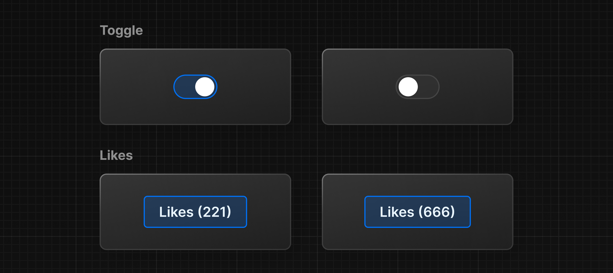

<div class="pt-4 text-lg">

- **Hook** = 컴포넌트에 추가 기능을 더해주는 함수
- **State** = 시간에 따라 변하는 정보 (사용자 상호작용으로 바뀌는 값)
- 가장 자주 쓰는 hook: **`useState`**

</div>

<!--
[스크립트]
이미지를 먼저 보겠습니다. 왼쪽에 토글 버튼, 오른쪽에 좋아요 카운터 두 가지 예시가 있습니다.

토글 버튼 — 선택됨/선택안됨 두 상태가 있습니다. 이것이 state입니다. 좋아요 버튼 — 클릭할 때마다 숫자가 올라갑니다. 이것도 state입니다.

이제 세 가지 핵심 개념을 봅니다. **Hook**은 컴포넌트에 추가 기능을 더해주는 특별한 함수입니다. 이름이 항상 `use`로 시작합니다. **State**는 시간에 따라 변하는 정보입니다. 사용자의 상호작용으로 바뀌는 값입니다. 그리고 가장 자주 쓰는 hook은 **useState**입니다.

💡 여기서 잠깐 — Hook의 규칙이 두 가지 있습니다. 컴포넌트의 최상위 레벨에서만 Hook을 호출해야 합니다. if/for 안에서 호출하면 안 됩니다. 그리고 React 함수 컴포넌트 안에서만 Hook을 쓸 수 있습니다. 일반 JavaScript 함수에서는 안 됩니다.

전환: useState를 실제로 사용하는 방법을 봅니다.
시간: 2분
-->

---

## useState 사용하기

```jsx
const [] = React.useState();
```

<div class="pt-3 text-base opacity-80">

`useState`는 배열을 반환합니다. 배열 구조 분해로 받습니다.

</div>

```jsx {1}
const [likes] = React.useState();
```

<div class="pt-3 text-base opacity-80">

첫 번째 = **현재 값**. 이름은 자유롭게 (의미가 잘 드러나게).

</div>

```jsx {1}
const [likes, setLikes] = React.useState();
```

<div class="pt-3 text-base opacity-80">

두 번째 = **값을 바꾸는 함수**. 관례로 `set` + 이름.

</div>

<!--
[스크립트]
useState 사용법입니다. 단계별로 설명합니다.

첫 단계 — `const [] = React.useState();` useState는 배열을 반환합니다. 배열 구조 분해로 받습니다.

두 번째 단계 — `const [likes] = React.useState();` 첫 번째 요소가 현재 값입니다. 이름은 자유롭게 붙이면 됩니다. likes, count, isChecked 등 의미가 잘 드러나는 이름을 씁니다.

세 번째 단계 — `const [likes, setLikes] = React.useState();` 두 번째 요소가 값을 바꾸는 함수입니다. 관례로 `set` + 첫 번째 변수 이름을 씁니다. likes → setLikes, count → setCount, isChecked → setIsChecked.

이 패턴 `const [값, 값변경함수] = useState(초기값)` — 완전히 외워두세요. React에서 가장 많이 쓰는 패턴 중 하나입니다.

전환: 초기값을 설정하고 화면에 표시하는 방법을 봅니다.
시간: 3분
-->

---

## 초기값 + 화면에 표시

```jsx {3,9}
function HomePage() {
  // ...
  const [likes, setLikes] = React.useState(0);

  return (
    // ...
    <button onClick={handleClick}>Like ({likes})</button>
  );
}
```

<div class="pt-4 text-base opacity-80">

`useState(0)` — 초기값을 0으로 설정. 화면에는 `Like (0)`으로 보입니다.

</div>

<!--
[스크립트]
코드를 보겠습니다. 하이라이트된 3번과 9번 줄입니다.

3번 줄 — `const [likes, setLikes] = React.useState(0);` 초기값으로 0을 전달합니다. 처음 렌더링될 때 likes는 0입니다.

9번 줄 — `<button onClick={handleClick}>Like ({likes})</button>` — `{likes}`로 현재 값을 표시합니다. 처음에는 "Like (0)"이 보입니다.

전환: 이제 클릭할 때 state를 실제로 업데이트해 봅니다.
시간: 2분
-->

---

## 클릭 시 state 업데이트

```jsx {4-6}
function HomePage() {
  const [likes, setLikes] = React.useState(0);

  function handleClick() {
    setLikes(likes + 1);
  }

  return (
    <div>
      <button onClick={handleClick}>Likes ({likes})</button>
    </div>
  );
}
```

<div class="pt-4 text-base opacity-80">

`setLikes(likes + 1)` — React에게 "likes를 새 값으로 바꿔달라"고 알려주면, React가 알아서 화면을 다시 그립니다.

</div>

<!--
[스크립트]
이것이 완성된 코드입니다. 하이라이트된 4~6번 줄을 봅니다.

`function handleClick() { setLikes(likes + 1); }` — handleClick 함수 안에서 setLikes를 호출합니다. `setLikes(likes + 1)` — likes의 현재 값에 1을 더한 값을 새 값으로 설정합니다.

setLikes를 호출하면 두 가지 일이 벌어집니다. 첫째, React가 내부적으로 likes의 값을 새 값으로 업데이트합니다. 둘째, 이 컴포넌트를 다시 렌더링합니다. 그래서 화면에 새 likes 값이 보입니다.

💡 여기서 잠깐 — "그냥 likes++로 하면 안 되나요?" 안 됩니다. React는 setLikes 같은 setter 함수를 통해서만 state 변경을 감지합니다. `likes++` 처럼 직접 변수를 수정하면 React가 변경을 모르고 화면을 다시 그리지 않습니다. 반드시 setter 함수를 통해야 합니다.

[Q&A 대비]
Q: state를 직접 수정하면 어떻게 되나요?
A: 화면이 업데이트되지 않습니다. React는 setLikes 같은 setter가 호출될 때만 "state가 바뀌었으니 다시 렌더링하겠다"고 결정합니다. 직접 수정하면 React가 모릅니다. 더 나쁜 경우 예상치 못한 버그가 생길 수 있습니다.

전환: Props와 State를 나란히 비교해 봅니다.
시간: 3분
-->

---

## Props vs State

<div class="grid grid-cols-2 gap-6 pt-4">

<div class="bg-slate-800/50 p-4 rounded">

### 📨 Props
- **밖에서 들어옴** (부모가 전달)
- 자식 입장에서는 읽기 전용
- 부모가 다시 전달해야 바뀜

</div>

<div class="bg-slate-800/50 p-4 rounded">

### 💾 State
- **컴포넌트 안에서 만듦** (`useState`)
- 컴포넌트가 직접 갱신
- 자식에 props로 내려줄 수는 있음

</div>

</div>

<div class="pt-6 text-base opacity-80 bg-blue-900/30 border border-blue-500/40 rounded p-3">

⚖️ **원칙**: state를 **업데이트하는 로직** 은 state가 정의된 곳에 두세요.

</div>

<!--
[스크립트]
Props와 State를 나란히 비교합니다.

왼쪽 박스 — **Props**입니다. 밖에서 들어옵니다, 부모가 전달합니다. 자식 입장에서는 읽기 전용입니다. 자식이 바꾸려면 부모가 다시 전달해야 합니다.

오른쪽 박스 — **State**입니다. 컴포넌트 안에서 만듭니다, useState를 씁니다. 컴포넌트가 직접 갱신합니다. 자식에 props로 내려줄 수는 있습니다.

하단 파란 박스 — 원칙입니다. "state를 업데이트하는 로직은 state가 정의된 곳에 두세요." 만약 자식이 state를 props로 받아서 보여주고, 자식에서 버튼을 클릭해서 state를 바꾸고 싶다면, setter 함수도 props로 내려줘야 합니다. 업데이트 로직은 state가 있는 부모에 있어야 합니다.

[Q&A 대비]
Q: 언제 state를 쓰고, 언제 props를 쓰나요?
A: 기본 판단 기준은 이렇습니다. 컴포넌트 외부에서 전달되는 데이터라면 props, 컴포넌트 내부에서 변하는 데이터라면 state입니다. 또한 여러 컴포넌트가 같은 데이터를 공유해야 한다면, 가장 가까운 공통 부모로 state를 끌어올리는 패턴을 씁니다.

전환: Chapter 8 정리입니다.
시간: 3분
-->

---

## 📦 챕터 정리

<div class="bg-emerald-900/30 border border-emerald-500/40 rounded p-5 mt-8">

1. React 이벤트 이름은 **camelCase** (`onClick`, `onChange` ...).
2. 핸들러는 함수 참조로 전달: `onClick={handleClick}`.
3. **State** 는 시간에 따라 변하는 값. **`useState(initial)`** 로 만듭니다.
4. setter(`setLikes`)를 호출하면 React가 화면을 다시 그립니다.
5. **Props는 부모가, State는 자기 자신이** 관리합니다.

</div>

<!--
[스크립트]
Chapter 8 정리입니다.

다섯 가지입니다. React 이벤트 이름은 camelCase입니다. 핸들러는 함수 참조로 전달합니다. State는 시간에 따라 변하는 값이고 useState로 만듭니다. setter를 호출하면 React가 화면을 다시 그립니다. Props는 부모가, State는 자기 자신이 관리합니다.

이것으로 React의 3대 핵심 개념 Component, Props, State를 모두 배웠습니다. 이 세 가지로 이미 꽤 많은 것을 만들 수 있습니다. 다음 챕터에서는 이 React 앱을 Next.js로 마이그레이션합니다.

전환: Chapter 9, React에서 Next.js로 이동합니다.
시간: 2분
-->

---
layout: section
---

# Chapter 9
## React에서 Next.js로

<div class="pt-4 text-sm opacity-60">

source: <code>https://nextjs.org/learn/react-foundations/from-react-to-nextjs</code>

</div>

<!--
[스크립트]
Chapter 9, React에서 Next.js로 이동합니다.

지금까지 만든 React 앱을 바탕으로, 왜 Next.js가 필요한지 그 이유를 짚고, 다음 단계를 안내합니다.

전환: 지금까지 만든 앱 코드 전체를 한번에 보겠습니다.
시간: 30초
-->

---

## 지금까지 만든 앱

```jsx
<html>
  <body>
    <div id="app"></div>

    <script src="https://unpkg.com/react@18/umd/react.development.js"></script>
    <script src="https://unpkg.com/react-dom@18/umd/react-dom.development.js"></script>
    <script src="https://unpkg.com/@babel/standalone/babel.min.js"></script>

    <script type="text/jsx">
      const app = document.getElementById("app")

      function Header({ title }) {
        return <h1>{title ? title : "Default title"}</h1>
      }

      function HomePage() {
        const names = ["Ada Lovelace", "Grace Hopper", "Margaret Hamilton"]
        const [likes, setLikes] = React.useState(0)

        function handleClick() { setLikes(likes + 1) }

        return (
          <div>
            <Header title="Develop. Preview. Ship." />
            <ul>{names.map((n) => (<li key={n}>{n}</li>))}</ul>
            <button onClick={handleClick}>Like ({likes})</button>
          </div>
        )
      }

      const root = ReactDOM.createRoot(app);
      root.render(<HomePage />);
    </script>
  </body>
</html>
```

<!--
[스크립트]
지금까지 만든 앱의 전체 코드입니다.

코드를 보시면 HTML 파일 안에 React 코드가 들어있습니다. script 태그로 react, react-dom, babel을 CDN에서 불러오고, type="text/jsx"인 script 안에 우리 React 코드가 있습니다.

Header 컴포넌트 — title prop을 받아서 h1으로 보여줍니다. HomePage 컴포넌트 — 이름 배열, likes state, handleClick 함수, 그리고 JSX 렌더링이 있습니다. 마지막으로 createRoot와 render로 전체를 화면에 띄웁니다.

이것이 우리가 12챕터 동안 만들어온 앱의 완성본입니다. 지금까지 배운 모든 개념이 여기 다 들어있습니다.

그런데 이 방식에는 한계가 있습니다.

전환: React만으로 풀스택 앱을 만들 때의 한계를 봅니다.
시간: 2분
-->

---

## React만으로 풀스택 앱을 만들면?

<div class="grid grid-cols-2 gap-6 pt-6">

<div class="bg-slate-800/50 p-4 rounded">

### 직접 결정·구축할 것들
- 라우팅
- 데이터 패칭
- 빌드·번들링
- 코드 스플리팅
- SEO/SSR
- ...

</div>

<div class="bg-slate-800/50 p-4 rounded">

### 게다가
- **Server / Client Components** 같은 새 기능은 **프레임워크가 필요** 합니다.
- 모든 걸 직접 조립하면 시간·실수·유지보수 비용이 큽니다.

</div>

</div>

<!--
[스크립트]
React만으로 풀스택 앱을 만들 때의 한계입니다.

왼쪽 박스를 보시면 직접 결정하고 구축해야 할 것들 — 라우팅, 데이터 패칭, 빌드·번들링, 코드 스플리팅, SEO·SSR... 이것들을 직접 라이브러리를 골라서 조립해야 합니다.

오른쪽 박스 — 게다가 Server/Client Components 같은 새 React 기능은 프레임워크가 필요합니다. React 팀이 만든 이 새로운 기능들은 Next.js 같은 프레임워크 환경에서만 제대로 동작합니다. 그리고 모든 걸 직접 조립하면 시간, 실수, 유지보수 비용이 큽니다.

전환: 그래서 Next.js가 필요합니다.
시간: 2분
-->

---

## 그래서 Next.js

<div class="pt-8 text-xl text-center">

Next.js는 셋업·설정을 대신 해주고,<br/>
React 앱에 필요한 공통 기능을 제공합니다.

</div>

<div class="pt-12 text-center text-base opacity-80">

다음 챕터에서 우리 앱을 Next.js로 옮기고,<br/>
Server / Client Components의 차이를 배웁니다.

</div>

<!--
[스크립트]
그래서 Next.js가 필요합니다.

Next.js는 셋업과 설정을 대신 해주고, React 앱에 필요한 공통 기능을 제공합니다. 라우팅, 데이터 패칭, 빌드 도구, TypeScript 지원... 이것들이 처음부터 포함되어 있습니다.

하단 텍스트 — 다음 챕터에서 우리 앱을 Next.js로 옮기고, Server/Client Components의 차이를 배웁니다. 이것이 Part 1의 마지막 두 챕터입니다.

전환: 이제 실제로 Next.js를 설치하겠습니다.
시간: 1분
-->

---
layout: section
---

# Chapter 10
## Next.js 설치하기

<div class="pt-4 text-sm opacity-60">

source: <code>https://nextjs.org/learn/react-foundations/installation</code>

</div>

---

## 사전 준비

<div class="grid grid-cols-2 gap-6 pt-6">

<div class="bg-slate-800/50 p-4 rounded">

### Node.js
- **20.9 이상** 필요
- 다운로드: [nodejs.org](https://nodejs.org/en)

</div>

<div class="bg-slate-800/50 p-4 rounded">

### 빈 package.json
같은 디렉토리에 `package.json` 파일을 만들고 빈 객체를 넣어둡니다.

```json
{}
```

</div>

</div>

---

## React + Next.js 설치

```bash
npm install react@latest react-dom@latest next@latest
```

설치가 끝나면 `package.json`이 다음처럼 됩니다.

```json
{
  "dependencies": {
    "next": "^14.0.3",
    "react": "^18.3.1",
    "react-dom": "^18.3.1"
  }
}
```

<div class="pt-4 text-sm opacity-80">

`package-lock.json`도 자동 생성됩니다 (정확한 버전 정보).

</div>

---

## index.html에서 지울 코드

<div class="grid grid-cols-2 gap-3 text-sm pt-4">

<div class="bg-red-900/20 p-3 rounded">

❌ `<html>` / `<body>` 태그

</div>

<div class="bg-red-900/20 p-3 rounded">

❌ `<div id="app">`

</div>

<div class="bg-red-900/20 p-3 rounded">

❌ react / react-dom 스크립트 (npm으로 설치했음)

</div>

<div class="bg-red-900/20 p-3 rounded">

❌ Babel 스크립트 (Next.js 컴파일러가 처리)

</div>

<div class="bg-red-900/20 p-3 rounded">

❌ `<script type="text/jsx">` 태그

</div>

<div class="bg-red-900/20 p-3 rounded">

❌ `getElementById` / `createRoot` 호출

</div>

<div class="bg-red-900/20 p-3 rounded col-span-2">

❌ `React.useState` → `useState` (`React.` 접두사 제거)

</div>

</div>

---

## useState import 추가

```javascript
import { useState } from 'react';
```

<div class="pt-6 text-base opacity-80">

이제 파일에는 JSX 코드만 남았습니다. 확장자를 `.html` → `.js` 또는 `.jsx`로 바꿉니다.

</div>

---

## 정리된 코드

```jsx
import { useState } from 'react';

function Header({ title }) {
  return <h1>{title ? title : 'Default title'}</h1>;
}

function HomePage() {
  const names = ['Ada Lovelace', 'Grace Hopper', 'Margaret Hamilton'];
  const [likes, setLikes] = useState(0);

  function handleClick() {
    setLikes(likes + 1);
  }

  return (
    <div>
      <Header title="Develop. Preview. Ship." />
      <ul>
        {names.map((name) => (
          <li key={name}>{name}</li>
        ))}
      </ul>
      <button onClick={handleClick}>Like ({likes})</button>
    </div>
  );
}
```

---

## 파일 시스템 라우팅

<div class="pt-4 text-lg space-y-3">

Next.js는 **폴더와 파일** 로 라우트를 만듭니다 (코드로 정의 X).

</div>

<div class="pt-4 grid grid-cols-3 gap-3 text-sm">

<div class="bg-slate-800/50 p-3 rounded">

**1**

`app` 폴더 만들기

</div>

<div class="bg-slate-800/50 p-3 rounded">

**2**

`index.js`를 `app/page.js`로 옮기기

</div>

<div class="bg-slate-800/50 p-3 rounded">

**3**

`HomePage` 컴포넌트에 `export default` 추가

</div>

</div>

```jsx {4}
import { useState } from 'react';

function Header({ title }) { /* ... */ }

export default function HomePage() {
  // ...
}
```

---

## 개발 서버 실행

`package.json`에 dev 스크립트 추가:

```json {2-4}
{
  "scripts": {
    "dev": "next dev"
  },
  "dependencies": { /* ... */ }
}
```

터미널에서:

```bash
npm run dev
```

<div class="pt-4 text-base opacity-80">

`localhost:3000`을 열어봅니다.

</div>

---

## 어, 에러가 납니다 😬

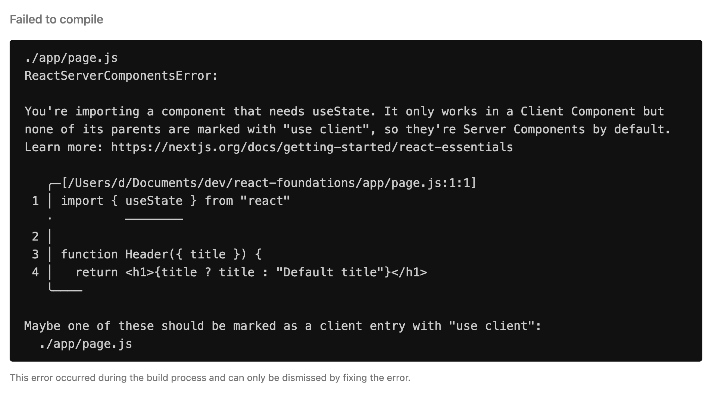

<div class="pt-4 text-base opacity-80">

Next.js는 기본적으로 **React Server Components** 를 사용합니다.<br/>
서버 컴포넌트는 `useState`를 지원하지 않기 때문에 발생한 에러입니다.

</div>

---

## 자동 생성된 layout.js

```jsx
export const metadata = {
  title: 'Next.js',
  description: 'Generated by Next.js',
};

export default function RootLayout({ children }) {
  return (
    <html lang="en">
      <body>{children}</body>
    </html>
  );
}
```

<div class="pt-3 text-base opacity-80">

`app/layout.js`는 모든 페이지가 공유하는 **루트 레이아웃** 입니다 (다음 챕터에서 자세히).

</div>

---

## 📦 챕터 정리

<div class="bg-emerald-900/30 border border-emerald-500/40 rounded p-5 mt-8">

1. `npm install react react-dom next` 한 번으로 설치 끝.
2. Next.js는 **파일·폴더 = 라우트** (file-system routing).
3. `app/page.js`가 `/` 경로의 메인 페이지.
4. `npm run dev`로 개발 서버 시작.
5. 처음 띄우면 **Server Component vs `useState`** 에러를 만납니다 — 다음 챕터에서 해결.

</div>

---
layout: section
---

# Chapter 11
## Server와 Client Components

<div class="pt-4 text-sm opacity-60">

source: <code>https://nextjs.org/learn/react-foundations/server-and-client-components</code>

</div>

---

## 서버와 클라이언트, 무엇이 다른가

<div class="grid grid-cols-2 gap-6 pt-6">

<div class="bg-slate-800/50 p-4 rounded">

### 🖥 Client (브라우저)
사용자 디바이스에서 동작.
- 서버에 요청을 보냄
- 응답을 받아 화면으로 만듦
- 클릭·입력 같은 상호작용 처리

</div>

<div class="bg-slate-800/50 p-4 rounded">

### 🗄 Server (데이터센터)
원격 컴퓨터.
- 코드와 데이터를 저장
- 요청을 받아 연산
- 응답을 돌려줌

</div>

</div>

<div class="pt-6 text-base opacity-80">

각 환경마다 **잘 하는 일** 과 **할 수 없는 일** 이 다릅니다. 모든 것을 한 곳에서 처리할 필요가 없습니다.

</div>

---

## Network Boundary 다이어그램

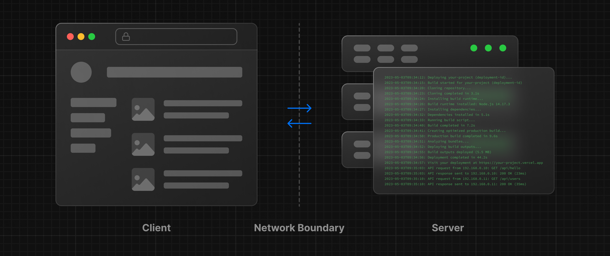

<div class="pt-4 text-base opacity-80 text-center">

**Network Boundary** = 두 환경을 가르는 개념적 경계선.

</div>

---

## 컴포넌트 트리 안에서 경계 정하기

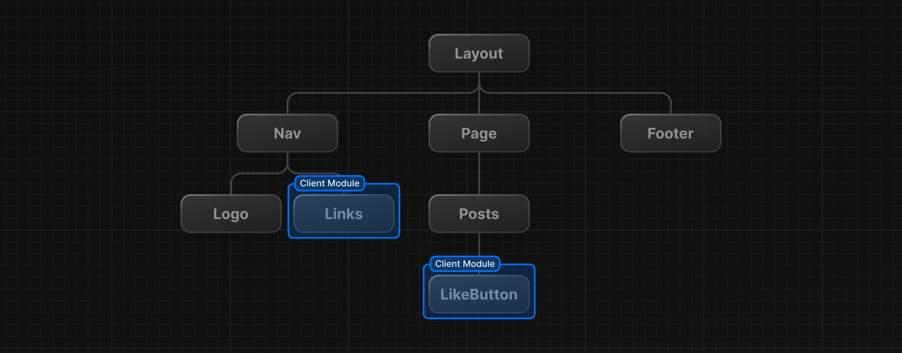

<div class="pt-3 text-sm opacity-70 text-center">

`Posts`는 서버에서 데이터 가져와 렌더링, `LikeButton`만 클라이언트에서 상호작용 처리.

</div>

---

## RSC Payload는 어떻게 전달되나

<div class="pt-4 text-base space-y-3">

서버 컴포넌트가 렌더링되면, **React Server Component Payload(RSC)** 라는 특별한 형식으로 클라이언트에 전송됩니다. RSC payload에는:

</div>

<div class="grid grid-cols-2 gap-4 pt-4">

<div class="bg-slate-800/50 p-3 rounded">

**1.** 서버 컴포넌트의 렌더 결과

</div>

<div class="bg-slate-800/50 p-3 rounded">

**2.** 클라이언트 컴포넌트가 들어갈 자리(holes) + JS 파일 참조

</div>

</div>

<div class="pt-6 text-base opacity-80">

React가 이 두 정보를 합쳐 DOM을 업데이트합니다.

</div>

---

## Next.js의 기본은 Server Components

<div class="pt-6 text-lg">

Next.js는 모든 컴포넌트를 기본적으로 **Server Component** 로 취급합니다. 별도 설정 없이 성능 최적화를 누릴 수 있습니다.

</div>

<div class="pt-6 bg-red-900/20 border border-red-500/40 rounded p-4">

⚠️ 그래서 지난 챕터에서 우리 `useState` 코드가 에러가 났던 것입니다 — 서버 컴포넌트에서는 클라이언트 전용 훅을 쓸 수 없으니까요.

</div>

---

## 해결: `'use client'` 디렉티브

<div class="pt-4 text-lg">

특정 컴포넌트를 클라이언트에서 실행하려면 파일 맨 위에 `'use client'` 한 줄을 적습니다.

</div>

```jsx {1}
// /app/like-button.js
'use client';

import { useState } from 'react';

export default function LikeButton() {
  const [likes, setLikes] = useState(0);

  function handleClick() {
    setLikes(likes + 1);
  }

  return <button onClick={handleClick}>Like ({likes})</button>;
}
```

---

## page.js에서 LikeButton 사용

```jsx
// /app/page.js
import LikeButton from './like-button';

function Header({ title }) {
  return <h1>{title ? title : 'Default title'}</h1>;
}

export default function HomePage() {
  const names = ['Ada Lovelace', 'Grace Hopper', 'Margaret Hamilton'];

  return (
    <div>
      <Header title="Develop. Preview. Ship." />
      <ul>
        {names.map((name) => (
          <li key={name}>{name}</li>
        ))}
      </ul>
      <LikeButton />
    </div>
  );
}
```

<div class="pt-2 text-sm opacity-80">

`HomePage`는 여전히 서버 컴포넌트, `LikeButton`만 클라이언트 컴포넌트.

</div>

---

## 📦 챕터 정리

<div class="bg-emerald-900/30 border border-emerald-500/40 rounded p-5 mt-8">

1. **Server**와 **Client** 환경은 잘하는 일이 다릅니다.
2. **Network Boundary**를 컴포넌트 트리 안에서 직접 정할 수 있습니다.
3. Next.js는 기본적으로 **Server Components**를 사용합니다 (성능 ↑).
4. 클라이언트 전용 훅(`useState`, `useEffect` 등)을 쓰려면 파일 맨 위에 **`'use client'`**.
5. 서버 컴포넌트가 만든 결과는 **RSC Payload** 로 클라이언트에 전송됩니다.

</div>

---
layout: section
---

# Chapter 12
## React Foundations 마무리

<div class="pt-4 text-sm opacity-60">

source: <code>https://nextjs.org/learn/react-foundations/next-steps</code>

</div>

---

## 🎉 첫 번째 코스 완료

<div class="pt-8 text-xl text-center">

축하합니다!<br/>
첫 Next.js 앱을 직접 만들어 봤습니다.

</div>

<div class="pt-12 text-lg text-center opacity-80">

작은 HTML 페이지 → 명령형 JS → React 컴포넌트 → Next.js 앱<br/>
그 모든 단계를 거쳐 왔습니다.

</div>

---

## 다음 단계

<div class="grid grid-cols-2 gap-6 pt-8">

<div class="bg-slate-800/50 p-4 rounded">

### 📘 React 더 깊이
React 공식 문서에 인터랙티브 샌드박스가 있습니다. 이것저것 만져보면서 익히는 게 가장 좋습니다.

🔗 <code>react.dev</code>

</div>

<div class="bg-slate-800/50 p-4 rounded">

### 🚀 Next.js 본격 시작
다음 Part에서 우리는 **금융 대시보드** 를 만들면서 Next.js의 핵심 기능을 모두 경험합니다.

</div>

</div>

---
layout: section
---

# Part 2
## Next.js로 풀스택 앱 만들기

<div class="pt-4 text-sm opacity-70">

App Router · 17 챕터 · 금융 대시보드 프로젝트

</div>

<!--
[스크립트]
Part 2, Next.js로 풀스택 앱 만들기입니다. App Router 방식으로 17챕터에 걸쳐 금융 대시보드 프로젝트를 만듭니다.

Part 1에서 React의 기초를 완전히 익혔습니다. 이제 그것을 바탕으로 실제 서비스에 가까운 앱을 만들 차례입니다.

전환: 왜 이 파트가 필요한지 먼저 이야기합니다.
시간: 30초
-->

---

## 💡 왜 이 Part가 필요한가

<div class="pt-6 space-y-4 text-lg">

- React만으로는 UI를 만드는 도구밖에 안 됩니다.
- 실제 서비스를 운영하려면 **인증, 데이터베이스, 검색·페이지네이션, 에러 처리, 배포** 가 모두 필요합니다.
- 이 Part는 **실제 비슷한 서비스(금융 대시보드)** 를 한 단계씩 직접 만들어 보면서, Next.js의 핵심 기능을 모두 경험하게 합니다.

</div>

<div class="absolute bottom-8 left-12 right-12 text-base bg-emerald-900/30 border border-emerald-500/40 rounded p-3">

🎯 **이 Part를 마치면**: 본인의 사이드 프로젝트나 사내 도구를 Next.js로 처음부터 끝까지 만들 수 있습니다.

</div>

<!--
[스크립트]
왜 이 파트가 필요한가입니다.

React만으로는 UI를 만드는 도구밖에 안 됩니다. 실제 서비스를 운영하려면 인증, 데이터베이스 연결, 검색과 페이지네이션, 에러 처리, 배포가 모두 필요합니다. 이것들을 React만으로는 직접 다 구축해야 합니다.

이 파트는 실제 서비스와 비슷한 금융 대시보드를 한 단계씩 직접 만들어 보면서, Next.js의 핵심 기능을 모두 경험하게 합니다.

하단의 목표 — 이 파트를 마치면 본인의 사이드 프로젝트나 사내 도구를 Next.js로 처음부터 끝까지 만들 수 있습니다.

전환: Chapter 1, 코스 안내부터 시작합니다.
시간: 2분
-->

---
layout: section
---

# Chapter 1
## Dashboard App 코스 안내

<div class="pt-4 text-sm opacity-60">

source: <code>https://nextjs.org/learn/dashboard-app</code>

</div>

---

## 우리가 만들 것

<div class="grid grid-cols-2 gap-6 pt-4">

<div>

### 🏗 금융 대시보드
- 공개 홈페이지
- 로그인 페이지
- 인증된 사용자만 접근하는 대시보드
- 인보이스 추가·수정·삭제

</div>

<div>

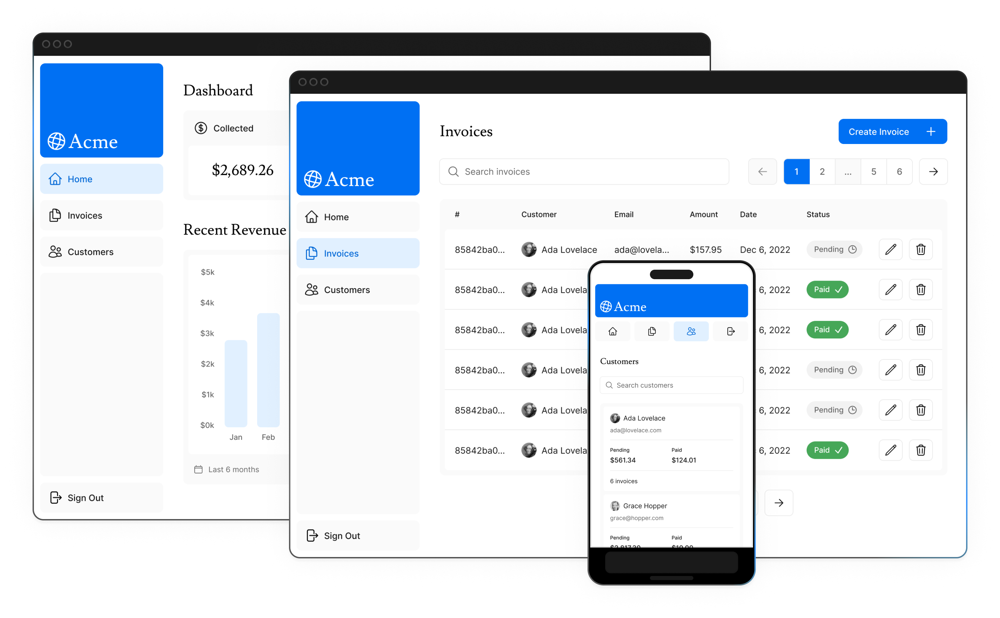

</div>

</div>

<div class="pt-4 text-base opacity-80 text-center">

데이터베이스도 직접 연결합니다. 끝까지 마치면 풀스택 Next.js 앱을 만들 수 있는 핵심 기술이 손에 잡힙니다.

</div>

---

## 코스에서 배울 주제

<div class="grid grid-cols-2 gap-x-6 gap-y-2 pt-4 text-sm">

- **Styling**: Next.js 앱을 꾸미는 다양한 방법
- **Optimizations**: 이미지·링크·폰트 최적화
- **Routing**: 파일 시스템 라우팅, 중첩 레이아웃
- **Data Fetching**: Postgres on Vercel, 패칭·스트리밍
- **Search & Pagination**: URL 검색 파라미터로 구현

<div></div>

- **Mutating Data**: React Server Actions, 캐시 무효화
- **Error Handling**: 일반 에러와 404
- **Form Validation & Accessibility**: 서버 폼 검증 + a11y
- **Authentication**: NextAuth.js + Proxy
- **Metadata**: SEO와 소셜 공유

</div>

---

## 사전 지식 & 시스템

<div class="grid grid-cols-2 gap-6 pt-4">

<div class="bg-slate-800/50 p-4 rounded">

### 📚 사전 지식
- React, JavaScript 기초
- React가 처음이면 **Part 1 (React Foundations)** 을 먼저 보세요.
- TypeScript는 코드 보면서 익숙해지면 OK.

</div>

<div class="bg-slate-800/50 p-4 rounded">

### 💻 시스템 요구사항
- **Node.js 20.9 이상**
- macOS / Windows(WSL) / Linux
- **GitHub** 계정
- **Vercel** 계정 (무료 hobby 플랜)

</div>

</div>

---

## 📦 챕터 정리

<div class="bg-emerald-900/30 border border-emerald-500/40 rounded p-5 mt-8">

1. 우리가 만들 것은 **금융 대시보드** (공개 페이지 + 인증된 대시보드 + 인보이스 CRUD).
2. Next.js의 거의 모든 핵심 기능을 한 프로젝트에서 만져봅니다.
3. 사전 지식: React + JS 기초.
4. GitHub + Vercel 무료 계정이 있어야 데이터베이스·배포 챕터를 진행할 수 있습니다.

</div>

---
layout: section
---

# Chapter 2
## 프로젝트 시작하기

<div class="pt-4 text-sm opacity-60">

source: <code>https://nextjs.org/learn/dashboard-app/getting-started</code>

</div>

---

## 패키지 매니저: pnpm 권장

<div class="pt-6 text-base">

이 코스는 npm/yarn보다 빠르고 효율적인 **pnpm** 을 사용합니다.

</div>

```bash
npm install -g pnpm
```

<div class="pt-4 text-sm opacity-70">

이미 npm/yarn에 익숙하다면 그대로 써도 동작은 합니다. 다만 코스에서 보여지는 명령은 pnpm 기준입니다.

</div>

---

## 새 프로젝트 만들기

`create-next-app` CLI에 스타터 예제를 지정해 한 줄로 만듭니다.

```bash
npx create-next-app@latest nextjs-dashboard \
  --example "https://github.com/vercel/next-learn/tree/main/dashboard/starter-example" \
  --use-pnpm
```

<div class="pt-4 text-base opacity-80">

이 코스는 처음부터 모든 코드를 작성하지 않습니다. 대부분의 코드는 미리 준비되어 있고, 우리는 **핵심 기능에만 집중** 합니다.

</div>

---

## 폴더 구조

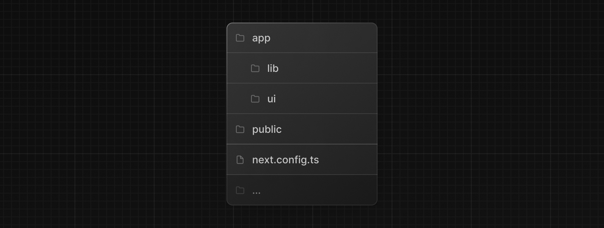

---

## 폴더 구조 설명

<div class="grid grid-cols-2 gap-3 pt-4 text-sm">

<div class="bg-slate-800/50 p-3 rounded">

**`/app`**

라우트·컴포넌트·로직. 우리가 가장 많이 작업할 곳.

</div>

<div class="bg-slate-800/50 p-3 rounded">

**`/app/lib`**

유틸 함수, 데이터 패칭 함수.

</div>

<div class="bg-slate-800/50 p-3 rounded">

**`/app/ui`**

카드·테이블·폼 같은 UI 컴포넌트. 스타일링은 미리 되어 있습니다.

</div>

<div class="bg-slate-800/50 p-3 rounded">

**`/public`**

정적 자산 (이미지 등).

</div>

<div class="bg-slate-800/50 p-3 rounded col-span-2">

**Config files**

`next.config.ts` 등 루트의 설정 파일들. 코스 동안 건드릴 일이 거의 없습니다.

</div>

</div>

---

## Placeholder 데이터

`app/lib/placeholder-data.ts`에 가짜 데이터가 미리 들어 있습니다. DB가 없을 때 UI를 만들기 좋습니다.

```typescript
// /app/lib/placeholder-data.ts
const invoices = [
  {
    customer_id: customers[0].id,
    amount: 15795,
    status: 'pending',
    date: '2022-12-06',
  },
  {
    customer_id: customers[1].id,
    amount: 20348,
    status: 'pending',
    date: '2022-11-14',
  },
  // ...
];
```

<div class="pt-2 text-sm opacity-80">

나중에 DB를 만들면 이 데이터를 **시드(seed)** 로 사용해서 채웁니다.

</div>

---

## TypeScript

`.ts` / `.tsx` 파일이 보입니다. 이 프로젝트는 **TypeScript** 로 작성되어 있습니다.

```typescript
// /app/lib/definitions.ts
export type Invoice = {
  id: string;
  customer_id: string;
  amount: number;
  date: string;
  // string union type: 'pending' 또는 'paid' 만 가능
  status: 'pending' | 'paid';
};
```

<div class="pt-3 text-base opacity-80">

TypeScript를 모른다고 걱정하지 마세요. 코스에서 필요한 만큼만 보여드리고, **타입을 강제해 실수를 줄이는 정도** 로 이해하면 충분합니다.

</div>

---

## 개발 서버 띄우기

```bash
pnpm i      # 의존성 설치
pnpm dev    # 개발 서버 시작
```

<div class="pt-6">

브라우저에서 [http://localhost:3000](http://localhost:3000) 열기:

</div>

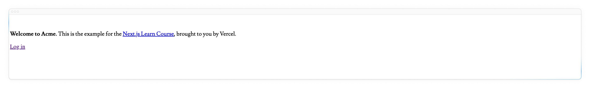

<div class="pt-2 text-sm opacity-70 text-center">

스타일링이 없는 의도된 모습. 다음 챕터에서 멋지게 꾸밉니다.

</div>

---

## 📦 챕터 정리

<div class="bg-emerald-900/30 border border-emerald-500/40 rounded p-5 mt-8">

1. **pnpm** 패키지 매니저 권장.
2. `create-next-app` + 스타터 예제로 한 번에 셋업.
3. 폴더 구조: `/app` (라우트·로직), `/app/lib` (유틸·데이터), `/app/ui` (컴포넌트), `/public` (정적 자산).
4. **Placeholder 데이터** 와 **TypeScript 타입** 이 미리 준비되어 있습니다.
5. `pnpm i` → `pnpm dev` → `localhost:3000`.

</div>

---
layout: section
---

# Chapter 3
## CSS 스타일링

<div class="pt-4 text-sm opacity-60">

source: <code>https://nextjs.org/learn/dashboard-app/css-styling</code>

</div>

<!--
[스크립트]
Chapter 3, CSS 스타일링입니다.

지금 우리 앱은 아무런 스타일이 없습니다. 이번 챕터에서 Next.js에서 CSS를 적용하는 세 가지 주요 방법, Global CSS, Tailwind, CSS Modules를 배웁니다.

전환: 가장 기본인 Global CSS부터 봅니다.
시간: 30초
-->

---

## Global CSS

`/app/ui/global.css`는 **모든 라우트** 에 적용할 CSS 규칙을 두는 곳입니다 (CSS reset, 사이트 전체 스타일 등).

```typescript {2,7}
// /app/layout.tsx
import '@/app/ui/global.css';

export default function RootLayout({
  children,
}: {
  children: React.ReactNode;
}) {
  return (
    <html lang="en">
      <body>{children}</body>
    </html>
  );
}
```

<div class="pt-2 text-sm opacity-80">

루트 레이아웃에 한 번만 import하면 모든 페이지에 적용됩니다.

</div>

---

## 어디서 스타일이 왔지?

`global.css` 안을 보면:

```css
@tailwind base;
@tailwind components;
@tailwind utilities;
```

<div class="pt-4 text-base">

이건 **Tailwind CSS** 디렉티브입니다.

</div>

---

## Tailwind CSS

<div class="pt-4 text-lg">

Tailwind는 **유틸리티 클래스** 를 JSX className에 직접 적어 스타일을 입히는 CSS 프레임워크입니다.

</div>

```jsx
<h1 className="text-blue-500">I'm blue!</h1>
```

<div class="pt-4 grid grid-cols-3 gap-3 text-sm">

<div class="bg-slate-800/50 p-3 rounded">

**클래스 충돌 걱정 없음**

각 클래스는 한 요소에만 적용

</div>

<div class="bg-slate-800/50 p-3 rounded">

**번들 크기 안정**

사용한 클래스만 남음

</div>

<div class="bg-slate-800/50 p-3 rounded">

**유지보수 쉬움**

스타일시트 따로 관리 X

</div>

</div>

---

## Tailwind 적용 화면

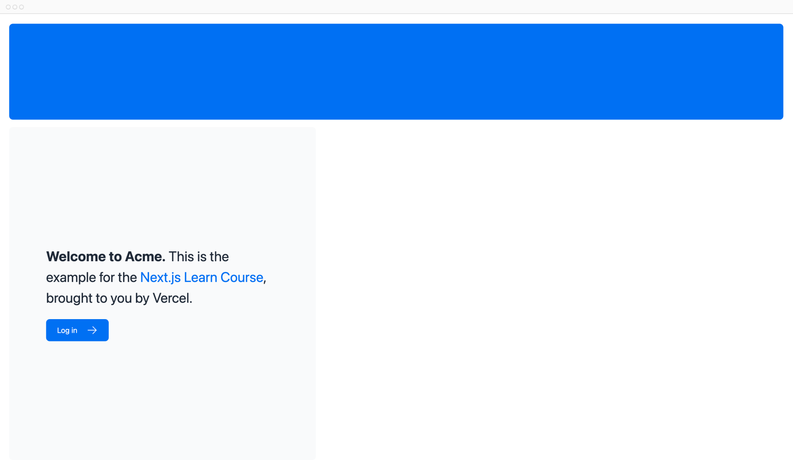

<div class="pt-3 text-sm opacity-70 text-center">

`/app/page.tsx`에서 Tailwind 클래스가 어떻게 쓰였는지 직접 보세요.

</div>

---

## CSS Modules

<div class="pt-4 text-base">

Tailwind 외에 **CSS Modules** 도 지원합니다. 컴포넌트 단위로 스코프를 자동으로 격리해 클래스 이름 충돌을 막아줍니다.

</div>

```css
/* /app/ui/home.module.css */
.shape {
  height: 0;
  width: 0;
  border-bottom: 30px solid black;
  border-left: 20px solid transparent;
  border-right: 20px solid transparent;
}
```

```typescript
// /app/page.tsx
import styles from '@/app/ui/home.module.css';
// ...
<div className={styles.shape} />
```

<div class="pt-2 text-sm opacity-80">

같은 앱에서 Tailwind와 CSS Modules를 **함께** 써도 괜찮습니다.

</div>

---

## clsx로 조건부 클래스

상태에 따라 색을 바꾸고 싶을 때 — `clsx` 라이브러리가 깔끔합니다.

```typescript {5-13}
// /app/ui/invoices/status.tsx
import clsx from 'clsx';

export default function InvoiceStatus({ status }: { status: string }) {
  return (
    <span
      className={clsx(
        'inline-flex items-center rounded-full px-2 py-1 text-sm',
        {
          'bg-gray-100 text-gray-500': status === 'pending',
          'bg-green-500 text-white': status === 'paid',
        },
      )}
    >
      {/* ... */}
    </span>
  );
}
```

<div class="pt-2 text-sm opacity-80">

객체의 값(boolean)이 `true`일 때만 그 키(클래스)가 적용됩니다.

</div>

---

## 다른 옵션들

<div class="pt-4 grid grid-cols-2 gap-4 text-sm">

<div class="bg-slate-800/50 p-3 rounded">

**Sass**

`.css`와 `.scss` 파일을 import 할 수 있습니다.

</div>

<div class="bg-slate-800/50 p-3 rounded">

**CSS-in-JS**

styled-jsx, styled-components, emotion 등.

</div>

</div>

<div class="pt-6 text-base opacity-80">

이 코스에서는 **Tailwind** 를 주로 사용하지만, 어느 것을 쓸지는 팀의 선호와 프로젝트 상황에 따라 자유롭게 선택할 수 있습니다.

</div>

---

## 📦 챕터 정리

<div class="bg-emerald-900/30 border border-emerald-500/40 rounded p-5 mt-8">

1. **Global CSS** 는 루트 레이아웃에 한 번만 import.
2. **Tailwind** = JSX className에 유틸리티 클래스 작성.
3. **CSS Modules** = 컴포넌트 스코프 자동 격리.
4. **clsx** = 조건부 className 토글.
5. 한 앱에서 여러 방식을 섞어 써도 됩니다.

</div>

---
layout: section
---

# Chapter 4
## 폰트와 이미지 최적화

<div class="pt-4 text-sm opacity-60">

source: <code>https://nextjs.org/learn/dashboard-app/optimizing-fonts-images</code>

<!--
[스크립트]
Chapter 4, 폰트와 이미지 최적화입니다.

Next.js는 폰트와 이미지를 최적화하는 빌트인 컴포넌트를 제공합니다. 이것들을 쓰면 성능이 크게 향상됩니다.

전환: 왜 폰트를 최적화해야 하는지부터 알아봅니다.
시간: 30초
-->

</div>

---

## 왜 폰트를 최적화하나

<div class="pt-4 text-lg">

폰트는 디자인의 핵심이지만, 폰트 파일을 받아오는 동안 **레이아웃이 흔들리는 현상(CLS)** 이 생깁니다.

</div>

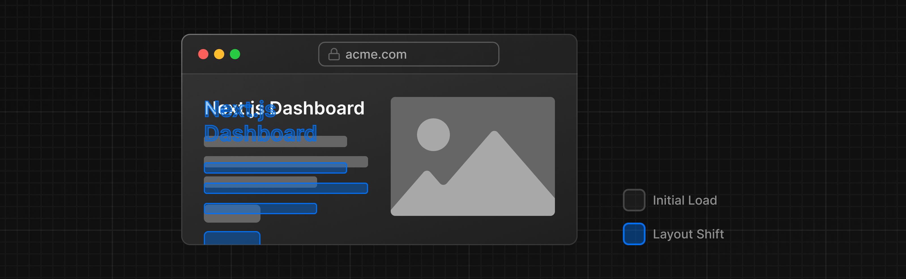

<div class="pt-3 text-sm opacity-70 text-center">

**Cumulative Layout Shift (CLS)** — Google의 핵심 웹 지표 중 하나.

</div>

---

## next/font가 해결하는 방식

<div class="pt-4 text-lg">

Next.js의 `next/font` 모듈을 쓰면, **빌드 타임** 에 폰트 파일을 다운로드해 정적 자산으로 함께 호스트합니다.

</div>

<div class="pt-6 grid grid-cols-2 gap-4">

<div class="bg-slate-800/50 p-4 rounded">

### ❌ 직접 임베드
사용자가 페이지에 올 때마다 폰트 파일 추가 요청 → 느림 + CLS

</div>

<div class="bg-slate-800/50 p-4 rounded">

### ✅ next/font
폰트 파일이 우리 사이트와 함께 제공 → 추가 네트워크 요청 0

</div>

</div>

---

## 기본 폰트 추가하기

`/app/ui/fonts.ts`를 만들고 `Inter` 폰트를 import:

```typescript
// /app/ui/fonts.ts
import { Inter } from 'next/font/google';

export const inter = Inter({ subsets: ['latin'] });
```

<div class="pt-3 text-base opacity-80">

`'latin'` subset 만 로드하면 파일 크기가 더 작아집니다.

</div>

---

## body에 폰트 적용

```typescript {3,11}
// /app/layout.tsx
import '@/app/ui/global.css';
import { inter } from '@/app/ui/fonts';

export default function RootLayout({
  children,
}: {
  children: React.ReactNode;
}) {
  return (
    <html lang="en">
      <body className={`${inter.className} antialiased`}>{children}</body>
    </html>
  );
}
```

<div class="pt-3 text-sm opacity-80">

`antialiased`는 폰트 가장자리를 부드럽게 해주는 Tailwind 클래스 (선택 사항).

</div>

---

## 🛠 실습: 보조 폰트 추가

<div class="pt-4 text-base">

1. `fonts.ts`에 `Lusitana` 폰트를 추가합니다.
2. weights를 지정해야 합니다 (예: `'400'`, `'700'`).
3. `/app/page.tsx`의 `<p>` 요소에 적용합니다.
4. 미리 만들어둔 `<AcmeLogo />` 컴포넌트도 Lusitana를 씁니다 — 주석을 풀어 활성화합니다.

</div>

<div class="pt-4 text-sm opacity-70">

💡 weight 옵션이 헷갈리면 에디터의 TypeScript 에러를 보거나, [fonts.google.com](https://fonts.google.com/)에서 검색하세요.

</div>

---

## 왜 이미지를 최적화하나

<div class="pt-4 text-base">

Next.js는 `/public` 폴더의 정적 자산을 자동으로 서빙합니다. 일반 HTML이라면:

</div>

```html

```

<div class="pt-4 text-base">

그런데 직접 다음을 챙겨야 합니다:

</div>

<div class="pt-2 grid grid-cols-2 gap-2 text-sm">

- 화면 크기에 따라 반응형
- 디바이스별 이미지 크기
- 로딩 중 layout shift 방지
- 화면 밖 이미지 lazy load

</div>

---

## next/image 컴포넌트

<div class="pt-4 text-base">

`<Image>` 컴포넌트는 HTML `` 의 확장판이며, 다음을 **자동** 으로 처리합니다.

</div>

<div class="pt-4 grid grid-cols-2 gap-3 text-sm">

<div class="bg-slate-800/50 p-3 rounded">

✅ Layout shift 방지

</div>

<div class="bg-slate-800/50 p-3 rounded">

✅ 디바이스별 리사이즈

</div>

<div class="bg-slate-800/50 p-3 rounded">

✅ 기본 lazy loading

</div>

<div class="bg-slate-800/50 p-3 rounded">

✅ WebP / AVIF 같은 모던 포맷 자동 서빙

</div>

</div>

---

## 데스크탑 hero 이미지 추가

```typescript
// /app/page.tsx
import Image from 'next/image';

// ...
<div className="flex items-center justify-center p-6 md:w-3/5 md:px-28 md:py-12">
  <Image
    src="/hero-desktop.png"
    width={1000}
    height={760}
    className="hidden md:block"
    alt="Screenshots of the dashboard project showing desktop version"
  />
</div>
```

<div class="pt-3 text-sm opacity-80">

⚠️ `width`/`height`는 **소스 이미지의 실제 비율** 과 같아야 합니다 (렌더링 크기 아님).<br/>
`hidden md:block` — 모바일에서는 숨기고, md(중간 화면) 이상에서만 보여줍니다.

</div>

---

## 🛠 실습: 모바일 hero 추가

<div class="pt-4 text-base space-y-3">

1. 위에서 추가한 데스크탑 이미지 아래에 `hero-mobile.png`를 위한 `<Image>`를 하나 더 만듭니다.
2. `width={560}`, `height={620}`.
3. 데스크탑에서는 숨기고 모바일에서만 보이도록 className을 작성합니다.
4. DevTools로 화면 크기를 바꿔가며 두 이미지가 정확히 스왑되는지 확인합니다.

</div>

---

## 결과 화면

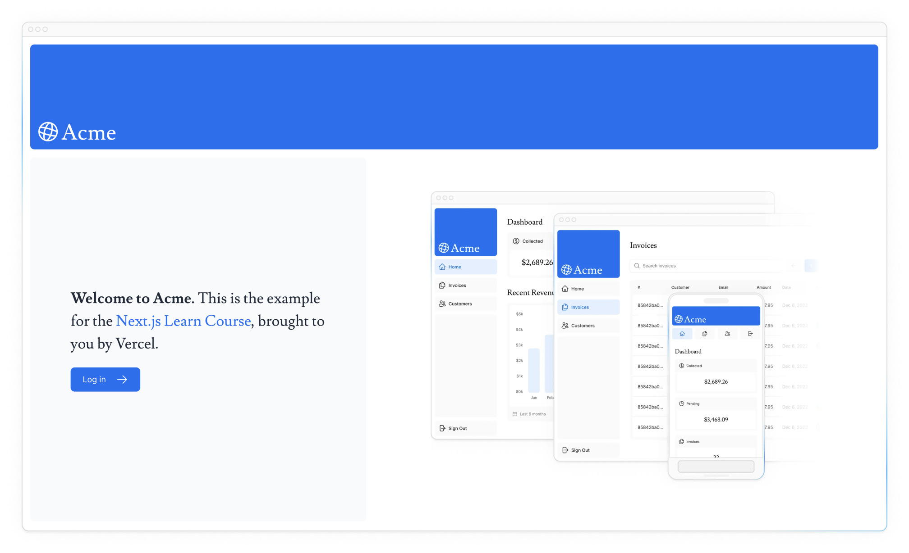

<div class="pt-3 text-sm opacity-70 text-center">

폰트도 적용되고 hero 이미지도 들어간 모습.

</div>

---

## 📦 챕터 정리

<div class="bg-emerald-900/30 border border-emerald-500/40 rounded p-5 mt-8">

1. **CLS** 는 폰트 로딩이 만드는 가장 흔한 성능 문제.
2. **`next/font`** 로 폰트를 빌드 타임에 정적으로 호스트 → 추가 요청 0.
3. **`next/image`** 는 layout shift 방지·디바이스별 리사이즈·lazy load·모던 포맷을 자동 처리.
4. `width`/`height`는 **소스 이미지의 비율** 을 따라야 합니다.
5. Tailwind의 `hidden md:block` 같은 클래스로 반응형을 쉽게 다룹니다.

</div>

---
layout: section
---

# Chapter 5
## 레이아웃과 페이지 만들기

<!--
[스크립트]
Chapter 5, 레이아웃과 페이지 만들기입니다.

Next.js의 파일 시스템 라우팅을 본격적으로 다룹니다. 폴더 구조로 URL을 정의하고, layout.tsx로 공유 레이아웃을 만드는 방법을 배웁니다.

전환: 파일 시스템 라우팅이 어떻게 동작하는지 복습합니다.
시간: 30초
-->

<div class="pt-4 text-sm opacity-60">

source: <code>https://nextjs.org/learn/dashboard-app/creating-layouts-and-pages</code>

</div>

---

## 파일 시스템 라우팅 복습

<div class="pt-4 text-lg">

Next.js는 **폴더가 곧 라우트** 입니다. 폴더 = URL 세그먼트.

</div>

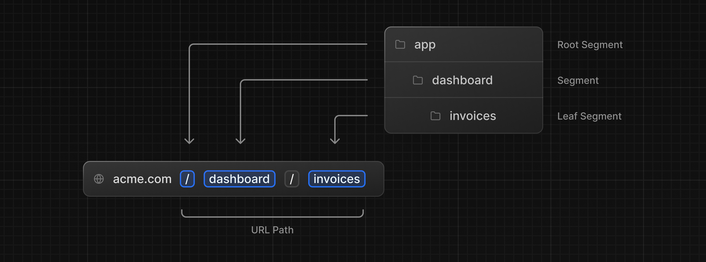

---

## page.tsx만 공개 접근 가능

<div class="pt-4 text-lg">

`page.tsx`는 라우트가 외부에 공개되는 **유일한 진입점** 입니다. 다른 파일은 같은 폴더에 두어도 URL로 노출되지 않습니다.

</div>

<div class="pt-6 bg-slate-800/50 p-4 rounded">

### Colocation
UI 컴포넌트, 테스트 파일, 관련 유틸을 같은 폴더에 두는 패턴. Next.js는 `page.tsx`만 공개하므로 안심하고 함께 둘 수 있습니다.

</div>

---

## Dashboard 페이지 만들기

`app/dashboard/page.tsx`를 만들면 `/dashboard` 경로가 생깁니다.

```typescript
// /app/dashboard/page.tsx
export default function Page() {
  return <p>Dashboard Page</p>;
}
```

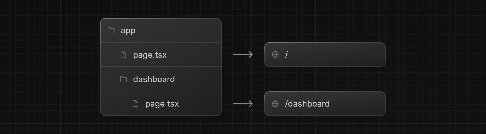

---

## 🛠 실습: 두 페이지 더 만들기

<div class="pt-4 text-base space-y-3">

1. **Customers Page**: `http://localhost:3000/dashboard/customers`<br/>
   `<p>Customers Page</p>` 만 반환

2. **Invoices Page**: `http://localhost:3000/dashboard/invoices`<br/>
   `<p>Invoices Page</p>` 만 반환

</div>

<div class="pt-6 text-sm opacity-70">

스스로 폴더 구조를 만들어 보세요. 막히면 lab의 solution을 참고하세요.

</div>

---

## Dashboard Layout

대시보드는 사이드 네비게이션을 모든 페이지가 공유합니다. **`layout.tsx`** 를 만들면 됩니다.

```typescript
// /app/dashboard/layout.tsx
import SideNav from '@/app/ui/dashboard/sidenav';

export default function Layout({ children }: { children: React.ReactNode }) {
  return (
    <div className="flex h-screen flex-col md:flex-row md:overflow-hidden">
      <div className="w-full flex-none md:w-64">
        <SideNav />
      </div>
      <div className="grow p-6 md:overflow-y-auto md:p-12">{children}</div>
    </div>
  );
}
```

<div class="pt-2 text-sm opacity-80">

`children`은 자식 라우트(또는 또다른 layout)가 됩니다.

</div>

---

## Layout이 자식 페이지를 감싸는 모습

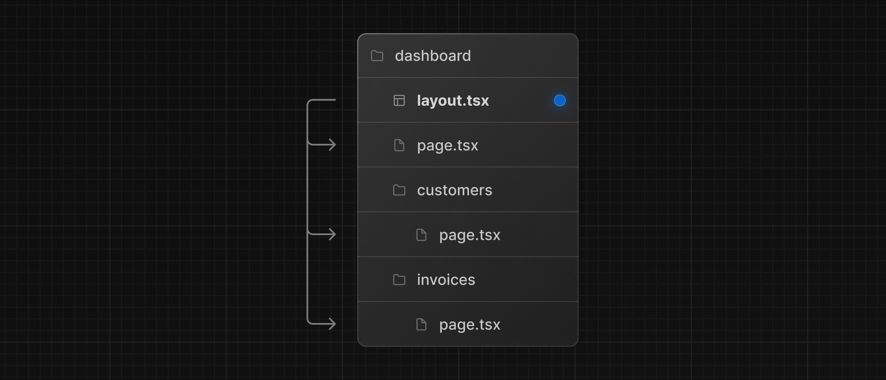

<div class="pt-3 text-sm opacity-70 text-center">

`Layout`은 자식 컴포넌트(다음 layout 또는 page)를 감싸는 그릇 역할을 합니다.

</div>

---

## 공유 레이아웃의 효과

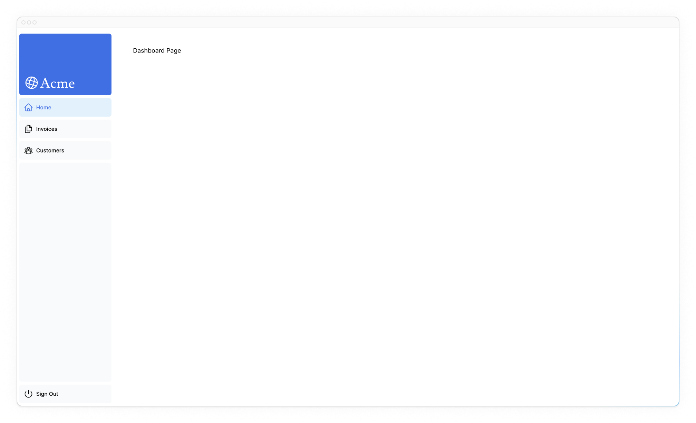

<div class="pt-4 text-sm opacity-70 text-center">

`/dashboard` 안의 모든 페이지는 사이드 네비를 자동으로 포함합니다.

</div>

---

## Partial Rendering ⚡

<div class="pt-4 text-lg">

Next.js의 layout은 페이지 이동 시 **다시 그려지지 않습니다.** 페이지 부분만 업데이트.

</div>

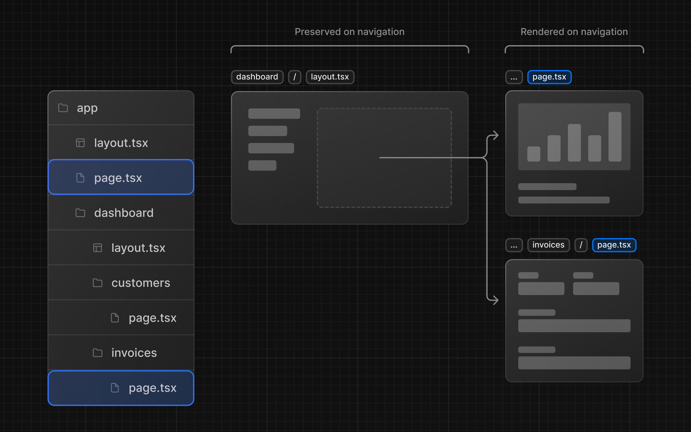

<div class="pt-3 text-sm opacity-70 text-center">

덕분에 layout 안에 있는 클라이언트 상태가 페이지 이동에도 보존됩니다.

</div>

---

## Root Layout

`/app/layout.tsx` = 모든 Next.js 앱에 **필수** 인 루트 레이아웃.

```typescript
// /app/layout.tsx
import '@/app/ui/global.css';
import { inter } from '@/app/ui/fonts';

export default function RootLayout({
  children,
}: {
  children: React.ReactNode;
}) {
  return (
    <html lang="en">
      <body className={`${inter.className} antialiased`}>{children}</body>
    </html>
  );
}
```

<div class="pt-3 text-sm opacity-80">

`<html>`, `<body>` 태그가 있는 곳. 메타데이터도 여기서 설정합니다 (Chapter 16).

</div>

---

## 📦 챕터 정리

<div class="bg-emerald-900/30 border border-emerald-500/40 rounded p-5 mt-8">

1. **폴더 = 라우트 세그먼트**, `page.tsx`만 공개됨.
2. 같은 폴더에 컴포넌트·테스트 등을 함께 두는 **Colocation** 패턴.
3. **`layout.tsx`** 는 여러 페이지가 공유하는 UI.
4. **Partial rendering** — layout은 페이지 이동 시 다시 그리지 않음.
5. **Root layout** 은 모든 앱에 필수, `<html>`/`<body>`와 메타데이터.

</div>

---
layout: section
---

# Chapter 6
## 페이지 사이를 이동하기

<div class="pt-4 text-sm opacity-60">

source: <code>https://nextjs.org/learn/dashboard-app/navigating-between-pages</code>

</div>

<!--
[스크립트]
Chapter 6, 페이지 사이를 이동하는 방법입니다.

지금까지는 각 페이지를 만들었습니다. 이제 페이지 간 이동을 최적화할 차례입니다. Next.js의 `<Link>` 컴포넌트와 자동 프리페칭을 배웁니다.

전환: 왜 일반 `<a>` 태그 대신 `<Link>`를 써야 하는지부터 봅니다.
시간: 30초
-->

---

## 왜 네비게이션을 최적화하나

<div class="pt-4 text-lg">

지금 사이드바는 `<a>` 태그로 링크되어 있습니다. 클릭해 보면…

</div>

<div class="pt-6 text-center text-2xl bg-red-900/30 border border-red-500/40 rounded p-4">

🔄 매번 **페이지 전체 새로고침** 발생!

</div>

<div class="pt-6 text-base opacity-80">

전통 멀티페이지 앱처럼 느껴집니다. SPA의 빠른 느낌을 잃어버립니다.

</div>

<!--
[스크립트]
지금 상태의 대시보드 사이드바를 살펴보면, 내비게이션 링크가 HTML의 기본 `<a>` 태그로 되어 있습니다.

직접 클릭해 보면 어떤 일이 일어나냐 — 브라우저 탭이 잠깐 흰 화면이 됩니다. 매번 서버에서 HTML 전체를 다시 내려받는 전통적인 멀티페이지 앱 방식이기 때문입니다.

이걸 경험해 보면 "아, 이게 SPA가 해결하려던 문제구나" 하고 바로 이해가 됩니다.

💡 혼동 포인트: "SPA라면서 왜 전체 새로고침이 되나요?" → Next.js는 서버 렌더링을 기본으로 하기 때문에 `<a>` 태그를 그냥 쓰면 당연히 전체 새로고침이 됩니다. Next.js가 제공하는 `<Link>` 컴포넌트로 교체해야 SPA처럼 클라이언트 사이드 네비게이션이 됩니다.

[Q&A 대비]
Q: 그냥 `<a href>`를 쓰면 안 되나요?
A: 기능은 동작하지만 매번 전체 페이지를 다시 로드해서 느리고, JavaScript bundle도 다시 파싱해야 합니다. UX가 훨씬 나빠집니다.

Q: React Router와 비슷한 건가요?
A: 동일한 역할입니다. Next.js는 파일 시스템 기반 라우팅이라 라우트 설정 없이 `<Link>` 컴포넌트만 쓰면 됩니다.

전환: 그럼 바로 해결 방법인 `<Link>` 컴포넌트를 봅시다.
시간: 1.5분
-->

---

## `<Link>` 컴포넌트

```typescript
// /app/ui/dashboard/nav-links.tsx
import Link from 'next/link';

// <a>를 <Link>로 교체
<Link
  key={link.name}
  href={link.href}
  className="..."
>
  <LinkIcon className="w-6" />
  <p className="hidden md:block">{link.name}</p>
</Link>
```

<div class="pt-3 text-base opacity-80">

`<a href>` 대신 `<Link href>`를 쓰면 **클라이언트 사이드 네비게이션** 이 됩니다.

</div>

<!--
[스크립트]
수정은 아주 간단합니다. `nav-links.tsx` 파일을 열고, `<a>` 태그를 `<Link>`로 바꾸면 끝입니다.

두 가지만 바뀌었습니다 — `import Link from 'next/link'` 추가, 그리고 `<a>`를 `<Link>`로 교체. `href`는 그대로 씁니다.

교체하고 나면 사이드바 링크를 눌러도 전체 새로고침이 없습니다. SideNav는 그대로 있고 본문만 바뀝니다.

💡 혼동 포인트: "`<Link>`인데 왜 `<a>`처럼 생겼나요?" → `<Link>`는 최종적으로 HTML `<a>` 태그를 렌더링합니다. 차이는 클릭 이벤트를 인터셉트해서 JavaScript로 처리한다는 것입니다. 개발자 도구에서 보면 `<a>` 태그로 나옵니다.

[Q&A 대비]
Q: `href`에 절대 경로만 쓸 수 있나요?
A: 상대 경로도 되고, 객체 형태 `href={{ pathname: '/dashboard', query: { id: '1' } }}`도 됩니다.

전환: 이제 왜 빠른지, 그 안에서 어떤 일이 벌어지는지 알아봅시다.
시간: 1.5분
-->

---

## 자동 코드 스플리팅 ✂️

<div class="pt-4 text-lg">

Next.js는 라우트 단위로 코드를 자동 분할합니다.

</div>

<div class="pt-6 grid grid-cols-2 gap-4">

<div class="bg-slate-800/50 p-4 rounded">

### 🛡 페이지 격리
한 페이지에서 에러가 나도 나머지는 동작.

</div>

<div class="bg-slate-800/50 p-4 rounded">

### ⚡ 더 빠른 파싱
브라우저가 처리할 코드가 줄어듦.

</div>

</div>

<!--
[스크립트]
`<Link>` 컴포넌트의 첫 번째 숨겨진 기능은 코드 스플리팅입니다.

Next.js는 라우트별로 JavaScript 번들을 자동으로 분리합니다. 대시보드 페이지에 접근할 때, 인보이스 페이지의 코드는 포함되지 않습니다.

이 덕분에 두 가지 이점이 생깁니다. 첫째, 한 페이지에서 에러가 발생해도 다른 페이지는 정상 동작합니다. 둘째, 브라우저가 파싱해야 할 코드 양이 줄어서 더 빠릅니다.

설정 없이 자동으로 되는 최적화입니다.

전환: 두 번째 숨겨진 기능이 더 인상적입니다 — 프리페칭입니다.
시간: 1분
-->

---

## 자동 프리페칭 🚀

<div class="pt-4 text-lg">

production 환경에서는 **`<Link>` 가 viewport에 들어오면**, Next.js가 그 링크의 코드를 백그라운드로 미리 로드합니다.

</div>

<div class="pt-6 text-center text-xl bg-emerald-900/30 border border-emerald-500/40 rounded p-4">

사용자가 클릭하는 순간 → **거의 즉시** 페이지 전환

</div>

<!--
[스크립트]
프리페칭은 production 환경에서만 동작하는 기능입니다. `pnpm build && pnpm start`로 실행해야 확인됩니다.

동작 방식입니다. `<Link>` 컴포넌트가 화면에 보이는 순간, Next.js는 그 링크가 가리키는 페이지의 코드를 백그라운드에서 미리 다운로드합니다. 사용자가 아직 클릭도 안 했는데 말이죠.

결과적으로 사용자가 링크를 클릭하는 순간, 해당 페이지 코드는 이미 브라우저에 있습니다. 거의 즉시 전환되는 것처럼 느껴집니다.

💡 혼동 포인트: "개발 모드에서 느린 것 같은데요?" → 개발 모드(`next dev`)에서는 프리페칭이 비활성화됩니다. 프로덕션 빌드에서 확인하세요.

전환: 마지막으로 현재 활성 링크를 시각적으로 표시하는 패턴을 배웁니다.
시간: 1.5분
-->

---

## 활성 링크 패턴

현재 어느 페이지에 있는지 시각적으로 표시하고 싶을 때 — `usePathname()` 훅을 씁니다.

```typescript
'use client';

import Link from 'next/link';
import { usePathname } from 'next/navigation';
```

<div class="pt-3 text-base opacity-80">

⚠️ 훅을 쓰므로 파일 맨 위에 **`'use client'`** 가 필요합니다.

</div>

<!--
[스크립트]
대시보드에서 "지금 어느 페이지에 있는지" 강조 표시를 해주면 UX가 훨씬 좋아집니다.

이를 위해 `usePathname()` 훅을 사용합니다. 현재 URL 경로를 문자열로 반환해줍니다. 예를 들어 `/dashboard/invoices` 페이지라면 `/dashboard/invoices`를 돌려줍니다.

주의할 점: 이 훅은 클라이언트 훅입니다. 그래서 파일 맨 위에 `'use client'` 지시자를 추가해야 합니다. 서버 컴포넌트에서는 쓸 수 없습니다.

전환: 가져온 pathname 값으로 조건부 스타일을 적용하는 방법을 봅시다.
시간: 1분
-->

---

## clsx로 조건부 활성 스타일

```typescript {12-22}
'use client';

import Link from 'next/link';
import { usePathname } from 'next/navigation';
import clsx from 'clsx';

export default function NavLinks() {
  const pathname = usePathname();

  return (
    <>
      {links.map((link) => {
        const LinkIcon = link.icon;
        return (
          <Link
            key={link.name}
            href={link.href}
            className={clsx(
              'flex h-[48px] grow items-center justify-center gap-2 rounded-md bg-gray-50 p-3 ...',
              {
                'bg-sky-100 text-blue-600': pathname === link.href,
              },
            )}
          >
            <LinkIcon className="w-6" />
            <p className="hidden md:block">{link.name}</p>
          </Link>
        );
      })}
    </>
  );
}
```

<!--
[스크립트]
완성된 코드를 봅시다. 포인트는 `className` 안에서 `clsx`를 사용하는 부분입니다.

`clsx(기본클래스, { 조건부클래스: 조건 })` 형태입니다. `pathname === link.href`가 참이면 파란색 배경과 텍스트 색이 적용되고, 거짓이면 그냥 기본 스타일만 됩니다.

`clsx`는 조건부 className을 깔끔하게 처리하는 유틸리티입니다. 삼항 연산자나 문자열 보간 없이 객체 형태로 쓸 수 있어서 가독성이 좋습니다.

💡 혼동 포인트: "`value: condition === link.href`에서 왜 `===`를 쓰나요?" → 정확한 경로 비교입니다. `/dashboard`와 `/dashboard/invoices`는 다른 경로입니다. `startsWith`나 `includes`를 쓰면 하위 경로도 활성화되므로 의도에 따라 선택하세요.

[Q&A 대비]
Q: 여러 조건을 동시에 적용할 수 있나요?
A: 네, `clsx('기본', { '조건1': bool1, '조건2': bool2 })`처럼 여러 조건을 객체에 넣으면 됩니다.

전환: 챕터 6 핵심을 정리하고 다음 챕터로 넘어갑니다.
시간: 2분
-->

---

## 📦 챕터 정리

<div class="bg-emerald-900/30 border border-emerald-500/40 rounded p-5 mt-8">

1. **`<Link>`** = 클라이언트 사이드 네비게이션 (전체 새로고침 X).
2. Next.js는 라우트별로 **코드를 자동 분할** 합니다.
3. production에서는 `<Link>`가 보이는 순간 **자동 프리페칭** → 즉시 전환.
4. **`usePathname()`** 으로 현재 경로를 읽어 활성 스타일 적용.
5. 훅을 사용하므로 해당 컴포넌트는 **`'use client'`** 가 필요.

</div>

<!--
[스크립트]
챕터 6을 정리하겠습니다.

`<Link>` 하나로 클라이언트 사이드 네비게이션, 코드 자동 분할, 자동 프리페칭까지 다 됩니다. `<a>` 태그 대신 `<Link>`를 쓰는 것이 Next.js에서 네비게이션의 기본입니다.

`usePathname()`은 클라이언트 훅이라 `'use client'` 컴포넌트에서만 쓸 수 있고, 현재 URL 경로를 읽어서 활성 링크를 강조하는 데 씁니다.

전환: 다음은 실제 데이터를 다루기 위해 데이터베이스를 셋업합니다.
시간: 1분
-->

---
layout: section
---

# Chapter 7
## 데이터베이스 셋업하기

<div class="pt-4 text-sm opacity-60">

source: <code>https://nextjs.org/learn/dashboard-app/setting-up-your-database</code>

</div>

<!--
[스크립트]
Chapter 7, 데이터베이스 셋업하기입니다.

지금까지는 하드코딩된 데이터로 UI를 만들었습니다. 이제 실제 Postgres 데이터베이스를 연결할 차례입니다. GitHub에 코드를 푸시하고, Vercel에 배포하고, DB를 연결하는 과정을 차례대로 해봅니다.

6단계가 있는데 처음엔 복잡해 보이지만, 각 단계를 하나씩 따라가면 어렵지 않습니다.

전환: 전체 과정을 먼저 한눈에 보고 시작합시다.
시간: 30초
-->

---

## 셋업 단계 한눈에 보기

<div class="grid grid-cols-2 gap-3 pt-4 text-sm">

<div class="bg-slate-800/50 p-3 rounded">

**1️⃣ GitHub 레포 푸시**

</div>

<div class="bg-slate-800/50 p-3 rounded">

**2️⃣ Vercel 무료 가입**

</div>

<div class="bg-slate-800/50 p-3 rounded">

**3️⃣ 프로젝트 import & 배포**

</div>

<div class="bg-slate-800/50 p-3 rounded">

**4️⃣ Postgres DB 만들기**

</div>

<div class="bg-slate-800/50 p-3 rounded">

**5️⃣ 환경 변수 가져오기**

</div>

<div class="bg-slate-800/50 p-3 rounded">

**6️⃣ DB 시드(seed) 채우기**

</div>

</div>

<!--
[스크립트]
전체 과정은 6단계입니다. GitHub 레포를 만들고, Vercel에 가입해서, 프로젝트를 가져와서 배포하고, Postgres DB를 만들고, 환경 변수를 가져와서, 마지막으로 샘플 데이터를 시드로 채웁니다.

처음에는 좀 많아 보이지만, Vercel이 대부분의 과정을 자동화해줍니다. 실제로 손으로 해야 할 일은 많지 않습니다.

지금부터 하나씩 함께 해보겠습니다.

전환: 먼저 GitHub 레포부터 준비합니다.
시간: 1분
-->

---

## GitHub 레포 만들기

<div class="pt-6 text-base">

코드를 GitHub에 푸시해 두면 데이터베이스 셋업·배포가 훨씬 매끄럽습니다.

</div>

<div class="pt-4 text-sm space-y-2 opacity-80">

- GitLab, Bitbucket 같은 다른 git 호스팅도 가능
- 처음이면 [GitHub Desktop](https://desktop.github.com/) 추천
- 가이드: [GitHub 공식 문서](https://help.github.com/en/github/getting-started-with-github/create-a-repo)

</div>

<!--
[스크립트]
첫 번째 단계는 코드를 GitHub에 올리는 겁니다.

GitHub 계정이 없으면 먼저 만들어 주세요. 이미 있으면 새 레포를 만들고, 현재 프로젝트 코드를 push합니다.

git이 낯선 분들을 위해 GitHub Desktop이라는 GUI 도구가 있습니다. 커맨드라인 없이 버튼 클릭으로 push할 수 있습니다.

중요한 점: 레포를 public으로 해도 되고 private으로 해도 됩니다. Vercel은 두 경우 모두 가져올 수 있습니다.

전환: 코드가 GitHub에 올라갔으면 Vercel에 연결합니다.
시간: 1.5분
-->

---

## Vercel 가입 + 프로젝트 연결

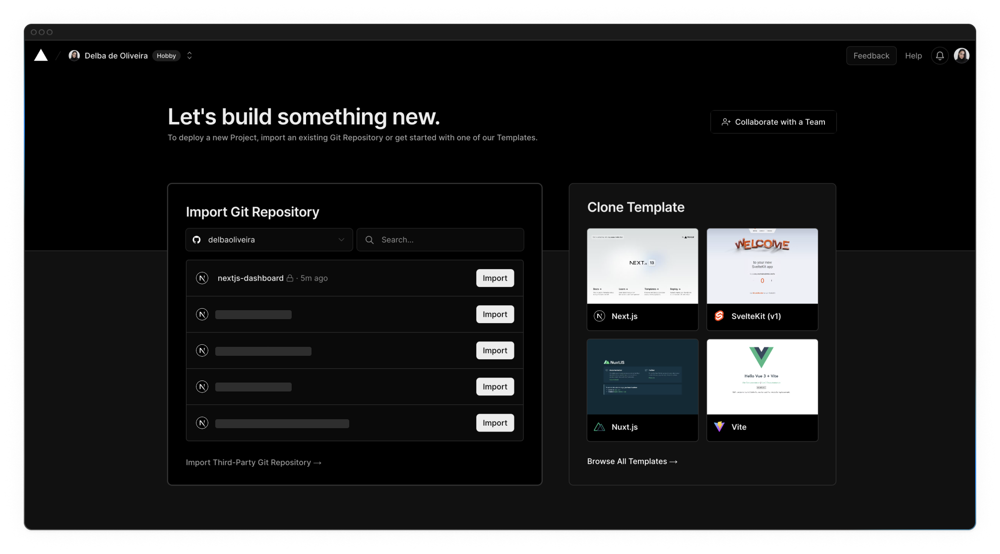

<div class="pt-3 text-sm opacity-70 text-center">

[vercel.com/signup](https://vercel.com/signup) → 무료 hobby 플랜 → GitHub 연결 → 프로젝트 import

</div>

<!--
[스크립트]
`vercel.com/signup`에서 Hobby 플랜으로 무료 가입합니다. GitHub 계정으로 가입하면 연동이 자동으로 됩니다.

가입하면 이런 화면이 나옵니다. "Import Git Repository"에서 방금 push한 레포를 찾아 선택합니다.

Vercel은 Next.js를 만든 회사라서 Next.js 프로젝트를 특히 잘 지원합니다. 빌드 설정을 자동으로 감지합니다.

전환: 프로젝트 이름을 정하고 배포 버튼을 누릅니다.
시간: 1분
-->

---

## 프로젝트 이름 정하고 Deploy

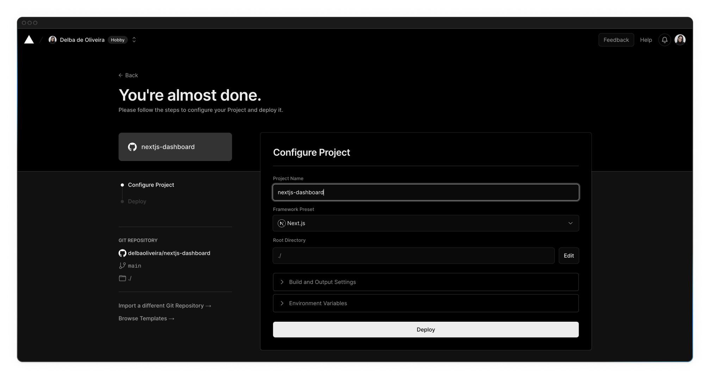

<div class="pt-3 text-sm opacity-70 text-center">

프로젝트 이름을 입력하고 **Deploy** 버튼을 누르면 즉시 빌드·배포가 시작됩니다.

</div>

<!--
[스크립트]
프로젝트 이름을 적당히 정하고 Deploy를 누릅니다. 빌드 로그가 실시간으로 보입니다.

첫 배포는 1~2분 정도 걸립니다. 빌드가 완료되면 실제 URL이 발급됩니다.

환경 변수는 아직 없으니 DB 연결이 안 되는 건 정상입니다. 이후 단계에서 추가할 겁니다.

전환: 배포가 완료되면 이런 화면이 됩니다.
시간: 1분
-->

---

## 배포 완료 — 실제 URL 받기

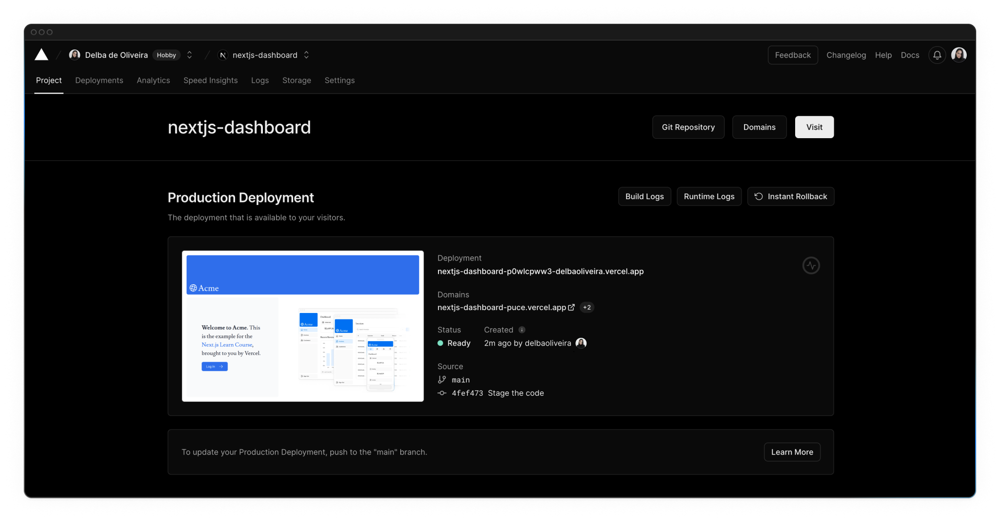

<div class="pt-3 text-sm opacity-70 text-center">

🎉 끝났습니다. 프로젝트 도메인이 발급되고, 이제부터는 git push만 해도 자동 재배포됩니다.

</div>

<!--
[스크립트]
배포 완료 화면입니다. 프로젝트 도메인이 생겼습니다. 이 URL을 클릭하면 실제 배포된 앱이 열립니다.

이제부터는 코드를 수정하고 git push를 하면 Vercel이 자동으로 재빌드하고 재배포합니다. CI/CD 파이프라인이 설정 없이 완성된 겁니다.

전환: 자동 배포의 또 다른 강력한 기능을 봅시다.
시간: 1분
-->

---

## 자동 배포 + 미리보기 URL

<div class="pt-4 text-lg space-y-3">

GitHub과 연결하면:

</div>

<div class="pt-2 grid grid-cols-2 gap-4 text-base">

<div class="bg-slate-800/50 p-4 rounded">

### ✅ main 브랜치 푸시
설정 없이도 Vercel이 자동 재배포

</div>

<div class="bg-slate-800/50 p-4 rounded">

### ✅ Pull Request 열면
**즉시 미리보기 URL** 생성 → 팀과 공유, 배포 에러 조기 발견

</div>

</div>

<!--
[스크립트]
Vercel과 GitHub이 연결되면 두 가지 자동화가 됩니다.

첫째, main 브랜치에 push할 때마다 프로덕션 환경이 자동으로 업데이트됩니다.

둘째, Pull Request를 열 때마다 그 PR 전용 미리보기 URL이 즉시 생성됩니다. 팀원들과 코드 리뷰 전에 실제 동작을 확인할 수 있고, 배포 에러를 프로덕션 전에 잡을 수 있습니다.

이 두 기능만으로도 Vercel을 쓸 이유가 충분합니다. 팀 협업이 훨씬 편해집니다.

전환: 이제 데이터베이스를 만들 차례입니다.
시간: 1.5분
-->

---

## Postgres 데이터베이스 만들기

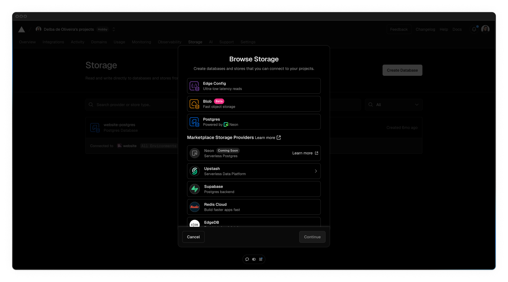

<div class="pt-3 text-sm opacity-70 text-center">

Vercel 프로젝트 → **Storage** 탭 → **Create Database** → Postgres 제공자 선택 (Neon, Supabase 등)

</div>

<!--
[스크립트]
배포된 프로젝트 페이지에서 Storage 탭을 클릭합니다. Create Database를 선택하면 여러 Postgres 제공자가 나옵니다.

Neon, Supabase 등 여러 옵션이 있는데, 모두 Vercel과 통합됩니다. 어떤 것을 선택해도 됩니다.

무료 플랜으로 충분히 실습할 수 있습니다.

전환: 리전 선택이 중요합니다.
시간: 1분
-->

---

## 리전 선택

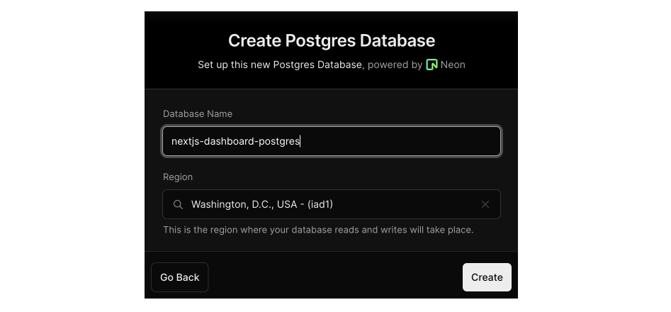

<div class="pt-3 text-sm opacity-70 text-center">

기본 권장: **Washington D.C (iad1)**. 데이터 요청의 latency를 줄여줍니다.

</div>

<!--
[스크립트]
리전은 데이터베이스 서버가 물리적으로 위치할 지역입니다. 기본값인 Washington D.C.가 권장됩니다.

이유는 Next.js 공식 코스에서 사용하는 Serverless Function들이 주로 `iad1`(Washington D.C.) 리전에서 실행되기 때문입니다. 서버 함수와 DB가 같은 리전에 있어야 네트워크 지연(latency)이 최소화됩니다.

리전을 나중에 바꾸려면 DB를 새로 만들어야 합니다. 처음부터 올바르게 선택하는 게 중요합니다.

전환: DB가 만들어지면 연결 정보를 가져옵니다.
시간: 1.5분
-->

---

## 환경 변수 복사하기

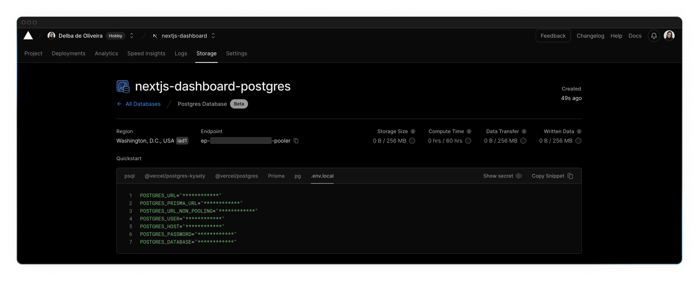

<div class="pt-3 text-base opacity-80">

DB 대시보드의 `.env.local` 탭에서 **Show secret** → **Copy Snippet** → 코드 에디터의 `.env.example`을 `.env`로 이름 바꾸고 붙여넣기.

</div>

<!--
[스크립트]
DB가 생성되면 대시보드에서 연결 정보를 확인할 수 있습니다.

`.env.local` 탭을 클릭하고 "Show secret"을 눌러서 비밀값을 표시한 후 "Copy Snippet"으로 전체 내용을 복사합니다.

그다음 코드 에디터에서 `.env.example` 파일을 `.env`로 이름을 바꾸고, 복사한 내용을 붙여넣습니다. 이 파일에 DB 연결 URL과 비밀 키들이 들어갑니다.

💡 혼동 포인트: ".env.example은 왜 있나요?" → 어떤 환경 변수가 필요한지 알려주는 템플릿입니다. 실제 비밀값은 없고, 변수 이름과 형식만 보여줍니다.

전환: 이 .env 파일을 절대로 git에 올리면 안 됩니다.
시간: 2분
-->

---

## ⚠️ .env는 절대 git에 올리지 않기

```bash
# .gitignore
.env
```

<div class="pt-6 text-base opacity-80">

`.gitignore`에 `.env`가 포함되어 있는지 반드시 확인하세요. DB 비밀번호가 GitHub에 노출되면 큰일납니다.

</div>

<!--
[스크립트]
이것은 매우 중요한 보안 주의사항입니다. `.env` 파일은 절대 git에 올리면 안 됩니다.

`.env`에는 DB 비밀번호, API 키, 인증 시크릿 같은 민감한 정보가 들어 있습니다. 이것이 GitHub 공개 레포에 올라가면 봇들이 자동으로 스캔해서 악용합니다. 실제로 이런 사고가 매우 많이 일어납니다.

Next.js 프로젝트를 만들면 `.gitignore`에 `.env`가 기본으로 포함되어 있습니다. 하지만 직접 확인하는 습관을 들이는 게 좋습니다.

[Q&A 대비]
Q: 팀원들은 어떻게 환경 변수를 공유하나요?
A: 1Password, Doppler 같은 시크릿 관리 도구를 쓰거나, Vercel 대시보드에서 팀원을 초대해 공유합니다. 절대 Slack이나 이메일로 보내지 마세요.

전환: 이제 마지막 단계, DB에 샘플 데이터를 채웁니다.
시간: 2분
-->

---

## 데이터베이스 시드(seed)

<div class="pt-4 text-base">

`localhost:3000/seed` 라우트가 미리 준비되어 있습니다. 이 핸들러는 SQL로 테이블을 만들고, `placeholder-data.ts`로 데이터를 채웁니다.

</div>

```bash
pnpm run dev
```

<div class="pt-3 text-base">

브라우저에서 [`localhost:3000/seed`](http://localhost:3000/seed) 열기 → "Database seeded successfully" 메시지 확인 → 끝나면 이 라우트 파일은 삭제해도 됩니다.

</div>

<!--
[스크립트]
시드(seed)는 DB에 초기 데이터를 채우는 과정입니다.

프로젝트에는 `/app/seed/route.ts` 파일이 미리 준비되어 있습니다. 이 핸들러가 users, customers, invoices, revenue 테이블을 만들고 `placeholder-data.ts`의 가짜 데이터를 채워줍니다.

`pnpm run dev`로 개발 서버를 켜고, 브라우저에서 `localhost:3000/seed`로 접속합니다. "Database seeded successfully" 메시지가 나오면 성공입니다.

시드가 완료되면 이 라우트 파일은 삭제해도 됩니다. 실제 서비스에서는 이런 열린 엔드포인트가 있으면 안 됩니다.

전환: 시드 도중 문제가 생기는 경우를 대비해 트러블슈팅 팁을 알려드립니다.
시간: 2분
-->

---

## 트러블슈팅

<div class="grid grid-cols-2 gap-3 pt-4 text-sm">

<div class="bg-slate-800/50 p-3 rounded">

**bcrypt가 안 되면?**

`bcryptjs`로 교체할 수 있습니다.

</div>

<div class="bg-slate-800/50 p-3 rounded">

**시드를 다시 돌리고 싶으면?**

```sql
DROP TABLE tablename
```

⚠️ 주의: 모든 데이터가 사라집니다.

</div>

</div>

<!--
[스크립트]
두 가지 흔한 문제가 있습니다.

첫째, `bcrypt` 관련 오류가 나면 `bcryptjs` 패키지로 교체하면 됩니다. 일부 환경에서 네이티브 bcrypt가 빌드 문제를 일으킬 수 있습니다.

둘째, 시드를 다시 돌리고 싶으면 기존 테이블을 먼저 삭제해야 합니다. Vercel 대시보드의 DB 탭에서 SQL 편집기를 열고 `DROP TABLE tablename`을 실행하면 됩니다. 주의: 데이터가 전부 삭제됩니다.

[Q&A 대비]
Q: 이미 시드가 돌아갔는데 다시 접속하면 어떻게 되나요?
A: 테이블이 이미 존재해서 오류가 납니다. 재시드가 필요하면 테이블을 먼저 DROP 해야 합니다.

전환: 마지막으로 DB 연결이 제대로 됐는지 확인합니다.
시간: 1.5분
-->

---

## 쿼리 동작 확인

`/query/route.ts` 라우트 핸들러에 다음 쿼리가 있습니다.

```sql
SELECT invoices.amount, customers.name
FROM invoices
JOIN customers ON invoices.customer_id = customers.id
WHERE invoices.amount = 666;
```

<div class="pt-3 text-base opacity-80">

파일의 주석을 풀고 `localhost:3000/query`로 이동 → 인보이스 amount와 customer name이 표시되면 DB 연결 성공.

</div>

<!--
[스크립트]
마지막 확인 단계입니다.

프로젝트에 `/app/query/route.ts` 파일이 있는데, 인보이스와 고객 데이터를 JOIN하는 SQL 쿼리가 주석 처리되어 있습니다. 주석을 풀고 `localhost:3000/query`에 접속합니다.

금액 666인 인보이스의 고객 이름이 표시되면 DB 연결 성공입니다.

확인이 끝나면 이 파일도 삭제하거나 다시 주석 처리하면 됩니다. 외부에 열려있으면 좋지 않습니다.

전환: 챕터 7 정리를 하고 다음으로 넘어갑시다.
시간: 1분
-->

---

## 📦 챕터 정리

<div class="bg-emerald-900/30 border border-emerald-500/40 rounded p-5 mt-8">

1. **GitHub** 푸시 → **Vercel** 가입 → 자동 배포 + 미리보기 URL.
2. Vercel **Storage** 에서 Postgres DB 생성, 리전은 `iad1` 권장.
3. `.env`로 비밀값 가져오고, **`.gitignore`** 에 추가.
4. `localhost:3000/seed` 라우트로 DB 시드.
5. `localhost:3000/query`로 쿼리 동작 확인.

</div>

<!--
[스크립트]
챕터 7 정리입니다.

GitHub에 코드를 올리고, Vercel에 배포하고, DB를 만들고, `.env`로 연결하고, 시드를 채웠습니다. 이 과정이 처음엔 많아 보이지만, 한 번 해두면 이후에는 git push만 하면 자동으로 배포됩니다.

가장 중요한 것은 `.env` 보안입니다. `.gitignore`에 반드시 포함시키세요.

전환: 이제 데이터베이스가 준비됐으니 실제로 데이터를 가져오는 방법을 배웁니다.
시간: 1분
-->

---
layout: section
---

# Chapter 8
## 데이터 패칭하기

<div class="pt-4 text-sm opacity-60">

source: <code>https://nextjs.org/learn/dashboard-app/fetching-data</code>

</div>

<!--
[스크립트]
Chapter 8, 데이터 패칭하기입니다.

DB가 준비됐습니다. 이제 어떻게 데이터를 가져와서 UI에 표시하는지 배웁니다. Next.js의 Server Components 덕분에 이 과정이 놀랍도록 간단합니다.

전환: 데이터를 가져오는 방법에는 크게 두 가지 접근이 있습니다.
시간: 30초
-->

---

## 데이터를 어떻게 가져올까?

<div class="grid grid-cols-2 gap-6 pt-6">

<div class="bg-slate-800/50 p-4 rounded">

### 🔌 API 레이어
- 외부 서비스 API 사용
- **클라이언트에서** 호출할 때 비밀값 보호 (서버에 API 엔드포인트 둠)
- Next.js는 **Route Handlers** 로 API 엔드포인트를 만들 수 있음

</div>

<div class="bg-slate-800/50 p-4 rounded">

### 🗄 DB 직접 쿼리
- 풀스택 앱은 결국 DB와 직접 대화
- 보통 SQL 또는 ORM
- **Server Components** 에서는 API 레이어 없이 **DB 직접 쿼리** 가능 (비밀값 노출 위험 X)

</div>

</div>

<!--
[스크립트]
데이터를 가져오는 방법은 크게 두 가지입니다.

첫 번째는 API 레이어입니다. 서버에 API 엔드포인트를 만들고, 클라이언트가 그 API를 호출하는 방식입니다. 외부 서비스 API를 사용하거나, 클라이언트에서 DB에 직접 접근하면 비밀 키가 노출되니 이 방식을 씁니다. Next.js에서는 Route Handlers로 API를 만들 수 있습니다.

두 번째는 DB 직접 쿼리입니다. 풀스택 앱이라면 서버에서 DB에 직접 접근하면 됩니다. Server Components를 쓰면 API 레이어 없이도 DB 비밀값을 안전하게 보호하면서 직접 쿼리할 수 있습니다.

우리가 만들 대시보드는 두 번째 방식, 즉 Server Components에서 DB 직접 쿼리를 씁니다.

[Q&A 대비]
Q: 클라이언트 컴포넌트에서도 DB에 접근할 수 있나요?
A: 안 됩니다. 클라이언트 컴포넌트의 코드는 브라우저에서 실행되므로, DB 연결 정보가 노출됩니다. 반드시 Server Component나 API Route를 통해야 합니다.

전환: Server Components로 데이터를 가져오면 어떤 이점이 있는지 자세히 봅시다.
시간: 2분
-->

---

## Server Components로 데이터 패칭

<div class="pt-4 text-base">

Next.js 앱은 기본적으로 **React Server Components** 를 사용합니다. 서버 컴포넌트로 데이터를 가져오면:

</div>

<div class="pt-4 grid grid-cols-3 gap-3 text-sm">

<div class="bg-slate-800/50 p-3 rounded">

**Promise / async/await**

`useEffect`/`useState`/외부 라이브러리 불필요

</div>

<div class="bg-slate-800/50 p-3 rounded">

**서버에서 실행**

비싼 연산이 클라이언트로 안 보내짐

</div>

<div class="bg-slate-800/50 p-3 rounded">

**DB 직접 쿼리**

API 레이어 없이도 안전

</div>

</div>

<!--
[스크립트]
Server Components에서 데이터를 가져오면 세 가지 큰 이점이 있습니다.

첫째, `async/await`을 그냥 씁니다. 기존에는 `useEffect`와 `useState`로 로딩 상태를 직접 관리해야 했습니다. Server Component에서는 그냥 `await fetchData()`라고 쓰면 됩니다. 훨씬 단순합니다.

둘째, 서버에서 실행되므로 무거운 연산이 클라이언트 기기에 부담을 주지 않습니다.

셋째, DB를 직접 쿼리해도 비밀값이 브라우저에 노출되지 않습니다. 코드가 서버에서만 실행되기 때문입니다.

💡 혼동 포인트: "Server Component는 매 요청마다 실행되나요?" → 기본적으로 네. 하지만 Next.js 캐싱으로 결과를 재사용할 수 있습니다. 뒤에서 다룹니다.

전환: 이 코스에서는 ORM 대신 SQL을 직접 씁니다. 그 이유가 있습니다.
시간: 2분
-->

---

## SQL을 쓰는 이유

<div class="pt-4 text-base space-y-3">

이 코스에서는 `postgres.js` 라이브러리와 SQL을 씁니다.

</div>

<div class="pt-2 grid grid-cols-2 gap-3 text-sm">

<div class="bg-slate-800/50 p-3 rounded">

**산업 표준**

ORM도 결국 내부적으로 SQL을 생성

</div>

<div class="bg-slate-800/50 p-3 rounded">

**기초가 단단해짐**

관계형 DB 이해도가 올라감

</div>

<div class="bg-slate-800/50 p-3 rounded">

**원하는 데이터만**

필요한 만큼만 가져올 수 있음

</div>

<div class="bg-slate-800/50 p-3 rounded">

**SQL 인젝션 보호**

`postgres.js`가 자동 처리

</div>

</div>

<div class="pt-4 text-sm opacity-70 text-center">

SQL을 처음 봐도 걱정하지 마세요 — 쿼리는 모두 미리 작성되어 있습니다.

</div>

<!--
[스크립트]
이 코스에서는 `postgres.js` 라이브러리와 SQL을 직접 씁니다.

이유가 있습니다. 첫째, SQL은 관계형 DB의 공용어입니다. ORM을 써도 내부적으로 SQL이 만들어집니다. SQL을 알면 어떤 ORM을 써도 이해할 수 있습니다. 둘째, 필요한 데이터만 정확히 가져올 수 있어서 효율적입니다. 셋째, `postgres.js`가 SQL 인젝션 공격을 자동으로 막아줍니다.

SQL이 처음이라 걱정되는 분들, 쿼리는 모두 미리 작성되어 있으니 그냥 따라하면 됩니다. 코스 이후에 SQL을 더 배우면 이 코드들이 더 잘 이해될 겁니다.

전환: postgres.js 셋업 코드를 보겠습니다.
시간: 2분
-->

---

## postgres.js 셋업

```typescript
// /app/lib/data.ts
import postgres from 'postgres';

const sql = postgres(process.env.POSTGRES_URL!, { ssl: 'require' });

// ...
```

<div class="pt-4 text-base opacity-80">

`sql` 함수를 서버 어디서든 호출할 수 있습니다. 우리는 모든 쿼리를 `data.ts` 한 곳에 모아두고 컴포넌트에서 import 합니다.

</div>

<!--
[스크립트]
`data.ts` 파일에 이 코드가 있습니다.

`postgres(process.env.POSTGRES_URL!)` — 환경 변수에서 연결 URL을 읽어 DB 연결을 만듭니다. 끝에 `!`는 TypeScript에게 "이 값은 반드시 있다"고 알려주는 타입 단언입니다.

`{ ssl: 'require' }` — 암호화된 연결을 강제합니다. 프로덕션에서 필수입니다.

`sql`은 Tagged Template Literal 방식입니다. 백틱과 `${변수}` 문법으로 쿼리를 씁니다. `postgres.js`가 변수 부분을 자동으로 파라미터화해서 SQL 인젝션을 방지합니다.

전환: 이 `sql` 함수로 대시보드 데이터를 가져오는 방법을 봅니다.
시간: 1.5분
-->

---

## Dashboard 페이지 구조

```typescript
// /app/dashboard/page.tsx
import { Card } from '@/app/ui/dashboard/cards';
import RevenueChart from '@/app/ui/dashboard/revenue-chart';
import LatestInvoices from '@/app/ui/dashboard/latest-invoices';
import { lusitana } from '@/app/ui/fonts';

export default async function Page() {
  return (
    <main>
      <h1 className={`${lusitana.className} mb-4 text-xl md:text-2xl`}>
        Dashboard
      </h1>
      {/* Card, RevenueChart, LatestInvoices 가 들어갈 자리 */}
    </main>
  );
}
```

<div class="pt-3 text-base opacity-80">

페이지가 **`async function`** 입니다 — 그래서 `await`로 데이터를 가져올 수 있습니다.

</div>

<!--
[스크립트]
대시보드 페이지의 초기 구조입니다.

가장 중요한 부분은 `export default async function Page()` — 페이지 컴포넌트가 `async function`입니다. 일반 React에서는 컴포넌트를 `async`로 만들 수 없습니다. Server Component이기 때문에 가능합니다.

`async`로 만들어두면 함수 안에서 `await`를 사용해 데이터를 가져올 수 있습니다. 마치 일반 async 함수처럼요.

지금은 빈 뼈대입니다. 하나씩 데이터를 채워 나갑니다.

전환: 먼저 매출 차트 데이터를 가져옵니다.
시간: 1.5분
-->

---

## RevenueChart 데이터 가져오기

```typescript
// /app/dashboard/page.tsx
import { fetchRevenue } from '@/app/lib/data';

export default async function Page() {
  const revenue = await fetchRevenue();
  // ...
}
```

<div class="pt-4 text-base opacity-80">

`page.tsx`가 서버 컴포넌트라서 가능한 패턴입니다. 가져온 `revenue`를 `<RevenueChart>`에 props로 전달.

</div>

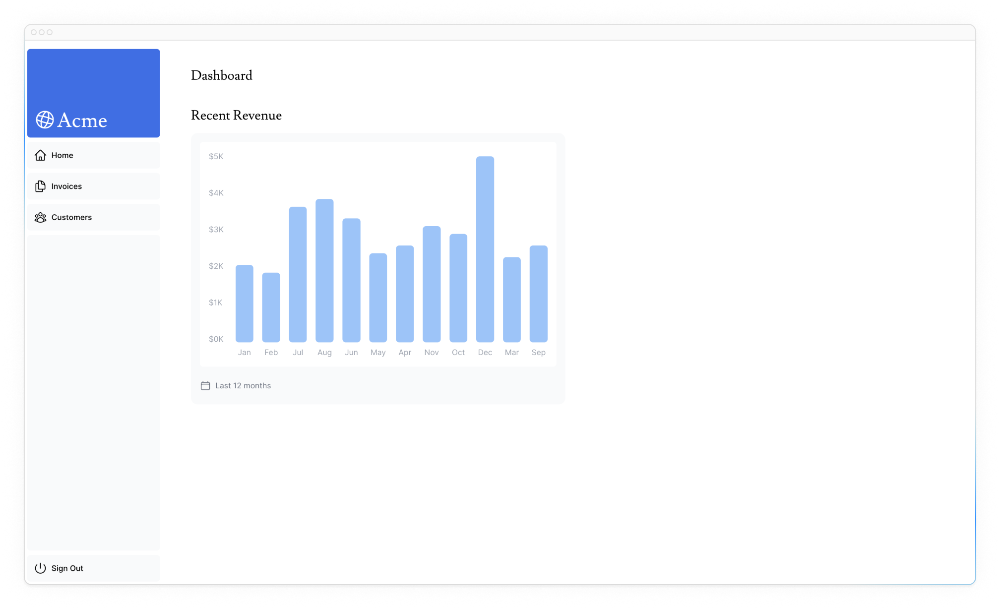

<!--
[스크립트]
이제 실제로 데이터를 가져오는 코드를 추가합니다.

`fetchRevenue()`를 import하고, 페이지 함수 안에서 `await fetchRevenue()`를 호출합니다. 가져온 `revenue` 데이터를 `<RevenueChart revenue={revenue} />`로 넘겨줍니다.

`fetchRevenue()`는 `data.ts`에 정의된 함수입니다. 내부적으로 `SELECT * FROM revenue` SQL을 실행합니다.

코드를 저장하면 대시보드에 매출 차트가 나타납니다. 실제 DB 데이터가 UI에 그려지는 첫 순간입니다.

전환: 최근 인보이스 5개는 조금 다른 방식으로 가져옵니다.
시간: 1.5분
-->

---

## LatestInvoices — SQL로 5개만

<div class="pt-4 text-base">

데이터를 다 가져와서 JS로 정렬할 수도 있지만, 데이터가 커지면 비효율적입니다. SQL로 한 번에 5개만 요청합니다.

</div>

```typescript
const data = await sql<LatestInvoiceRaw[]>`
  SELECT invoices.amount, customers.name, customers.image_url, customers.email
  FROM invoices
  JOIN customers ON invoices.customer_id = customers.id
  ORDER BY invoices.date DESC
  LIMIT 5`;
```

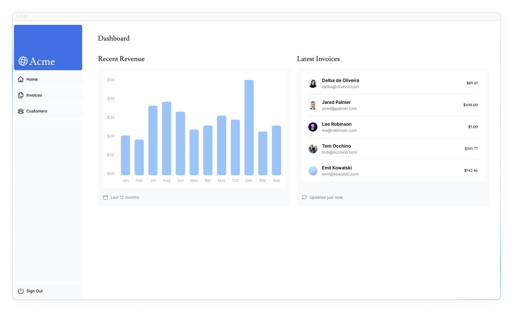

<!--
[스크립트]
최근 인보이스 5개를 가져오는 쿼리입니다.

만약 모든 인보이스를 가져와서 JavaScript로 `sort`하고 `slice(0, 5)`를 하면 어떨까요? 인보이스가 1,000개라면 1,000개를 전송하고 995개를 버립니다. 낭비입니다.

SQL에서 `ORDER BY invoices.date DESC LIMIT 5`를 쓰면, DB가 처음부터 5개만 반환합니다. 데이터 전송량이 훨씬 적습니다.

이게 SQL을 직접 쓸 때의 장점입니다. ORM을 쓰면 이런 최적화가 쉽지 않습니다.

JOIN도 주목해 주세요. invoices 테이블과 customers 테이블을 customer_id로 연결해서 한 번에 가져옵니다. 두 번 쿼리할 필요가 없습니다.

전환: 이제 대시보드가 모두 채워진 모습을 봅시다.
시간: 2분
-->

---

## 모두 채워진 대시보드 미리보기

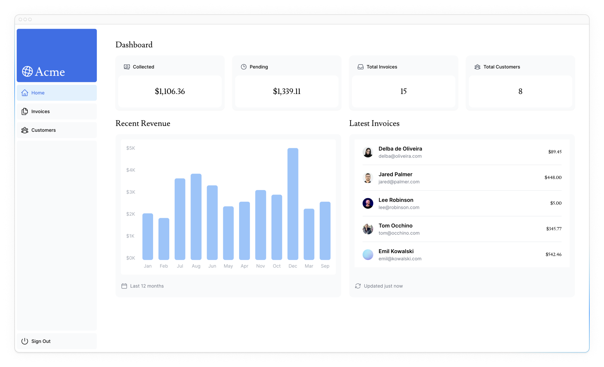

<div class="pt-3 text-sm opacity-70 text-center">

Card 4개 + RevenueChart + LatestInvoices가 모두 데이터로 채워진 모습.

</div>

<!--
[스크립트]
이게 최종 대시보드입니다.

상단에 Collected, Pending, Total Invoices, Total Customers 카드 4개, 왼쪽에 매출 차트, 오른쪽에 최근 인보이스 5개가 보입니다.

하드코딩된 데이터 대신 실제 DB 데이터로 채워진 진짜 앱이 됐습니다.

전환: 카드 데이터 패칭은 여러분이 직접 해볼 차례입니다.
시간: 1분
-->

---

## 🛠 실습: Card 데이터 패칭

<div class="pt-4 text-base">

4개 카드(Collected, Pending, Total Invoices, Total Customers)에 들어갈 데이터를 `fetchCardData()`로 가져옵니다.

</div>

```typescript
const {
  numberOfCustomers,
  numberOfInvoices,
  totalPaidInvoices,
  totalPendingInvoices,
} = await fetchCardData();
```

<div class="pt-3 text-sm opacity-80">

전체 인보이스를 가져와 `Array.length`로 세는 대신 SQL로 카운트만 가져옵니다 — 데이터 전송이 훨씬 가볍습니다.

</div>

<!--
[스크립트]
카드 4개 데이터를 가져오는 실습입니다.

`fetchCardData()`를 호출하면 한 번에 4가지 값이 반환됩니다. 구조 분해로 꺼내서 각 `<Card>` 컴포넌트에 props로 전달하면 됩니다.

SQL 최적화 포인트가 있습니다. 인보이스 개수를 구할 때 전체 데이터를 가져와서 `array.length`로 세면 비효율적입니다. `SELECT COUNT(*) FROM invoices`처럼 DB에서 카운트를 직접 계산하면 숫자 하나만 전송됩니다.

이 실습을 직접 해보세요. `data.ts`에 이미 `fetchCardData` 함수가 있으니 import하고 `await`하면 됩니다.

전환: 데이터 패칭을 구현하다 보면 두 가지 함정이 있습니다.
시간: 2분
-->

---

## ⚠️ 주의 두 가지

<div class="pt-6 grid grid-cols-2 gap-4">

<div class="bg-red-900/20 border border-red-500/40 p-4 rounded">

### 1. Request Waterfall
의도치 않게 요청이 **순차적** 으로 실행됨 → 페이지 전체가 가장 느린 요청을 기다림

</div>

<div class="bg-red-900/20 border border-red-500/40 p-4 rounded">

### 2. 기본 Static Rendering
Next.js는 기본적으로 빌드 타임에 렌더링 → DB가 바뀌어도 UI가 안 바뀜

</div>

</div>

<div class="pt-6 text-base opacity-80">

다음 챕터(9, 10)에서 차례로 해결합니다.

</div>

<!--
[스크립트]
데이터 패칭에서 주의할 두 가지가 있습니다.

첫 번째는 Request Waterfall입니다. 페이지에서 여러 데이터를 순차적으로 `await`하면, 앞의 요청이 끝나야 다음 요청이 시작됩니다. 한 요청이 3초 걸리면 페이지 전체가 3초 동안 빈 화면입니다.

두 번째는 기본 Static Rendering입니다. Next.js는 기본적으로 빌드 타임에 페이지를 렌더링하고 캐시합니다. 그래서 DB 데이터가 바뀌어도 페이지가 업데이트되지 않습니다. 대시보드는 실시간 데이터가 필요하므로 이 동작을 바꿔야 합니다.

두 문제 모두 다음 챕터에서 해결합니다.

전환: 먼저 Waterfall 문제를 더 자세히 살펴봅니다.
시간: 2분
-->

---

## Request Waterfall이란?

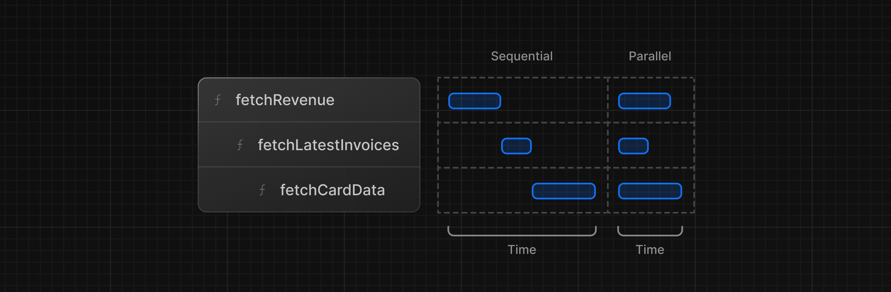

<div class="pt-3 text-sm opacity-70 text-center">

위: 순차 패칭(waterfall) — 한 요청이 끝나야 다음 요청. 아래: 병렬 패칭 — 동시에 시작.

</div>

<!--
[스크립트]
이 그림이 Waterfall을 잘 설명합니다.

위쪽 그림: A 요청이 끝나야 B가 시작되고, B가 끝나야 C가 시작됩니다. 각각 1초씩 걸리면 총 3초입니다.

아래쪽 그림: A, B, C가 동시에 시작됩니다. 가장 오래 걸리는 요청만큼만 기다리면 됩니다.

의도적으로 순차 실행이 필요한 경우도 있습니다. 예를 들어 사용자 ID를 먼저 가져온 뒤, 그 ID로 프로필을 조회해야 하는 경우입니다. 하지만 서로 독립적인 요청이라면 병렬로 처리해야 합니다.

전환: JavaScript에서 병렬 패칭을 구현하는 방법을 봅시다.
시간: 1.5분
-->

---

## 병렬 데이터 패칭

JS의 `Promise.all()` 또는 `Promise.allSettled()`로 동시에 시작.

```typescript
export async function fetchCardData() {
  try {
    const invoiceCountPromise = sql`SELECT COUNT(*) FROM invoices`;
    const customerCountPromise = sql`SELECT COUNT(*) FROM customers`;
    const invoiceStatusPromise = sql`SELECT
         SUM(CASE WHEN status = 'paid' THEN amount ELSE 0 END) AS "paid",
         SUM(CASE WHEN status = 'pending' THEN amount ELSE 0 END) AS "pending"
         FROM invoices`;

    const data = await Promise.all([
      invoiceCountPromise,
      customerCountPromise,
      invoiceStatusPromise,
    ]);
    // ...
  }
}
```

<div class="pt-2 text-sm opacity-80">

⚠️ 단점: 한 요청이 느리면 **전체** 가 그만큼 기다립니다 (다음 챕터에서 streaming으로 해결).

</div>

<!--
[스크립트]
`fetchCardData()`의 구현을 보면 이 패턴을 볼 수 있습니다.

먼저 세 쿼리를 각각 `Promise`로 만들지만 아직 `await`하지 않습니다. 그 다음 `Promise.all([...])` 하나로 세 개를 동시에 시작하고 모두 완료될 때까지 기다립니다.

이전에 `await sql1; await sql2; await sql3;`으로 순차 실행했다면, 이제 세 쿼리가 동시에 실행됩니다.

단점도 있습니다. `Promise.all`은 가장 느린 요청을 기다립니다. 하나가 5초 걸리면 나머지가 1초 안에 끝나도 5초를 기다려야 합니다. 다음 챕터의 Streaming으로 이 문제를 해결합니다.

[Q&A 대비]
Q: `Promise.allSettled`는 언제 쓰나요?
A: 일부 요청이 실패해도 나머지 결과를 쓰고 싶을 때 씁니다. `Promise.all`은 하나라도 실패하면 전체 실패입니다.

전환: 챕터 8을 정리하겠습니다.
시간: 2분
-->

---

## 📦 챕터 정리

<div class="bg-emerald-900/30 border border-emerald-500/40 rounded p-5 mt-8">

1. **Server Components** + **`async/await`** = 가장 단순한 데이터 패칭.
2. SQL을 직접 써서 **필요한 만큼만** 가져오면 효율적.
3. 의도치 않은 **request waterfall** 을 조심하세요.
4. `Promise.all()`로 **병렬 패칭** 하면 빨라집니다.
5. 다음 챕터에서 정적/동적 렌더링과 streaming으로 더 발전시킵니다.

</div>

<!--
[스크립트]
챕터 8 정리입니다.

Server Components에서 `async/await`로 데이터를 가져오는 것이 Next.js에서 가장 기본적인 패턴입니다. 클라이언트에서 `useEffect`를 쓸 필요가 없습니다.

SQL로 정확히 필요한 만큼만 가져오면 성능이 좋습니다. Waterfall을 피하려면 독립적인 요청은 `Promise.all`로 병렬 처리하세요.

다음 두 챕터에서 정적/동적 렌더링과 Streaming으로 더욱 발전된 패턴을 배웁니다.

전환: 먼저 렌더링 전략을 이해해야 합니다.
시간: 1분
-->

---
layout: section
---

# Chapter 9
## 정적 렌더링과 동적 렌더링

<div class="pt-4 text-sm opacity-60">

source: <code>https://nextjs.org/learn/dashboard-app/static-and-dynamic-rendering</code>

</div>

<!--
[스크립트]
Chapter 9, 정적 렌더링과 동적 렌더링입니다.

챕터 8에서 데이터 패칭을 구현했는데, 한 가지 큰 문제가 있습니다. Next.js는 기본적으로 빌드 타임에 페이지를 렌더링합니다. DB 데이터가 바뀌어도 다시 빌드하기 전까지 UI가 업데이트되지 않습니다.

대시보드는 실시간 데이터가 필요합니다. 이 문제를 해결하기 위해 두 가지 렌더링 전략을 이해해야 합니다.

전환: 두 전략의 차이를 봅시다.
시간: 30초
-->

---

## 두 가지 렌더링 전략

<div class="grid grid-cols-2 gap-6 pt-6">

<div class="bg-blue-900/30 border border-blue-500/40 rounded p-5">

### 🧊 Static Rendering
**빌드 타임** 또는 revalidate 시점에 데이터 패칭 + 렌더링.<br/>
모든 사용자에게 같은 캐시된 결과 제공.

</div>

<div class="bg-purple-900/30 border border-purple-500/40 rounded p-5">

### 🔥 Dynamic Rendering
**요청 시점** 마다 사용자별로 서버에서 새로 렌더링.

</div>

</div>

<!--
[스크립트]
두 가지 렌더링 전략입니다.

Static Rendering은 빌드 타임 또는 revalidate 시점에 한 번만 데이터를 가져오고 렌더링합니다. 결과가 캐시되어 CDN에 배포됩니다. 모든 사용자가 같은 캐시된 HTML을 받습니다.

Dynamic Rendering은 반대입니다. 사용자가 요청할 때마다 서버에서 새로 렌더링합니다. 최신 데이터, 개인화된 콘텐츠, 쿠키나 URL 파라미터 같은 요청 시점 정보를 활용할 수 있습니다.

대시보드는 어떤 방식이 맞을까요? 실시간 데이터, 개인화된 내용 — Dynamic Rendering이 필요합니다.

전환: Static Rendering이 언제 좋은지 더 살펴봅시다.
시간: 2분
-->

---

## Static Rendering의 장점

<div class="grid grid-cols-3 gap-3 pt-6 text-sm">

<div class="bg-slate-800/50 p-3 rounded">

**⚡ 빠른 사이트**

미리 렌더링 후 캐시 → CDN으로 글로벌 분산

</div>

<div class="bg-slate-800/50 p-3 rounded">

**💸 서버 부하 감소**

요청마다 새로 만들 필요 없음

</div>

<div class="bg-slate-800/50 p-3 rounded">

**🔍 SEO 친화**

크롤러가 즉시 콘텐츠 인덱싱

</div>

</div>

<div class="pt-6 text-base opacity-80">

**적합**: 데이터가 없거나, 모든 사용자에게 같은 콘텐츠인 경우 (블로그, 마케팅 페이지, 제품 페이지).

</div>

<div class="pt-3 text-base opacity-80">

**부적합**: 사용자별 개인화 데이터가 자주 바뀌는 대시보드.

</div>

<!--
[스크립트]
Static Rendering의 장점입니다.

빠른 사이트가 됩니다. 미리 렌더링된 HTML이 CDN에 캐시되어 전 세계에 분산됩니다. 서울 사용자는 서울에서 가까운 CDN에서 받습니다.

서버 부하도 줄어듭니다. 요청마다 새로 렌더링하지 않아도 됩니다.

SEO도 좋습니다. 검색 엔진 크롤러가 왔을 때 이미 HTML이 준비되어 있으니 바로 인덱싱할 수 있습니다.

블로그 글, 마케팅 페이지, 제품 상세 페이지처럼 모든 사람에게 같은 콘텐츠를 보여주는 경우에 적합합니다. 하지만 우리 대시보드처럼 사용자별 실시간 데이터가 필요한 경우는 Dynamic Rendering을 써야 합니다.

전환: Dynamic의 장점도 살펴봅니다.
시간: 1.5분
-->

---

## Dynamic Rendering의 장점

<div class="grid grid-cols-3 gap-3 pt-6 text-sm">

<div class="bg-slate-800/50 p-3 rounded">

**📊 실시간 데이터**

자주 바뀌는 데이터에 적합

</div>

<div class="bg-slate-800/50 p-3 rounded">

**👤 개인화**

대시보드, 사용자 프로필

</div>

<div class="bg-slate-800/50 p-3 rounded">

**🔑 요청 시점 정보**

쿠키, URL search params 활용

</div>

</div>

<div class="pt-6 text-lg text-center">

우리가 만드는 대시보드는 **dynamic** 입니다.

</div>

<!--
[스크립트]
Dynamic Rendering의 장점입니다.

실시간 데이터를 보여줄 수 있습니다. 요청할 때마다 DB에서 최신 데이터를 가져옵니다.

개인화도 됩니다. 같은 URL이라도 로그인한 사용자에 따라 다른 내용을 보여줄 수 있습니다.

요청 시점 정보를 활용할 수 있습니다. 쿠키에서 세션을 읽거나, URL 파라미터로 필터를 적용하는 것이 자연스럽습니다.

우리 대시보드는 실시간 인보이스 데이터를 보여주고 사용자별로 다를 수 있으니 Dynamic Rendering이 맞습니다.

💡 혼동 포인트: "Next.js에서 Dynamic Rendering으로 어떻게 바꾸나요?" → 컴포넌트에서 `cookies()`, `headers()`, `searchParams`를 쓰거나 `unstable_noStore()`를 호출하면 Next.js가 자동으로 Dynamic으로 전환합니다.

전환: Dynamic Rendering의 함정을 실습으로 직접 느껴봅시다.
시간: 2분
-->

---

## 🛠 실습: 느린 데이터 요청 시뮬레이션

<div class="pt-4 text-base">

`fetchRevenue()`에 인위적으로 3초 지연을 추가합니다.

</div>

```typescript
// /app/lib/data.ts
export async function fetchRevenue() {
  try {
    console.log('Fetching revenue data...');
    await new Promise((resolve) => setTimeout(resolve, 3000));

    const data = await sql<Revenue[]>`SELECT * FROM revenue`;

    console.log('Data fetch completed after 3 seconds.');
    return data;
  } catch (error) {
    console.error('Database Error:', error);
    throw new Error('Failed to fetch revenue data.');
  }
}
```

<div class="pt-2 text-sm opacity-80">

⚠️ 데모용입니다. production에서 절대 하지 마세요.

</div>

<!--
[스크립트]
Dynamic Rendering의 문제점을 직접 느껴보는 실습입니다.

`fetchRevenue()` 함수에 3초 인위 지연을 추가합니다. `await new Promise((resolve) => setTimeout(resolve, 3000))` 한 줄을 실제 쿼리 앞에 넣습니다.

이제 대시보드를 새로고침하면 — 3초 동안 빈 화면이 됩니다. 다른 카드 데이터는 이미 준비됐는데도, `fetchRevenue`가 끝날 때까지 아무것도 표시되지 않습니다.

이게 Dynamic Rendering에서 발생하는 함정입니다. 한 느린 요청이 페이지 전체를 막습니다. 이것을 Streaming으로 해결합니다.

주의: 실습 후에는 반드시 지연 코드를 제거하거나 주석 처리하세요.

전환: 이 현상을 정리하고 Streaming 챕터로 넘어갑니다.
시간: 2분
-->

---

## 결과: 페이지가 통째로 막힘

<div class="pt-8 text-2xl text-center">

**Dynamic rendering에서 페이지는<br/>가장 느린 데이터 요청만큼만 빠릅니다.**

</div>

<div class="pt-12 text-base opacity-80 text-center">

다음 챕터에서 **streaming** 으로 이 문제를 해결합니다.

</div>

<!--
[스크립트]
이것이 Dynamic Rendering의 핵심 제약입니다.

"Dynamic rendering에서 페이지는 가장 느린 데이터 요청만큼만 빠릅니다."

카드 데이터가 100ms, 최근 인보이스가 200ms, 매출 차트가 3000ms라면 — 페이지는 3초 후에야 보입니다. 3초 동안 사용자는 빈 화면을 봅니다.

이 문제를 다음 챕터에서 Streaming으로 해결합니다. 준비된 데이터부터 먼저 보여줘서 사용자가 빈 화면을 보는 시간을 줄입니다.

전환: 챕터 9를 정리하겠습니다.
시간: 1분
-->

---

## 📦 챕터 정리

<div class="bg-emerald-900/30 border border-emerald-500/40 rounded p-5 mt-8">

1. **Static Rendering** = 빌드 타임 렌더링 + 캐시. 빠르고 SEO 친화적.
2. **Dynamic Rendering** = 요청 시점 렌더링. 실시간·개인화에 적합.
3. 우리 대시보드는 dynamic.
4. Dynamic의 함정: **느린 한 요청이 전체 페이지를 막음**.
5. 다음 챕터에서 **streaming** 으로 해결합니다.

</div>

<!--
[스크립트]
챕터 9 정리입니다.

Static Rendering은 빌드 타임에 한 번 렌더링하고 캐시합니다. 빠르고 SEO에 좋지만, 실시간 데이터가 없는 콘텐츠에 적합합니다.

Dynamic Rendering은 요청마다 서버에서 렌더링합니다. 실시간 데이터와 개인화에 적합하지만, 느린 요청이 전체 페이지를 막는 문제가 있습니다.

우리 대시보드는 Dynamic을 써야 하는데, 그 함정인 "느린 요청이 전체를 막는 문제"를 다음 챕터에서 Streaming으로 해결합니다.

전환: Streaming 챕터가 이번 코스에서 가장 인상적인 부분 중 하나입니다.
시간: 1분
-->

---
layout: section
---

# Chapter 10
## Streaming

<div class="pt-4 text-sm opacity-60">

source: <code>https://nextjs.org/learn/dashboard-app/streaming</code>

</div>

<!--
[스크립트]
Chapter 10, Streaming입니다.

챕터 9에서 Dynamic Rendering의 문제점을 봤습니다. 느린 요청 하나가 페이지 전체를 막습니다. Streaming이 이것을 해결합니다.

Streaming은 현대 웹 앱에서 UX를 크게 개선할 수 있는 강력한 기법입니다.

전환: Streaming이 정확히 무엇인지 봅시다.
시간: 30초
-->

---

## Streaming이란?

<div class="pt-4 text-lg space-y-3">

라우트를 작은 **chunk** 로 쪼개어, 준비된 chunk부터 **순차적으로** 클라이언트로 흘려보내는 기법.

</div>

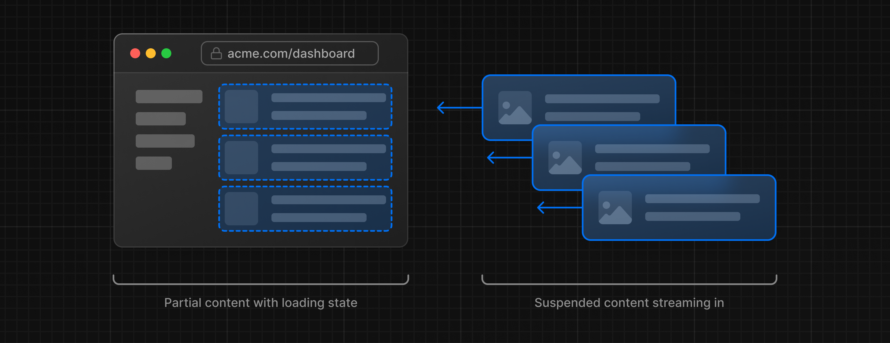

<div class="pt-3 text-sm opacity-70 text-center">

느린 데이터 요청이 페이지 전체를 막지 못합니다.

</div>

<!--
[스크립트]
Streaming의 핵심 아이디어입니다.

기존 방식은 서버가 모든 것을 다 준비한 다음 한 번에 전송했습니다. 모든 데이터가 준비될 때까지 사용자는 기다려야 합니다.

Streaming은 라우트를 작은 chunk로 쪼갭니다. 각 chunk는 준비되는 즉시 클라이언트로 전송됩니다. 느린 요청이 있어도 다른 부분들은 먼저 화면에 나타납니다.

마치 유튜브 영상을 볼 때 전체 다운로드 전에도 바로 재생이 시작되는 것처럼요. 데이터 스트림을 여러 조각으로 흘려보내는 것입니다.

전환: 시간적으로 어떤 효과가 있는지 봅시다.
시간: 2분
-->

---

## Streaming의 시간 효과

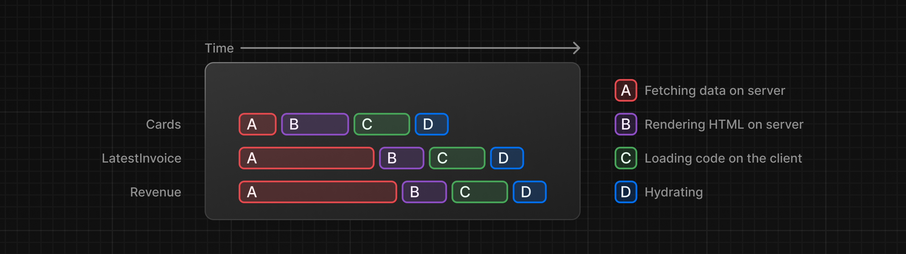

<div class="pt-3 text-sm opacity-70 text-center">

각 chunk가 준비되는 즉시 사용자에게 도착 → 첫 화면(TTFB)이 빨라지고, 점진적으로 채워집니다.

</div>

<!--
[스크립트]
이 그림에서 차이를 명확히 볼 수 있습니다.

기존 방식: 1번 요청, 2번 요청, 3번 요청이 모두 완료된 후 한 번에 페이지가 보입니다. 가장 오래 걸리는 것까지 기다려야 합니다.

Streaming 방식: 각 chunk가 준비되는 순서대로 도착합니다. 빠른 것들은 먼저 화면에 보이고, 느린 것만 나중에 채워집니다.

TTFB(Time To First Byte)가 빨라집니다. 사용자가 첫 화면을 보는 시간이 줄어듭니다. 실제 로딩 시간은 같아도 UX가 훨씬 좋아집니다.

전환: 두 가지 구현 방법이 있습니다.
시간: 1.5분
-->

---

## 두 가지 구현 방법

<div class="grid grid-cols-2 gap-6 pt-6">

<div class="bg-slate-800/50 p-4 rounded">

### 1. 페이지 단위
**`loading.tsx`** 파일을 만든다.<br/>
Next.js가 자동으로 `<Suspense>` 로 감쌈.

</div>

<div class="bg-slate-800/50 p-4 rounded">

### 2. 컴포넌트 단위
**`<Suspense>`** 를 직접 사용해 더 세밀하게 제어.

</div>

</div>

<!--
[스크립트]
Streaming 구현 방법은 두 가지입니다.

첫 번째는 `loading.tsx` 파일입니다. 페이지 단위로 스트리밍을 적용합니다. 파일 하나를 만들면 Next.js가 자동으로 `<Suspense>`로 감싸줍니다. 간단하지만 제어 범위가 페이지 전체입니다.

두 번째는 `<Suspense>` 직접 사용입니다. 컴포넌트 단위로 더 세밀하게 제어할 수 있습니다. 어떤 컴포넌트를 언제 스트리밍할지 직접 결정합니다.

먼저 쉬운 첫 번째 방법부터 봅시다.

전환: loading.tsx 파일을 만드는 방법입니다.
시간: 1.5분
-->

---

## loading.tsx로 페이지 전체 streaming

`/app/dashboard/loading.tsx` 생성:

```typescript
export default function Loading() {
  return <div>Loading...</div>;
}
```

<div class="pt-6 grid grid-cols-3 gap-3 text-sm">

<div class="bg-slate-800/50 p-3 rounded">

✅ 정적인 SideNav는 즉시 표시

</div>

<div class="bg-slate-800/50 p-3 rounded">

✅ 동적 콘텐츠 로딩 중 fallback 표시

</div>

<div class="bg-slate-800/50 p-3 rounded">

✅ 사용자는 페이지 끝나기 전에도 다른 곳으로 이동 가능

</div>

</div>

<!--
[스크립트]
`/app/dashboard/loading.tsx` 파일을 만들기만 하면 됩니다.

내용이 단순합니다. Loading 컴포넌트를 export하면, Next.js가 대시보드 페이지를 자동으로 `<Suspense>`로 감싸고, 데이터 로딩 중에 이 컴포넌트를 보여줍니다.

세 가지 변화가 생깁니다. 정적인 SideNav는 데이터와 무관하게 즉시 표시됩니다. 동적 콘텐츠가 로딩 중일 때 fallback UI가 보입니다. 사용자가 로딩이 끝나기 전에도 다른 페이지로 이동할 수 있습니다.

`next dev`를 켜고 대시보드를 새로고침하면 차이를 바로 느낄 수 있습니다.

전환: 어떻게 보이는지 화면을 봅시다.
시간: 2분
-->

---

## 로딩 화면

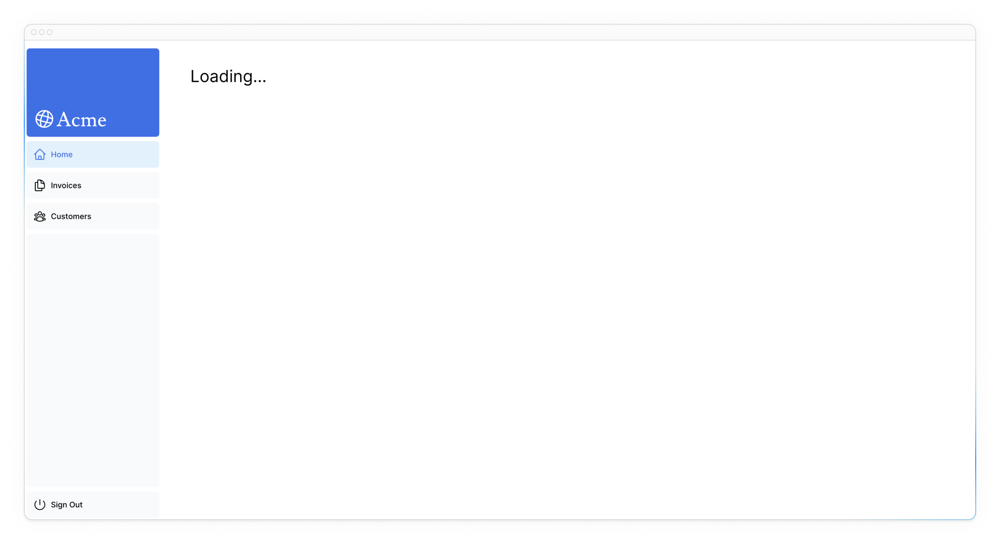

<div class="pt-3 text-sm opacity-70 text-center">

SideNav는 그대로, 본문 영역만 "Loading..." 표시.

</div>

<!--
[스크립트]
이게 로딩 중 화면입니다.

SideNav는 그대로 표시됩니다. 왜냐면 SideNav는 데이터를 패칭하지 않는 정적 컴포넌트이기 때문입니다.

본문 영역에는 "Loading..." 텍스트가 보입니다. 데이터가 준비되면 자동으로 실제 콘텐츠로 교체됩니다.

이 정도로도 훨씬 낫습니다. 3초 동안 완전히 빈 화면이 아니라 사이드바라도 보입니다. 하지만 더 좋게 만들 수 있습니다.

전환: 스켈레톤 UI를 사용하면 더 전문적입니다.
시간: 1.5분
-->

---

## 로딩 스켈레톤

<div class="pt-4 text-base">

스켈레톤 = 콘텐츠가 로딩 중임을 알려주는 **간소화된 UI** 모형.

</div>

```typescript
// /app/dashboard/loading.tsx
import DashboardSkeleton from '@/app/ui/skeletons';

export default function Loading() {
  return <DashboardSkeleton />;
}
```

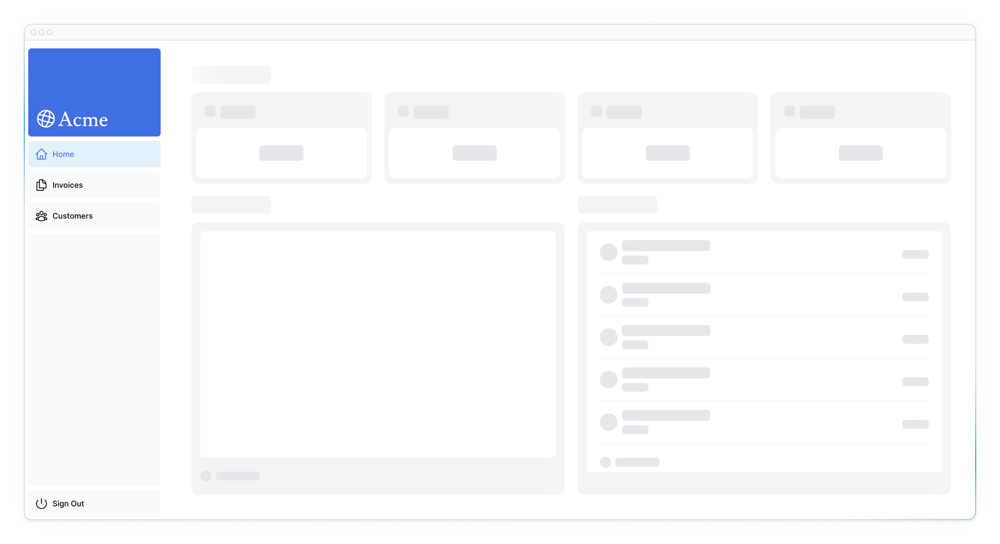

<!--
[스크립트]
`Loading()` 컴포넌트를 스켈레톤으로 바꾸면 훨씬 전문적입니다.

스켈레톤은 실제 콘텐츠의 모양을 회색 블록으로 미리 보여주는 UI입니다. 카드 4개, 차트, 인보이스 리스트 자리가 비슷한 형태의 회색 모형으로 채워져 있습니다.

`DashboardSkeleton` 컴포넌트가 이미 `app/ui/skeletons.tsx`에 만들어져 있습니다. import하고 반환하면 됩니다.

이걸 보는 사용자는 "아, 데이터가 로딩 중이구나. 곧 나오겠지"라고 직관적으로 알 수 있습니다. 빈 화면보다 신뢰감을 줍니다.

전환: 그런데 이 `loading.tsx`가 너무 많은 곳에 적용되면 문제가 됩니다.
시간: 1.5분
-->

---

## Route Groups: () 로 폴더 묶기

<div class="pt-4 text-base">

`loading.tsx`가 **dashboard 페이지에만** 적용되도록 라우트를 그룹화합니다. 폴더 이름을 `()`로 감싸면 URL 경로에는 영향이 없습니다.

</div>


<div class="pt-3 text-sm opacity-80 text-center">

`/dashboard/(overview)/page.tsx` → URL은 그대로 `/dashboard`. <br/>
큰 앱에서 `(marketing)`, `(shop)` 같은 섹션 분리에도 유용.

</div>

<!--
[스크립트]
Route Groups는 파일 시스템을 논리적으로 그룹화하는 방법입니다.

현재 `/app/dashboard/loading.tsx`는 대시보드 하위의 모든 페이지에 적용됩니다. 인보이스 목록 페이지에도 이 스켈레톤이 보이는 문제가 생깁니다.

해결책이 Route Groups입니다. `dashboard` 폴더 아래에 `(overview)` 폴더를 만들고, `page.tsx`와 `loading.tsx`를 그 안으로 옮깁니다. 괄호`()`로 감싼 폴더 이름은 URL에 포함되지 않습니다.

그래서 URL은 여전히 `/dashboard`이지만, `loading.tsx`는 `(overview)` 그룹에만 적용됩니다. 인보이스 페이지는 영향받지 않습니다.

💡 혼동 포인트: "왜 괄호 안의 이름은 URL에 포함 안 되나요?" → Next.js의 특별한 컨벤션입니다. 폴더 이름이 `()`로 감싸져 있으면 URL 경로에 반영하지 않습니다.

전환: 이제 더 세밀한 컴포넌트 단위 Streaming을 봅시다.
시간: 2분
-->

---

## 컴포넌트 단위 streaming — &lt;Suspense&gt;

페이지 전체가 아니라 **느린 컴포넌트만** 격리할 수 있습니다.

```typescript {2-3,16-18}
import { Suspense } from 'react';
import { RevenueChartSkeleton } from '@/app/ui/skeletons';

export default async function Page() {
  const latestInvoices = await fetchLatestInvoices();
  const { /* card data */ } = await fetchCardData();

  return (
    <main>
      <h1>Dashboard</h1>
      <div>{/* Cards */}</div>
      <div className="mt-6 grid grid-cols-1 gap-6 md:grid-cols-4 lg:grid-cols-8">
        <Suspense fallback={<RevenueChartSkeleton />}>
          <RevenueChart />
        </Suspense>
        <LatestInvoices latestInvoices={latestInvoices} />
      </div>
    </main>
  );
}
```

<!--
[스크립트]
컴포넌트 단위 Streaming입니다.

`<Suspense>` 컴포넌트로 `<RevenueChart />`만 감쌉니다. `fallback`에 `<RevenueChartSkeleton />`을 넣습니다.

이제 `RevenueChart`가 데이터를 가져오는 동안 그 자리에 스켈레톤이 보입니다. 다른 컴포넌트들은 영향받지 않고 바로 표시됩니다.

그런데 한 가지 문제가 있습니다. `fetchLatestInvoices`와 `fetchCardData`는 여전히 `page.tsx`에서 `await`합니다. `RevenueChart`만 Suspense로 감쌌는데, 다른 두 요청이 느리면 페이지가 막힙니다.

이걸 완전히 해결하려면 데이터 패칭을 각 컴포넌트로 옮겨야 합니다.

전환: 그게 다음 슬라이드에서 할 일입니다.
시간: 2분
-->

---

## 데이터 패칭을 컴포넌트로 옮기기

```typescript {6,11}
// /app/ui/dashboard/revenue-chart.tsx
import { generateYAxis } from '@/app/lib/utils';
import { CalendarIcon } from '@heroicons/react/24/outline';
import { lusitana } from '@/app/ui/fonts';
import { fetchRevenue } from '@/app/lib/data';

// ...

export default async function RevenueChart() {
  const revenue = await fetchRevenue();

  if (!revenue || revenue.length === 0) {
    return <p className="mt-4 text-gray-400">No data available.</p>;
  }

  return (/* ... */);
}
```

<div class="pt-2 text-sm opacity-80">

이렇게 하면 `fetchRevenue()`가 page 레벨에서 분리되어 다른 컴포넌트의 렌더링을 막지 않습니다.

</div>

<!--
[스크립트]
핵심 패턴입니다. 데이터 패칭을 그것을 필요로 하는 컴포넌트로 내리는 것입니다.

기존에는 `page.tsx`에서 `fetchRevenue()`를 호출하고 `revenue`를 props로 내려줬습니다.

이제 `RevenueChart` 컴포넌트 안에서 직접 `fetchRevenue()`를 호출합니다. 이 컴포넌트를 `<Suspense>`로 감싸면, 이 컴포넌트만 독립적으로 스트리밍됩니다.

`page.tsx`는 더 이상 `fetchRevenue()`를 기다리지 않습니다. 다른 컴포넌트들이 블로킹되지 않습니다.

전환: 카드는 4개인데, 하나씩 따로 스트리밍하면 문제가 생깁니다.
시간: 2분
-->

---

## 컴포넌트 그룹핑 — staggered 효과

<div class="pt-4 text-base">

카드를 하나씩 따로 streaming 하면 **'팝핑(popping)' 효과** 가 나서 산만합니다. 카드를 하나의 wrapper로 묶어 한 번에 보여주면 더 자연스럽습니다.

</div>

```typescript
// /app/ui/dashboard/cards.tsx
import { fetchCardData } from '@/app/lib/data';

export default async function CardWrapper() {
  const {
    numberOfInvoices,
    numberOfCustomers,
    totalPaidInvoices,
    totalPendingInvoices,
  } = await fetchCardData();

  return (
    <>
      <Card title="Collected" value={totalPaidInvoices} type="collected" />
      <Card title="Pending" value={totalPendingInvoices} type="pending" />
      <Card title="Total Invoices" value={numberOfInvoices} type="invoices" />
      <Card title="Total Customers" value={numberOfCustomers} type="customers" />
    </>
  );
}
```

<!--
[스크립트]
카드 4개를 각각 따로 `<Suspense>`로 감싸면 어떻게 될까요? 데이터가 도착하는 순서에 따라 카드들이 하나씩 팝하듯 나타납니다. 이것을 'popping' 효과라고 하는데, 산만하고 불안정해 보입니다.

더 자연스러운 방법은 `CardWrapper`라는 래퍼 컴포넌트로 4개의 카드를 감싸는 겁니다. `CardWrapper` 안에서 `fetchCardData()`를 호출합니다.

이제 `<Suspense><CardWrapper /></Suspense>`로 감싸면, 4개 카드가 한 번에 나타납니다. 더 자연스럽습니다.

컴포넌트를 어떻게 그룹화할지는 UX 관점에서 결정합니다.

전환: 그럼 Suspense 경계를 어디에 둘지 원칙을 정리해 봅시다.
시간: 2분
-->

---

## Suspense 경계는 어디에 둘까

<div class="pt-4 text-base space-y-2">

세 가지를 고려:

</div>

<div class="pt-2 grid grid-cols-3 gap-3 text-sm">

<div class="bg-slate-800/50 p-3 rounded">

**1. UX 흐름**

페이지가 어떤 순서로 보이길 원하나

</div>

<div class="bg-slate-800/50 p-3 rounded">

**2. 우선 콘텐츠**

먼저 보여줄 핵심이 무엇인가

</div>

<div class="bg-slate-800/50 p-3 rounded">

**3. 데이터 의존성**

어떤 컴포넌트가 데이터 패칭이 필요한가

</div>

</div>

<div class="pt-6 text-base opacity-80 bg-blue-900/30 border border-blue-500/40 rounded p-3">

💡 **일반 원칙**: 데이터 패칭을 그것이 필요한 컴포넌트로 내리고, 그 컴포넌트를 `<Suspense>`로 감싸세요.

</div>

<!--
[스크립트]
Suspense 경계를 어디에 둘지 결정할 때 세 가지를 고려합니다.

첫째, UX 흐름입니다. 사용자가 어떤 순서로 콘텐츠를 보기 원하는지 생각하세요.

둘째, 우선 콘텐츠입니다. 먼저 보여줄 핵심 정보가 무엇인지 결정하세요. 카드 요약 데이터가 차트보다 중요하다면 카드를 먼저 보여주세요.

셋째, 데이터 의존성입니다. 어떤 컴포넌트가 느린 데이터를 필요로 하는지 파악하세요. 그 컴포넌트만 격리하세요.

일반 원칙은 하나입니다. 데이터 패칭을 그것이 필요한 컴포넌트로 내리고, 그 컴포넌트를 `<Suspense>`로 감싸세요.

전환: 결과 화면을 보겠습니다.
시간: 2분
-->

---

## 결과 화면

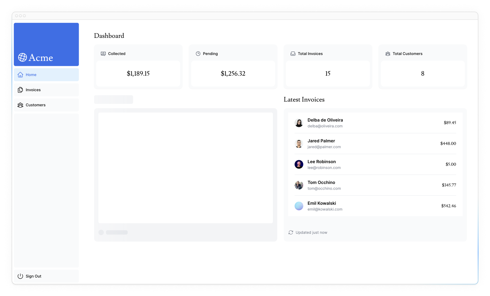

<div class="pt-3 text-sm opacity-70 text-center">

다른 컴포넌트는 즉시 보이고, 느린 RevenueChart만 스켈레톤 → 데이터가 도착하면 교체.

</div>

<!--
[스크립트]
결과입니다.

카드 4개와 최근 인보이스는 이미 데이터가 있어 즉시 보입니다. RevenueChart 자리에는 스켈레톤이 보입니다. 그리고 잠시 후 차트 데이터가 도착하면 스켈레톤이 실제 차트로 교체됩니다.

챕터 9에서 봤던 "3초 동안 빈 화면" 문제가 해결됐습니다. 이제 3초가 지나도 대부분의 UI가 보이고, 차트만 나중에 채워집니다.

이것이 Streaming의 핵심 가치입니다. 전체 로딩 시간은 같아도 사용자가 느끼는 경험이 완전히 달라집니다.

전환: 챕터 10을 정리하겠습니다.
시간: 1.5분
-->

---

## 📦 챕터 정리

<div class="bg-emerald-900/30 border border-emerald-500/40 rounded p-5 mt-8">

1. **Streaming** = chunk 단위로 점진적 전송. 느린 요청이 전체를 막지 않음.
2. 페이지 단위: **`loading.tsx`** (자동 Suspense).
3. 컴포넌트 단위: **`<Suspense fallback>`** 으로 직접 제어.
4. **Route Groups `()`** 로 URL은 유지하면서 폴더만 그룹화.
5. 데이터 패칭을 컴포넌트로 내리고, 그 컴포넌트를 Suspense로 감싸는 것이 권장 패턴.

</div>

<!--
[스크립트]
챕터 10 정리입니다.

Streaming은 라우트를 chunk로 나눠서 준비된 것부터 먼저 보내는 기법입니다. Dynamic Rendering의 "느린 요청이 전체를 막는" 문제를 해결합니다.

구현 방법은 두 가지입니다. `loading.tsx`는 페이지 단위로 간단하게 적용됩니다. `<Suspense>`는 컴포넌트 단위로 세밀하게 제어합니다.

Route Groups `()`로 특정 라우트 그룹에만 `loading.tsx`를 적용할 수 있습니다.

핵심 원칙: 데이터 패칭을 컴포넌트로 내리고, 그 컴포넌트를 Suspense로 감싸세요.

전환: 다음은 검색과 페이지네이션을 구현합니다. URL 기반 상태 관리가 핵심입니다.
시간: 1분
-->

---
layout: section
---

# Chapter 11
## 검색과 페이지네이션

<div class="pt-4 text-sm opacity-60">

source: <code>https://nextjs.org/learn/dashboard-app/adding-search-and-pagination</code>

</div>

<!--
[스크립트]
Chapter 11, 검색과 페이지네이션입니다.

인보이스 목록 페이지에 검색 기능과 페이지네이션을 추가합니다. 이 챕터의 핵심은 "검색 상태를 React state가 아니라 URL에 둔다"는 아이디어입니다.

처음에는 낯설 수 있지만, 이 패턴의 장점을 이해하면 많은 상황에서 쓰고 싶어질 겁니다.

전환: 왜 URL을 쓰는지 먼저 이유를 봅시다.
시간: 30초
-->

---

## 왜 URL Search Params를 쓰나

<div class="pt-4 grid grid-cols-3 gap-3 text-sm">

<div class="bg-slate-800/50 p-3 rounded">

**🔖 북마크·공유 가능**

URL 자체에 검색 상태가 들어 있음

</div>

<div class="bg-slate-800/50 p-3 rounded">

**🖥 SSR 친화**

서버에서 직접 읽어 초기 렌더링 가능

</div>

<div class="bg-slate-800/50 p-3 rounded">

**📊 분석·추적**

URL만으로 사용자 행동 추적 용이

</div>

</div>

<div class="pt-6 text-base opacity-80">

검색·필터 같은 UI 상태를 React state 대신 **URL** 에 두는 것이 점점 표준이 되고 있습니다.

</div>

<!--
[스크립트]
왜 React state 대신 URL을 쓸까요?

첫째, 북마크와 공유가 됩니다. 검색어가 URL에 있으면 그 URL을 북마크하거나 팀원에게 공유할 수 있습니다. React state는 새로고침하면 사라집니다.

둘째, SSR과 궁합이 좋습니다. 서버에서 URL 파라미터를 읽어 초기 렌더링에 반영할 수 있습니다. 클라이언트에서 state를 설정하기 전에 이미 올바른 데이터가 표시됩니다.

셋째, 사용자 분석이 쉽습니다. URL만 봐도 어떤 검색을 했는지 알 수 있습니다. 로그와 분석 도구에서 검색 패턴을 파악하기 좋습니다.

이 패턴은 현대 웹 앱에서 점점 표준이 되어가고 있습니다.

[Q&A 대비]
Q: URL이 너무 길어지지 않나요?
A: 적당히 쓰면 괜찮습니다. 검색어와 페이지 번호 정도면 URL이 크게 길어지지 않습니다.

전환: 구현에 쓰는 훅들을 먼저 소개합니다.
시간: 2분
-->

---

## 사용할 클라이언트 훅 3가지

<div class="grid grid-cols-3 gap-3 pt-6 text-sm">

<div class="bg-slate-800/50 p-3 rounded">

**`useSearchParams`**

현재 URL의 파라미터 읽기<br/>
`?page=1&query=pending` → `{page: '1', query: 'pending'}`

</div>

<div class="bg-slate-800/50 p-3 rounded">

**`usePathname`**

현재 경로 읽기<br/>
`/dashboard/invoices` 등

</div>

<div class="bg-slate-800/50 p-3 rounded">

**`useRouter`**

프로그래밍 방식 네비게이션

</div>

</div>

<!--
[스크립트]
이번 구현에서 세 가지 훅을 씁니다. 모두 `next/navigation`에서 import합니다.

`useSearchParams`는 현재 URL의 쿼리 파라미터를 읽습니다. `/invoices?page=2&query=pending`이면 `{page: '2', query: 'pending'}` 같은 객체를 얻습니다.

`usePathname`은 현재 경로를 반환합니다. `/dashboard/invoices`처럼요.

`useRouter`는 코드에서 프로그래밍적으로 네비게이션합니다. 버튼 클릭 없이 URL을 변경할 수 있습니다.

이 세 훅 모두 클라이언트 훅이라서 `'use client'` 컴포넌트에서만 씁니다.

전환: 구현 전에 전체 흐름을 4단계로 정리해봅시다.
시간: 1.5분
-->

---

## 4단계 구현 로드맵

<div class="pt-6 grid grid-cols-2 gap-3 text-sm">

<div class="bg-slate-800/50 p-3 rounded">

**1. Capture user input**

input의 onChange 처리

</div>

<div class="bg-slate-800/50 p-3 rounded">

**2. Update URL with params**

`URLSearchParams` + `router.replace`

</div>

<div class="bg-slate-800/50 p-3 rounded">

**3. Sync URL with input**

`defaultValue` 로 input 채우기

</div>

<div class="bg-slate-800/50 p-3 rounded">

**4. Update the table**

`searchParams` prop을 페이지에서 받아 테이블에 전달

</div>

</div>

<!--
[스크립트]
4단계로 구현합니다.

1단계: 사용자가 검색 input에 타이핑하면 그 값을 캡처합니다. `onChange` 이벤트로 처리합니다.

2단계: 캡처한 값으로 URL을 업데이트합니다. `URLSearchParams`로 파라미터를 만들고 `router.replace`로 URL을 바꿉니다.

3단계: URL과 input을 동기화합니다. 직접 URL로 접근하거나 뒤로 가기를 했을 때 input에도 검색어가 채워져 있어야 합니다.

4단계: 페이지가 `searchParams` prop으로 URL 파라미터를 받아 테이블에 전달합니다. 테이블은 그것으로 DB를 쿼리합니다.

전환: 1단계와 2단계 코드를 봅시다.
시간: 2분
-->

---

## Step 1+2: handleSearch와 URL 갱신

```typescript
'use client';

import { MagnifyingGlassIcon } from '@heroicons/react/24/outline';
import { useSearchParams, usePathname, useRouter } from 'next/navigation';

export default function Search() {
  const searchParams = useSearchParams();
  const pathname = usePathname();
  const { replace } = useRouter();

  function handleSearch(term: string) {
    const params = new URLSearchParams(searchParams);
    if (term) {
      params.set('query', term);
    } else {
      params.delete('query');
    }
    replace(`${pathname}?${params.toString()}`);
  }
}
```

<div class="pt-2 text-sm opacity-80">

`URLSearchParams`는 브라우저 표준 Web API. `router.replace`는 페이지 새로고침 없이 URL만 갱신.

</div>

<!--
[스크립트]
1, 2단계 코드를 봅시다.

`handleSearch` 함수가 핵심입니다. `URLSearchParams`로 현재 파라미터를 복사해서 새 파라미터 객체를 만듭니다. 검색어가 있으면 `query` 파라미터를 설정하고, 없으면 삭제합니다.

그다음 `replace(\`${pathname}?${params.toString()}\`)`로 URL을 업데이트합니다. 전체 페이지 새로고침 없이 URL만 바뀝니다.

브라우저의 뒤로가기 히스토리가 쌓이지 않게 `replace`를 씁니다. `push`를 쓰면 검색할 때마다 히스토리가 쌓여서 뒤로가기가 이상해집니다.

💡 혼동 포인트: "`new URLSearchParams(searchParams)`는 왜 기존 파라미터를 복사하나요?" → 검색어를 추가할 때 페이지 번호 같은 다른 파라미터를 지우지 않기 위해서입니다.

전환: Step 3, input과 URL을 동기화합니다.
시간: 2분
-->

---

## Step 3: defaultValue로 input 동기화

```jsx
<input
  className="..."
  placeholder={placeholder}
  onChange={(e) => {
    handleSearch(e.target.value);
  }}
  defaultValue={searchParams.get('query')?.toString()}
/>
```

<div class="pt-4 text-base opacity-80">

검색어를 React state가 아니라 URL에 저장하므로, input은 native가 관리하게 두고 `defaultValue`만 줍니다.

</div>

<!--
[스크립트]
Step 3, URL과 input 동기화입니다.

`defaultValue`에 URL에서 읽은 검색어를 넣습니다. `searchParams.get('query')`가 null이면 undefined가 되어 빈 input이 됩니다.

`defaultValue`를 쓰는 이유: 검색어를 React state가 아니라 URL로 관리하고 있으니, input을 controlled component로 만들 필요가 없습니다. `defaultValue`로 초기값만 주면 됩니다.

이렇게 하면 사용자가 직접 URL을 입력해서 접근하거나, 링크를 공유받아서 접근했을 때 input에 검색어가 자동으로 채워집니다.

전환: 마지막 Step 4, 서버 컴포넌트에서 params를 받아 테이블에 전달합니다.
시간: 1.5분
-->

---

## Step 4: page에서 searchParams prop 받기

```typescript
// /app/dashboard/invoices/page.tsx
export default async function Page(props: {
  searchParams?: Promise<{
    query?: string;
    page?: string;
  }>;
}) {
  const searchParams = await props.searchParams;
  const query = searchParams?.query || '';
  const currentPage = Number(searchParams?.page) || 1;

  return (
    <Suspense key={query + currentPage} fallback={<InvoicesTableSkeleton />}>
      <Table query={query} currentPage={currentPage} />
    </Suspense>
  );
}
```

<div class="pt-2 text-sm opacity-80">

⚠️ Next.js 최신 버전에서 `searchParams`는 **Promise** 입니다. `await`해서 사용.

</div>

<!--
[스크립트]
Step 4, 페이지 컴포넌트에서 searchParams를 받습니다.

페이지 컴포넌트에서 `props.searchParams`로 URL 파라미터를 받습니다. Next.js 15부터는 이것이 Promise입니다. `await`해서 꺼내야 합니다.

`query`와 `currentPage`를 꺼내서 `<Table>` 컴포넌트에 props로 전달합니다. `<Table>`은 이 값으로 DB를 쿼리합니다.

`<Suspense key={query + currentPage}>`의 key가 중요합니다. 검색어나 페이지가 바뀌면 Suspense가 리셋되면서 스켈레톤이 다시 보입니다. 검색 결과가 변경 중임을 사용자에게 알려줍니다.

전환: 키 입력마다 DB 쿼리가 가는 문제가 있습니다. 디바운싱으로 해결합니다.
시간: 2분
-->

---

## 디바운싱: 키 입력마다 DB 호출 막기

<div class="pt-4 text-base">

검색어를 한 글자씩 입력할 때마다 DB에 쿼리가 가면 비효율적입니다. **Debouncing** 으로 일정 시간 입력이 멈춘 후에만 함수를 실행합니다.

</div>

```bash
pnpm i use-debounce
```

```typescript
import { useDebouncedCallback } from 'use-debounce';

const handleSearch = useDebouncedCallback((term) => {
  // ... 검색 로직
}, 300);
```

<div class="pt-3 text-sm opacity-80">

300ms = 사용자가 잠시 입력을 멈춘 시점. "Delba"를 5번 키 입력 → 디바운싱 후 단 1번만 실행.

</div>

<!--
[스크립트]
디바운싱은 퍼포먼스 최적화 기법입니다.

현재 구현에서는 사용자가 타이핑할 때마다 URL이 바뀌고 DB 쿼리가 발생합니다. "Delba"를 입력하면 "D", "De", "Del", "Delb", "Delba"로 5번 쿼리가 날아갑니다.

디바운싱은 사용자가 입력을 잠깐 멈추면 그때 한 번만 실행합니다. 300ms 동안 새 입력이 없으면 `handleSearch`가 한 번 호출됩니다. 타이핑 중에는 실행되지 않습니다.

`use-debounce` 패키지를 설치하고 `useDebouncedCallback`으로 감싸면 됩니다. 기존 함수 로직은 그대로 유지하면서 실행 타이밍만 바꿔줍니다.

전환: 디바운싱이 어떻게 동작하는지 원리를 봅시다.
시간: 2분
-->

---

## 디바운싱 동작 원리

<div class="pt-6 grid grid-cols-3 gap-3 text-sm">

<div class="bg-slate-800/50 p-3 rounded">

**1. Trigger**

이벤트 발생 → 타이머 시작

</div>

<div class="bg-slate-800/50 p-3 rounded">

**2. Wait**

타이머 종료 전 새 이벤트 → 타이머 리셋

</div>

<div class="bg-slate-800/50 p-3 rounded">

**3. Execute**

타이머 끝까지 도달 → 함수 실행

</div>

</div>

<!--
[스크립트]
디바운싱 원리입니다.

1단계 Trigger: 키를 누르면 타이머가 시작됩니다. 300ms 카운트다운.

2단계 Wait: 타이머가 끝나기 전에 또 키를 누르면 타이머가 리셋됩니다. 다시 300ms 카운트다운.

3단계 Execute: 300ms 동안 새 입력이 없으면 타이머가 끝나고 함수가 실행됩니다.

사용자가 빠르게 타이핑하는 동안은 계속 타이머가 리셋되어 함수가 실행되지 않습니다. 잠깐 멈추면 그때 한 번 실행됩니다. 검색 입력의 UX 패턴으로 매우 자주 쓰입니다.

전환: 이제 페이지네이션을 추가합니다.
시간: 1.5분
-->

---

## 페이지네이션

<div class="pt-4 text-base">

검색을 구현하면 테이블에는 6개씩만 보입니다. 페이지네이션을 추가합니다.

</div>

<div class="pt-4 bg-slate-800/50 p-4 rounded text-base">

### ⚠️ 중요한 차이
- `<Pagination/>`은 클라이언트 컴포넌트지만, **데이터는 서버에서** 가져옵니다 (DB 비밀값 보호).
- `fetchInvoicesPages(query)`로 총 페이지 수를 서버에서 계산해 props로 전달.

</div>

<!--
[스크립트]
페이지네이션도 URL 기반입니다.

중요한 설계 결정이 있습니다. `<Pagination>` 컴포넌트는 클라이언트 컴포넌트입니다. 클릭 이벤트를 처리해야 하기 때문입니다. 하지만 총 페이지 수를 계산하는 건 서버에서 합니다.

왜 서버에서 계산하냐 — 총 페이지 수를 알려면 DB에서 전체 레코드 수를 알아야 합니다. DB 연결 정보가 필요하니 서버에서 해야 합니다.

`fetchInvoicesPages(query)` 함수로 현재 검색어에 맞는 총 페이지 수를 서버에서 계산하고, `<Pagination>` 컴포넌트에 props로 전달합니다.

전환: 코드로 보겠습니다.
시간: 2분
-->

---

## fetchInvoicesPages 사용

```typescript {1,9,18}
import { fetchInvoicesPages } from '@/app/lib/data';

export default async function Page(props: {
  searchParams?: Promise<{ query?: string; page?: string; }>;
}) {
  const searchParams = await props.searchParams;
  const query = searchParams?.query || '';
  const currentPage = Number(searchParams?.page) || 1;
  const totalPages = await fetchInvoicesPages(query);

  return (
    <div className="w-full">
      {/* ... */}
      <Suspense key={query + currentPage} fallback={<InvoicesTableSkeleton />}>
        <Table query={query} currentPage={currentPage} />
      </Suspense>
      <div className="mt-5 flex w-full justify-center">
        <Pagination totalPages={totalPages} />
      </div>
    </div>
  );
}
```

<!--
[스크립트]
페이지 컴포넌트의 전체 구조를 봅시다.

`fetchInvoicesPages(query)`로 총 페이지 수를 서버에서 가져옵니다. 검색어가 바뀌면 총 페이지 수도 바뀝니다.

`<Table>`은 Suspense로 감싸서 쿼리가 느려도 스켈레톤이 보입니다.

`<Pagination totalPages={totalPages} />`에 총 페이지 수를 전달합니다.

전환: Pagination 컴포넌트 구현을 봅시다.
시간: 1.5분
-->

---

## Pagination 컴포넌트

```typescript
'use client';

import { usePathname, useSearchParams } from 'next/navigation';

export default function Pagination({ totalPages }: { totalPages: number }) {
  const pathname = usePathname();
  const searchParams = useSearchParams();
  const currentPage = Number(searchParams.get('page')) || 1;

  const createPageURL = (pageNumber: number | string) => {
    const params = new URLSearchParams(searchParams);
    params.set('page', pageNumber.toString());
    return `${pathname}?${params.toString()}`;
  };

  // ...
}
```

<div class="pt-2 text-sm opacity-80">

`createPageURL` — 특정 페이지 번호로 이동할 URL 생성기.

</div>

<!--
[스크립트]
Pagination 컴포넌트의 핵심은 `createPageURL` 함수입니다.

`useSearchParams()`로 현재 파라미터를 읽습니다. `createPageURL(pageNumber)` 함수는 새 페이지 번호로 이동할 URL을 만들어 반환합니다.

이 URL을 `<Link href={createPageURL(page)}>`에 넣으면 각 페이지 번호 링크가 완성됩니다. 클릭하면 URL이 `?page=2`처럼 바뀌고, 서버가 해당 페이지 데이터를 보내줍니다.

검색어도 URL에 유지됩니다. `?query=hello&page=2`처럼 두 파라미터가 함께 있습니다.

전환: 검색어를 바꿀 때 페이지 번호도 리셋해야 합니다.
시간: 2분
-->

---

## 검색 시 페이지 1로 리셋

검색어를 바꾸면 페이지를 1로 되돌려야 합니다.

```typescript {6}
const handleSearch = useDebouncedCallback((term) => {
  const params = new URLSearchParams(searchParams);
  params.set('page', '1');
  if (term) {
    params.set('query', term);
  } else {
    params.delete('query');
  }
  replace(`${pathname}?${params.toString()}`);
}, 300);
```

<!--
[스크립트]
작은 하지만 중요한 디테일입니다.

검색어를 바꾸면 총 결과 수도 바뀝니다. 예를 들어 3페이지에 있다가 검색어를 바꾸면, 새 결과가 3페이지까지 없을 수도 있습니다.

`handleSearch`에서 `params.set('page', '1')`을 추가합니다. 검색어가 바뀔 때마다 페이지를 1로 리셋하는 겁니다.

이런 작은 디테일들이 UX를 완성합니다.

전환: 마지막으로 클라이언트와 서버에서 params를 읽는 방법의 차이를 정리합니다.
시간: 1분
-->

---

## 클라이언트 vs 서버, 어디서 params를 읽나

<div class="grid grid-cols-2 gap-6 pt-4">

<div class="bg-slate-800/50 p-4 rounded">

### `<Search>` (Client)
**`useSearchParams()`** 훅 사용

</div>

<div class="bg-slate-800/50 p-4 rounded">

### `<Table>` (Server)
페이지의 **`searchParams` prop** 사용

</div>

</div>

<div class="pt-6 text-base opacity-80 bg-blue-900/30 border border-blue-500/40 rounded p-3">

💡 일반 원칙: 클라이언트에서 params를 읽어야 한다면 `useSearchParams()`를 쓰세요. 굳이 서버를 다시 다녀올 필요가 없습니다.

</div>

<!--
[스크립트]
정리하면 두 패턴이 있습니다.

클라이언트 컴포넌트에서는 `useSearchParams()` 훅을 씁니다. `<Search>` 컴포넌트처럼 사용자 입력을 처리할 때 씁니다. 서버를 다시 다녀올 필요가 없이 브라우저에서 바로 읽습니다.

서버 컴포넌트에서는 페이지의 `props.searchParams`를 씁니다. `<Table>` 컴포넌트처럼 서버에서 데이터를 가져올 때 씁니다.

이 두 패턴을 상황에 맞게 선택하세요. 클라이언트에서 이미 params를 읽을 수 있다면 굳이 서버를 거칠 필요가 없습니다.

전환: 챕터 11을 정리합니다.
시간: 1.5분
-->

---

## 📦 챕터 정리

<div class="bg-emerald-900/30 border border-emerald-500/40 rounded p-5 mt-8">

1. UI 상태를 **URL** 에 두면 북마크·공유·SEO·분석 모두 좋아집니다.
2. 클라이언트 훅: **`useSearchParams`, `usePathname`, `useRouter`**.
3. **디바운싱(300ms)** 으로 키 입력마다 DB 쿼리 막기.
4. 페이지네이션 데이터는 **서버에서** 가져와 props로 전달 (DB 비밀 보호).
5. 검색어 변경 시 페이지 번호 1로 **리셋**.

</div>

<!--
[스크립트]
챕터 11 정리입니다.

검색과 필터 같은 UI 상태는 React state 대신 URL에 두면 북마크, 공유, SSR, 분석 모두 좋아집니다.

`useSearchParams`, `usePathname`, `useRouter` 세 훅으로 구현합니다. 디바운싱으로 불필요한 DB 쿼리를 줄입니다. 검색어가 바뀌면 페이지 번호를 1로 리셋하는 디테일도 잊지 마세요.

전환: 다음은 데이터를 변경하는 방법을 배웁니다. Server Actions가 등장합니다.
시간: 1분
-->

---
layout: section
---

# Chapter 12
## 데이터 변경 (Mutating Data)

<div class="pt-4 text-sm opacity-60">

source: <code>https://nextjs.org/learn/dashboard-app/mutating-data</code>

</div>

<!--
[스크립트]
Chapter 12, 데이터 변경입니다.

지금까지는 데이터를 읽기만 했습니다. 이제 인보이스를 만들고, 수정하고, 삭제하는 CRUD를 구현합니다.

Next.js의 Server Actions가 이 챕터의 핵심입니다. API 엔드포인트를 따로 만들지 않고, 서버 함수를 직접 폼에서 호출할 수 있습니다.

전환: Server Actions가 무엇인지 먼저 이해합시다.
시간: 30초
-->

---

## React Server Actions란?

<div class="pt-4 text-lg">

서버에서 비동기 코드를 직접 실행할 수 있게 해주는 React 기능.<br/>
**API 엔드포인트를 따로 만들 필요 없음.**

</div>

<div class="pt-6 grid grid-cols-2 gap-3 text-sm">

<div class="bg-slate-800/50 p-3 rounded">

🔐 암호화된 closure

</div>

<div class="bg-slate-800/50 p-3 rounded">

🛡 엄격한 입력 검사

</div>

<div class="bg-slate-800/50 p-3 rounded">

🎭 에러 메시지 해싱

</div>

<div class="bg-slate-800/50 p-3 rounded">

🌐 host 제한

</div>

</div>

<!--
[스크립트]
React Server Actions는 서버에서 실행되는 async 함수입니다.

기존에는 폼 데이터를 처리하려면 API 엔드포인트를 만들고, 클라이언트에서 fetch로 호출하고, 응답을 처리해야 했습니다. Server Actions를 쓰면 그 과정이 없습니다. 서버 함수를 직접 폼에서 호출합니다.

보안 기능도 내장되어 있습니다. 데이터가 암호화된 closure로 처리되고, 입력 검사가 엄격하고, 에러 메시지가 해싱되어 내부 정보가 노출되지 않습니다.

💡 혼동 포인트: "Server Action은 어떻게 동작하나요?" → 빌드 시 POST 엔드포인트가 자동으로 생성됩니다. 클라이언트에서 폼을 제출하면 이 엔드포인트를 호출합니다. 개발자는 이 과정을 몰라도 됩니다.

전환: 폼과 함께 쓰는 방법을 봅시다.
시간: 2분
-->

---

## 폼과 함께 쓰기

```jsx
<form action={createInvoice}>
  {/* ... */}
</form>
```

<div class="pt-4 text-base opacity-80">

`<form>` 의 `action` 속성에 Server Action을 직접 전달. 폼이 제출되면 자동으로 native **FormData** 객체가 액션으로 전달됩니다.

</div>

<div class="pt-6 bg-emerald-900/30 border border-emerald-500/40 rounded p-3 text-base">

✨ **Progressive Enhancement**: JavaScript가 아직 로드되지 않아도 폼이 동작합니다 (느린 네트워크에서도 사용 가능).

</div>

<!--
[스크립트]
사용 방법이 아주 간단합니다.

`<form action={createInvoice}>` — `action` 속성에 Server Action 함수를 그냥 넣습니다. 폼이 제출되면 브라우저가 자동으로 `FormData` 객체를 만들어서 `createInvoice(formData)`를 호출합니다.

Progressive Enhancement 보너스도 있습니다. HTML의 `<form action>`은 JavaScript 없이도 동작하는 웹 표준입니다. 네트워크가 느려서 JS가 아직 안 로드됐어도 폼이 제출됩니다. SPA 방식보다 더 견고합니다.

[Q&A 대비]
Q: `action={createInvoice}`는 함수 자체를 넘기는 건가요?
A: 네. React가 이 패턴을 지원합니다. 폼 제출 시 해당 함수가 호출됩니다. 클라이언트 컴포넌트에서도 서버 액션을 이렇게 전달할 수 있습니다.

전환: 데이터가 바뀌면 캐시도 업데이트해야 합니다.
시간: 2분
-->

---

## Next.js 캐시와 통합

<div class="pt-6 text-lg">

폼 제출 → Server Action 실행 → DB 변경 → **`revalidatePath`** / **`revalidateTag`** 로 캐시 무효화.

</div>

<div class="pt-6 text-base opacity-80 text-center">

데이터가 변경되면 관련 페이지의 캐시도 자동으로 새로고침됩니다.

</div>

<!--
[스크립트]
Server Action과 캐시 통합입니다.

인보이스를 새로 만들면 DB에는 반영됩니다. 그런데 Next.js는 캐시에 저장된 이전 페이지를 그대로 보여줄 수 있습니다. 새 데이터가 안 보이는 거죠.

`revalidatePath('/dashboard/invoices')`를 호출하면 해당 경로의 캐시를 비웁니다. 다음 요청에서 최신 데이터를 다시 패칭합니다.

이 흐름입니다. 폼 제출 → Server Action 실행 → DB 변경 → `revalidatePath`로 캐시 비우기 → 사용자에게 최신 데이터 표시.

데이터 변경 후에는 항상 `revalidatePath`를 잊지 마세요.

전환: 인보이스 생성을 단계별로 구현합니다.
시간: 1.5분
-->

---

## 인보이스 생성: 6단계

<div class="pt-4 grid grid-cols-2 gap-3 text-sm">

<div class="bg-slate-800/50 p-3 rounded">

**1.** 폼 만들기 (`/dashboard/invoices/create`)

</div>

<div class="bg-slate-800/50 p-3 rounded">

**2.** Server Action 만들고 폼에 연결

</div>

<div class="bg-slate-800/50 p-3 rounded">

**3.** Action 안에서 `formData` 추출

</div>

<div class="bg-slate-800/50 p-3 rounded">

**4.** 데이터 검증·변환 (Zod, cents 변환)

</div>

<div class="bg-slate-800/50 p-3 rounded">

**5.** DB에 INSERT

</div>

<div class="bg-slate-800/50 p-3 rounded">

**6.** 캐시 무효화 + redirect

</div>

</div>

<!--
[스크립트]
인보이스 생성은 6단계입니다.

1단계 폼 만들기, 2단계 Server Action 연결, 3단계 formData 추출, 4단계 Zod로 검증 및 변환, 5단계 DB INSERT, 6단계 캐시 무효화와 리다이렉트.

각 단계가 독립적으로 의미 있습니다. 하나씩 차례로 만들면 됩니다.

전환: Step 1, create 페이지부터 만듭니다.
시간: 1분
-->

---

## Step 1: create 폴더 만들기


<div class="pt-3 text-sm opacity-70 text-center">

`/invoices/create/page.tsx` 한 줄로 새 라우트가 생성됩니다.

</div>

<!--
[스크립트]
Next.js 파일 시스템 라우팅의 편리함입니다.

`/app/dashboard/invoices/` 폴더 아래에 `create` 폴더를 만들고, 그 안에 `page.tsx` 파일을 만들면 `/dashboard/invoices/create` URL이 자동으로 생깁니다.

설정 파일을 건드릴 필요가 없습니다. 폴더 구조가 URL 구조가 됩니다.

전환: create 페이지가 어떻게 생겼는지 봅시다.
시간: 1분
-->

---

## Step 1: create 페이지 확인

`/invoices/create/page.tsx` 가 customers를 fetch하고 `<Form>`에 props로 넘깁니다.

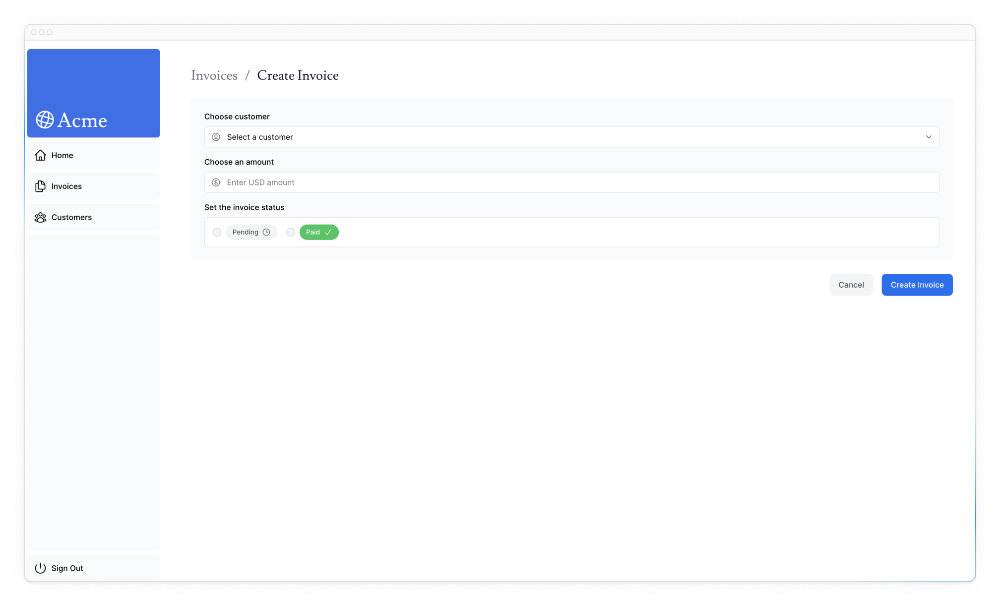

<div class="pt-3 text-sm opacity-70 text-center">

폼에는 customer dropdown, amount input, status radio, submit 버튼이 있습니다.

</div>

<!--
[스크립트]
create 페이지의 구조입니다.

`page.tsx`는 서버 컴포넌트로 customers를 DB에서 가져옵니다. 가져온 고객 목록을 `<Form>` 컴포넌트에 props로 전달합니다.

`<Form>` 컴포넌트는 폼 UI를 담당합니다. 고객 선택 드롭다운에 DB에서 가져온 실제 고객들이 나타납니다. amount 입력, status 라디오 버튼, 제출 버튼이 있습니다.

이미 `create-form.tsx` 파일이 프로젝트에 준비되어 있습니다. Server Action만 연결하면 됩니다.

전환: Step 2, Server Action을 만들고 연결합니다.
시간: 1.5분
-->

---

## Step 2: actions.ts 만들기

```typescript
// /app/lib/actions.ts
'use server';

export async function createInvoice(formData: FormData) {}
```

<div class="pt-4 text-base opacity-80">

파일 맨 위에 **`'use server'`** 를 적으면, 그 파일의 **모든 export 함수가 Server Action** 이 됩니다. 사용되지 않는 함수는 빌드 시 자동 제거.

</div>

<!--
[스크립트]
`/app/lib/actions.ts` 파일을 만듭니다.

파일 맨 위에 `'use server'`를 씁니다. 이 지시자가 있으면 파일에서 export되는 모든 함수가 Server Action이 됩니다.

`createInvoice(formData: FormData)` 함수를 만듭니다. 매개변수 타입이 `FormData`입니다. 폼 제출 시 브라우저가 자동으로 만들어서 전달합니다.

지금은 빈 함수입니다. 단계별로 채워나갑니다.

전환: 이 액션을 폼에 연결합니다.
시간: 1.5분
-->

---

## 폼에 액션 연결

```typescript {1,4}
// /app/ui/invoices/create-form.tsx
import { createInvoice } from '@/app/lib/actions';

export default function Form({ customers }: { customers: CustomerField[] }) {
  return (
    <form action={createInvoice}>
      {/* ... */}
    </form>
  );
}
```

<div class="pt-6 bg-blue-900/30 border border-blue-500/40 rounded p-3 text-sm">

💡 React에서 `action` 속성은 특별 prop입니다. Server Actions는 내부적으로 POST API 엔드포인트를 만들기 때문에, **API 라우트를 직접 만들 필요가 없습니다.**

</div>

<!--
[스크립트]
폼에 연결하는 코드입니다.

`create-form.tsx`에서 `createInvoice`를 import하고, `<form action={createInvoice}>`로 전달합니다. 이게 전부입니다.

이 코드가 의미하는 것 — 폼 제출 시 `createInvoice` 함수가 서버에서 실행됩니다. 클라이언트는 POST 요청을 보내고, 서버에서 함수를 실행하고, 응답을 받습니다. 이 과정이 투명하게 처리됩니다.

API 라우트를 따로 만들지 않아도 됩니다. 마법처럼 느껴질 수 있지만, 내부적으로는 빌드 시 POST 엔드포인트가 자동 생성됩니다.

전환: Step 3, 폼 데이터를 추출해봅시다.
시간: 1.5분
-->

---

## Step 3: formData 추출

```typescript
'use server';

export async function createInvoice(formData: FormData) {
  const rawFormData = {
    customerId: formData.get('customerId'),
    amount: formData.get('amount'),
    status: formData.get('status'),
  };
  console.log(rawFormData);
}
```

<div class="pt-4 text-sm opacity-80">

폼 제출 후 **터미널** (브라우저 콘솔 X)에 입력값이 출력되면 연결 성공.

</div>

<!--
[스크립트]
Step 3, formData에서 값을 꺼냅니다.

`formData.get('필드명')`으로 폼 각 필드의 값을 꺼냅니다. `console.log`로 출력해봅니다.

중요한 점: Server Action은 서버에서 실행됩니다. 그래서 `console.log`가 브라우저 콘솔이 아니라 터미널에 출력됩니다. 브라우저 콘솔에 아무것도 안 나온다고 당황하지 마세요. 터미널을 확인하세요.

폼을 제출해보고 터미널에 입력값이 출력되면 연결 성공입니다.

💡 혼동 포인트: "타입을 보면 다 string인데요?" → 맞습니다. HTML 폼은 모든 값을 문자열로 처리합니다. 다음 단계에서 Zod로 변환합니다.

전환: Step 4, 검증과 타입 변환을 합니다.
시간: 1.5분
-->

---

## Step 4: Zod로 검증

`<input type="number">`도 사실은 **string** 을 반환합니다. 타입 변환 + 검증을 위해 **Zod** 를 씁니다.

```typescript
import { z } from 'zod';

const FormSchema = z.object({
  id: z.string(),
  customerId: z.string(),
  amount: z.coerce.number(),
  status: z.enum(['pending', 'paid']),
  date: z.string(),
});

const CreateInvoice = FormSchema.omit({ id: true, date: true });
```

<div class="pt-2 text-sm opacity-80">

`z.coerce.number()` — string을 number로 자동 변환 + 검증.

</div>

<!--
[스크립트]
Zod로 폼 데이터를 검증합니다.

`FormSchema`는 인보이스 데이터의 스키마를 정의합니다. `z.coerce.number()`가 특히 중요합니다. HTML 폼의 `<input type="number">`는 문자열을 반환합니다. `coerce`가 string을 number로 자동 변환하고, 숫자가 아닌 값이면 검증 에러를 냅니다.

`FormSchema.omit({ id: true, date: true })`로 ID와 날짜는 제외합니다. ID는 DB가 자동 생성하고, 날짜는 서버에서 현재 시각으로 설정합니다.

Zod를 쓰면 타입 변환과 검증을 한 번에 처리하는 깔끔한 코드가 됩니다.

전환: 실제 검증 코드를 봅시다.
시간: 2분
-->

---

## 검증 + 단위 변환 + 날짜

```typescript
export async function createInvoice(formData: FormData) {
  const { customerId, amount, status } = CreateInvoice.parse({
    customerId: formData.get('customerId'),
    amount: formData.get('amount'),
    status: formData.get('status'),
  });
  const amountInCents = amount * 100;
  const date = new Date().toISOString().split('T')[0];
}
```

<div class="pt-4 grid grid-cols-2 gap-3 text-sm">

<div class="bg-slate-800/50 p-3 rounded">

💰 **Cents로 저장**: JS 부동소수 오류 방지

</div>

<div class="bg-slate-800/50 p-3 rounded">

📅 **YYYY-MM-DD**: ISO 형식 날짜

</div>

</div>

<!--
[스크립트]
검증 후 데이터를 변환합니다.

두 가지 변환이 있습니다.

첫째, 금액을 cents로 변환합니다. `amount * 100`. 예를 들어 $14.99는 1499 cents로 저장합니다. JavaScript는 부동소수점 연산에서 `0.1 + 0.2 = 0.30000000000000004` 같은 오류가 납니다. 정수로 저장하면 이 문제가 없습니다.

둘째, 날짜를 `YYYY-MM-DD` 형식으로 저장합니다. `new Date().toISOString().split('T')[0]`이 오늘 날짜를 그 형식으로 반환합니다.

전환: Step 5, 준비된 데이터를 DB에 넣습니다.
시간: 1.5분
-->

---

## Step 5: DB에 INSERT

```typescript
import postgres from 'postgres';
const sql = postgres(process.env.POSTGRES_URL!, { ssl: 'require' });

export async function createInvoice(formData: FormData) {
  const { customerId, amount, status } = CreateInvoice.parse({
    customerId: formData.get('customerId'),
    amount: formData.get('amount'),
    status: formData.get('status'),
  });
  const amountInCents = amount * 100;
  const date = new Date().toISOString().split('T')[0];

  await sql`
    INSERT INTO invoices (customer_id, amount, status, date)
    VALUES (${customerId}, ${amountInCents}, ${status}, ${date})
  `;
}
```

<!--
[스크립트]
Step 5, DB에 INSERT합니다.

`sql` tagged template literal로 SQL을 씁니다. `${customerId}`, `${amountInCents}` 등 변수가 들어가는 자리는 `postgres.js`가 자동으로 파라미터화합니다. SQL 인젝션이 원천 차단됩니다.

서버 컴포넌트나 Server Action에서만 이 코드를 쓸 수 있습니다. 클라이언트 코드에서는 DB에 직접 접근할 수 없습니다.

코드를 저장하고 폼을 제출해보면 DB에 데이터가 들어갑니다.

전환: 마지막으로 캐시를 비우고 리다이렉트합니다.
시간: 1.5분
-->

---

## Step 6: revalidate + redirect

```typescript {2-3,15-16}
'use server';

import { revalidatePath } from 'next/cache';
import { redirect } from 'next/navigation';

export async function createInvoice(formData: FormData) {
  // ... 검증, 변환, INSERT ...

  await sql`
    INSERT INTO invoices (customer_id, amount, status, date)
    VALUES (${customerId}, ${amountInCents}, ${status}, ${date})
  `;

  revalidatePath('/dashboard/invoices');
  redirect('/dashboard/invoices');
}
```

<div class="pt-2 text-sm opacity-80">

- `revalidatePath` — 클라이언트 라우터 캐시 비우고 새 데이터 가져오게 함
- `redirect` — 사용자를 인보이스 목록으로 돌려보냄

</div>

<!--
[스크립트]
마지막 단계입니다.

`revalidatePath('/dashboard/invoices')`를 호출합니다. 인보이스 목록 페이지의 캐시를 비웁니다. 다음 방문 시 새로운 데이터를 가져옵니다.

`redirect('/dashboard/invoices')`로 인보이스 목록 페이지로 이동합니다. 사용자가 방금 만든 새 인보이스가 목록에 나타납니다.

이렇게 6단계가 완성됐습니다. 인보이스 생성 기능이 완전히 동작합니다.

전환: 이제 수정 기능을 만들 차례입니다.
시간: 1.5분
-->

---

## 인보이스 수정: Dynamic Route

`[id]` 폴더를 만들면 동적 세그먼트가 됩니다.


<div class="pt-3 text-sm opacity-70 text-center">

`/dashboard/invoices/[id]/edit/page.tsx` → `/dashboard/invoices/uuid-1234/edit`

</div>

<!--
[스크립트]
수정 기능을 위해 Dynamic Route를 만듭니다.

`[id]` 폴더를 만들면 URL의 그 위치에 어떤 값이 와도 이 라우트가 매칭됩니다. `/dashboard/invoices/abc-123/edit`이면 `id`가 `abc-123`이 됩니다.

이 패턴으로 인보이스 ID에 따른 개별 수정 페이지가 만들어집니다.

전환: edit 페이지가 어떻게 생겼는지 봅시다.
시간: 1.5분
-->

---

## Edit 페이지 미리보기

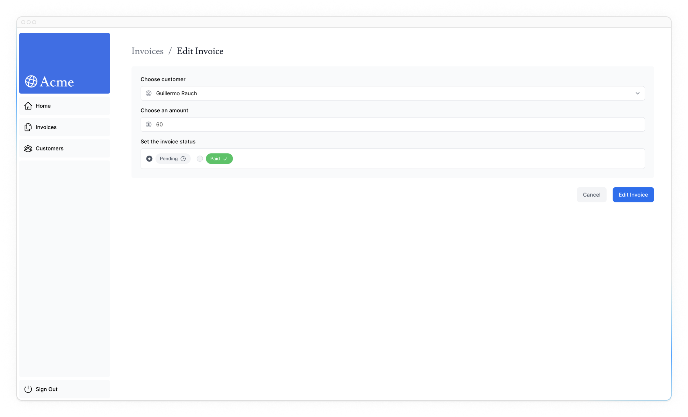

<div class="pt-3 text-sm opacity-70 text-center">

브레드크럼 + 기존 데이터로 미리 채워진 폼.

</div>

<!--
[스크립트]
edit 페이지입니다.

상단에 브레드크럼 네비게이션이 있습니다. "Invoices > Edit Invoice" 형태로 현재 위치를 보여줍니다.

폼은 기존 인보이스 데이터로 미리 채워져 있습니다. 고객 선택이 이미 되어 있고, 금액과 상태도 현재 값으로 채워져 있습니다. 사용자가 수정할 부분만 바꾸면 됩니다.

이렇게 하려면 DB에서 해당 인보이스 데이터를 가져와서 폼의 default value로 넣어야 합니다.

전환: 어떻게 id를 읽어서 데이터를 가져오는지 봅시다.
시간: 1.5분
-->

---

## Edit 페이지: params에서 id 읽기

```typescript
// /app/dashboard/invoices/[id]/edit/page.tsx
import { fetchInvoiceById, fetchCustomers } from '@/app/lib/data';

export default async function Page(props: { params: Promise<{ id: string }> }) {
  const params = await props.params;
  const id = params.id;
  const [invoice, customers] = await Promise.all([
    fetchInvoiceById(id),
    fetchCustomers(),
  ]);
  // ...
}
```

<div class="pt-3 text-sm opacity-80">

`Promise.all`로 invoice와 customers를 **병렬** 패칭.

</div>

<!--
[스크립트]
Dynamic Route의 params를 읽는 방법입니다.

`props.params`가 `Promise<{ id: string }>`입니다. Next.js 15부터는 params도 Promise입니다. `await`로 꺼내고, `params.id`로 인보이스 ID를 가져옵니다.

`fetchInvoiceById(id)` — ID로 해당 인보이스 데이터를 가져옵니다. `fetchCustomers()` — 고객 드롭다운에 필요한 모든 고객 목록을 가져옵니다.

두 요청이 독립적이므로 `Promise.all`로 병렬 패칭합니다.

전환: 인보이스 목록에서 수정 버튼을 어떻게 만드는지 봅시다.
시간: 2분
-->

---

## UpdateInvoice 버튼 링크

```typescript
// /app/ui/invoices/buttons.tsx
export function UpdateInvoice({ id }: { id: string }) {
  return (
    <Link
      href={`/dashboard/invoices/${id}/edit`}
      className="rounded-md border p-2 hover:bg-gray-100"
    >
      <PencilIcon className="w-5" />
    </Link>
  );
}
```

<div class="pt-4 text-base opacity-80">

테이블의 연필 아이콘을 클릭하면 해당 인보이스의 edit 페이지로 이동.

</div>

<!--
[스크립트]
인보이스 목록 테이블의 각 행에 연필 아이콘이 있습니다.

`<Link href={\`/dashboard/invoices/${id}/edit\`}>`로 해당 인보이스 ID가 포함된 edit 페이지 URL로 이동합니다. 각 행마다 다른 ID를 사용하므로 각각 올바른 edit 페이지로 이동합니다.

아이콘에 `<PencilIcon>` 컴포넌트를 씁니다. 이미지 대신 SVG 아이콘입니다. `@heroicons/react` 라이브러리를 씁니다.

전환: UUID를 사용하는 이유를 잠깐 짚고 넘어갑니다.
시간: 1분
-->

---

## UUID vs Auto-increment

<div class="grid grid-cols-2 gap-6 pt-6">

<div class="bg-slate-800/50 p-4 rounded">

### 🔢 Auto-increment (1, 2, 3...)
- URL이 짧고 깔끔
- ⚠️ 열거 공격(enumeration attack) 위험
- ⚠️ 분산 환경에서 충돌 가능

</div>

<div class="bg-slate-800/50 p-4 rounded">

### 🆔 UUID (uuid-1234-...)
- 글로벌 unique
- 충돌 없음
- 열거 공격 어려움
- 큰 DB에 유리

</div>

</div>

<div class="pt-6 text-base opacity-80 text-center">

이 코스에서는 UUID를 사용합니다.

</div>

<!--
[스크립트]
URL에 ID를 넣을 때 두 가지 방식이 있습니다.

Auto-increment, 즉 1, 2, 3... 순서로 증가하는 방식은 URL이 짧습니다. 하지만 공격자가 `/invoices/1/edit`, `/invoices/2/edit`을 순서대로 시도해서 다른 사용자 데이터에 접근할 수 있습니다. 이를 열거 공격(enumeration attack)이라고 합니다.

UUID는 추측하기 어려운 긴 랜덤 문자열입니다. 열거 공격이 사실상 불가능합니다. 분산 서버 환경에서도 충돌이 없습니다.

보안이 중요한 애플리케이션에서는 UUID가 권장됩니다.

전환: ID를 Server Action에 어떻게 전달할지가 중요합니다.
시간: 2분
-->

---

## .bind()로 id 전달

```typescript {9}
// /app/ui/invoices/edit-form.tsx
import { updateInvoice } from '@/app/lib/actions';

export default function EditInvoiceForm({
  invoice,
  customers,
}: {
  invoice: InvoiceForm;
  customers: CustomerField[];
}) {
  const updateInvoiceWithId = updateInvoice.bind(null, invoice.id);

  return <form action={updateInvoiceWithId}>{/* ... */}</form>;
}
```

<div class="pt-3 text-sm opacity-80">

`bind`로 id를 미리 묶어두면 안전하게 전달됩니다. hidden input보다 권장됩니다 (HTML 소스에 노출되지 않음).

</div>

<!--
[스크립트]
Server Action에 ID를 전달하는 패턴입니다.

수정 폼에서 `updateInvoice`를 호출할 때 어떤 인보이스를 수정하는지 알아야 합니다. FormData에는 ID가 없습니다.

방법 1: `<input type="hidden" name="id" value={invoice.id} />`로 숨겨진 필드를 추가. 하지만 HTML 소스를 보면 ID가 보입니다.

방법 2: `.bind()`로 ID를 함수에 미리 묶어두기. `updateInvoice.bind(null, invoice.id)`로 ID가 포함된 새 함수를 만듭니다. 이 함수를 `action`에 전달합니다. HTML에 ID가 노출되지 않아서 더 안전합니다.

💡 혼동 포인트: "`bind(null, invoice.id)`는 왜 첫 인자가 null인가요?" → `bind`의 첫 인자는 `this` 컨텍스트입니다. Server Action에는 `this`가 필요 없으니 null을 씁니다.

전환: updateInvoice 액션 코드를 봅시다.
시간: 2min
-->

---

## updateInvoice 액션

```typescript
const UpdateInvoice = FormSchema.omit({ id: true, date: true });

export async function updateInvoice(id: string, formData: FormData) {
  const { customerId, amount, status } = UpdateInvoice.parse({
    customerId: formData.get('customerId'),
    amount: formData.get('amount'),
    status: formData.get('status'),
  });

  const amountInCents = amount * 100;

  await sql`
    UPDATE invoices
    SET customer_id = ${customerId}, amount = ${amountInCents}, status = ${status}
    WHERE id = ${id}
  `;

  revalidatePath('/dashboard/invoices');
  redirect('/dashboard/invoices');
}
```

<!--
[스크립트]
`updateInvoice` 액션입니다. `createInvoice`와 구조가 비슷합니다.

첫 인자로 `id`를 받습니다. `.bind()`로 미리 묶어줬기 때문에 두 번째 인자로 `formData`가 옵니다.

검증과 변환은 같습니다. SQL만 `INSERT` 대신 `UPDATE`를 씁니다. `WHERE id = ${id}`로 정확한 인보이스만 수정합니다.

마지막으로 `revalidatePath`와 `redirect`로 인보이스 목록으로 돌아갑니다.

전환: 삭제 기능은 더 간단합니다.
시간: 1.5분
-->

---

## 인보이스 삭제

```typescript
// /app/ui/invoices/buttons.tsx
import { deleteInvoice } from '@/app/lib/actions';

export function DeleteInvoice({ id }: { id: string }) {
  const deleteInvoiceWithId = deleteInvoice.bind(null, id);

  return (
    <form action={deleteInvoiceWithId}>
      <button type="submit" className="rounded-md border p-2 hover:bg-gray-100">
        <span className="sr-only">Delete</span>
        <TrashIcon className="w-4" />
      </button>
    </form>
  );
}
```

```typescript
// /app/lib/actions.ts
export async function deleteInvoice(id: string) {
  await sql`DELETE FROM invoices WHERE id = ${id}`;
  revalidatePath('/dashboard/invoices');
}
```

<div class="pt-2 text-sm opacity-80">

같은 페이지에 머물기 때문에 redirect 불필요. revalidatePath만으로 테이블 새로 그림.

</div>

<!--
[스크립트]
삭제는 간단합니다.

`DeleteInvoice` 컴포넌트에도 같은 `.bind()` 패턴을 씁니다. 삭제 버튼은 폼 안의 submit 버튼입니다. 폼 제출 시 `deleteInvoice(id)`가 서버에서 실행됩니다.

`deleteInvoice` 액션은 단 한 줄입니다. `DELETE FROM invoices WHERE id = ${id}`. 그리고 `revalidatePath`로 테이블을 새로 고칩니다.

삭제는 같은 인보이스 목록 페이지에 머물기 때문에 `redirect`가 필요 없습니다. `revalidatePath`만으로 테이블이 업데이트됩니다.

전환: 챕터 12를 정리합니다.
시간: 1.5분
-->

---

## 📦 챕터 정리

<div class="bg-emerald-900/30 border border-emerald-500/40 rounded p-5 mt-8">

1. **Server Actions** = 서버 함수를 직접 호출, API 엔드포인트 불필요.
2. `<form action={action}>` 으로 native FormData 전달, **progressive enhancement** 보너스.
3. **Zod** 로 타입 검증, 금액은 **cents** 로 저장, 날짜는 **ISO**.
4. **`revalidatePath`** → 캐시 무효화, **`redirect`** → 다른 페이지로.
5. 동적 라우트는 **`[id]`** 폴더, 액션에 인자 전달은 **`.bind()`** 로.

</div>

<!--
[스크립트]
챕터 12 정리입니다.

Server Actions로 API 엔드포인트 없이 폼 제출 → 서버 함수 호출을 구현했습니다. `<form action={action}>`으로 native FormData를 전달합니다.

Zod로 검증하고, 금액은 cents로, 날짜는 ISO 형식으로 변환해 DB에 저장합니다. 저장 후에는 `revalidatePath`로 캐시를 비우고 `redirect`로 이동합니다.

수정 기능은 `[id]` 동적 라우트와 `.bind()`로 ID를 전달합니다.

전환: 다음은 에러가 발생했을 때 어떻게 처리하는지 배웁니다.
시간: 1분
-->

---
layout: section
---

# Chapter 13
## 에러 처리

<div class="pt-4 text-sm opacity-60">

source: <code>https://nextjs.org/learn/dashboard-app/error-handling</code>

</div>

<!--
[스크립트]
Chapter 13, 에러 처리입니다.

DB 연결이 실패하거나, 존재하지 않는 ID를 수정하려 하거나, 예상치 못한 서버 에러가 발생했을 때 어떻게 처리할지 배웁니다.

Next.js는 이를 위한 특별한 파일 컨벤션을 제공합니다.

전환: 먼저 Server Action에서 에러를 처리하는 기본 방법입니다.
시간: 30초
-->

---

## try/catch in Server Actions

```typescript
export async function deleteInvoice(id: string) {
  throw new Error('Failed to Delete Invoice');

  // 도달 불가
  await sql`DELETE FROM invoices WHERE id = ${id}`;
  revalidatePath('/dashboard/invoices');
}
```

<div class="pt-4 text-base opacity-80">

먼저 인위적으로 에러를 던져 봅니다. 삭제 버튼을 누르면 localhost에 에러 페이지가 뜹니다.

</div>

<!--
[스크립트]
에러를 의도적으로 만들어서 어떻게 보이는지 확인해봅니다.

`deleteInvoice` 함수 맨 앞에 `throw new Error('Failed to Delete Invoice')`를 추가합니다. 삭제 버튼을 누르면 에러가 발생합니다.

개발 환경에서는 Next.js가 상세한 에러 화면을 보여줍니다. 실제 사용자에게는 보여주면 안 되는 내용들이 있습니다. 프로덕션에서는 다른 에러 UI가 필요합니다.

테스트가 끝나면 `throw new Error`를 삭제합니다.

전환: redirect를 쓸 때 중요한 주의사항이 있습니다.
시간: 1.5분
-->

---

## ⚠️ redirect는 try/catch 밖에서

<div class="pt-4 text-base">

`redirect`는 내부적으로 **error를 throw** 해서 동작합니다. 그래서 try/catch 안에 두면 catch 블록이 잡아버립니다.

</div>

```typescript
try {
  await sql`...`;
} catch (error) {
  return { message: 'Database Error' };
}

revalidatePath('/dashboard/invoices');
redirect('/dashboard/invoices'); // ✅ try/catch 밖
```

<!--
[스크립트]
이것은 매우 자주 발생하는 실수입니다.

`redirect` 함수는 내부적으로 특별한 에러를 throw해서 동작합니다. `NEXT_REDIRECT`라는 에러 코드를 씁니다.

만약 `redirect`를 `try/catch` 블록 안에 두면, `catch`가 이 에러를 잡아버립니다. 리다이렉트가 되지 않습니다.

해결책: `redirect`는 항상 `try/catch` 밖에 두세요. DB 작업은 try 안에서 하고, 성공적으로 완료되면 try 블록을 빠져나와서 redirect를 호출합니다.

이걸 알면 나중에 "redirect가 작동하지 않는다"는 디버깅 시간을 아낄 수 있습니다.

[Q&A 대비]
Q: notFound()도 같은 방식인가요?
A: 네. `notFound()`도 에러를 throw해서 동작합니다. 마찬가지로 try/catch 밖에 두거나, catch에서 잡힌 경우 다시 throw해야 합니다.

전환: 이제 UI에서 에러를 잡는 방법인 error.tsx를 봅시다.
시간: 2분
-->

---

## error.tsx로 모든 에러 잡기

`/app/dashboard/invoices/error.tsx` 를 만들면 그 라우트 세그먼트의 **catch-all** UI 경계가 됩니다.

```typescript {1,12-15}
'use client';

import { useEffect } from 'react';

export default function Error({
  error,
  reset,
}: {
  error: Error & { digest?: string };
  reset: () => void;
}) {
  useEffect(() => {
    console.error(error);
  }, [error]);

  return (
    <main className="flex h-full flex-col items-center justify-center">
      <h2 className="text-center">Something went wrong!</h2>
      <button
        className="mt-4 rounded-md bg-blue-500 px-4 py-2 text-sm text-white"
        onClick={() => reset()}
      >
        Try again
      </button>
    </main>
  );
}
```

---

## error.tsx 핵심 사항

<div class="pt-6 grid grid-cols-2 gap-4">

<div class="bg-slate-800/50 p-4 rounded">

### 🟢 Client Component
훅을 사용하므로 **`'use client'`** 필수

</div>

<div class="bg-slate-800/50 p-4 rounded">

### 📥 두 가지 prop
- `error` — JS Error 객체
- `reset` — 라우트 재렌더링 시도 함수

</div>

</div>

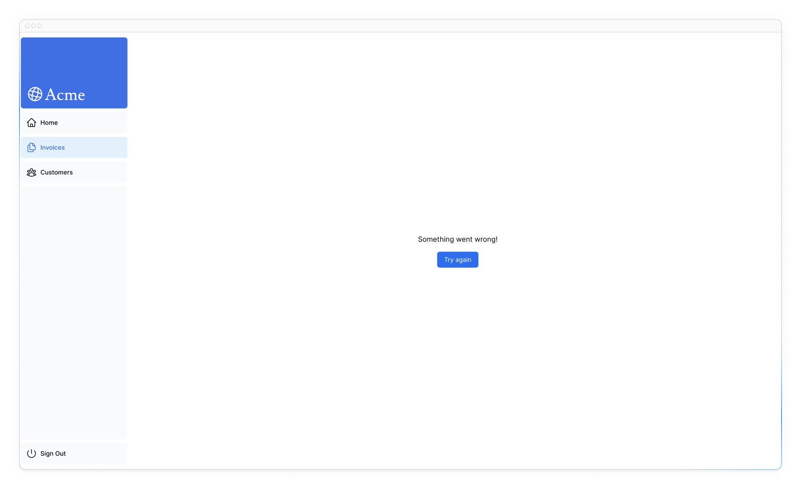

<!--
[스크립트]
`error.tsx`의 핵심 사항입니다.

Client Component여야 합니다. `useEffect`라는 훅을 쓰기 때문입니다. 파일 맨 위에 `'use client'`가 필수입니다.

두 가지 props를 받습니다. `error`는 JavaScript Error 객체입니다. `digest` 속성이 있을 수 있는데, 서버 에러의 해시값입니다. 로그에서 특정 에러를 추적할 때 씁니다. `reset`은 라우트를 다시 렌더링 시도하는 함수입니다. "Try again" 버튼에 연결합니다.

이 컴포넌트를 만들면 해당 라우트 세그먼트에서 발생하는 모든 에러가 이 화면으로 대체됩니다.

전환: 하지만 "리소스가 없다"는 에러는 더 구체적인 처리가 필요합니다.
시간: 2분
-->

---

## 404를 위한 notFound()

<div class="pt-4 text-base">

`error.tsx`는 모든 예외를 잡지만, 가끔은 **"리소스가 없다"** 는 더 구체적인 메시지가 필요합니다.

</div>

```typescript
import { fetchInvoiceById, fetchCustomers } from '@/app/lib/data';
import { notFound } from 'next/navigation';

export default async function Page(props: { params: Promise<{ id: string }> }) {
  const params = await props.params;
  const id = params.id;
  const [invoice, customers] = await Promise.all([
    fetchInvoiceById(id),
    fetchCustomers(),
  ]);

  if (!invoice) {
    notFound();
  }
  // ...
}
```

<!--
[스크립트]
`notFound()` 함수는 404 Not Found 응답을 보냅니다.

edit 페이지에서 URL에 있는 인보이스 ID로 DB를 조회합니다. 누군가 임의의 UUID를 직접 URL에 입력했다면, 그 ID에 해당하는 인보이스가 없을 수 있습니다.

`fetchInvoiceById(id)`가 `null`이나 `undefined`를 반환하면 `notFound()`를 호출합니다. 이러면 같은 폴더에 있는 `not-found.tsx`가 표시됩니다.

`error.tsx`는 모든 예외를 잡지만, "리소스가 없다"는 404 상황은 그보다 더 사용자 친화적인 메시지를 보여주는 것이 좋습니다.

전환: not-found.tsx 파일을 어디에 두면 되는지 봅시다.
시간: 2min
-->

---

## not-found.tsx 위치


<div class="pt-3 text-sm opacity-70 text-center">

`/dashboard/invoices/[id]/edit/not-found.tsx` 로 만들면 그 라우트에서만 적용됩니다.

</div>

<!--
[스크립트]
`not-found.tsx`는 `notFound()`가 호출되는 라우트와 같은 폴더에 위치합니다.

`/app/dashboard/invoices/[id]/edit/` 폴더에 `not-found.tsx`를 만들면, 이 edit 라우트에서만 이 404 페이지가 사용됩니다.

파일 위치를 바꾸면 적용 범위가 달라집니다. `/app/not-found.tsx`를 만들면 전체 앱에 적용됩니다. 더 상위 폴더에 만들면 그 하위 라우트 모두에 적용됩니다.

전환: not-found.tsx 내용을 봅시다.
시간: 1.5min
-->

---

## not-found.tsx

`notFound()`가 호출되면 같은 폴더의 `not-found.tsx` 가 표시됩니다.

```typescript
import Link from 'next/link';
import { FaceFrownIcon } from '@heroicons/react/24/outline';

export default function NotFound() {
  return (
    <main className="flex h-full flex-col items-center justify-center gap-2">
      <FaceFrownIcon className="w-10 text-gray-400" />
      <h2 className="text-xl font-semibold">404 Not Found</h2>
      <p>Could not find the requested invoice.</p>
      <Link
        href="/dashboard/invoices"
        className="mt-4 rounded-md bg-blue-500 px-4 py-2 text-sm text-white"
      >
        Go Back
      </Link>
    </main>
  );
}
```

---

## 404 결과 화면

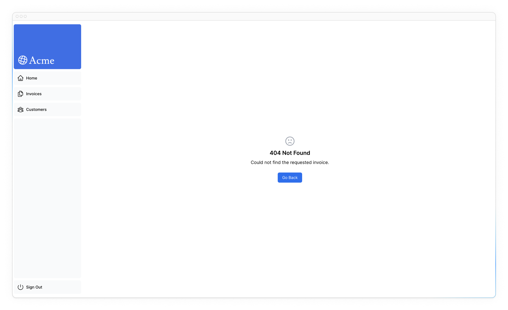

<div class="pt-3 text-sm opacity-70 text-center">

`notFound()`는 **`error.tsx`보다 우선순위가 높습니다.** 더 구체적인 404 처리가 필요할 때 사용.

</div>

<!--
[스크립트]
not-found.tsx의 내용은 간단합니다.

슬픈 얼굴 아이콘, "404 Not Found" 메시지, "Could not find the requested invoice." 설명, 그리고 인보이스 목록으로 돌아가는 링크입니다.

`notFound()`가 `error.tsx`보다 우선순위가 높습니다. 같은 라우트에 두 파일이 모두 있어도, `notFound()` 호출 시에는 `not-found.tsx`가 우선입니다.

404는 에러가 아닙니다. 리소스가 없다는 정상적인 응답입니다. 두 파일을 구분해서 사용하면 사용자에게 더 의미 있는 메시지를 전달할 수 있습니다.

전환: 챕터 13을 정리하겠습니다.
시간: 1.5분
-->

---

## 📦 챕터 정리

<div class="bg-emerald-900/30 border border-emerald-500/40 rounded p-5 mt-8">

1. Server Action에 **`try/catch`** 로 우아하게 에러 처리.
2. **`redirect`는 try/catch 밖에서** 호출 (내부적으로 throw하기 때문).
3. **`error.tsx`** = 라우트 세그먼트의 catch-all UI 경계, **client component**.
4. **`notFound()`** + **`not-found.tsx`** = 구체적 404 처리.
5. **`notFound()`가 `error.tsx`보다 우선순위가 높습니다.**

</div>

<!--
[스크립트]
챕터 13 정리입니다.

Server Action에서 DB 에러는 `try/catch`로 처리합니다. 단, `redirect`는 try/catch 밖에 두어야 합니다.

`error.tsx`는 라우트 세그먼트의 모든 에러를 잡는 catch-all 경계입니다. `'use client'`가 필요합니다.

`notFound()`와 `not-found.tsx`는 404 상황에 특화된 처리입니다. `error.tsx`보다 우선순위가 높습니다.

전환: 다음은 접근성입니다. 폼 검증과 스크린리더 지원을 배웁니다.
시간: 1분
-->

---
layout: section
---

# Chapter 14
## 접근성 개선

<div class="pt-4 text-sm opacity-60">

source: <code>https://nextjs.org/learn/dashboard-app/improving-accessibility</code>

</div>

<!--
[스크립트]
Chapter 14, 접근성 개선입니다.

접근성은 이미 잘 만든 폼에서 한 단계 더 나아가는 주제입니다. 스크린리더 사용자, 키보드만 쓰는 사용자도 우리 앱을 잘 쓸 수 있게 만들겠습니다.

전환: 먼저 접근성이 무엇인지 정의해봅시다.
시간: 30초
-->

---

## 접근성(Accessibility, a11y)이란?

<div class="pt-4 text-lg">

장애 여부와 관계없이 **모든 사람이 사용할 수 있도록** 웹 앱을 디자인·구현하는 것.

</div>

<div class="pt-6 grid grid-cols-2 gap-3 text-sm">

<div class="bg-slate-800/50 p-3 rounded">

⌨️ 키보드 네비게이션

</div>

<div class="bg-slate-800/50 p-3 rounded">

🏷 시맨틱 HTML

</div>

<div class="bg-slate-800/50 p-3 rounded">

🖼 이미지 alt 텍스트

</div>

<div class="bg-slate-800/50 p-3 rounded">

🎨 색 대비

</div>

</div>

<div class="pt-6 text-sm opacity-70 text-center">

🔗 더 깊이 배우려면: <code>web.dev/learn/accessibility/</code>

</div>

<!--
[스크립트]
접근성, a11y는 "accessibility"의 약어입니다. a와 y 사이에 11글자가 있어서 a11y라고 씁니다.

접근성은 시각 장애인, 청각 장애인, 운동 장애인 등 다양한 장애를 가진 사람들이 웹을 사용할 수 있도록 만드는 것입니다.

키보드만으로 모든 기능을 쓸 수 있는지, 이미지에 alt 텍스트가 있는지, 스크린리더가 내용을 제대로 읽어주는지, 색상 대비가 충분한지 등을 고려합니다.

"장애인만을 위한 것 아닌가요?"라고 생각할 수 있지만, 접근성을 잘 지키면 검색엔진 최적화에도 좋고, 일반 사용자도 더 편하게 씁니다. 커서를 잃어버린 상태에서 키보드로 탭 이동을 하는 경우처럼요.

더 깊이 배우려면 `web.dev/learn/accessibility`를 추천합니다.

전환: Next.js는 접근성 검사를 자동화하는 도구를 제공합니다.
시간: 2분
-->

---

## ESLint 접근성 플러그인

`eslint-config-next/core-web-vitals`에는 `eslint-plugin-jsx-a11y`가 포함되어 있어, alt 누락·ARIA 오용 등을 잡아냅니다.

```bash
pnpm add -D eslint eslint-config-next
```

```javascript
// /eslint.config.mjs
import { defineConfig, globalIgnores } from 'eslint/config';
import nextVitals from 'eslint-config-next/core-web-vitals';

const eslintConfig = defineConfig([
  ...nextVitals,
  globalIgnores(['.next/**', 'out/**', 'build/**', 'next-env.d.ts']),
]);

export default eslintConfig;
```

<!--
[스크립트]
Next.js는 eslint-plugin-jsx-a11y라는 접근성 전용 ESLint 플러그인을 기본으로 포함하고 있습니다. `eslint-config-next/core-web-vitals`를 설치하면 자동으로 들어옵니다.

이 플러그인은 이미지에 alt 속성이 없거나, ARIA 속성을 잘못 쓰거나, 인터랙티브 요소에 label이 없을 때 경고를 줍니다. 코드를 쓰는 시점에서 실수를 잡아주기 때문에 매우 유용합니다.

설정 파일 `eslint.config.mjs`는 최신 flat config 방식입니다. `...nextVitals`로 Next.js 권장 규칙 전체를 spread해서 가져오고, `globalIgnores`로 빌드 폴더는 제외합니다.

💡 혼동 포인트: "eslint-plugin-jsx-a11y를 따로 설치해야 하나요?" → 아닙니다. `eslint-config-next/core-web-vitals`에 이미 포함되어 있어서 별도로 설치할 필요가 없습니다.

[Q&A 대비]
Q: `eslint.config.mjs`와 `.eslintrc.json` 중 어느 것을 써야 하나요?
A: Next.js 15부터 flat config(`eslint.config.mjs`) 방식이 기본입니다. 기존 프로젝트에서 `.eslintrc.json`을 쓰고 있다면 마이그레이션 가이드를 참고하세요.

Q: a11y 검사를 CI에서도 돌릴 수 있나요?
A: 네, `pnpm lint`를 GitHub Actions나 CI 파이프라인에 추가하면 PR마다 자동으로 검사됩니다.

전환: 설정만 하면 끝이 아닙니다. lint 스크립트를 추가하고 직접 실행해 봐야 효과를 확인할 수 있습니다.
시간: 2분
-->

---

## lint 스크립트 추가

```json
"scripts": {
  "build": "next build",
  "dev": "next dev",
  "start": "next start",
  "lint": "eslint ."
}
```

```bash
pnpm lint
```

<div class="pt-6 text-base opacity-80">

실수로 `<Image>`에서 alt를 빼먹으면:

</div>

```text
./app/ui/invoices/table.tsx
45:25  Warning: Image elements must have an alt prop,
either with meaningful text, or an empty string for decorative images. jsx-a11y/alt-text
```

<!--
[스크립트]
`package.json`의 scripts에 `"lint": "eslint ."`를 추가하고 `pnpm lint`를 실행하면 됩니다.

화면에 보이는 것처럼, 이미지 컴포넌트에 alt 속성을 깜빡하면 이런 경고가 뜹니다. 파일명, 줄 번호, 열 번호까지 정확히 알려주기 때문에 바로 찾아서 수정할 수 있습니다.

`next build`를 실행하면 lint도 함께 실행됩니다. 배포 전 마지막 관문으로 활용할 수 있습니다.

💡 혼동 포인트: "경고(Warning)인데 무시해도 되나요?" → 기술적으로는 빌드가 되지만, 접근성 문제는 실제 사용자에게 영향을 주므로 수정하는 것이 좋습니다. Error로 설정하면 빌드 자체를 막을 수도 있습니다.

[Q&A 대비]
Q: `next dev` 실행 중에도 lint 오류가 보이나요?
A: Next.js 13 이상에서는 개발 서버에서도 오버레이로 일부 에러가 보이지만, lint는 `pnpm lint`를 직접 실행하거나 IDE 플러그인을 써야 실시간으로 확인됩니다.

전환: lint가 준비됐으니 이제 폼 접근성의 3가지 핵심 원칙을 살펴보겠습니다.
시간: 1분 30초
-->

---

## 폼 접근성의 3가지 기본

<div class="pt-4 grid grid-cols-3 gap-3 text-sm">

<div class="bg-slate-800/50 p-3 rounded">

**1️⃣ 시맨틱 HTML**

`<input>`, `<option>` 같은 의미 있는 태그 (div 대신)

</div>

<div class="bg-slate-800/50 p-3 rounded">

**2️⃣ Labelling**

`<label htmlFor>` 로 input과 연결, 클릭으로 포커스

</div>

<div class="bg-slate-800/50 p-3 rounded">

**3️⃣ Focus Outline**

tab 키로 이동 시 시각 표시

</div>

</div>

<div class="pt-6 text-base opacity-80">

이 세 가지는 우리 폼에서 이미 잘 지켜지고 있습니다. 이제 **검증** 과 **에러** 를 추가합시다.

</div>

<!--
[스크립트]
폼 접근성의 기본은 세 가지입니다.

첫 번째, 시맨틱 HTML입니다. `<div>`로 버튼처럼 보이는 것을 만들지 말고, 실제 `<button>`, `<input>`, `<select>` 같은 의미 있는 태그를 사용해야 합니다. 스크린리더가 태그 자체에서 역할을 파악하기 때문입니다.

두 번째, Labelling입니다. `<label htmlFor="customer-id">`처럼 input과 label을 연결하면, label을 클릭했을 때 input으로 포커스가 이동하고, 스크린리더도 input을 읽을 때 label을 함께 읽어줍니다.

세 번째, Focus Outline입니다. 키보드로 탭 이동할 때 어떤 요소가 선택됐는지 시각적으로 보여주는 테두리입니다. 이것을 없애면 키보드 사용자는 자신이 어디 있는지 알 수 없습니다.

좋은 소식은, 우리가 지금까지 만든 폼이 이 세 가지를 이미 잘 지키고 있다는 겁니다. 이제 검증과 에러 메시지를 추가할 차례입니다.

[Q&A 대비]
Q: Tailwind에서 focus outline을 없애는 `outline-none`을 쓰는 경우를 많이 봤는데요?
A: 디자인 때문에 기본 outline을 없애는 경우 반드시 커스텀 focus 스타일(`ring`, `border-color` 등)로 대체해야 합니다. outline-none만 쓰고 대체 스타일이 없으면 접근성 위반입니다.

전환: 폼 기본이 잘 갖춰졌으니, 이제 클라이언트와 서버 검증의 차이점을 살펴보겠습니다.
시간: 2분
-->

---

## 클라이언트 검증 vs 서버 검증

<div class="grid grid-cols-2 gap-6 pt-4">

<div class="bg-slate-800/50 p-4 rounded">

### 🌐 클라이언트 검증
- 가장 단순한 방법: `<input required>`
- 브라우저가 빈 값 제출을 막음
- 일부 보조 기술도 잘 지원

</div>

<div class="bg-slate-800/50 p-4 rounded">

### 🛡 서버 검증
- DB로 가기 전에 형식 보장
- 악의적 사용자가 클라 검증 우회 못 함
- "유효한 데이터"의 단일 진실

</div>

</div>

<div class="pt-6 text-base opacity-80 text-center">

이번 챕터에서는 **서버 검증** 으로 더 안전하게 갑니다.

</div>

<!--
[스크립트]
검증은 두 가지 방식이 있습니다.

클라이언트 검증은 `<input required>` 같은 HTML 속성이나 JavaScript로 브라우저에서 바로 처리합니다. 빠르고 사용자 경험이 좋지만, 개발자 도구로 HTML을 수정하거나 직접 API를 호출하면 우회할 수 있습니다.

서버 검증은 데이터가 서버에 도착했을 때 다시 한번 확인합니다. DB에 저장하기 전 마지막 관문이고, 악의적인 사용자가 클라이언트 검증을 우회해도 막을 수 있습니다. "이 데이터는 올바른 형식"이라는 단일 진실의 원천이 됩니다.

이번 챕터에서는 서버 검증 방식으로 구현합니다. 클라이언트 검증을 완전히 배제하는 게 아니라, 서버 검증을 반드시 포함하라는 의미입니다.

💡 혼동 포인트: "서버 검증만 하면 UX가 나빠지지 않나요?" → Server Action에 `useActionState`를 결합하면 서버 검증 결과를 폼 아래에 실시간으로 표시할 수 있어 UX도 유지됩니다.

[Q&A 대비]
Q: 클라이언트와 서버 검증 로직이 중복되는 거 아닌가요?
A: 맞습니다. 중복을 줄이려면 Zod 스키마를 서버/클라이언트에서 공유하거나, tRPC 같은 end-to-end 타입 안전 라이브러리를 사용하는 방법이 있습니다.

전환: 서버 검증 결과를 폼 컴포넌트에 전달하려면 useActionState 훅이 필요합니다.
시간: 2분
-->

---

## useActionState 훅

```typescript
'use client';

import { useActionState } from 'react';
import { createInvoice, State } from '@/app/lib/actions';

export default function Form({ customers }: { customers: CustomerField[] }) {
  const initialState: State = { message: null, errors: {} };
  const [state, formAction] = useActionState(createInvoice, initialState);

  return <form action={formAction}>{/* ... */}</form>;
}
```

<div class="pt-3 text-sm opacity-80">

- 인자: `(action, initialState)`
- 반환: `[state, formAction]` — state는 폼 상태, formAction을 폼에 전달

</div>

<!--
[스크립트]
`useActionState`는 React 19에서 추가된 훅입니다. Server Action과 폼 상태를 연결해주는 역할을 합니다.

사용법은 간단합니다. 첫 번째 인자로 Server Action을, 두 번째 인자로 초기 상태를 넘깁니다. 반환값은 배열인데, 첫 번째가 현재 상태(`state`), 두 번째가 폼에 전달할 `formAction`입니다.

핵심은 `formAction`을 `<form action={formAction}>`에 연결하는 것입니다. 폼이 제출될 때 Server Action이 실행되고, 그 반환값이 `state`에 들어옵니다.

`initialState`는 `{ message: null, errors: {} }`로 시작합니다. 처음엔 에러가 없으니 빈 상태입니다.

또 하나 중요한 것: `'use client'`가 필요합니다. `useActionState`는 클라이언트 훅이기 때문입니다.

💡 혼동 포인트: "Server Action을 쓰는데 왜 'use client'가 필요하죠?" → `useActionState` 훅 자체가 클라이언트 훅입니다. Server Action은 서버에서 실행되지만, 그 Action을 연결하는 훅은 클라이언트 컴포넌트에 있어야 합니다.

[Q&A 대비]
Q: React 18에서는 useActionState를 쓸 수 없나요?
A: Next.js 14 이상에서는 `useFormState` (React DOM)를 같은 방식으로 쓸 수 있습니다. React 19부터 `useActionState`로 이름이 바뀌었습니다.

전환: useActionState에서 사용하는 State 타입과 Zod 검증 스키마를 정의하겠습니다.
시간: 2분
-->

---

## State 타입과 친절한 Zod 메시지

```typescript
// /app/lib/actions.ts
export type State = {
  errors?: {
    customerId?: string[];
    amount?: string[];
    status?: string[];
  };
  message?: string | null;
};

const FormSchema = z.object({
  id: z.string(),
  customerId: z.string({
    invalid_type_error: 'Please select a customer.',
  }),
  amount: z.coerce
    .number()
    .gt(0, { message: 'Please enter an amount greater than $0.' }),
  status: z.enum(['pending', 'paid'], {
    invalid_type_error: 'Please select an invoice status.',
  }),
  date: z.string(),
});
```

<!--
[스크립트]
`State` 타입을 먼저 정의합니다. `errors` 객체에는 각 필드별 에러 메시지 배열이 들어갑니다. 복수의 에러 메시지가 올 수 있어서 `string[]`입니다. `message`는 전체적인 오류 요약 메시지입니다.

Zod 스키마에는 각 필드마다 친절한 에러 메시지를 추가합니다. `invalid_type_error`는 타입이 맞지 않을 때, `message`는 값 조건이 맞지 않을 때 사용자에게 보여줄 텍스트입니다.

예를 들어, amount가 0 이하면 "Please enter an amount greater than $0."라는 메시지가 나옵니다. Zod의 기본 에러 메시지는 개발자 친화적이라 사용자에게 보여주기 어렵습니다. 이렇게 직접 메시지를 지정해줘야 합니다.

💡 혼동 포인트: "`z.coerce.number()`는 뭔가요?" → `coerce`는 강제 변환을 뜻합니다. FormData는 모든 값을 문자열로 넘기므로, `"100"`이라는 문자열을 숫자 `100`으로 변환해주는 역할입니다.

[Q&A 대비]
Q: errors가 `string[]`인 이유는 무엇인가요?
A: 하나의 필드에 여러 검증 조건이 있을 수 있기 때문입니다. 예를 들어 이메일 형식이 틀리고 동시에 너무 길면 두 가지 에러가 모두 올 수 있습니다.

전환: 이 State 타입과 스키마를 실제 Server Action에서 safeParse로 활용하는 방법을 봅시다.
시간: 2분
-->

---

## safeParse로 try/catch 분리

```typescript
export async function createInvoice(prevState: State, formData: FormData) {
  const validatedFields = CreateInvoice.safeParse({
    customerId: formData.get('customerId'),
    amount: formData.get('amount'),
    status: formData.get('status'),
  });

  if (!validatedFields.success) {
    return {
      errors: validatedFields.error.flatten().fieldErrors,
      message: 'Missing Fields. Failed to Create Invoice.',
    };
  }

  // ... 검증 통과 시 INSERT
}
```

<div class="pt-2 text-sm opacity-80">

`parse` → 실패 시 throw, `safeParse` → success/error 객체 반환. try/catch와 분리해 더 깔끔.

</div>

<!--
[스크립트]
`safeParse`는 Zod의 "안전한 파싱" 방식입니다. 기존 `parse`와 달리, 검증에 실패해도 예외를 던지지 않고 `{ success: false, error: ... }` 객체를 반환합니다.

덕분에 검증 실패와 DB 에러를 완전히 분리할 수 있습니다. 검증 실패는 `if (!validatedFields.success)` 분기에서 처리하고, DB 작업 에러는 `try/catch`로 처리합니다.

`validatedFields.error.flatten().fieldErrors`는 Zod가 에러를 필드별로 정리해주는 메서드입니다. 이 값이 바로 `State.errors`에 들어갑니다.

코드 구조가 명확해집니다: 검증 실패 → 즉시 에러 상태 반환, DB 실패 → DB 에러 메시지 반환, 성공 → 리다이렉트.

[Q&A 대비]
Q: `useActionState`로 에러를 반환할 때 왜 redirect가 아니라 return을 하나요?
A: `redirect`는 성공 시에만 사용합니다. 에러가 있을 때는 폼을 다시 보여줘야 하므로, 에러 상태를 담은 객체를 `return`해서 `useActionState`의 `state`에 전달합니다.

전환: 이제 검증 실패와 DB 에러 케이스를 한눈에 비교해 보겠습니다.
시간: 2분
-->

---

## 검증 실패 vs DB 에러 분리

```typescript
// 1) 검증 실패
if (!validatedFields.success) {
  return {
    errors: validatedFields.error.flatten().fieldErrors,
    message: 'Missing Fields. Failed to Create Invoice.',
  };
}

// 2) DB 작업 시 에러
try {
  await sql`INSERT INTO invoices ...`;
} catch (error) {
  return { message: 'Database Error: Failed to Create Invoice.' };
}

// 3) 성공 시 캐시 무효화 + redirect
revalidatePath('/dashboard/invoices');
redirect('/dashboard/invoices');
```

<!--
[스크립트]
Server Action의 흐름이 세 단계로 깔끔하게 나뉩니다.

첫 번째, 검증 실패입니다. safeParse 결과가 success가 아니면 에러 객체를 바로 반환합니다. DB 접근 없이 즉시 응답하므로 효율적입니다.

두 번째, DB 에러입니다. 검증은 통과했지만 INSERT 과정에서 DB 오류가 나면 try/catch에서 잡아서 에러 메시지를 반환합니다.

세 번째, 성공입니다. 모든 것이 잘 되면 `revalidatePath`로 청구서 목록 캐시를 무효화하고, `redirect`로 목록 페이지로 이동합니다.

이 구조의 장점은 각 케이스가 독립적이라 코드를 읽기 쉽고, 나중에 에러 처리를 추가할 때도 명확한 위치가 있다는 것입니다.

💡 혼동 포인트: "redirect와 throw Error의 차이는?" → redirect는 정상 흐름의 일부입니다. try/catch 밖에서 호출해야 합니다. try 안에서 redirect를 쓰면 Next.js가 redirect를 에러로 오해할 수 있습니다.

[Q&A 대비]
Q: `revalidatePath`를 빠뜨리면 어떻게 되나요?
A: 새 청구서가 DB에 저장됐지만 목록 페이지 캐시가 갱신되지 않아, 한동안 이전 목록이 보일 수 있습니다.

전환: 이 에러 상태를 실제 폼 UI에서 어떻게 표시하는지 보겠습니다.
시간: 1분 30초
-->

---

## 에러 표시 + ARIA 속성

```jsx
<select
  id="customer"
  name="customerId"
  defaultValue=""
  aria-describedby="customer-error"
>
  {/* ... */}
</select>
<div id="customer-error" aria-live="polite" aria-atomic="true">
  {state.errors?.customerId &&
    state.errors.customerId.map((error: string) => (
      <p className="mt-2 text-sm text-red-500" key={error}>
        {error}
      </p>
    ))}
</div>
```

<!--
[스크립트]
에러를 폼에 표시하는 패턴을 봅니다.

`<select>`에 `aria-describedby="customer-error"`를 추가합니다. 이것은 "이 input의 설명은 customer-error라는 id를 가진 요소에 있다"는 뜻입니다.

그 아래 `<div id="customer-error">`가 실제 에러 메시지를 담는 컨테이너입니다. `aria-live="polite"`는 내용이 바뀌면 스크린리더가 사용자의 현재 작업이 끝난 뒤 이것을 읽어준다는 뜻입니다. `aria-atomic="true"`는 전체 컨텐츠를 하나의 덩어리로 읽어달라는 의미입니다.

`state.errors?.customerId`가 있을 때만 에러 메시지를 렌더링하므로, 처음에는 빈 div이다가 검증 실패 후 에러 메시지가 나타납니다.

이 패턴을 amount, status 필드에도 똑같이 적용하면 됩니다.

[Q&A 대비]
Q: `aria-live="polite"` 대신 `aria-live="assertive"`를 쓰면 어떻게 되나요?
A: assertive는 즉시 읽어줍니다. 매우 중요한 경고일 때 사용하지만, 일반 폼 에러에서는 사용자의 흐름을 방해할 수 있어 polite를 권장합니다.

전환: 각 ARIA 속성이 무엇을 의미하는지 좀 더 자세히 정리해 보겠습니다.
시간: 2분
-->

---

## ARIA 속성 의미

<div class="grid grid-cols-3 gap-3 pt-4 text-sm">

<div class="bg-slate-800/50 p-3 rounded">

**`aria-describedby`**

select와 에러 메시지 div를 연결. 스크린리더가 에러를 읽어줌.

</div>

<div class="bg-slate-800/50 p-3 rounded">

**`id="customer-error"`**

`aria-describedby`가 가리키는 대상.

</div>

<div class="bg-slate-800/50 p-3 rounded">

**`aria-live="polite"`**

에러 텍스트가 업데이트되면 스크린리더가 사용자가 잠시 멈춘 시점에 알려줌.

</div>

</div>

<!--
[스크립트]
세 가지 ARIA 속성을 간단히 정리합니다.

`aria-describedby`는 "이 요소를 설명하는 다른 요소의 id"를 지정합니다. 스크린리더가 input에 포커스가 오면, input의 역할과 함께 describedby로 연결된 설명도 읽어줍니다.

`id="customer-error"`는 에러 컨테이너에 부여하는 id입니다. aria-describedby가 이 id를 참조합니다. 이름 짓는 규칙은 `{field-name}-error` 형태가 일반적입니다.

`aria-live="polite"`는 이 영역이 동적으로 변하는 "라이브 리전"임을 선언합니다. 폼 검증처럼 비동기로 에러가 나타날 때 스크린리더가 알아서 읽어줍니다.

이 세 속성의 조합이 시각 장애인 사용자에게 폼 에러를 전달하는 표준 패턴입니다.

[Q&A 대비]
Q: role="alert"을 쓰는 것과 어떻게 다른가요?
A: `role="alert"`은 `aria-live="assertive"`와 비슷하게 즉시 읽어줍니다. 폼 에러는 polite가 더 자연스럽고, 중요한 시스템 알림은 role="alert"을 씁니다.

전환: 이 모든 것을 적용한 결과 화면을 보겠습니다.
시간: 1분 30초
-->

---

## 결과 화면

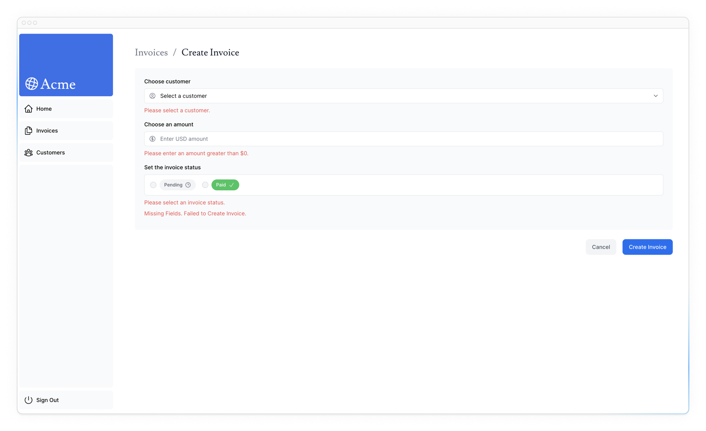

<div class="pt-3 text-sm opacity-70 text-center">

각 필드 아래에 친절한 에러 메시지. 스크린리더 사용자에게도 잘 전달됨.

</div>

<!--
[스크립트]
이것이 완성된 폼입니다. customer를 선택하지 않으면 "Please select a customer."가, amount가 비어 있으면 "Please enter an amount greater than $0."가 각 필드 아래에 붉은 글씨로 나타납니다.

스크린리더 사용자도 aria-live 덕분에 이 에러 메시지를 들을 수 있습니다.

페이지 새로고침 없이 Server Action 결과가 즉시 반영되는 것도 확인할 수 있습니다. useActionState가 상태를 관리하고, 서버에서 받아온 에러를 폼에 표시해주는 흐름입니다.

전환: 이제 amount와 status 필드도 같은 패턴으로 직접 완성해보는 시간입니다.
시간: 1분
-->

---

## 🛠 실습: 다른 필드도 동일하게

<div class="pt-4 text-base">

남은 필드(amount, status)에도 같은 패턴으로 에러 표시와 aria 속성을 추가합니다. 모든 필드가 누락되면 폼 하단에 종합 메시지를 보여주는 것도 좋은 패턴입니다.

</div>

<div class="pt-4 text-base">

도전: **edit 폼** 에도 같은 검증을 적용해 보세요.

</div>

<!--
[스크립트]
실습 시간입니다. 지금까지 customer 필드에 에러 표시를 추가했는데, 같은 패턴으로 amount와 status 필드도 완성해보세요.

구체적으로 할 일은 두 가지입니다. 첫 번째, 각 input/select에 `aria-describedby`를 추가합니다. 두 번째, 각 필드 아래에 에러 메시지를 표시하는 div를 추가합니다.

customer 필드에서 한 것을 그대로 복사해서 id 이름만 바꾸면 됩니다.

도전 과제는 edit 폼입니다. create 폼에서 한 것을 updateInvoice Server Action에도 적용합니다. updateInvoice 함수의 시그니처를 `(id: string, prevState: State, formData: FormData)` 형태로 바꾸고, `useActionState`에서 `bind`로 id를 바인딩합니다.

[Q&A 대비]
Q: edit 폼에서 id를 어떻게 넘기나요?
A: `const updateInvoiceWithId = updateInvoice.bind(null, invoice.id)`처럼 bind를 써서 첫 번째 인자를 미리 바인딩합니다. 그 다음 이 함수를 useActionState에 전달합니다.

전환: 챕터 14를 마무리하며 핵심 내용을 정리하겠습니다.
시간: 10분 (실습)
-->

---

## 📦 챕터 정리

<div class="bg-emerald-900/30 border border-emerald-500/40 rounded p-5 mt-8">

1. **시맨틱 HTML, label, focus outline** = 폼 a11y의 기본.
2. **`eslint-plugin-jsx-a11y`** 가 자주 하는 실수를 잡아줍니다.
3. **서버 검증** 이 클라이언트 검증보다 안전 — Zod + `safeParse` + `useActionState`.
4. **`aria-describedby`, `aria-live`, `aria-atomic`** 으로 스크린리더를 배려.
5. 에러 상태를 React state가 아니라 **Server Action의 반환값** 으로 관리.

</div>

<!--
[스크립트]
챕터 14를 정리합니다.

접근성의 기본인 시맨틱 HTML, label, focus outline은 이미 우리 폼에 잘 갖춰져 있었습니다.

Next.js에 내장된 eslint-plugin-jsx-a11y로 자동 검사를 할 수 있고, `pnpm lint`로 실행합니다.

서버 검증이 클라이언트 검증보다 더 안전합니다. Zod의 safeParse, useActionState를 결합해서 구현했습니다.

ARIA 속성 세 가지, aria-describedby, aria-live, aria-atomic으로 스크린리더 사용자도 에러 메시지를 받을 수 있게 했습니다.

가장 중요한 패턴은 마지막입니다. 에러 상태를 `useState`로 관리하지 않고 Server Action의 반환값으로 관리한다는 것입니다. 클라이언트 코드가 단순해지고 서버와 클라이언트 간 상태가 일치합니다.

전환: 이제 인증을 추가해서 대시보드를 로그인이 필요한 보호된 영역으로 만들어 보겠습니다.
시간: 2분
-->

---
layout: section
---

# Chapter 15
## 인증 추가하기

<div class="pt-4 text-sm opacity-60">

source: <code>https://nextjs.org/learn/dashboard-app/adding-authentication</code>

</div>

---

## Authentication vs Authorization

<div class="grid grid-cols-2 gap-6 pt-6">

<div class="bg-blue-900/30 border border-blue-500/40 rounded p-5">

### 🔐 Authentication (인증)
**"당신이 누구인지 확인"**<br/>
username + password (또는 2FA, OTP 등)<br/>
"신원을 증명하는 단계"

</div>

<div class="bg-purple-900/30 border border-purple-500/40 rounded p-5">

### 🔑 Authorization (권한)
**"확인된 사람이 무엇을 할 수 있는지"**<br/>
"이 사용자는 어디에 접근 가능?"<br/>
인증 다음 단계

</div>

</div>

<div class="pt-6 text-base opacity-80 text-center">

이 챕터에서 다루는 것은 **Authentication** 입니다.

</div>

<!--
[스크립트]
인증을 추가하기 전에 핵심 개념 두 가지를 구분하고 시작합니다.

Authentication, 인증은 "당신이 누구인지 확인"하는 것입니다. 로그인 페이지에서 username과 password를 입력하면 서버가 확인하는 과정입니다. 여권을 보여주는 것과 같습니다.

Authorization, 권한은 "확인된 사람이 무엇을 할 수 있는지"입니다. 로그인이 된 사람이 어느 페이지에 접근할 수 있는지, 어떤 작업을 할 수 있는지 결정합니다. 여권으로 입국을 허가받은 뒤 어떤 구역에 들어갈 수 있는지 결정하는 것과 같습니다.

이 챕터에서는 Authentication에 집중합니다. 로그인 기능을 만들고, 인증되지 않은 사용자가 dashboard에 접근하지 못하게 막는 것입니다.

💡 혼동 포인트: "인증이 되면 권한도 자동으로 부여되나요?" → 아닙니다. 인증은 신원 확인, 권한은 별도 로직입니다. 같은 사용자도 역할에 따라 접근 가능한 페이지가 다를 수 있습니다.

[Q&A 대비]
Q: JWT와 세션 기반 인증의 차이는 무엇인가요?
A: JWT는 토큰 자체에 정보가 있어 서버가 저장소를 조회하지 않아도 됩니다. 세션은 서버에 상태를 저장하고 쿠키에는 세션 id만 담습니다. NextAuth.js는 기본적으로 JWT 방식을 사용합니다.

전환: NextAuth.js를 설치해서 인증 복잡도를 줄여보겠습니다.
시간: 2분
-->

---

## NextAuth.js 소개

<div class="pt-4 text-lg">

세션 관리·로그인·로그아웃 같은 인증 복잡도를 추상화해주는 라이브러리.<br/>
Next.js에 통합된 사실상 표준 솔루션.

</div>

```bash
pnpm i next-auth@beta
```

<div class="pt-3 text-sm opacity-80">

⚠️ Next.js 14+ 호환을 위해 **beta** 버전 설치.

</div>

<!--
[스크립트]
NextAuth.js는 Next.js 생태계의 사실상 표준 인증 라이브러리입니다. 세션 관리, 로그인, 로그아웃, 여러 provider 지원을 모두 추상화해줍니다.

직접 구현하면 JWT 생성, 세션 쿠키 암호화, 보안 헤더 설정 등 많은 것을 직접 처리해야 합니다. NextAuth.js는 이 모든 복잡도를 숨겨줍니다.

`next-auth@beta`를 설치합니다. beta 버전인 이유는 App Router와 Next.js 14+ 호환을 위한 v5 버전이 아직 beta 상태이기 때문입니다. 하지만 이 버전이 App Router에서 안정적으로 동작합니다.

💡 혼동 포인트: "beta 버전을 production에 써도 되나요?" → NextAuth.js v5 beta는 많은 프로젝트에서 production에서 사용 중입니다. 단, 버전 업데이트 시 breaking changes를 확인하는 것이 좋습니다.

[Q&A 대비]
Q: NextAuth.js 외에 다른 인증 라이브러리는 무엇이 있나요?
A: Clerk, Auth0, Supabase Auth, Firebase Auth 등이 있습니다. NextAuth.js는 자체 호스팅이 가능하고 무료인 점이 장점입니다.

전환: 설치 후 가장 먼저 할 일은 보안 키를 생성하는 것입니다.
시간: 1분 30초
-->

---

## AUTH_SECRET 생성

세션 쿠키 암호화에 쓰는 비밀 키를 만듭니다.

```bash
# macOS / Linux
openssl rand -base64 32
```

<div class="pt-3 text-sm opacity-80">

Windows: <code>https://generate-secret.vercel.app/32</code>

</div>

```bash
# .env
AUTH_SECRET=your-generated-secret
```

<div class="pt-3 text-sm opacity-80">

⚠️ production에서는 Vercel 환경 변수에도 이 값을 추가해야 합니다.

</div>

<!--
[스크립트]
AUTH_SECRET은 세션 쿠키를 암호화하는 비밀 키입니다. 이 값이 없으면 다른 사람이 세션 쿠키를 위조할 수 있습니다.

macOS나 Linux에서는 터미널에서 `openssl rand -base64 32`를 실행하면 32바이트 랜덤 값이 base64로 출력됩니다. Windows는 Vercel이 제공하는 생성기를 사용합니다.

생성된 값을 `.env` 파일에 `AUTH_SECRET=`으로 저장합니다. `.env`는 `.gitignore`에 포함되어 있어야 합니다. 절대 GitHub에 올리지 마세요.

Vercel에 배포할 때는 Vercel 대시보드의 Environment Variables에도 동일한 값을 추가해야 합니다.

💡 혼동 포인트: "개발 환경과 production 환경에 같은 AUTH_SECRET을 써도 되나요?" → 아닙니다. 환경마다 다른 값을 쓰는 것이 보안상 좋습니다.

[Q&A 대비]
Q: AUTH_SECRET을 `.env.local`에 넣어도 되나요?
A: 네, `.env.local`도 gitignore에 기본으로 포함되므로 안전합니다. Next.js는 `.env`, `.env.local` 모두 로드합니다.

전환: 보안 키 준비가 됐으니 로그인 페이지를 만들어 보겠습니다.
시간: 1분 30초
-->

---

## /login 페이지 만들기

```typescript
// /app/login/page.tsx
import AcmeLogo from '@/app/ui/acme-logo';
import LoginForm from '@/app/ui/login-form';
import { Suspense } from 'react';

export default function LoginPage() {
  return (
    <main className="flex items-center justify-center md:h-screen">
      <div className="relative mx-auto flex w-full max-w-[400px] flex-col space-y-2.5 p-4 md:-mt-32">
        {/* logo */}
        <Suspense>
          <LoginForm />
        </Suspense>
      </div>
    </main>
  );
}
```

<div class="pt-2 text-sm opacity-80">

`<LoginForm>`을 `<Suspense>`로 감싼 이유: URL search params(`callbackUrl`)에 접근하기 때문.

</div>

<!--
[스크립트]
`/app/login/page.tsx`는 간단합니다. 로고와 `LoginForm` 컴포넌트를 렌더링합니다.

한 가지 주목할 점이 있습니다. `<LoginForm />`을 `<Suspense>`로 감싸고 있습니다. 이유는 LoginForm 안에서 `useSearchParams`를 사용해서 URL의 `callbackUrl` 파라미터를 읽기 때문입니다.

Next.js에서 `useSearchParams`를 사용하는 컴포넌트는 반드시 Suspense 경계로 감싸야 합니다. 그렇지 않으면 SSR 중 에러가 발생할 수 있습니다.

`callbackUrl`은 로그인 후 어디로 돌아갈지를 담고 있습니다. 예를 들어 `/dashboard/invoices`를 직접 방문하다가 로그인 페이지로 리다이렉트됐다면, 로그인 성공 후 `/dashboard/invoices`로 돌아갑니다.

[Q&A 대비]
Q: Suspense fallback을 지정하지 않아도 되나요?
A: `<Suspense>` 컴포넌트는 fallback을 지정하지 않으면 null이 기본값입니다. 빈 Suspense도 동작하지만 로딩 중 UI가 없으면 빈 화면이 보일 수 있습니다.

전환: 로그인 페이지가 준비됐으니 NextAuth.js 설정을 시작합니다.
시간: 1분 30초
-->

---

## auth.config.ts: pages 옵션

```typescript
// /auth.config.ts
import type { NextAuthConfig } from 'next-auth';

export const authConfig = {
  pages: {
    signIn: '/login',
  },
} satisfies NextAuthConfig;
```

<div class="pt-4 text-base opacity-80">

`signIn: '/login'` — 인증되지 않은 사용자를 우리 커스텀 로그인 페이지로 보냄 (NextAuth.js 기본 페이지 대신).

</div>

<!--
[스크립트]
`auth.config.ts`는 NextAuth.js의 기본 설정 파일입니다. 나중에 Proxy에서도 사용할 것이기 때문에 별도 파일로 분리합니다.

`pages.signIn: '/login'`을 지정하면 인증되지 않은 사용자가 보호된 페이지에 접근할 때 NextAuth.js 기본 로그인 페이지 대신 우리가 만든 `/login`으로 리다이렉트됩니다.

이 설정이 없으면 NextAuth.js의 기본 로그인 UI가 나옵니다. 실제 서비스에서는 브랜딩된 커스텀 로그인 페이지가 필요하므로 이 설정은 거의 필수입니다.

`satisfies NextAuthConfig`는 TypeScript 타입 검사를 위한 것입니다. `NextAuthConfig` 타입을 만족하는 객체인지 확인합니다.

[Q&A 대비]
Q: pages.signOut도 설정할 수 있나요?
A: 네, `pages.signOut: '/logout'`처럼 설정할 수 있습니다. 로그아웃 후 표시할 커스텀 페이지를 지정합니다.

전환: 이 설정 파일을 사용해서 라우트 보호 로직을 추가해 보겠습니다.
시간: 1분 30초
-->

---

## Proxy로 라우트 보호

```typescript {7-19}
// /auth.config.ts
import type { NextAuthConfig } from 'next-auth';

export const authConfig = {
  pages: {
    signIn: '/login',
  },
  callbacks: {
    authorized({ auth, request: { nextUrl } }) {
      const isLoggedIn = !!auth?.user;
      const isOnDashboard = nextUrl.pathname.startsWith('/dashboard');
      if (isOnDashboard) {
        if (isLoggedIn) return true;
        return false;
      } else if (isLoggedIn) {
        return Response.redirect(new URL('/dashboard', nextUrl));
      }
      return true;
    },
  },
  providers: [],
} satisfies NextAuthConfig;
```

<!--
[스크립트]
`authorized` 콜백은 모든 요청마다 실행되어 접근을 허가할지 말지 결정합니다.

로직을 읽어보면: 로그인 상태인지 확인하고(`isLoggedIn`), 대시보드로 가는 요청인지 확인합니다(`isOnDashboard`).

대시보드로 가는 요청이면: 로그인 상태면 허가(`return true`), 아니면 거부(`return false`). 거부하면 NextAuth.js가 자동으로 로그인 페이지로 리다이렉트합니다.

로그인 페이지로 가는 요청인데 이미 로그인 상태라면: 대시보드로 리다이렉트합니다.

이 로직이 모든 요청에서 실행되려면 Proxy(middleware.ts)에 연결해야 합니다.

💡 혼동 포인트: "providers: []는 왜 빈 배열인가요?" → auth.config.ts는 Edge runtime에서도 동작해야 합니다. bcrypt 같은 Node.js 전용 패키지를 여기에 넣을 수 없기 때문에 provider 설정은 별도 파일에서 합니다.

[Q&A 대비]
Q: dashboard 외에 다른 라우트도 보호할 수 있나요?
A: 네, nextUrl.pathname 조건을 수정하면 됩니다. 예를 들어 `/admin`으로 시작하는 모든 라우트를 보호하려면 `startsWith('/admin')`을 추가합니다.

전환: 이 콜백이 실제로 동작하려면 proxy.ts(middleware)에 연결해야 합니다.
시간: 2분
-->

---

## proxy.ts 만들기

```typescript
// /proxy.ts
import NextAuth from 'next-auth';
import { authConfig } from './auth.config';

export default NextAuth(authConfig).auth;

export const config = {
  matcher: ['/((?!api|_next/static|_next/image|.*\\.png$).*)'],
};
```

<div class="pt-4 text-base opacity-80 bg-emerald-900/30 border border-emerald-500/40 rounded p-3">

✨ Proxy의 장점: 보호된 라우트는 **인증이 통과되기 전까지 렌더링조차 시작하지 않습니다.** 보안 + 성능 모두 향상.

</div>

<!--
[스크립트]
`proxy.ts`는 Next.js의 middleware 파일입니다. 프로젝트 루트에 위치하며, Next.js가 자동으로 이것을 middleware로 인식합니다.

`NextAuth(authConfig).auth`를 export default로 내보내면, 이 middleware가 모든 요청을 가로채서 `authorized` 콜백을 실행합니다.

`config.matcher`는 어떤 경로에서 middleware를 실행할지 정의합니다. 정규식으로 `api`, `_next/static`, `_next/image`, `.png` 파일은 제외합니다. 이런 정적 파일들은 인증 없이 접근 가능해야 하기 때문입니다.

가장 큰 장점은 보호된 라우트는 인증이 통과되기 전까지 렌더링 자체가 시작되지 않는다는 것입니다. 페이지가 로드된 후 JavaScript로 리다이렉트하는 방식보다 훨씬 안전하고 빠릅니다.

💡 혼동 포인트: "middleware.ts와 proxy.ts 이름 차이는?" → Next.js는 `middleware.ts`를 자동으로 인식합니다. 이 강의에서는 `proxy.ts`라는 이름을 사용하지만, 실제 Next.js 규칙은 `middleware.ts` 또는 `middleware.js`입니다.

[Q&A 대비]
Q: Proxy는 Edge runtime에서 실행되나요?
A: 네, Next.js middleware는 Edge runtime에서 실행됩니다. 그래서 Node.js 전용 패키지(bcrypt 등)를 middleware에서 직접 사용할 수 없습니다.

전환: bcrypt를 사용하는 실제 인증 로직은 Edge runtime과 분리된 별도 파일에서 처리합니다.
시간: 2분
-->

---

## bcrypt와 별도 auth.ts

bcrypt는 Node.js API에 의존해서 Proxy(Edge runtime)에서 못 씁니다. 그래서 별도 파일로 분리.

```typescript
// /auth.ts
import NextAuth from 'next-auth';
import { authConfig } from './auth.config';

export const { auth, signIn, signOut } = NextAuth({
  ...authConfig,
});
```

<!--
[스크립트]
bcrypt는 비밀번호 해시를 처리하는 라이브러리인데 Node.js API에 의존합니다. Edge runtime에서는 Node.js API를 쓸 수 없기 때문에 proxy.ts(middleware)에서는 bcrypt를 사용하지 못합니다.

그래서 설정 파일을 두 개로 분리합니다. `auth.config.ts`는 Edge runtime에서도 동작하는 기본 설정, `auth.ts`는 Node.js 환경에서만 동작하는 전체 설정입니다.

`auth.ts`에서 `NextAuth`를 호출하면 세 가지를 export할 수 있습니다: `auth`(현재 세션 확인), `signIn`(로그인), `signOut`(로그아웃). 이것들을 다른 파일에서 import해서 사용합니다.

`...authConfig`로 기본 설정(pages, callbacks)을 spread하고, providers 같은 추가 설정을 여기서 더합니다.

[Q&A 대비]
Q: `auth`를 Server Component에서 쓸 수 있나요?
A: 네, `import { auth } from '@/auth'`로 가져와서 `const session = await auth()`로 현재 세션을 확인할 수 있습니다.

전환: Credentials provider를 추가해서 username/password 로그인을 구현합니다.
시간: 1분 30초
-->

---

## Credentials provider 추가

```typescript
// /auth.ts
import NextAuth from 'next-auth';
import Credentials from 'next-auth/providers/credentials';
import { authConfig } from './auth.config';

export const { auth, signIn, signOut } = NextAuth({
  ...authConfig,
  providers: [Credentials({})],
});
```

<div class="pt-3 text-base opacity-80">

`Credentials` = username + password 로그인. OAuth(Google/GitHub)나 email 같은 다른 provider도 지원합니다.

</div>

<!--
[스크립트]
NextAuth.js는 다양한 provider를 지원합니다. OAuth로 Google이나 GitHub 로그인, magic link 이메일 로그인, 그리고 우리가 사용하는 Credentials 즉 username/password 로그인입니다.

`Credentials({})` 안에는 아직 비어 있습니다. 다음 슬라이드에서 실제 `authorize` 함수를 채웁니다.

실제 서비스에서 Credentials provider는 추천하지 않는 경우도 있습니다. 비밀번호를 직접 관리해야 하는 보안 부담이 생기기 때문입니다. 가능하면 OAuth나 magic link를 쓰는 것이 더 안전합니다. 하지만 학습 목적으로는 Credentials가 가장 이해하기 쉽습니다.

[Q&A 대비]
Q: Google OAuth를 추가하려면 어떻게 하나요?
A: `providers: [Google({ clientId: process.env.GOOGLE_CLIENT_ID, clientSecret: process.env.GOOGLE_CLIENT_SECRET })]`처럼 추가하고, Google Cloud Console에서 OAuth 앱을 등록하면 됩니다.

전환: authorize 함수 안에서 실제 인증 로직을 구현합니다.
시간: 1분 30초
-->

---

## authorize 함수에서 검증 + 비교

```typescript
import { z } from 'zod';
import bcrypt from 'bcrypt';

async function getUser(email: string): Promise<User | undefined> {
  const user = await sql<User[]>`SELECT * FROM users WHERE email=${email}`;
  return user[0];
}

Credentials({
  async authorize(credentials) {
    const parsedCredentials = z
      .object({ email: z.string().email(), password: z.string().min(6) })
      .safeParse(credentials);

    if (parsedCredentials.success) {
      const { email, password } = parsedCredentials.data;
      const user = await getUser(email);
      if (!user) return null;
      const passwordsMatch = await bcrypt.compare(password, user.password);
      if (passwordsMatch) return user;
    }
    return null;
  },
})
```

<!--
[스크립트]
`authorize` 함수는 로그인 요청이 들어왔을 때 실행됩니다.

흐름을 따라가 봅니다. 먼저 Zod로 입력값을 검증합니다. email 형식이 맞는지, password가 6자 이상인지 확인합니다. 검증 실패면 null을 반환합니다.

검증이 통과하면 DB에서 해당 email의 사용자를 찾습니다. 사용자가 없으면 null 반환입니다.

`bcrypt.compare`로 입력한 비밀번호와 DB에 저장된 해시를 비교합니다. 일치하면 user 객체를 반환하고 로그인 성공, 불일치면 null로 실패입니다.

`authorize`가 null을 반환하면 NextAuth.js가 자동으로 인증 실패로 처리합니다. user 객체를 반환하면 세션에 저장합니다.

💡 혼동 포인트: "bcrypt.compare가 해시된 비밀번호와 일반 텍스트를 비교하는 건가요?" → 맞습니다. DB에는 해시된 비밀번호가 저장되어 있고, bcrypt.compare는 입력한 평문과 해시를 안전하게 비교합니다. 해시를 복호화하는 게 아닙니다.

[Q&A 대비]
Q: DB에서 비밀번호를 평문으로 저장하면 안 되나요?
A: 절대 안 됩니다. DB가 유출되면 모든 비밀번호가 노출됩니다. bcrypt는 단방향 해시로 원본을 알 수 없게 만들고, salt를 추가해서 같은 비밀번호도 다른 해시가 나옵니다.

전환: authorize 함수가 준비됐으니, 폼 제출을 처리하는 authenticate Server Action을 만듭니다.
시간: 2분
-->

---

## authenticate 액션

```typescript
// /app/lib/actions.ts
'use server';

import { signIn } from '@/auth';
import { AuthError } from 'next-auth';

export async function authenticate(
  prevState: string | undefined,
  formData: FormData,
) {
  try {
    await signIn('credentials', formData);
  } catch (error) {
    if (error instanceof AuthError) {
      switch (error.type) {
        case 'CredentialsSignin':
          return 'Invalid credentials.';
        default:
          return 'Something went wrong.';
      }
    }
    throw error;
  }
}
```

<!--
[스크립트]
`authenticate`는 로그인 폼을 처리하는 Server Action입니다.

핵심은 `signIn('credentials', formData)`입니다. NextAuth.js의 signIn 함수에 provider 이름과 formData를 넘기면 내부적으로 authorize 함수가 실행됩니다.

에러 처리가 흥미롭습니다. `signIn`이 실패하면 `AuthError`를 던집니다. `CredentialsSignin` 타입이면 잘못된 자격증명, 나머지는 일반 오류 메시지를 반환합니다.

주의할 점이 있습니다. 마지막 `throw error`는 AuthError가 아닌 다른 에러를 다시 던집니다. 이것은 Next.js의 redirect 동작과 관련이 있는데, redirect는 내부적으로 특수한 에러를 사용하기 때문에 catch하면 안 됩니다.

[Q&A 대비]
Q: 로그인 성공 후 redirect는 어디서 처리하나요?
A: signIn 함수 안에서 자동으로 처리됩니다. formData에 `redirectTo` 값이 있으면 그 경로로, 없으면 기본 callbackUrl로 이동합니다.

전환: 이 authenticate 액션을 LoginForm 컴포넌트에 연결합니다.
시간: 2분
-->

---

## LoginForm — useActionState로 연결

```typescript
'use client';

import { useActionState } from 'react';
import { authenticate } from '@/app/lib/actions';
import { useSearchParams } from 'next/navigation';

export default function LoginForm() {
  const searchParams = useSearchParams();
  const callbackUrl = searchParams.get('callbackUrl') || '/dashboard';
  const [errorMessage, formAction, isPending] = useActionState(
    authenticate,
    undefined,
  );

  return (
    <form action={formAction} className="space-y-3">
      {/* email, password input */}
      <input type="hidden" name="redirectTo" value={callbackUrl} />
      <Button className="mt-4 w-full" aria-disabled={isPending}>
        Log in
      </Button>
      {errorMessage && <p className="text-sm text-red-500">{errorMessage}</p>}
    </form>
  );
}
```

<!--
[스크립트]
`LoginForm`은 우리가 이미 알고 있는 패턴입니다. `useActionState`를 사용해서 `authenticate` Server Action과 연결합니다.

반환값 배열에서 세 가지를 받습니다. `errorMessage`는 Server Action이 반환한 에러 문자열, `formAction`은 폼에 연결할 액션, `isPending`은 제출 중인지 여부입니다.

`isPending`은 버튼의 `aria-disabled`에 연결됩니다. 제출 중에는 버튼이 비활성화되어 중복 제출을 막습니다.

`callbackUrl`은 URL 파라미터에서 읽어서 hidden input으로 폼에 포함합니다. 로그인 성공 후 이 URL로 돌아갑니다.

에러가 있으면 폼 아래에 붉은 에러 메시지가 표시됩니다.

[Q&A 대비]
Q: isPending 중 로딩 스피너를 보여주려면 어떻게 하나요?
A: `{isPending ? <Spinner /> : 'Log in'}` 형태로 버튼 텍스트를 교체하거나, 버튼 옆에 스피너를 조건부로 렌더링하면 됩니다.

전환: 로그인이 됐으면 로그아웃도 있어야죠. 로그아웃 버튼을 추가합니다.
시간: 2분
-->

---

## 로그아웃 버튼

```typescript
// /ui/dashboard/sidenav.tsx
import { signOut } from '@/auth';

<form
  action={async () => {
    'use server';
    await signOut({ redirectTo: '/' });
  }}
>
  <button>
    <PowerIcon className="w-6" />
    <div className="hidden md:block">Sign Out</div>
  </button>
</form>
```

<div class="pt-3 text-base opacity-80">

`<form>` 안에서 inline `'use server'` 함수로 `signOut` 호출.

</div>

<!--
[스크립트]
로그아웃 버튼은 사이드 네비게이션에 위치합니다. 패턴이 재미있습니다.

`<form>` 안에서 `action` prop으로 async 함수를 직접 정의합니다. 그 함수 안에 `'use server'`를 선언해서 Server Function으로 만듭니다. 이것이 인라인 Server Function 패턴입니다.

`signOut({ redirectTo: '/' })`를 호출하면 세션 쿠키가 삭제되고 홈으로 리다이렉트됩니다.

왜 `<form>`을 쓰나요? Next.js의 Server Action은 `<form action>`에 함수를 전달하는 방식이 기본입니다. `<button onClick>` 방식도 가능하지만, form 방식이 더 자연스럽고 접근성도 좋습니다.

💡 혼동 포인트: "버튼 안에 `'use server'`를 쓰는 게 이상하지 않나요?" → 인라인 Server Function은 클로저처럼 동작합니다. form의 action으로 전달하는 함수이기 때문에 `'use server'`가 필요합니다. 별도 파일로 분리해도 됩니다.

[Q&A 대비]
Q: signOut 후 특정 페이지가 아닌 로그인 페이지로 보내려면 어떻게 하나요?
A: `signOut({ redirectTo: '/login' })`으로 redirectTo를 변경하면 됩니다.

전환: 이제 테스트 계정으로 로그인/로그아웃이 정상 동작하는지 확인해봅니다.
시간: 1분 30초
-->

---

## 🔑 테스트 계정

<div class="pt-12 text-center text-2xl">

Email: <code>user@nextmail.com</code><br/>
Password: <code>123456</code>

</div>

<div class="pt-12 text-center text-base opacity-80">

로그인 → 대시보드 → 로그아웃 흐름이 모두 동작하면 성공!

</div>

<!--
[스크립트]
이제 직접 테스트해볼 시간입니다.

이메일은 `user@nextmail.com`, 비밀번호는 `123456`입니다. seed 데이터에 포함된 테스트 계정입니다.

테스트 순서입니다. 먼저 `http://localhost:3000/dashboard`에 직접 접속해봅니다. 로그인 페이지로 리다이렉트되면 Proxy가 정상 동작한 것입니다. 로그인 후 대시보드로 이동되면 인증이 성공한 것입니다. 사이드바의 Sign Out 버튼을 누르면 홈으로 이동되면 로그아웃도 성공입니다.

잘못된 비밀번호를 입력했을 때 "Invalid credentials." 메시지가 나오면 에러 처리도 잘 되고 있는 것입니다.

[Q&A 대비]
Q: 로그인 후 세션이 언제까지 유지되나요?
A: NextAuth.js 기본 설정에서 세션은 30일간 유지됩니다. `session.maxAge`로 조정할 수 있습니다.

전환: 인증까지 완성됐습니다. 이제 챕터 15를 정리하겠습니다.
시간: 5분 (실습)
-->

---

## 📦 챕터 정리

<div class="bg-emerald-900/30 border border-emerald-500/40 rounded p-5 mt-8">

1. **Authentication ≠ Authorization**.
2. **NextAuth.js (beta)** 로 인증 복잡도를 줄임.
3. **`AUTH_SECRET`** + **Proxy** 로 라우트 보호. 보호된 라우트는 인증 통과 전 렌더 X.
4. **bcrypt** 는 Edge runtime에서 안 되니 `auth.ts`에 분리.
5. **`useActionState` + `authenticate` Server Action** 으로 로그인 폼 처리.

</div>

<!--
[스크립트]
챕터 15를 정리합니다.

Authentication과 Authorization은 다릅니다. 이번 챕터는 Authentication만 다뤘습니다.

NextAuth.js beta 버전으로 인증 복잡도를 대폭 줄였습니다. 세션 관리, 쿠키 암호화, 리다이렉트 로직이 모두 내장되어 있습니다.

AUTH_SECRET은 세션 쿠키 암호화 키입니다. Proxy는 인증 통과 전 라우트 렌더링을 막는 middleware입니다. 이 두 가지가 보안의 핵심입니다.

bcrypt는 Edge runtime에서 못 쓰기 때문에 auth.ts를 별도로 분리했습니다. auth.config.ts(Edge 가능)와 auth.ts(Node.js 전용)를 구분해서 씁니다.

로그인 폼은 useActionState와 authenticate Server Action을 조합했습니다. 챕터 14에서 배운 폼 패턴과 동일합니다.

전환: 대시보드가 완성됐습니다. 이제 SEO와 소셜 공유를 위한 메타데이터를 추가해보겠습니다.
시간: 2분
-->

---
layout: section
---

# Chapter 16
## 메타데이터 추가

<div class="pt-4 text-sm opacity-60">

source: <code>https://nextjs.org/learn/dashboard-app/adding-metadata</code>

</div>

---

## 메타데이터란?

<div class="pt-4 text-lg">

페이지에 대한 **추가 정보**. 사용자에게는 보이지 않지만, HTML `<head>` 안에 들어가 검색엔진과 소셜 플랫폼이 페이지를 이해하는 데 사용합니다.

</div>

<div class="pt-6 grid grid-cols-3 gap-3 text-sm">

<div class="bg-slate-800/50 p-3 rounded">

🔍 **SEO**

검색 결과 노출 향상

</div>

<div class="bg-slate-800/50 p-3 rounded">

📲 **소셜 공유**

링크 미리보기

</div>

<div class="bg-slate-800/50 p-3 rounded">

🌐 **접근성**

크롤러가 페이지를 이해

</div>

</div>

<!--
[스크립트]
메타데이터는 페이지 안에 있지만 사용자 눈에는 보이지 않는 정보입니다. HTML `<head>` 태그 안에 들어가는 것들입니다.

세 가지 관점에서 중요합니다.

SEO, 검색 엔진 최적화입니다. title과 description이 잘 설정되어 있으면 구글 검색 결과에서 더 잘 노출됩니다.

소셜 공유입니다. 카카오톡이나 Twitter에 링크를 공유할 때 미리보기 이미지와 제목이 나오는 것이 Open Graph 메타데이터 덕분입니다.

접근성입니다. 검색 크롤러가 페이지 내용을 이해하는 데도 도움이 됩니다.

메타데이터는 직접 개발자가 HTML을 수정하는 것이 아니라 Next.js의 Metadata API를 통해 선언적으로 설정합니다.

[Q&A 대비]
Q: Next.js 없이 React만 쓰면 메타데이터를 어떻게 설정하나요?
A: `react-helmet`이나 `react-helmet-async` 같은 라이브러리를 씁니다. Next.js의 Metadata API는 이 과정을 훨씬 간단하게 만들어줍니다.

전환: 어떤 종류의 메타데이터가 있는지 살펴보겠습니다.
시간: 1분 30초
-->

---

## 메타데이터 종류

<div class="pt-4 grid grid-cols-2 gap-3 text-sm">

<div class="bg-slate-800/50 p-3 rounded">

**Title**
브라우저 탭 제목, SEO 핵심

</div>

<div class="bg-slate-800/50 p-3 rounded">

**Description**
페이지 요약, 검색 결과에 표시

</div>

<div class="bg-slate-800/50 p-3 rounded">

**Keyword**
페이지 키워드 (가중치는 줄어드는 추세)

</div>

<div class="bg-slate-800/50 p-3 rounded">

**Open Graph**
소셜 미디어 공유 시 미리보기 (제목·설명·이미지)

</div>

<div class="bg-slate-800/50 p-3 rounded col-span-2">

**Favicon**
브라우저 탭의 작은 아이콘

</div>

</div>

<!--
[스크립트]
주요 메타데이터 종류를 봅니다.

Title은 브라우저 탭에 보이는 제목입니다. 검색 결과에도 클릭할 수 있는 파란 링크 텍스트로 나옵니다. SEO에서 가장 중요한 메타데이터입니다.

Description은 검색 결과에서 제목 아래에 나오는 2-3줄 요약입니다. 클릭률에 영향을 줍니다.

Keywords는 예전에는 중요했지만 구글이 가중치를 대폭 낮췄습니다. 요즘은 거의 무시됩니다.

Open Graph는 소셜 미디어 공유를 위한 것입니다. og:title, og:description, og:image를 설정하면 링크 미리보기가 예쁘게 나옵니다.

Favicon은 브라우저 탭의 작은 아이콘입니다. 16x16이나 32x32 픽셀의 이미지입니다.

[Q&A 대비]
Q: og:image 권장 크기는 무엇인가요?
A: 1200x630 픽셀이 표준입니다. 이 비율(약 1.91:1)이 대부분의 소셜 플랫폼에서 잘 보입니다.

전환: Next.js에서 메타데이터를 추가하는 두 가지 방법을 알아봅니다.
시간: 1분 30초
-->

---

## 두 가지 추가 방법

<div class="grid grid-cols-2 gap-6 pt-6">

<div class="bg-slate-800/50 p-4 rounded">

### 1️⃣ Config-based
`layout.js`나 `page.js`에서 `metadata` 객체나 `generateMetadata` 함수를 export

</div>

<div class="bg-slate-800/50 p-4 rounded">

### 2️⃣ File-based
특수 파일명을 자동 인식
- `favicon.ico`
- `opengraph-image.jpg`
- `robots.txt`
- `sitemap.xml`

</div>

</div>

<!--
[스크립트]
메타데이터를 추가하는 방법은 두 가지입니다.

Config-based는 코드로 설정하는 방식입니다. `layout.tsx`나 `page.tsx`에서 `metadata` 상수나 `generateMetadata` 함수를 export합니다. 동적으로 생성되는 메타데이터에 적합합니다.

File-based는 특수한 파일명을 사용하는 방식입니다. `favicon.ico`를 `/app` 폴더에 두면 Next.js가 자동으로 favicon으로 인식합니다. `robots.txt`도 마찬가지입니다. 파일만 두면 됩니다.

두 방식을 함께 쓸 수 있습니다. 공통 설정은 루트 layout에서 config-based로, 파비콘과 OG 이미지는 file-based로 처리하는 것이 일반적입니다.

[Q&A 대비]
Q: `generateMetadata`는 언제 쓰나요?
A: 동적 라우트에서 DB 데이터로 메타데이터를 생성할 때 씁니다. 예를 들어 블로그 포스트 페이지에서 `const post = await getPost(params.id)`로 글 정보를 가져와 title을 동적으로 만들 때입니다.

전환: File-based 방식부터 favicon과 OG 이미지를 설정해봅니다.
시간: 2분
-->

---

## Favicon과 OG 이미지

<div class="pt-4 text-base">

`/public` 폴더의 `favicon.ico`와 `opengraph-image.jpg`를 **`/app` 폴더 루트** 로 옮기기만 하면 Next.js가 자동으로 인식합니다.

</div>

<div class="pt-6 text-sm opacity-80">

DevTools의 `<head>` 요소에서 `<link rel="icon">`이 추가된 것을 확인할 수 있습니다.

</div>

<div class="pt-6 text-base">

💡 동적 OG 이미지가 필요하면 **`ImageResponse`** constructor를 사용할 수 있습니다.

</div>

<!--
[스크립트]
File-based 방식은 정말 간단합니다. 파일을 올바른 위치에 두기만 하면 됩니다.

`/public` 폴더에 있는 `favicon.ico`와 `opengraph-image.jpg`를 `/app` 폴더 루트로 이동합니다. `/app/favicon.ico`, `/app/opengraph-image.jpg`가 되는 것입니다.

그것뿐입니다. Next.js가 자동으로 `<link rel="icon" href="/favicon.ico">`와 Open Graph 관련 meta 태그를 HTML head에 추가합니다.

DevTools에서 `<head>` 요소를 확인하면 Next.js가 추가한 태그들을 볼 수 있습니다.

동적 OG 이미지가 필요할 때는 `ImageResponse`를 사용합니다. 예를 들어 사용자 프로필 OG 이미지를 서버에서 실시간으로 생성할 수 있습니다.

[Q&A 대비]
Q: favicon.svg도 지원하나요?
A: 네, Next.js는 `.ico`, `.png`, `.svg` 등 다양한 favicon 포맷을 지원합니다.

전환: 이제 Config-based로 페이지 title과 description을 설정합니다.
시간: 1분 30초
-->

---

## 페이지 title과 description

```typescript
// /app/layout.tsx
import { Metadata } from 'next';

export const metadata: Metadata = {
  title: 'Acme Dashboard',
  description: 'The official Next.js Course Dashboard, built with App Router.',
  metadataBase: new URL('https://next-learn-dashboard.vercel.sh'),
};
```

<div class="pt-4 text-base opacity-80">

루트 layout의 metadata는 **모든 페이지에 상속** 됩니다.

</div>

<!--
[스크립트]
Config-based 방식입니다. 루트 `layout.tsx`에서 `Metadata` 타입을 가져와서 `metadata` 상수를 export합니다.

`title`은 모든 페이지의 기본 제목, `description`은 기본 설명입니다. `metadataBase`는 절대 URL을 만들 때 사용하는 기본 도메인입니다. OG 이미지 URL처럼 절대 경로가 필요한 경우에 쓰입니다.

루트 layout에 설정된 metadata는 모든 하위 페이지에 상속됩니다. 각 페이지에서 별도로 설정하지 않으면 이 기본값이 적용됩니다.

`Metadata` 타입을 import해서 타입 체크를 받는 것이 좋습니다. 오타나 잘못된 키를 TypeScript가 잡아줍니다.

[Q&A 대비]
Q: metadataBase를 설정하지 않으면 어떻게 되나요?
A: Next.js가 경고를 표시합니다. localhost에서는 `http://localhost:3000`을 기본으로 쓰지만, production에서는 반드시 실제 도메인을 설정해야 합니다.

전환: 특정 페이지에서 다른 title을 사용하려면 해당 페이지에서 metadata를 export하면 됩니다.
시간: 2분
-->

---

## 페이지별 metadata

```typescript
// /app/dashboard/invoices/page.tsx
import { Metadata } from 'next';

export const metadata: Metadata = {
  title: 'Invoices | Acme Dashboard',
};
```

<div class="pt-4 text-base opacity-80">

페이지의 metadata는 부모 layout의 metadata를 **덮어씁니다.**

</div>

<div class="pt-6 text-sm opacity-70">

❗ 단점: 페이지마다 'Acme Dashboard'를 반복해 적어야 합니다. 회사 이름이 바뀌면 모든 페이지를 수정해야...

</div>

<!--
[스크립트]
각 페이지에서 `metadata`를 export하면 해당 페이지만의 title을 가질 수 있습니다. 페이지 metadata는 루트 layout의 metadata를 덮어씁니다.

하지만 문제가 있습니다. `'Invoices | Acme Dashboard'`처럼 매 페이지마다 "Acme Dashboard"를 반복해서 써야 합니다. 5개 페이지면 5번 씁니다. 나중에 서비스 이름이 바뀌면 모든 페이지를 수정해야 합니다.

다음 슬라이드에서 이 문제를 `title.template`으로 해결합니다.

[Q&A 대비]
Q: 페이지 metadata와 layout metadata가 충돌하면 어떻게 되나요?
A: 더 구체적인(하위) 것이 우선합니다. 페이지 metadata가 layout metadata를 덮어씁니다.

전환: title.template으로 반복을 없애봅시다.
시간: 1분
-->

---

## title.template으로 반복 제거

```typescript
// /app/layout.tsx
export const metadata: Metadata = {
  title: {
    template: '%s | Acme Dashboard',
    default: 'Acme Dashboard',
  },
  description: 'The official Next.js Learn Dashboard built with App Router.',
  metadataBase: new URL('https://next-learn-dashboard.vercel.sh'),
};
```

```typescript
// /app/dashboard/invoices/page.tsx
export const metadata: Metadata = {
  title: 'Invoices',
};
```

<div class="pt-3 text-sm opacity-80">

`%s` 자리에 페이지 title이 들어감 → 결과: `Invoices | Acme Dashboard`

</div>

<!--
[스크립트]
`title.template`을 사용하면 반복 문제가 깔끔하게 해결됩니다.

루트 layout에서 `title`을 문자열이 아닌 객체로 설정합니다. `template: '%s | Acme Dashboard'`에서 `%s`는 자리 표시자입니다. `default: 'Acme Dashboard'`는 하위 페이지에 title이 없을 때 사용할 기본값입니다.

각 페이지에서는 `title: 'Invoices'`처럼 짧게만 씁니다. Next.js가 자동으로 `%s`에 'Invoices'를 넣어서 최종적으로 `Invoices | Acme Dashboard`가 됩니다.

이제 서비스 이름이 바뀌어도 루트 layout 한 곳만 수정하면 모든 페이지에 적용됩니다.

💡 혼동 포인트: "`default`는 왜 필요한가요?" → 루트 layout 자체에 접속했을 때 (`/`)나 하위 페이지에서 title을 설정하지 않은 경우에 default 값이 사용됩니다.

[Q&A 대비]
Q: 여러 level의 layout이 있을 때 template이 중첩되나요?
A: 아닙니다. 가장 가까운(하위) layout의 template이 적용됩니다. 하위 layout에서 template을 재정의하면 부모의 template은 무시됩니다.

전환: 나머지 페이지에도 title을 직접 추가해보는 실습입니다.
시간: 2분
-->

---

## 🛠 실습: 페이지 title 추가

<div class="pt-4 text-base">

title 템플릿을 사용해 다음 페이지에 제목을 추가하세요.

</div>

<div class="pt-4 grid grid-cols-2 gap-3 text-sm">

<div class="bg-slate-800/50 p-3 rounded">

`/login`

</div>

<div class="bg-slate-800/50 p-3 rounded">

`/dashboard`

</div>

<div class="bg-slate-800/50 p-3 rounded">

`/dashboard/customers`

</div>

<div class="bg-slate-800/50 p-3 rounded">

`/dashboard/invoices/create`

</div>

<div class="bg-slate-800/50 p-3 rounded col-span-2">

`/dashboard/invoices/[id]/edit`

</div>

</div>

<!--
[스크립트]
실습입니다. 다섯 개 페이지에 title을 추가합니다.

방법은 각 페이지 파일에서 `export const metadata: Metadata = { title: 'Page Name' }`을 추가하면 됩니다. title.template 덕분에 짧은 이름만 써도 전체 제목이 만들어집니다.

`/login` 페이지는 `title: 'Login'`, `/dashboard`는 `title: 'Dashboard'` 이런 식으로 넣으면 됩니다.

동적 라우트인 `/dashboard/invoices/[id]/edit`는 특별합니다. invoice id가 title에 포함되어야 한다면 `generateMetadata` 함수를 사용해야 합니다. 이것이 도전 과제입니다.

[Q&A 대비]
Q: dashboard/layout.tsx에서 설정하면 dashboard 하위 페이지 모두에 적용되나요?
A: 네, 맞습니다. 루트 layout → dashboard/layout.tsx → page.tsx 순으로 상속됩니다.

전환: 챕터 16을 정리합니다.
시간: 10분 (실습)
-->

---

## 📦 챕터 정리

<div class="bg-emerald-900/30 border border-emerald-500/40 rounded p-5 mt-8">

1. **Metadata** 는 SEO와 소셜 공유에 핵심.
2. **Config-based** = `metadata` 객체 / **File-based** = 특수 파일명.
3. 루트 layout의 metadata는 **상속** 되고, 페이지에서 **덮어쓸** 수 있습니다.
4. **`title.template`** 으로 반복 제거 (`'%s | Acme Dashboard'`).
5. `favicon.ico`와 `opengraph-image.jpg`는 `/app`에 두면 자동 인식.

</div>

<!--
[스크립트]
챕터 16 정리입니다.

메타데이터는 사용자에게 보이지 않지만 SEO와 소셜 공유에 매우 중요합니다. 특히 서비스를 실제로 운영할 계획이라면 반드시 설정해야 합니다.

두 가지 방법이 있습니다. Config-based는 `metadata` 객체를 export하는 코드 방식, File-based는 특수 파일명을 사용하는 방법입니다.

상속 구조 덕분에 공통 설정은 루트 layout에서 한 번만 하면 모든 페이지에 적용됩니다. 각 페이지에서는 달라야 하는 부분만 덮어씁니다.

`title.template`의 `%s` 패턴은 코드 중복을 줄이는 깔끔한 방법입니다. 서비스 이름 변경 시 한 곳만 수정하면 됩니다.

전환: 이제 전체 코스의 마지막 챕터입니다. 다음 단계를 안내하겠습니다.
시간: 2분
-->

---
layout: section
---

# Chapter 17
## 마무리 & 다음 단계

<div class="pt-4 text-sm opacity-60">

source: <code>https://nextjs.org/learn/dashboard-app/next-steps</code>

</div>

---

## 🎉 코스 완주 축하

<div class="pt-12 text-center text-3xl">

금융 대시보드 풀스택 앱을<br/>
직접 만들어 봤습니다!

</div>

<div class="pt-12 text-center text-base opacity-80">

스타일링부터 인증·메타데이터까지,<br/>
Next.js의 핵심 기능을 모두 경험했습니다.

</div>

<!--
[스크립트]
정말 수고하셨습니다! 여러분은 방금 풀스택 금융 대시보드 앱을 처음부터 끝까지 만들었습니다.

생각해보면 정말 많은 것을 했습니다. Tailwind로 스타일링을 하고, 폰트와 이미지를 최적화했습니다. 파일 시스템 라우팅으로 여러 페이지를 만들고, Postgres 데이터를 Server Components에서 직접 가져왔습니다. Streaming과 Suspense로 사용자 경험을 개선하고, URL 기반 검색과 페이지네이션도 구현했습니다. Server Actions로 데이터를 생성, 수정, 삭제하고, 접근성 있는 폼 검증을 추가했습니다. NextAuth.js로 인증을 구현하고, 메타데이터로 SEO도 챙겼습니다.

이 모든 것이 현업에서 실제로 쓰이는 패턴입니다.

전환: 이제 어디서 더 깊이 공부할 수 있는지 알아봅니다.
시간: 2분
-->

---

## Next.js 더 깊이 가기

<div class="pt-6 grid grid-cols-2 gap-3 text-sm">

<div class="bg-slate-800/50 p-3 rounded">

**📘 공식 문서**

<code>nextjs.org/docs</code>

</div>

<div class="bg-slate-800/50 p-3 rounded">

**🐙 GitHub Repo**

<code>github.com/vercel/next.js</code>

</div>

<div class="bg-slate-800/50 p-3 rounded">

**📺 Vercel YouTube**

<code>youtube.com/@VercelHQ/videos</code>

</div>

<div class="bg-slate-800/50 p-3 rounded">

**💬 Vercel Reddit**

<code>reddit.com/r/vercel</code>

</div>

</div>

<!--
[스크립트]
공부를 계속하고 싶다면 이 리소스들을 추천합니다.

`nextjs.org/docs`는 공식 문서입니다. App Router 모든 API와 개념이 정리되어 있습니다. 코드를 작성하다가 "이 API가 정확히 어떻게 작동하지?"라는 질문이 생기면 공식 문서가 가장 정확합니다.

GitHub 리포지토리에서 소스 코드를 볼 수 있고, 이슈와 PR을 통해 Next.js 개발 동향을 파악할 수 있습니다.

Vercel YouTube 채널에는 Next.js 새 기능 소개, 실무 적용 사례, 성능 최적화 팁 등 좋은 동영상이 많습니다.

Reddit r/vercel에서 커뮤니티 질문과 토론을 볼 수 있습니다.

[Q&A 대비]
Q: Next.js 공식 Discord 채널도 있나요?
A: 네, Vercel Discord 서버에서 Next.js 전용 채널이 있습니다. 실시간으로 질문하기 좋습니다.

전환: Vercel이 제공하는 스타터 템플릿도 좋은 학습 자료입니다.
시간: 1분
-->

---

## 추천 템플릿 (vercel.com/templates)

<div class="pt-4 grid grid-cols-2 gap-3 text-sm">

<div class="bg-slate-800/50 p-3 rounded">

**📊 Admin Dashboard**

Tailwind + Postgres + React + Next.js

</div>

<div class="bg-slate-800/50 p-3 rounded">

**🛒 Next.js Commerce**

이커머스 스타터

</div>

<div class="bg-slate-800/50 p-3 rounded">

**📝 Blog Starter Kit**

블로그 스타터

</div>

<div class="bg-slate-800/50 p-3 rounded">

**💬 Chatbot**

AI 챗봇 스타터

</div>

<div class="bg-slate-800/50 p-3 rounded col-span-2">

**🖼 Image Gallery Starter**

이미지 갤러리 스타터

</div>

</div>

<!--
[스크립트]
새 프로젝트를 시작할 때 템플릿을 쓰면 시간을 많이 아낄 수 있습니다.

Admin Dashboard 템플릿은 이번 강의에서 만든 것과 비슷합니다. 이미 스타일링과 기본 구조가 갖춰져 있어서 빠르게 시작할 수 있습니다.

Next.js Commerce는 이커머스 스타터입니다. 상품 목록, 장바구니, 결제 흐름이 구현되어 있습니다.

Blog Starter Kit은 마크다운 기반 블로그를 만들 때 좋습니다.

AI Chatbot 템플릿은 Vercel AI SDK와 통합된 챗봇 스타터입니다. AI 기능을 Next.js에 빠르게 추가하고 싶을 때 좋은 출발점입니다.

이런 템플릿들을 clone해서 코드를 읽어보는 것만으로도 좋은 공부가 됩니다.

[Q&A 대비]
Q: 템플릿을 프로덕션에서 그대로 써도 되나요?
A: 출발점으로는 좋지만, 실제 서비스에는 보안 검토, 성능 최적화, 요구사항에 맞는 수정이 필요합니다.

전환: 완성한 앱을 세상에 공유해봅시다.
시간: 1분
-->

---

## 만든 앱 공유하기

<div class="pt-12 text-center text-xl">

만든 앱을 X에 공유하세요!<br/>
**`@nextjs`** 를 태그하면 팀이 직접 봐줍니다.

</div>

<div class="pt-16 text-center text-lg opacity-80">

가장 좋은 학습 방법은 **만드는 것** 입니다.<br/>
계속해서 만들어 보세요. 🚀

</div>

<!--
[스크립트]
완성한 앱을 @nextjs 계정을 태그해서 X(트위터)에 공유해보세요. Next.js 팀이 직접 보고 반응해주기도 합니다.

더 중요한 것은, 이 경험을 기반으로 계속 만들어보는 것입니다. 가장 좋은 학습 방법은 실제로 만드는 것입니다.

작은 사이드 프로젝트라도 좋습니다. 자신이 실제로 쓸 수 있는 것, 관심 있는 도메인의 것을 만들어보세요. 강의에서 배운 패턴을 실제 문제에 적용해보면 진짜 실력이 됩니다.

어려운 문제에 막히면 공식 문서, Discord, Stack Overflow, 그리고 AI 어시스턴트의 도움을 받으세요.

[Q&A 대비]
Q: 다음에 배울 것을 추천해주신다면요?
A: React 18/19의 새 기능들(Concurrent Features, Transitions), Next.js의 ISR과 캐싱 전략 심화, Prisma나 Drizzle 같은 ORM 사용법, 그리고 테스팅(Jest, Playwright)을 추천합니다.

전환: 전체 코스를 돌아보며 마무리하겠습니다.
시간: 1분
-->

---
layout: section
---

# Closing
## 코스 전체 리캡

---

## 우리가 한 일

<div class="pt-4 grid grid-cols-2 gap-6">

<div class="bg-slate-800/50 p-4 rounded">

### Part 1 — React 기초
- HTML/JS → React 컴포넌트로 진화
- Components, Props, State
- 첫 Next.js 앱 마이그레이션
- Server vs Client Components

</div>

<div class="bg-slate-800/50 p-4 rounded">

### Part 2 — 풀스택 Next.js
- Tailwind 스타일링 + 폰트/이미지 최적화
- 파일 시스템 라우팅 + 공유 layout
- Postgres + Server Components 데이터 패칭
- Streaming + Suspense
- 검색·페이지네이션
- Server Actions로 CRUD
- error.tsx + notFound
- a11y 폼 검증
- NextAuth.js 인증
- Metadata와 SEO

</div>

</div>

<!--
[스크립트]
우리가 한 것을 정리해봅니다.

Part 1에서는 React의 기초를 배웠습니다. HTML과 JavaScript로 시작해서 React 컴포넌트 개념을 이해했습니다. Props, State, 이벤트 핸들러, 그리고 Server vs Client Components까지 다뤘습니다.

Part 2에서는 진짜 풀스택 앱을 만들었습니다. 스타일링, 최적화, 라우팅, 데이터 패칭, 스트리밍, 검색, CRUD, 에러 처리, 접근성, 인증, SEO. 현업에서 필요한 거의 모든 것을 경험했습니다.

처음 시작할 때와 지금을 비교해보면, 정말 많이 성장했습니다. React가 왜 선언적인지, Next.js가 왜 Server Components를 도입했는지, 왜 Server Actions가 폼 처리를 단순하게 만드는지 이제 이해할 수 있습니다.

전환: 이 경험에서 얻어가야 할 핵심 메시지 5가지입니다.
시간: 2분
-->

---

## 핵심 메시지 5가지

<div class="pt-4 grid grid-cols-1 gap-3 text-base">

<div class="bg-emerald-900/30 border border-emerald-500/40 rounded p-3">

1️⃣ **선언형 사고** — "어떻게"가 아니라 "무엇을". React가 가장 빛나는 부분.

</div>

<div class="bg-emerald-900/30 border border-emerald-500/40 rounded p-3">

2️⃣ **컴포넌트는 함수, 함수는 조립 가능** — UI를 작은 조각으로 쪼개어 재사용.

</div>

<div class="bg-emerald-900/30 border border-emerald-500/40 rounded p-3">

3️⃣ **서버에서 가능한 일은 서버에서** — Server Components로 비밀값 보호 + 빠른 페이지.

</div>

<div class="bg-emerald-900/30 border border-emerald-500/40 rounded p-3">

4️⃣ **상태는 가능한 한 URL에** — 검색·필터는 React state 대신 URL 파라미터로.

</div>

<div class="bg-emerald-900/30 border border-emerald-500/40 rounded p-3">

5️⃣ **점진적 채택** — Next.js는 한 번에 다 쓰지 않아도 됩니다. 필요한 기능부터 골라 도입.

</div>

</div>

<!--
[스크립트]
이번 강의에서 가져가야 할 핵심 메시지 다섯 가지를 정리합니다.

첫째, 선언형 사고입니다. React의 핵심은 "어떻게 만들지" 대신 "무엇이 보여야 하는지"를 기술하는 것입니다. state가 바뀌면 UI는 자동으로 업데이트됩니다. 이 사고방식 전환이 가장 중요합니다.

둘째, 컴포넌트는 함수고 조립 가능합니다. 작게 쪼개고 조합하는 것이 React의 힘입니다. 재사용 가능한 컴포넌트를 만드는 습관을 들이세요.

셋째, 서버에서 가능한 일은 서버에서입니다. API 키, DB 쿼리, 무거운 로직은 Server Components에서 처리하세요. 클라이언트 번들을 가볍게 유지하고 보안도 높아집니다.

넷째, 상태는 가능한 한 URL에입니다. 검색어, 필터, 페이지 번호는 URL 파라미터로 관리하면 공유 가능하고 뒤로 가기도 자연스럽게 동작합니다.

다섯째, 점진적 채택입니다. Next.js를 처음 시작할 때 모든 기능을 다 쓸 필요 없습니다. 기존 React 앱에 필요한 기능만 추가하거나, 새 프로젝트에서 단계적으로 도입하면 됩니다.

전환: 앞으로의 학습 경로를 제안드립니다.
시간: 3분
-->

---

## 다음 단계 추천

<div class="pt-4 grid grid-cols-3 gap-4 text-sm">

<div class="bg-slate-800/50 p-4 rounded">

### 🛠 직접 만들기
사이드 프로젝트, 사내 도구, 작은 데모. 무엇이든.

</div>

<div class="bg-slate-800/50 p-4 rounded">

### 📚 React 공식 문서
<code>react.dev</code> — 인터랙티브 샌드박스가 좋습니다.

</div>

<div class="bg-slate-800/50 p-4 rounded">

### 🚀 배포 경험
한 번이라도 vercel에 직접 배포해 보세요.

</div>

</div>

<div class="pt-12 text-center text-2xl">

🙏 **수고하셨습니다.**

</div>

<!--
[스크립트]
마지막으로 다음 단계를 추천드립니다.

가장 중요한 것은 직접 만들기입니다. 강의를 들은 것으로 끝내지 말고, 사이드 프로젝트를 시작해보세요. 아이디어가 없다면 지금 회사에서 내가 쓰는 사내 도구를 더 편리하게 만들어보는 것도 좋습니다.

React 공식 문서 `react.dev`를 읽어보세요. 인터랙티브 샌드박스가 포함되어 있어서 바로 코드를 실행해볼 수 있습니다. 특히 Hooks 섹션을 깊이 읽어보길 권합니다.

Vercel에 직접 배포해보세요. 한 번이라도 production에 배포하는 경험은 로컬 개발과 다른 것들을 많이 배우게 해줍니다. 환경 변수 관리, 도메인 설정, 배포 로그 확인 등 실무에서 꼭 필요한 것들입니다.

여러분이 배운 것을 바탕으로 계속 성장하시길 바랍니다. 수고하셨습니다!

시간: 2분
-->

---
layout: center
class: text-center
---

# Thank You

<div class="pt-8 text-base opacity-70">

React.js 실무과정<br/>
출처: <code>https://nextjs.org/learn</code>

</div>

<!--
[스크립트]
이상으로 Next.js 공식 튜토리얼을 기반으로 한 React & Next.js 실무 강의를 마칩니다.

오늘 배운 내용을 꼭 직접 코드로 만들어보세요. 보는 것과 만드는 것은 완전히 다릅니다.

궁금한 점이 있으시면 질문해주세요.

감사합니다!
시간: 1분
-->

