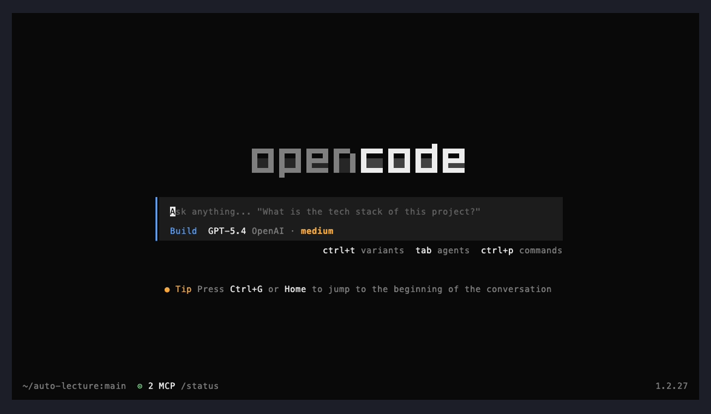
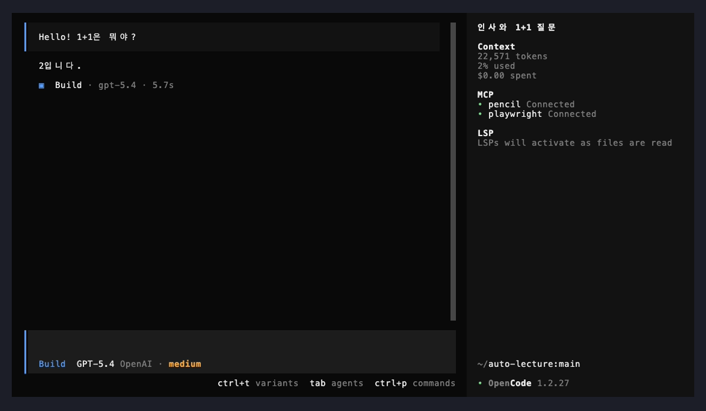

# VHS를 활용한 OpenCode TUI 스크린샷 캡처 테스트

VHS(charmbracelet)로 OpenCode TUI의 실제 실행 화면을 프로그래밍적으로 캡처한 테스트 결과.

## 환경

| 항목 | 버전 |
|------|------|
| OpenCode | 1.2.27 |
| VHS | 0.11.0 |
| ttyd | 1.7.7 |
| 테마 | Dracula |

## 캡처 과정

### 1. tape 파일 작성

VHS는 `.tape` 파일에 터미널 조작을 스크립트로 기술한다:

```tape
Set Shell zsh
Set Width 1200
Set Height 700
Set FontSize 14
Set Theme "Dracula"
Set Padding 20

Type@50ms "cd /Users/taekkim/auto-lecture && opencode"
Enter
Sleep 10s
Screenshot opencode-start.png
Sleep 1s
Type@30ms "Hello! 1+1은 뭐야?"
Enter
Sleep 20s
Screenshot opencode-response.png
Ctrl+C
Sleep 3s
```

### 2. VHS 실행

```bash
cd lectures/screenshot-test/results/vhs-tui/
vhs capture-opencode.tape
```

VHS는 내부적으로 ttyd + 헤드리스 브라우저를 사용하여 실제 터미널 렌더링을 캡처한다. 총 소요 시간 약 40초.

## 캡처 결과

### OpenCode 시작 화면



OpenCode TUI의 초기 화면이다. 주요 요소:

- **로고**: 상단 중앙에 OpenCode 아스키 아트 로고
- **입력 프롬프트**: "Ask anything..." 플레이스홀더와 함께 질문 입력 대기
- **모델 정보**: `Build GPT-5.4 OpenAI · medium` — 현재 활성 모델과 프로바이더
- **단축키 안내**: `ctrl+t` variants, `tab` agents, `ctrl+p` commands
- **팁**: `Ctrl+G` 또는 `Home`으로 대화 시작점으로 이동
- **상태바**: `~/auto-lecture:main` (Git 브랜치), `2 MCP` (연결된 MCP 서버 수), 버전 `1.2.27`

### OpenCode 응답 화면



"Hello! 1+1은 뭐야?"라는 질문에 대한 응답 화면이다. 주요 요소:

- **질문 영역** (상단): 사용자가 입력한 "Hello! 1+1은 뭐야?" 표시
- **응답 영역**: "2입니다." 라는 간결한 답변
- **모델 실행 정보**: `Build · gpt-5.4 · 5.7s` — 사용된 모델과 응답 시간
- **우측 정보 패널**:
  - 세션 제목: "인사와 1+1 질문" (자동 생성)
  - Context: 22,571 tokens, 2% used, $0.00 spent
  - MCP: pencil, playwright 연결 상태
  - LSP: 파일 읽기 시 활성화 대기 상태

## 핵심 교훈

### VHS가 유일한 해법인 이유

TUI 앱은 자체 렌더링 루프(Bubble Tea 등)를 사용하기 때문에 `tmux capture-pane`, `freeze`, `screencapture` 등으로는 실제 화면을 캡처할 수 없다. VHS는 실제 브라우저 렌더링을 통해 터미널 화면을 PNG로 캡처하므로 **ANSI 이스케이프, 색상, TUI 레이아웃이 모두 정확하게 재현**된다.

### 주의사항

1. **Screenshot 경로**: 파일명만 사용 (`opencode-start.png` O, `/tmp/opencode-start.png` X)
2. **충분한 대기 시간**: TUI 로딩에 8~10초, LLM 응답에 20초+ 필요
3. **실행 위치**: tape 파일이 있는 디렉토리에서 `vhs`를 실행해야 이미지가 해당 디렉토리에 생성됨
4. **tmux 충돌**: tmux 세션 내에서 실행 시 ttyd 포트 충돌 가능 — 별도 터미널에서 실행 권장
