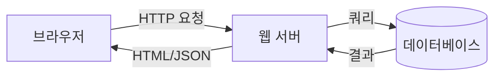
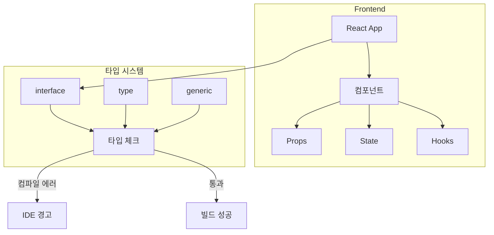
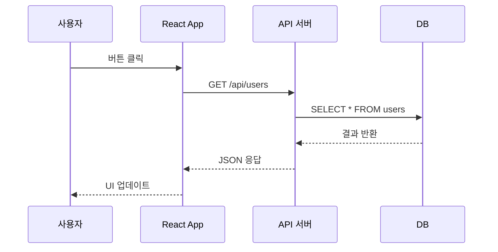

# 이미지 삽입 종합 테스트

스크린샷 · 레이아웃 · Mermaid · two-cols 디자인 검증

---

## ① 스크린샷 — 전체 너비

웹 페이지 스크린샷을 슬라이드에 삽입


<p class="text-xs opacity-40 text-center mt-2">TypeScript 공식 사이트 — Playwright로 캡처</p>

---

## ② 스크린샷 — 좌측 이미지 + 설명

<div class="flex gap-6 items-start mt-4">
  
  <div class="flex-1">
    <h3 class="text-xl font-bold">React 공식 사이트</h3>
    <p class="text-sm opacity-70 mt-2">Playwright로 캡처한 스크린샷을 슬라이드에 바로 삽입할 수 있습니다.</p>
    <div class="mt-4 text-sm">
      <p><span class="text-green-400 font-bold">장점</span>: 실제 화면 그대로 보여줄 수 있음</p>
      <p><span class="text-amber-400 font-bold">주의</span>: max-h 클래스로 크기 제한 필수</p>
    </div>
  </div>
</div>

---

## ③ 스크린샷 — 작은 이미지 + 캡션

<div class="flex gap-8 justify-center mt-8">
  <div class="text-center">
    
    <p class="text-xs opacity-50 mt-2">TypeScript Playground (600x400)</p>
  </div>
  <div class="text-center">
    
    <p class="text-xs opacity-50 mt-2">TypeScript 로고 (1187x1187)</p>
  </div>
</div>

---

## ④ 이미지 크기 비교

같은 이미지를 다른 `max-h`로 표시

<div class="flex gap-4 items-end mt-6">
  <div class="text-center">
    
    <p class="text-xs opacity-50 mt-1">max-h-[100px]</p>
  </div>
  <div class="text-center">
    
    <p class="text-xs opacity-50 mt-1">max-h-[200px]</p>
  </div>
  <div class="text-center">
    
    <p class="text-xs opacity-50 mt-1">max-h-[300px]</p>
  </div>
  <div class="text-center">
    
    <p class="text-xs opacity-50 mt-1">max-h-[400px]</p>
  </div>
</div>

---

## ⑤ Mermaid — 테마 적용 (scale 없음)

setup/mermaid.ts 커스텀 테마 + CSS `width: 100%`



---

## ⑥ Mermaid — 복잡한 다이어그램 (테마 적용)



---

## ⑦ Mermaid — sequence diagram (테마 적용)



---

## ⑧ HTML/CSS 다이어그램 (Mermaid 대안)

<div class="flex items-center justify-center gap-2 mt-8">
  <div class="bg-blue-600 text-white px-6 py-4 rounded-xl text-center font-bold shadow-lg">
    <div class="text-sm opacity-70">.ts</div>
    <div>TypeScript</div>
  </div>
  <div class="text-2xl opacity-50">→</div>
  <div class="bg-yellow-500 text-black px-6 py-4 rounded-xl text-center font-bold shadow-lg">
    <div class="text-sm opacity-70">tsc</div>
    <div>컴파일</div>
  </div>
  <div class="text-2xl opacity-50">→</div>
  <div class="bg-amber-400 text-black px-6 py-4 rounded-xl text-center font-bold shadow-lg">
    <div class="text-sm opacity-70">.js</div>
    <div>JavaScript</div>
  </div>
  <div class="text-2xl opacity-50">→</div>
  <div class="bg-cyan-400 text-black px-6 py-4 rounded-xl text-center font-bold shadow-lg">
    <div class="text-sm opacity-70">실행</div>
    <div>브라우저</div>
  </div>
</div>

<div class="text-center text-xs opacity-40 mt-4">UnoCSS로 직접 그린 다이어그램 — 크기·색상·간격을 완전히 제어 가능</div>

---

## ⑨ HTML/CSS — 비교 카드 (배경 박스 없이)

<div class="grid grid-cols-2 gap-8 mt-6">
  <div>
    <h3 class="text-lg font-bold mb-3">JavaScript</h3>
    <ul class="space-y-2 text-sm">
      <li><span class="text-red-400 font-bold">런타임</span>에서 오류 발견</li>
      <li>타입 정보 <span class="text-red-400 font-bold">없음</span></li>
      <li>IDE 지원 <span class="text-red-400 font-bold">제한적</span></li>
      <li>리팩토링 시 <span class="text-red-400 font-bold">위험</span></li>
    </ul>
  </div>
  <div>
    <h3 class="text-lg font-bold mb-3">TypeScript</h3>
    <ul class="space-y-2 text-sm">
      <li><span class="text-green-400 font-bold">컴파일 타임</span>에 오류 검출</li>
      <li>타입 정보 <span class="text-green-400 font-bold">명시적</span></li>
      <li>IDE 지원 <span class="text-green-400 font-bold">완벽</span></li>
      <li>리팩토링 시 <span class="text-green-400 font-bold">안전</span></li>
    </ul>
  </div>
</div>

---

## ⑩ two-cols — 이미지 + 텍스트 (개선)

<div class="grid grid-cols-2 gap-6 mt-4">
  <div>
    
  </div>
  <div class="flex flex-col justify-center">
    <h3 class="text-xl font-bold mb-4">React 핵심 개념</h3>
    <div class="space-y-3 text-sm">
      <p><span class="text-cyan-400 font-bold">컴포넌트</span> — UI를 독립적인 조각으로 분리</p>
      <p><span class="text-cyan-400 font-bold">Props</span> — 부모 → 자식 데이터 전달</p>
      <p><span class="text-cyan-400 font-bold">State</span> — 컴포넌트 내부 상태 관리</p>
      <p><span class="text-cyan-400 font-bold">Hooks</span> — 함수형 컴포넌트의 상태/생명주기</p>
    </div>
  </div>
</div>

---
layout: two-cols-header
---

## ⑪ two-cols — 코드 + 결과 비교

<div class="grid grid-cols-2 gap-6 mt-4">
  <div>
    <h3 class="text-lg font-bold mb-2">JavaScript (문제)</h3>

```js
function add(a, b) {
  return a + b;
}

// 의도치 않은 문자열 연결
add("1", 2); // "12" 😱
```

<p class="text-red-400 font-bold text-sm mt-2">❌ 런타임까지 오류를 모름</p>
  </div>
  <div>
    <h3 class="text-lg font-bold mb-2">TypeScript (해결)</h3>

```ts
function add(a: number, b: number) {
  return a + b;
}

// 컴파일 에러! 🎉
add("1", 2); // Error!
```

<p class="text-green-400 font-bold text-sm mt-2">✅ 코드 작성 시점에 오류 검출</p>
  </div>
</div>

---

## ⑫ two-cols — 스크린샷 + 스크린샷

<div class="grid grid-cols-2 gap-6 mt-4">
  <div class="text-center">
    
    <p class="text-xs opacity-50 mt-1">TypeScript 공식 사이트</p>
  </div>
  <div class="text-center">
    
    <p class="text-xs opacity-50 mt-1">React 공식 사이트</p>
  </div>
</div>

---

## ⑬ 플레이스홀더 + 설명 조합

<div class="flex gap-6 mt-4">
  <div class="border-2 border-dashed border-gray-500 rounded-lg p-6 flex items-center justify-center w-1/2">
    <div class="text-center">
      <div class="text-3xl mb-2">🖼️</div>
      <p class="font-bold">VS Code 실행 화면</p>
      <p class="text-xs opacity-50">TODO: TypeScript 에러 표시 스크린샷</p>
    </div>
  </div>
  <div class="flex-1 flex flex-col justify-center">
    <h3 class="text-lg font-bold">IDE에서 바로 확인</h3>
    <p class="text-sm opacity-70 mt-2">TypeScript의 가장 큰 장점은 코드를 작성하는 <span class="text-green-400 font-bold">그 순간</span>에 오류를 잡아준다는 것입니다.</p>
    <p class="text-sm opacity-70 mt-2">빨간 밑줄이 나타나면 → 커서를 올려 에러 메시지 확인</p>
  </div>
</div>

<!-- IMAGE: VS Code에서 TypeScript 타입 에러가 빨간 밑줄로 표시된 화면. 검색: "vscode typescript error" -->

---

## ⑭ 다이어그램 — 점진적 빌드업

클릭할 때마다 요소가 하나씩 등장

<div class="flex items-center justify-center gap-3 mt-12">
  <div class="bg-blue-600 text-white px-6 py-4 rounded-xl text-center font-bold shadow-lg transition-all duration-500" :class="$clicks >= 0 ? 'opacity-100 translate-y-0' : 'opacity-0 translate-y-4'">
    <div class="text-xs opacity-70">.ts</div>
    <div>TypeScript</div>
  </div>

  <div class="text-2xl transition-all duration-300" :class="$clicks >= 1 ? 'opacity-50' : 'opacity-0'">→</div>

  <div v-click class="bg-yellow-500 text-black px-6 py-4 rounded-xl text-center font-bold shadow-lg transition-all duration-500">
    <div class="text-xs opacity-70">tsc</div>
    <div>컴파일</div>
  </div>

  <div class="text-2xl transition-all duration-300" :class="$clicks >= 2 ? 'opacity-50' : 'opacity-0'">→</div>

  <div v-click class="bg-amber-400 text-black px-6 py-4 rounded-xl text-center font-bold shadow-lg transition-all duration-500">
    <div class="text-xs opacity-70">.js</div>
    <div>JavaScript</div>
  </div>

  <div class="text-2xl transition-all duration-300" :class="$clicks >= 3 ? 'opacity-50' : 'opacity-0'">→</div>

  <div v-click class="bg-cyan-400 text-black px-6 py-4 rounded-xl text-center font-bold shadow-lg transition-all duration-500">
    <div class="text-xs opacity-70">실행</div>
    <div>브라우저</div>
  </div>
</div>

---

## ⑮ 다이어그램 — 포커스 전환

클릭할 때마다 현재 단계가 강조되고 나머지는 흐려짐

<div class="flex items-center justify-center gap-3 mt-8">
  <div class="bg-indigo-600 text-white px-5 py-4 rounded-xl text-center font-bold shadow-lg transition-all duration-300" :class="$clicks === 0 ? 'ring-2 ring-indigo-300 scale-105' : 'opacity-40'">
    <div class="text-xs opacity-70">① 요청</div>
    <div>AI 모델</div>
  </div>
  <div class="text-2xl opacity-30">→</div>
  <div class="bg-emerald-600 text-white px-5 py-4 rounded-xl text-center font-bold shadow-lg transition-all duration-300" :class="$clicks === 1 ? 'ring-2 ring-emerald-300 scale-105' : 'opacity-40'">
    <div class="text-xs opacity-70">② 실행</div>
    <div>AI 앱</div>
  </div>
  <div class="text-2xl opacity-30">→</div>
  <div class="bg-amber-500 text-black px-5 py-4 rounded-xl text-center font-bold shadow-lg transition-all duration-300" :class="$clicks === 2 ? 'ring-2 ring-amber-300 scale-105' : 'opacity-40'">
    <div class="text-xs opacity-70">③ 명령</div>
    <div>Shell</div>
  </div>
  <div class="text-2xl opacity-30">→</div>
  <div class="bg-emerald-600 text-white px-5 py-4 rounded-xl text-center font-bold shadow-lg transition-all duration-300" :class="$clicks === 3 ? 'ring-2 ring-emerald-300 scale-105' : 'opacity-40'">
    <div class="text-xs opacity-70">④ stdout</div>
    <div>AI 앱</div>
  </div>
  <div class="text-2xl opacity-30">→</div>
  <div class="bg-indigo-600 text-white px-5 py-4 rounded-xl text-center font-bold shadow-lg transition-all duration-300" :class="$clicks >= 4 ? 'ring-2 ring-indigo-300 scale-105' : 'opacity-40'">
    <div class="text-xs opacity-70">⑤ 해석</div>
    <div>AI 모델</div>
  </div>
</div>

<v-clicks>

- AI 모델이 "이 명령어를 실행해줘"라고 요청
- AI 앱이 `subprocess.run()`으로 쉘 실행
- stdout/stderr를 캡처하여 **문자열 그대로** AI에게 반환
- AI가 이 텍스트를 **해석**하여 다음 행동 결정

</v-clicks>

---

## ⑯ 다이어그램 — 세로 빌드업 (복잡 구조)

<div class="mt-4 flex flex-col items-center gap-3">
  <div class="bg-indigo-600 text-white px-8 py-3 rounded-xl font-bold shadow-lg text-center transition-all duration-500" :class="$clicks >= 0 ? 'opacity-100' : 'opacity-0'">
    <div>AI 호스트 앱</div>
    <div class="text-xs opacity-70">Claude Desktop, Cursor</div>
  </div>

  <div class="text-xl transition-all duration-300" :class="$clicks >= 1 ? 'opacity-50' : 'opacity-0'">↕ JSON-RPC</div>

  <div v-click class="bg-green-600 text-white px-8 py-3 rounded-xl font-bold shadow-lg text-center">
    <div>MCP 프로토콜</div>
    <div class="text-xs opacity-70">표준 인터페이스</div>
  </div>

  <div class="text-xl transition-all duration-300" :class="$clicks >= 2 ? 'opacity-50' : 'opacity-0'">↕</div>

  <div v-click class="flex gap-4">
    <div class="bg-slate-600 text-white px-4 py-3 rounded-xl font-bold shadow-lg text-center text-sm transition-all duration-500">
      <div>🔧 GitHub</div>
    </div>
    <div class="bg-slate-600 text-white px-4 py-3 rounded-xl font-bold shadow-lg text-center text-sm transition-all duration-500">
      <div>💬 Slack</div>
    </div>
    <div class="bg-slate-600 text-white px-4 py-3 rounded-xl font-bold shadow-lg text-center text-sm transition-all duration-500">
      <div>🗄️ DB</div>
    </div>
    <div class="bg-slate-600 text-white px-4 py-3 rounded-xl font-bold shadow-lg text-center text-sm transition-all duration-500">
      <div>📁 파일</div>
    </div>
  </div>
</div>
