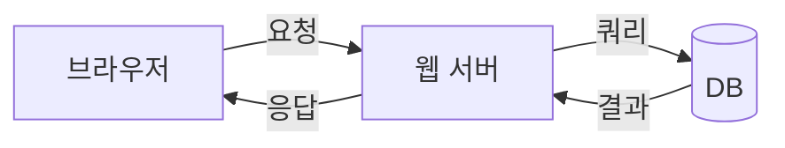

# Mermaid 애니메이션 탐구

3가지 접근법 테스트

---

## 접근법 1: v-click으로 Mermaid 단계별 교체

<v-click-hide>

</v-click-hide>

<v-click>
<v-click-hide>

</v-click-hide>
</v-click>

<v-click>

</v-click>

---

## 접근법 2: CSS로 Mermaid SVG 노드 타겟팅

Mermaid는 노드에 `id="flowchart-A-N"` 형태의 ID를 부여

---

## 접근법 3: HTML/CSS 다이어그램 (대조군)

같은 내용을 HTML/CSS + $clicks로 구현

  
= 3 ? 'opacity-100' : 'opacity-40'">
    
브라우저

  

  
= 1 ? 'opacity-50' : 'opacity-0'">→

  
= 1 ? 'opacity-100 translate-x-0' : 'opacity-0 -translate-x-4'">
    

      
웹 서버

    

  

  
= 2 ? 'opacity-50' : 'opacity-0'">→

  
= 2 ? 'opacity-100 translate-x-0' : 'opacity-0 -translate-x-4'">
    

      
DB

    

  

= 3 ? 'opacity-100' : 'opacity-0'">
  
← 전체 흐름 완성: 요청 → 처리 → 응답 →

