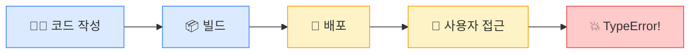
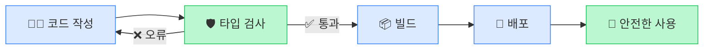

# 스타일 테스트

## 같은 내용, 3가지 스타일

A · B · C 중 선호하는 스타일을 골라주세요

---
layout: section
---

# Style A
# 코드 중심 밀도형

코드 블록 + 설명 박스 + 2단 레이아웃

---

# 왜 TypeScript인가?

## JavaScript의 문제: 런타임까지 오류를 모릅니다

```js {1-4|6-9|11-14}
// JavaScript: 아무런 경고 없이 실행됩니다
function calculateTax(price, rate) {
  return price * rate;
}

// 문자열을 넘겨도 경고 없음
calculateTax("1000", 0.1);
// → 100 (암묵적 형변환!)
// → 결제 금액 계산에서 이런 버그가 나면?

// null을 넘기면 프로덕션에서 터집니다
function getUsername(user) {
  return user.name.toUpperCase();
}
getUsername(null); // TypeError!
```

<div class="box-red">
JavaScript는 <strong>런타임</strong>까지 오류를 알 수 없습니다 — 코드가 실행되어야 버그가 드러납니다
</div>

<!--
[스크립트]
TypeScript를 배우기 전에, 왜 필요한지부터 이해하겠습니다.

화면의 코드를 보시죠. calculateTax 함수입니다. price와 rate를 받아서 곱합니다. 문법적으로 완벽한 JavaScript 코드입니다.

[click]
그런데 문자열 "1000"을 넘기면 어떻게 될까요? JavaScript는 경고 없이 100을 반환합니다. 문자열을 숫자로 자동 변환했기 때문입니다. 이걸 암묵적 형변환이라 합니다. 오류가 안 나니까 문제가 있는지도 모르고 넘어갑니다.

[click]
더 심각한 케이스입니다. null을 넘기면 TypeError가 발생하는데, 이게 언제 터지냐면 — 사용자가 실제로 기능을 쓸 때, 프로덕션에서 터집니다.

시간: 3분
-->

---

# TypeScript: 실행 전에 잡습니다

<div class="grid grid-cols-2 gap-6">

<div class="col-left">

### ❌ JavaScript

```js
function add(a, b) {
  return a + b;
}
add("10", 20); // "1020" (문자열 연결!)
```

런타임에 발견 → 사용자가 피해

</div>
<div class="col-right">

### ✅ TypeScript

```ts
function add(a: number, b: number) {
  return a + b;
}
add("10", 20); // 컴파일 오류!
```

저장 즉시 발견 → 개발자가 수정

</div>

</div>

<v-click>

<div class="box-green mt-4">
TypeScript = JavaScript + 타입 시스템. 모든 JS 코드는 TS에서 유효합니다. TS는 최종적으로 JS로 컴파일됩니다.
</div>

</v-click>

<!--
[스크립트]
왼쪽이 JavaScript, 오른쪽이 TypeScript입니다. 같은 add 함수인데 차이가 보이시죠? TypeScript는 매개변수 뒤에 `: number`라고 타입을 적었습니다.

JavaScript에서 add("10", 20)을 하면 "1020"이라는 문자열이 나옵니다. 문자열 연결이 된 겁니다. TypeScript에서는? 저장하는 순간 빨간 줄이 뜹니다. "string은 number에 할당할 수 없다"는 컴파일 오류입니다.

[click]
정리하면, TypeScript는 JavaScript의 상위 집합입니다. 모든 JavaScript 코드는 TypeScript에서도 유효합니다. TypeScript가 하는 일은 타입 정보를 추가하고, 컴파일할 때 검사한 뒤, 최종적으로 순수한 JavaScript로 변환하는 것입니다.

시간: 3분
-->

---

# 기본 타입 — 원시 타입

<div class="grid grid-cols-2 gap-4">

<div class="col-left">

```ts {1-4|6-9|11-13}
// 원시 타입: 반드시 소문자
const name: string = "홍길동";
const age: number = 28;
const active: boolean = true;

// 타입 추론 — 생략해도 됩니다
const price = 29900;    // number로 추론
const title = "노트북"; // string으로 추론
const inStock = true;   // boolean으로 추론

// 배열 타입
const nums: number[] = [1, 2, 3];
const tags: string[] = ["react", "ts"];
```

</div>
<div class="col-right">

<div class="box-red">

**흔한 실수: 대문자 타입**

| ✅ 올바른 | ❌ 잘못된 |
|-----------|----------|
| `string` | `String` |
| `number` | `Number` |
| `boolean` | `Boolean` |

Java/C# 습관으로 대문자를 쓰면 래퍼 객체를 가리킵니다

</div>

<div class="box-blue mt-2">

**Java 개발자 참고**: `int`/`float`/`double` 구분 없이 모두 `number` 하나입니다

</div>

</div>

</div>

<!--
[스크립트]
기본 타입을 하나씩 보겠습니다. 변수명 뒤에 콜론, 그리고 타입을 씁니다. string, number, boolean — 반드시 소문자입니다.

[click]
그런데 TypeScript에는 타입 추론이라는 기능이 있습니다. 오른쪽 값을 보고 TypeScript가 알아서 타입을 결정합니다. const price = 29900이라고 쓰면 number라고 추론합니다. 초기값이 명확하면 굳이 타입을 적지 않아도 됩니다.

[click]
배열은 타입 뒤에 대괄호를 붙입니다. number[], string[] 이런 식입니다.

오른쪽 빨간 박스를 보시면, Java 개발자분들이 가장 많이 하는 실수가 정리되어 있습니다. 대문자 String이 아니라 소문자 string입니다.

시간: 3분
-->

---
layout: section
---

# Style B
# 미니멀 점진형

큰 타이포그래피 + 여백 + 점진적 공개

---

# 왜 TypeScript인가?

<br>

<div class="text-2xl leading-relaxed">

<v-click>

JavaScript는 이 코드를 <span class="text-red-500 font-bold">아무 경고 없이</span> 실행합니다

</v-click>

</div>

<v-click>

```js
calculateTax("1000", 0.1)  // → 100 (문자열인데?!)
getUsername(null)            // → TypeError (프로덕션에서!)
```

</v-click>

<br>

<v-click>

<div class="text-3xl font-bold text-center">

오류를 발견하는 시점: <span class="text-red-500">사용자가 기능을 쓸 때</span>

</div>

</v-click>

<!--
[스크립트]
하나만 기억하세요.

[click]
JavaScript는 잘못된 코드를 아무 경고 없이 실행합니다. 경고가 없다는 게 핵심입니다.

[click]
예를 들어 숫자를 받아야 하는 함수에 문자열을 넘기면? 에러가 아니라 그냥 동작합니다. 암묵적 형변환 때문입니다. null을 넘기면? 런타임에 TypeError가 터집니다.

[click]
문제는 이 오류를 발견하는 시점입니다. 코드를 작성할 때가 아닙니다. 빌드할 때도 아닙니다. 사용자가 실제로 그 기능을 쓸 때 발견됩니다.

시간: 3분
-->

---

# TypeScript는 이렇게 바꿉니다

<br>

<div class="text-xl text-center mb-8">

오류 발견 시점을 <span class="text-red-500">런타임</span>에서 <span class="text-green-600">저장 순간</span>으로 당깁니다

</div>

<v-click>

```ts
function calculateTax(price: number, rate: number): number {
  return price * rate;
}

calculateTax("1000", 0.1);
//           ~~~~~~ 컴파일 오류: string은 number에 할당할 수 없습니다
```

</v-click>

<br>

<v-click>

<div class="text-center text-lg">

✅ 모든 JavaScript 코드는 TypeScript에서 유효합니다<br>
✅ TypeScript는 최종적으로 JavaScript로 컴파일됩니다<br>
✅ 새로운 언어가 아니라 <span class="text-blue-600 font-bold">JavaScript + 타입 안전망</span>

</div>

</v-click>

<!--
[스크립트]
TypeScript가 하는 일은 단 하나입니다.

오류를 발견하는 시점을 런타임에서 코드를 저장하는 순간으로 당기는 겁니다.

[click]
같은 함수를 TypeScript로 쓰면 이렇습니다. 매개변수 뒤에 콜론과 타입을 적었습니다. 이제 문자열을 넘기면? 저장하는 순간 VS Code에 빨간 밑줄이 생깁니다. 실행하기 전에 이미 버그를 잡은 겁니다.

[click]
중요한 점 세 가지. TypeScript는 JavaScript의 상위 집합이라서 기존 JS 코드를 그대로 쓸 수 있습니다. 최종 결과물은 JavaScript입니다. 새로운 언어를 배우는 게 아니라, JavaScript에 안전망을 추가하는 겁니다.

시간: 3분
-->

---

# 기본 타입

<br>

<v-click>

```ts
const name: string = "홍길동";     // 텍스트
const age: number = 28;            // 숫자 (int/float 구분 없음)
const active: boolean = true;      // 참/거짓
```

</v-click>

<v-click>

<div class="text-xl mt-6 mb-2">

그런데 이렇게만 써도 됩니다 👇

</div>

```ts
const name = "홍길동";     // TypeScript가 string으로 추론
const age = 28;            // number로 추론
const active = true;       // boolean으로 추론
```

</v-click>

<v-click>

<div class="mt-6 text-lg">

⚠️ <span class="text-red-500 font-bold">소문자</span>입니다 — `string` ✅ `String` ❌ (Java 습관 주의)

</div>

</v-click>

<!--
[스크립트]
기본 타입, 세 가지만 기억하면 됩니다.

[click]
string은 텍스트, number는 숫자, boolean은 참거짓. 변수명 뒤에 콜론을 찍고 타입을 씁니다. Java와 달리 int, float, double 구분이 없습니다. 숫자는 전부 number 하나입니다.

[click]
그런데 사실 이렇게 타입을 생략해도 됩니다. TypeScript가 오른쪽 값을 보고 알아서 추론합니다. "홍길동"이라고 쓰면 당연히 string이겠죠. 이것을 타입 추론이라 합니다. 초기값이 명확하면 굳이 적지 않아도 됩니다.

[click]
하나만 주의하세요. 반드시 소문자입니다. 대문자 String은 JavaScript의 래퍼 객체입니다. Java 습관으로 대문자를 쓰면 다른 의미가 됩니다.

시간: 3분
-->

---
layout: section
---

# Style C
# 비주얼 대비형

다이어그램 + 아이콘 카드 + Before/After

---

# 왜 TypeScript인가?

<br>



<v-click>

<div class="text-center text-2xl mt-4">

JavaScript: 오류가 <span class="text-red-500 font-bold">여기서</span> 터집니다 ☝️

</div>

</v-click>

<v-click>

<div class="text-center text-lg mt-2 text-gray-500">

코드 작성 → 빌드 → 배포 → 사용자 접근 → 💥 <strong>그제서야</strong> 발견

</div>

</v-click>

<!--
[스크립트]
이 다이어그램을 보세요. 코드를 작성하고, 빌드하고, 배포하고, 사용자가 접근합니다.

[click]
JavaScript에서는 오류가 맨 마지막, 사용자가 기능을 쓸 때 터집니다. 코드 작성부터 오류 발견까지 가장 먼 거리를 이동하는 겁니다.

[click]
코드를 쓴 시점에는 아무 문제가 없어 보였습니다. 빌드도 통과합니다. 배포도 됩니다. 그런데 사용자가 특정 버튼을 누르는 순간 — TypeError. 이게 JavaScript의 근본적인 문제입니다.

시간: 2분
-->

---

# TypeScript: 오류 발견을 앞으로 당기기

<br>



<v-click>

<div class="grid grid-cols-2 gap-8 mt-4">

<div class="text-center">
<div class="text-4xl mb-2">❌</div>
<div class="text-red-500 font-bold">JavaScript</div>
<div class="text-sm">오류 → 사용자가 발견</div>
</div>

<div class="text-center">
<div class="text-4xl mb-2">✅</div>
<div class="text-green-600 font-bold">TypeScript</div>
<div class="text-sm">오류 → 코드 저장 시 발견</div>
</div>

</div>

</v-click>

<!--
[스크립트]
TypeScript를 추가하면 흐름이 달라집니다.

코드를 작성하면 바로 다음 단계에서 타입 검사가 일어납니다. 오류가 있으면 코드 작성 단계로 돌려보냅니다. 통과해야 빌드가 됩니다. 그래서 사용자에게 도달하는 코드는 이미 타입 검증을 마친 코드입니다.

[click]
비교하면 이렇습니다. JavaScript는 사용자가 오류를 발견합니다. TypeScript는 개발자가 코드를 저장하는 순간 발견합니다. 발견 시점을 가능한 한 앞으로 당기는 것, 이것이 TypeScript의 핵심 가치입니다.

시간: 3분
-->

---

# 기본 타입 — 3가지만 기억하세요

<br>

<div class="grid grid-cols-3 gap-6">

<v-click>

<div class="text-center p-4 rounded-lg bg-blue-50 dark:bg-blue-900/30">
<div class="text-4xl mb-2">📝</div>
<div class="text-xl font-bold text-blue-600">string</div>
<div class="text-sm mt-2">텍스트</div>

```ts
const name = "홍길동";
```

</div>

</v-click>

<v-click>

<div class="text-center p-4 rounded-lg bg-green-50 dark:bg-green-900/30">
<div class="text-4xl mb-2">🔢</div>
<div class="text-xl font-bold text-green-600">number</div>
<div class="text-sm mt-2">정수 + 실수 통합</div>

```ts
const age = 28;
const pi = 3.14;
```

</div>

</v-click>

<v-click>

<div class="text-center p-4 rounded-lg bg-purple-50 dark:bg-purple-900/30">
<div class="text-4xl mb-2">✅</div>
<div class="text-xl font-bold text-purple-600">boolean</div>
<div class="text-sm mt-2">참 / 거짓</div>

```ts
const active = true;
```

</div>

</v-click>

</div>

<v-click>

<div class="text-center mt-6 text-lg">

⚠️ 반드시 <span class="text-green-600 font-bold">소문자</span>: `string` `number` `boolean` — 대문자 <span class="text-red-500">`String`</span>은 다른 의미!

</div>

</v-click>

<!--
[스크립트]
기본 타입, 세 가지만 기억하면 됩니다.

[click]
첫째, string. 텍스트 데이터입니다. 그런데 보세요 — 타입을 안 적어도 됩니다. "홍길동"이라고 쓰면 TypeScript가 알아서 string으로 추론합니다.

[click]
둘째, number. Java의 int, float, double을 전부 합쳐놓은 겁니다. 정수든 실수든 number 하나입니다. 단순하죠.

[click]
셋째, boolean. true 또는 false, 두 가지 값만 있습니다.

[click]
하나만 꼭 주의하세요. 반드시 소문자입니다. Java에서는 String 대문자가 맞지만 TypeScript에서 대문자 String은 래퍼 객체라는 완전히 다른 것을 가리킵니다.

시간: 3분
-->
