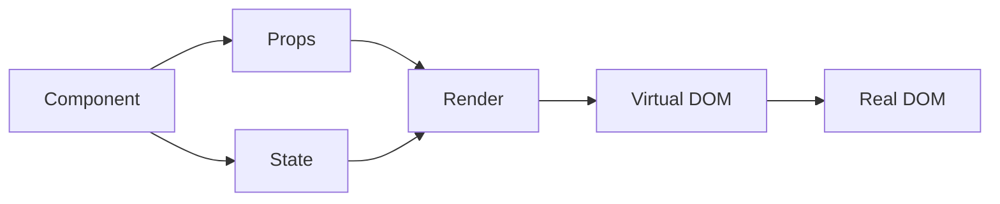

# Screenshot Test
## Playwright vs Agent-Browser

다크모드 스크린샷 비교 테스트

---

## 코드 블록 테스트

```typescript
interface User {
  id: number
  name: string
  email: string
}

function greet(user: User): string {
  return `Hello, ${user.name}!`
}

const users: User[] = [
  { id: 1, name: "Alice", email: "alice@example.com" },
  { id: 2, name: "Bob", email: "bob@example.com" },
]
```

---

## 다이어그램 테스트



---

## 레이아웃 테스트

<div class="grid grid-cols-2 gap-8">
<div>

### 왼쪽 패널
- TypeScript 타입 시스템
- 제네릭과 유틸리티 타입
- 인터페이스 vs 타입 별칭

</div>
<div>

### 오른쪽 패널
- React 컴포넌트 패턴
- Hooks API
- 상태 관리 전략

</div>
</div>

---

## 감사합니다

<div class="text-center mt-12">

### 질문이 있으신가요?

📧 contact@example.com

</div>
