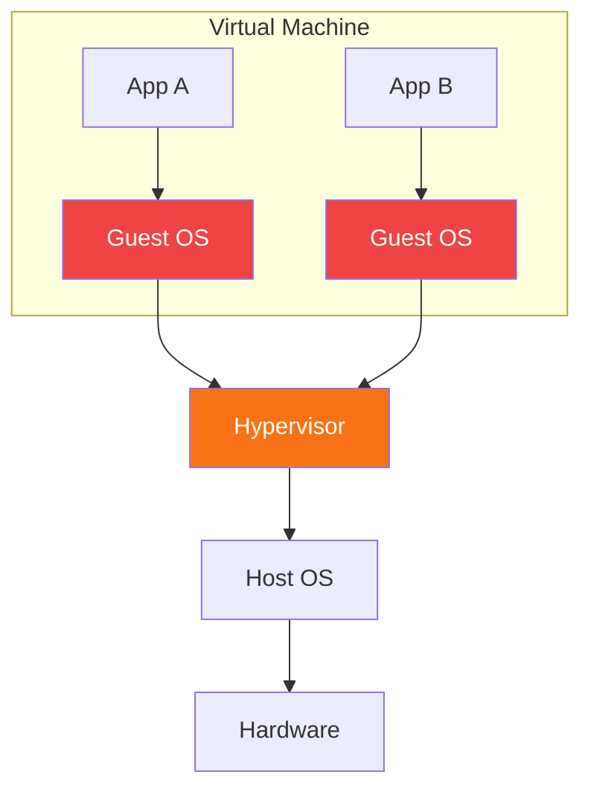
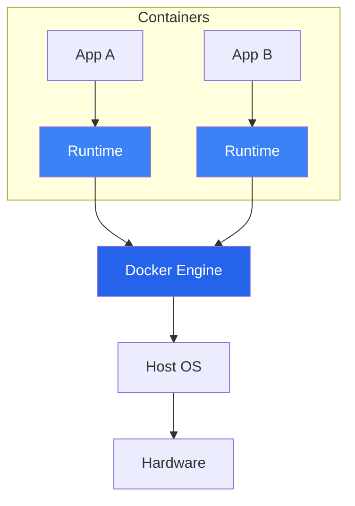
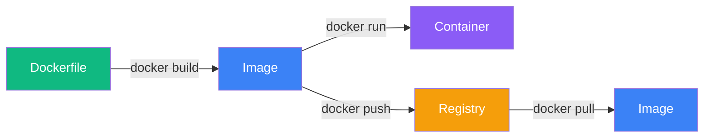
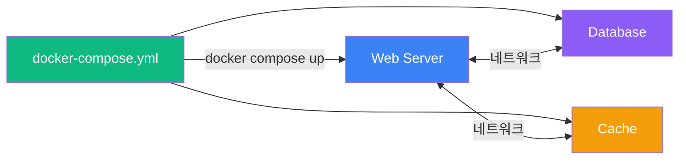
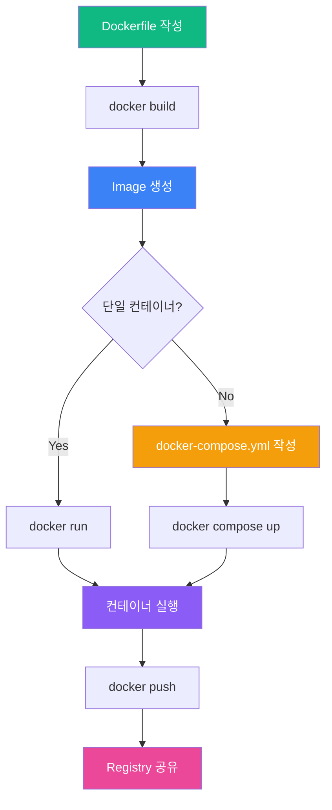

# Docker 입문

컨테이너 기술로 개발 환경을 혁신하다

<div class="mt-12 flex items-center gap-4">
  <div class="text-xl text-gray-400">컨테이너 vs VM | Dockerfile | Docker Compose</div>
</div>

<div class="abs-br mr-12 mb-8 text-sm text-gray-500">
  Docker Workshop 2026
</div>

<!--
Docker 입문 강의에 오신 것을 환영합니다. 오늘은 컨테이너 기술의 핵심 개념부터 실전 활용까지 다루겠습니다.
-->

---
layout: section
---

# Part 1

## 컨테이너 vs 가상머신

<!--
먼저 컨테이너가 기존의 가상머신과 어떻게 다른지 알아보겠습니다.
-->

---

# 전통적인 배포 방식의 문제

<v-clicks>

- **환경 불일치**: "제 로컬에서는 되는데요..." 문제
- **무거운 가상머신**: OS 전체를 가상화하여 수 GB 단위 리소스 소모
- **느린 시작 시간**: VM 부팅에 수십 초 ~ 수 분 소요
- **비효율적 리소스 사용**: 각 VM이 독립된 OS 커널을 실행

</v-clicks>

<div v-click class="mt-8 bg-red-900/30 border-l-4 border-red-500 p-4 rounded-r-lg">

**결론**: 더 가볍고, 빠르고, 일관된 배포 방식이 필요하다

</div>

<!--
개발자라면 한 번쯤 들어본 "제 로컬에서는 되는데요" 문제입니다. 환경 불일치, 무거운 VM, 느린 시작 시간 등 전통적인 배포의 한계를 살펴봅니다.
-->

---
layout: two-cols-header
---

# 가상머신 vs 컨테이너 아키텍처

::left::

### 가상머신 (VM)



<div class="text-sm text-gray-400 mt-2">

각 VM이 **독립 OS**를 포함

</div>

::right::

### 컨테이너 (Container)



<div class="text-sm text-gray-400 mt-2">

Host OS 커널을 **공유**

</div>

<!--
왼쪽은 VM 구조, 오른쪽은 컨테이너 구조입니다. 핵심 차이는 Guest OS의 유무입니다. 컨테이너는 Host OS 커널을 공유하기 때문에 훨씬 가볍습니다.
-->

---

# 컨테이너 vs VM 비교

| 항목 | 가상머신 (VM) | 컨테이너 (Docker) |
|------|:---:|:---:|
| 크기 | 수 GB | 수십 MB |
| 시작 시간 | 분 단위 | 초 단위 |
| 격리 수준 | 완전 격리 (별도 OS) | 프로세스 격리 (커널 공유) |
| 성능 오버헤드 | 높음 | 거의 없음 |
| 이식성 | 제한적 | 뛰어남 |

<div v-click class="mt-6 bg-blue-900/30 border-l-4 border-blue-500 p-4 rounded-r-lg">

**핵심**: 컨테이너는 OS 커널을 공유하여 가볍고 빠르다. 완전한 OS 격리가 필요하면 VM을 사용한다.

</div>

<!--
표로 정리하면 컨테이너의 장점이 명확합니다. 크기, 시작 시간, 성능 모두 컨테이너가 우위에 있습니다. 다만 완전한 격리가 필요한 보안 민감 환경에서는 여전히 VM이 적합합니다.
-->

---
layout: section
---

# Part 2

## Docker 핵심 개념

<!--
이제 Docker의 핵심 구성 요소를 살펴보겠습니다.
-->

---

# Docker 핵심 구성 요소



<v-clicks>

- **Dockerfile** - 이미지를 만드는 설계도 (레시피)
- **Image** - 실행에 필요한 모든 것을 담은 읽기 전용 템플릿
- **Container** - 이미지의 실행 인스턴스 (프로세스)
- **Registry** - 이미지를 저장하고 공유하는 저장소 (Docker Hub)

</v-clicks>

<!--
Docker의 네 가지 핵심 요소입니다. Dockerfile로 이미지를 빌드하고, 이미지로 컨테이너를 실행합니다. Registry를 통해 이미지를 공유합니다.
-->

---
layout: section
---

# Part 3

## Dockerfile 기본 문법

<!--
이제 Dockerfile을 직접 작성하는 방법을 알아보겠습니다.
-->

---

# Dockerfile 핵심 명령어

```dockerfile {1|3|5|7|9|11|all}
FROM node:20-alpine

WORKDIR /app

COPY package*.json ./

RUN npm ci --only=production

COPY . .

EXPOSE 3000

CMD ["node", "server.js"]
```

<v-clicks>

- `FROM` - 베이스 이미지 지정 (필수, 첫 번째 명령)
- `WORKDIR` - 작업 디렉토리 설정
- `COPY` - 파일을 이미지에 복사
- `RUN` - 빌드 시 명령 실행 (레이어 생성)
- `EXPOSE` - 컨테이너 포트 문서화
- `CMD` - 컨테이너 시작 시 실행할 명령

</v-clicks>

<!--
[click] FROM은 베이스 이미지를 지정합니다.
[click] WORKDIR로 작업 디렉토리를 설정합니다.
[click] COPY로 파일을 복사합니다.
[click] RUN으로 빌드 명령을 실행합니다.
[click] EXPOSE는 포트를 문서화하고,
[click] CMD는 실행 시 기본 명령을 지정합니다.
-->

---

# 이미지 레이어와 캐시 최적화

<div class="grid grid-cols-2 gap-6">
<div>

### 비효율적 (캐시 미활용)

```dockerfile {3-4}
FROM node:20-alpine
WORKDIR /app
COPY . .
RUN npm ci
CMD ["node", "server.js"]
```

<div class="text-sm text-red-400 mt-2">

코드 변경마다 npm ci 재실행

</div>

</div>
<div>

### 효율적 (캐시 최적화)

```dockerfile {3-4}
FROM node:20-alpine
WORKDIR /app
COPY package*.json ./
RUN npm ci
COPY . .
CMD ["node", "server.js"]
```

<div class="text-sm text-green-400 mt-2">

package.json 변경 시에만 재설치

</div>

</div>
</div>

<div v-click class="mt-4 bg-amber-900/30 border-l-4 border-amber-500 p-4 rounded-r-lg">

**원칙**: 변경이 적은 파일을 먼저 COPY하고, 변경이 잦은 파일을 나중에 COPY한다

</div>

<!--
Docker 이미지는 레이어로 구성됩니다. 왼쪽처럼 모든 파일을 한번에 복사하면 코드 한 줄만 바꿔도 npm ci가 다시 실행됩니다. 오른쪽처럼 package.json을 먼저 복사하면 의존성 설치 레이어가 캐시됩니다.
-->

---

# 이미지 빌드와 실행

```bash {1|3|5|7|all}
# 이미지 빌드
docker build -t my-app:1.0 .

# 컨테이너 실행
docker run -d -p 3000:3000 --name my-app my-app:1.0

# 실행 중인 컨테이너 확인
docker ps

# 로그 확인
docker logs -f my-app
```

<v-clicks>

- `-t my-app:1.0` : 이미지 이름과 태그 지정
- `-d` : 백그라운드(detached) 실행
- `-p 3000:3000` : 호스트:컨테이너 포트 매핑
- `--name` : 컨테이너에 이름 부여

</v-clicks>

<!--
[click] docker build로 이미지를 빌드합니다. -t 옵션으로 태그를 지정합니다.
[click] docker run으로 컨테이너를 실행합니다.
[click] docker ps로 실행 상태를 확인합니다.
[click] docker logs로 로그를 실시간 확인합니다.
-->

---
layout: section
---

# Part 4

## Docker Compose

<!--
여러 컨테이너를 함께 관리하는 Docker Compose를 알아보겠습니다.
-->

---

# Docker Compose란?

<v-clicks>

- 여러 컨테이너를 **하나의 YAML 파일**로 정의하고 관리
- 컨테이너 간 **네트워킹**을 자동으로 설정
- `docker compose up` 한 번으로 전체 스택 실행
- 개발 환경 구성에 필수적인 도구

</v-clicks>

<div v-click class="mt-6">



</div>

<!--
Docker Compose는 멀티 컨테이너 애플리케이션을 정의하고 관리하는 도구입니다. YAML 파일 하나로 웹 서버, 데이터베이스, 캐시 등 여러 서비스를 한번에 실행합니다.
-->

---

# docker-compose.yml 작성하기

```yaml {1-2|3-9|10-16|17-21|all}
# docker-compose.yml
services:
  web:
    build: .
    ports:
      - "3000:3000"
    depends_on:
      - db
    environment:
      - DATABASE_URL=postgres://user:pass@db:5432/mydb

  db:
    image: postgres:16-alpine
    environment:
      - POSTGRES_USER=user
      - POSTGRES_PASSWORD=pass
      - POSTGRES_DB=mydb
    volumes:
      - db-data:/var/lib/postgresql/data

volumes:
  db-data:
```

<!--
[click] services 아래에 각 컨테이너를 정의합니다.
[click] web 서비스는 Dockerfile로 빌드하고, db에 의존합니다.
[click] db 서비스는 공식 postgres 이미지를 사용합니다.
[click] volumes로 데이터를 영속화합니다.
[click] 전체 구조를 보면 두 서비스가 하나의 파일에 깔끔하게 정의되어 있습니다.
-->

---

# Docker Compose 주요 명령어

```bash {1-2|4-5|7-8|10-11|13-14|all}
# 전체 스택 시작 (백그라운드)
docker compose up -d

# 전체 스택 중지 및 제거
docker compose down

# 로그 확인 (전체)
docker compose logs -f

# 특정 서비스만 재빌드 및 재시작
docker compose up -d --build web

# 실행 중인 서비스 확인
docker compose ps
```

<div v-click class="mt-4 bg-blue-900/30 border-l-4 border-blue-500 p-4 rounded-r-lg">

**팁**: `docker compose down -v`로 볼륨까지 삭제할 수 있다 (데이터 초기화 시)

</div>

<!--
Docker Compose의 주요 명령어입니다. up으로 시작, down으로 중지, logs로 확인, ps로 상태를 봅니다.
-->

---

# 정리: Docker 핵심 워크플로



<!--
전체 Docker 워크플로를 정리한 다이어그램입니다. Dockerfile로 이미지를 빌드하고, 단일 컨테이너면 docker run, 멀티 컨테이너면 docker compose up으로 실행합니다.
-->

---
layout: end
---

# 감사합니다

Docker 입문을 마칩니다

<div class="mt-8 text-gray-400">

공식 문서: [docs.docker.com](https://docs.docker.com)

Docker Hub: [hub.docker.com](https://hub.docker.com)

</div>

<!--
감사합니다. 공식 문서와 Docker Hub에서 더 많은 정보를 확인하실 수 있습니다.
-->
