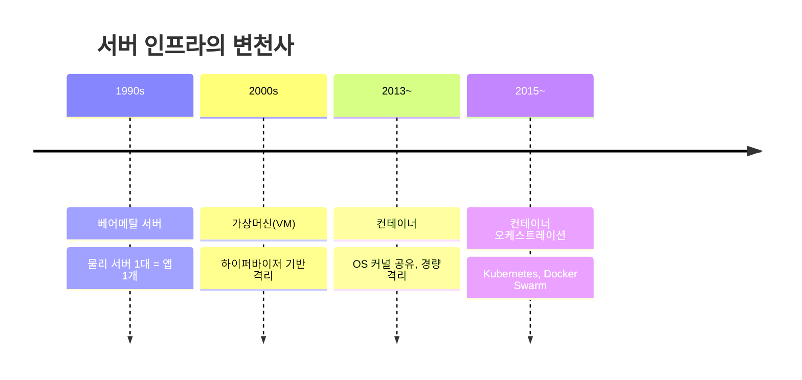
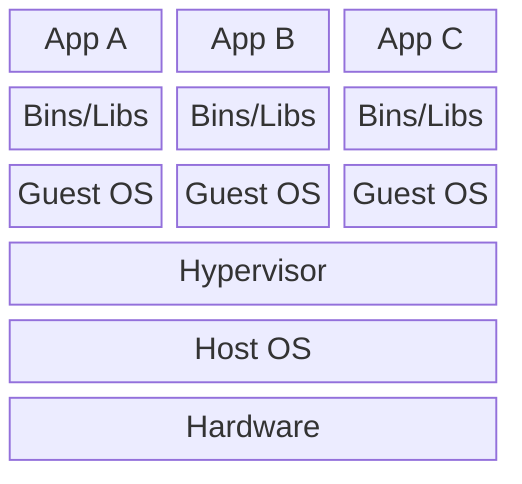
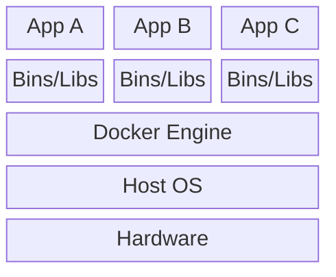

# Docker 입문

컨테이너 기술의 이해와 실전 활용

<div class="pt-12">
  <span class="px-2 py-1 rounded cursor-pointer" hover="bg-white bg-opacity-10">
    Press Space for next page <carbon:arrow-right class="inline"/>
  </span>
</div>

<div class="abs-br m-6 flex gap-2">
  <a href="https://docs.docker.com" target="_blank" alt="Docker Docs"
    class="text-xl slidev-icon-btn opacity-50 !border-none !hover:text-white">
    <carbon-document />
  </a>
</div>

---
layout: center
---

# 오늘 다룰 내용

<v-clicks>

1. **가상화 기술의 진화** - VM에서 컨테이너로
2. **Docker 핵심 개념** - 이미지, 컨테이너, 레지스트리
3. **Dockerfile 작성법** - 나만의 이미지 빌드
4. **Docker Compose** - 멀티 컨테이너 오케스트레이션

</v-clicks>

---
layout: two-cols
---

# 전통적 배포의 문제

<v-clicks>

- "내 컴퓨터에서는 되는데..."
- 환경 차이로 인한 장애
- 서버 세팅에 수일 소요
- 라이브러리 버전 충돌
- OS 의존성 문제

</v-clicks>

::right::

<div class="ml-4 mt-12">

```text {all|1-3|4-6|all}
개발 환경          운영 환경
├── Python 3.11    ├── Python 3.8
├── Ubuntu 22.04   ├── CentOS 7
├── libssl 3.0     ├── libssl 1.1
├── Node 20        ├── Node 16
└── Redis 7.0      └── Redis 6.2
```

</div>

<v-click>

<div class="ml-4 mt-4 p-3 bg-red-500 bg-opacity-20 rounded">
  환경 불일치 = 배포 실패
</div>

</v-click>

---

# 가상화 기술의 진화



---

# 컨테이너 vs VM

<div class="grid grid-cols-2 gap-8">
<div>

### Virtual Machine



</div>
<div>

### Container



</div>
</div>

<v-click>

<div class="mt-4 text-center text-lg font-bold text-green-400">
  Guest OS가 없다 = 가볍고 빠르다
</div>

</v-click>

---

# 컨테이너 vs VM - 상세 비교

| 항목 | VM | Container |
|------|-----|-----------|
| **부팅 시간** | 분 단위 | 초 단위 |
| **용량** | GB 단위 | MB 단위 |
| **성능** | 하이퍼바이저 오버헤드 | 네이티브에 근접 |
| **격리 수준** | 완전한 OS 격리 | 프로세스 격리 |
| **이식성** | 하이퍼바이저 의존 | 어디서나 동일 실행 |
| **밀도** | 서버당 수십 개 | 서버당 수백~수천 개 |

<v-click>

<div class="mt-4 p-4 bg-blue-500 bg-opacity-20 rounded">
  <strong>핵심:</strong> 컨테이너는 호스트 OS의 커널을 공유하므로 Guest OS가 필요 없다.
  이것이 빠른 시작과 적은 리소스의 비결이다.
</div>

</v-click>

---
layout: center
class: text-center
---

# Docker 핵심 개념

<div class="text-6xl mb-8">🐳</div>

이미지 / 컨테이너 / 레지스트리

---

# Docker의 3대 구성요소

<div class="grid grid-cols-3 gap-6 mt-8">

<v-click>

<div class="p-4 bg-blue-500 bg-opacity-20 rounded text-center">
  <div class="text-3xl mb-2">📦</div>
  <h3>Image</h3>
  <p class="text-sm">읽기 전용 템플릿<br/>앱 실행에 필요한 모든 것 포함</p>
</div>

</v-click>

<v-click>

<div class="p-4 bg-green-500 bg-opacity-20 rounded text-center">
  <div class="text-3xl mb-2">🏃</div>
  <h3>Container</h3>
  <p class="text-sm">이미지의 실행 인스턴스<br/>격리된 프로세스</p>
</div>

</v-click>

<v-click>

<div class="p-4 bg-purple-500 bg-opacity-20 rounded text-center">
  <div class="text-3xl mb-2">🏪</div>
  <h3>Registry</h3>
  <p class="text-sm">이미지 저장소<br/>Docker Hub, ECR, GCR</p>
</div>

</v-click>

</div>

<v-click>

<div class="mt-8 text-center">

```
Dockerfile → (build) → Image → (run) → Container
                         ↕ (push/pull)
                       Registry
```

</div>

</v-click>

---

# Docker 기본 명령어

```bash {1|3|5|7|9|11|all}
# 이미지 다운로드
docker pull nginx:latest

# 컨테이너 실행
docker run -d -p 8080:80 --name my-nginx nginx:latest

# 실행 중인 컨테이너 확인
docker ps

# 컨테이너 로그 확인
docker logs my-nginx

# 컨테이너 중지 및 삭제
docker stop my-nginx && docker rm my-nginx
```

<v-click>

<div class="mt-4 p-3 bg-yellow-500 bg-opacity-20 rounded">
  <strong>-d:</strong> 백그라운드 실행 &nbsp;|&nbsp;
  <strong>-p:</strong> 포트 매핑 (호스트:컨테이너) &nbsp;|&nbsp;
  <strong>--name:</strong> 컨테이너 이름 지정
</div>

</v-click>

---

# Dockerfile이란?

Docker 이미지를 빌드하기 위한 **설계도**

<v-clicks>

- 텍스트 파일에 이미지 빌드 명령을 순서대로 작성
- 각 명령이 **레이어(layer)** 를 생성
- 레이어는 캐싱되어 빌드 속도 향상
- 재현 가능한(reproducible) 빌드 보장

</v-clicks>

<v-click>

<div class="mt-6">

```
┌─────────────────────────┐
│  RUN apt-get install    │ ← Layer 4
├─────────────────────────┤
│  COPY . /app            │ ← Layer 3
├─────────────────────────┤
│  WORKDIR /app           │ ← Layer 2
├─────────────────────────┤
│  FROM python:3.11-slim  │ ← Layer 1 (Base)
└─────────────────────────┘
```

</div>

</v-click>

---

# Dockerfile 기본 문법

```dockerfile {1|3-4|6-7|9-10|12-13|15-16|18|all}
FROM python:3.11-slim

# 작업 디렉토리 설정
WORKDIR /app

# 의존성 파일 먼저 복사 (캐시 활용)
COPY requirements.txt .

# 의존성 설치
RUN pip install --no-cache-dir -r requirements.txt

# 소스코드 복사
COPY . .

# 포트 노출 선언
EXPOSE 8000

# 컨테이너 시작 명령
CMD ["uvicorn", "main:app", "--host", "0.0.0.0", "--port", "8000"]
```

<v-click>

<div class="mt-2 p-3 bg-green-500 bg-opacity-20 rounded">
  <strong>Best Practice:</strong> 변경이 적은 레이어를 위에, 변경이 잦은 레이어를 아래에 배치하면 캐시 효율이 올라간다.
</div>

</v-click>

---

# Dockerfile 주요 명령어 정리

| 명령어 | 용도 | 예시 |
|--------|------|------|
| `FROM` | 베이스 이미지 지정 | `FROM node:20-alpine` |
| `WORKDIR` | 작업 디렉토리 설정 | `WORKDIR /app` |
| `COPY` | 파일 복사 (호스트 → 이미지) | `COPY package.json .` |
| `RUN` | 빌드 시 명령 실행 | `RUN npm install` |
| `ENV` | 환경 변수 설정 | `ENV NODE_ENV=production` |
| `EXPOSE` | 포트 문서화 | `EXPOSE 3000` |
| `CMD` | 컨테이너 시작 명령 | `CMD ["node", "server.js"]` |
| `ENTRYPOINT` | 고정 실행 명령 | `ENTRYPOINT ["python"]` |

<v-click>

<div class="mt-4 p-3 bg-yellow-500 bg-opacity-20 rounded">
  <strong>CMD vs ENTRYPOINT:</strong> CMD는 실행 시 덮어쓸 수 있고, ENTRYPOINT는 고정된다.
  둘을 조합하면 ENTRYPOINT가 명령, CMD가 기본 인자 역할을 한다.
</div>

</v-click>

---

# 이미지 빌드와 실행

```bash {1-2|4-5|7-8|10-11|all}
# 이미지 빌드
docker build -t my-app:1.0 .

# 빌드된 이미지 확인
docker images | grep my-app

# 컨테이너 실행
docker run -d -p 8000:8000 --name my-app my-app:1.0

# 동작 확인
curl http://localhost:8000
```

<v-click>

<div class="mt-6 p-4 bg-blue-500 bg-opacity-20 rounded">

**`.dockerignore` 파일도 잊지 마세요!**

```text
node_modules/
.git/
*.md
.env
```

불필요한 파일을 제외하면 이미지 크기가 줄고, 빌드가 빨라진다.

</div>

</v-click>

---
layout: center
class: text-center
---

# Docker Compose

멀티 컨테이너 애플리케이션 관리

<div class="text-lg mt-4 text-gray-400">
"하나의 파일로 전체 스택을 정의하고 실행한다"
</div>

---

# Docker Compose가 필요한 이유

실제 서비스는 여러 컨테이너로 구성된다.

<v-click>

```
┌──────────────────────────────────────────┐
│            docker-compose.yml            │
├──────────┬──────────┬──────────┬─────────┤
│  Web App │   API    │   DB     │  Cache  │
│  (Nginx) │ (Python) │ (Postgres)│ (Redis) │
│  :80     │  :8000   │  :5432   │  :6379  │
└──────────┴──────────┴──────────┴─────────┘
```

</v-click>

<v-click>

<div class="mt-4">

개별 `docker run` 명령으로 관리하면?

```bash
docker run -d --name db -e POSTGRES_PASSWORD=secret postgres:15
docker run -d --name cache redis:7-alpine
docker run -d --name api --link db --link cache -p 8000:8000 my-api
docker run -d --name web --link api -p 80:80 my-web
```

복잡하고 실수하기 쉽다!

</div>

</v-click>

---

# docker-compose.yml 작성

```yaml {1|2-11|12-18|19-25|26-28|all}
version: "3.8"
services:
  web:
    build: ./frontend
    ports:
      - "80:80"
    depends_on:
      - api
    environment:
      - API_URL=http://api:8000

  api:
    build: ./backend
    ports:
      - "8000:8000"
    depends_on:
      - db
      - cache

  db:
    image: postgres:15-alpine
    environment:
      - POSTGRES_DB=myapp
      - POSTGRES_PASSWORD=secret
    volumes:
      - db-data:/var/lib/postgresql/data

  cache:
    image: redis:7-alpine

volumes:
  db-data:
```

---

# Docker Compose 명령어

```bash {1-2|4-5|7-8|10-11|13-14|16-17|all}
# 전체 스택 시작 (백그라운드)
docker compose up -d

# 전체 스택 중지
docker compose down

# 로그 확인 (실시간)
docker compose logs -f api

# 특정 서비스만 재빌드 & 재시작
docker compose up -d --build api

# 실행 중인 서비스 상태 확인
docker compose ps

# 스택 중지 + 볼륨까지 삭제
docker compose down -v
```

<v-click>

<div class="mt-4 p-3 bg-green-500 bg-opacity-20 rounded">
  <strong>Tip:</strong> <code>docker compose watch</code> 를 사용하면 파일 변경 시 자동으로 컨테이너가 업데이트된다. (Compose v2.22+)
</div>

</v-click>

---
layout: center
---

# 핵심 정리

<div class="grid grid-cols-2 gap-6 mt-8">

<div class="p-6 bg-blue-500 bg-opacity-10 rounded">

### 컨테이너 vs VM

<v-clicks>

- 컨테이너는 OS 커널을 공유
- VM보다 가볍고 빠름 (초 단위 시작)
- 프로세스 수준 격리

</v-clicks>

</div>

<div class="p-6 bg-green-500 bg-opacity-10 rounded">

### Dockerfile

<v-clicks>

- 이미지 빌드의 설계도
- 레이어 기반 캐싱 구조
- 변경 빈도에 따라 순서 배치

</v-clicks>

</div>

<div class="p-6 bg-purple-500 bg-opacity-10 rounded">

### Docker Compose

<v-clicks>

- 멀티 컨테이너 관리 도구
- YAML 하나로 전체 스택 정의
- 개발 환경 구성에 필수

</v-clicks>

</div>

<div class="p-6 bg-orange-500 bg-opacity-10 rounded">

### 다음 단계

<v-clicks>

- 멀티스테이지 빌드
- Docker 네트워크 심화
- Kubernetes로 확장

</v-clicks>

</div>

</div>

---
layout: end
---

# 감사합니다

Docker와 함께 "내 컴퓨터에서는 되는데..."를 해결하세요!

<div class="mt-8 text-gray-400">

📖 [Docker 공식 문서](https://docs.docker.com) &nbsp;|&nbsp;
🎮 [Docker 실습 환경](https://labs.play-with-docker.com)

</div>
